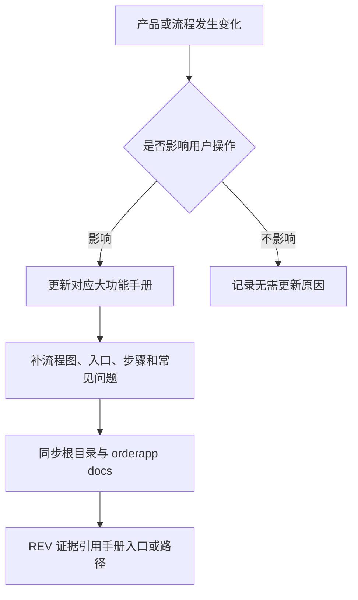

# 操作手册总索引

> 目的：把“用户怎么操作系统”沉淀成可查、可验收、可同步部署的手册，避免功能做完但现场不知道怎么用。

## 维护规则
- 开发时只要改变用户操作方式，就必须更新操作手册。字段、按钮、入口、权限、导入导出、异常处理、流程顺序变化都算。
- 单个大功能一个独立手册。小改动更新所属大功能手册，不把多个大功能混在一个长文档里。
- 手册必须写清：入口、适用角色、前置条件、标准步骤、结果校验、常见问题、关联数据影响。
- 手册必须有图示：每个大功能 `OP_MANUAL_*.md` 至少包含一个 `## 流程图` 和 Mermaid `flowchart`，让操作人员先看流程再看文字。
- 需求完成前必须检查现有手册是否缺入口、缺字段、缺步骤、缺权限说明、缺导入导出说明、缺排障说明。
- REV 证据必须包含手册路径；部署时必须把手册同步到 `/app/docs`。

## 当前手册
- 手册入口必须直接放在对应大功能菜单内，不单独建立“手册”或“文档”菜单。
- `OP_MANUAL_WORKSPACE_MODE.md`：工厂总览 / 客户账户两种页面排布、全局客户上下文和页面复用规则。
- `OP_MANUAL_REQUIREMENTS.md`：需求管理 5 张表和证据闭环。
- `OP_MANUAL_ORDER_SALES.md`：录单、订单列表、客户档案、销售单、合同盖章和出库单。
- `OP_MANUAL_PRODUCTION.md`：生产计划、生产中、工单、工序卡、生产成本、生产日志、分配批次。
- `OP_MANUAL_INVENTORY_MATERIALS.md`：物料、原料入库、批次、库存流水、库存调整、BOM。
- `OP_MANUAL_COSTING.md`：成本参数、成本试算、豆单预览、价格发布。
- `OP_MANUAL_GREEN_BEAN_SALES.md`：生豆产品建档、绑定熟豆 BOM、生豆豆单、ERP 录单和小程序下单。
- `OP_MANUAL_FINANCE.md`：财务首页、费用管理、月度结账、经营报告、票税台账、财务设置。
- `OP_MANUAL_SETTINGS_AUDIT.md`：设备产能、发货人、代加工模板、部门员工、操作日志。
- `OP_MANUAL_NOTIFICATIONS.md`：通知规则、ERP 站内通知和外部 IM 扩展框架。
- `OP_MANUAL_CUSTOMER_PORTAL.md`：客户门户配置、小程序主题、商城商品、小程序商城下单。
- `OP_MANUAL_CUSTOMER_FULFILLMENT.md`：客户履约账户、Excel 导入、客户托管库存、代发订单、费用和月结。

## 手册维护流程图

## 2026-05-07 查缺补漏结果
- 已补操作手册总索引，统一命名和维护规则。
- 已补大功能级初版手册，覆盖当前 Vue/Vite 左侧菜单里的主要用户操作区。
- 已将手册入口放入各大功能菜单，并删除被大功能手册覆盖的旧 `*-user-manual.md` 文档。
- 已为所有大功能手册补充流程图，并让 Vue/Vite 通用手册页展示节点和箭头图示。
- 已补 `HOW_TO_WORKFLOW.md`：操作手册更新进入固定交付流程。
- 已补 `DEPLOYMENT.md` 和 `deploy_orderapp.sh`：部署时同步 `OPERATION_MANUALS.md` 和 `OP_MANUAL_*.md`。
- 后续新增大功能时，必须新增对应 `OP_MANUAL_<FEATURE>.md`，并把入口放在对应大功能菜单里。

## 后续必须补的手册
- 任何仍由旧 HTML 模板承载的页面迁移到 Vue/Vite 后，要把真实入口和步骤补进对应手册。
