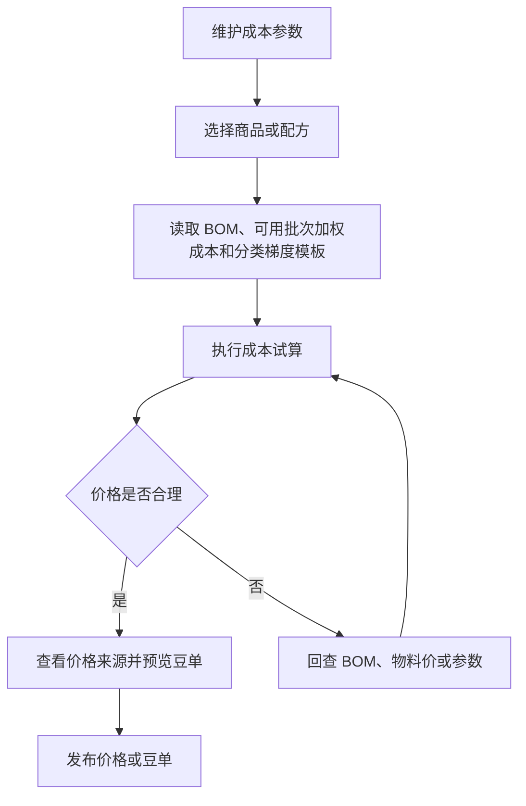

# 操作手册：成本核算

## 适用范围
成本参数设置、成本试算、豆单预览、价格发布。

## 入口
- 商品与配方：产品豆单
- 物料管理：成本核算
- 设置：成本参数设置

## 流程图

## 标准操作
1. 先进入成本参数设置，检查基础换算、生产包装、零售税费/物流、挂耳成本/物流等参数；生豆到熟豆出成率在 BOM 或产品出成率中维护，商用熟豆、零售熟豆和挂耳利润系数在梯度模板或挂耳供应价模板中维护。
2. 进入成本核算，选择商品或配方，确认物料、BOM、当前可用批次成本和试算参数。
3. 执行成本试算，查看成本、供应价、零售价、挂耳价和商用梯度价格。
4. 如需维护挂耳供应价，先确认挂耳商品的每袋克重、每盒袋数和挂耳供应价模板档位。
5. 查看豆单预览，确认风味、产地、处理法、等级、海拔等展示信息。
6. 在产品豆单的“豆单版本列表”按“公共豆单”或具体履约客户查看版本；需要客户自己的豆单时先在 SKU设置 选择客户并按需开启公共 SKU/公共商品分类引用，再回到产品豆单的生成抽屉选择该客户。
7. 生成或发布豆单前确认发布范围：官方豆单用于公共兜底，客户豆单用于指定客户。
8. 确认无误后发布价格或豆单，让录单、报价和客户侧展示使用新版本。

## 梯度模板和价格来源
- 先在 SKU设置 维护梯度模板：每个模板选择一个展示单位（元/磅、元/kg、元/227g、元/100g、元/250g），每个档位填写区间名、最小/最大数量和利润率；系统会按展示单位换算为后台克重区间，例如元/磅按 454g 计算。
- 每个二级分类选择一个梯度模板；分类下产品会自动继承模板。客户归属下可开启公共梯度模板引用；客户分类选择公共模板时，系统会先复制为客户模板再绑定，避免客户修改影响公共模板。也可以在 SKU设置 的梯度模板列表点“复制为客户模板”，先复制公共模板，再改客户模板名称、档位和利润率。
- 若某个公共 SKU 或客户自有/客户定制 SKU 需要长期使用不同利润率，在 SKU设置 的“客户SKU列表”填写该行“产品级利润率覆盖”；系统会用该产品利润率覆盖二级分类梯度模板利润率，清空后恢复继承二级分类模板。客户归属下的公共 SKU 引用行只读，不能直接改公共利润率；需要客户自己的利润率时，先复制为客户 SKU，再在客户 SKU 行填写覆盖值。
- 成本核算和商用豆单中的“来源”按钮可打开价格来源抽屉，查看模板、当前试算、临时试算和公式步骤。
- 公式步骤会展示生豆成本、出成率、kg/lb 换算、生产成本、包装成本、损耗、税费、利润率和最终价格等关键值。
- 熟豆成本试算中的原料成本来自 BOM 物料的当前可用批次加权平均成本：`Σ(批次当前可用克重 × 批次单位成本) ÷ Σ(批次当前可用克重)`；没有可用批次时才回退物料默认采购价。
- 如果入库价格录错，先到库存调整单选择“批次成本”修正对应原料批次；不要直接改物料档案采购价来影响已入库库存。
- 商用价格来源抽屉可以临时输入生豆成本、出成率和利润率并点击“重新试算”，用于查看该档价格变化；这些参数只影响当前抽屉结果，不保存到成本参数、BOM/产品出成率或梯度模板。
- 需要长期调整生豆成本、出成率或利润率时，按参数来源回到成本参数设置、BOM/产品出成率、SKU设置 的梯度模板或挂耳供应价模板维护。
- 修改快速成本参数或梯度模板后，只会刷新未发布的成本试算和豆单预览；已发布豆单、录单和客户下单价格不会静默改变，必须重新发布价格或豆单后才生效。
- 生豆豆单不套用熟豆销售公式。系统只按生豆 SKU 绑定熟豆 BOM 中保存的原料成本快照生成默认成本参考价；拼配按 BOM 比例加权，单品取 BOM 中对应原料成本。生豆销售价可在产品豆单页面的生豆豆单预览区直接按档位修改，档位区间和价格单位都跟随模板，KG 模板按元/KG 输入和发布；页面会提示“梯度按 KG，单价按元/KG”。点击“保存生豆价格”会保存为当前豆单范围下的生豆豆单草稿，也可在生成抽屉中维护；只有生成并发布新版豆单后，录单才会使用新价格。

## 豆单版本
- 每次发布豆单都会生成一条已发布版本，版本号、配置、内容、归属客户、发布时间和更新说明都保留在产品豆单的“豆单版本列表”中。
- 页面顶部的“豆单范围”下拉列出“公共豆单”和每个履约客户；选择某个客户后，下方版本列表只展示该客户的豆单版本。可在版本列表中按豆单类型筛选，点击“生成新版”会按当前归属和豆单类型打开生成抽屉，不再复制历史配置；管理员可撤回当前仍在发布状态的版本。
- 在版本列表点击“下载 PDF”会按该行版本的已锁定内容和样式打开浏览器打印/保存 PDF，不会用当前实时价格、当前抽屉配置或当前筛选结果改写历史豆单。
- 客户小程序打开同一版本 PDF 时由系统按版本缓存。第一次打开时生成并保存；后续访问同一版本直接复用缓存，不重复生成。
- 官方豆单是没有专属客户时的公共兜底；客户豆单只对归属客户生效，客户自己的历史版本可继续追溯，但新版本按当前 SKU 设置和本次抽屉设置直接生成。
- 客户豆单打开“生成豆单”时，版本号会默认从当前客户已发布版本或复制的官方价格源版本递增一小步：`V1` 默认 `V1.01`，`V1.01` 默认 `V1.02`，`V3.0.5` 默认 `V3.0.6`。如需大版本号，可在发布前手动改版本号。
- ERP 录单按熟豆、生豆、挂耳分别选择豆单版本，默认使用当前客户对应类型的最新发布版本；没有客户专属版本时使用公共版本。订单商品行保存实际匹配的发布 ID 和版本号。
- 发布新版豆单时，在更新说明中写清新增、下架和价格/文案调整，客户小程序首次下单提示会引用这些内容。
- 发布、撤回、缓存生成和客户确认新版都会写入操作日志，便于追溯谁在什么时间改变了可用豆单。

## 挂耳供应价模板
- 挂耳商品需要在 SKU设置 维护为“挂耳”类型，并填写每袋熟豆克重和每盒袋数。
- 系统默认提供“默认挂耳供应价”模板，档位为 100袋、1000袋、5000袋、10000袋；每档维护最小袋数和倍率。
- 成本核算发布价格时，会把挂耳价格发布为交易快照：按袋一组价格，按盒一组价格。盒价按“含包装单袋价 × 每盒袋数”计算，盒装最小数量按“最小袋数 ÷ 每盒袋数”向上取整。
- 挂耳价格来源包含模板、档位、单袋克重、每盒袋数、裸袋价、含包装价、倍率和税率。模板停用只影响后续试算和维护入口，不会删除已经发布到交易价格表的历史快照。
- 挂耳价格解释接口可查看熟豆成本/kg、单袋克重、加工成本、额外成本、倍率、税率、含包装袋价和盒装换算。
- 新增、修改、停用挂耳供应价模板会写入操作日志；发布价格批次也会写入操作日志。

## 客户上下文
- SKU设置 顶部仍通过“SKU归属”维护公共 SKU、客户 SKU、商品分类和梯度模板，不再内嵌豆单或价格试算。
- SKU归属的客户下拉只包含履约客户；即使客户还没有专属 SKU，也可以先选中客户并初始化客户自己的 SKU 和商品分类。
- 默认公共SKU时不展示“客户专属 SKU”模块；选中履约客户后，“新增公共产品”隐藏；“客户专属 SKU”使用顶部已选客户，不再重复选择客户。
- 创建客户专属 SKU 时先选择产品形态和定制类型：定制烘焙度不选择基础产品，也不会复制基础产品 BOM 或价格梯度；公共 SKU 改名才选择基础产品并可复制配置。生豆不选择基础产品，只填写生豆属性并绑定熟豆；绑定熟豆下拉只显示公共熟豆和当前客户真正自定义的熟豆，不显示公共 SKU 别名复制件或其他客户 SKU；挂耳会展示每袋克重和每盒袋数。非定制烘焙度的熟豆和挂耳基础产品下拉会按当前形态筛选公共 SKU。该创建区在客户归属下横向铺满页面，字段较多时仍在同一面板内完成，不需要到右侧空白区外查找配置项。
- 在“商品分类 · 客户SKU”中打开“是否使用公共商品分类”会把公共分类作为只读引用显示，分类下的公共 SKU 也会作为只读引用展示，可拖到客户分类或公共分类中形成客户自己的 SKU/分类关系，但不能直接改公共 SKU 字段；在“客户SKU列表 · 客户 SKU”中打开“是否使用公共SKU”会把公共 SKU 作为只读引用显示；在“梯度模板”中打开“是否使用公共梯度模板”会把公共模板作为只读引用显示。开关关闭后，对应公共模板会从当前客户视图移除，但客户自有一级/二级分类和已挂载的客户 SKU 必须继续显示。
- 公共分类、公共 SKU 和公共梯度模板本身不直接改写。客户真正需要差异化时，复制公共分类为客户分类、复制公共 SKU 为客户 SKU、在梯度模板列表点“复制为客户模板”，或在客户分类绑定公共梯度模板时由系统自动复制客户模板；复制某个公共二级分类后，同一公共一级分类下未复制的二级分类仍继续作为公共引用显示，不会因为父级已派生而消失；所有开关、复制、拖拽和模板绑定都会写入操作日志。
- 客户自有/客户定制 SKU 行可直接维护“产品级利润率覆盖”；公共引用行的覆盖输入会禁用，避免在客户视角误改公共利润率。
- 客户SKU列表可按形态、类型、搜索关键词、一级分类和二级分类筛选；类型包含标准、公共 SKU 改名、定制烘焙和定制拼配，搜索可匹配商品名称、类型标签和备注；列表最右侧的“备注”用于记录 SKU 级说明，公共引用行只读展示备注；筛选会先匹配当前归属下全部 SKU，再按分页展示，切换筛选条件后回到第一页。
- 客户自己的商品分类先在 SKU设置 中按“SKU归属”维护；进入产品豆单后在页面顶部“豆单范围”选择公共豆单或某个履约客户。
- BOM 配方维护也按“SKU归属”切换公共 SKU 或客户 SKU，但只显示需要维护自身 BOM 的熟豆、挂耳等商品。生豆 SKU 自身不维护 BOM；它在 SKU设置 中绑定熟豆后，BOM 配方维护页不会再把该生豆 SKU 列出来。
- 产品豆单页面顶部“豆单范围”是生成和发布的唯一归属上下文：当前为公共豆单时发布公共豆单，当前为某个履约客户时发布该客户豆单。进入“生成豆单”抽屉后只会显示“当前归属”，不再二次选择发布归属或客户。
- 产品豆单预览区按商用批发、挂耳、零售、生豆四个豆单类型展示，每个类型都可以收起或展开；生豆豆单有独立预览区，档位区间按 `1-59kg`、`60kg+` 这类模板区间展示，KG 模板的档位价格输入框是元/KG。改完后点击“保存生豆价格”，系统会把当前价格保存成生豆豆单草稿；正式对外报价和录单自动价仍需进入“生成豆单”并发布新版后才生效。
- 如果生豆卡片提示“未挂到带生豆模板的分类”，说明该生豆 SKU 没有挂到 SKU设置 里绑定了生豆梯度模板的生豆分类。先到 SKU设置 把它移动到正确的生豆分类，再回到产品豆单刷新并维护价格。
- 选择公共/官方归属时，产品豆单展示公共SKU的豆单预览、公共豆单和公共分类。
- 选择某个履约客户范围时，产品豆单先读取 SKU设置 里该客户的“是否使用公共商品分类”开关：关闭时只展示该客户自己的 SKU，不混入公共分类或公共 SKU；开启后才会把公共分类下的公共 SKU 作为只读引用放入客户豆单预览和生成候选。生成豆单默认保存到该客户归属。
- 客户自有/客户定制熟豆不再依赖旧 Excel 豆单资料。只要在 SKU设置 中挂到当前客户自己的商品分类，产品豆单客户范围会按该 SKU 的分类路径和排序生成商用批发豆单分组；标题沿用公共豆单逻辑，优先显示实际豆单分类名。例如挂到“咖啡豆 / 定制咖啡熟豆”的 SKU 会显示在“1、定制咖啡熟豆”分组下，不会落到旧公共豆单“源产地精选”，也不会因为缺少旧豆单编码而不显示。
- 产品豆单的商用、零售、生豆、挂耳四种豆单分别读取自己的豆单信息和价格档；生豆豆单使用生豆豆单字段，不会落到商用豆单字段导致界面为空。
- 挂耳豆单不再有外层独立生成按钮；点击“生成豆单”后在抽屉的“豆单类型”中选择“挂耳豆单”。
- 生成豆单不再提供“复制已有豆单配置”。SKU、分类和梯度模板差异先在 SKU设置 中处理，产品豆单按当前数据和本次抽屉设置直接生成。
- 客户自己的豆单会读取产品豆单中的豆单范围，后续发布或保存草稿时要确认范围正确，避免把客户自己的豆单内容保存到错误客户。
- 如果只想维护官方豆单，在产品豆单中把“豆单范围”切回公共豆单。

## BOM失效处理
- 成本核算页如果顶部出现 “BOM已失效”，表示至少有一款产品的当前 BOM 被手动失效或跟随产品失效。
- 商品行和豆单预览区域会显示 “BOM已失效” 警示，提醒该产品的成本和豆单不应作为正式发布依据。
- 发布价格策略或豆单前，先到 BOM 配方维护检查该商品：需要继续销售时，重新保存配方、同步出品率或启用历史版本；不再销售时，保持产品失效。
- BOM失效不会删除历史明细，成本核算仍可用于追溯和检查，但不能静默当作有效 BOM。

## 结果校验
- 成本试算结果能复现当前 BOM、可用批次加权成本和成本参数。
- BOM失效 产品在成本核算和豆单预览中都有明显 “BOM已失效” 警示。
- 商用梯度、零售价、挂耳价显示完整。
- 客户豆单的商用批发豆单标题与公共豆单一致，优先使用二级豆单分类；客户 SKU 挂到“咖啡豆 / 定制咖啡熟豆”时标题应为“1、定制咖啡熟豆”。
- 绑定梯度模板的二级分类按模板档位生成商用梯度价格，价格来源能解释每一步计算。
- 挂耳商品按挂耳供应价模板生成袋价和盒价，发布后 `product_price_tiers` 保留按袋/按盒快照，不随模板停用或修改自动变化。
- 豆单信息来自物料咖啡豆资料，不应回退为空白或旧字段。
- 已发布豆单版本列表在产品豆单中可追溯；点击“下载 PDF”会由服务器按该版本快照生成并保存 PDF，不再调用浏览器打印窗口。PDF 使用生成抽屉预览的卡片样式，旧文本版缓存会自动按新版预览样式重新生成覆盖。
- 生成抽屉中的“生成 PDF”会先把当前预览保存为草稿快照，再由后端生成预览样式 PDF 并下载；不会打开系统打印窗口。
- 发布后商品档案、录单或报价使用新价格。

## 常见问题
- 成本明显异常：先查 BOM 用量，再查当前可用原料批次成本、是否有待处理/不通过批次被排除，以及成本参数。
- 批次价格录错：到库存调整单选择“批次成本”修正目标成本/千克，再回到成本核算重新试算。
- 看到 BOM已失效：回到 BOM 配方维护确认是否重新启用；不要直接发布该商品豆单。
- 豆单信息缺失：回到物料档案补齐咖啡豆信息。
- 客户新增熟豆 SKU 在客户豆单中不出现：先确认 SKU设置 顶部归属为该客户、SKU 已挂到客户自己的商品分类；若是客户自有/客户定制熟豆，产品豆单会按客户分类自动生成商用豆单条目，不需要旧 Excel 豆单资料。若刚勾选再取消“是否使用公共商品分类”，客户自有分类仍应保留；若分类消失，应检查后端 schema 修复是否已重新启用仍有 active 子分类的父分类。
- 下载豆单 PDF 没有弹出文件：先确认该版本有 `content/groups` 快照；再检查后端 `/api/costing/bean-list/publications/:id/pdf` 是否生成成功，以及 `bean_list_publication_assets` 中是否已有该版本 `pdf` 资产。若看到旧文本版豆单，重新点击“下载 PDF”或“生成 PDF”，系统会按新版 `bean-list-preview-style-v1` 缓存键重新生成预览样式文件。
- 发布后录单价格未变：检查是否发布成功、商品规格是否匹配、页面是否刷新。
- 挂耳盒价数量不对：检查产品设置里的每盒袋数；发布时盒装最小数量会向上取整。
- 参数解释不清：打开价格来源抽屉查看公式步骤；商用豆单可先用临时生豆成本、出成率或利润率重新试算定位影响。如果源参数错误，按参数来源回到成本参数设置、BOM/产品出成率、梯度模板或挂耳供应价模板保存后刷新豆单数据。
