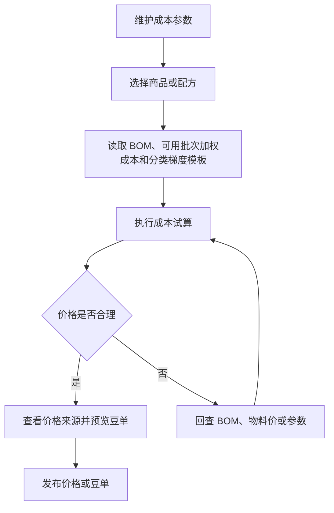

# 操作手册：成本核算

## 适用范围
成本参数设置、成本试算、豆单预览、价格发布。

## 入口
- 物料管理：成本核算
- 设置：成本参数设置

## 流程图

## 标准操作
1. 先进入成本参数设置，检查基础换算、生产包装、商用熟豆、零售熟豆、挂耳等参数。
2. 进入成本核算，选择商品或配方，确认物料、BOM、当前可用批次成本和试算参数。
3. 执行成本试算，查看成本、供应价、零售价、挂耳价和商用梯度价格。
4. 如需维护挂耳供应价，先确认挂耳商品的每袋克重、每盒袋数和挂耳供应价模板档位。
5. 查看豆单预览，确认风味、产地、处理法、等级、海拔等展示信息。
6. 确认无误后发布价格，让录单和报价使用新价格。

## 梯度模板和价格来源
- 先在产品设置维护梯度模板：每个模板选择一个展示单位（元/磅、元/kg、元/227g、元/100g、元/250g），每个档位填写区间名、最小/最大数量和利润率；系统会按展示单位换算为后台克重区间，例如元/磅按 454g 计算。
- 每个二级分类选择一个梯度模板；分类下产品会自动继承模板。
- 若公共SKU里某个产品需要长期使用不同利润率，在产品设置的“客户SKU列表 · 公共SKU”填写该行“产品级利润率覆盖”；系统会用该产品利润率覆盖二级分类梯度模板利润率，清空后恢复继承二级分类模板。
- 成本核算和商用豆单中的“来源”按钮可打开价格来源抽屉，查看模板、当前价格、临时试算价和公式步骤。
- 公式步骤会展示生豆成本、出成率、kg/lb 换算、生产成本、包装成本、损耗、税费、利润率和最终价格等关键值。
- 生豆成本来自 BOM 物料的当前可用批次加权平均成本：`Σ(批次当前可用克重 × 批次单位成本) ÷ Σ(批次当前可用克重)`；没有可用批次时才回退物料默认采购价。
- 如果入库价格录错，先到库存调整单选择“批次成本”修正对应原料批次；不要直接改物料档案采购价来影响已入库库存。
- 在价格来源抽屉里修改生豆成本、出成率或利润率只影响当前临时试算，不会保存。需要长期生效时，回到快速成本参数或梯度模板页保存。
- 修改快速成本参数或梯度模板后，只会刷新未发布的成本试算和豆单预览；已发布豆单、录单和客户下单价格不会静默改变，必须重新发布价格或豆单后才生效。

## 挂耳供应价模板
- 挂耳商品需要在产品设置维护为“挂耳”类型，并填写每袋熟豆克重和每盒袋数。
- 系统默认提供“默认挂耳供应价”模板，档位为 100袋、1000袋、5000袋、10000袋；每档维护最小袋数和倍率。
- 成本核算发布价格时，会把挂耳价格发布为交易快照：按袋一组价格，按盒一组价格。盒价按“含包装单袋价 × 每盒袋数”计算，盒装最小数量按“最小袋数 ÷ 每盒袋数”向上取整。
- 挂耳价格来源包含模板、档位、单袋克重、每盒袋数、裸袋价、含包装价、倍率和税率。模板停用只影响后续试算和维护入口，不会删除已经发布到交易价格表的历史快照。
- 挂耳价格解释接口可查看熟豆成本/kg、单袋克重、加工成本、额外成本、倍率、税率、含包装袋价和盒装换算。
- 新增、修改、停用挂耳供应价模板会写入操作日志；发布价格批次也会写入操作日志。

## 客户上下文
- 从产品设置进入下方成本区域时，先在产品设置顶部的“SKU归属”选择客户上下文。
- 选择公共SKU时，成本区展示公共SKU的试算、公共豆单和公共分类。
- 产品设置中的客户自己的商品分类与成本区使用同一个客户上下文，先确认分类和 SKU 归属再生成豆单。
- 选择客户SKU时，成本区展示公共SKU加该客户SKU范围内的客户自己的价格试算；生成豆单默认切到指定客户豆单。
- 客户自己的豆单会读取该客户上下文，后续发布或保存草稿时要确认客户正确，避免把客户自己的价格试算和样式保存到错误客户。
- 如果只想维护官方豆单，先回到“SKU归属”并点击公共SKU。

## BOM失效处理
- 成本核算页如果顶部出现 “BOM已失效”，表示至少有一款产品的当前 BOM 被手动失效或跟随产品失效。
- 商品行和豆单预览区域会显示 “BOM已失效” 警示，提醒该产品的成本和豆单不应作为正式发布依据。
- 发布价格策略或豆单前，先到 BOM 配方维护检查该商品：需要继续销售时，重新保存配方、同步出品率或启用历史版本；不再销售时，保持产品失效。
- BOM失效不会删除历史明细，成本核算仍可用于追溯和检查，但不能静默当作有效 BOM。

## 结果校验
- 成本试算结果能复现当前 BOM、可用批次加权成本和成本参数。
- BOM失效 产品在成本核算和豆单预览中都有明显 “BOM已失效” 警示。
- 商用梯度、零售价、挂耳价显示完整。
- 绑定梯度模板的二级分类按模板档位生成商用梯度价格，价格来源能解释每一步计算。
- 挂耳商品按挂耳供应价模板生成袋价和盒价，发布后 `product_price_tiers` 保留按袋/按盒快照，不随模板停用或修改自动变化。
- 豆单信息来自物料咖啡豆资料，不应回退为空白或旧字段。
- 发布后商品档案、录单或报价使用新价格。

## 常见问题
- 成本明显异常：先查 BOM 用量，再查当前可用原料批次成本、是否有待处理/不通过批次被排除，以及成本参数。
- 批次价格录错：到库存调整单选择“批次成本”修正目标成本/千克，再回到成本核算重新试算。
- 看到 BOM已失效：回到 BOM 配方维护确认是否重新启用；不要直接发布该商品豆单。
- 豆单信息缺失：回到物料档案补齐咖啡豆信息。
- 发布后录单价格未变：检查是否发布成功、商品规格是否匹配、页面是否刷新。
- 挂耳盒价数量不对：检查产品设置里的每盒袋数；发布时盒装最小数量会向上取整。
- 参数解释不清：打开价格来源抽屉查看公式步骤；如果源参数错误，回到成本参数设置或梯度模板保存后再重新试算。
