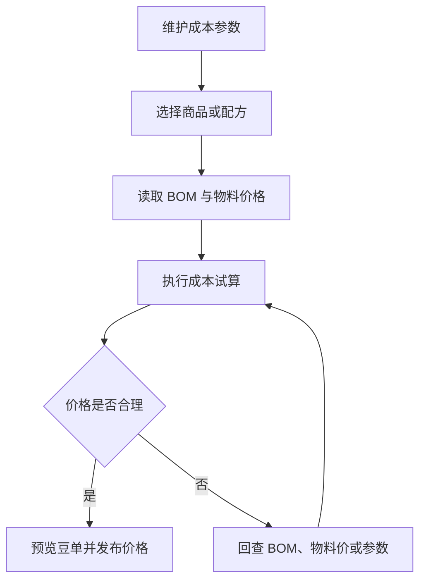

# 操作手册：成本核算

## 适用范围
成本参数设置、成本试算、豆单预览、价格发布。

## 入口
- 物料管理：成本核算
- 设置：成本参数设置

## 流程图

## 标准操作
1. 先进入成本参数设置，检查基础换算、生产包装、商用熟豆、零售熟豆、挂耳等参数。
2. 进入成本核算，选择商品或配方，确认物料、BOM、批次和试算参数。
3. 执行成本试算，查看成本、供应价、零售价、挂耳价和商用梯度价格。
4. 查看豆单预览，确认风味、产地、处理法、等级、海拔等展示信息。
5. 确认无误后发布价格，让录单和报价使用新价格。

## BOM失效处理
- 成本核算页如果顶部出现 “BOM已失效”，表示至少有一款产品的当前 BOM 被手动失效或跟随产品失效。
- 商品行和豆单预览区域会显示 “BOM已失效” 警示，提醒该产品的成本和豆单不应作为正式发布依据。
- 发布价格策略或豆单前，先到 BOM 配方维护检查该商品：需要继续销售时，重新保存配方、同步出品率或启用历史版本；不再销售时，保持产品失效。
- BOM失效不会删除历史明细，成本核算仍可用于追溯和检查，但不能静默当作有效 BOM。

## 结果校验
- 成本试算结果能复现当前 BOM、物料价和成本参数。
- BOM失效 产品在成本核算和豆单预览中都有明显 “BOM已失效” 警示。
- 商用梯度、零售价、挂耳价显示完整。
- 豆单信息来自物料咖啡豆资料，不应回退为空白或旧字段。
- 发布后商品档案、录单或报价使用新价格。

## 常见问题
- 成本明显异常：先查 BOM 用量，再查物料采购价和成本参数。
- 看到 BOM已失效：回到 BOM 配方维护确认是否重新启用；不要直接发布该商品豆单。
- 豆单信息缺失：回到物料档案补齐咖啡豆信息。
- 发布后录单价格未变：检查是否发布成功、商品规格是否匹配、页面是否刷新。
- 参数解释不清：在成本参数设置中补充小字说明，并同步更新本手册。
