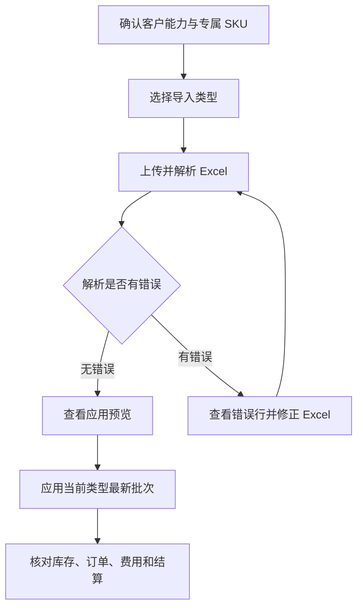

# 操作手册：客户履约账户

## 适用范围
代加工客户、客户自有 SKU、客户托管生豆/包材/成品库存、一件代发订单、运费/代发费/月结费用管理。

## 入口
- 设置：客户履约账户、客户履约手册、客户门户配置。
- 商品与配方：产品设置，用于维护客户专属 SKU。
- 库存管理：仓库库存，用于查看客户代加工仓、客户成品库存和库存流水。
- 订单销售：订单列表，用于查看代发导入形成的订单和发货状态。

## 流程图

## 标准操作
1. 第一次导入前，确认客户档案存在且客户类型为“批发客户”，并在客户门户配置中启用代加工、托管库存、代发、结算等能力。
2. 为代加工客户准备独立代加工仓，避免客户成品和自营库存混在一起。
3. 客户自己的产品作为客户专属 SKU 管理，不放进公共产品列表，也不能直接共用其他客户 SKU。
4. 进入客户履约账户，在“选择客户”中按客户名、公司、联系人或电话搜索客户，并点击载入账户；下拉框只展示存在 active 外部用户且已配置手机号、已设置密码并启用登录的批发客户。
5. 外部用户不在本页维护；如需创建账号、重置密码或启停登录，回到“客户门户配置”的“外部用户”区域处理。外部用户不进入员工维护页，不配置内部角色。
6. 运营台会按客户能力模板只展示可用功能：未开通 `processing` 的公共 SKU 小批量批发/代发客户，不显示代加工工单导入、提交加工工单和加工工单列表；其他导入类型、操作面板和数据列表也只按 `direct_ship`、`inventory_custody`、`settlement` 等已启用能力展示。
7. 选择导入类型：代加工工单、代发清单或结算单。一个 Excel 只按一种类型导入。公共 SKU 小批量客户会把“代发清单”显示为“订单清单”，但导入类型仍是 `direct_ship_workbook`。
7. 上传 Excel 后先解析导入，查看有效行、错误行、工单数、代发订单数和费用明细数。
8. 表头、日期、数量、金额或产品名异常时，先修改 Excel 后重新解析。
9. 导入批次列表中有错误时，点击“查看错误行”，按表名、行号、类型和错误原因修正 Excel 后重新解析。
10. 确认“当前可应用批次”和“应用预览”，再点击“应用当前类型最新批次”；解析和预览都不改变业务数据，只有应用才写入库存、工单、订单和费用。
11. 应用导入批次前确认客户已开通对应能力：代加工工单要求 `processing`，代发清单要求 `direct_ship`，结算单要求 `settlement`；未开通对应能力时先回到客户门户配置启用能力或改选正确客户/导入类型。
12. 在客户履约账户手工提交代加工工单或代发订单前，也要确认客户已开通对应能力；未开通对应能力的客户不能通过内部 API 绕过页面写入工单或代发订单。手工提交订单信息时按“一个收件信息 + 多行商品”录入，逐行选择商品/规格/数量，页面会实时展示阶梯价、行小计，并实时计算订单合计（商品金额 + 运费）。曲奇拼配等 KG 梯度商品按该行总 KG 选档，1000g 及以上保存元/kg 单价并按总 KG 计算小计。
13. 手工调整托管库存前确认客户已开通 `inventory_custody` 能力；未开通托管库存能力的客户不能写库存物料、库存台账或余额。
14. 应用后刷新账户，核对托管库存、加工工单、代发订单、费用明细和结算批次。
15. 月结时先确认该客户已开通结算能力，再填写结算开始和结束日期；未开通结算能力的客户不能生成结算批次，开通后再生成月结并核对结算编号、期间、金额和状态。没有费用可结算时不会生成 0 元空结算批次，接口会返回 `no fees for settlement period`；重复生成同一周期月结不会清零已结费用或结算批次金额，其中草稿批次会把新增未结费用并入同一批次后重算总额。已确认或已结算的月结批次不能通过重复生成同周期月结改动；若结算后发现漏费，先按内部流程撤回或重开草稿，或在后续期间做调整，不要直接覆盖已结算批次。
16. 客户通过客户门户提交代发或代加工发货订单后，可从订单列表“履约客户订单”范围查看；在客户履约账户载入该客户后，运营台最底部的“履约客户订单”会显示该客户订单，字段按 ERP 订单列表展示收件信息、快递信息和订单费用。
17. 点击底部“履约客户订单”的订单号可打开订单详情，核对商品明细、收件信息、状态、备注和订单费用；客户侧工作台账号打开自己绑定客户的订单详情时不需要 ERP 内部 `orders.write` 权限。
18. 履约客户账号自己登录客户侧工作台时，底部也使用同一套“履约客户订单”列表；不要再以旧的“代发订单”小表作为订单核对入口。
19. 如果管理员修改客户引用的能力模板，履约客户账号刷新工作台后会立即按新模板展示功能；模板被标记失效时，该客户工作台和绑定流程会报错，管理员需要重新绑定启用中的模板。
20. 在订单详情中可打开销售单和出库单；销售单、出库单抽屉内都支持下载最新版，销售单支持微信分享销售单，已发货订单的出库单支持微信分享出库单。

## 三类 Excel
| 导入类型 | 适用文件 | 导入后影响 |
| --- | --- | --- |
| 代加工工单 | 客户共享的代加工工单、物料库存、完成情况表 | 维护托管生豆、包材、客户 SKU、加工工单、包装任务、成品库存和相关费用 |
| 代发清单 | 客户每天发送的代发订单表 | 创建客户代发订单、收件人快照、商品明细、代发服务费和后续发货依据 |
| 结算单 | 每月结算代加工费、运费、代发费、仓储费等的表 | 导入或生成费用明细和结算批次，便于月结对账 |

## 结果校验
- 从客户下拉框选择客户后，能载入客户履约账户。
- 客户下拉框只出现存在 active 外部用户且已配置手机号、已设置密码并启用登录的批发客户；零售、电商、未配置手机号、未设置密码、登录已停用或仅剩 inactive 绑定的客户不出现。
- 外部用户改到“客户门户配置”页维护；同一外部用户不能 active 绑定第二个客户。
- 零售商城、其他不暴露 ERP 工作台或无法识别的能力模板不能通过客户履约内部 API 绑定 ERP 工作台账号；接口会返回 `ERP workbench unavailable for capability template`，不会写入启用绑定或隐藏角色。
- 历史遗留 active ERP 工作台绑定如果指向零售商城、其他不暴露 ERP 工作台或无法识别的能力模板，或绑定账号已禁用登录，进入客户履约工作台时会按无有效绑定返回 `customer ERP binding not found` 或 403，不展示该客户工作台数据；手动修改 URL 的 `customer_id` 指向未绑定客户时同样不能载入概览。
- 运营台必须严格按客户能力模板展示功能；公共 SKU 小批量批发/代发客户如果未开通 `processing`，不能看到代加工工单导入、提交加工工单和加工工单列表，表格列要固定对齐，长文件名或长地址不能撑乱布局。
- 公共 SKU 小批量客户的手工提交面板必须显示“提交订单信息”（按钮“提交订单”）；仅一件代发客户（`direct_ship` 且不含 `product_order`）显示“提交代发信息”（按钮“提交代发”）。
- 提交订单信息/提交代发信息必须支持单收件信息多行商品；每行能看到匹配阶梯价和小计，订单合计随行项目和运费实时更新。
- 曲奇拼配等 KG 梯度商品要按总 KG 计价；例如 1000g × 25 袋按 25kg 命中 24-49kg 梯度，81.91 元/kg 展示为 82 元/kg，小计 2050。
- 商品行不再手动“新增”：选择商品后会自动补一条空行，并始终只保留一条空行，避免反复选商品后产生多条空白行。
- 每行支持优惠类型：`减免数额`、`折扣`（90=9折）、`免费`；前端实时计算行小计/订单合计，后端按同规则入单并落地优惠明细。
- 上述运费和优惠输入只保留在 ERP 内部客户履约页；客户网页版工作台和小程序不展示这些输入，客户侧提交时只按实价下单。
- 三类 Excel 都能先解析，解析结果显示有效行和错误行。
- 应用按钮只会应用当前导入类型的最新已解析批次，不能跨类型误应用结算单或代发清单。
- 应用前能看到应用预览；有错误行时能点击查看错误行并按原因修正。
- 解析失败不会改变客户库存、订单或费用。
- 未开通对应客户能力时，应用导入批次会返回 `customer capability ... unavailable`，不会写加工工单、代发订单、费用明细或结算数据。
- 未开通对应客户能力时，手工提交代加工工单或代发订单会返回 `customer capability ... unavailable`，不会写客户工单、代发导入单或 ERP 订单。
- 未开通托管库存能力时，手工调整托管库存会返回 `customer capability inventory_custody unavailable`，不会写库存物料、库存台账或库存余额。
- 应用代加工工单后，能看到托管生豆、包材、客户成品、加工工单和相关费用。
- 应用代发清单后，能看到代发订单、收件人快照、商品明细和代发服务费。
- 客户门户新提交的代发订单，无需 Excel 导入，也能在客户履约账户底部“履约客户订单”看到。
- 底部“履约客户订单”和 ERP 订单列表使用同一套订单费用结构，展示商品金额、运费、优惠和应收。
- ERP 录单页面选择已绑定启用 ERP 工作台账号的履约客户保存订单后，系统会自动把订单标记为履约客户订单；在客户履约账户载入同一客户后，底部“履约客户订单”也应能看到该订单。
- 点击“履约客户订单”订单号后，能看到订单明细、商品行、销售单和出库单入口。
- 客户侧履约工作台与 ERP 后台客户履约账户使用同一套订单数据源和字段；刷新后两边的订单号、费用、收件信息、状态和销售单/出库单入口应一致。
- 客户侧履约工作台提交订单后，点击该订单号能打开详情，不应出现 `orders.write` 或权限不足导致无法查看/核对明细。
- 应用结算单或生成月结后，能看到结算批次和费用汇总。
- 未开通结算能力的客户不能生成结算批次；接口会返回 `customer capability settlement unavailable`，不会留下空结算批次，费用仍保持未结算。
- 没有费用可结算时不会生成 0 元空结算批次；接口会返回 `no fees for settlement period`，费用和批次都不变。
- 重复生成同一周期月结不会清零已结费用或结算批次金额；若批次仍是草稿，新增未结费用会并入同一周期批次后重算总额。
- 已确认或已结算的月结批次不能通过重复生成同周期月结改动；接口会返回 `settlement batch is not draft`，新增补录费用仍保持未结算，原批次金额不变。
- 重复应用同一批次不会重复增加库存、订单或费用。
- 同一客户的同一外部代发订单即使作为不同 Excel 批次重传，系统也只保留一张 ERP 代发订单；相同行号的代发明细和 `order_items` 会更新原行，不会重复翻倍。修正版代发清单如果删除了旧行，应用后多余旧行也会从代发明细和 ERP `order_items` 移除。
- 同一外部代发订单重传并更正订单日期、收件信息或备注时，系统会更新原 ERP 代发订单头快照，订单列表和详情应显示最新 Excel 的日期、收件人、电话、地址和备注。
- 同一外部代发订单重传并更正发货状态时，系统会把已识别的 Excel 状态同步到原 ERP 代发订单发货状态；待发货、未发货和已发货会映射到系统发货状态，未知状态不会覆盖已有 ERP 状态。
- 同一外部代发订单重传并更正运单号时，客户履约导入来源的旧运单号会被新 Excel 运单号替换；如果最新 Excel 运单号为空，旧导入运单号会被清空；手工或其他来源运单号不受影响。
- 同一客户、同一托管物料、同一外部生豆入库或出库流水即使作为不同 Excel 批次重传，系统也只写一条库存台账；增减类托管库存余额不会重复加减。
- 同一外部代加工生产工单可以有多行不同生豆投料，系统会把它们保留为同一工单的多条投料明细，并用投料明细汇总工单投豆量；修正版 Excel 减少或更正投料时，应用后以最新投料集合为准，旧生豆投料会被裁剪。
- 同一库存转换单号重传并更正转换前产品、转换后产品或数量时，系统会更新原库存转换工单，不会因为商品名称变化生成第二张转换工单。
- 同一包装子工单编号重传并更正产品、包装耗材或数量时，系统会更新原包装子工单，不会因为产品或耗材名称变化生成第二张包装子工单。
- 同一外部生豆入库或出库流水重传并更正数量时，系统会更新原库存台账的增减数量，并只按差额修正托管库存余额。
- 同一外部生豆余额或耗材余额重传并更正盘点数时，保持外部余额 key 不变，系统会更新原盘点调整台账 delta，并把托管库存余额调整到最新 Excel 数；库存余额和台账汇总应保持一致。
- 同一客户 SKU 重传并更正名称或烘焙度时，保持 SKU 编码不变，系统会更新原客户专属商品和工作台选择器，不会生成重复商品选项。
- 同一客户、同一外部结算费用行即使作为不同 Excel 批次重传，系统也只复用原费用明细；`customer_fee_items` 不会重复增加，后续月结金额不会被重传抬高。
- 同一外部结算费用行重传并更正未结费用金额、费用类型、日期或名称时，未结且未绑定月结批次的费用明细会以最新 Excel 为准；费用类型或费用名称修正导致完整外部键变化时，系统会按同一结算表和 Excel 行号复用原费用明细，不会生成重复结算费用；已确认或已结算批次不要通过重传改历史账单，应走结账后调整或重新生成草稿月结。

## 常见问题
- 页面没有客户数据：确认客户档案是否存在、客户是否启用、是否已经在下拉框选择客户并点击载入账户；如果客户有历史 ERP 绑定但仍不出现，检查绑定账号是否仍启用登录、能力模板是否暴露 ERP 工作台且模板键能被系统识别。
- 客户履约运营台找不到外部用户入口：这是预期行为；外部用户已经改到“客户门户配置”页维护。
- 选择公共 SKU 小批量批发/代发客户后仍看到代加工入口：先刷新账户；仍存在时检查客户门户配置和 `customer_service_capabilities`，确认该客户 `processing` 已关闭，内部概览接口返回的 `capabilities` 与模板一致。
- 底部没有“履约客户订单”：先确认客户已载入且能力模板暴露 ERP 工作台；再刷新账户，检查该客户是否已有履约订单，以及 `/api/orders?scope=fulfillment&customer_id=客户ID` 是否能返回订单。
- 客户侧点击订单号提示权限不足：确认该外部用户仍 active 绑定当前客户、账号启用登录且能力模板暴露 ERP 工作台；订单详情读取走客户工作台专用详情接口，只返回当前绑定客户订单。
- 找不到订单费用：先点击订单号看详情；若详情也没有商品金额、运费、优惠或应收，检查订单主表的金额字段是否已写入，必要时回到 ERP 订单详情核对。
- 曲奇拼配等 KG 梯度商品价格偏高：先核对该行规格和数量折算后的总 KG 是否落在预期梯度内；1000g × 25 袋应按 25kg 计价，不应按 25 件命中件价或默认价。
- 销售单或出库单不能微信分享：先确认对应文档已生成；销售单支持微信分享销售单，出库单支持微信分享出库单。浏览器不支持文件分享时，改用“下载最新版”后手动发送。
- 解析后有错误行：检查表头、日期、数量、金额、产品名和空行。
- 找不到旧版“应用最新批次”：按钮已升级为“应用当前类型最新批次”，只应用当前导入类型的已解析批次。
- 上传错类型：不要应用该批次，改选正确类型后重新上传解析。
- 应用导入批次提示客户能力不可用：确认导入类型和客户是否匹配；到客户门户配置开启 `processing`、`direct_ship` 或 `settlement` 对应能力后再应用。
- 手工提交工单或代发订单提示客户能力不可用：先确认是否选错客户；确实要给该客户开通业务时，在客户门户配置启用 `processing` 或 `direct_ship` 后再提交。
- 手工调整托管库存提示能力不可用：先确认是否选错客户；确实需要为该客户托管物料时，在客户门户配置启用 `inventory_custody` 后再调整。
- 客户重传同一代发清单后明细数量不对：先核对外部订单号和表内行号是否保持一致；一致时系统应以最新 Excel 行数为准，更新原代发明细和 ERP 订单明细，少行重传会移除旧的多余行，不会把同一行重复追加或保留已删除行。
- 客户重传同一代发清单后订单日期、收件信息或备注仍是旧值：先确认外部订单号和序号没有变化；一致时系统应更新原 ERP 代发订单头快照，订单列表和详情显示最新 Excel 值。
- 客户重传同一代发清单后出现重复订单：先核对外部订单号是否保持一致；一致时即使 Excel 序号被更正，系统也应更新原代发订单和 ERP 订单，不会因序号变化新增第二张订单。
- 客户重传同一代发清单后发货状态仍是旧值：先确认最新 Excel 状态列为待发货、未发货或已发货，且外部订单号和序号没有变化；一致时系统应更新原 ERP 代发订单发货状态，未知状态需要先维护为系统可识别状态。
- 客户重传同一代发清单后运单号同时出现新旧两个：先确认最新 Excel 的运单号列是否为完整当前值；系统会用最新 Excel 替换客户履约导入来源的旧运单号，不会保留已更正的旧导入运单；如果最新 Excel 运单号为空，系统会清空旧导入运单。
- 客户重传同一生产工单后拼配投料只剩一行或旧生豆仍在：先核对生产工单号是否保持一致；一致时系统应保留最新 Excel 中同一工单的全部生豆投料，并裁剪最新 Excel 已删除的旧投料。
- 客户重传同一库存转换工单后出现新旧两条转换记录：先核对转换单号是否保持一致；一致时系统应更新原转换工单的转换前产品、转换后产品和数量，并删除同转换单号的重复旧记录。
- 客户重传同一包装子工单后出现新旧两条包装记录：先核对包装子工单编号是否保持一致；一致时系统应更新原包装子工单的产品、包装耗材和数量，并删除同工单编号的重复旧记录。
- 客户重传同一生豆入库或出库表后库存余额变多或变少：先核对外部流水号是否保持一致；一致时系统应只保留一条库存台账，不会再次增减托管库存余额。
- 客户重传同一生豆入库或出库表后发现数量需要修正：保持外部流水号不变并修改数量后重新导入，系统会按新旧数量差额调整余额；如果流水号变了，系统会按新的业务流水处理。
- 客户重传同一生豆入库或出库表后发现生豆名称填错：在同一 Excel 行号上更正生豆名称后重新导入，系统会把原库存台账移到最新生豆，旧生豆余额回退，新生豆余额和台账汇总以最新 Excel 为准；如果把行移动到新位置，先人工核对台账。
- 客户重传同一生豆库存或耗材库存余额表后余额和台账汇总不一致：先核对外部余额 key 是否保持一致；一致时系统应更新原盘点调整台账 delta，余额表和台账汇总都应等于最新盘点数。
- 客户重传同一库存余额表后发现生豆或耗材名称填错：在同一 Excel 行号上更正物料名称后重新导入，系统会把原盘点调整台账移到最新物料，旧物料余额回退，新物料余额和台账汇总以最新 Excel 为准；如果把行移动到新位置，先人工核对台账。
- 客户重传同一 SKU 后出现新旧两个商品：先核对 SKU 编码是否保持一致；一致时系统应更新原客户商品名称/烘焙度，并且工作台商品选择器只显示最新名称。
- 客户重传同一结算单后费用变多：先核对结算费用行的外部键是否一致；一致时系统应复用原费用明细，不会重复生成费用或抬高月结金额。
- 客户重传同一结算单后需要修正未结费用金额、费用类型或费用名称：保持费用行在同一结算表和同一 Excel 行号上修改后重新导入，系统会更新未结且未绑定月结批次的原费用明细；如果费用已进入确认或已结算批次，先撤回草稿或走财务调整流程，避免改历史账单。
- 客户找不到或选择器没有该客户：先到“客户门户配置”确认该客户存在 active 外部用户，且手机号已填写、密码已设置、登录已启用；若只剩 inactive 绑定，客户也不会出现在选择器里。
- 外部用户登录失败：检查账号是否已在客户门户配置页启用登录、密码是否正确、客户绑定是否仍 active。
- 进入客户工作台提示 `customer ERP binding not found`：检查客户是否有 active ERP 工作台绑定，以及是否存在历史遗留 active 绑定指向零售商城、其他不暴露 ERP 工作台或无法识别的模板，或绑定账号已禁用登录；清理旧绑定、启用账号或改为正确的批发履约模板后再进入。
- 客户产品找不到：确认产品已作为当前客户专属 SKU 维护。
- 费用金额不对：核对导入表金额、费用类型和结算期间。
- 生成月结提示 `no fees for settlement period`：检查结算期间是否选错、费用是否已导入或已在其他批次结算；确认有未结费用后再生成。
- 同一周期月结重复点击后金额变成 0：这是异常状态；先暂停继续结算，检查费用明细是否仍绑定到原结算批次，再让管理员按操作日志和数据库批次总额核对。
- 生成月结提示 `settlement batch is not draft`：说明该周期已有已确认或已结算批次；不要覆盖历史账单，先按内部流程撤回或重开草稿，或在后续期间做调整。
- 生成月结提示未开通结算能力：回到客户门户配置启用“结算”能力后再生成；不要给零售商城或未开结算的客户手工创建结算批次。
