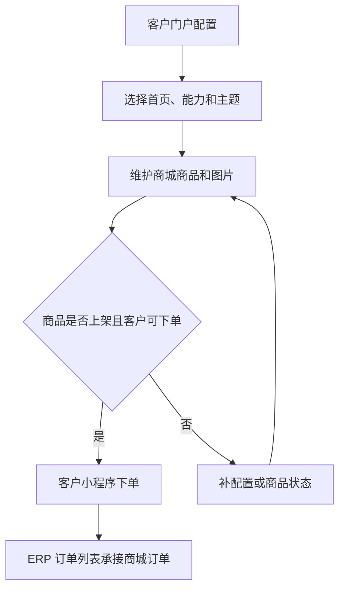

# 操作手册：客户门户与商城

## 适用范围
客户门户配置、批发客户门户能力、外部用户管理、小程序入口模式、小程序主题、商城能力、商城商品上架、图片上传、小程序商城下单和 ERP 订单承接。

## 入口
- 设置：客户门户配置、客户门户手册。
- 商品与配方：商城管理。
- 小程序：客户登录后的启动页、首页、订单、账单和我的。

## 流程图

## 标准操作
1. 先在客户档案确认客户类型：批发客户才会出现在客户门户配置列表；零售客户和电商客户默认使用商城能力。如果客户从批发改为零售或电商，系统会同步切到零售商城模板并停用历史 ERP 工作台绑定。
2. 进入客户门户配置，找到目标批发客户。
3. 如果客户需要外部用户登录，直接在客户门户配置行的“外部用户”区域创建账号、设置密码并启用登录。外部用户配置了手机号、密码并启用登录后，该客户会出现在客户履约运营台；一个客户只能保留一个启用绑定，同一外部用户不能 active 绑定第二个客户。
4. 按客户选择能力模板、主题和小程序首页；零售商城客户使用“零售商城客户”模板，不绑定 ERP 工作台账号。
5. 点击保存配置。
   - 如果模板启用了 `customerProcessingPortal` 视图，点击对应“客户履约工作台”入口时会跳转到 `kferp:navigate-view` 的 `customerProcessingPortal`，不会进入录单页。
6. 进入商城管理，点击新增商品。
7. 在 ERP 产品中选择已有产品，填写标题、副标题、描述、规格、售价、模板、状态和排序。
8. 右侧商城预览会随表单实时变化，确认展示后保存商品。
9. 保存后上传商品图片；图片上传成功后生成 `/assets/mall_products/...` 图片 URL。
10. 将商品状态改为上架后保存，小程序商城才展示该商品。
11. 客户打开小程序后，登录页默认展示“手机号快捷登录”；客户授权微信手机号后，若该手机号匹配已启用登录且已绑定客户门户的 ERP 渠道客户账号，可直接登录。
12. 如果客户无法授权手机号，切到“密码登录”，使用外部用户的用户名/手机号和密码登录。账号必须先在客户门户配置页创建、设置密码、启用登录并绑定到当前客户。
13. 客户登录成功后会进入首页；小程序启动页会自动判断会话，未登录时进入登录页，已登录时进入首页，避免发布版打开后只显示空白页和左上角主页图标。
14. 客户登录后底部固定显示四个大入口：底部四个入口分别为“首页、订单、账单、我的”。首页保留原服务入口，但不再重复展示订单和账单入口；订单进入订单专页；账单进入结算专页；我的进入账号和个人信息页。
15. 客户进入“我的”后可查看当前客户、切换绑定客户、点击“切换用户”回到登录页输入另一套 ERP 账号密码，或点击“退出登录”清除本机小程序会话。
16. 客户浏览商品、加入购物车、增减数量，填写收件人、手机号、收货地址和备注后提交订单。
17. 提交成功后，小程序提示订单号，ERP 订单列表出现来源为 `mall` 的订单。

## 小程序 ERP 账号密码登录
- 小程序登录页默认使用微信手机号快速验证组件；验证通过后，后端通过 `/api/mini/login` 的 `phone_verify` 模式换取微信手机号并匹配 ERP 渠道客户账号。
- 小程序客户入口只面向 ERP 渠道客户账号，不面向内部员工账号；内部员工即使密码正确，也不能登录客户小程序。
- 外部用户账号使用客户门户配置页维护的同一用户名/手机号和密码；小程序后端通过 `/api/mini/login/password` 校验后，只签发客户小程序 mini token，不创建内部 ERP 后台会话。
- 小程序登录 token 使用数据库最大有效期；常规访问不会因固定 7 天或 30 天到期，但退出登录、账号禁用、客户停用、绑定撤销或模板失效仍会阻止继续访问。
- 登录页密码输入框必须以掩码显示；如果开发者工具或真机上看到明文密码，先确认小程序包已更新到包含 `password` 输入属性的版本。
- 账号必须满足：员工记录启用、账号类型为渠道客户、登录未禁用、密码正确、存在 active 客户门户 ERP 绑定、绑定客户未停用。创建、重置密码和启停登录都在客户门户配置页完成。
- 未绑定客户门户的渠道账号会提示账号未绑定客户；禁用登录账号会提示账号暂不可登录；账号或密码错误不会暴露具体是哪一项错误。
- 需要让客户换另一个账号时，不要让客户换微信身份；进入个人中心点击“切换用户”，回到登录页后输入另一套 ERP 渠道客户账号密码。

## 小程序底部四入口
- 启动页负责自动分流：未登录进入登录页，已登录进入首页；如果客户反馈发布版首屏空白，只看到左上角主页图标，先确认小程序包已更新到包含启动页的版本。
- 后台配置中的 `miniapp_entry_mode` 仍保留给能力模板和兼容逻辑使用；客户侧主导航统一先进入首页，再从底部入口进入商城、订单、账单或我的。
- 首页保留原客户服务内容，例如商城下单、我的豆单、现货下单、一件代发、代加工和库存等能力入口；订单和账单不再作为首页卡片重复出现。
- 订单入口专门进入订单页，加载客户订单、商品明细、收件信息、订单金额、运费、生产/收款/发货状态、物流信息，并提供销售单和出库单 PDF 查看。订单页继续复用订单查询条件，可以按关键字、日期和状态筛选。
- 账单入口专门进入结算页，加载当前客户自己的费用明细和结算单。
- 我的入口专门放账号操作：切换当前绑定客户、切换用户、退出登录；后续个人配置也放在这里，不再放在页面顶部。

## 客户 ERP 工作台账号隔离
- 代加工模板账号才会显示和提交加工工单，并且服务端只允许绑定客户具备 `processing` 能力时提交加工工单。
- 公共 SKU 小批量模板账号在工作台显示“提交订单信息”（按钮“提交订单”），不显示“提交代发信息”；只有仅开通一件代发能力（`direct_ship` 且不含 `product_order`）的客户才显示“提交代发信息”。
- “提交订单信息/提交代发信息”统一使用单收件信息 + 多行商品：一个收件人可添加多行商品、规格和数量；每行会实时展示匹配的阶梯价和行小计，底部实时计算订单合计（商品金额 + 运费）。
- 客户网页版工作台底部“履约客户订单”使用 ERP 订单列表同源数据；渠道客户账号只需要模板授予 `customer_processing.read` 即可读取自己绑定客户的 `scope=fulfillment` 订单，服务端会按当前绑定账号限制客户范围，不能跨客户查看。
- 同一外部用户只能绑定一个客户，操作人员不要把一个账号给多个客户共用。
- 禁用登录的外部用户不能继续作为有效绑定；历史 active 绑定如果对应账号已禁用，会从客户工作台上下文中失效，也不会再出现在客户履约运营台选择器中。
- 客户档案停用后，即使旧小程序绑定仍为 approved，也不能继续作为小程序当前客户；小程序会切到第一个可用客户或清空当前客户，不能切换进入停用客户。
- 零售商城模板不能保存 ERP 工作台字段；如果保存能力模板时误填 ERP 权限或 ERP 视图，系统会拒绝保存，防止零售商城客户获得批发履约工作台。
- 能力模板是实时引用：客户 A 绑定模板 a 后，管理员修改模板 a 的能力、主题、小程序入口或 ERP 页面映射，客户 A 会立即按新模板展示和校验；系统不会自动生成子模板。
- 需要给新客户 B 做差异配置时，先在“客户能力模板设置”手动点击“复制模板”，只输入新模板名称；系统会自动生成安全模板 key，复制出的模板紧贴母模板下方缩进显示。模板列表默认只展开一个详情，其他模板只显示名称和说明，展开任意模板会自动收起其他详情；再修改子模板并绑定客户 B。
- 不再使用的模板应标记为“模板失效”。失效模板仍在模板设置页可见，便于排查历史引用，但不会出现在客户门户配置的可选模板中；模板失效后仍允许保存模板本身，保存按钮不能置灰或禁用。
- 如果客户当前引用了失效模板，客户门户配置页会显示“模板已失效”，保存、应用或绑定 ERP 工作台时会返回 `capability template invalid`；小程序登录或刷新上下文时会提示“客户配置已更新，请联系管理员处理”；管理员必须重新选择一个启用中的模板后保存。
- 如果页面或接口提示 `customer capability processing unavailable`，说明当前绑定客户不是代加工模板或未启用代加工能力，先回到客户门户配置核对模板和能力。
- 如果页面或接口提示 `customer capability direct_ship unavailable`，说明当前绑定客户未启用代发能力，先核对客户模板和能力后再提交。
- 如果能力模板保存或 ERP 工作台绑定提示 `ERP workbench unavailable for capability template`，说明该模板不允许 ERP 工作台字段或账号绑定，或历史模板键无法识别；ERP 工作台字段会被拒绝，零售商城客户不绑定 ERP 工作台账号，客户门户配置页和客户履约内部 API 都不能绕过。
- 如果保存客户门户配置提示 `capability template invalid` 或 `invalid request`，检查接口或导入数据里的 `capability_template_key`；非空但无法识别的模板 key 会被拒绝，不会静默改成手工能力配置。
- 如果客户门户配置页显示“未知能力模板”，说明历史 `capability_template_key` 已不在系统模板列表内；系统会在客户列表和详情接口保留原始 key 供排查，必须重新选择系统模板，或选择“请选择模板”并停用门户后再保存。
- 如果历史遗留 active ERP 工作台绑定指向零售商城或其他不暴露 ERP 工作台的模板，客户工作台会按无有效绑定拒绝进入，接口返回 `customer ERP binding not found` 或 403；运营人员应清理旧绑定或改回暴露 ERP 工作台的正确模板。
- 如果在客户档案把批发客户改成零售或电商客户，系统会自动应用 `retail_mall`，只保留商城能力，并把该客户历史 active ERP 工作台绑定改为 inactive；不需要再到客户门户配置页手动解绑。

## 代发批次不能为空
- 公共 SKU 代发或代加工客户在小程序提交代发批次时，订单行数必须大于 0。
- 代发批次表示客户已经交付待处理的订单明细；不能提交空代发批次来占位或只写备注，避免 ERP 工作台出现无业务内容的待处理批次。
- 如果小程序提示“订单行数必须大于 0”，先确认客户导入或整理的待发订单数量，再重新提交批次。

## 现货下单商品可见范围
- 公共 SKU 小批量客户打开小程序“现货下单”服务页时，只能看到公共商品和当前客户自己的专属商品。
- 如果当前客户有定制 SKU，并且该定制 SKU 的 `base_product_id` 指向某个公共基础款，小程序服务页商品选择器会用定制 SKU 替代基础款；例如岩师傅维护了“兰卡拼配”替代“曲奇拼配”后，客户只选择“兰卡拼配”，不再看到基础款“曲奇拼配”。
- 客户专属商品用于定制烘焙、贴牌或客户专属报价，不能显示其他客户专属商品，也不能通过手工构造商品 ID 下单。
- 如果提交现货/代发订单时商品已下架、停用或属于其他客户，接口会按无效请求拒绝；运营人员应在 ERP 产品资料中核对商品的客户归属和可见范围。

## 小程序服务表单选择器
- 客户在小程序“一件代发”“代加工”“现货下单”服务页提交订单或加工申请时，通过商品/库存选择器选择可用项，不需要手填系统 ID。
- 一件代发和现货下单的发货订单商品选择器只显示公共商品和当前客户自己的专属商品；代加工申请的投入物料选择器只显示当前客户可用托管原料，目标产品选择器只显示公共商品和当前客户自己的专属商品。
- 如果选择器为空，先检查当前客户是否有可用托管库存、是否有可见商品、商品是否启用，以及客户门户能力模板是否正确。

## 小程序履约订单后端定价
- 客户小程序“一件代发”“代加工发货”“现货下单”提交履约订单时，不允许客户手填单价，也不信任请求体里的 `unit_price`。
- 订单单价由后端按当前客户、商品、规格、数量、商品默认价和小批量阶梯价统一计算；客户侧只填写收件信息、商品、规格、件数、运费和备注。
- 如果订单金额异常，先检查 ERP 商品默认价、客户能力模板的小批量价格规则和商品阶梯价，不要让客户通过小程序手动改价。

## 客户专属豆单 PDF 访问范围
- 客户专属豆单 PDF 只能由归属客户访问，不能下载其他客户专属豆单。
- 官方已发布豆单可作为公共兜底访问；客户没有专属豆单时，可以查看官方已发布豆单。
- 如果小程序下载豆单 PDF 提示未找到，先核对当前 token 绑定客户、豆单 owner_type/owner_key 和发布状态。

## 商城商品公共目录范围
- 商城管理只能从公共商品中选择商品并上架，不能上架客户专属商品。
- 小程序商城是面向零售商城客户的公共目录；客户专属商品用于批发定制、贴牌或客户专属报价，不能进入商城公共目录。
- 如果历史商城商品关联了客户专属商品，小程序商城会隐藏该商品，客户手工提交该商城商品 ID 也会被拒绝；运营人员应改用公共商品重新上架。

## 商城商品图片上传格式
- 商城商品图片上传只接受图片文件，支持常见 PNG、JPEG、GIF 和 WebP 图片。
- 不能上传 HTML 或脚本文件、压缩包、文档或其他非图片内容，避免公开资源 URL 被用于展示不安全内容。
- 图片文件格式不支持时接口返回无效请求；运营人员应重新导出为受支持的图片格式后再上传。
- 商城商品图片上传超过 8MB 时必须拒绝，不能截断后保存为公开商品图片。
- 图片文件过大时接口返回无效请求；运营人员应压缩图片尺寸或重新导出后再上传。
- 商城商品图片上传必须先确认商品存在；缺失商品或图片更新失败时不能留下公开孤儿资产。
- 商品不存在时接口返回无效请求，运营人员应回到商城管理列表确认商品仍存在并刷新页面后再上传。

## 代加工申请库存与目标产品范围
- 代加工客户提交加工申请时，投入物料必须来自当前客户托管库存，且可用克重必须覆盖本次投入克重。
- 目标产品必须是公共商品或当前客户自己的专属商品，不能使用其他客户专属产品作为代加工成品。
- 如果页面或接口提示 `input material unavailable` 或 `target product unavailable`，先核对当前客户托管库存、库存状态、可用克重和目标产品客户归属。

## 结果校验
- 客户 A 配置商城首页后，登录直接进入商城；客户 B 保持订单处理首页不受影响。
- 客户门户配置列表只出现批发客户；零售和电商客户不出现。
- 客户门户配置页直接维护外部用户；创建后能在本页看到账号名称、手机号、登录状态和绑定状态，返回客户履约运营台刷新后也能选到该客户。同一账号不能重复 active 绑定给其他客户，禁用登录的外部用户不能继续作为有效工作台绑定。
- 小程序手机号快捷登录和密码登录都只能进入手机号对应的已绑定客户；密码错误、账号停用、未绑定客户时不能登录。
- 小程序登录 token 写入最大有效期，不按固定 7 天或 30 天自动过期；退出、账号禁用或绑定失效后仍不能继续访问。
- 零售商城客户模板不会开放 ERP 工作台绑定，只保留小程序商城、商城下单和我的订单闭环。
- 批发客户改为零售或电商后，旧 ERP 工作台绑定自动停用，客户不会继续进入批发履约工作台。
- 零售商城模板不能保存 ERP 工作台字段，误填 ERP 权限或视图时会被拒绝。
- 代加工客户账号能看到加工工单和代发入口；公共 SKU 小批量客户账号看到“提交订单信息”入口，不能提交加工工单；仅一件代发客户看到“提交代发信息”入口。
- 客户工作台提交订单信息时支持“一个收件信息多行商品”；每行显示阶梯价标签并实时更新小计，订单合计随商品行和运费实时变化。
- 代发批次不能为空；订单行数必须大于 0，不能提交空代发批次。
- 小程序一件代发、代加工和现货下单表单使用可读选择器，不能要求客户手填系统 ID。
- 小程序一件代发、代加工发货和现货下单订单价格以后端计算为准，客户侧不能手填或篡改单价。
- 现货下单商品可见范围只包含公共商品和当前客户专属商品，不能显示其他客户专属商品。
- 客户定制 SKU 替代公共基础款时，现货、代发和代加工目标产品选择器只显示定制 SKU，不再显示被替代的基础款。
- 客户专属豆单 PDF 只能由归属客户访问，不能下载其他客户专属豆单；官方已发布豆单可作为公共兜底访问。
- 商城商品公共目录范围只允许公共商品，商城管理不能上架客户专属商品，小程序商城不能显示客户专属商品。
- 商城商品图片上传只接受图片文件，不能上传 HTML 或脚本文件；图片文件格式不支持时接口返回无效请求。
- 商城商品图片上传超过 8MB 时必须拒绝，不能截断后保存为公开商品图片；图片文件过大时接口返回无效请求。
- 商城商品图片上传必须先确认商品存在，缺失商品或图片更新失败时不能留下公开孤儿资产；商品不存在时接口返回无效请求。
- 代加工申请只能使用当前客户托管库存和当前客户可见目标产品，不能使用其他客户库存或其他客户专属产品。
- 公共 SKU 小批量客户从小程序提交非 454g 规格现货/代发订单且未手填单价时，系统会按客户能力模板中的小批量规则匹配豆单重量档；低于 14lb 的订单按 15-28lb 档折算到当前规格，避免退回产品默认价。
- 结算服务页只展示当前客户自己的费用明细和结算单，不能显示其他客户的费用明细、结算单号或金额。
- 小程序登录页只显示 ERP 账号密码登录，不再展示微信一键登录；启用登录且已绑定客户门户的外部用户可登录，内部员工账号和未绑定账号不能登录。
- 小程序启动页不会停留在空白页；底部四个入口固定为“首页、订单、账单、我的”。首页不重复显示订单/账单，订单页能看到订单明细、销售单、出库单和物流信息，账单页只显示当前客户结算信息，我的页可退出登录和切换用户。
- 同一小程序用户绑定多个客户时，切换当前客户后，“我的订单”只能显示切换后的客户订单，不能显示切换前客户的订单号、商品或金额。
- 停用客户不会出现在小程序当前客户 bindings 中，也不能通过旧绑定切换进入；原当前客户被停用后会切到第一个可用客户或清空。
- 未启用商城下单能力的客户无法访问商城数据。
- 商城管理上传图片后，小程序可正常展示。
- 小程序购物车数量和 ERP 订单明细一致。
- 商城客户从底部“订单”进入订单记录，查看已提交商城订单记录。
- 商城订单进入 ERP 订单列表后，可沿用现有生产、发货、销售单和财务流程。

## 常见问题
- 客户打开发布版小程序后空白，只看到左上角主页图标：确认小程序包已更新到包含启动页和底部四入口的版本；新包会自动把未登录用户送到登录页，把已登录用户送到首页。
- 客户找不到订单记录入口：确认小程序已更新到底部四入口版本；订单统一从底部“订单”进入，不再依赖商城页或首页顶部按钮。
- 客户门户配置找不到客户：检查客户档案中的客户类型是否为批发客户。
- 小程序手机号快捷登录失败：检查微信小程序是否配置 `WECHAT_MINI_APP_ID` 和 `WECHAT_MINI_APP_SECRET`，并确认授权手机号对应的渠道客户 ERP 账号已启用登录且已绑定客户。
- 小程序密码登录失败：检查手机号是否属于已启用登录的外部用户、密码是否正确、账号是否被停用、客户是否仍有 active 绑定。
- 客户门户配置页找不到外部用户区域：先确认当前行已经展开并且客户属于批发客户；外部用户维护入口就在该客户行内，不再跳转到客户履约运营台。
- 外部用户创建失败：先检查手机号是否被内部员工账号占用，或该手机号是否已经 active 绑定到其他客户；同一外部用户不能同时服务两个客户。
- 客户从批发改为零售/电商后还看到客户履约工作台：刷新客户上下文并检查 `customer_erp_user_bindings` 是否已变为 inactive；若仍 active，说明客户档案类型同步或保存事务没有完成。
- 保存零售商城模板提示 ERP 工作台不可用：移除模板中的 ERP 权限和 ERP 视图，零售商城客户只走小程序商城与订单记录。
- 保存客户门户配置提示模板无效：重新选择系统提供的能力模板；如果要手工配置能力，清空模板 key 后再保存。小程序提示“客户配置已更新，请联系管理员处理”时，优先检查客户绑定的能力模板是否已失效或被删除。
- 配置页显示未知能力模板且保存按钮不可用：先记录页面展示的原始模板 key，再重新选择一个系统模板；如果这条门户配置需要停用，先切到“请选择模板”并取消门户启用。
- 客户工作台提交加工或代发被拒绝：按错误中的 `customer capability ... unavailable` 回到客户门户配置检查能力模板，确认当前渠道账号绑定的是正确客户。
- 代发批次提示订单行数无效：检查小程序代发批次的订单行数，必须大于 0；如果客户只是留言或预约，请不要提交代发批次。
- 小程序表单商品或物料选择器为空：检查当前客户是否有可见商品、可用托管原料和正确能力模板；不要让客户手填产品 ID 或物料 ID 绕过选择器。
- 现货下单看到了其他客户专属商品：立即停止给客户展示，核对产品资料的 `customer_id`、可见范围和当前小程序 token 绑定客户；服务页和提交订单都必须按当前客户过滤。
- 现货下单提交后提示无效请求：检查商品是否公共商品或当前客户专属商品，其他客户专属商品不能被当前客户下单。
- 客户下载到了其他客户专属豆单 PDF：立即停止给客户展示，核对 `bean_list_publications.owner_type/owner_key`、当前小程序 token 绑定客户和发布状态；客户专属豆单 PDF 只能由归属客户访问，官方已发布豆单可作为公共兜底访问。
- 客户豆单 PDF 提示未找到：检查该豆单是否已发布、是否归属当前客户；不能下载其他客户专属豆单。
- 商城管理看不到某个商品：检查该商品是否为客户专属商品；商城公共目录只能上架公共商品，客户专属商品应走客户门户现货下单或客户豆单。
- 小程序商城出现客户专属商品：立即下架对应商城商品，核对产品可见范围；商城页和商城下单接口都必须拒绝客户专属商品。
- 商城商品图片上传失败：检查是否为 PNG、JPEG、GIF 或 WebP 图片；不能上传 HTML 或脚本文件，图片文件格式不支持时接口返回无效请求。
- 商城商品图片过大：商城商品图片上传超过 8MB 时必须拒绝，不能截断后保存为公开商品图片；压缩后重新上传，图片文件过大时接口返回无效请求。
- 商城商品图片提示无效请求：检查商城商品是否仍存在，商品不存在时接口返回无效请求；缺失商品或图片更新失败时不能留下公开孤儿资产，应刷新商城管理列表后重新选择商品上传。
- 代加工申请提示投入物料不可用：检查当前客户托管库存中是否有对应物料、状态是否可用、可用克重是否足够；不能使用其他客户托管库存。
- 代加工申请提示目标产品不可用：检查目标产品是否为公共商品或当前客户专属商品；不能使用其他客户专属产品。
- 公共 SKU 小批量订单单价异常偏高：检查客户是否使用“公共 SKU 小批量代发”模板，并确认产品已维护豆单重量价格档；非 454g 规格会按重量档折算，缺少价格档时才回退产品默认价。
- 客户小程序订单单价异常偏低：检查是否有人构造请求传入 `unit_price`；后端必须忽略客户端单价并按商品默认价/阶梯价重算，若仍异常，核对商品价格档和客户模板配置。
- 结算服务页出现其他客户数据：立即停止给客户展示，核对当前小程序 token 绑定客户、客户门户能力和后台结算数据的 `customer_id`，费用明细和结算单必须按当前客户隔离。
- 切换当前客户后“我的订单”仍显示切换前客户：立即停止给客户展示，核对 `/api/mini/current-customer` 是否成功、`/api/mini/me` 的 `current_customer_id` 是否已变更，并确认订单服务页按当前客户重新加载。
- 登录后总是进入 `13800138075` 或看不到切换入口：先确认客户是否仍使用旧小程序包；新包登录页只支持 ERP 账号密码，不再展示微信一键登录。再核对登录的 ERP 渠道客户账号是否绑定到了正确客户；需要换账号时进入个人中心点“切换用户”，回到登录页输入另一套用户名/手机号和密码。
- 停用客户仍能在小程序切换：立即检查客户档案 `active` 状态和 `customer_portal_user_bindings`；停用客户不能切换进入，旧 binding 应被小程序上下文过滤。
- 小程序看不到商城入口：检查商城下单能力是否启用。
- 商品不展示：检查商品状态是否为上架、图片 URL 是否可访问、客户是否具备商城能力。
- 商城订单没进 ERP：检查小程序提交返回的订单号，并在订单列表按来源或订单号搜索。
- 当前第一版不包含在线支付、优惠券、库存占用和会员营销。
