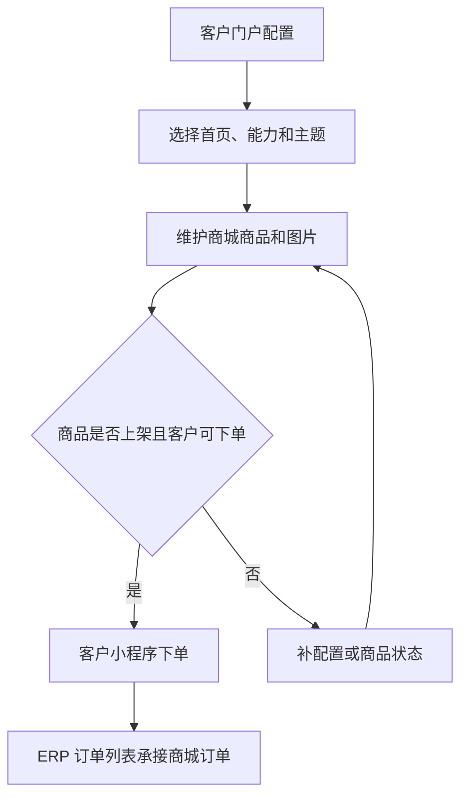

# 操作手册：客户门户与商城

## 适用范围
客户门户配置、批发客户门户能力、客户 ERP 账号绑定、小程序入口模式、小程序主题、商城能力、商城商品上架、图片上传、小程序商城下单和 ERP 订单承接。

## 入口
- 设置：客户门户配置、客户门户手册。
- 商品与配方：商城管理。
- 小程序：客户登录后的订单处理首页、服务首页或商城首页。

## 流程图

## 标准操作
1. 先在客户档案确认客户类型：批发客户才会出现在客户门户配置列表；零售客户和电商客户默认使用商城能力。
2. 进入客户门户配置，找到目标批发客户。
3. 在 ERP账号 中选择渠道客户账号并绑定；绑定成功后当前行会显示账号名称和手机号。一个客户只能保留一个启用绑定，同一账号不能绑定第二个客户。
4. 按客户选择能力模板、主题和小程序首页；零售商城客户使用“零售商城客户”模板。
5. 点击保存配置。
6. 进入商城管理，点击新增商品。
7. 在 ERP 产品中选择已有产品，填写标题、副标题、描述、规格、售价、模板、状态和排序。
8. 右侧商城预览会随表单实时变化，确认展示后保存商品。
9. 保存后上传商品图片；图片上传成功后生成 `/assets/mall_products/...` 图片 URL。
10. 将商品状态改为上架后保存，小程序商城才展示该商品。
11. 客户登录小程序后，如果配置为商城首页，会直接进入商城；否则可在服务首页点击商城下单。
12. 客户浏览商品、加入购物车、增减数量，填写收件人、手机号、收货地址和备注后提交订单。
13. 提交成功后，小程序提示订单号，ERP 订单列表出现来源为 `mall` 的订单。

## 结果校验
- 客户 A 配置商城首页后，登录直接进入商城；客户 B 保持订单处理首页不受影响。
- 客户门户配置列表只出现批发客户；零售和电商客户不出现。
- ERP账号 绑定后能看到账号名称和手机号；同一账号不能重复绑定给其他客户。
- 未启用商城下单能力的客户无法访问商城数据。
- 商城管理上传图片后，小程序可正常展示。
- 小程序购物车数量和 ERP 订单明细一致。
- 商城订单进入 ERP 订单列表后，可沿用现有生产、发货、销售单和财务流程。

## 常见问题
- 客户仍进入订单处理页：检查客户门户配置的小程序首页是否保存为商城。
- 客户门户配置找不到客户：检查客户档案中的客户类型是否为批发客户。
- 绑定账号不可选：先到用户权限页把账号类型设为渠道客户，并设置密码。
- 小程序看不到商城入口：检查商城下单能力是否启用。
- 商品不展示：检查商品状态是否为上架、图片 URL 是否可访问、客户是否具备商城能力。
- 商城订单没进 ERP：检查小程序提交返回的订单号，并在订单列表按来源或订单号搜索。
- 当前第一版不包含在线支付、优惠券、库存占用和会员营销。
