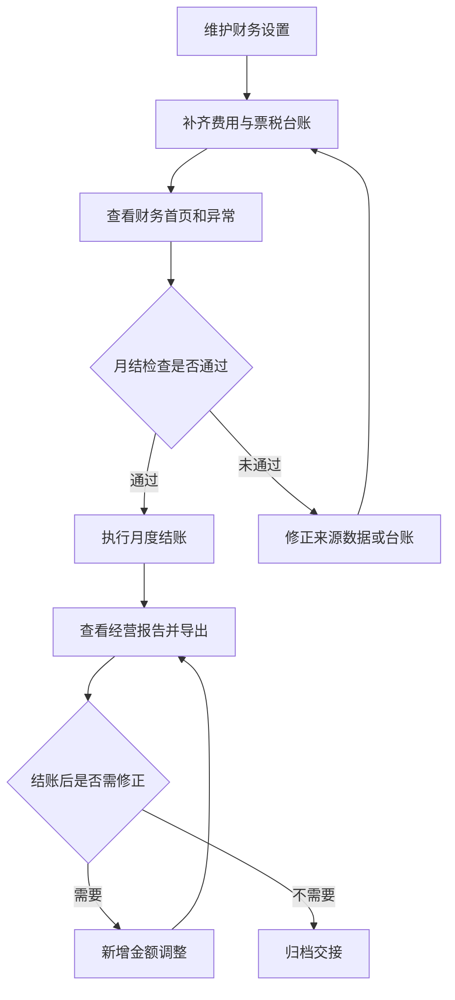

# 操作手册：财务管理

## 适用范围
财务首页、费用管理、月度结账、经营报告、票税台账、财务设置和结账后调整。

## 入口
- 财务管理：财务首页、费用管理、月度结账、经营报告、票税台账、财务设置、财务手册。
- 渠道客户账号：左侧“费用相关”下只读展示费用明细、经营报告和结账相关，系统自动锁定账号绑定客户。

## 流程图

## 标准操作
1. 先进入财务设置，选择企业类型、纳税人类型、税率、免税阈值、附加税率、企业所得税率和锁账模式。
2. 每月先在费用管理补齐期间费用和主营成本。费用可关联在职员工、订单、客户、商品、批次号和维度说明；停用员工不能作为新费用经办人，订单、客户、商品维度必须能在系统中找到。
3. 费用类别和付款方式可从常用候选中筛选，也可输入自定义值。
4. 在财务首页选择月份，查看收入、主营成本、期间费用、毛利、净利、税费估算和异常提醒。
5. 在票税台账维护销售发票、采购发票、税款缴纳和其他票税事项；同类型非空发票号或凭证号不能重复录入。
6. 月度结账前查看来源异常、来源明细、票税台账、成本配比和会计交接检查项。
7. 确认月度快照后执行结账；默认强锁账，结账后来源单据不得继续直接改写。
8. 结账后如需修正，新增金额调整，类型可选收入、主营成本、期间费用、税费或其他，并填写原因；未结账月份不能新增结账后调整，接口会返回 `month must be closed before adjustment`。
9. 已有结账后金额调整的月份会显示已调整；如再次执行重复结账，系统会重算快照但保持已调整状态，不会降回已结账。
10. 在经营报告查看老板简报、利润明细、税费明细和来源明细，并导出 PDF、Excel 或会计交接/代账交接 Excel。订单收入来源明细会显示订单收款方式，交接 Excel 的 Drilldown 工作表也带出该字段。
11. 渠道客户账号登录后，从“费用相关”进入费用明细、经营报告和结账相关。费用明细只读展示该账号绑定客户的费用，不显示新增费用表单、员工筛选或客户选择器；经营报告和结账相关只汇总该客户订单收入和带该客户维度的费用。
12. 渠道客户账号的费用明细和结账相关只读展示，不显示新增费用、“结账”按钮、结账后调整表单或会计交接导出。需要新增费用、正式结账、调整或代账交接时，由工厂内部账号在工厂财务视角处理。

## 结果校验
- 财务首页、月度结账和经营报告同一月份的收入、成本、费用、毛利、净利口径一致。
- 历史订单只有 `total_amount` 且 `grand_total` 为默认 0 时，财务收入和来源明细按 `total_amount` 计入；全额折扣等明确产生 0 `grand_total` 的订单仍按 0 计入，作废订单不计入收入。
- 已付款、已收款或已支付订单的收款方式会同步进入财务来源明细；经营报告“来源明细”和会计交接/代账交接 Excel 可按该字段核对微信、支付宝、银行转账、现金等实际收款渠道。
- 费用关联员工后，列表显示员工名，点击员工名可过滤该员工费用；停用员工不能被新增费用选择或通过接口写入，接口会返回 `employee inactive` 且不写入 `finance_expenses`。
- 费用关联订单、客户或商品维度时，对应 ID 必须存在；缺失时接口返回 `finance dimension order not found`、`finance dimension customer not found` 或 `finance dimension product not found`，且不写入 `finance_expenses`。
- 同一笔费用同时填写订单和客户维度时，客户维度必须与订单归属客户一致；不一致时接口返回 `finance dimension customer does not match order`，且不写入 `finance_expenses`。
- 同一笔费用同时填写订单和商品维度时，商品维度必须属于该订单明细；不一致时接口返回 `finance dimension product does not match order`，且不写入 `finance_expenses`。
- 票税台账同类型非空发票号或凭证号必须唯一；重复录入时接口返回 `tax ledger invoice already exists`，且不写入 `finance_tax_ledger`。
- 月结前检查能指出来源异常和票税台账缺口。
- 强锁账月份继续新增同月费用或票税台账会被后端拒绝。
- 未结账月份提交金额调整会被拒绝，且不会写入 `finance_adjustments`。
- 结账后金额调整进入报表，并让报表状态显示已调整；重复结账不会降回已结账。
- PDF、Excel 和会计交接 Excel 下载入口可用。
- 会计交接 Excel 的 Drilldown 工作表包含 Payment method 列；订单收入行显示订单收款方式，费用、成本和票税行为空。
- 渠道客户账号的费用明细、经营报告和结账相关均按绑定客户过滤；经营报告 PDF/Excel 导出 URL 带 `customer_id`，后端会按当前登录员工绑定客户派生并校验客户范围，来源明细不包含其他客户订单。
- 渠道客户账号的费用明细页面没有新增费用或员工筛选入口；结账相关页面没有结账和调整入口，只显示当前客户相关检查项和账期状态。

## 常见问题
- 税费估算不等于正式纳税申报结果，只用于经营管理复盘。
- 成本为 0 或异常时，先查生产成本、采购入库、费用归集和成本参数。
- 费用保存后跑到其他月份：检查费用发生日期，系统按日期归属月份。
- 锁账模式入口不可见：只有白名单用户能切换，接口也会校验权限。
- 新增费用提示 `employee inactive`：说明选中的经办员工已停用，需改选在职员工；历史费用仍可在列表和过滤中追溯。
- 新增费用提示 `finance dimension ... not found`：说明填写的订单、客户或商品 ID 不存在，先回到对应业务页面确认正确对象后再保存费用。
- 新增费用提示 `finance dimension customer does not match order`：说明订单归属客户与填写客户不一致，先从订单详情确认客户后再保存费用。
- 新增费用提示 `finance dimension product does not match order`：说明商品不在该订单明细中，先从订单详情确认商品后再保存费用。
- 票税台账提示 `tax ledger invoice already exists`：说明同类型非空发票号或凭证号已在台账中存在，先按发票号搜索或切换月份确认原记录；确实不是同一张票时先补充正确发票号或在备注中说明未取票事项。
- 金额调整提示 `month must be closed before adjustment`：先完成该月份月度结账，再新增结账后调整；未结账月份的来源修正应回到原费用、票税台账或订单来源处理。
- 来源明细缺少收款方式：回到订单销售中打开对应订单，确认收款状态是否已付款/已收款/已支付，并补齐收款方式后重新查看财务报表。
- 已调整月份重复结账后仍显示已调整，这是系统保留结账后调整痕迹的正常结果；如需解释差异，查看结账后调整列表和原因。
- 客户账号看不到新增费用、会计交接或调整入口：这是预期行为，客户侧费用相关只做当前客户视角展示；费用录入、正式结账和调整在工厂内部财务管理中完成。
