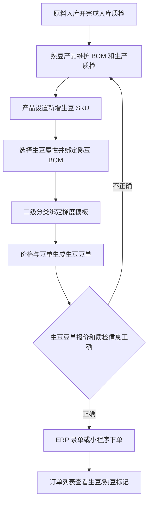

# 操作手册：生豆销售

## 适用范围
生豆产品建档、绑定熟豆 BOM、生豆豆单发布/导出、ERP 录单、小程序履约客户下单、小程序商城下单、入库质检，以及订单中生豆/熟豆识别。

## 入口
- 商品与配方：产品设置、价格与豆单、商城管理、生豆销售手册。
- 订单销售：录单、订单列表、订单详情。
- 物料管理：原料入库、原料批次、质检管理。
- 客户履约：履约运营台、客户小程序服务页。
- 小程序：商城、现货下单、一件代发或代加工发货中可见商品选择器。

## 流程图

## 标准操作
1. 原料到货后先在原料入库记录产季、产地、产家风味描述，并生成原料批次。
2. 对入库批次执行入库质检，记录工厂风味描述、水分、密度；入库质检用于仓库准入和批次追溯，不直接参与生豆豆单取价。
3. 熟豆产品按原流程维护 BOM，并在生产完成后录入生产质检；生豆豆单展示的质检信息取绑定熟豆 BOM 对应产品最新一条通过的生产质检。
4. 进入产品设置，新增公共产品时选择产品形态为“生豆”。
5. 选择生豆属性：单品或拼配；不管单品还是拼配，都必须绑定一个对应熟豆产品/BOM。
6. 生豆 SKU 不填写默认价或销售价；客户 SKU 列表也不维护生豆或熟豆销售价。
7. 给生豆所属二级分类绑定梯度模板；价格与豆单会按绑定熟豆 BOM 的成本输入和该模板生成 `green_bean_sale_tiers`。
8. 产品设置的客户 SKU 列表可按形态、名称、一级分类、二级分类过滤，确认生豆和熟豆在同一列表内区分清楚。
9. 进入价格与豆单，切换到“生豆豆单”，检查报价档、绑定 BOM、最新通过生产质检信息和 PDF 预览。
10. 发布或导出生豆豆单后，ERP 录单选择生豆产品；规格可选常用克数，也可选择“自定义克数”直接输入实际克数。
11. 小程序履约客户在服务页选择当前客户可见的生豆产品并提交订单；后端按已发布生豆豆单价格计算单价。
12. 小程序商城商品仍在商城管理上架；选择生豆产品时，小程序卡片、购物车和订单承接保留生豆标记。

## 价格规则
- 生豆产品仍是普通产品的一种形态，共用 `products`、BOM、分类、梯度模板、豆单发布、录单和订单明细。
- 生豆 SKU 不维护直接销售价；生豆和熟豆一样，由分类绑定的梯度模板生成豆单售价。
- 生豆成本输入来自绑定的熟豆 BOM，不直接绑定原料批次；原料批次成本和入库质检用于仓库管理和追溯。
- 生豆豆单价格来自已发布 `green` 豆单内容，ERP 录单和小程序履约订单保存时按商品、规格和数量匹配对应价格档。
- 熟豆价格发布不会覆盖生豆 SKU 的直接价格，因为生豆 SKU 没有直接价格字段；生豆报价随生豆豆单发布快照生效。
- 小程序商城商品的商城售价仍在商城管理维护；商城订单会保存 `product_kind=green_bean`，但不使用履约豆单价格档。

## 质检规则
- 入库质检：跟原料入库批次绑定，记录工厂风味描述、水分、密度，是入库准入和仓库追溯流程。
- 生豆豆单质检：不读入库质检；统一读取生豆 SKU 绑定熟豆 BOM 对应产品的最新通过生产质检记录。
- 如果绑定熟豆产品没有通过的生产质检，生豆豆单仍可展示产品和报价，但质检信息为空；发布前应先补齐生产质检。

## 小程序注意事项
- 履约客户和商城客户看到的生豆产品都来自 ERP 产品体系，不单独维护一套生豆商品逻辑。
- 履约客户只能看到公共商品和当前客户可见的客户专属商品；其他客户专属生豆不会泄露。
- 小程序提交履约订单时，客户侧不能传入单价覆盖；后端按已发布生豆豆单或熟豆价格档计算。
- 小程序商城需先在商城管理选择并上架生豆产品；若未上架，小程序商城不会展示。

## 结果校验
- 产品设置能新增生豆产品，要求选择单品/拼配并在生豆行第二行“绑定熟豆”中选择对应熟豆 BOM，不显示默认价或生豆销售价输入；熟豆行不展示生豆属性和绑定熟豆控件。
- 客户 SKU 列表能按形态、名称、一级分类和二级分类过滤；列表不提供销售价编辑列。
- 价格与豆单能切换到生豆豆单，导出的 PDF 标题、报价档和最新通过生产质检信息正确。
- ERP 录单选择器、订单行和订单列表都能区分生豆/熟豆，且规格支持自定义克数。
- 小程序履约客户能提交生豆产品订单，ERP 订单行保存 `product_kind=green_bean` 并按生豆豆单报价入单。
- 小程序商城能上架和提交生豆商品，购物车和订单承接保留产品形态。

## 常见问题
- 新增生豆失败提示需要绑定 BOM：先创建或选择对应熟豆产品，并确保该熟豆产品已维护 BOM。
- 生豆豆单价格不对：检查生豆 SKU 所属二级分类是否绑定正确梯度模板、绑定熟豆 BOM 是否正确、是否重新生成并发布生豆豆单。
- 生豆豆单没有质检信息：检查绑定熟豆产品是否有最新一条通过的生产质检记录。
- 录单里找不到生豆产品：检查产品是否启用、是否属于当前客户可见范围、是否保存为生豆形态。
- 小程序履约客户看不到生豆：检查客户能力模板、产品可见范围和客户专属商品归属。
- 小程序商城看不到生豆：检查商城管理中是否选择对应生豆产品、商品是否上架、图片和排序是否保存。
