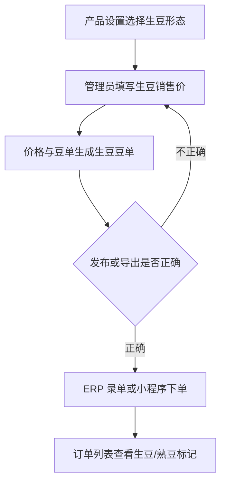

# 操作手册：生豆销售

## 适用范围
生豆产品建档、生豆销售价维护、生豆豆单导出、ERP 录单、小程序履约客户下单、小程序商城下单，以及订单中生豆/熟豆识别。

## 入口
- 商品与配方：产品设置、价格与豆单、商城管理、生豆销售手册。
- 订单销售：录单、订单列表。
- 客户履约：履约运营台、客户小程序服务页。
- 小程序：商城、现货下单、一件代发或代加工发货中可见商品选择器。

## 流程图

## 标准操作
1. 进入产品设置，新增或编辑产品时选择产品形态为“生豆”。
2. 填写产品名称、规格、分类、默认价和生豆销售价；生豆不维护烘焙度和出品率，也不依赖 BOM 成本试算生成销售价。
3. 保存后确认产品列表里显示“生豆”标记，销售价按管理员填写的直接报价展示。
4. 进入价格与豆单，选择“生豆豆单”，检查生豆产品的产地、处理法、风味描述和直填销售档位。
5. 需要对外报价时导出生豆豆单 PDF；生豆豆单展示的是销售报价，不等同于原料仓库批次成本。
6. ERP 录单时在产品选择器选择生豆产品，确认行内显示生豆标记、规格和单价。
7. 保存订单后到订单列表查看该订单的产品形态标记；混合订单会同时显示生豆和熟豆。
8. 批发履约客户在小程序服务页选择商品时，可以选择当前客户可见的生豆产品并提交订单。
9. 零售商城客户在小程序商城选择已上架的生豆商城商品，加入购物车后提交订单。

## 价格规则
- 生豆产品仍是普通产品的一种形态，共用产品、价格档、录单、订单和小程序订单底层。
- 生豆销售价由管理员在产品设置直接维护；系统不会用熟豆的烘焙损耗、生产成本、包装成本和梯度模板重新试算覆盖。
- 生豆销售价和原料仓库生豆批次成本分开管理：仓库成本用于库存和成本追溯，生豆销售价用于对外销售和豆单报价。
- 生豆豆单读取产品价格档位；如果价格异常，先回到产品设置检查生豆销售价和价格档，而不是修改原料批次成本。
- 熟豆产品继续使用既有成本试算、梯度模板和发布逻辑；不要为了生豆销售去改熟豆成本参数。

## 小程序注意事项
- 履约客户和商城客户看到的生豆产品都来自 ERP 产品体系，不单独维护一套小程序商品逻辑。
- 商城商品仍需在商城管理上架；如果产品是生豆，小程序商品卡和购物车会带出生豆标记。
- 履约客户只能看到公共商品和当前客户可见的客户专属商品；其他客户专属生豆不会泄露。
- 小程序提交订单时后端会保存订单行的产品形态快照，后续即使产品形态调整，历史订单仍能看出当时是生豆还是熟豆。

## 结果校验
- 产品设置能新增和编辑生豆产品，生豆产品不要求烘焙度和出品率。
- 价格与豆单能切换到生豆豆单，导出的 PDF 标题和报价内容为生豆豆单。
- ERP 录单选择器、订单行和订单列表都能区分生豆/熟豆。
- 小程序履约客户能提交生豆产品订单，ERP 订单行保存 `product_kind=green_bean`。
- 小程序商城能上架和提交生豆商品，购物车和订单承接保留产品形态。
- 生豆价格不会被熟豆成本试算发布覆盖，熟豆价格逻辑不受影响。

## 常见问题
- 录单里找不到生豆产品：检查产品是否启用、是否属于当前客户可见范围、是否保存为生豆形态。
- 生豆单价不对：回到产品设置检查生豆销售价和价格档；不要直接修改原料仓库成本来调整销售报价。
- 生豆豆单没有某个产品：检查该产品是否启用、是否维护豆单展示信息和生豆销售价。
- 小程序履约客户看不到生豆：检查客户能力模板、产品可见范围和客户专属商品归属。
- 小程序商城看不到生豆：检查商城管理中是否选择对应生豆产品、商品是否上架、图片和排序是否保存。
- 订单列表没有生豆标记：刷新订单列表后按订单号查找；历史旧订单如果保存时没有产品形态快照，会按产品当前形态兜底展示。
