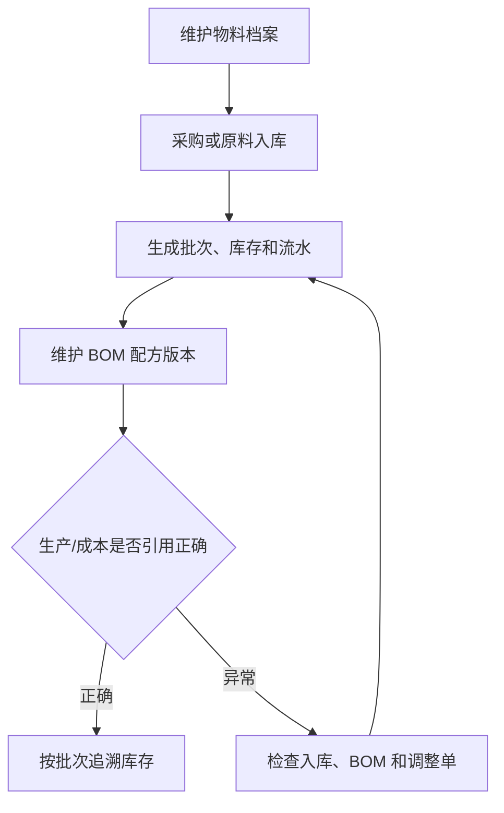

# 操作手册：物料、库存与 BOM

## 适用范围
物料档案、原料入库、原料批次、库存流水、库存批次、库存调整单、BOM 配方维护。

## 入口
- 物料管理：物料档案/库存、原料入库、原料批次、库存流水、库存批次、库存调整单、BOM 配方维护

## 流程图

## 标准操作
1. 在物料档案中维护物料名称、类型、单位、采购价和咖啡豆信息。
2. 原料到货后创建原料入库单，确认数量、单位、批次、单价和供应来源。
3. 通过原料批次和库存批次检查批次号、剩余数量和入库来源。
4. 在 BOM 配方维护中设置商品所需物料、用量和启用版本。
5. 出现盘点差异时，使用库存调整单，不直接改数据库。
6. 通过库存流水追踪每一次入库、出库、调整和生产消耗。

## 采购入库
- 先维护供应商名称、联系人、电话和地址；同名供应商会更新资料并保持启用。
- 创建采购单时选择供应商和物料，填写采购数量、单价和备注。
- 对待收货采购单执行收货入库后，系统调用原料入库能力生成原料批次、库存批次、原料仓库存和库存流水。
- 收货成功后，物料档案采购价更新为本次收货单价，用于后续成本核算参考。

## 库存作业
- 原料入库、WIP 领退/转仓、成品转仓都在库存作业内处理，物料或成品选择框支持名称/编号模糊搜索。
- WIP 在制仓只表示已领到现场但未消耗的原料；生产完工时才扣 WIP。
- 盘点差异必须走库存调整单，不能直接改数据库。

## 结果校验
- 入库后物料库存、原料批次和库存流水同步增加。
- BOM 启用版本后，生产和成本核算使用正确配方。
- 库存调整后有调整单和流水证据。
- 批次记录能追溯到入库、生产消耗或调整来源。

## 常见问题
- 物料库存不对：先查库存流水，再查入库单、生产扣料和调整单。
- 咖啡豆信息缺失：在物料档案中进入咖啡豆信息设置，补充风味、产地、处理法等字段。
- BOM 成本不对：检查 BOM 版本是否启用、物料采购价是否更新、成本参数是否正确。
- 批次无法追溯：检查入库时是否生成批次号，生产完成时是否写入消耗日志。
