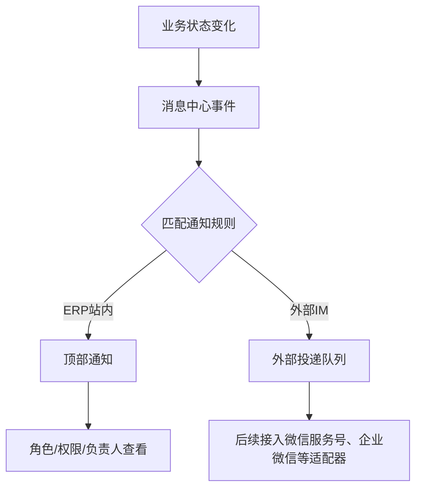

# 通知配置操作手册

## 流程图

## 功能定位

- 通知配置用于把订单下单、生产完成、已发货等业务事件推送给指定接收人。
- 通道不是微信专用；当前支持 ERP 站内通知，并预留外部 IM 投递队列和适配器字段。
- 外部 IM 规则可以先配置为停用，等具体通道的凭据、模板和用户身份绑定完成后再启用。

## 入口和权限

- 入口：设置 / 通知配置。
- 权限：需要系统设置维护权限。
- ERP 顶部通知仍按用户自己的订单读取、角色、权限、负责人或客户绑定关系显示。

## 配置规则

1. 填写规则编码，例如 `order_shipped_customer_im`。
2. 填写事件类型，例如 `order.created`、`order.production_finished`、`order.shipped`。
3. 选择通知通道：ERP站内、外部IM、微信服务号或企业微信。
4. 选择接收人类型：
   - 角色用户：`target_key` 填 `sales`、`production` 等角色编码。
   - 权限用户：`target_key` 填 `orders.read` 等权限编码。
   - 指定员工：填写员工 ID。
   - 订单负责人：用于订单来源事件，推送给订单负责人。
   - 订单客户：用于订单来源事件，后续外部 IM 适配器按客户身份绑定发送。
5. 如需限制状态或业务来源，在 Payload 条件中填写 JSON，例如 `{"new_status":"已发货"}`。
6. 外部通道填写模板键和适配器键，后续接入具体 IM 时使用。

## 默认规则

- 新订单会通知具备订单读取权限的 ERP 用户。
- 新订单会通知生产角色，作为烘焙师接单提醒。
- 订单生产完成会通知销售角色。
- 订单已发货会通知销售角色。
- 已发货客户外部 IM 规则默认停用，等 IM 适配器和客户身份绑定完成后启用。

## 常见问题

- ERP 顶部看不到通知：检查规则是否启用、接收人角色/权限是否分配、用户是否已登录对应员工账号。
- 外部 IM 没有真实发送：第一期只落外部投递队列和 adapter 框架，需后续接入具体 IM 服务。
- 想新增某个状态变化通知：新增或复用业务事件类型，配置目标角色或接收人即可，不需要在业务页面写死微信逻辑。
