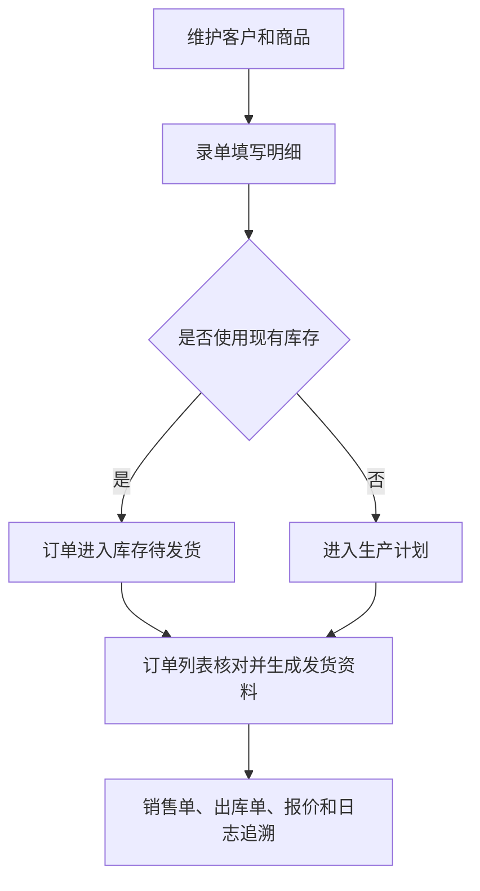

# 操作手册：订单与销售资料

## 适用范围
录单、订单列表、客户档案、商品档案、报价导出等销售前后台操作。

## 入口
- 订单：录单、订单列表
- 档案：客户档案、商品档案、报价导出

## 流程图

## 标准操作
1. 先维护客户档案，确认客户名称、联系方式、结算信息和业务配置可用。
2. 维护商品档案，确认商品规格、价格、BOM 或成本关联资料准确。
3. 进入录单页面，选择客户、商品、规格、数量、订单日期、订单来源、发货和付款信息。
4. 如使用零售自定义克数，确认规格、克数和折算价格符合当前规则。
5. 如订单涉及售前售后归属或后续提成结算，在录单时选择订单负责人；负责人可来自内部员工或合作方/客户档案。
6. 保存订单后进入订单列表确认记录存在，核对金额、状态、负责人、备注和发货信息。
7. 在订单列表搜索框可输入订单号、客户名或负责人名称，快速定位某个售前售后负责人负责的订单。
8. 需要报价时，进入报价导出，按客户或商品维度生成对外报价资料。

## 录单要点
- 客户输入框支持客户名、拼音和首字母搜索，选择后带入默认来源和订单类型。
- 商品明细直接在商品输入框搜索商品，选择规格、数量后自动匹配梯度价；批发自动价按总重量折算磅数匹配豆单梯度，规格没有专属梯度时会使用该商品已有豆单梯度折算出单价和小计。
- 批发单价单位跟随当前规格：454g 等磅制规格显示元/磅，1000g、2.5kg 等公斤规格显示元/kg；从豆单磅价换算成公斤价时单价四舍五入取整数。1000g × 30 袋如果匹配到 48 元/磅档，页面显示 106 元/kg，小计 3180。
- 临时改价时按当前单价单位直接编辑单价，需要恢复自动价时点击单价旁的恢复按钮。
- 常用规格包括 36g、80g、100g、227g、454g、500g、1000g、2.5kg。
- 保存前如果成品库存批次或历史成品库存余额足够，系统会列出建议批次或 `LEGACY-FP-商品ID-规格`；选择使用后订单进入库存待发货，选择不使用则按库存不足进入生产计划。
- 录单页面只保存订单，不处理快递；订单生产完成、无需生产或库存待发货后，到订单列表勾选订单生成顺丰发货 Excel。
- 录单页可抽屉式新增客户，粘贴收件信息后自动识别姓名、电话和地址，保存后自动选中新客户。

## 订单列表与发货
- 使用订单号、客户、负责人、日期、收款、发货和生产状态筛选订单。
- “只看可发货”包含生产完成、无需生产和库存待发货订单。
- 生成顺丰发货 Excel 时，收件人来自客户档案，寄件人优先使用订单抽屉内单独选择的寄件人，否则使用本次默认寄件人。
- 库存待发货订单生成 Excel 时不扣库存；回填快递单号并标记已发货时，才扣减已预留的 `FP-...` 批次或 `LEGACY-FP-...` 库存余额，并写库存流水。
- 顺丰后台寄件列表可上传回传，系统从备注中的订单号匹配订单并回填运单号。

## 销售单
- 订单列表每行“销售单”在当前页面打开销售单抽屉，不丢失筛选和分页。
- 生成前先刷新销售单预览，确认公司信息、客户公司信息、商品明细、金额、说明、收款方式、收款码和公章位置。
- 销售单预览按下载图片同一张 A4 页面比例显示；如果预览区域横向滚动，左右滚动查看完整页面，确认后再重新生成 PDF 或图片。
- 销售单设置页公章预览使用可滚动的 A4 坐标画布；公章下移后不会被短预览框裁掉，确认位置后重新生成 PDF 或图片。
- 销售单设置上传公章时系统会自动裁掉图片白边；旧公章可在设置页点击“去除背景”重新生成透明且裁边的 PNG。
- 调整公章大小后会自动保存；已经生成的历史版本不会变化，需要重新生成 PDF 或图片后下载最新版。
- 点击确认生成 PDF 或确认生成图片后才创建新版本；预览不新增版本。
- PDF 和图片版本独立保留历史，最新版可单独下载。
- 分享到微信时直接分享 PDF 或 PNG 文件；浏览器不支持文件分享时，按提示下载最新版后手动发送。

## 出库单
- 已发货订单可打开出库单抽屉，维护出库日期、出库仓、发货方式、快递单号和备注。
- 出库单生成前先预览，确认后创建 PDF 版本；未发货订单不能生成正式出库单。
- 库存管理的出库日志可集中查看、打开和下载已生成的出库单。

## 结果校验
- 新订单能在订单列表查到。
- 客户、商品、规格、数量、金额、负责人、备注等关键字段与录入一致。
- 按负责人名称搜索时，订单列表只返回匹配该负责人名称快照的订单。
- 订单相关变更能在操作日志中追溯。
- 报价导出内容与商品档案价格口径一致。
- 销售单、出库单和分享资源都能下载最新版和历史版本。
- 新上传带白边的公章后，销售单预览、PDF 和图片中的公章本体不会明显偏小。

## 常见问题
- 客户或商品不可选：先检查档案是否已创建、是否被停用或名称是否录错。
- 负责人搜不到订单：先确认录单时已保存订单负责人，再检查负责人名称是否与订单保存时的名称快照一致。
- 公章仍然很小：重新上传原图或点击“去除背景”，确认系统已裁掉图片白边；调整大小后重新生成 PDF 或图片，旧版本不会回写变化。
- 价格不符合预期：检查商品价格、成本发布记录、规格是否有专属梯度、总重量折算磅数是否落在预期豆单梯度内，以及当前单价单位是元/磅还是元/kg。
- 保存失败：优先看页面提示，再查 API 响应和操作日志。
- 订单影响生产或库存时，要同时检查生产计划、库存流水或批次记录是否生成。
