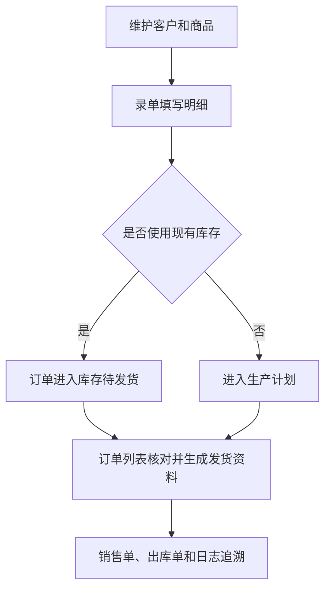

# 操作手册：订单与销售资料

## 适用范围
录单、订单列表、客户档案、销售单和出库单等销售前后台操作。

## 入口
- 订单：录单、订单列表
- 档案：客户档案

## 流程图

## 标准操作
1. 先维护客户档案，确认客户名称、联系方式、默认来源、默认订单类型、客户负责人、结算信息和业务配置可用；客户档案列表点击客户名称打开右侧抽屉，不再通过单独“编辑”列进入。
2. 维护商品档案，确认商品规格、价格、BOM 或成本关联资料准确。
3. 进入录单页面，选择客户、商品、规格或单位、数量、订单日期、订单来源、发货和付款信息；熟豆商品仍按重量规格录单，挂耳商品选择“袋”或“盒”单位后按发布的挂耳价格梯度报价。当收款状态选择“已付款/已收款/已支付”时必须同步选择收款方式。如单个商品有贴标、磨粉、特殊包装等说明，在该商品明细行填写“条目备注”；如该行需要优惠，可选择减免数额、单价优惠、折扣或免费。
4. 如使用零售自定义克数，确认规格、克数和折算价格符合当前规则。
5. 订单负责人不在录单时手工指定；系统会按客户档案中必填的客户负责人自动写入订单负责人快照，负责人只能是员工维护里的启用内部员工。
6. 保存订单后进入订单列表确认记录存在，核对金额、状态、负责人、备注和发货信息。
7. 在订单列表搜索框可输入订单号、客户名、负责人名称或快递单号，快速定位某个售前售后负责人负责的订单。
8. 需要对外销售资料时，在订单列表打开销售单或出库单抽屉，先预览再生成 PDF 或图片版本。

## 录单要点
- 客户输入框支持客户名、拼音和首字母搜索，选择后带入默认来源和订单类型。
- 豆单版本随客户变化自动切换，并按熟豆豆单、生豆豆单、挂耳豆单分别选择。客户有某类型专属豆单时可选不同已发布版本，默认最新；客户没有专属豆单时该类型使用公共豆单。
- PR-324-FENNA-ORDER-ENTRY-CUSTOMER-BEAN-LIST-SCOPE：客户已有自己的熟豆/商用豆单时，录单商品下拉只展示该客户商用豆单发布快照中包含且带价格档的商品；公共商用商品和未发布到客户豆单的客户 SKU 不再可选。熟豆自动价读取发布快照中的 `commercial_wholesale_tiers`，例如芬纳咖啡两个定制产品应直接带出豆单磅价。
- 保存订单会记录本单使用的豆单发布 ID 和版本号，用于后续追溯当时的报价和展示口径。
- 商品明细直接在商品输入框搜索商品，选择规格、数量后自动匹配梯度价；批发自动价按总重量折算磅数匹配豆单梯度，规格没有专属梯度时会使用该商品已有豆单梯度折算出单价和小计。
- PR-325-ORDER-ENTRY-MATCHED-TIER-HIGHLIGHT：自动价命中后，价格提示按钮按行内 `tier_id` 实际命中的豆单梯度高亮；即使当前规格是 1000g 或 2.5kg、单价单位显示元/kg，只要价格来自 454g 磅价梯度折算，页面仍高亮对应的 454g 档位。
- 生豆商品录单时会保留 `green_bean` 形态；生豆订单价格和页面展示的梯度价只能来自所选生豆豆单版本的已发布价格档。缺少生豆豆单价格时保存会失败，不能用绑定熟豆阶梯价、同名熟豆 SKU 梯度或商品直连梯度兜底。
- 挂耳商品不使用熟豆重量规格控件；选择“袋”时规格显示为 `10g/袋`，选择“盒”时规格显示为 `10袋/盒`（以产品设置为准）。盒单会优先按发布的袋价梯度换算，没有可用袋价时才匹配盒价梯度。
- 挂耳订单明细会保存产品类型、销售单位、每盒袋数、每袋熟豆克重、匹配数量和价格来源快照；后续编辑订单、订单列表、销售单和生产计划都以该快照为准，不受之后价格模板修改静默影响。
- 批发单价单位跟随当前规格：454g 等磅制规格显示元/磅，1000g、2.5kg 等公斤规格显示元/kg；从豆单磅价换算成公斤价时单价四舍五入取整数。1000g × 30 袋如果匹配到 48 元/磅档，页面显示 106 元/kg，小计 3180。
- 曲奇拼配等按 KG 设梯度的产品，梯度区间按该行总 kg 匹配，不按包装件数匹配；例如 2.5kg × 10 袋按 25kg 落档。
- 商品的 KG 梯度在价格提示中显示为 `kg` 区间；生豆豆单的销售单价跟随发布快照中的模板单位显示，KG 生豆模板显示为元/KG，例如 `1-59kg 51.75/kg`、`60kg+ 62/kg`。
- 临时改价时按当前单价单位直接编辑单价，需要恢复自动价时点击单价旁的恢复按钮。
- 每条商品明细支持行级优惠：减免数额直接扣整行固定金额，单价优惠按当前单价单位逐单位扣减（零售按件数、挂耳按袋/盒数量、454g 等批发按总磅数、1000g/2.5kg 等按总 kg），折扣按输入比例计算（90=9折），免费会把该行应收小计置为 0。保存后行级优惠会汇总到订单优惠字段，订单列表和履约客户订单范围都能看到优惠金额和应收金额。
- 每条商品明细都有“条目备注”，用于记录只属于该商品的说明；保存后编辑订单会回显，并会带入销售单和出库单对应商品行。订单级“备注”仍用于整单说明，不要混用。
- 订单明细会在商品行显示该行保存时匹配到的豆单版本；新订单保存后会记录豆单发布 ID 和豆单版本号，历史订单如果当时未记录则显示“未记录”。
- 收款方式是订单财务口径字段。订单状态为已付款、已收款或已支付时，录单/编辑保存会强制要求选择收款方式；状态改回未付款时系统不要求收款方式，并按未付款处理。
- 客户负责人是订单归属口径字段，必须先在客户档案维护。录单页只展示当前客户负责人；客户资料没有负责人时订单保存会失败，需要回到客户档案补齐。
- 常用规格包括 36g、80g、100g、227g、454g、500g、1000g、2.5kg。
- 保存前如果成品库存批次或历史成品库存余额足够，系统会列出建议批次或 `LEGACY-FP-商品ID-规格`；选择使用后订单进入库存待发货，选择不使用则按库存不足进入生产计划。
- 录单页面只保存订单，通常不处理快递；如编辑历史订单需要补录快递单号，可在快递单号框输入一个或多个单号，多个单号用换行、逗号或分号分隔。
- 从侧边栏进入“录单”固定为新建订单；编辑历史订单应从订单列表打开订单详情抽屉或明确带订单 `edit_id` 的编辑入口进入，避免把新单误保存到旧订单上。
- PR-316-FORM-DRAFT-CACHE：录单、BOM配方维护、SKU设置 中录单新建表单使用会话内内存草稿；跳转到其他功能再回来时保留未提交表单，刷新浏览器后草稿清空。保存订单成功后，新建录单草稿会清空；编辑历史订单或复制订单不复用新建录单草稿。
- 订单生产完成、无需生产或库存待发货后，到订单列表勾选订单生成顺丰发货 Excel。
- 录单页可抽屉式新增客户，粘贴收件信息后点击“地址解析”可自动识别姓名、联系电话和地址；必须选择负责人后才能保存，保存后自动选中新客户。
- 客户档案抽屉也支持“地址解析”；解析后自动回填联系人、联系电话和地址，客户名默认取联系人，后续可继续手工修改。负责人下拉只包含启用的内部员工，不包含外部客户账号。
- 客户档案页可点击客户名称打开详情抽屉；抽屉内维护客户字段、统计和附件，底部不再嵌套二级客户列表。

## 客户档案附件
- 客户档案附件用于维护标签正面、标签背面和客户 Logo 等图片，支持 PNG/JPEG/WebP。
- 客户档案资产图片上传超过 8MB 时必须拒绝；运营人员应压缩到 8MB 内后再上传。
- 客户档案资产元数据保存失败时必须清理刚写入的文件，不会留下公开孤儿客户资产。
- 如果上传失败，先确认文件是图片格式，再检查图片大小和浏览器接口提示。

## 客户档案列表筛选与排序
- 客户档案列表支持按 `客户类型`（零售/电商/批发）、`状态`（启用/停用）筛选。
- 客户档案列表显示负责人；新增或修改负责人会写入操作日志，可在“操作日志”按客户更新记录追溯。
- 列表还支持 `客户名` 与 `更新时间` 两列排序，点击表头三角图标可在升序/降序间切换。
- 切换筛选或排序后，系统会保留在当前 URL 查询参数中，刷新后恢复到同一查询条件。
- 客户档案列表底部显示总条数、总页数和当前页，支持跳转到指定页，并可切换每页显示条数。

## 订单列表与发货
- 使用订单号、客户、负责人、快递单号、日期、收款、发货和生产状态筛选订单。
- 订单列表底部显示总条数、总页数和当前页，支持输入页码跳转，并可切换每页显示条数；切换筛选、范围或每页条数后从第一页重新查询。
- 页面顶部可切换“全部订单 / 我的订单 / 履约客户订单”；“我的订单”按当前登录员工负责人过滤，“履约客户订单”用于查看已绑定启用登录的 ERP 履约账号、且能力模板暴露 ERP 工作台的批发客户通过客户门户提交的代发/代加工发货订单，或内部 ERP 录单时选择该履约客户后保存的订单。历史 active 绑定如果指向零售商城或其他不暴露 ERP 工作台的模板，或绑定账号已停用登录，该客户订单不会进入“履约客户订单”范围。
- ERP 顶部出现新订单通知时，点击通知会进入订单列表并自动切换到对应范围，高亮该订单；处理后可关闭通知，关闭后该通知记为已读。
- 如果外部链接或通知参数中的订单范围异常，系统会提示 `invalid scope` 并拒绝查询，不会自动放宽成全部订单；从页面顶部重新选择“全部订单 / 我的订单 / 履约客户订单”即可恢复。
- 订单行颜色用于快速判断优先状态：新订单高亮为绿色；未付款为红色；未发货为蓝色；已发货但未生产完成为黄色。订单状态区会在收款状态后显示收款方式，例如“已付款 / 银行转账”。
- 订单列表“金额”列按履约运营台订单费用的同一结构显示商品金额、运费、优惠和应收，应收会突出显示；如果订单记录了快递费说明或委外总费用，也会在同一列显示。
- 点击订单号打开订单抽屉后，顶部可直接看到收件人、电话、公司、地址和来源；费用明细会展示商品金额、运费、优惠、应收、快递费说明、委外合计和委外分项。
- 订单抽屉中的订单明细商品行会展示豆单版本，便于核对该订单使用的是哪一版熟豆、生豆或挂耳豆单价格。
- 订单失效使用软失效，不删除订单行。点击订单列表或抽屉中的“失效”后，该订单会从默认 ERP 订单列表、履约客户订单和小程序订单/账单中隐藏；失效后不可恢复。
- 订单列表支持批量失效：点击表头“失效”总复选框可全选当前页正常订单，再点一次取消当前页全选；也可以逐行勾选正常订单，再点击“批量失效”。已失效订单不能再次勾选批量失效。
- 需要查看或重建已失效订单时，把失效筛选切到“已失效”或“全部”，点击“复制”生成新订单；原已失效订单只保留历史追溯。
- 已失效订单不能勾选发货处理；复制成新订单后，才会按新订单进入默认列表、履约客户订单范围和小程序订单/账单。
- “只看可发货”包含生产完成、无需生产和库存待发货订单。
- 生成顺丰发货 Excel 时，收件人来自客户档案，寄件人优先使用订单抽屉内单独选择的寄件人，否则使用本次默认寄件人。
- 快递录单 Excel 生成失败时必须清理刚写入的文件；不会留下公开孤儿快递录单文件，排除错误后重新生成快递录单 Excel。
- 库存待发货订单生成 Excel 时不扣库存；回填快递单号并标记已发货时，才扣减已预留的 `FP-...` 批次或 `LEGACY-FP-...` 库存余额，并写库存流水。
- 一个订单可以维护多个快递单号；订单抽屉“快递单号（可多个）”支持用换行、逗号或分号分隔，系统会追加去重，不会用新单号覆盖旧单号。
- 顺丰后台寄件列表可上传回传，系统从备注中的订单号匹配订单并回填运单号；同一订单多行或同一单元格多个单号都会归到该订单。
- 物流单号 Excel 上传超过 20MB 时必须拒绝；不能解析超大物流回传 Excel，接口返回 `file too large`，压缩或拆分文件后再上传。

## 销售单
- 订单列表每行“销售单”在当前页面打开销售单抽屉，不丢失筛选和分页。
- 生成前先刷新销售单预览，确认公司信息、客户公司信息、商品明细、条目备注、金额分行、说明、收款方式、收款码、公章位置和销售单备注。
- 销售单商品表中“备注”列来自录单商品明细的“条目备注”；为空时不影响生成。
- PR-326：商品名称很长时会在商品列内自动换行，行高按最长内容撑开；如果仍看到列内容重叠，先刷新预览再重新生成 PDF 或图片。
- 销售单金额区会把商品合计、运费、优惠和应收分行展示；优惠按类别显示，如“单价优惠”“折扣”“减免金额”“整单优惠”，类别和金额用粗体强调。
- 销售单页面的“销售单备注”只用于对外销售单最后一行，例如对账、赠品、特殊交付说明；它不替代订单列表/订单抽屉里的内部订单备注，保存备注后刷新预览即可看到末行变化。
- 销售单预览显示 PDF 页面，并标注“PREVIEW 预览版”；如果预览区域横向滚动，左右滚动查看完整页面，确认后再重新生成 PDF 或图片。
- 销售单/出库单预览显示“PREVIEW 预览版”，预览不会新增版本；确认生成 PDF 才新增正式历史版本。
- 销售单和出库单预览页可直接拖动公章位置，并可用公章大小滑轨调整当前公章尺寸；圆章不被压成椭圆，调整后会保存到后续重新生成的 PDF 或图片。
- 公章设置只维护公章资产：上传公章、选择当前公章、去除背景；销售单、出库单和合同盖章共用这一套公章资产。
- 上传公章时系统会自动裁掉图片白边；旧公章可在设置页点击“去除背景”重新生成透明且裁边的 PNG。
- 销售单公章上传或去除背景失败时必须清理刚写入的公章资产；不会留下公开孤儿公章文件，排除错误后重新上传公章。
- 销售单收款码上传只接受图片文件，不能上传 HTML 或脚本文件作为收款码；收款码图片超过 8MB 时必须拒绝。
- 销售单收款码默认放在第 1 页右侧并放大显示；如果仍和商品表、说明或公章挤在一起，在销售单预览中拖动“文字位置和大小 / 收款码位置和大小”边框调整位置，拖右下角圆点调整大小，保存后重新生成 PDF 或图片。
- “文字位置和大小”控制收款方式、个性化说明和公账收款的文本框；个性化说明优先显示在公账收款前面，文本太长时可在预览中加宽或下移文本框，避免把收款码挤到下一页。
- 收款码图片文件格式不支持或图片过大时接口返回无效请求；重新导出为 PNG/JPEG/GIF/WebP 并压缩到 8MB 内后再上传。
- 销售单收款码上传必须先填写标签；标签为空时不能写入收款码资产，补齐标签后再上传。
- 调整公章大小后会自动保存；已经生成的历史版本不会变化，需要重新生成 PDF 或图片后下载最新版。
- 点击确认生成 PDF 或确认生成图片后才创建新版本；预览不新增版本。
- 销售单 PDF/图片生成失败时必须清理刚写入的文件；不会留下公开孤儿销售单文件，排除错误后重新生成销售单 PDF 或图片。
- PDF 和图片版本独立保留历史，最新版可单独下载。
- 分享到微信时直接分享 PDF 或 PNG 文件；浏览器不支持文件分享时，按提示下载最新版后手动发送。

## 合同盖章
- 入口：订单销售 → 合同盖章。
- 上传合同前先确认公章设置里已有公章；合同盖章页会读取共享公章资产，可在页面中选择要使用的公章。
- PDF 合同上传后可直接预览和盖章；DOCX 合同上传后先转换为 PDF，转换成功后再预览和盖章。
- 合同标题和备注可保存；删除合同会从列表隐藏，但历史审计和文件保留。
- 在 PDF 页面中点击“本页加盖”可给当前页添加公章；点击“全部页加盖”可给每一页放置一个公章。
- 合同盖章页可用“公章大小”滑轨统一缩放待盖章印章；预览和保存盖章 PDF 都按公章原图比例显示，圆章不被压成椭圆。
- 多页拖动公章位置时，每页公章互不影响；拖动到目标位置后点击“保存盖章PDF”。
- 保存盖章后的 PDF 会生成一个新版本；合同列表显示最新盖章版本，可下载最新版或历史版本。
- DOCX 转换失败时，先确认服务器已安装 LibreOffice/soffice；排除问题后重新上传合同。

## 出库单
- 已发货订单可打开出库单抽屉，维护出库日期、出库仓、发货方式、快递单号和备注；多个快递单号同样用换行、逗号或分号分隔。
- 出库单生成前先预览，预览显示 PDF 页面并标注“PREVIEW 预览版”；确认商品、规格、数量、出库仓和条目备注后创建 PDF 版本，未发货订单不能生成正式出库单。
- 出库单 PDF 生成失败时必须清理刚写入的文件；不会留下公开孤儿出库单文件，排除错误后重新生成出库单 PDF。
- 库存管理的出库日志可集中查看、打开和下载已生成的出库单。

## 发票文件
- 订单列表可在订单抽屉中申请发票，开票后上传 PDF 或 PNG/JPEG/GIF/WebP 图片发票。
- 发票文件上传必须先确认订单存在；订单不存在时返回 order not found，不会写入发票资产文件。
- 发票文件保存失败时必须清理刚写入的发票资产文件；不会留下公开孤儿发票文件，排除错误后重新上传发票。
- 如果上传发票失败，先确认订单是否仍存在，再检查文件是否为 PDF 或支持的图片格式；排除保存错误后重新上传发票。

## 结果校验
- 新订单能在订单列表查到。
- 挂耳袋单和盒单保存后，订单详情能看到袋/盒单位、换算规格和价格来源；订单总金额与录单页小计一致。
- 客户门户履约订单和 ERP 录单时选择履约客户保存的订单，都能在“履约客户订单”范围查到，点击顶部通知进入时对应订单为绿色高亮；零售商城、不暴露 ERP 工作台模板或绑定账号已停用登录的历史绑定订单不进入该范围。
- 手动修改地址栏订单范围为非 `all`、`mine` 或 `fulfillment` 时，接口返回 `invalid scope`，不会展示全部订单。
- 客户、商品、规格、数量、金额、客户负责人快照、订单备注和条目备注等关键字段与录入/客户档案一致。
- ERP 订单列表金额列能看到商品金额、运费、优惠、应收，以及有值时的快递费说明和委外合计。
- ERP 订单抽屉能看到收件人、电话、地址、公司和来源，不再只显示订单状态和编辑表单。
- 订单失效后，默认订单列表看不到该订单；切换到“已失效”能看到该订单，但页面只允许复制为新订单，不允许恢复原订单。
- 按负责人名称搜索时，订单列表只返回匹配该负责人名称快照的订单。
- 按任意一个快递单号搜索时，能定位到对应订单；多单号订单在列表显示首个单号和数量，详情和出库单保留完整单号。
- 客户档案资产图片上传超过 8MB 时必须拒绝；PNG/JPEG/WebP 图片压缩到 8MB 内后再上传。
- 客户档案列表不显示独立“编辑”操作列；点击客户名称能打开详情抽屉并保存客户字段。
- 客户档案列表和订单列表都能显示总页数、当前页、跳转页和每页条数，翻页后仍保持当前筛选条件。
- 客户档案资产元数据保存失败时必须清理刚写入的文件；上传后重新打开客户档案确认附件列表，不会留下公开孤儿客户资产。
- 发票文件上传必须先确认订单存在；订单不存在时返回 order not found，不会写入发票资产文件。
- 发票文件保存失败时不会留下公开孤儿发票文件；排除保存错误后重新上传发票。
- 物流单号 Excel 上传超过 20MB 时必须拒绝，不能解析超大物流回传 Excel；接口返回 `file too large`。
- 快递录单 Excel 生成失败时不会留下公开孤儿快递录单文件；排除保存错误后重新生成快递录单 Excel。
- 订单相关变更能在操作日志中追溯。
- 已付款、已收款或已支付订单必须有收款方式；保存后订单列表、订单编辑回显和财务管理来源明细都能看到该收款方式。
- 生豆订单必须按生豆豆单版本取价；订单明细仍显示生豆形态，金额和价格来源追溯到保存时匹配的生豆豆单发布版本。
- 销售单、出库单和分享资源都能下载最新版和历史版本。
- 销售单长商品名在商品列内换行，运费、优惠、应收分行展示；销售单备注出现在最后一行。
- 销售单/出库单预览显示“PREVIEW 预览版”，预览不会新增版本；确认生成 PDF 才新增正式历史版本。
- 销售单 PDF/图片生成失败时不会留下公开孤儿销售单文件；排除错误后重新生成销售单 PDF 或图片。
- 出库单 PDF 生成失败时不会留下公开孤儿出库单文件；排除错误后重新生成出库单 PDF。
- 新上传带白边的公章后，销售单预览、PDF 和图片中的公章本体不会明显偏小。
- 销售单公章上传或去除背景失败时不会留下公开孤儿公章文件；排除设置保存错误后重新上传公章。
- 销售单收款码上传只接受图片文件，不能上传 HTML 或脚本文件作为收款码；收款码图片超过 8MB 时必须拒绝，图片过大或格式不支持时接口返回无效请求。
- 销售单收款码上传必须先填写标签；标签为空时不能写入收款码资产，补齐标签后再上传。

## 常见问题
- 客户或商品不可选：先检查档案是否已创建、是否被停用或名称是否录错。
- 负责人搜不到订单：先确认客户档案已维护负责人，并检查订单保存时的负责人名称快照是否与搜索词一致。修改客户负责人只影响后续保存的订单，不会自动重写历史订单快照。
- 销售单生成失败：销售单 PDF/图片生成失败时必须清理刚写入的文件，不会留下公开孤儿销售单文件；排除错误后重新生成销售单 PDF 或图片。
- 出库单生成失败：出库单 PDF 生成失败时必须清理刚写入的文件，不会留下公开孤儿出库单文件；排除错误后重新生成出库单 PDF。
- 快递录单 Excel 生成失败：快递录单 Excel 生成失败时必须清理刚写入的文件，不会留下公开孤儿快递录单文件；排除保存错误后重新生成快递录单 Excel。
- 公章仍然很小：重新上传原图或点击“去除背景”，确认系统已裁掉图片白边；调整大小后重新生成 PDF 或图片，旧版本不会回写变化。
- 公章上传失败：销售单公章上传或去除背景失败时必须清理刚写入的公章资产；确认设置保存错误已排除后重新上传公章。
- 收款码上传失败：确认上传的是 PNG/JPEG/GIF/WebP 图片；不能上传 HTML 或脚本文件作为收款码，收款码图片超过 8MB 时必须拒绝，图片过大或格式不支持时接口返回无效请求。
- 收款码提示标签必填：销售单收款码上传必须先填写标签；标签为空时不能写入收款码资产，补齐标签后再上传。
- 客户档案图片上传失败：确认上传的是 PNG/JPEG/WebP 图片；客户档案资产图片上传超过 8MB 时必须拒绝，压缩到 8MB 内后再上传。
- 客户档案附件保存失败：重新打开客户档案确认附件列表；客户档案资产元数据保存失败时必须清理刚写入的文件，不会留下公开孤儿客户资产。
- 发票文件上传失败：确认订单是否存在；订单不存在时返回 order not found，不会写入发票资产文件；发票文件保存失败时不会留下公开孤儿发票文件，排除保存错误后重新上传发票。
- 物流回传 Excel 上传失败：物流单号 Excel 上传超过 20MB 时必须拒绝；不能解析超大物流回传 Excel，接口返回 `file too large` 时先压缩或拆分文件。
- 价格不符合预期：检查所选豆单版本、商品价格、成本发布记录、规格是否有专属梯度、总重量折算磅数或 KG 数是否落在预期梯度内，以及当前单价单位是元/磅还是元/kg。曲奇拼配这类 KG 梯度产品要按总 KG 核对；例如 1000g × 25 袋应按 25kg 落入 24-49kg 梯度，81.91 元/kg 展示为 82 元/kg，小计 2050。生豆 SKU 还要检查所选生豆豆单是否已发布该商品和数量档位价格；如果商品同名，确认选择的是带“生豆”标记的 SKU，页面梯度应来自生豆豆单快照。
- 保存失败：优先看页面提示，再查 API 响应和操作日志。
- 保存提示“请选择收款方式”或 `payment_method required`：当前订单收款状态属于已付款/已收款/已支付，先选择微信支付、支付宝、银行转账、现金等实际收款方式后再保存。
- 挂耳录单没有自动价：先确认该挂耳产品已经在成本核价中发布挂耳价格，且当前袋数或盒数命中了发布价梯度；未发布价格时不能靠手工构造请求绕过。
- 挂耳订单进入生产计划但熟豆不足：先检查挂耳 BOM 是否配置了熟豆成品组件，以及对应熟豆成品库存是否足够；熟豆不足时系统会显示上游烘焙需求。
- 履约客户或小程序看不到某个订单：先在 ERP 订单列表把失效筛选切到“全部”或“已失效”，确认订单是否已失效；已失效订单默认不会进入履约客户订单、小程序订单和小程序账单，且不可恢复，只能复制成新订单。
- 订单影响生产或库存时，要同时检查生产计划、库存流水或批次记录是否生成。
