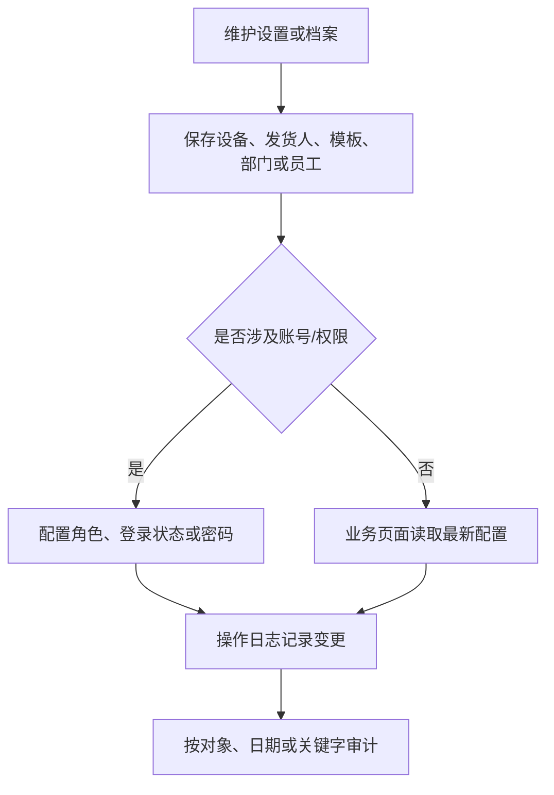

# 操作手册：设置与审计

## 适用范围
设备产能配置、发货人设置、代加工模板设置、部门维护、员工维护、操作日志。

## 入口
- 设置：设备产能配置、发货人设置、代加工模板设置
- 档案：部门维护、员工维护
- 日志：操作日志

## 流程图

## 标准操作
1. 设备产能配置用于生产计划和排产判断，新增或调整设备后要检查容量区间和可用状态。
2. 发货人设置用于订单发货、导出和物流信息，变更后要核对默认发货资料。
3. 代加工模板设置用于外包或代加工订单，维护模板名称、费用口径和适用场景。
4. 部门和员工维护用于权限、操作归属和审计追踪，新增员工后确认所属部门。
5. 操作日志用于查看关键对象的 create、update、delete 记录，必要时按日期或关键字过滤。

## 员工权限与账号
- 员工维护页只面向内部用户；在“系统 / 员工维护”中维护员工资料、登录启停、密码和内部角色，菜单和 API 会按角色权限控制。
- 系统菜单不再提供独立“用户权限”入口；历史 `view=userPermissions` 链接会进入员工维护。
- 员工维护列表会过滤外部用户，不提供账号类型切换，也不出现渠道客户或客户业务角色。
- 外部用户如果需要登录客户侧系统，到客户履约运营台的目标客户下创建账号、设置密码、启停登录。
- 客户能力在客户门户配置中选择模板；客户门户配置页只提供“去履约运营台管理”入口，不直接绑定外部账号。
- 在账号列切换可登录/已停用；停用后员工不能再登录，已有 Bearer 会话也不能继续访问。
- 未设置密码时按钮显示设置密码，已有密码时显示重置密码；密码至少 6 位，保存后账号自动恢复为可登录。
- `/login` 支持用户名或手机号加密码登录；短信登录仍只支持手机号。
- 系统顶部退出会注销当前会话、清除本机 token，并回到登录页。
- 账号启停、密码设置/重置和角色变更都会进入操作日志。

## 结果校验
- 设置保存后刷新页面仍能看到最新值。
- 相关业务页面使用的是最新配置。
- 关键变更能在操作日志中查到操作人、对象、时间和变更内容。
- 员工、部门、设备、模板不会出现重复或不可识别名称。
- admin 角色账号应拥有全权限菜单；非管理员只能看到自己角色允许的菜单。
- 外部用户登录后只进入绑定客户的客户工作台，不能通过员工维护获得内部员工菜单。

## 常见问题
- 配置保存后业务页面没变化：检查是否需要刷新、是否存在更高优先级配置。
- 操作日志看不懂：优先用对象名称、订单号、商品名或客户名过滤。
- 员工无法归属操作：检查员工档案和登录上下文是否匹配。
- 客户外部账号不在员工维护页：这是预期行为；进入客户履约运营台，选择客户后在“外部用户”区域维护。
- 设备产能影响生产计划时，要同步检查生产计划和生产中页面。
