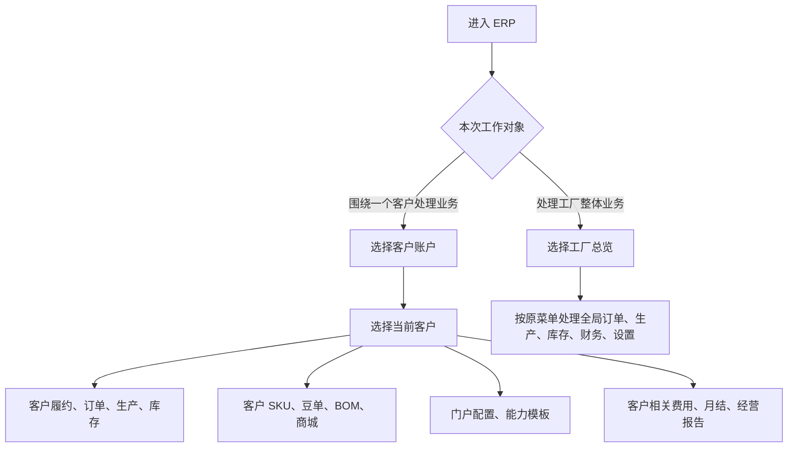

# 操作手册：工作台模式

## 适用范围
工厂内部员工在同一个 ERP 中切换“工厂总览”和“客户账户”两种页面排布。该功能不替代用户权限，只改变页面入口和当前客户上下文。

## 入口
- ERP 顶部栏：工厂总览 / 客户账户。
- 客户账户模式下：顶部“当前客户”选择器。
- 相关复用页面：履约运营台、录单、订单列表、生产计划、SKU设置、产品豆单、BOM配方维护、商城管理、客户门户配置、能力模板、费用管理、月度结账、经营报告。

## 流程图

## 标准操作
1. 处理工厂整体运营时，保持“工厂总览”。左侧菜单仍按订单销售、生产管理、库存管理、商品与配方、财务管理、设置、系统、需求管理展开。
2. 围绕某一个客户连续处理业务时，切到“客户账户”，再在“当前客户”选择器中搜索并选择客户。
3. 客户账户模式会把左侧入口重排为客户账户、客户商品与配方、门户与能力、客户财务；这些入口仍复用原页面和原权限。
4. 选择客户后，系统会把当前 `customer_id` 带入录单、订单列表、生产计划、SKU设置、产品豆单、BOM配方维护、客户履约运营台、客户门户配置和费用管理。
5. 在 SKU设置、产品豆单、BOM 或履约运营台内切换客户时，顶部“当前客户”会同步更新，便于单人连续操作。
6. 客户账户模式下新增订单会默认选中当前客户，并只加载该客户可用的客户 SKU、公共 SKU 和豆单版本。
7. 客户账户模式下订单列表按当前客户过滤；费用管理新增费用默认带当前客户，费用列表也按当前客户过滤。
8. 需要回到全局订单、全局库存、公司设置、员工权限或需求表时，切回“工厂总览”。

## 结果校验
- 切换“客户账户”后，左侧菜单变为客户账户相关入口，不再把系统和需求管理入口混在客户操作路径里。
- 选择客户后刷新页面，URL 保留 `workspace=customer&customer_id=...`，页面仍处在同一客户账户上下文。
- 从客户账户模式进入 SKU设置、产品豆单、BOM、履约运营台时，不需要在每个页面重新选择客户。
- 从客户账户模式进入订单列表时，只展示当前客户订单。
- 从客户账户模式进入费用管理时，新增费用默认关联当前客户，费用列表只查当前客户。
- 切回工厂总览后，菜单和页面行为恢复为原来的全局视角。

## 常见问题
- 看不到某个入口：先检查当前账号权限。工作台模式只重排页面，不放大权限。
- 客户账户选择器没有客户：检查客户是否为启用客户、是否已有履约/门户配置；必要时先到客户档案和客户门户配置维护。
- 在客户账户模式仍需要处理其他客户：直接切换顶部“当前客户”，不用退出页面。
- 要做公司、员工、权限或需求表维护：切回工厂总览。
