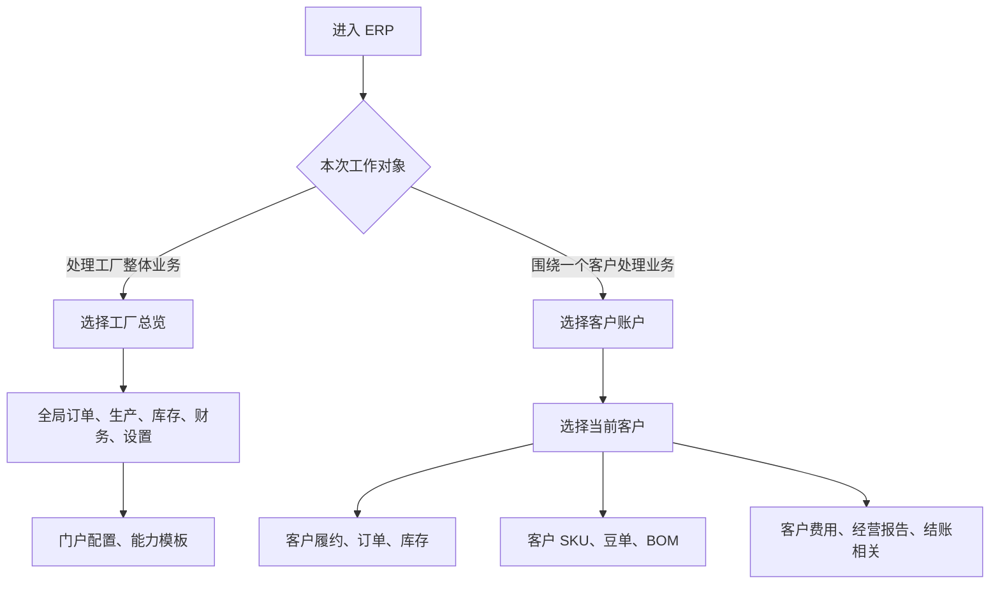

# 操作手册：工作台模式

## 适用范围
工厂内部员工在同一个 ERP 中切换“工厂总览”和“客户账户”两种页面排布。该功能不替代用户权限，只改变页面入口和当前客户上下文。

## 入口
- 内部员工 ERP 顶部栏：工厂总览 / 客户账户。
- 内部员工客户账户模式下：顶部“当前客户”选择器。
- 渠道客户账号登录：不展示工作台切换和当前客户选择器，左侧只显示“工作台”和“费用相关”。
- 相关复用页面：录单、订单列表、仓库库存、SKU设置、产品豆单、BOM配方维护、客户履约运营台、费用管理、经营报告、月度结账。
- 工厂内部设置页面：客户门户配置、能力模板、商城管理等仍放在工厂总览，不放入客户账户模式；生产计划/开始生产也只在工厂总览的生产管理中处理。

## 流程图

## 标准操作
1. 处理工厂整体运营时，保持“工厂总览”。左侧菜单仍按订单销售、生产管理、库存管理、商品与配方、财务管理、设置、系统、需求管理展开；“客户履约账户/履约运营台”不再放在工厂总览。
2. 围绕某一个客户连续处理业务时，切到“客户账户”，再在“当前客户”选择器中搜索并选择客户。
3. 客户账户模式会把左侧入口重排为客户账户、客户商品与配方、客户财务；不展示客户门户配置、能力模板、生产计划/开始生产和工作台模式手册。
4. 选择客户后，系统会把当前 `customer_id` 带入录单、订单列表、仓库库存、SKU设置、产品豆单、BOM配方维护、客户履约运营台和费用管理。生产计划/开始生产属于工厂总览生产管理，不跟随客户账户模式切入。
5. SKU设置、产品豆单、BOM 和费用管理在客户账户模式下锁定顶部当前客户；页面内不再让操作员改选其他客户。
6. SKU设置和 BOM 配方维护只展示公共配置与当前客户自己的配置。公共配置可作为参考或复制来源，不能在客户视角误改为其他客户配置。
7. 客户账户模式下新增订单会默认选中当前客户，并只加载该客户可用的客户 SKU、公共 SKU 和豆单版本。
8. 客户账户模式下订单列表按当前客户过滤；库存只展示当前客户相关成品库存；费用管理新增费用默认带当前客户，费用列表也按当前客户过滤。经营报告和结账相关也按当前客户过滤。
9. 渠道客户账号登录 ERP 客户工作台时，系统直接进入自己绑定客户的“工作台”；左侧另有“费用相关”，包含费用明细、经营报告和结账相关，不展示“工厂总览 / 客户账户”和“当前客户”选择器。
10. 渠道客户账号的工作台不再嵌入费用明细或结算单；费用信息统一从“费用相关”查看。
11. 渠道客户账号的费用明细和结账相关为只读展示，只看当前客户相关收入、费用和工厂账期状态，不新增费用、不执行结账、结账后调整或会计交接导出。
12. 需要回到全局订单、生产计划/开始生产、全局库存、门户能力、公司设置、员工权限或需求表时，内部员工切回“工厂总览”。从客户账户切回工厂总览后，SKU设置 的内部归属也会回到公共SKU，避免继续停留在刚才客户的客户 SKU 视角。
13. PR-315-SHELL-MENU-SCROLL-TOUCH：左侧菜单固定在单屏视口内独立滚动，右侧功能页面独立滚动；点击任何功能菜单后功能页面回到顶部。手机端右滑呼出功能菜单，左滑隐藏功能菜单。

## 结果校验
- 切换“客户账户”后，左侧菜单变为客户账户、客户商品与配方、客户财务三组入口，不再把系统、需求管理、门户配置、能力模板、生产计划/开始生产和工作台模式手册混在客户操作路径里。
- 选择客户后刷新页面，URL 保留 `workspace=customer&customer_id=...`，页面仍处在同一客户账户上下文。
- 从客户账户模式进入 SKU设置、产品豆单、BOM、库存、费用管理和履约运营台时，不需要在每个页面重新选择客户。
- SKU设置、BOM 和产品豆单只出现公共配置与当前客户配置，不出现其他客户配置。
- 仓库库存只出现当前客户相关成品库存，不出现工厂原料库存或跨客户追溯工具。
- 从客户账户模式进入订单列表时，只展示当前客户订单。
- 从客户账户模式进入费用管理时，新增费用默认关联当前客户，费用列表只查当前客户；经营报告和结账相关也只查当前客户。
- 客户账户模式不会出现生产计划/开始生产、生产管理相关手册或工作台模式手册入口；生产排产和开工统一从工厂总览处理。
- 渠道客户账号登录后看不到顶部工作台切换和当前客户选择器，只看到“工作台”和“费用相关”两个菜单；工作台不嵌入费用明细或结算单。
- 渠道客户账号从“费用相关”进入费用明细、经营报告和结账相关时，不需要选择客户，也不能看到其他客户数据；客户侧费用明细没有新增费用入口。
- 切回工厂总览后，菜单和页面行为恢复为原来的全局视角。
- 切回工厂总览后再进入 SKU设置，SKU归属显示公共SKU，客户账户中锁定的客户 SKU 视角不会残留。
- 左侧菜单上下滑动始终在当前屏幕范围内；从一个短页面切到其他功能时，新功能页面显示在顶部，不会停留在旧滚动位置。
- 手机端右滑可以打开左侧功能菜单，左滑可以隐藏功能菜单。

## 常见问题
- 看不到某个入口：先检查当前账号权限。工作台模式只重排页面，不放大权限。
- 客户账户选择器没有客户：检查客户是否为启用客户、是否已有履约/门户配置；必要时先到客户档案和客户门户配置维护。
- 在客户账户模式仍需要处理其他客户：内部员工切换顶部“当前客户”；渠道客户账号不能切换客户。
- 要做生产排产/开始生产、门户能力、公司、员工、权限或需求表维护：切回工厂总览。
- 切换功能后右侧看似空白：先确认页面是否已经自动回到顶部；如果仍异常，再刷新页面并记录当前功能名称和 URL。
