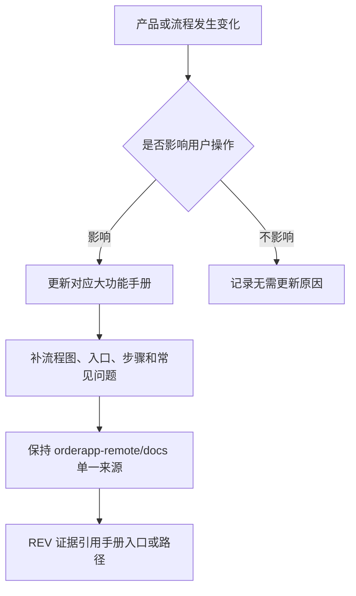

# 操作手册总索引

- [小程序员工简易 ERP](OP_MANUAL_MINIAPP_EMPLOYEE_ERP.md)：销售/管理员员工登录、客户维护（按负责人权限）、粘贴收货信息并复用 ERP 地址解析、录单内快捷维护、多商品明细、本人服务器订单草稿、完整订单详情、页面底部继续上拉展示品牌标识、管理员图片分享入口全局开关，以及销售单/发货单 PDF 与图片微信分享。

> 目的：把“用户怎么操作系统”沉淀成可查、可验收、可部署的手册，避免功能做完但现场不知道怎么用。

## 维护规则
- 开发时只要改变用户操作方式，就必须更新操作手册。字段、按钮、入口、权限、导入导出、异常处理、流程顺序变化都算。
- 单个大功能一个独立手册。小改动更新所属大功能手册，不把多个大功能混在一个长文档里。
- 手册必须写清：入口、适用角色、前置条件、标准步骤、结果校验、常见问题、关联数据影响。
- 手册必须有图示：每个大功能 `OP_MANUAL_*.md` 至少包含一个 `## 流程图` 和 Mermaid `flowchart`，让操作人员先看流程再看文字。
- 需求完成前必须检查现有手册是否缺入口、缺字段、缺步骤、缺权限说明、缺导入导出说明、缺排障说明。
- 手册只维护 `orderapp-remote/docs` 一份；不要在仓库根目录恢复 `OPERATION_MANUALS.md` 或 `OP_MANUAL_*.md` 副本。
- REV 证据必须包含 `orderapp-remote/docs/...` 手册路径或前端手册入口；部署时线上 `/app/docs` 直接来自 `orderapp-remote/docs`。

## 当前手册
- 手册入口必须直接放在对应大功能菜单内，不单独建立“手册”或“文档”菜单。
- `OP_MANUAL_REQUIREMENTS.md`：需求管理 5 张表和证据闭环。
- `OP_MANUAL_WORKSPACE_MODE.md`：顶部“当前视图”/视图上下文、客户视图、订单视图、保存视图和旧工作台 URL 兼容。
- `OP_MANUAL_ORDER_SALES.md`：录单、订单列表、客户档案、销售单、合同盖章和出库单。
- `OP_MANUAL_PRODUCTION.md`：生产配置四个 Tab（含生产 BOM）、生产流程五个 Tab、生产中、BOM 版本/多层展开快照、WIP 覆盖、工位产能按工时/按计件成本、生产日志、分配批次和工单成本追溯。
- `OP_MANUAL_STOCK.md`：库存作业、Stock Entry单据、WIP 领退、工单消耗、完工入库、报废/损耗和库存操作日志。
- `OP_MANUAL_INVENTORY_MATERIALS.md`：物料、原料入库、批次、库存流水、库存调整、商品档案、客户商品、商品配置和分类模板、阶梯价模板、单位模板、生产 BOM 制造主档/BOM 大组与组内分类、BOM 版本级组件编辑、商品 BOM 使用关系、分类交互和行业字段。
- `OP_MANUAL_COSTING.md`：成本试算、按工时/按计件工序成本快照与分列、商品生产配置字段、分类模板单归类、产品价格表预览、价格表发布、客户商品价格来源。
- `OP_MANUAL_GREEN_BEAN_SALES.md`：生豆产品建档、生豆豆单、ERP 录单、小程序下单和历史绑定熟豆兼容口径。
- `OP_MANUAL_FINANCE.md`：财务首页、费用管理、月度结账、经营报告、票税台账、财务设置。
- `OP_MANUAL_SETTINGS_AUDIT.md`：系统与业务设置、小程序图片分享入口全局开关、部门员工、当前账号防自停用和操作日志。
- `OP_MANUAL_NOTIFICATIONS.md`：通知规则、ERP 站内通知和外部 IM 扩展框架。
- `OP_MANUAL_CUSTOMER_PORTAL.md`：客户门户配置、小程序主题、商城、小程序登录、页面底部继续上拉品牌标识、外部账号关联与 ERP 工作台授权分离、我的豆单、客户自有销售豆单和客户侧入口联调。
- `OP_MANUAL_CUSTOMER_FULFILLMENT.md`：客户管理与客户履约全流程，覆盖客户档案、门户客户配置、客户门户能力模板、客户履约手册入口、角色权限、客户开通、客户商品、客户行业字段覆盖、外部用户登录与工作台隔离、客户账户模式、小程序商城、Excel 导入、托管库存、代发/代加工、费用和月结。
- `OP_MANUAL_ORDERLIST_STAGING.md`：历史咖啡销售 Excel 的只读取数、稳定来源键、备注/收件地址客户类型提炼与最近手机号审核、独立临时库装载、幂等校验和正式库零写入检查。

## 手册维护流程图

## 2026-05-07 查缺补漏结果
- 已补操作手册总索引，统一命名和维护规则。
- 已补大功能级初版手册，覆盖当前 Vue/Vite 左侧菜单里的主要用户操作区。
- 已将手册入口放入各大功能菜单，并删除被大功能手册覆盖的旧 `*-user-manual.md` 文档。
- 已为所有大功能手册补充流程图，并让 Vue/Vite 通用手册页展示节点和箭头图示。
- 已补 `HOW_TO_WORKFLOW.md`：操作手册更新进入固定交付流程。
- 已补 `DEPLOYMENT.md` 和 `deploy_orderapp.sh`：部署时使用 `orderapp-remote/docs` 作为线上手册唯一来源。
- 后续新增大功能时，必须新增对应 `OP_MANUAL_<FEATURE>.md`，并把入口放在对应大功能菜单里。

## 后续必须补的手册
- 任何仍由旧 HTML 模板承载的页面迁移到 Vue/Vite 后，要把真实入口和步骤补进对应手册。
