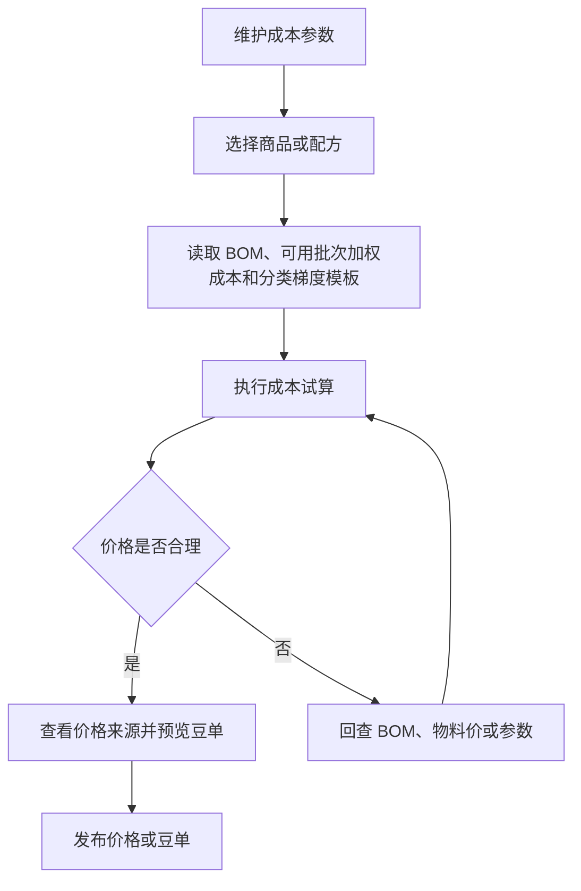

# 操作手册：成本核算

## 适用范围
成本参数设置、成本试算、产品价格表预览、价格发布。

## 入口
- 商品与配方：产品价格表
- 物料管理：成本核算
- 设置：成本参数设置

## 流程图

## 标准操作
1. 先进入成本参数设置，检查基础换算、生产包装、零售税费/物流等参数；理论成本优先使用商品生产配置中的预期损耗率，系统内部按 `1 - 预期损耗率` 得到产出因子；商品报价由商品价格管理的最终价格记录和商品价格表快照决定。
2. 进入成本核算，选择商品或配方，确认物料、BOM、当前可用批次成本和试算参数。
3. 执行成本试算，查看成本、供应价、零售价和发布价格表将固化的价格档快照。
4. 如需维护挂耳商品报价，按普通商品处理：在商品价格管理维护最终价格记录和价格单位，再通过商品价格表发布快照；不要再使用挂耳专用模板。
5. 查看豆单预览，确认风味、产地、处理法、等级、海拔等展示信息。
6. 在产品价格表的“已发布价格表”按“价格表归属”查看公共或具体履约客户的版本；需要客户自己的报价时优先在客户商品维护客户展示名并绑定商品档案。客户商品填写“重命名”后，该客户价格表优先使用重命名展示。
7. 生成或发布价格表前确认价格表归属：工厂自营/公共归属用于工厂报价，客户归属用于指定客户。
8. PR-395-PRODUCT-PRICE-CLASSIFICATION：产品价格表的商品类型来自商品档案或客户商品当前归属的分类模板名称；未归类统一进入“其他”。生成抽屉里的“选择分类和产品”来自当前归类的分类项，不再依赖旧产品类型/产品子类型。
9. PR-387-VIEW-CONTEXT：如果顶部“当前视图”是某个客户，产品价格表会把价格表归属锁定为该客户；如果当前视图是订单，系统先派生订单客户，再按该客户客户商品生成候选。
9. PR-390：价格表、成本试算和 PDF 展示的产品信息优先读取商品生产配置字段；旧商品没有生产配置字段时，才 fallback 到旧 BOM 版本特殊属性或旧 SKU 特殊属性字段。
11. 确认无误后发布价格表，让录单、报价和客户侧展示使用新版本。
12. 如客户需要把工厂供货豆单改成自己的销售豆单，不在 ERP 产品价格表里手工改客户转售价；先发布或确认工厂供货豆单，再让客户在小程序“我的豆单”基于该供货快照制作客户转售豆单。

## 梯度模板和价格来源
- PR-439-PRODUCT-PRICE-MASTER-REMODEL：商品价格管理维护最终价格记录，价格分组只用于页面分类和筛选，不是业务类型。价格记录包含关联商品/客户商品、最终单价、价格单位、币种、有效期、分组、状态和备注；阶梯方案的每个档位引用一条最终价格记录，引用后就是该档位最终价，不再二次套利润率或成本加成。
- PR-439-PRODUCT-PRICE-MASTER-REMODEL：商品价格表负责选择价格记录或阶梯方案、生成草稿、发布版本并形成快照。商品档案和客户商品只读展示价格摘要，摘要内容来自已发布价格表快照，包括来源价格表版本、最终价、价格单位、档位和更新时间；没有快照时显示 `暂无价格表价格`。
- PR-439-PRODUCT-PRICE-MASTER-REMODEL：录单单位和价格来自已发布价格表快照；价格表是什么单位，订单行就是什么单位。价格单位到库存单位的换算必须在价格记录或价格表快照中固化，没有换算时不得发布价格表或录单。
- PR-439-PRODUCT-PRICE-MASTER-REMODEL：普通商品和客户商品保存不再写入旧模板字段。旧商品配置模板、阶梯价模板、单位模板和分类模板保留为历史兼容或迁移来源，普通用户的新价格维护从商品价格管理和商品价格表进入。
- PR-396 / PR-410 / PR-417 / PR-439：产品价格表生成和成本核算以“客户商品 + 商品档案 + 商品分类 + 商品价格管理 + 产出 BOM”为主链路。客户商品负责对外名称、系统生成编号、重命名、是否进入价格表和客户行业字段覆盖；商品档案负责库存、销售、成本和生产产出对象；商品分类只负责组织、筛选和报表分组；商品价格管理负责最终价格记录、价格单位、库存换算和阶梯价格方案；生产 BOM 声明产出商品、版本和组件清单。
- PR-397 / PR-439：产品价格表候选查询使用商品档案或客户商品的直接分类字段，不再依赖分类模板。客户范围生成价格表时，产品信息字段优先读取客户商品维护的行业字段覆盖值；客户商品未填写时回退商品档案的行业字段值。停用后的客户商品不会进入默认客户价格表候选。
- 价格表和 PDF 不再从 BOM 版本维护特殊属性，也不展示预期产出率维护字段。需要展示烘焙度、布料参数、鲜果成熟度等产品信息时，在商品档案或客户商品的行业字段中维护，并勾选进入价格表。
- 在 商品价格管理 维护最终价格记录：选择商品或客户商品，填写最终单价、价格单位、币种、有效期、价格分组、库存单位、库存换算、状态和备注。价格分组只用于页面筛选和管理，不参与业务取价。
- 需要阶梯价格时，在 商品价格管理 维护阶梯价格方案。每个档位引用一条最终价格记录；引用后该记录的最终价、价格单位和币种就是该档位最终价，不再二次套利润率、固定价或成本加成。
- 商品价格表生成预览会把商品价格管理中的已发布最终价记录和阶梯价格方案投影为价格档，并随价格档冻结来源价格记录、最终价、价格单位、库存单位和库存换算。已有有效最终价记录时，不再提示去旧商品配置模板维护计价方式；只有没有最终价记录、没有阶梯方案且没有历史兼容计价来源的商品才显示缺价格提示。
- 客户小程序转售豆单只能基于当前客户可见的已发布工厂供货价格表快照。需要开放给客户转售时，确认来源价格记录或阶梯价格方案允许转售，且来源价格单位和库存换算能生成客户转售快照。
- PR-400 / PR-404 / PR-439：商品没有有效最终价格记录或阶梯价格方案时，产品价格表不得自动补默认档位或旧 Excel 档位。商品卡片应提示维护商品价格记录和价格表快照；不再引导普通用户去商品配置模板选择计价方式。
- PR-415-PRODUCT-PRICE-LIST-NO-DRIP-TEMPLATE：产品价格表候选、生成抽屉、预览卡片和 PDF 产品选择使用同一套候选过滤。旧 Excel 豆单 metadata code 缺失时不隐藏商品；挂耳、速溶或未归类商品仍进入候选。挂耳不再有专用价格模板或专用渲染枚举，新生成的商品价格表按普通商品价格记录和阶梯价格方案发布快照。
- PR-435-PRICE-LIST-CATEGORY-ALIGNMENT：商品价格表的商品类型下拉跟随商品档案或客户商品当前直接分类。没有当前分类的商品统一合并为 `未分类商品`。旧 `product_type_category_id`、`product_type_name` 和历史 `list_type` 只用于历史快照兼容，不再在新价格表下拉里生成多个“其他”。
- PR-439 follow-up：商品价格表候选直接读取 `product_category_id` 派生出的一级/二级分类；有直接分类时，一级分类用于商品类型入口，二级分类用于表内分组。旧分类模板字段只作为历史快照兼容，不再决定新价格表入口。
- PR-437-PRICE-LIST-EMPTY-PRODUCTS：如果当前价格表归属、客户或分类下暂时没有可用商品，商品价格表显示空状态或 `商品数 0`，不会弹出 `products required`。此时不能发布空价格表，需要先维护商品档案或客户商品后再生成。
- PR-411 / PR-439：如果只是某个客户的对外规格、报价单位、固定单价、成本加成或阶梯利润不同，不必复制商品档案。进入 `商品与配方 → 商品价格管理`，为该客户商品维护最终价格记录、价格单位和阶梯价格方案，再发布该客户商品价格表。旧客户商品直接阶梯价/单位字段仅作为历史兼容读取来源。
- PR-410：客户商品抽屉中的 `重命名` 用于客户侧报价名称。生成客户范围产品价格表、价格表 PDF 或发布快照时，展示名称优先级为 `重命名 > 客户商品 > 商品档案名`；底层旧 `brand_name` 字段仅作为兼容存储字段保留。
- 若某个商品需要长期使用不同对外价格，在 商品价格管理 维护该商品或客户商品的最终价格记录和价格分组，再通过商品价格表发布新快照。只改变某客户对外价格时，优先维护该客户商品对应的价格记录和客户价格表，不直接改公共商品档案。
- 成本核算和商用豆单中的“来源”按钮可打开价格来源抽屉，查看最终价格记录、价格表快照、当前试算、临时试算和公式步骤。
- 公式步骤会展示原料成本、预期损耗率、kg/lb 换算、生产成本、包装成本、损耗、税费、利润率和最终价格等关键值；如需产出因子，系统内部按 `1 - 预期损耗率` 换算。
- 熟豆成本试算中的原料成本来自 BOM 物料的当前可用批次加权平均成本：`Σ(批次当前可用克重 × 批次单位成本) ÷ Σ(批次当前可用克重)`；没有可用批次时才回退物料默认采购价。
- 如果入库价格录错，先到库存调整单选择“批次成本”修正对应原料批次；不要直接改物料档案采购价来影响已入库库存。
- 商用价格来源抽屉可以临时输入原料成本、预期损耗率和利润率并点击“重新试算”，用于查看该档价格变化；这些参数只影响当前抽屉结果，不保存到成本参数、商品生产配置或商品价格记录。
- 需要长期调整原料成本、预期损耗率或利润率时，按参数来源回到成本参数设置、商品档案的商品生产配置或商品价格管理维护。
- 修改快速成本参数、价格记录或价格方案后，只会刷新未发布的成本试算和豆单预览；已发布豆单、录单和客户下单价格不会静默改变，必须重新发布价格或豆单后才生效。
- 生豆价格表不套用熟豆销售公式。系统按生豆商品与对应熟豆产出 BOM 的历史映射/兼容关系读取原料成本快照生成成本参考价；拼配按 BOM 比例加权，单品取 BOM 中对应原料成本。生豆销售价来自商品价格管理中的最终价格记录和已发布价格表快照；KG 价格必须在价格记录和快照中固化价格单位、最终价和库存换算。只有生成并发布新版价格表后，录单才会使用新价格。

## 价格表版本
- 每次发布价格表都会生成一条已发布版本，版本号、配置、内容、归属客户、发布时间和更新说明都保留在产品价格表的“已发布价格表”中。
- PR-438-PRODUCT-TEMPLATE-DELETE-PRICE-LIST-UI：已发布价格表支持按版本号、客户归属、用途、状态和更新说明搜索，列表按分页展示，可切换每页条数，也可点击“收起”临时隐藏版本行。收起后筛选条件和总数仍保留，重新展开可继续翻页查看。
- 产品价格表版本列表增加“用途”筛选：默认查看“工厂供货豆单”，即 ERP 录单、客户下单和工厂履约计价使用的版本；切到“客户转售豆单”时，只用于管理员查看客户发布给其下游客户的分享版本和来源追溯。
- PR-395/PR-439：客户价格表发布时会同时冻结客户商品、商品档案、直接分类、最终价格记录、价格单位、库存换算、来源价格记录、阶梯方案、生产 BOM 版本和价格来源 JSON。后续客户商品改名、商品档案改名、BOM 升级、分类调整或价格记录调整，都不会回改已发布价格表。
- 录单、客户门户和履约下单会优先使用已发布价格表中的客户商品价格快照。客户商品没有有效价格时，客户侧和履约侧不会按 0 元静默下单；需要先在产品价格表发布对应客户的价格，或由内部录单明确填写手工价并留下订单保存日志。
- 客户转售豆单的 `publication_purpose=customer_resale`，也称客户转售商品价格表，仅用于客户对外分享，不参与 ERP 录单默认价格版本、客户向工厂下单、结算、费用中心或工厂履约计价。需要调整工厂供货价时，仍要发布新的 `factory_supply` 价格表/豆单。
- PR-433 后，小程序“我的价格表设置”不再提供覆盖档位或单品价；旧 payload 中的 `label`/`price` 单品覆盖字段会被后端忽略。客户只能通过统一加价、倍率加价、商品选择、品牌说明、样式背景和上新/推荐标签生成自己的展示价格表。
- PR-350-BEAN-LIST-PUBLISH-MANUAL-WITHDRAW：发布新版不会自动撤回旧版；旧版会继续保持已发布，直到管理员在版本列表中手动点击撤回。撤回后该版本仍保留历史快照和下载能力，但不再进入录单可选豆单。
- 页面顶部的“价格表归属”下拉列出工厂自营/公共归属和每个履约客户；选择某个客户后，下方版本列表只展示该客户的价格表版本。可在版本列表中按产品类型筛选，点击“生成新版”会按当前归属和产品类型打开生成抽屉，不再复制历史配置；管理员可撤回当前仍在发布状态的版本。
- 在版本列表点击“下载 PDF”会按该行版本的已锁定内容和样式打开浏览器打印/保存 PDF，不会用当前实时价格、当前抽屉配置或当前筛选结果改写历史豆单。
- 客户小程序打开同一版本 PDF 时由系统按版本缓存。第一次打开时生成并保存；后续访问同一版本直接复用缓存，不重复生成。
- 官方豆单是没有专属客户时的公共兜底；客户豆单只对归属客户生效，客户自己的历史版本可继续追溯，但新版本按当前商品档案、客户商品、商品分类和商品价格记录直接生成。
- 客户豆单打开“生成豆单”时，版本号会默认从当前客户已发布版本或复制的官方价格源版本递增一小步：`V1` 默认 `V1.01`，`V1.01` 默认 `V1.02`，`V3.0.5` 默认 `V3.0.6`。如需大版本号，可在发布前手动改版本号。
- ERP 录单按熟豆、生豆、挂耳分别选择豆单版本，默认使用当前客户对应类型的最新发布版本；没有客户专属版本时使用公共版本。订单商品行保存实际匹配的发布 ID 和版本号。
- 发布新版豆单时，在更新说明中写清新增、下架和价格/文案调整，客户小程序首次下单提示会引用这些内容。
- 发布、撤回、缓存生成和客户确认新版都会写入操作日志，便于追溯谁在什么时间改变了可用豆单。

## 挂耳商品计价
- 挂耳只是商品名称或分类口径，不再有单独的挂耳供应价模板、默认挂耳模板或挂耳专用价格表枚举。
- 挂耳商品如果需要按盒、袋或其他规格报价，在 `商品与配方 → 商品价格管理` 维护最终价格记录、价格单位、库存换算和阶梯价格方案，再通过商品价格表发布快照。
- 价格表预览、生成抽屉和 PDF 都按商品当前归类显示商品类型；分类名包含“挂耳”也不会切换到旧 `drip_wholesale_tiers`。
- 历史已发布的旧挂耳价格表和旧订单快照仍可读取、下载和追溯；新发布价格表不再使用挂耳专用模板生成价格。

## 客户上下文
- 商品与配方下的商品档案、客户商品、商品分类管理、商品价格管理分别维护执行对象、客户展示对象、组织分类和价格主数据，不再把价格规则塞回商品档案或客户商品。
- 客户侧新增报价对象优先使用“客户商品”。客户商品绑定一个商品档案，维护客户展示名、系统生成编号、重命名、排序、是否进入价格表和客户展示分类；单个新增和批量添加商品档案都不手工填写客户商品编号。工厂自营也作为一个内置客户-like 归属维护客户商品。
- 创建商品档案时填写名称、分类、库存单位、整数库存、行业字段和备注，不选择旧分类模板、产品类型、产品子类型、商品配置模板、单位模板或阶梯价模板。新增商品档案不在新增表单里复制 BOM、价格记录或价格表快照；生产结构到生产 BOM 维护，价格到商品价格管理维护。
- 客户只改名称、重命名或客户侧分类时，创建客户商品并绑定已有商品档案。配方、包装、生产方式、库存对象或成本口径变化时，才使用“创建新商品档案”或“复制为商品档案”生成新执行对象，再维护生产 BOM。复制为商品档案只复制基础资料、库存单位、整数库存和行业字段，不复制 BOM、价格、价格表快照或客户商品关系。
- 产品价格表页面顶部“价格表归属”是生成和发布的唯一归属上下文：当前为工厂自营/公共归属时发布公共产品价格表，当前为某个履约客户时发布该客户产品价格表。进入“生成价格表”抽屉后只会显示“当前归属”，不再二次选择发布归属或客户。
- 版本列表、“生成价格表”抽屉和下方预览卡片中的分类来自商品档案或客户商品直接分类字段。PR-435 后，如果商品没有当前分类，只会进入一个“未分类商品”，不会按旧字段拆成多个“其他”。
- PR-437 后，如果当前归属没有任何可生成商品，页面保留价格表版本列表并展示空状态，不会把内部试算校验 `products required` 显示给用户。需要先到 商品档案 或 客户商品 维护可用商品，再回到 商品价格表 生成新版。
- 旧 `list_type`、旧商品配置模板、旧单位模板、旧阶梯价模板和旧分类模板仍作为历史发布快照兼容字段保留：生豆历史快照仍按生豆价档读取，旧挂耳快照仍可追溯；新生成的商品价格表不再通过“挂耳”硬编码或 `product_kind=drip_bag` 切换专用模板。
- 选择某个履约客户范围时，产品价格表默认只展示该客户启用、纳入价格表且绑定有效商品档案的客户商品，不混入其他客户商品。页面顶部统计、分类下拉、下方预览卡片、生成价格表抽屉内的产品列表和发布内容都只来自该价格表归属的客户商品。客户商品填写重命名后，客户价格表优先显示重命名；重命名为空时使用客户商品，不自动填工厂品牌。
- 顶部“当前视图”只是价格表页面的默认归属和过滤来源，不替代后端校验。发布时仍按价格表归属客户冻结客户商品、商品档案、价格记录、价格单位、库存换算和生产 BOM 版本；旧价格表版本不被回改。
- 客户商品绑定到商品档案后，产品价格表和成本核算使用可产出该商品档案的生产 BOM 版本。BOM 发布新版不会自动影响已发布价格表或历史订单；需要升级成本口径时先确认新版成本，再重新生成并发布价格表。
- 公共 SKU 或客户 SKU 即使没有旧 Excel 豆单编码，只要有商品分类和价格记录，也会按分类路径生成产品价格表展示信息；不会因为缺少旧商用豆单编码而消失。
- 客户商品不再依赖旧 Excel 豆单资料。只要客户商品绑定有效商品档案，产品价格表客户范围会按客户商品直接分类生成分组；客户商品没有分类时进入“未分类”，旧展示分类只作为历史 fallback。
- 生豆、挂耳、速溶和普通熟豆都读取各自已发布价格表快照；订单保存实际匹配的发布 ID、版本号、最终价、价格单位、来源价格记录和库存换算。
- 生成价格表不再提供“复制已有豆单配置”。商品档案、客户商品、分类和价格差异先在 商品档案、客户商品、商品分类管理、商品价格管理 中处理，产品价格表按当前数据和本次抽屉设置直接生成。
- 客户自己的价格表会读取产品价格表中的价格表归属，后续发布或保存草稿时要确认归属正确，避免把客户自己的价格表内容保存到错误客户。如果只想维护工厂自营/公共价格表，在产品价格表中把“价格表归属”切回公共归属。

### 历史兼容索引
- 以下旧词只用于历史 PR 回归、旧快照解释和迁移排查，不是 PR-439 后普通用户的新价格维护入口：客户自己的商品分类、schema 修复、PR-359-PRODUCT-KIND-MIGRATION-CLEANUP、PR-360-SKU-CATEGORY-SUBTYPE-CLARITY、PR-392、停车场、PR-372-PRODUCT-CONFIG-DISPLAY-UNIT、PR-373-PRODUCT-CONFIG-UI-POLISH、PR-382、PR-389、允许客户转售豆单使用、产品级利润率覆盖、价格表展示单位、单位模板和单位换算、商品配置模板列表、感叹号、SKU复制、历史 SKU 复制抽屉、左右滑动。
- 生豆旧手册曾写“页面会提示“梯度按 KG，单价按元/KG””、“档位价格输入框是元/KG”和 `60kg+`。PR-439 后，KG 价格仍必须按元/KG 解释，但最终价、价格单位和库存换算来自商品价格管理和已发布价格表快照。
- 历史客户商品口径“客户只改名称、编号、重命名或展示分类时，创建客户商品并绑定已有商品档案”仍成立；PR-439 后展示分类来自客户商品直接分类字段。客户商品还没有展示分类时，产品价格表会把它放到“未分类”。旧示例“1、定制咖啡熟豆”分组和速溶咖啡分类只作为历史分组示例。
- 旧“单位规则维护在“商品配置模板”里”和“新增换算”只用于解释旧价格表或旧订单；新价格单位到库存单位的换算维护在商品价格记录或价格表快照中。
- 历史规则“是否进入产品价格表由产品价格表页面决定”和“已发布价格表和历史订单不会被回改”仍保留；PR-439 后具体价格来源改为已发布价格表快照。

## BOM失效处理
- 成本核算页如果顶部出现 “BOM已失效”，表示至少有一款产品的当前 BOM 被手动失效或跟随产品失效。
- 商品行和豆单预览区域会显示 “BOM已失效” 警示，提醒该产品的成本和豆单不应作为正式发布依据。
- 发布价格策略或豆单前，先到 BOM 配方维护检查该商品：需要继续销售时，重新保存配方、保存预期损耗率或启用历史版本；不再销售时，保持产品失效。
- BOM失效不会删除历史明细，成本核算仍可用于追溯和检查，但不能静默当作有效 BOM。通过 商品管理 失效商品档案时，当前 active BOM 版本也会同步改为 disabled，避免后续误启用失效商品档案的旧 active 版本。
- PR-322：客户自有产品类型或产品子类型只要仍有有效商品或 active BOM 关联，就不应被公共分类开关误清理；停用商品档案时同步禁用对应 active BOM 版本，历史价格表和历史 BOM 明细不回写。

## 结果校验
- 成本试算结果能复现当前 BOM、可用批次加权成本和成本参数。
- 成本口径分三层：理论成本取商品生产配置的预期损耗率和绑定 BOM 版本；计划成本取工单冻结的计划投料和 BOM 快照；实际成本取生产日志/工序卡记录的实际消耗和实际产出。
- BOM失效 产品在成本核算和豆单预览中都有明显 “BOM已失效” 警示。
- 商品价格档、零售价和按商品价格管理最终价格记录生成的挂耳商品报价显示完整。
- 客户豆单的商用批发豆单标题与公共豆单一致，优先使用二级豆单分类；客户 SKU 挂到“咖啡豆 / 定制咖啡熟豆”时标题应为“1、定制咖啡熟豆”。
- 绑定价格方案的产品按价格档生成商用梯度价格，价格来源能解释最终价格记录、价格单位和库存换算。
- 挂耳商品按商品价格管理最终价格记录生成报价，发布后价格表快照保留当次最终价、价格单位和库存换算，不随后续价格记录修改自动变化。
- 豆单信息来自物料咖啡豆资料，不应回退为空白或旧字段。
- 已发布价格表版本在产品价格表中可追溯；点击“下载 PDF”会由服务器按该版本快照生成并保存 PDF，不再调用浏览器打印窗口。PR-323 要求 PDF 使用生成抽屉预览的卡片样式，下载文件的字体大小、粗字重、卡片行列和报价块排版应与预览一致；PR-332 要求生成器在换页前先按 normal/compact/dense 三档压缩卡片内边距、字号、行距和报价块高度，减少分类标题后大面积空白；PR-333 要求紧凑排版仍必须保证分类标题、商品卡和报价块不重叠，并在需要时让当前组最后一行给下一组标题和首行商品预留安全高度；旧文本版、`bean-list-preview-style-v1`、`bean-list-preview-style-v2` 或 `bean-list-preview-style-v3` 缓存会自动按 `bean-list-preview-style-v4` 重新生成覆盖。
- 生成抽屉中的“生成 PDF”会先把当前预览保存为草稿快照，再由后端生成预览样式 PDF 并下载；不会打开系统打印窗口。
- 发布后商品档案、录单或报价使用新价格。

## 常见问题
- 成本明显异常：先查 BOM 用量，再查当前可用原料批次成本、是否有待处理/不通过批次被排除，以及成本参数。
- 批次价格录错：到库存调整单选择“批次成本”修正目标成本/千克，再回到成本核算重新试算。
- 看到 BOM已失效：回到 BOM 配方维护确认是否重新启用；不要直接发布该商品豆单。
- 豆单信息缺失：回到 `设置 → 行业设置 → 行业字段模板` 确认字段模板，再在物料档案详情选择模板并补齐字段值；旧咖啡生豆资料只作为历史兼容。
- 客户新增商品在客户价格表中不出现：先确认 客户商品 中该客户商品已启用、已绑定有效商品档案且勾选进入价格表；若是客户自有/客户定制熟豆，产品价格表会按客户商品直接分类生成条目，不需要旧 Excel 豆单资料。若分类消失，先在商品分类管理和客户商品抽屉中检查分类是否启用、客户商品是否已选择目标分类。
- 旧客户 SKU 是否应该进入新价格表：如果只是贴牌、客户命名、客户编号、客户侧分类或客户专属价格差异，到 客户商品 用“旧客户 SKU 收敛检查”预填客户商品并绑定来源商品档案；新价格表会按客户商品生成。旧客户 SKU 不会被自动删除，历史价格表和历史订单仍按原快照追溯。
- 下载豆单 PDF 没有弹出文件：先确认该版本有 `content/groups` 快照；再检查后端 `/api/costing/bean-list/publications/:id/pdf` 是否生成成功，以及 `bean_list_publication_assets` 中是否已有该版本 `pdf` 资产。若看到旧文本版、细字体、排版与预览不一致、页面空白过多，或分类标题与价格块重叠的豆单，重新点击“下载 PDF”或“生成 PDF”，系统会按新版 `bean-list-preview-style-v4` 缓存键重新生成预览一致且更紧凑的文件。
- 发布后录单价格未变：检查是否发布成功、商品规格是否匹配、页面是否刷新。
- 挂耳盒价数量不对：检查商品价格记录、价格单位、库存换算和阶梯价格方案；盒/袋换算应在价格记录或已发布价格表快照中固化。
- 参数解释不清：打开价格来源抽屉查看公式步骤；商用价格表可先用临时原料成本、预期损耗率或利润率重新试算定位影响。如果源参数错误，按参数来源回到成本参数设置、商品档案配置、生产 BOM 制造主档或商品价格管理保存后刷新数据。
