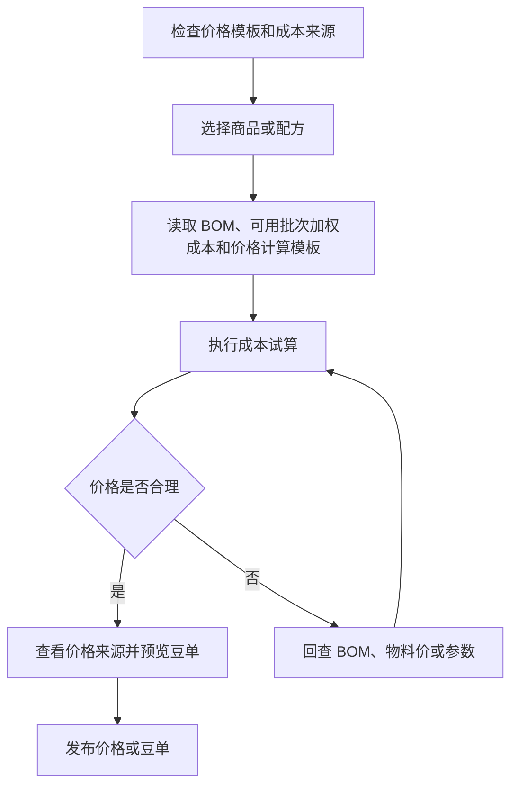

# 操作手册：成本核算

## 适用范围
价格计算模板、成本试算、商品价格表预览、价格发布。

## 入口
- 商品：商品价格管理、商品价格表
- 物料管理：成本核算

## PR-442 价格表分组来源
- PR-442-BUSINESS-GROUP-OBJECT-UNIFICATION：商品价格表默认使用商品档案分组，也就是 `product_catalog` 归组。生成抽屉按商品档案分组展示选品和继承关系。
- PR-459-PRICE-LIST-FOLLOW-PRODUCT-GROUP：如果刚在商品档案选择了 `商品分组`，商品价格表进入时会优先使用该模板展示选品分类和平铺价格行分组快照。没有归到该模板下的商品进入 `未分类`，不会继续沿用其他模板的分类标题。
- PR-463-PRICE-LIST-PRODUCT-CATALOG-USAGE-CLEANUP：商品价格表顶部的商品类型优先按商品档案 `商品分组` 的顶层大类生成。归在子类下的商品跟随父类入口展示，例如 `咖啡熟豆 / 意式拼配豆` 下的商品会出现在 `咖啡熟豆` 商品价格表类型中，不再被旧商品分类 `熟豆 / 默认熟豆` 分到其他入口。
- PR-464-PRICE-LIST-PICKER-SELECTION-PREVIEW-FIX：在商品价格表顶部切换商品类型后，生成区会默认全选该类型下的商品，只显示该类型相关父类、子类和商品；其他类型的空分类不再混入“选择分类和产品”。勾选或取消勾选分类/商品会立即更新下方预览；收起父类会同时隐藏其子类分类行，展开后恢复且不清空已选商品。
- PR-465-PRICE-LIST-PRICING-RULE-PREVIEW：商品行选择 `按价格模板计算` / `按价格计算模板计算` 时，商品价格表预览会调用商品价格管理同一套价格计算模板试算接口。试算成功后，预览和 PDF 使用试算出的最终价、报价单位、库存单位/换算、BOM 版本、工序和成本来源快照；没有试算成功前，不把该商品当作 0 元可发布价格。
- PR-466-PRICE-LIST-TIER-TEMPLATE-TRIAL-PREVIEW：商品行选择 `按阶梯模板价计算` 时，阶梯价模板中每个引用价格计算模板的档位也会执行价格计算模板试算。多个阶梯引用同一个价格计算模板且公式相同时，预览中的多个阶梯单价会一致。
- PR-467-PRICE-LIST-GENERATION-PERSISTENCE-PREVIEW-GROUP-FIX：价格表生成草稿会按当前工作台、价格表归属、客户和商品类型保存计价方式、价格模板、阶梯模板、分类覆盖、商品覆盖和手工价格覆盖；刷新页面或重新进入商品价格表后会恢复这些设置。商品价格表和商品档案的分组下拉只使用 `product_catalog` 用途的商品分组模板，并优先使用已有商品归类的模板，避免 `熟豆-红岩拼配` 从 `咖啡熟豆 / 意式拼配豆` 看起来回到未分类。
- PR-468-PRICING-RULE-LIST-ACTIONS-UX：商品价格管理中，`价格试算` 是列表顶部动作，位于 `新建价格计算模板` 左侧。点击后在抽屉内选择启用的价格计算模板，再选择商品、报价单位、BOM 版本和工艺路线试算；模板行不再单独放 `试算`。点击普通模板名称进入编辑，不再使用独立 `编辑模板` 按钮。普通停用模板会置灰但仍可复制，复制后生成启用的新价格计算模板；历史 `fixed_add` 等隔离模板不可复制或直接保存，必须新建加价率模板。
- PR-539-PRICING-MARKUP-DRAWER：价格计算模板现在只使用加价率。加价率 80% 填 `0.8`，税前价按 `成本基数 × (1 + 加价率)` 计算；成本 100 时结果是 180。点击模板名称、点击 `新建价格计算模板` 或复制成功后，页面右侧打开 `价格计算模板编辑` 抽屉；列表下方不再展开编辑表单。
- PR-540-PRICE-TIER-UNIT-COMPATIBILITY：按阶梯模板计算前，商品当前默认销售规格必须与阶梯档位数量单位严格同类。`磅` 商品不能使用 `kg` 阶梯模板，即使两者可以换算；系统会禁用商品级不可用模板，并在继承到不兼容模板时标红具体商品、阻断预览和发布。
- PR-472-MANUFACTURING-PRODUCTION-PLAN-WORKORDER-LIFECYCLE：价格表不能决定生产 BOM，也不能回写生产计划、生产工单或工序卡。商品价格表只读取 BOM/工序成本快照用于报价、毛利和追溯；正式生产 BOM、BOM 版本、工艺路线和组件需求由生产计划提交时冻结到生产工单，后续价格表发布或改价不会改变已提交计划和已生成工单。
- 如果客户/价格表本次需要调整展示分组，可在价格表生成时做价格表覆盖；价格表覆盖只写入该价格表版本快照，发布后固化 `group_id/group_item_id/parent_group_item_id/group_source=price_list`，不回写商品档案分组。
- 已发布价格表、录单和客户侧展示读取价格表快照中的分组来源、最终价、价格单位和库存换算。商品档案后续改分组不会自动改变历史价格表或已成交订单。

## 流程图

## 标准操作
1. 先进入 `商品 / 商品价格管理` 检查价格计算模板；过时的成本参数设置已移除。理论成本优先使用商品生产配置中的预期损耗率，系统内部按 `1 - 预期损耗率` 得到产出因子；商品报价由价格计算模板和商品价格表快照决定。
2. 进入成本核算，选择商品或配方，确认物料、BOM、当前可用批次成本和试算参数。
3. 执行成本试算，查看成本、供应价、零售价和发布价格表将固化的价格档快照。
4. 如需维护挂耳商品报价，按普通商品处理：在商品价格管理维护价格计算模板，在商品价格表选择阶梯模板和价格计算模板生成并发布快照；不要再使用挂耳专用模板。
5. 查看豆单预览，确认风味、产地、处理法、等级、海拔等展示信息。
6. 在商品价格表的“已发布价格表”按“价格表归属”查看公共或具体履约客户的版本；客户自己的展示名和料号在商品档案的 `客户引用` 中维护，不再进入独立客户商品主数据。
7. 生成或发布价格表前确认价格表归属：工厂自营/公共归属用于工厂报价，客户归属用于指定客户。
8. PR-441 / PR-445 / PR-447 / PR-449 / PR-453 / PR-459 / PR-461 / PR-464 / PR-465 / PR-467：商品价格表的选品和继承来自商品档案所选商品分组模板。主页面配置区直接展示 `Price List / Item Price 生成规则`、选品、平铺价格行和预览；顶部 `价格表配置` 按钮用于维护版本、样式、归属和来源配置。选品区默认只显示分类/商品选择和计价、展示摘要，并只限当前商品类型下的父类、子类和商品，父类、子类、商品逐级缩进，分类可收缩/展开；父类收起时子类一起隐藏但不清空勾选。下方预览和生成 PDF 使用同一组选品分类和商品行，勾选变化会动态更新预览，不再按旧 bean-list 分类重排。价格表默认计价在“生成规则”区设置；分类计价仍在分类头 A 位置，商品计价、标签和标红词仍在商品勾选行 B 位置，但列表内只显示 `继承分类` 或实际模板/方式；点击分类或商品行的 `计价` 摘要后，在按钮附近修改配置，点击商品行的 `展示` 摘要后，在弹窗中修改配置。`计价模式规则` 按钮会弹窗展示 `商品 > 子类 > 父类 > 价格表` 的解析规则。计价可选择 `按阶梯模板计算`、`按价格模板计算` / `按价格计算模板计算` 或 `固定价`。选择按价格模板计算或按阶梯模板计算时，预览会先用商品价格管理的价格计算模板试算出最终价；刷新后继续恢复当前商品类型的计价草稿。
9. PR-387 / PR-440：如果顶部“当前视图”是某个客户，产品价格表会把价格表归属锁定为该客户；如果当前视图是订单，系统先派生订单客户，再按该客户归属、商品档案和客户引用生成候选。
10. PR-390：价格表、成本试算和 PDF 展示的产品信息优先读取商品生产配置字段；旧商品没有生产配置字段时，才 fallback 到旧 BOM 版本特殊属性或旧 SKU 特殊属性字段。
11. 确认无误后发布价格表，让录单、报价和客户侧展示使用新版本。
12. 如客户需要把工厂供货价格表改成自己的销售展示价格表，不在 ERP 商品价格表里手工改客户转售价；先发布或确认工厂供货价格表，再让客户在小程序基于该供货快照制作客户转售展示版本。

## 梯度模板和价格来源
- PR-440-PRODUCT-GROUP-PRICE-REMODEL：商品价格表就是 Price List / Item Price 平铺价格行列表；录单、报价和销售单结算读取已发布价格表快照，不从商品档案、客户引用、BOM、工单或旧模板重新算价。
- PR-440-PRODUCT-GROUP-PRICE-REMODEL：商品价格管理现在维护 `价格计算模板 / Pricing Rule`，它是价格计算器模板，不绑定商品、不维护阶梯档位、不保存最终成交价。模板字段覆盖基础成本、其他成本、损耗/出率、加价率、税额/含税规则、取整规则、最低毛利提示、公式版本、试算说明和备注；实际毛利率只作为试算结果和预警指标。模板修改只影响后续草稿或重新计算，不回改已发布快照。
- PR-443-PRICING-RULE-CALCULATION-TEMPLATE：Pricing Rule 不保存数量档位；数量档位只属于阶梯模板或商品价格表生成上下文。商品价格管理维护公式版本、基础成本、其他成本、损耗/出率、加价率、税费方式、最低毛利、取整和试算说明；API 拒绝把阶梯档位字段写进 Pricing Rule。商品价格表发布时把 Pricing Rule 的公式版本和公式配置冻结到价格行成本来源快照，最终价和档位仍只属于已发布价格表。
- PR-444-PRICING-RULE-COST-SOURCE-UX：商品价格管理里基础成本固定为 `生产 BOM 成本（物料+工序）`。生产 BOM 成本已经包含 BOM 组件物料的采购成本和已选择工序成本；库存成本、手工成本不在 Pricing Rule 中选择。需要额外计入的费用在 `其他成本` 中逐行维护成本名和成本价格。货币先使用全局币种配置占位，当前模板不单独维护币种。模板列表点击模板名称后在右侧编辑抽屉修改，也可点击 `失效` 停用后续引用。
- PR-452 / PR-468-PRICING-RULE-TRIAL：商品价格管理顶部提供 `价格试算`。点击后打开 `价格计算模板试算` 抽屉，先选择启用的价格计算模板，再选择商品和报价单位，可临时录入损耗率、加价率、税率和其他成本；`临时损耗率` 留空表示不额外计损耗，只有显式输入时才作为本次模拟损耗参与试算。字段完整后系统自动试算，结果区查看 BOM+工序成本、试算单价、实际毛利率和公式步骤。试算是只读结果，不保存到模板、商品价格表、发布快照或订单；正式报价仍需回到商品价格表生成并发布。
- PR-454-PRICING-RULE-TRIAL-EXCEL-PARITY：做 Excel 供应售价对账时，`物料成本` 对应原料/BOM 成本；`生产项目` 中进入加价基数的电力、燃气、租金、生产损耗和人力等费用，录入为加价前生产项目成本，也就是试算抽屉里的 `其他成本`。前端试算抽屉不再提供售价后附加成本录入口；历史 Excel 对账需要后追加项时仅保留后端 API 兼容。`供应售价` 的档位加价率录入到 `临时加价率`。结果区查看 `加价后价格`、`试算单价` 和公式步骤节点，用来核对 Excel，不会写入模板、商品价格表、发布快照或订单。
- PR-456-PRICING-RULE-TRIAL-PR439-UNIT：试算抽屉删除 `重新试算` 按钮和 `售价后附加成本`。报价单位来自全局单位字典下拉，例如 `kg`、`lb`、`袋`。PR-460 后，缺 BOM/工序成本时不再按已发布售价反推成本。
- PR-457-PRICING-RULE-TRIAL-FORMULA-EXPRESSION：试算结果区显示 `计算公式` 和公式步骤表。`计算公式` 主行会把 BOM+工序成本、其他成本、损耗、加价、税费、取整和最终售价串起来；下方逐节点公式行会列出成本基数、损耗后成本、税前价/加价后价格、含税价或不计税价格、取整和最终售价。
- PR-460-PRICING-RULE-TRIAL-WATERFALL-BOM-DETAIL：试算结果区先显示价格瀑布，按 `BOM+工序成本 + 其他成本 + 加价增加 + 税额 + 取整调整 = 试算单价` 展示金额节点；只有本次显式输入 `临时损耗率` 且损耗金额大于 0 时，才在 `其他成本` 后额外显示 `损耗增加`。未税模板的税额只做另计提示，不加进最终单价。`BOM+工序成本折算明细` 展示物料成本明细、工序成本明细、物料合计、工序合计和总计。物料行会分开显示 `BOM组成`、`原料损耗`、`损耗后用量`、`成本单价` 和 `折算成本`：`BOM组成` 仍是 BOM 配方原始比例，`折算成本` 按当前试算单位显示并汇总到价格瀑布。缺 BOM/工序成本时，BOM 成本显示 0 和感叹号警告，不再反推历史发布售价。
- PR-512-PRICING-RULE-TRIAL-SOURCE-COST / PR-514-WORKSTATION-COST-COMPONENTS / PR-518-MULTI-CAPACITY-OPERATION-COST：价格试算顶部会显示 `取整规则` 和来源，取整规则来自价格计算模板；`取整调整=0` 时不再显示醒目瀑布卡片。税率按 `临时税率 -> 价格计算模板非 0 税率 -> 财务设置全局税率 -> 0` 解析，税额卡片展示来源；价格计算模板选择不计税时税额强制为 0。`工艺路线` 是生产模板，发布 BOM 版本时会冻结该路线工序选择的 `标准成本产能档`，标准制造成本试算读取 BOM 工序成本快照；真实生产工序成本仍在生产计划/工单拆分选择本次实际工位产能后冻结。
- PR-462-PRICING-RULE-TRIAL-OUTPUT-BOM-OPERATION-SELECT / PR-512-PRICING-RULE-TRIAL-SOURCE-COST：试算抽屉可选择 `试算BOM版本` 和 `工艺路线`。BOM 版本只来自“生产 BOM 声明产出当前商品”的 active BOM / published 版本，默认选中最新发布版本，也可切换同一产出商品下其他 active/published 版本；工艺路线默认来自所选 BOM 版本绑定的路线，没有时使用商品生产配置路线。试算不按“商品绑定 BOM”反查，也不保留商品侧 BOM 绑定兜底逻辑；没有产出 BOM 明细时 `BOM+工序成本` 为 0 并提示维护生产 BOM。
- PR-441-PRICE-LIST-TIER-TEMPLATE-MODES：新版 `阶梯模板` 属于商品价格表模块。点击商品价格表页面的 `管理阶梯模板` 打开右侧抽屉，维护模板名称、启停、备注和档位；每个启用档位必须选择一个价格计算模板。
- PR-461-PRICE-LIST-PICKER-TREE-PRICING-POPOVER：商品价格表选品区按父类、子类、商品逐级缩进；父类和子类标题可收缩/展开，收缩后不清空勾选。下方预览和生成 PDF 的分类标题、商品归属和商品顺序跟“选择分类和产品”一致，不再使用旧 bean-list 分类把同一选品分类拆散。点击分类或商品行的 `计价` 摘要后，在按钮附近修改计价模式；菜单包含 `继承分类`、`按阶梯模板价计算`、`按价格模板计算`、`固定价`。选择继承会清掉当前分类或商品自己的覆盖，商品行 `展示` 仍在展示弹窗中维护。
- 商品价格表预览和生成 PDF 的商品卡片按当前分类内顺序编号，例如 `1.1`、`1.2`；编号不再沿用旧 bean-list 元数据里的商品 ID 后缀。卡片只展示商品名、去重后的价格表行业字段/属性和报价，长商品名自动换行；同一行左右卡片按该行最高卡片等高对齐，行高仍随内容自适应，同一行内的属性区和报价区也按行对齐，单条报价块按文字高度收缩，不用固定头部高度或底部自动撑空白；旧豆单的 `出品建议`、`风味`、`特点` 和 `批发价` 标签不进入商品价格表卡片。
- PR-441 / PR-445 / PR-447 / PR-449 / PR-459 / PR-461 / PR-464 / PR-465：商品价格表生成时使用商品档案所选商品分组作为选品/继承分组；价格表默认、父类、子类和商品行都可以设置计价模式。价格表默认在主页面 `Price List / Item Price 生成规则` 区维护；选品区默认只显示分类/商品选择和计价、展示摘要，并只限当前商品类型下的父类、子类和商品，父类、子类、商品逐级缩进，分类可收缩/展开，父类收起时子类也收起。分类计价放在分类头 A 位置，商品行覆盖放在商品勾选行 B 位置；摘要继承态统一显示 `继承分类`，不在列表里展示父类/子类字样，点击 `计价` 摘要后在按钮附近修改计价模式，点击商品行 `展示` 摘要后在弹窗中维护标签和标红词。`计价模式规则` 只作为按钮弹窗展示，不在页面常驻。没有生成价格行时不显示平铺价格行块；预览和生成 PDF 按当前勾选商品以及同一套选品分类动态生成。系统按 `商品 > 子类 > 父类 > 价格表` 解析计价模式，再按模式解析阶梯模板、价格计算模板或固定价；按价格模板计算的基础价格行会先执行价格计算模板试算，成功后才进入可发布预览。
- PR-441-PRICE-LIST-TIER-TEMPLATE-MODES：`按阶梯模板计算` 会按阶梯模板档位展开平铺价格行，每个档位使用自己引用的 Pricing Rule；`按价格计算模板计算` 生成基础价格行；`固定价` 直接固化最终成交单价，不强制 Pricing Rule。
- PR-441-PRICE-LIST-TIER-TEMPLATE-MODES：价格表发布快照必须固化计价模式、最终价、价格单位、库存换算、分组快照、阶梯模板来源、模板档位、档位 Pricing Rule 版本、固定价、成本来源、客户引用显示快照和人工调整标记。手动改价必须写操作日志。
- PR-440-PRODUCT-GROUP-PRICE-REMODEL / PR-502-PRODUCT-UNIT-TEMPLATE-REFERENCE / PR-503-PRODUCT-UNIT-TEMPLATE-MULTI-SALES-UOM：商品档案不再维护报价单位、录单单位、商品配置模板、计价方式、固定价、成本加成或利润率覆盖；客户差异只在商品档案的客户引用子表维护客户料号和客户显示名，客户引用不参与价格、单位、BOM、库存或分组。商品档案只引用单位模板；单位模板决定库存单位、默认销售单位和多个可销售单位到库存单位的换算。
- PR-504-PARENT-PRODUCT-CHILD-SKU-UOM：商品档案是父商品入口；具体销售/库存规格由子 SKU 表达。价格表平铺价格行绑定具体 `sku_id`，同一父商品下的 `227g袋装`、`100g袋装` 可作为不同子 SKU 同时发布。`袋/227g` 不作为销售单位；销售单位仍来自该子 SKU 的单位模板，例如 `袋` 或 `箱`。价格表发布时固化 `sku_id/parent_product_id/sku_snapshot`，并按该 SKU 的单位模板冻结价格单位、库存单位和库存换算。
- PR-505-SALES-SPEC-TEMPLATE-DERIVED-SKU / PR-506-PRICE-LIST-SPEC-DEFAULT-ROW-ERRORS：最新商品档案引用 `销售规格模板` 自动派生子 SKU；销售规格模板维护库存单位以及 `1 227g袋装 = 0.227 kg` 这类规格换算，并可在明细行设置 `默认规格`。价格表仍按具体子 SKU 发布价格行，平铺价格行名称展示具体子 SKU，例如 `熟豆-白巧坚果拼配（227g袋装）`；价格输入框右侧的泛化单位优先展示规格标签，例如 `/227g`，避免只看到 `/袋` 而不知道规格。
- PR-507-PRICING-RULE-TRIAL-RESOLVABLE-UOM：价格试算选择商品后，`销售单位` 会继承该商品有效默认销售单位或销售规格，并且下拉只显示当前商品可解析的单位。需要按 `盒`、`袋`、`条` 等包装单位试算时，先在商品档案的销售规格模板或单位换算中维护 `1 销售单位 = 库存数量 库存单位`；缺少换算时试算接口会提示先维护销售规格或单位换算，不会按 `kg` 静默兜底。
- PR-511-BOM-MATERIAL-LOSS-BOM-LEVEL：BOM+工序成本折算明细读取生产 BOM 版本级 `原料损耗比`，并按物料比例组件形成明细快照。当物料行 `比例 % = 40%` 且 `原料损耗比 = 20%` 时，材料成本按有效比例 `ratio / (1 - 原料损耗比) = 40% / (1 - 20%) = 50%` 计入；`合计比例` 仍显示净配方比例，不把损耗并入比例合计。商品价格管理试算默认把这部分损耗归入 `BOM+工序成本`，不会再把商品/BOM 默认损耗二次套到 `BOM+工序成本` 上。切换试算单位到 `lb` 时，顶部合计和 `折算成本` 会显示 `/lb`，但 `BOM组成` 和成本单价仍按 BOM/物料本身口径展示。
- PR-510-PRICING-RULE-TRIAL-WATERFALL-EXPLANATIONS：价格试算结果区的三张关键瀑布卡片可以点开说明。点击 `BOM+工序成本` 查看物料/工序名称、BOM 用量、单位成本和本项金额；点击 `其他成本` 查看其他成本明细、来源和设置位置，模板值在价格计算模板编辑抽屉 `其他成本` 维护，本次试算抽屉 `其他成本` 临时值优先；点击 `加价增加` 查看加价率、参数来源和 `成本 × (1 + 加价率)` 公式，模板值在价格计算模板编辑抽屉 `加价率` 维护，本次试算抽屉 `临时加价率` 会覆盖参数。说明面板只读，不保存到模板、价格表、订单或发布快照。
- PR-440-PRODUCT-GROUP-PRICE-REMODEL：BOM、工单和工序卡只影响成本、毛利和生产追溯。工单可以冻结本次实际使用的非默认 BOM；这不会自动改变已发布商品价格表或已成交销售价，销售单只读展示 `报价来源` 和 `生产来源` 两块追溯。
- PR-440-PRODUCT-GROUP-PRICE-REMODEL：以下 PR-439 价格记录、阶梯方案和客户商品说明只作为历史兼容索引保留；新业务不再新建或编辑独立客户商品、`product_price_records` 或 `product_tier_price_schemes`。
- PR-439-PRODUCT-PRICE-MASTER-REMODEL 历史兼容：`product_price_records`、旧阶梯价格方案和独立客户商品说明只用于历史快照、迁移报告和旧订单追溯；PR-440 后普通新业务不再从这些对象维护最终成交价。
- PR-441-PRICE-LIST-TIER-TEMPLATE-MODES：商品价格表负责选择计价模式、管理阶梯模板、生成草稿、展开平铺价格行、发布版本并形成快照。商品档案只读展示价格摘要，摘要内容来自已发布价格表快照，包括来源价格表版本、最终价、价格单位、档位和更新时间；没有快照时显示 `暂无价格表价格`。
- PR-439-PRODUCT-PRICE-MASTER-REMODEL / PR-503-PRODUCT-UNIT-TEMPLATE-MULTI-SALES-UOM：录单单位和价格来自已发布价格表快照；价格表是什么单位，订单行就是什么单位。价格单位到库存单位的换算在发布价格表时从商品有效单位模板读取并固化到快照；没有换算时不得发布价格表或录单。
- PR-505 / PR-506 后，销售规格模板用库存单位和规格库存数量表达 `1 销售规格 = 库存数量 库存单位` 的规格换算；默认规格可由用户选择，系统按子 SKU 销售规格和模板库存单位固化发布快照，规格克重和包装差异由子 SKU 规格字段和 BOM 成本表达。
- PR-440-PRODUCT-GROUP-PRICE-REMODEL / PR-502-PRODUCT-UNIT-TEMPLATE-REFERENCE：商品档案保存不再写入旧价格模板字段；独立客户商品写入口下线或只读兼容。旧商品配置模板、旧阶梯价模板和分类模板保留为历史兼容或迁移来源，主菜单和客户工作区不再展示这些旧入口；单位模板恢复为普通商品 UOM 主入口，不作为价格模板或 Pricing Rule 换算公式来源。
- PR-440-PRODUCT-GROUP-PRICE-REMODEL / PR-441-PRICE-LIST-TIER-TEMPLATE-MODES / PR-453：产品价格表生成和成本核算以“商品档案 + 客户引用 + 分组模板 + Pricing Rule + 阶梯模板 + 价格表快照 + 生产追溯”为主链路。客户引用负责客户料号和客户显示名；商品档案负责库存和商品主数据；分组模板只负责组织、筛选、选品和模板继承；Pricing Rule 负责计算口径；生产 BOM 声明产出商品、版本和组件清单。
- PR-440：产品价格表候选查询使用商品档案、分组和当次价格表归属，不再依赖旧分类模板。客户范围生成价格表时，客户料号和客户显示名来自商品档案客户引用；行业字段优先读取商品档案当前字段。
- 价格表和 PDF 不再从 BOM 版本维护特殊属性，也不展示预期产出率维护字段。需要展示烘焙度、布料参数、鲜果成熟度等产品信息时，在商品档案的行业字段中维护，并勾选进入价格表。
- 在 商品价格管理 维护价格计算模板 / Pricing Rule：基础成本选择 `生产 BOM 成本（物料+工序）`，系统按“生产 BOM 产出当前商品”读取已发布 BOM 的物料成本和 BOM 发布时冻结的工序成本快照。额外费用在 `其他成本` 中按成本名/成本价格维护。价格计算模板只做加价率、税率和取整，并继续配置损耗/出率、最低毛利提示、公式版本、试算说明和备注。模板试算可以临时选择商品、报价单位、试算 BOM 版本和工艺路线，但模板本身不绑定商品，也不保存数量档位。真实工序成本在生产计划/工单拆分中按 `工位小时成本 × 标准分钟/60 × 批次数` 冻结，例如 `5元/小时 × 60分钟/60 × 1批 = 5元`。
- 需要确认某个模板套到某个商品后的价格时，在商品价格管理顶部点 `价格试算`，在 `价格计算模板试算` 抽屉先选择启用的价格计算模板，再选择商品；必要时选择客户范围、报价单位、试算 BOM 版本和工艺路线，临时调整加价率、税率或其他成本后系统会自动试算。`临时损耗率` 留空时不额外计损耗；只有显式输入时才显示并计算 `损耗增加`。结果区先看价格瀑布，确认 `BOM+工序成本`、其他成本、加价增加、税额和取整调整如何合计到试算单价；其中加价增加始终按 `成本基数 × 加价率` 计算。再展开 `BOM+工序成本折算明细` 查看 BOM 物料成本和标准工序成本来源：物料行显示 `BOM组成`、原料损耗和折算成本；工序行显示成本来源 `BOM工序成本快照`、工序名称、工位、产能档、小时费率、标准分钟、标准批量和折算到当前试算单位的成本。最后查看 `计算公式`、公式步骤、实际毛利率和最低毛利预警。这些内容只用于判断公式和成本来源，不能替代商品价格表发布。若 BOM 绑定工艺路线但没有冻结工序成本快照，先回到生产 BOM 发布带标准成本产能档快照的版本，再发布价格表。
- 用上传 Excel 做供应售价核对时，先把 `物料成本` 对应到商品当前 BOM/物料成本，再把 `生产项目` 中进入加价基数的费用填入 `其他成本`。`供应售价` 不同档位的加价率逐档录入 `临时加价率` 后查看自动试算结果，检查 `计算公式` 和公式步骤中的成本基数、加价后价格和最终单价。
- 需要阶梯价格时，在 商品价格表 点击 `管理阶梯模板`。阶梯模板只定义档位结构和每档使用的价格计算模板；不同档位的最终价格由商品价格表按对应 Pricing Rule、子 SKU 和价格行单位计算生成。
- 商品价格表生成抽屉会把价格表、父类、子类、父商品和子 SKU 行的计价配置解析为平铺价格行，并随价格行冻结分组快照、计价模式来源、阶梯模板来源、档位 Pricing Rule 版本、固定价、成本来源、客户引用显示快照、`sku_id/sku_snapshot`、最终价、价格单位、库存单位和库存换算。缺少可发布价格、单位或换算时不得发布。
- PR-469-PRICE-LIST-PUBLISH-NO-RESPONSE / PR-506-PRICE-LIST-SPEC-DEFAULT-ROW-ERRORS：点击 `发布价格表` 前先看按钮附近的阻断原因。空预览、缺版本号或缺客户时，页面会显示阻断原因，不会再静默无反馈。平铺价格行不完整时，错误直接显示在对应价格行下方，例如缺少计价模式、阶梯档位、价格计算模板、最终价、价格单位、库存换算、价格表分组快照或成本来源快照；页面不再在预览顶部显示笼统短句。BOM已失效不在顶部汇总提示，而是在具体商品行下显示；点击商品行里的 `去商品档案重新选择 BOM`，到商品档案重新选择可用 BOM。失效 BOM 不能重新启用，如需沿用旧结构，先在生产 BOM 复制成新 BOM 后再选择。
- 客户小程序转售豆单只能基于当前客户可见的已发布工厂供货价格表快照。需要开放给客户转售时，确认来源价格表快照的最终价、价格单位和库存换算能生成客户转售快照。
- PR-400 / PR-404 / PR-440 / PR-441：商品没有有效阶梯模板、Pricing Rule、固定价或可发布价格行时，产品价格表不得自动补默认档位或旧 Excel 档位。商品卡片应提示维护价格计算模板、阶梯模板或价格表生成设置；不再引导普通用户去旧商品配置模板选择计价方式。
- PR-415 / PR-440 / PR-441：产品价格表候选、生成抽屉、预览卡片和 PDF 产品选择使用同一套候选过滤。旧 Excel 豆单 metadata code 缺失时不隐藏商品；挂耳、速溶或未分组商品仍进入候选。挂耳不再有专用价格模板或专用渲染枚举，新生成的商品价格表按通用阶梯模板、Pricing Rule 或固定价发布快照。
- PR-435 / PR-440：商品价格表的商品类型下拉跟随商品档案当前分组和价格表分组快照。没有当前分组的商品统一合并为未分组/未分类展示。旧 `product_type_category_id`、`product_type_name` 和历史 `list_type` 只用于历史快照兼容，不再在新价格表下拉里生成多个“其他”。
- PR-439 follow-up：商品价格表候选直接读取 `product_category_id` 派生出的一级/二级分类；有直接分类时，一级分类用于商品类型入口，二级分类用于表内分组。旧分类模板字段只作为历史快照兼容，不再决定新价格表入口。
- PR-439 follow-up：按商品直接分类查看已发布价格表时，系统优先读取同分类发布版本；若历史已发布版本仍保存为 `product_type_category_id=0`，则按同归属和同用途的 `commercial` 版本兼容展示，避免重构前发布的价格表在新分类入口下显示为“暂无”。
- PR-439 follow-up：商品档案旧 `product_config_template_id` 不再由商品分类上的旧模板值在服务启动时回填。历史分类行上残留的旧模板字段只作为兼容数据保留，不会重新污染商品档案。
- PR-437 / PR-440：如果当前价格表归属、客户或分组下暂时没有可用商品，商品价格表显示空状态或 `商品数 0`，不会弹出 `products required`。此时不能发布空价格表，需要先维护商品档案、客户引用或分组选品后再生成。
- PR-440：如果只是某个客户的对外料号或展示名不同，不必复制商品档案，也不新建独立客户商品；在商品档案的 `客户引用` 子表维护客户料号和客户显示名。客户价格差异通过该客户归属的商品价格表版本、分组模板设置或商品行人工调整处理。
- PR-410 历史兼容：旧客户商品抽屉中的 `重命名` 仍用于历史快照解释；PR-440 后客户侧报价名称来自商品档案客户引用的客户显示名，缺省回退商品档案名。
- 若某个商品需要长期使用不同对外价格，先维护 Pricing Rule 或价格表生成设置，再通过商品价格表发布新快照。只改变某客户对外价格时，发布该客户归属的新价格表版本，或在该价格表商品行做人工调整并留下操作日志，不直接改公共商品档案。
- 成本核算和商用豆单中的“来源”按钮可打开价格来源抽屉，查看价格表快照、Pricing Rule 版本、当前试算、临时试算和公式步骤。
- 公式步骤会展示原料成本、预期损耗率、kg/lb 换算、生产成本、包装成本、损耗、税费、加价率和最终价格等关键值；如需产出因子，系统内部按 `1 - 预期损耗率` 换算。
- 熟豆成本试算中的原料成本来自 BOM 物料的当前可用批次加权平均成本：`Σ(批次当前可用克重 × 批次单位成本) ÷ Σ(批次当前可用克重)`；没有可用批次时才回退物料默认采购价。
- 如果入库价格录错，先到库存调整单选择“批次成本”修正对应原料批次；不要直接改物料档案采购价来影响已入库库存。
- 商用价格来源抽屉可以临时输入原料成本、预期损耗率和加价率并点击“重新试算”，用于查看该档价格变化；这些参数只影响当前抽屉结果，不保存到物料档案、商品生产配置或 Pricing Rule。
- 需要长期调整原料成本、预期损耗率或加价率时，按参数来源回到物料档案、商品档案的商品生产配置或商品价格管理维护；旧成本参数设置已移除。
- 修改物料成本来源、商品生产配置、Pricing Rule、阶梯模板或价格表生成设置后，只会刷新未发布的成本试算和价格表草稿；已发布价格表、录单和客户下单价格不会静默改变，必须重新发布价格表后才生效。
- 生豆价格表不套用熟豆销售公式。系统按生豆商品与对应熟豆产出 BOM 的历史映射/兼容关系读取原料成本快照生成成本参考价；拼配按 BOM 比例加权，单品取 BOM 中对应原料成本。生豆销售价来自已发布商品价格表快照；KG 价格必须在价格表快照中固化价格单位、最终价和库存换算。只有生成并发布新版价格表后，录单才会使用新价格。

## 价格表版本
- 每次发布价格表都会生成一条已发布版本，版本号、配置、内容、归属客户、发布时间和更新说明都保留在产品价格表的“已发布价格表”中。
- PR-438-PRODUCT-TEMPLATE-DELETE-PRICE-LIST-UI / PR-463：已发布价格表支持按版本号、客户归属、状态和更新说明搜索，列表按分页展示，可切换每页条数，也可点击“收起”临时隐藏版本行。收起后筛选条件和总数仍保留，重新展开可继续翻页查看。
- 商品价格表版本列表不再提供“用途”筛选，也不展示“用途”列。ERP 商品价格表固定显示 `factory_supply` 工厂供货版本，用于录单、客户下单和工厂履约计价；客户转售商品价格表仍保存为 `publication_purpose=customer_resale`，只在客户小程序/客户侧分享链路使用和追溯，不进入 ERP 商品价格表版本列表。
- PR-440 / PR-441：客户价格表发布时会同时冻结商品档案、客户引用显示快照、分组快照、最终价、价格单位、库存换算、计价模式来源、阶梯模板来源、Pricing Rule 版本、固定价、成本来源、人工调整标记和生产来源追溯。后续客户引用改名、商品档案改名、BOM 升级、分组调整或 Pricing Rule 调整，都不会回改已发布价格表。
- 录单、客户门户和履约下单会优先使用已发布价格表中的价格行快照。商品没有有效价格表快照时，客户侧和履约侧不会按 0 元静默下单；需要先在商品价格表发布对应客户的价格，或由内部录单明确填写手工价并留下订单保存日志。
- 客户转售豆单的 `publication_purpose=customer_resale`，也称客户转售商品价格表，仅用于客户对外分享，不参与 ERP 录单默认价格版本、客户向工厂下单、结算、费用中心或工厂履约计价。需要调整工厂供货价时，仍要发布新的 `factory_supply` 价格表/豆单。
- PR-433 后，小程序“我的价格表设置”不再提供覆盖档位或单品价；旧 payload 中的 `label`/`price` 单品覆盖字段会被后端忽略。客户只能通过统一加价、倍率加价、商品选择、品牌说明、样式背景和上新/推荐标签生成自己的展示价格表。
- PR-350-BEAN-LIST-PUBLISH-MANUAL-WITHDRAW：发布新版不会自动撤回旧版；旧版会继续保持已发布，直到管理员在版本列表中手动点击撤回。撤回后该版本仍保留历史快照和下载能力，但不再进入录单可选豆单。
- 页面顶部的“价格表归属”下拉列出工厂自营/公共归属和每个履约客户；选择某个客户后，下方版本列表只展示该客户的价格表版本。可在版本列表中按产品类型筛选，点击“生成新版”会按当前归属和产品类型打开生成抽屉，不再复制历史配置；管理员可撤回当前仍在发布状态的版本。
- 在版本列表点击“下载 PDF”会按该行版本的已锁定内容和样式打开浏览器打印/保存 PDF，不会用当前实时价格、当前抽屉配置或当前筛选结果改写历史豆单。
- 客户小程序打开同一版本 PDF 时由系统按版本缓存。第一次打开时生成并保存；后续访问同一版本直接复用缓存，不重复生成。
- 官方豆单是没有专属客户时的公共兜底；客户豆单只对归属客户生效，客户自己的历史版本可继续追溯，但新版本按当前商品档案、客户引用、分组、阶梯模板、Pricing Rule 或固定价直接生成。
- 客户豆单打开“生成豆单”时，版本号会默认从当前客户已发布版本或复制的官方价格源版本递增一小步：`V1` 默认 `V1.01`，`V1.01` 默认 `V1.02`，`V3.0.5` 默认 `V3.0.6`。如需大版本号，可在发布前手动改版本号。
- ERP 录单按熟豆、生豆、挂耳分别选择豆单版本，默认使用当前客户对应类型的最新发布版本；没有客户专属版本时使用公共版本。订单商品行保存实际匹配的发布 ID 和版本号。
- 发布新版豆单时，在更新说明中写清新增、下架和价格/文案调整，客户小程序首次下单提示会引用这些内容。
- 发布、撤回、缓存生成和客户确认新版都会写入操作日志，便于追溯谁在什么时间改变了可用豆单。

## 挂耳商品计价
- 挂耳只是商品名称或分类口径，不再有单独的挂耳供应价模板、默认挂耳模板或挂耳专用价格表枚举。
- 挂耳商品如果需要按盒、袋或其他规格报价，先在销售规格模板维护库存单位和规格明细，再让商品档案引用该模板自动派生具体子 SKU；随后在 `商品 → 商品价格管理` 维护 Pricing Rule，并在商品价格表选择具体子 SKU 生成价格表快照；价格单位、模板库存单位和 SKU 快照由发布时固化到已发布价格表。
- PR-537 后，挂耳袋、盒派生子 SKU 的新价格统一发布到 `commercial price_rows`。袋和盒必须分别有自己的子 SKU 价格行、价格单位和库存换算；不要只给父商品维护一个价格，也不要新建 `drip` 类型发布版本。
- ERP 录单先读取新 `commercial` 发布版本的平铺价格行。只有该 SKU 不存在适用的新 `commercial` 发布时，系统才只读回退历史 `list_type=drip` 快照；如果已选或已找到 commercial 发布、但价格行缺失或阶梯无效，录单会直接报错，不能用历史旧价掩盖新表缺陷。这是历史兼容，不是继续维护旧挂耳模板的入口。
- 录单自动价必须保留袋、盒等实际销售规格，订单保存后在价格来源中核对实际发布 ID、版本、SKU、单价、价格单位和库存换算。若自动价为空，不要用 0 元下单；先回到商品价格表修正并重新发布。
- 价格表预览、生成抽屉和 PDF 都按商品当前归类显示商品类型；分类名包含“挂耳”也不会切换到旧 `drip_wholesale_tiers`。
- 历史已发布的旧挂耳价格表和旧订单快照仍可读取、下载和追溯；新发布价格表不再使用挂耳专用模板生成价格。

## KMM 开发环境导入与验收
- `/data/kmm.xlsx` 只作为本次开发环境物料成本、生产 BOM 和供应阶梯售价的来源。导入前先备份开发数据库；不得把同一批导入命令指向生产环境，也不得切换生产入口。
- 物料价格只取工作簿“物料成本”页中能够唯一匹配的物料名称和明确价格；BOM、Pricing Rule、阶梯模板和价格表同样只导入能够由工作簿唯一证明的记录。按单条记录继续并保持幂等，导入报告要分别保留成功、跳过、失败和待人工确认数据。
- 遇到未匹配、同名歧义、空白或零价格、配方不完整时停止该条记录的发布，把原始行和原因放入待人工确认清单。不要补猜配方、复制相似商品价格或用 0 元兜底；人工修正来源后再继续导入。
- 新挂耳售价按派生袋/盒 SKU 写入 `commercial price_rows`，熟豆售价同样使用对应派生规格 SKU。发布前核对阶梯起止数量、价格单位、库存单位和换算；工作簿没有给出的额外阶梯价格不得自行补齐。
- 验收时分别创建熟豆、挂耳袋和挂耳盒测试订单，不填写手工价，确认命中本次发布版本且订单行冻结价格来源、发布版本、SKU、档位、成交价、价格单位和库存换算。核对订单合计和财务收入后，通过正式作废流程关闭测试订单。
- 订单收入在订单保存时按冻结成交价核验；COGS 不是订单创建时凭 BOM 估算出来的金额。只有实际生产工单发生物料耗用、完工并归集成本后才形成 COGS；未执行生产的录单烟测应明确记录“COGS 尚未形成”，不得手工伪造。
- 物料、BOM 版本、Pricing Rule、阶梯模板、价格表发布、订单保存和订单作废都属于用户触发写入，完成后在操作日志中按执行时间和对象逐项核对。

## 客户上下文
- PR-500-UNIT-MODEL-CONSOLIDATION / PR-504-PARENT-PRODUCT-CHILD-SKU-UOM / PR-505-SALES-SPEC-TEMPLATE-DERIVED-SKU：价格、录单和报价侧使用子 SKU 销售规格，库存、BOM、WIP 和成本消耗侧使用子 SKU 继承到的销售规格模板库存单位；规格克重和包装差异由销售规格模板、SKU 快照和 BOM 表达。父 SKU 只选择销售规格模板，子 SKU 自动派生且不直接维护库存单位或单位换算。商品价格管理只维护 Pricing Rule、成本、加价率、税费和取整公式，不维护单位换算。商品价格表发布时把当时的子 SKU、销售规格、模板库存单位和 SKU 快照固化到快照；录单和订单继续读取已发布快照。
- 报价单位和录单单位只作为历史兼容字段；新保存的销售规格模板会把默认销售规格同步写入旧字段，历史价格表、订单和成本快照不回改。
- 商品下的新业务入口是商品档案、商品价格管理和商品价格表；分组模板入口为 `设置 / 业务设置 / 分组模板` Tab。商品档案维护 Item 主数据和客户引用；分组模板维护大类和小类；商品价格管理维护 Pricing Rule；商品价格表维护 Price List / Item Price 平铺价格行。
- 客户侧新增识别信息优先使用商品档案里的 `客户引用` 子表。客户引用维护客户、客户商品编号 / Ref Code、客户显示名、启停和备注；它只影响展示、搜索、打印和客户侧识别，不参与价格、单位、BOM、库存或分组。
- 创建商品档案时填写父 SKU 名称、销售规格模板和备注；销售规格模板必须选择，模板维护库存单位和多条 `1 销售规格 = 库存数量 库存单位` 换算，并可设置其中一条为默认规格。不选择旧分类模板、产品类型、产品子类型、商品配置模板或旧阶梯价模板。商品创建后如需行业字段，在商品档案配置中选择行业字段模板后再填写；未选择模板时不显示也不保存行业字段。新增商品档案不在新增表单里复制 BOM、价格表快照或客户引用关系；生产结构到生产 BOM 维护，价格到 Pricing Rule 和商品价格表维护。
- PR-520-INVENTORY-UNIT-LOCK：销售规格模板库存单位保存后不可修改。价格表发布和试算读取模板库存单位；如需从 `g` 改成 `kg`，新建销售规格模板、切换商品档案引用并重新生成价格表预览，历史发布快照不回改。
- 客户只改料号或显示名时，在商品档案客户引用里维护，不复制商品档案。配方、包装、生产方式、库存对象或成本口径变化时，才使用“创建新商品档案”或“复制为商品档案”生成新执行对象。`PR-536` 后，复制为商品档案只复制商品主档基础资料、单位模板引用、单位覆盖和库存相关主数据；复制为商品档案不复制行业字段模板或行业字段值，也不复制商品生产配置、工艺路线、预期损耗率、商品配置模板、价格阶梯、生产 BOM、商品价格管理记录、价格表快照或客户引用关系。需要行业字段时，在新商品配置中重新选择模板并填写；在新商品配置中重新配置工艺路线和预期损耗率；到生产 BOM 创建或复制 BOM 并把新商品设为产出；再到商品价格管理和商品价格表配置并发布价格。
- 商品价格表页面顶部“价格表归属”是生成和发布的唯一归属上下文：当前为工厂自营/公共归属时发布公共商品价格表，当前为某个履约客户时发布该客户商品价格表。进入“生成价格表”抽屉后只会显示“当前归属”，不再二次选择发布归属或客户。
- 版本列表、“生成价格表”抽屉和下方预览卡片中的分类来自所选分组模板和当次价格表快照。商品没有当前分类时进入未分类展示；预览和 PDF 与选品树使用同一套分类行，不按旧字段拆成多个“其他”或旧 bean-list 分类。
- PR-437 后，如果当前归属没有任何可生成商品，页面保留价格表版本列表并展示空状态，不会把内部试算校验 `products required` 显示给用户。需要先维护商品档案、分组或价格表选品设置，再回到 商品价格表 生成新版。
- 旧 `list_type`、旧客户商品、旧商品配置模板、旧单位模板、旧阶梯价模板和旧分类模板仍作为历史发布快照兼容字段保留：生豆历史快照仍按生豆价档读取，旧挂耳快照仍可追溯；新生成的商品价格表不再通过旧客户商品或“挂耳”硬编码切换专用模板。
- 选择某个履约客户范围时，产品价格表仍以 `product_id` 为业务对象，只通过客户引用显示客户料号和客户显示名；页面顶部统计、分组下拉、生成抽屉内产品列表和发布内容都来自该价格表归属、分组选品和商品行设置。
- 顶部“当前视图”只是价格表页面的默认归属和过滤来源，不替代后端校验。发布时仍按价格表归属客户冻结商品档案、客户引用显示快照、分组快照、价格单位、库存换算、Pricing Rule 版本和生产追溯来源；旧价格表版本不被回改。
- 产品价格表和成本核算使用可产出该商品档案的生产 BOM 版本或工单冻结的生产来源。BOM 发布新版或工厂本次改用非默认 BOM 不会自动影响已发布价格表或历史订单；需要升级报价口径时先确认新版成本，再重新生成并发布价格表。
- 公共 SKU 或客户引用即使没有旧 Excel 豆单编码，只要商品档案、分组和价格表行完整，也会按分组路径生成商品价格表展示信息；不会因为缺少旧商用豆单编码而消失。
- 生豆、挂耳、速溶和普通熟豆都读取各自已发布价格表快照；订单保存实际匹配的发布 ID、版本号、最终价、价格单位、Pricing Rule 版本、客户引用显示快照和库存换算。
- 生成价格表不再提供“复制已有豆单配置”。商品档案、客户引用、分组模板和价格差异先在商品档案、分组模板、商品价格管理和商品价格表中处理，商品价格表按当前数据和本次抽屉设置直接生成。
- 客户自己的价格表会读取产品价格表中的价格表归属，后续发布或保存草稿时要确认归属正确，避免把客户自己的价格表内容保存到错误客户。如果只想维护工厂自营/公共价格表，在产品价格表中把“价格表归属”切回公共归属。

### 历史兼容索引
- 以下旧词只用于历史 PR 回归、旧快照解释和迁移排查，不是 PR-439 后普通用户的新价格维护入口：客户自己的商品分类、schema 修复、PR-359-PRODUCT-KIND-MIGRATION-CLEANUP、PR-360-SKU-CATEGORY-SUBTYPE-CLARITY、PR-392、停车场、PR-372-PRODUCT-CONFIG-DISPLAY-UNIT、PR-373-PRODUCT-CONFIG-UI-POLISH、PR-382、PR-389、允许客户转售豆单使用、产品级利润率覆盖、价格表展示单位、商品配置模板列表、感叹号、SKU复制、历史 SKU 复制抽屉、左右滑动。PR-502 后单位模板和单位换算属于商品 UOM 主数据，不属于价格维护入口。
- 旧商品配置模板、阶梯价模板页面的历史直达链接仍可能打开兼容界面；不要把这些链接作为新商品、新价格或新录单配置入口。原单位模板入口在新 UI 中改为销售规格模板，只维护销售规格明细。
- 生豆旧手册曾写“页面会提示“梯度按 KG，单价按元/KG””、“档位价格输入框是元/KG”和 `60kg+`。PR-439 后，KG 价格仍必须按元/KG 解释，但最终价、价格单位和库存换算来自商品价格管理和已发布价格表快照。
- 历史客户商品口径“选择某个履约客户范围时，产品价格表默认只展示该客户启用、纳入价格表且绑定有效商品档案的客户商品”，并且“不混入其他客户商品”，只用于解释 PR-440 前旧客户商品价格表范围。PR-440 后价格表仍按客户归属隔离，但业务对象改为商品档案 `product_id` 和客户引用显示快照。
- 历史客户商品口径“客户只改名称、编号、重命名或展示分类时，创建客户商品并绑定已有商品档案”只用于解释 PR-440 前旧数据；PR-440 后客户侧识别改用商品档案 `客户引用`，展示分组改由价格表分组快照和分组管理处理。旧示例“1、定制咖啡熟豆”分组、`咖啡豆 / 定制咖啡熟豆` 路径和速溶咖啡分类只作为历史分组示例。
- 历史 PR-319 / PR-321 曾要求“客户商品不再依赖旧 Excel 豆单资料”、`“1、定制咖啡熟豆”分组`、`客户商品还没有展示分类时，产品价格表会把它放到“未分类”`。PR-440 后同类展示问题改看商品档案、客户引用、分组管理和价格表分组快照；若出现“客户新增商品在客户价格表中不出现”，优先检查商品是否启用、是否被分组选品覆盖、是否有客户引用和可发布价格行。
- PR-376 / PR-389 历史锚点：旧商品配置和 BOM 特殊属性曾影响商品价格表展示，字段名包括 `特殊属性`、`固定单价`。PR-440 后这些旧模板字段只用于历史快照解释，新价格由 Pricing Rule、阶梯价模板和商品价格表快照固化。
- PR-415-PRODUCT-PRICE-LIST-NO-DRIP-TEMPLATE 历史锚点：挂耳不再走专用商品配置模板或专用价格表枚举；新商品价格表统一按通用分组、阶梯价模板和 Pricing Rule 生成。
- PR-435-PRICE-LIST-CATEGORY-ALIGNMENT 历史锚点：商品价格表的商品类型下拉曾与商品档案当前分类对齐，旧 `product_type_category_id` 只作兼容读取。PR-440 后展示口径进一步收敛到分组管理和价格表分组快照。
- PR-437-PRICE-LIST-EMPTY-PRODUCTS 历史锚点：当前价格表归属没有商品时显示空状态，不把内部 `products required` 暴露给用户，也不允许发布空价格表。
- PR-439-PRODUCT-PRICE-MASTER-REMODEL 历史锚点：当时文档写过“商品价格管理维护最终价格记录”。PR-440 已修正为商品价格管理维护 Pricing Rule / 价格计算模板，最终价、录单单位和价格来自已发布价格表快照，即“录单单位和价格来自已发布价格表快照”。
- 旧“单位规则维护在“商品配置模板”里”只用于解释旧价格表或旧订单；当时的结构化界面通过“新增销售单位”维护 1 盒 = 0.2 kg。PR-505 后新业务不再把 `袋/227g` 当单位换算维护，销售规格模板维护库存单位和规格库存数量并派生子 SKU，发布价格表时固化子 SKU 销售规格、模板库存单位和 SKU 快照。
- 历史规则“是否进入产品价格表由产品价格表页面决定”和“已发布价格表和历史订单不会被回改”仍保留；PR-439 后具体价格来源改为已发布价格表快照。

## BOM失效处理
- 商品价格表或成本核算读取到 BOM失效 的产品时，不在页面顶部显示汇总提示，避免用户不知道是哪一款商品出问题。
- 具体商品行会显示 “BOM已失效” 警示，提醒该产品的成本和价格表不能作为正式发布依据，并提供跳转到商品档案的入口。
- 发布价格策略或价格表前，先到商品档案重新选择可用 BOM。失效 BOM 不能重新启用；需要沿用旧结构时，先在生产 BOM 复制成新 BOM，再回商品档案选择新 BOM。
- 如果该商品本身不再销售，保持产品失效状态即可，不要为了发布价格表恢复旧 BOM。
- BOM失效不会删除历史明细，成本核算仍可用于追溯和检查，但不能静默当作有效 BOM。通过 商品管理 失效商品档案时，当前 active BOM 版本也会同步改为 disabled，避免后续误用失效商品档案的旧 active 版本。
- PR-322：客户自有产品类型或产品子类型只要仍有有效商品或 active BOM 关联，就不应被公共分类开关误清理；停用商品档案时同步禁用对应 active BOM 版本，历史价格表和历史 BOM 明细不回写。

## PR-538 物料成本计价单位与双损耗说明
- 适用角色：维护物料价格的库存/采购人员、维护 BOM 的生产人员，以及执行标准制造成本试算的销售定价和财务人员。试算前先确认物料档案已有成本计价单位、生产 BOM 已发布、标准工序成本快照可用。
- 库存单位只表示数量，成本计价单位只表示单价。重量物料可以按 `g` 管库存，但默认采购价、批次单位成本和试算明细统一显示 `元/kg`；价格试算从物料 `cost_unit` 读取单位，不能再用库存单位拼接成 `元/g`。
- 新建生产 BOM 的整体预期损耗默认是 0。只配置 20% 原料损耗时，比例物料成本公式为 `单价 × 配方比例 ÷ (1 - 20%)`，只放大一次。整体预期损耗和原料损耗确实同时配置时仍按两个独立参数连续放大，试算会显示包含 `整体预期损耗`、`原料损耗` 和 `连续放大` 的警告；先核对业务意图，不要靠删除警告或静默忽略其中一项修正结果。
- “榛巧拼配”核对样例：三种原料单价为 `54元/kg`、`78元/kg`、`82元/kg`，比例为 60%、20%、20%，只配置原料损耗 20% 时，三行折算成本分别是 `40.50`、`19.50`、`20.50元/kg`，BOM 物料成本为 `80.50元/kg`；再加标准烘焙工序 `2.04元/kg`，标准制造成本为 `82.54元/kg`。
- 如果仍看到 `102.68元/kg`，先检查 BOM 版本是否同时保留 `yield_rate=0.8` 和 `material_loss_rate=0.2`。普通业务人员先在商品档案生产配置把整体预期损耗率设为 0，并选择整体损耗为 0 的已发布 BOM 版本；需要修复历史 BOM 时由管理员通过正式 API 复制为新草稿，把整体预期损耗设为 0、保留原料损耗 20%，再发布并切换默认版本。不要直接改已发布版本或历史价格表快照。
- 本次“榛巧拼配”修复只允许在开发环境执行。修数前备份开发数据库，使用正式 API/服务完成新版本发布和默认切换，并在操作日志核对；生产环境禁止部署和写入，等待 Van 另行授权。

## PR-539 价格计算模板加价率与编辑抽屉
- 适用角色：维护价格计算模板的销售、财务和定价人员。进入 `商品 → 商品价格管理`，列表中只看模板摘要和操作；点击普通模板名称编辑现有模板，点击 `新建价格计算模板` 编辑新模板，或点击普通模板的 `复制` 后编辑新副本；三个入口都在页面右侧打开同一编辑抽屉。历史 `fixed_add` 等隔离模板不适用复制或直接编辑保存流程。
- 编辑抽屉不再提供“毛利率 / 加价率 / 固定加价”选择。只填写 `加价率`：80% 填 `0.8`，120% 填 `1.2`。系统按 `税前价 = 成本基数 × (1 + 加价率)` 计算；例如成本基数 100、加价率 0.8，税前价就是 180。
- `实际毛利率` 仍显示在试算结果中，按 `(税前价 - 成本基数) ÷ 税前价` 计算。上例的实际毛利率约为 44.44%，而不是 80%。`最低毛利` 只用来给出预警，不会反向把售价改成 500。
- 打开顶部 `价格试算` 抽屉，选择模板和商品后，必要时用 `临时加价率` 覆盖本次计算。检查 `加价增加`、`税前价`、`实际毛利率`、`计算公式` 和最低毛利预警；临时值只影响本次只读试算，不保存到模板。
- 系统会把历史缺少利润方式或标记为毛利率的模板规范成加价率；历史整数百分数 `80` 先规范为 `0.8`。历史 `fixed_add` 或其他无法安全转换的模板会保留原参数说明并置为失效隔离；隔离模板的 `复制` 按钮和直接保存入口必须禁用，不能在原模板上填写后重新启用。请人工核对旧参数后点击 `新建价格计算模板`，在新的右侧抽屉录入确认后的加价率并保存；不要直接把原固定加价数字当成比率。
- 普通模板的保存、复制和失效只影响后续试算和重新生成的价格行，并通过正式 API 写入操作日志。已发布价格表快照、订单冻结价格、财务凭证和历史单据不会被重算或回改。

## PR-540 商品销售规格与阶梯模板单位校验
- 适用角色：在 `商品 → 商品价格表` 维护价格表默认、分类或商品阶梯模板的销售、财务和定价人员。先确认商品档案当前默认销售规格，再确认阶梯模板每个启用档位的数量单位。
- 单位按业务身份严格匹配：`kg/公斤/千克` 视为同一类，`lb/lbs/磅` 视为同一类；`kg` 与 `磅` 即使可以换算也不是同一阶梯单位。比如“初晓”规格为 `磅`，“咖啡熟豆”阶梯规格为 `kg`，页面会提示 `阶梯模板不可用：商品规格“磅”与阶梯规格“kg”不匹配`。
- 直接编辑商品的 `计价` 时，不兼容模板会显示不可用原因且不能选择。价格表默认、父类或子类继承到不兼容模板时，具体商品行和平铺价格行会标红；不要填写手工价或等待旧价格回填，这两种方式都不能消除单位错误。
- 修正时重新选择匹配规格的阶梯模板；如果当前没有对应单位模板，先在 `管理阶梯模板` 新建或复制模板，把所有启用档位的数量单位设为商品实际销售规格，并为各档选择价格计算模板，再返回价格表生成区选择它。
- 单位修正后检查平铺价格行已展开、最终价大于 0、价格来源包含阶梯模板与 Pricing Rule，再预览、生成 PDF 或发布。系统保存草稿和发布时还会从数据库重复校验，客户端显示异常或旧草稿不能绕过。
- 本规则只影响新草稿、重新生成和新发布。历史已发布价格表、订单冻结价格和历史 PDF 保持原快照，不会因商品后来改规格而回算。

## PR-541 商品价格表选择具体销售规格
- 进入 `商品 → 商品价格表`，在“选择分类和产品”中按父商品选品。每个父商品只显示一行，行内“销售规格”可展开；系统首次选中商品或分类时只带入商品档案的默认规格，之后可以额外勾选同一商品的其他规格。顶部同时显示已选商品款数和规格数。
- 分类全选只为尚未选择的商品加入默认规格，不会覆盖已经手工勾选的规格。取消商品会移除该商品全部规格价格行；直接勾选某个规格会自动选中所属商品。
- 父商品行的“商品计价”设置由所选规格共同继承。PR-544 起具体规格不再有独立计价类型或模板入口；固定价金额仍按具体规格分别填写，不能让 227g、454g、磅、1Kg 串用同一个固定价。
- 阶梯模板只定义销售规格件数，不再定义 kg、lb、g 重量。模板的 1、10、100 档统一显示为 `1件`、`10件`、`100件`；商品选择 454g 或 227g 时，规格在独立 `规格` 属性中显示，单价单位仍分别使用 454g 或 227g。历史已发布快照继续按冻结时的原文读取。
- 草稿会保存具体规格。商品档案后来修改默认规格时，旧草稿不会静默换成新规格；页面提示确认保留原规格或切换默认规格。规格已停用、被模板移除或不属于当前商品时必须先修正，不能直接发布。
- 新发布快照、PDF 和订单取价都绑定具体 SKU。新价格行的单价、总价和每件优惠都按销售规格件数计算；零售录单同样优先使用所选具体 SKU 的已发布价格，不能回退到另一规格或商品档案旧零售价。历史发布和历史订单仍按原快照读取；本次升级不会自动重新发布已有价格表。

## PR-542 商品价格表行式规格与名称展示
- 进入 `商品 → 商品价格表` 的“选择分类和产品”。同一父商品的有效规格横向排列并自动换行；每个规格项包含勾选框、规格名称和 `默认规格` 标识。点击父商品的“商品计价”后，配置区在整行规格下方全宽展开，关闭后恢复紧凑规格行。
- 商品名和规格必须分别确认。平铺价格行主标题、预览商品卡、公开价格页和新生成 PDF 保持商品名，例如 `白月光瑰夏`；下方以规格属性显示 `规格：227g` 或 `规格：454g`，不再把规格追加到商品名。
- 客户价格表已经配置客户显示名时继续使用该显示名，但规格仍单独展示。规格属性只是价格表快照的展示字段，不会写回商品档案、销售规格模板或行业字段模板；其他行业属性保持不变。
- 同一商品选择多个规格时，逐项核对独立的 SKU、计价方式、固定价、阶梯价和价格单位。错误提示会用“商品 / 规格”定位具体行，但这段定位文本不是商品名。
- 本规则只影响新预览、新草稿和之后的新发布。历史发布、历史 PDF 和历史订单继续读取原快照；部署后系统不会自动保存、撤回或重新发布现有价格表。需要业务上线新价格时，仍由有权限人员人工生成并发布新版本。
- 若仍看到商品名带规格，先刷新页面并重新生成未发布预览；不要为了修正名称直接修改商品档案名称。开发验收不得发布生产价格表，生产环境不重新发布。

## PR-543 阶梯件数与发布商品名
- 新价格行的阶梯数量按“件”阅读：`2-13` 显示为 `2-13件`，单件显示为 `1件`，没有上限的 `14` 起订档显示为 `14件+`。不要把 `227g`、`454g` 等规格写进阶梯数量描述；规格在商品卡片的独立 `规格` 属性中确认。
- 同一商品不同规格的阶梯件数可以相同，但价格单位必须跟随各自 SKU。例如两个规格都显示 `2-13件`，227g 行仍显示 `元/227g`，454g 行仍显示 `元/454g`；不要用阶梯件数文案判断重量或换算价格。
- 预览和新发布价格表中的商品名不追加规格。没有客户别名时显示父商品档案名；客户引用配置了真实客户显示名时保留该别名；两者的规格都只在独立属性中展示。
- 发布前同时核对三处：商品名是否无规格后缀、`规格` 属性是否正确、阶梯是否只显示件数。若任一处仍显示 `2-13个227g` 或“商品名+规格”，刷新后重新生成未发布草稿，不要通过修改父商品名规避。
- 服务端会在保存新草稿和发布新版本时再次规范商品名和规格。历史已发布价格表、历史 PDF 和历史订单仍按原快照显示，不自动清洗或重写；本次开发部署也不会自动重新发布现有价格表。

## PR-544 父商品只计价一次
- 在“选择分类和产品”中点击父商品右侧的“商品计价”。计价类型、阶梯模板或价格计算模板只设置一次，当前父商品已勾选的所有规格共同继承；规格旁不再有单独的计价按钮。
- 选择固定价时仍要在同一个商品计价面板里为每个已选规格分别录入固定价金额。例如乌拉嘎 18g 与 100g 可以分别填写金额，但不能分别选择两种计价类型或两个模板。
- 草稿保存后重新进入页面，父商品计价和各 SKU 固定价应同时恢复。若历史草稿的同父规格原本使用不同模式或模板，页面会提升为父商品设置并提示冲突；核对后统一选择一次再保存，不要依赖旧规格级覆盖。
- 发布前服务端还会校验同一父商品只能有一种计价类型和一个模板。看到“同一父商品只能选择……”或“规格不能单独设置计价类型或模板”时，返回该父商品的商品计价面板统一设置；不要通过手工改平铺价格行绕过。
- 本规则只用于新草稿和新发布。历史已发布价格表、PDF、订单和财务快照不会被重写；开发部署不会自动重新发布现有价格表。

## 结果校验
- 成本试算结果能复现当前 BOM、可用批次加权成本、商品生产配置和价格计算模板。
- 成本口径分三层：理论成本取商品生产配置的预期损耗率和生产 BOM 产出该商品的有效版本；计划成本取工单冻结的计划投料和 BOM 快照；实际成本取生产日志/工序卡记录的实际消耗和实际产出。
- PR-508 / PR-511 后，理论成本和试算中的 BOM 物料成本会读取 BOM `原料损耗比`；该字段只放大对应物料需求。商品价格管理试算中，这部分损耗已经包含在 `BOM+工序成本` 明细里，默认不再作为瀑布里的 `损耗增加` 重复计算。
- BOM失效 产品在成本核算和豆单预览中都有明显 “BOM已失效” 警示。
- 商品价格档、零售价和按 Pricing Rule + 阶梯模板生成的挂耳商品报价显示完整。
- 客户豆单的商用批发豆单标题与公共豆单一致，优先使用价格表分组快照；客户引用只影响客户料号和客户显示名。
- 绑定阶梯模板和 Pricing Rule 的产品按价格档生成商用梯度价格，价格来源能解释 Pricing Rule 版本、最终价、价格单位和库存换算。
- 挂耳商品按 Pricing Rule 和价格表快照生成报价，发布后价格表快照保留当次最终价、价格单位和库存换算，不随后续 Pricing Rule 修改自动变化。
- 豆单信息来自物料咖啡豆资料，不应回退为空白或旧字段。
- 已发布价格表版本在产品价格表中可追溯；点击“下载 PDF”会由服务器按该版本快照生成并保存 PDF，不再调用浏览器打印窗口。PR-323 要求 PDF 使用生成抽屉预览的卡片样式，下载文件的字体大小、粗字重、卡片行列和报价块排版应与预览一致；PR-332 要求生成器在换页前先按 normal/compact/dense 三档压缩卡片内边距、字号、行距和报价块高度，减少分类标题后大面积空白；PR-333 要求紧凑排版仍必须保证分类标题、商品卡和报价块不重叠，并在需要时让当前组最后一行给下一组标题和首行商品预留安全高度；旧文本版、`bean-list-preview-style-v1`、`bean-list-preview-style-v2` 或 `bean-list-preview-style-v3` 缓存会自动按 `bean-list-preview-style-v4` 重新生成覆盖。
- 生成抽屉中的“生成 PDF”会先把当前预览保存为草稿快照，再由后端生成预览样式 PDF 并下载；不会打开系统打印窗口。
- 发布后商品档案、录单或报价使用新价格。
- 物料试算明细的成本单价单位来自 `cost_unit`；库存单位为 `g` 的重量物料显示 `54/kg`，不显示 `54/g`。
- 只配置 20% 原料损耗的“榛巧拼配”显示 BOM 物料成本 `80.50元/kg`、标准工序成本 `2.04元/kg`、标准制造成本 `82.54元/kg`；如果两类损耗同时存在，页面必须给出连续放大警告。

## 常见问题
- 成本明显异常：先查 BOM 用量，再查当前可用原料批次成本、是否有待处理/不通过批次被排除，以及商品生产配置和价格计算模板。
- 发布价格表提示 `价格表旧价格档不完整`：先在商品价格表重新生成预览，确认平铺价格行已经显示最终价、价格单位、库存单位和 Pricing Rule 版本后再发布。这里的旧价格档指 PR-439 历史兼容的最终价格记录，不是当前 `商品价格管理` 里的价格计算模板；新业务不需要手工查找“来源价格记录”。如果该商品仍使用旧价格记录或旧阶梯方案，先在 `商品价格管理` 补齐已发布价格记录后再发布。
- 批次价格录错：到库存调整单选择“批次成本”修正目标成本/千克，再回到成本核算重新试算。
- 看到 BOM已失效：从商品行跳转到商品档案重新选择可用 BOM；失效 BOM 不能重新启用，需要沿用旧结构时先复制成新 BOM。不要直接发布该商品价格表。
- 豆单信息缺失：回到 `设置 → 行业设置 → 行业字段模板` 确认字段模板，再在物料档案详情选择模板并补齐字段值；旧咖啡生豆资料只作为历史兼容。
- 客户价格表中商品不出现：先确认商品档案启用、所选分组模板和价格表选品包含该商品；若分类消失，先在 `设置 / 业务设置 / 分组模板` Tab 和价格表生成抽屉检查分类项及选品。
- 旧客户 SKU 是否应该进入新价格表：PR-440 后不再新建独立客户商品。若只是贴牌、客户命名或客户编号，到商品档案 `客户引用` 维护；旧客户 SKU 历史数据只迁移或只读兼容，历史价格表和历史订单仍按原快照追溯。
- 下载豆单 PDF 没有弹出文件：先确认该版本有 `content/groups` 快照；再检查后端 `/api/costing/bean-list/publications/:id/pdf` 是否生成成功，以及 `bean_list_publication_assets` 中是否已有该版本 `pdf` 资产。若看到旧文本版、细字体、排版与预览不一致、页面空白过多，或分类标题与价格块重叠的豆单，重新点击“下载 PDF”或“生成 PDF”，系统会按新版 `bean-list-preview-style-v4` 缓存键重新生成预览一致且更紧凑的文件。
- 发布后录单价格未变：检查是否发布成功、商品规格是否匹配、页面是否刷新。
- 挂耳盒价数量不对：检查父 SKU 是否引用了正确销售规格模板、子 SKU 销售规格是否正确、阶梯模板/价格单位是否匹配，以及已发布价格表快照是否固化了正确 SKU。盒/袋这类包装层级应通过销售规格模板派生出的子 SKU 和价格表快照核对，克重差异看子 SKU/BOM。
- 参数解释不清：打开价格来源抽屉查看公式步骤；商用价格表可先用临时原料成本、预期损耗率或加价率重新试算定位影响。如果源参数错误，按参数来源回到物料档案、商品档案配置、生产 BOM 制造主档或 Pricing Rule 保存后刷新数据。
- 价格计算模板试算提示无成本：先确认试算商品是否被有效生产 BOM 设为产出商品，并且该 BOM 有 published 版本和工序成本。PR-460 后系统不再按已发布售价快照反推成本；PR-462 后试算只按 `production_boms.output_product_id` 查找产出 BOM，不按商品绑定 BOM 反查。无 BOM/工序成本时 `BOM+工序成本` 显示 0 和警告。模板停用或毛利低于最低毛利只影响当前查看，不保存任何业务数据。
- 物料成本显示成 `元/g`：回到物料档案核对成本计价单位。重量物料应为 `kg`；库存单位可以继续是 `g`，不要为了修正文案修改库存单位。
- 20% 原料损耗却放大了两次：查看试算警告和 BOM 版本；通常是整体预期损耗和原料损耗同时为 20%。两项明确配置时系统会按兼容口径连续放大；若业务只需要原料损耗，先在商品档案生产配置把整体预期损耗设为 0，并使用整体损耗为 0 的已发布 BOM 版本；历史版本修复交由管理员通过正式 API 完成。

### PR-470-PRICE-LIST-ARCHIVE-WARNING-FALLBACK：价格表警示与版本归档
- 商品价格表生成区当前按 `商品 > 子类 > 父类 > 价格表` 解析计价方式和模板。同一父商品的规格共同继承商品计价；固定价金额不继承，必须在商品计价面板内按具体规格单独录入。
- 已发布价格表版本太多时，在“已发布价格表”勾选需要隐藏的历史版本，点击 `归档选中`。当前发布版本不可归档，避免误移出当前报价来源。
- 归档后的版本会从默认已发布价格表列表移出，但历史快照不会删除。点击 `归档列表` 可查看已归档版本，仍可下载 PDF。
- 需要恢复历史版本时，在 `归档列表` 点击 `移出归档`。恢复后版本回到已发布价格表列表，可继续用于生成新版。
- 归档和移出归档都会记录操作日志，便于追溯谁在何时把哪个价格表版本移入或移出归档。

### 标准制造成本与价格试算
- 商品价格管理试算默认读取标准制造成本：`标准制造成本 = BOM物料成本 + 标准工序成本`。BOM物料成本已经包含生产 BOM 的原料损耗，价格试算不会在未填写临时损耗率时再次放大。
- BOM 物料单价单位来自物料成本计价单位，不来自库存单位。重量物料统一按 `元/kg` 展示和计算；库存单位为 `g` 只影响库存数量与 BOM 用量表达，不会把采购价解释成 `元/g`。
- 标准工序成本来自已发布 BOM 版本冻结的工序成本快照。快照由工艺路线工序选择的 `标准成本产能档` 计算而来：`工位小时费率 × 标准分钟 / 60 / 标准批量 = 元/库存单位`。这里使用库存单位，不使用销售规格或价格单位；价格试算切换报价单位时按商品/规格换算折算展示。
- 价格计算模板只维护加价率、税率和取整等计价参数，不维护产能批次数，也不定义 BOM 或工位成本。价格表发布时后端重新读取 BOM 冻结的标准制造成本并固化快照，后续 BOM、工艺路线或工位成本变化不回改历史价格表。
- 需要模拟特殊批量、工时或额外损耗时，只在试算抽屉使用临时参数；临时参数用于本次查看，不写入价格表主数据。
