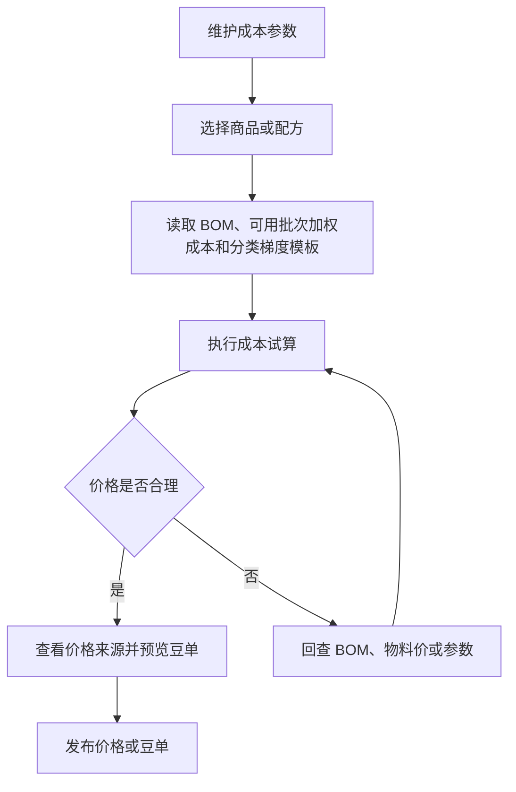

# 操作手册：成本核算

## 适用范围
成本参数设置、成本试算、商品价格表预览、价格发布。

## 入口
- 商品与配方：商品价格表
- 物料管理：成本核算
- 设置：成本参数设置

## 流程图

## 标准操作
1. 先进入成本参数设置，检查基础换算、生产包装、零售税费/物流、挂耳成本/物流等参数；理论成本优先使用商品生产配置中的预期损耗率，系统内部按 `1 - 预期损耗率` 得到产出因子，商用熟豆、零售熟豆和挂耳利润系数在阶梯价模板或挂耳供应价模板中维护。
2. 进入成本核算，选择商品或配方，确认物料、BOM、当前可用批次成本和试算参数。
3. 执行成本试算，查看成本、供应价、零售价、挂耳价和商用梯度价格。
4. 如需维护挂耳供应价，先确认挂耳商品的每袋克重、每盒袋数和挂耳供应价模板档位。
5. 查看豆单预览，确认风味、产地、处理法、等级、海拔等展示信息。
6. 在商品价格表的“已发布价格表”按“价格表归属”查看公共或具体履约客户的版本；需要客户自己的报价时优先在客户商品名维护客户展示名并绑定商品档案。
7. 生成或发布价格表前确认价格表归属：工厂自营/公共归属用于工厂报价，客户归属用于指定客户。
8. PR-395-PRODUCT-PRICE-CLASSIFICATION：商品价格表的商品类型来自商品档案或客户商品名当前归属的分类模板名称；未归类统一进入“其他”。生成抽屉里的“选择分类和产品”来自当前归类的分类项，不再依赖旧产品类型/产品子类型。
9. PR-387-VIEW-CONTEXT：如果顶部“当前视图”是某个客户，商品价格表会把价格表归属锁定为该客户；如果当前视图是订单，系统先派生订单客户，再按该客户客户商品名生成候选。
9. PR-390：价格表、成本试算和 PDF 展示的产品信息优先读取商品生产配置字段；旧商品没有生产配置字段时，才 fallback 到旧 BOM 版本特殊属性或旧 SKU 特殊属性字段。
11. 确认无误后发布价格表，让录单、报价和客户侧展示使用新版本。

## 梯度模板和价格来源
- PR-396：商品价格表生成和成本核算以“客户商品名 + 商品档案 + 商品档案配置”为主链路。客户商品名负责对外名称、系统生成编号和品牌；商品档案负责库存、成本和生产；商品档案配置负责绑定商品配置模板、生产 BOM 版本、工艺路线、预期损耗率和行业字段模板。分类模板是页面启用的分类视图；商品档案和客户商品名都只有一条当前有效归类，移动到其他大类或子类时直接覆盖旧归类。商品价格表的商品类型只读取当前归属的分类模板名称；没有归类时进入“其他”；生成抽屉里的“选择分类和产品”来自当前分类模板和分类项。
- PR-397：商品价格表候选查询使用当前归类的明确字段，不再出现 `classification_template_id is ambiguous`。客户范围生成价格表时，产品信息字段优先读取客户商品名维护的行业字段覆盖值；客户商品未填写时回退商品档案的行业字段值。客户商品名页可按搜索、启用/停用/全部过滤后批量停用，停用后的客户商品不会进入默认客户价格表候选。
- 价格表和 PDF 不再从 BOM 版本维护特殊属性，也不展示预期产出率维护字段。需要展示烘焙度、布料参数、鲜果成熟度等产品信息时，在商品档案的商品生产配置字段中逐行维护，并勾选进入价格表。
- 先在 阶梯价模板 维护阶梯价：每个模板选择一个展示单位（元/磅、元/kg、元/盒、元/袋等），每个档位填写区间名、最小/最大数量和利润率；商品价格表展示单位默认继承阶梯价模板单位。某个商品要从磅改成盒，不在商品档案上直接改展示单位，而是复制或新建一个“盒”单位阶梯价模板并绑定到对应商品配置模板。
- 在 商品配置和分类模板 中维护商品配置模板和商品分类模板。商品配置模板可直接引用阶梯价模板和单位模板；商品分类模板和分类项也可引用阶梯价模板和单位模板。两边不一致时页面提示，但实际价格/单位计算仍以商品档案引用的商品配置模板为准。
- PR-399：商品分类模板或分类项引用的阶梯价模板只用于分类口径、默认检查和不一致提示，不会让该分类下所有商品自动拥有阶梯价。商品价格表真正读取的阶梯价来源是客户商品规则、客户商品规则模板、商品级覆盖和商品档案引用的商品配置模板；如果商品档案没有这些来源，价格表不得仅因归类而显示阶梯价。
- PR-400：商品没有明确阶梯价模板时，系统不会再用旧 Excel 默认档位自动生成 `2包-13包`、`14包-23包`、`24包-47包`、`48包+`。成本试算仍会计算内部 kg/lb 基础价格，但商品价格表预览、发布快照和 `product_price_tiers` 只保存显式阶梯价模板生成的阶梯。
- PR-401：商品价格表遇到 `初晓2.5kg装` 这类没有配置阶梯价模板的商品时，会在商品卡片上显示“未配置阶梯价模板”提示。看到该提示后，回到 商品档案 让商品引用含阶梯价模板的商品配置模板，或在客户商品规则中配置该客户专属阶梯价模板。
- 每个商品配置模板选择一个阶梯价模板；商品档案在配置抽屉中引用商品配置模板后，会按该模板生成价格阶梯。客户商品配置模板的阶梯价下拉可以直接选择公共模板和当前客户自己的模板；需要客户差异化档位时，在阶梯价模板列表点“复制为客户模板”，先复制公共模板，再改客户模板名称、档位和利润率，再让对应商品档案引用客户模板。
- 若某个商品档案需要长期使用不同利润率，在 商品档案 列表填写该行“产品级利润率覆盖”；系统会用该产品利润率覆盖商品配置模板中的阶梯价模板利润率，清空后恢复继承模板。只改变某客户对外价格时，优先通过客户商品名进入该客户价格表发布，不直接改公共商品档案利润率。
- 成本核算和商用豆单中的“来源”按钮可打开价格来源抽屉，查看模板、当前试算、临时试算和公式步骤。
- 公式步骤会展示原料成本、预期损耗率、kg/lb 换算、生产成本、包装成本、损耗、税费、利润率和最终价格等关键值；如需产出因子，系统内部按 `1 - 预期损耗率` 换算。
- 熟豆成本试算中的原料成本来自 BOM 物料的当前可用批次加权平均成本：`Σ(批次当前可用克重 × 批次单位成本) ÷ Σ(批次当前可用克重)`；没有可用批次时才回退物料默认采购价。
- 如果入库价格录错，先到库存调整单选择“批次成本”修正对应原料批次；不要直接改物料档案采购价来影响已入库库存。
- 商用价格来源抽屉可以临时输入原料成本、预期损耗率和利润率并点击“重新试算”，用于查看该档价格变化；这些参数只影响当前抽屉结果，不保存到成本参数、商品生产配置或阶梯价模板。
- 需要长期调整原料成本、预期损耗率或利润率时，按参数来源回到成本参数设置、商品档案的商品生产配置、商品配置模板的阶梯价模板或挂耳供应价模板维护。
- 修改快速成本参数或梯度模板后，只会刷新未发布的成本试算和豆单预览；已发布豆单、录单和客户下单价格不会静默改变，必须重新发布价格或豆单后才生效。
- 生豆价格表不套用熟豆销售公式。系统只按生豆商品档案绑定熟豆 BOM 中保存的原料成本快照生成默认成本参考价；拼配按 BOM 比例加权，单品取 BOM 中对应原料成本。生豆销售价可在产品价格表页面的生豆预览区直接按档位修改，档位区间和价格单位都跟随模板，KG 模板按元/KG 输入和发布；页面会提示“梯度按 KG，单价按元/KG”。点击“保存生豆价格”会保存为当前价格表归属下的生豆草稿，也可在生成抽屉中维护；只有生成并发布新版价格表后，录单才会使用新价格。

## 价格表版本
- 每次发布价格表都会生成一条已发布版本，版本号、配置、内容、归属客户、发布时间和更新说明都保留在商品价格表的“已发布价格表”中。
- PR-395：客户价格表发布时会同时冻结客户商品名、商品档案、分类模板、分类项、商品配置模板、阶梯价模板、单位模板、生产 BOM 版本、价格单位、阶梯和价格来源 JSON。后续客户商品名改名、商品档案改名、BOM 升级、分类调整或模板调整，都不会回改已发布价格表。
- 录单、客户门户和履约下单会优先使用已发布价格表中的客户商品名价格快照。客户商品名没有有效价格时，客户侧和履约侧不会按 0 元静默下单；需要先在产品价格表发布对应客户的价格，或由内部录单明确填写手工价并留下订单保存日志。
- PR-350-BEAN-LIST-PUBLISH-MANUAL-WITHDRAW：发布新版不会自动撤回旧版；旧版会继续保持已发布，直到管理员在版本列表中手动点击撤回。撤回后该版本仍保留历史快照和下载能力，但不再进入录单可选豆单。
- 页面顶部的“价格表归属”下拉列出工厂自营/公共归属和每个履约客户；选择某个客户后，下方版本列表只展示该客户的价格表版本。可在版本列表中按产品类型筛选，点击“生成新版”会按当前归属和产品类型打开生成抽屉，不再复制历史配置；管理员可撤回当前仍在发布状态的版本。
- 在版本列表点击“下载 PDF”会按该行版本的已锁定内容和样式打开浏览器打印/保存 PDF，不会用当前实时价格、当前抽屉配置或当前筛选结果改写历史豆单。
- 客户小程序打开同一版本 PDF 时由系统按版本缓存。第一次打开时生成并保存；后续访问同一版本直接复用缓存，不重复生成。
- 官方豆单是没有专属客户时的公共兜底；客户豆单只对归属客户生效，客户自己的历史版本可继续追溯，但新版本按当前 SKU 设置和本次抽屉设置直接生成。
- 客户豆单打开“生成豆单”时，版本号会默认从当前客户已发布版本或复制的官方价格源版本递增一小步：`V1` 默认 `V1.01`，`V1.01` 默认 `V1.02`，`V3.0.5` 默认 `V3.0.6`。如需大版本号，可在发布前手动改版本号。
- ERP 录单按熟豆、生豆、挂耳分别选择豆单版本，默认使用当前客户对应类型的最新发布版本；没有客户专属版本时使用公共版本。订单商品行保存实际匹配的发布 ID 和版本号。
- 发布新版豆单时，在更新说明中写清新增、下架和价格/文案调整，客户小程序首次下单提示会引用这些内容。
- 发布、撤回、缓存生成和客户确认新版都会写入操作日志，便于追溯谁在什么时间改变了可用豆单。

## 挂耳供应价模板
- 挂耳商品需要在 商品管理 维护为“挂耳”类型，并填写每袋熟豆克重和每盒袋数。
- 系统默认提供“默认挂耳供应价”模板，档位为 100袋、1000袋、5000袋、10000袋；每档维护最小袋数和倍率。
- 成本核算发布价格时，会把挂耳价格发布为交易快照：按袋一组价格，按盒一组价格。盒价按“含包装单袋价 × 每盒袋数”计算，盒装最小数量按“最小袋数 ÷ 每盒袋数”向上取整。
- 挂耳价格来源包含模板、档位、单袋克重、每盒袋数、裸袋价、含包装价、倍率和税率。模板停用只影响后续试算和维护入口，不会删除已经发布到交易价格表的历史快照。
- 挂耳价格解释接口可查看熟豆成本/kg、单袋克重、加工成本、额外成本、倍率、税率、含包装袋价和盒装换算。
- 新增、修改、停用挂耳供应价模板会写入操作日志；发布价格批次也会写入操作日志。

## 客户上下文
- 商品与配方下的商品档案、客户商品名、商品配置模板分别维护执行对象、客户展示对象和模板规则，不再内嵌价格表或价格试算。
- PR-386 / PR-396：客户侧新增报价对象优先使用“客户商品名”。客户商品名绑定一个商品档案，维护客户展示名、系统生成编号、品牌、排序和是否进入价格表；具体分类归属在客户商品名页启用的分类模板 Tab 内完成。单个新增和批量添加商品档案都不手工填写客户商品编号。工厂自营也作为一个内置客户-like 归属维护客户商品名。
- 创建商品档案时只填写名称、备注等基础信息，不选择分类模板、产品类型或产品子类型。新增商品档案不在新增表单里复制 BOM 或价格梯度；这些能力统一通过商品档案配置抽屉、BOM 配方维护和商品配置模板完成。
- PR-382 / PR-396：历史 SKU 复制抽屉已下线。新贴牌场景不要默认复制商品档案/BOM；客户只改名称、品牌或客户侧分类时，创建客户商品名并绑定已有商品档案。配方、包装、生产方式、库存对象或成本口径变化时，才使用“创建新商品档案”或“复制为商品档案”生成新执行对象，再维护生产 BOM 和商品配置。
- PR-354-PRODUCT-TYPE-SUBTYPE-COMPAT：产品价格表继续复用原产品豆单的公共/客户专属、草稿/发布/撤回、版本快照和录单取价能力，不另建价格表模块。当前兼容阶段会把历史 `product_kind` 映射到默认产品类型，后续规则逐步改由 商品管理 中的产品类型和产品子类型配置驱动。
- PR-392：生成客户范围产品价格表前，先在 客户商品名 确认客户商品名已绑定商品档案，再在 商品档案 点击商品名确认该商品档案引用了正确商品配置模板。商品配置模板统一承载阶梯价模板、工序模板、价格表生成规则和单位规则；客户要差异化时，复制公共商品配置为客户配置后，再让对应商品档案引用客户模板。成本核算页切到某个客户范围时，会按客户商品名绑定的商品档案和商品配置模板预览价格表，避免生成时仍使用公共默认规则。
- PR-357-PRODUCT-PRICE-LIST-GENERALIZATION：页面主名称为“产品价格表”，主操作为“生成价格表/发布价格表”。底层仍复用原产品豆单的 `bean_list_publications` 发布快照，不另建价格表；旧公共豆单链接和旧 `list_type` 继续兼容，同时新发布记录会带产品类型字段，可按产品类型查询价格表版本。
- PR-359-PRODUCT-KIND-MIGRATION-CLEANUP：启动迁移会为熟豆、生豆、挂耳、速溶咖啡补默认产品类型和产品子类型，并只给未分类旧 SKU 回填分类。产品价格表仍沿用原发布快照；历史豆单/产品价格表的 `content_json` 和历史价格不会被迁移改写。
- PR-360-SKU-CATEGORY-SUBTYPE-CLARITY / PR-392：新增 SKU 的“产品类别”来自商品分类产品类型，不再让用户手选硬编码产品形态；`product_kind` 只在后台作为兼容字段保留。单位规则维护在“商品配置模板”里，商品档案在配置抽屉中选择要引用的商品配置模板：库存单位用于库存和生产数量，报价单位用于产品价格表和阶梯价单位，录单单位用于订单默认规格，单位换算用于把录单数量折算成库存数量，整数单位用于要求盒、袋等数量按整数填写。已发布价格表和历史订单不会被回改，必须重新生成并发布新版才影响后续录单。
- PR-361/362：产品子类型和商品配置不再让用户填写 JSON。操作时在“商品配置”里用下拉维护计价方式、固定单价、成本加成、取整和含税；是否进入产品价格表由产品价格表页面决定，不在商品配置里勾选。单位换算通过“单位模板”维护，例如新增换算 `1 盒 = 0.2 kg` 的模板。
- PR-372-PRODUCT-CONFIG-DISPLAY-UNIT：商品配置模板里不再维护“价格表展示单位”。“盒装/箱装展示”“按重量展示”和旧的独立展示单位都不再作为商品配置字段；价格表单位继承阶梯价模板单位，盒装、箱装或重量展示通过阶梯价模板、单位模板和 BOM 用量表达，单位模板和单位换算不再放在商品配置模板里手写。
- PR-373-PRODUCT-CONFIG-UI-POLISH：商品配置模板列表按独立列表行展示，点击左侧某个配置后右侧编辑区切换到该配置，选中行会有明显选中态；列表行显示配置名称、公共/客户状态、单位模板名称和库存/报价/录单摘要。价格表生成规则里的固定单价、成本加成等字段为结构化输入，字段说明通过感叹号提示展示，不需要写 JSON。
- PR-374-COMPOSABLE-PRODUCT-PRICING / PR-375：商品配置里不选择“成本模型”。价格表按商品配置组合出结果：单位模板决定成品库存/报价/录单单位，BOM 决定每报价单位成本，工序模板决定工序成本，阶梯价模板决定数量档和单位，价格表生成规则决定按成本加成、固定单价或模板利润率发布。自定义单位如“盒”会一路写入产品价格表、发布快照、PDF 和录单阶梯，不会被系统改成磅。
- PR-376/377/378 与 PR-389 历史兼容：早期特殊 KV 曾在商品配置模板、SKU 行或 BOM 版本维护，用于产品价格表展示。PR-390 后，新 UI 不再在商品配置模板、SKU 行或 BOM 版本编辑这些字段；商品配置模板保留阶梯价模板、价格表生成规则和单位模板，产品信息字段迁到商品档案的商品生产配置。
- PR-398：例如 `烘焙度`、`咖啡因`、`条装规格`、服装布料克重、鲜果成熟度等，都作为商品生产配置字段维护。点击商品名打开商品档案配置抽屉后，选择行业字段模板，系统按模板字段生成普通表单；操作员只能填写字段值和“价格表展示”标记，不能在商品档案里临时新增或删除字段定义。行业字段模板页新增字段只使用“文本/下拉”，字段键同时作为显示名，文本字段可填默认文本，下拉字段用空格分隔选项。发布商品价格表时，系统冻结客户商品名、商品档案、商品配置模板、生产 BOM 版本、工艺路线、预期损耗率和商品生产配置字段快照；客户价格表展示字段优先使用客户商品名覆盖值。旧 BOM 版本 `special_attrs_json`、旧 SKU `special_attrs_json` 和 `roast_level` 只作为 fallback，避免历史价格表、旧工单或旧 API 解释断层。
- 固定单价和成本加成的配置必须在商品配置模板里填写完整：选择“固定单价”时填写每个阶梯统一使用的最终单价，单位继承阶梯价模板；选择“成本加成”时填写加成百分比，价格按“每报价单位 BOM 成本 + 工序成本”再乘以加成比例生成。没有填写固定单价或加成比例时，页面和接口都会拒绝保存。
- 复制公共商品配置时，先在 商品管理 顶部切到目标履约客户，再在商品配置列表中点“复制为客户配置”。复制后仍停留在该客户视角；如果这个客户已经复制过同一个公共配置，系统会打开已有客户配置，不再重复生成两条“来自公共模板”的记录。客户模板列表会隐藏已经派生过的公共原配置，只显示客户副本供编辑，公共配置本身不会被改写。复制商品配置只复制模板，不会自动引用或复制商品档案；需要把商品给客户使用时，优先创建客户商品名并绑定商品档案。
- PR-388：成本核算和产品价格表读取商品档案当前绑定的生产 BOM 版本。客户商品名很多但配方相同的场景，不复制 BOM；多个商品档案可以绑定同一个生产 BOM 版本。客户需要专属配方、包装、损耗或成本口径时，复制 BOM 成新配方或创建新版草稿，发布后把对应商品档案绑定到该版本。
- SKU 列表字段较多时，列表本身支持横向滚动。产品类型、产品子类型和特殊属性列会保持单行展示，避免“咖啡烘焙豆”被挤成一个字一行；需要查看更多列时在 SKU 表格区域左右滑动。
- 速溶盒装示例：先在物料档案维护“速溶咖啡条装原料”，单位用“条”，默认采购价填每条成本，备注 1 条 10g；在 BOM 配方维护中给“速溶盒装”添加该物料，消耗单位选“个/盒”，用量填 10，再按需添加盒子、标签等 `个/盒` 包材。然后在 商品配置模板 → 单位模板 新建“速溶盒装单位”，成品库存单位、报价单位和录单单位都选“盒”，需要重量统计时增加 `1 盒 = 0.1 kg` 或 `1 盒 = 10 条` 换算并开启整数单位。商品配置模板选择该单位模板和“盒”单位阶梯价模板，价格表生成规则可选“成本加成”并填写加成比例，也可选“固定单价”并填写每盒售价。最后在商品档案配置中绑定该模板、生产 BOM 和预期损耗率。生成并发布“速溶咖啡”产品价格表后，录单会显示 `元/盒`。
- 速溶价格来源说明：产品价格表上的盒价来自 `每盒 BOM 成本 × (1 + 当前阶梯利润率)`；每盒 BOM 成本会汇总 `unit_per_box`、`unit_per_bag` 和 `g_per_bag` 用料，例如 `10 条 × 每条采购价 + 1 个盒子 + 1 张标签`。如果生成价格是 0 或明显偏低，优先检查条装原料和包材是否填了采购价、BOM 是否启用、消耗单位是否选成 `个/盒`，以及 SKU 是否挂到绑定了商品配置的产品子类型。
- PR-363-SKU-SETTINGS-WORKBENCH-LAYOUT / PR-386：商品管理默认进入“商品档案”，用于维护商品分类、停车场和商品档案列表；阶梯价模板和商品配置模板在“商品配置”工作区。生成产品价格表前，如果只是检查商品档案是否已归类，停留在“商品档案”；如果要改阶梯价模板或商品配置，再切换到“商品配置”。
- PR-364-SKU-SETTINGS-COMPACT-DRAWERS：生成产品价格表前检查 SKU 归类时，在“商品资料”搜索商品分类或 SKU，分类区会在固定窗口内滚动，不再拉长整页；新增 SKU 通过客户SKU列表右上角“新增SKU”抽屉完成。需要调整模板时，切到“商品配置”，默认维护商品配置模板，只有调整档位利润率时再点“阶梯价模板”。
- 公共分类、公共 SKU、公共阶梯价模板和公共商品配置本身不直接改写。客户真正需要差异化时，通过“SKU复制”把公共 SKU 或其他客户 SKU 复制成当前客户 SKU、在阶梯价模板列表点“复制为客户模板”、在商品配置列表点“复制为客户配置”。复制公共阶梯价模板或商品配置后，当前客户模板列表会隐藏已派生的公共原模板，只保留客户副本；商品配置模板的阶梯价模板下拉仍可选择公共模板和当前客户自己的模板。所有开关、复制、拖拽和模板绑定都会写入操作日志。
- 客户自有/客户定制 SKU 行可直接维护“产品级利润率覆盖”；公共引用行的覆盖输入会禁用，避免在客户视角误改公共利润率。
- 客户商品和商品档案列表优先按搜索关键词筛选，搜索可匹配商品名称、商品编号、历史兼容类型标签和备注。需要分类查看时，先启用一个分类模板 Tab，再在该 Tab 内按分类组展开或收起。
- 客户自己的商品分类先在 商品管理 中维护；进入产品价格表后在页面顶部“价格表归属”选择工厂自营/公共归属或某个履约客户。
- BOM 配方维护按商品档案归属切换，但只显示需要维护生产 BOM 的商品档案。生豆商品档案自身不维护 BOM；它在商品管理中绑定熟豆后，BOM 配方维护页不会再把该生豆商品列出来。
- 产品价格表页面顶部“价格表归属”是生成和发布的唯一归属上下文：当前为工厂自营/公共归属时发布公共产品价格表，当前为某个履约客户时发布该客户产品价格表。进入“生成价格表”抽屉后只会显示“当前归属”，不再二次选择发布归属或客户。
- 版本列表、“生成价格表”抽屉和下方预览卡片中的“产品类型”来自 商品管理 的一级商品分类，也就是当前产品类型；不再固定写死为商用、零售、生豆、挂耳。比如新增“速溶咖啡”产品类型并把客户商品名绑定到对应商品档案后，这里会出现“速溶咖啡产品价格表”，选择后只生成该价格表归属下的客户商品名，发布快照写入产品类型和客户商品名/商品档案双快照。
- 旧 `list_type` 仍作为兼容和内部渲染模式保留：生豆仍使用生豆价档，挂耳仍使用袋/盒价档，其他历史产品类型默认走普通产品报价渲染。新商品分组优先通过分类模板 Tab 表达，不再通过新增硬编码产品类型或产品子类型表达。
- 产品价格表预览区按当前商品分类里的产品类型展示，每个产品类型卡片都可以收起或展开；生豆产品类型有独立手工价能力，档位区间按 `1-59kg`、`60kg+` 这类模板区间展示，KG 模板的档位价格输入框是元/KG。改完后点击“保存生豆价格”，系统会把当前价格保存成生豆价格表草稿；正式对外报价和录单自动价仍需进入“生成价格表”并发布新版后才生效。
- 如果生豆卡片提示“未挂到带生豆模板的分类”，说明该生豆商品档案没有挂到 商品管理 里绑定了生豆梯度模板的生豆分类。先到 商品管理 把它移动到正确的生豆分类，再回到产品价格表刷新并维护价格。
- 选择公共/官方归属时，产品价格表展示公共SKU的豆单预览、公共豆单和公共分类。
- 选择某个履约客户范围时，产品价格表默认只展示该客户启用、纳入价格表且绑定有效商品档案的客户商品名，不混入其他客户商品名。页面顶部统计、类型下拉、下方预览卡片、生成价格表抽屉内的产品列表和发布内容都只来自该价格表归属的客户商品名。客户价格表品牌名默认为空，公共价格表品牌名默认为“棵凡咖啡”。
- 顶部“当前视图”只是价格表页面的默认归属和过滤来源，不替代后端校验。发布时仍按价格表归属客户冻结客户商品名和商品档案双快照；旧价格表版本不被回改。
- 客户商品名绑定到商品档案后，产品价格表和成本核算使用该商品档案绑定的生产 BOM 版本。BOM 发布新版不会自动影响已发布价格表，也不会自动改已绑定旧版本的商品；需要升级时先确认新版成本，再更换商品档案的生产 BOM 绑定并重新生成价格表。
- 如果该客户使用的商品档案绑定了客户商品配置模板，产品价格表预览和生成会按该商品配置解析阶梯价模板和单位规则；例如“示例大客户”的“冻干速溶”可让对应商品档案使用客户自己的盒装商品配置，而公共商品档案仍使用公共商品配置。后续修改商品配置不会改变已经发布的价格表快照，必须重新生成并发布新版后才影响录单。
- 公共 SKU 或客户 SKU 即使没有旧 Excel 豆单编码，只要挂了产品类型/产品子类型，也会按分类路径生成产品价格表展示信息；例如“速溶咖啡 / 冻干速溶”的盒装 SKU 会进入“速溶咖啡”产品价格表，不会因为缺少旧商用豆单编码而消失。
- 客户商品名不再依赖旧 Excel 豆单资料。只要客户商品名绑定有效商品档案，产品价格表客户范围会按客户商品名页启用的分类模板 Tab 归属生成分组；客户商品名没有新分类归属时进入“未分类”，旧展示分类只作为历史 fallback。标题沿用公共价格表逻辑，优先显示实际分类名。例如把客户商品名加入“定制咖啡熟豆”分类后，会显示在“1、定制咖啡熟豆”分组下，不会落到旧公共豆单“源产地精选”，也不会因为缺少旧豆单编码而不显示。
- 客户商品名还没有新分类归属时，产品价格表会把它放到“未分类”，不会继续沿用基础公共商品的旧 Excel 分类；需要正式分组时先回到 客户商品名，启用对应分类模板 Tab，勾选客户商品并移动到分类。
- 历史兼容 marker：客户商品名还没有展示分类时，产品价格表会把它放到“未分类”；客户只改名称、编号、品牌或展示分类时，创建客户商品名并绑定已有商品档案。PR-394 后“展示分类”由页面级分类模板 Tab 和对象归类承载；若旧分类消失，仍先检查 schema 修复是否已生效。
- 产品价格表的商用、零售、生豆、挂耳四种豆单分别读取自己的豆单信息和价格档；生豆豆单使用生豆豆单字段，不会落到商用豆单字段导致界面为空。
- 挂耳豆单不再有外层独立生成按钮；点击“生成价格表”后在抽屉的“产品类型”中选择挂耳对应的产品类型。
- 生成价格表不再提供“复制已有豆单配置”。商品档案、客户商品名、分类和梯度模板差异先在 商品管理 中处理，产品价格表按当前数据和本次抽屉设置直接生成。
- 客户自己的价格表会读取产品价格表中的价格表归属，后续发布或保存草稿时要确认归属正确，避免把客户自己的价格表内容保存到错误客户。
- 如果只想维护工厂自营/公共价格表，在产品价格表中把“价格表归属”切回公共归属。

## BOM失效处理
- 成本核算页如果顶部出现 “BOM已失效”，表示至少有一款产品的当前 BOM 被手动失效或跟随产品失效。
- 商品行和豆单预览区域会显示 “BOM已失效” 警示，提醒该产品的成本和豆单不应作为正式发布依据。
- 发布价格策略或豆单前，先到 BOM 配方维护检查该商品：需要继续销售时，重新保存配方、保存预期损耗率或启用历史版本；不再销售时，保持产品失效。
- BOM失效不会删除历史明细，成本核算仍可用于追溯和检查，但不能静默当作有效 BOM。通过 商品管理 失效商品档案时，当前 active BOM 版本也会同步改为 disabled，避免后续误启用失效商品档案的旧 active 版本。
- PR-322：客户自有产品类型或产品子类型只要仍有有效商品或 active BOM 关联，就不应被公共分类开关误清理；停用商品档案时同步禁用对应 active BOM 版本，历史价格表和历史 BOM 明细不回写。

## 结果校验
- 成本试算结果能复现当前 BOM、可用批次加权成本和成本参数。
- 成本口径分三层：理论成本取商品生产配置的预期损耗率和绑定 BOM 版本；计划成本取工单冻结的计划投料和 BOM 快照；实际成本取生产日志/工序卡记录的实际消耗和实际产出。
- BOM失效 产品在成本核算和豆单预览中都有明显 “BOM已失效” 警示。
- 商用梯度、零售价、挂耳价显示完整。
- 客户豆单的商用批发豆单标题与公共豆单一致，优先使用二级豆单分类；客户 SKU 挂到“咖啡豆 / 定制咖啡熟豆”时标题应为“1、定制咖啡熟豆”。
- 绑定梯度模板的产品子类型按模板档位生成商用梯度价格，价格来源能解释每一步计算。
- 挂耳商品按挂耳供应价模板生成袋价和盒价，发布后 `product_price_tiers` 保留按袋/按盒快照，不随模板停用或修改自动变化。
- 豆单信息来自物料咖啡豆资料，不应回退为空白或旧字段。
- 已发布价格表版本在产品价格表中可追溯；点击“下载 PDF”会由服务器按该版本快照生成并保存 PDF，不再调用浏览器打印窗口。PR-323 要求 PDF 使用生成抽屉预览的卡片样式，下载文件的字体大小、粗字重、卡片行列和报价块排版应与预览一致；PR-332 要求生成器在换页前先按 normal/compact/dense 三档压缩卡片内边距、字号、行距和报价块高度，减少分类标题后大面积空白；PR-333 要求紧凑排版仍必须保证分类标题、商品卡和报价块不重叠，并在需要时让当前组最后一行给下一组标题和首行商品预留安全高度；旧文本版、`bean-list-preview-style-v1`、`bean-list-preview-style-v2` 或 `bean-list-preview-style-v3` 缓存会自动按 `bean-list-preview-style-v4` 重新生成覆盖。
- 生成抽屉中的“生成 PDF”会先把当前预览保存为草稿快照，再由后端生成预览样式 PDF 并下载；不会打开系统打印窗口。
- 发布后商品档案、录单或报价使用新价格。

## 常见问题
- 成本明显异常：先查 BOM 用量，再查当前可用原料批次成本、是否有待处理/不通过批次被排除，以及成本参数。
- 批次价格录错：到库存调整单选择“批次成本”修正目标成本/千克，再回到成本核算重新试算。
- 看到 BOM已失效：回到 BOM 配方维护确认是否重新启用；不要直接发布该商品豆单。
- 豆单信息缺失：回到物料档案补齐咖啡豆信息。
- 客户新增商品在客户价格表中不出现：先确认 客户商品名 中该客户商品名已启用、已绑定有效商品档案且勾选进入价格表；若是客户自有/客户定制熟豆，产品价格表会按客户商品名页启用的分类模板 Tab 归类生成条目，不需要旧 Excel 豆单资料。若分类消失，先在客户商品名页检查该模板 Tab 是否已启用，以及客户商品是否已移动到目标分类。
- 旧客户 SKU 是否应该进入新价格表：如果只是贴牌、客户命名、客户编号、客户侧分类或客户专属价格差异，到 客户商品名 用“旧客户 SKU 收敛检查”预填客户商品名并绑定来源商品档案；新价格表会按客户商品名生成。旧客户 SKU 不会被自动删除，历史价格表和历史订单仍按原快照追溯。
- 下载豆单 PDF 没有弹出文件：先确认该版本有 `content/groups` 快照；再检查后端 `/api/costing/bean-list/publications/:id/pdf` 是否生成成功，以及 `bean_list_publication_assets` 中是否已有该版本 `pdf` 资产。若看到旧文本版、细字体、排版与预览不一致、页面空白过多，或分类标题与价格块重叠的豆单，重新点击“下载 PDF”或“生成 PDF”，系统会按新版 `bean-list-preview-style-v4` 缓存键重新生成预览一致且更紧凑的文件。
- 发布后录单价格未变：检查是否发布成功、商品规格是否匹配、页面是否刷新。
- 挂耳盒价数量不对：检查产品设置里的每盒袋数；发布时盒装最小数量会向上取整。
- 参数解释不清：打开价格来源抽屉查看公式步骤；商用价格表可先用临时原料成本、预期损耗率或利润率重新试算定位影响。如果源参数错误，按参数来源回到成本参数设置、商品档案的生产配置、生产 BOM 配方库、梯度模板或挂耳供应价模板保存后刷新数据。
