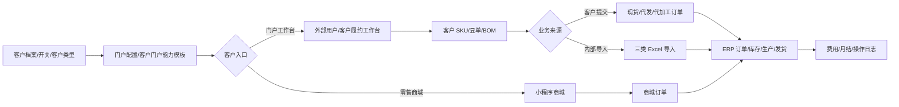
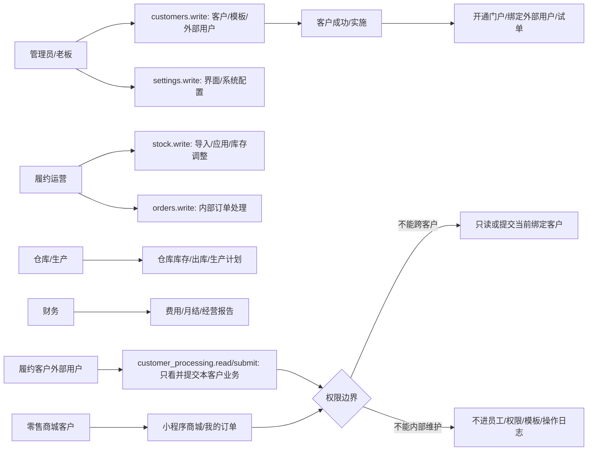
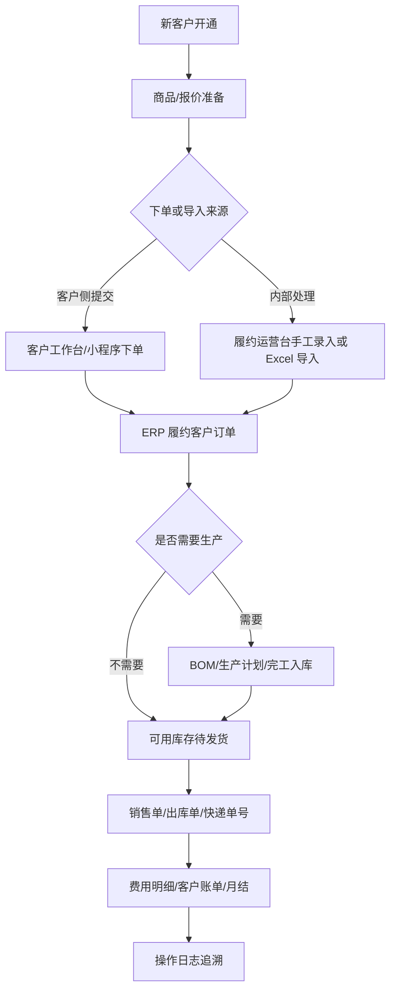
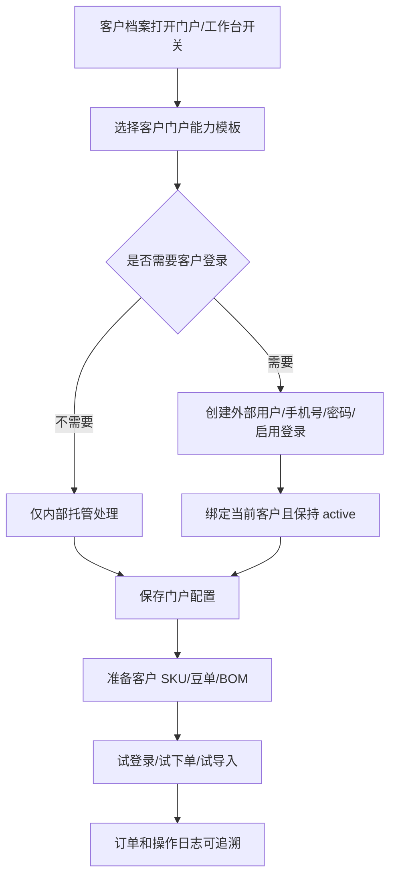
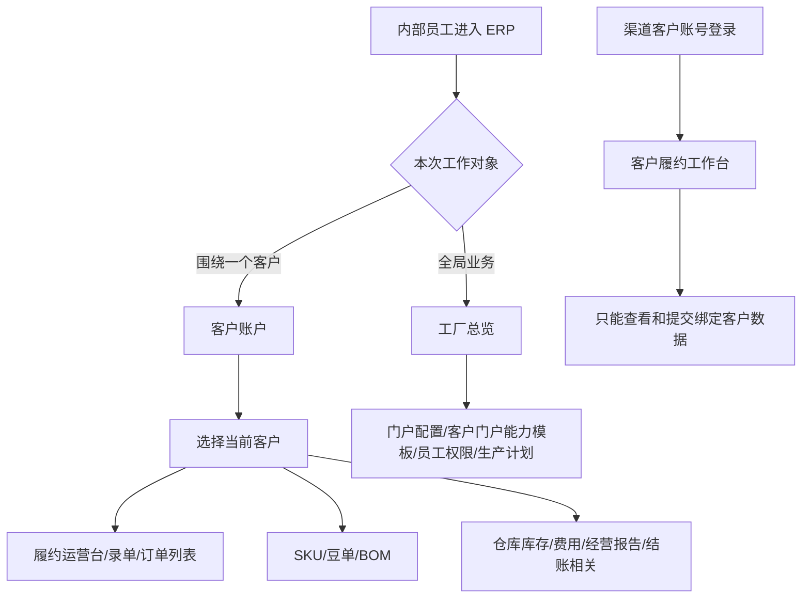
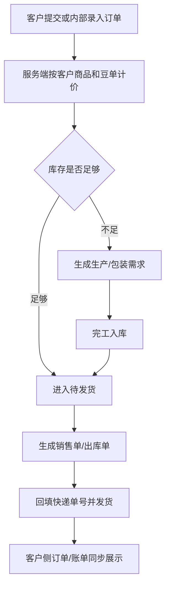
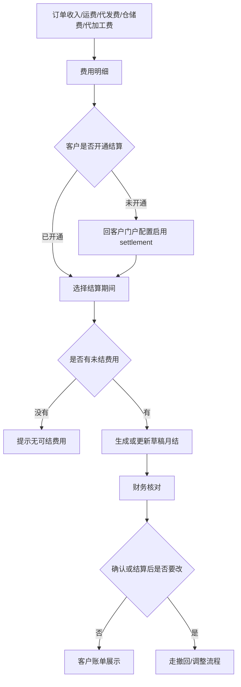
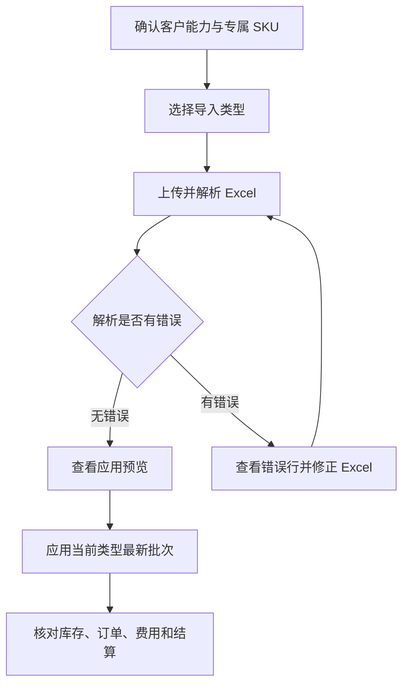

# 操作手册：客户履约全流程

## 适用范围
本手册把原“工作台模式手册、客户门户手册、客户履约手册”归并为一个客户履约操作手册，覆盖客户开通、门户和外部用户、顶部当前视图、客户商品和豆单、Excel 导入、客户下单、内部履约、库存发货、费用月结和操作追溯。

## 新用户先看
- 客户履约不是一个单独页面，而是一条从“客户开通、商品和价格准备、客户下单、内部履约、发货、结算、追溯”串起来的流程。
- 第一次使用时先按“开通客户 → 准备商品/豆单/BOM → 试提交订单 → 查履约客户订单 → 发货/出库 → 月结对账 → 查操作日志”走一遍，不要直接从 Excel 导入或客户下单开始。
- PR-379-CHANNEL-PORTAL-WORKBENCH-SWITCH：客户能看到什么，主要由客户档案“开通客户门户/工作台”开关、客户门户能力模板、外部用户绑定和客户专属 SKU/豆单决定；客户类型只描述业务身份，不直接授予门户或工作台能力。内部员工能操作什么，主要由 ERP 角色和页面权限决定。
- 客户账户模式默认隐藏内部“履约运营台”入口；客户只进入客户侧履约工作台或小程序，不进入内部运营台。

## 合并后的阅读地图

| 原手册内容 | 合并到本手册的章节 | 主要读者 |
| --- | --- | --- |
| 视图上下文 | 顶部当前视图、客户视图、订单视图、保存视图、结果校验、常见问题 | 管理员、履约运营、渠道客户 |
| 客户门户与商城 | 客户开通、客户门户能力模板、外部用户、小程序和商城、客户侧权限 | 管理员、客户成功、实施人员 |
| 客户履约账户 | Excel 导入、托管库存、代发/代加工、履约客户订单、费用月结 | 履约运营、仓库、财务 |

补充阅读：商品档案、客户商品名、生产 BOM 和价格表版本看“成本核价手册”和“物料、库存与 BOM 手册”；生豆产品、绑定熟豆 BOM 和生豆价格表看“生豆销售手册”；履约订单进入 ERP 后的销售单、出库单、失效订单和发货资料看“订单销售手册”。

## 角色权限图

## 角色权限速查
| 角色 | 可操作范围 | 权限边界 | 重点入口 |
| --- | --- | --- | --- |
| 管理员/老板 | 配置客户类型、客户门户能力模板、外部用户、全局设置、权限、操作日志，必要时查看全流程 | 不要把客户外部账号当内部员工账号维护；客户门户能力模板变更会实时影响客户 | 客户管理：客户档案、门户客户配置、客户门户能力模板、客户履约手册；全局设置、员工维护、操作日志 |
| 客户成功/实施 | 帮客户开通门户、确认模板能力、准备试单、核对客户是否能登录和看到正确入口 | 不能绕过模板给零售商城客户开放 ERP 工作台；不能把一个外部用户 active 绑定多个客户 | 客户管理：门户客户配置、客户履约手册 |
| 履约运营 | 选择客户、导入三类 Excel、应用批次、手工提交订单/代发/加工、查看履约客户订单和费用 | 进入内部履约运营台需要内部 `stock.write`；客户账户模式默认隐藏内部入口，客户未开通对应能力时不能提交或导入对应业务 | 客户账户工作台、客户履约运营台、订单列表“履约客户订单” |
| 商品/成本维护 | 维护商品档案、客户商品名、商品生产配置、生产 BOM、价格表归属、客户专属价格表版本和价格 | 不直接改客户订单金额；客户专属数据不能泄露给其他客户；客户商品名不承载 BOM | 商品档案、客户商品名、商品配置模板、生产 BOM、产品价格表、成本核价手册 |
| 仓库/生产 | 核对客户托管库存、成品库存、生产计划、发货、销售单和出库单 | 不配置客户账号、客户门户能力模板或结算；库存和发货变更要能在操作日志追溯 | 仓库库存、库存作业、生产计划、订单列表 |
| 财务 | 核对履约费用、生成或确认月结、查看客户账单和财务影响 | 不通过重传 Excel 覆盖已确认或已结算账单；历史调整走财务流程 | 客户履约运营台、财务管理、订单列表 |
| 履约客户外部用户 | 登录客户侧履约工作台或小程序，提交已开通能力下的现货/代发/代加工订单，查看自己的订单、账单和豆单 | 只读/提交当前绑定客户数据；不具备内部 `orders.write`；不能手填价格、运费或优惠 | 客户侧履约工作台、小程序首页、订单、账单、我的 |
| 零售商城客户 | 浏览商城、提交商城订单、查看自己的商城订单 | 不绑定 ERP 工作台账号，不显示批发履约入口 | 小程序商城、客户门户手册 |

关键权限口径：
- `customers.write`：客户门户配置、客户门户能力模板、外部用户绑定等客户开通类操作。
- `stock.write`：内部客户履约运营台的导入、应用、库存调整和手工履约操作。
- `stock.read`：查看客户履约手册和库存类只读信息。
- `customer_processing.read` / `customer_processing.submit`：客户侧履约工作台读取自己数据和提交客户侧履约请求。
- `orders.read` / `orders.write`：内部订单列表查看、录单、改单、失效、销售单和出库单相关操作。
- `settings.write`：全局设置等系统配置；保存配置必须写入操作日志。

## 功能流程总览

### 客户开通流程图

### 工作台与客户上下文图

### 订单履约流程图

### 费用月结流程图

| 场景 | 操作流程 | 核对点 |
| --- | --- | --- |
| 新客户开通 | 客户档案选择客户类型并打开“开通客户门户/工作台” → 按需选择客户门户能力模板 → 按需创建外部用户、设置密码并启用登录 → 保存配置 → 顶部客户账户或客户履约运营台选择客户 | PR-379/381：ERP 内部顶部客户账户下拉只要求客户 active 且已开通门户/工作台；外部登录和履约功能由账号密码、绑定关系和能力模板决定 |
| 商品和报价准备 | 商品档案维护真实 SKU 和商品生产配置 → 客户商品名绑定商品档案 → 按需维护生产 BOM 配方库 → 产品价格表选择价格表归属并发布价格 | 客户下单商品只包含当前客户启用的客户商品名；价格来自正确价格表版本，生产和成本追溯到商品档案 |
| 客户侧下单 | 客户登录工作台或小程序 → 选择现货/代发/代加工 → 填收件信息和商品行 → 提交订单 | 客户不能填写单价、运费或优惠；服务端按客户、客户商品名、商品档案、规格和已发布价格重新计价；没有有效价格时拒绝提交，不能静默生成 0 元订单 |
| 内部手工履约 | 履约运营台选择客户 → 提交订单信息/代发信息或加工工单 → 核对订单合计和阶梯价 | 客户未启用 `direct_ship` 或 `processing` 时页面和接口都不能绕过 |
| Excel 导入 | 选择导入类型 → 上传 Excel → 解析导入 → 查看错误行和应用预览 → 应用当前类型最新批次 | 解析不改业务数据；只有应用才写库存、订单、费用或结算；同一外部单号重传要幂等更新 |
| 托管库存 | 开通托管库存能力 → 导入或手工调整生豆/包材/成品 → 在仓库库存核对余额和流水 | 调整必须有原因并写操作日志；客户库存与自营库存分开 |
| 订单承接 | 订单列表切到“履约客户订单” → 打开订单号 → 核对明细、费用、收件信息、销售单和出库单 | 履约运营台、客户侧工作台、小程序读取同一张 ERP 订单 |
| 发货出库 | 订单完成生产或可直接发货 → 生成销售单/出库单 → 回填快递单号 → 发货后扣减库存 | 失效订单默认不进入履约客户订单和客户侧订单；只能复制成新订单继续处理 |
| 月结对账 | 导入费用或生成费用 → 选择结算期间 → 生成月结 → 财务核对并确认 | 没有费用不生成 0 元批次；已确认或已结算批次不能靠重复生成覆盖 |
| 异常追溯 | 查看页面错误 → 查客户能力、模板、SKU、豆单、BOM、订单详情和操作日志 | 所有用户触发的写操作都应能在“操作日志”按业务对象追溯 |

## 新用户上手清单
1. 先用一个测试客户完成开通：客户档案选择客户类型（可用渠道客户验证）、打开“开通客户门户/工作台”。如果只是内部员工先进入客户账户做 SKU、库存或价格配置，可以暂不选客户门户能力模板，也不建外部账号；如果客户要登录小程序或客户外部工作台，再回到门户客户配置选择能力模板、维护外部用户并启用登录。
2. 在 客户商品名 选择该客户，确认客户商品名是否已绑定正确商品档案；贴牌只改客户商品名，配方、包装、库存对象或生产方式变化才回到 商品档案 创建新商品档案并维护商品生产配置。客户需要一次性上架多款现有商品时，使用“批量添加商品档案”，系统会跳过同客户已存在的绑定并记录创建日志。
3. 在 产品价格表 把“价格表归属”切到该客户，确认对应产品类型的价格表已发布。客户商品名如果没有有效价格，客户侧下单和内部履约提交会返回价格未发布错误，不会按 0 元静默下单。
4. 在 商品档案 检查该商品是否绑定正确商品生产配置；在 生产 BOM 检查配方版本是否有效。挂耳和生豆尤其要核对绑定关系。
5. 用客户外部账号登录客户侧工作台或小程序，做一笔小金额试单。
6. 回到 ERP 订单列表切换“履约客户订单”，确认试单、金额、豆单版本、收件信息和状态一致。
7. 按实际流程走一次生产、库存待发货、销售单、出库单、快递单号和发货。
8. 生成一段测试期间的月结，确认费用、订单账单、结算单和财务口径能对上。
9. 最后到操作日志按订单号、客户、库存调整或设置项追溯本次所有写操作。

## 还需要继续手册化的内容
- 首次开通检查表：把客户类型、开通客户门户/工作台开关、模板、外部用户、登录、专属 SKU、豆单、BOM、默认仓库、结算能力做成一页勾选清单。
- 模板选择决策树：批发代加工、公共 SKU 小批量、纯一件代发、零售商城分别应该选哪个模板，选错后客户会看到什么。
- 客户侧小卡片：给客户看的极简版“如何登录、如何下单、如何查订单、如何看账单、如何退出/切换账号”。
- Excel 模板说明：三类 Excel 的必填列、常见错误、重传修正规则、哪些字段会覆盖旧值、哪些已结算数据不能靠重传修改。
- 价格和豆单排障：客户看不到商品、单价异常、挂耳缺价格、生豆缺价格、BOM 缺组件时，按入口一步步排查。
- 订单生命周期图：客户提交后从履约客户订单到生产、库存、发货、销售单、出库单、账单的状态流转。
- 财务对账口径：订单应收、运费、优惠、代发费、仓储费、代加工费、结算批次和财务月结的对应关系。
- 权限申请说明：内部员工申请 `customers.write`、`stock.write`、`orders.write`、`finance.close` 等权限时分别能做什么、风险是什么。
- 操作日志排查模板：按订单、库存、客户配置、豆单发布、月结批次分别应该搜索哪些对象和动作。

## 入口
- 内部员工顶部当前视图：选择“客户：某客户”后处理该客户的履约、订单、客户商品名、产品价格表、BOM 筛选、库存和财务；选择“订单：SO-xxx / 客户”后围绕该订单做过滤、复制、履约或追溯。
- 渠道客户账号登录：不展示工作台切换，左侧显示“工作台”和“费用相关”；“工作台”进入自己绑定客户的履约运营台。
- 工厂总览不再展示客户履约账户入口；客户档案、门户客户配置、客户门户能力模板和客户履约手册统一放在 客户管理 菜单。
- 商品与配方：商品档案、客户商品名、商品配置模板、生产 BOM，用于维护真实 SKU、客户展示名、模板规则和配方库。
- 库存管理：仓库库存，用于查看客户成品库存、库存流水，并维护仓库绑定客户。
- 订单销售：订单列表，用于查看代发导入形成的订单和发货状态。

## 流程图

## 标准操作
1. 第一次导入前，确认客户档案存在、客户启用、已打开“开通客户门户/工作台”，并在门户客户配置绑定包含代加工、托管库存、代发、结算等能力的客户门户能力模板。渠道客户可以用“渠道代发/现货下单”模板做现货或代发场景。
2. 如客户需要独立库存仓，进入 库存管理 → 仓库库存，选择仓库后在“当前仓库”摘要行点击“仓库设置”，右侧抽屉绑定客户。门户客户配置只展示绑定后的客户仓库，不再维护代加工仓库字段；绑定客户后，其他客户账户不会看到该仓库。
3. 客户自己的产品作为客户专属 SKU 管理，不放进公共产品列表，也不能直接共用其他客户 SKU。
4. 如果本次要连续处理同一个客户，先在 ERP 顶部“当前视图”选择客户；系统会把该客户带入履约运营台、客户商品名、产品价格表、BOM 筛选、仓库库存、订单列表、费用管理、经营报告和结账相关，避免每个页面重复选择。生产计划/开始生产不进入客户专属页面，排产和开工统一切回工厂总览处理。
5. 如果本次围绕某张订单处理，先在 ERP 顶部“当前视图”选择订单；系统会把订单号和订单客户带入订单列表、录单复制、履约和追溯页面。
6. 进入客户履约账户，在“选择客户”中按客户名、公司、联系人或电话搜索客户，并点击载入账户；下拉框展示 active 且已开通门户/工作台的客户，不再按 `customer_type=wholesale` 硬编码，也不要求已经创建外部账号或密码。客户视图已选择客户时，本页会自动载入该客户；如果该客户未绑定有效能力模板，页面只显示空工作台或基础信息，提交代发、代加工、结算等动作仍会被能力校验拒绝。
7. 客户视图下 客户商品名、产品价格表、仓库库存和费用管理锁定顶部当前客户；BOM 只作为商品档案生产 BOM 的筛选和跳转辅助。客户商品名只归当前客户；生产 BOM、商品生产配置和商品档案用于内部执行追溯。
5. PR-311-CUSTOMER-PORTAL-ACCOUNT-PROFILE：外部用户不在本页维护；如需创建账号、重置密码或启停登录，回到 客户管理 → 门户客户配置 的“外部用户”区域处理。保存后顶部“客户账户”当前客户下拉会自动刷新；客户门户配置的“打开客户档案”可直接打开当前客户资料抽屉。外部用户不进入员工维护页，不配置内部角色。
6. 运营台会按客户门户能力模板只展示可用功能：未开通 `processing` 的公共 SKU 小批量批发/代发客户，不显示代加工工单导入、提交加工工单和加工工单列表；其他导入类型、操作面板和数据列表也只按 `direct_ship`、`inventory_custody`、`settlement` 等已启用能力展示。
7. 选择导入类型：代加工工单、代发清单或结算单。一个 Excel 只按一种类型导入。公共 SKU 小批量客户会把“代发清单”显示为“订单清单”，但导入类型仍是 `direct_ship_workbook`。
7. 上传 Excel 后先解析导入，查看有效行、错误行、工单数、代发订单数和费用明细数。
8. 表头、日期、数量、金额或产品名异常时，先修改 Excel 后重新解析。
9. 导入批次列表中有错误时，点击“查看错误行”，按表名、行号、类型和错误原因修正 Excel 后重新解析。
10. 确认“当前可应用批次”和“应用预览”，再点击“应用当前类型最新批次”；解析和预览都不改变业务数据，只有应用才写入库存、工单、订单和费用。
11. 应用导入批次前确认客户已开通对应能力：代加工工单要求 `processing`，代发清单要求 `direct_ship`，结算单要求 `settlement`；未开通对应能力时先回到客户门户配置启用能力或改选正确客户/导入类型。
12. 在客户履约账户手工提交代加工工单或代发订单前，也要确认客户已开通对应能力；未开通对应能力的客户不能通过内部 API 绕过页面写入工单或代发订单。手工提交订单信息时按“一个收件信息 + 多行商品”录入，渠道客户的终端收件人写订单收件字段，不新增客户档案；历史收件信息从该渠道客户历史订单聚合，可下拉搜索选择。逐行选择当前客户启用的客户商品名，系统保存时同步冻结客户商品名和商品档案快照；页面会实时展示阶梯价、行小计，并实时计算订单合计（商品金额 + 运费）。曲奇拼配等 KG 梯度商品按该行总 KG 选档，1000g 及以上保存元/kg 单价并按总 KG 计算小计；挂耳商品按袋或盒下单，盒价按挂耳已发布价格梯度换算。若客户商品名没有有效价格，接口返回 `customer product price unpublished`，运营员需要先发布价格表或由内部录单明确手工价后再保存。
13. 手工调整托管库存前确认客户已开通 `inventory_custody` 能力；未开通托管库存能力的客户不能写库存物料、库存台账或余额。
14. 应用后刷新账户，核对托管库存、加工工单、代发订单、费用明细和结算批次。
15. 月结时先确认该客户已开通结算能力，再填写结算开始和结束日期；未开通结算能力的客户不能生成结算批次，开通后再生成月结并核对结算编号、期间、金额和状态。没有费用可结算时不会生成 0 元空结算批次，接口会返回 `no fees for settlement period`；重复生成同一周期月结不会清零已结费用或结算批次金额，其中草稿批次会把新增未结费用并入同一批次后重算总额。已确认或已结算的月结批次不能通过重复生成同周期月结改动；若结算后发现漏费，先按内部流程撤回或重开草稿，或在后续期间做调整，不要直接覆盖已结算批次。
16. 客户通过客户门户提交代发或代加工发货订单后，可从订单列表“履约客户订单”范围查看；在客户履约账户载入该客户后，运营台最底部的“履约客户订单”会显示该客户订单，字段按 ERP 订单列表展示收件信息、快递信息和订单费用。
17. 点击底部“履约客户订单”的订单号可打开订单详情，核对商品明细、收件信息、状态、备注和订单费用；客户侧工作台账号打开自己绑定客户的订单详情时不需要 ERP 内部 `orders.write` 权限。
18. 履约客户账号自己登录客户侧工作台时，底部也使用同一套“履约客户订单”列表；不要再以旧的“代发订单”小表作为订单核对入口。
19. 履约客户账号的“工作台”不嵌入费用明细或结算单。客户相关费用明细、经营报告和结账相关统一从左侧“费用相关”进入，并自动使用该账号绑定客户过滤。
20. 客户侧“费用明细”和“结账相关”只读展示当前客户相关费用、检查项和账期状态，不提供新增费用、结账、结账后调整或会计交接导出。
21. 如果管理员修改客户引用的客户门户能力模板，履约客户账号刷新工作台后会立即按新模板展示功能；模板被标记失效时，该客户工作台和绑定流程会报错，管理员需要重新绑定启用中的模板。
22. 在订单详情中可打开销售单和出库单；销售单、出库单抽屉内都支持下载最新版，销售单支持微信分享销售单，已发货订单的出库单支持微信分享出库单。
23. 导入批次、解析结果、费用、库存和底部履约客户订单等列表底部统一显示总条数、总页数和当前页，支持跳转到指定页，并可切换每页显示条数。

## 三类 Excel
| 导入类型 | 适用文件 | 导入后影响 |
| --- | --- | --- |
| 代加工工单 | 客户共享的代加工工单、物料库存、完成情况表 | 维护托管生豆、包材、客户 SKU、加工工单、包装任务、成品库存和相关费用 |
| 代发清单 | 客户每天发送的代发订单表 | 创建客户代发订单、收件人快照、商品明细、代发服务费和后续发货依据 |
| 结算单 | 每月结算代加工费、运费、代发费、仓储费等的表 | 导入或生成费用明细和结算批次，便于月结对账 |

## 结果校验
- 从客户下拉框选择客户后，能载入客户履约账户。
- PR-379/381：ERP 内部客户账户下拉框只出现 active 且已打开“开通客户门户/工作台”的客户；未开通客户不出现。客户未设置外部账号/密码时不能外部登录，未绑定有效能力模板时只进入空客户视角，履约动作仍被能力校验拒绝。渠道客户满足开通条件后可先作为内部客户账户处理。
- 外部用户改到“客户门户配置”页维护；同一外部用户不能 active 绑定第二个客户。
- 零售商城、其他不暴露 ERP 工作台或无法识别的客户门户能力模板不能通过客户履约内部 API 绑定 ERP 工作台账号；接口会返回 `ERP workbench unavailable for capability template`，不会写入启用绑定或隐藏角色。
- 历史遗留 active ERP 工作台绑定如果指向零售商城、其他不暴露 ERP 工作台或无法识别的客户门户能力模板，或绑定账号已禁用登录，进入客户履约工作台时会按无有效绑定返回 `customer ERP binding not found` 或 403，不展示该客户工作台数据；手动修改 URL 的 `customer_id` 指向未绑定客户时同样不能载入概览。
- 运营台必须严格按客户门户能力模板展示功能；公共 SKU 小批量批发/代发客户如果未开通 `processing`，不能看到代加工工单导入、提交加工工单和加工工单列表，表格列要固定对齐，长文件名或长地址不能撑乱布局。
- 公共 SKU 小批量客户的手工提交面板必须显示“提交订单信息”（按钮“提交订单”）；仅一件代发客户（`direct_ship` 且不含 `product_order`）显示“提交代发信息”（按钮“提交代发”）。
- 提交订单信息/提交代发信息必须支持单收件信息多行商品；每行能看到匹配阶梯价和小计，订单合计随行项目和运费实时更新。
- 曲奇拼配等 KG 梯度商品要按总 KG 计价；例如 1000g × 25 袋按 25kg 命中 24-49kg 梯度，81.91 元/kg 展示为 82 元/kg，小计 2050。
- 挂耳商品在履约下单中必须显示可用销售单位：袋和盒。袋单按每袋熟豆克重报价，盒单按每盒袋数报价；保存订单时写入销售单位、每盒袋数、每袋熟豆克重和价格来源快照。
- 履约客户提交挂耳订单时，服务端只接受已发布的挂耳价格和有效挂耳 BOM；没有发布价格、没有 BOM、BOM 没有熟豆成品组件或包装物料不足时返回错误，不会生成 ERP 订单。
- 商品行不再手动“新增”：选择商品后会自动补一条空行，并始终只保留一条空行，避免反复选商品后产生多条空白行。
- 每行支持优惠类型：`减免数额`、`折扣`（90=9折）、`免费`；前端实时计算行小计/订单合计，后端按同规则入单并落地优惠明细。
- 上述运费和优惠输入只保留在 ERP 内部客户履约页；客户网页版工作台和小程序不展示这些输入，客户侧提交时只按实价下单。
- 三类 Excel 都能先解析，解析结果显示有效行和错误行。
- 应用按钮只会应用当前导入类型的最新已解析批次，不能跨类型误应用结算单或代发清单。
- 应用前能看到应用预览；有错误行时能点击查看错误行并按原因修正。
- 解析失败不会改变客户库存、订单或费用。
- 未开通对应客户能力时，应用导入批次会返回 `customer capability ... unavailable`，不会写加工工单、代发订单、费用明细或结算数据。
- 未开通对应客户能力时，手工提交代加工工单或代发订单会返回 `customer capability ... unavailable`，不会写客户工单、代发导入单或 ERP 订单。
- 未开通托管库存能力时，手工调整托管库存会返回 `customer capability inventory_custody unavailable`，不会写库存物料、库存台账或库存余额。
- 应用代加工工单后，能看到托管生豆、包材、客户成品、加工工单和相关费用。
- 应用代发清单后，能看到代发订单、收件人快照、商品明细和代发服务费。
- 客户门户新提交的代发订单，无需 Excel 导入，也能在客户履约账户底部“履约客户订单”看到。
- 底部“履约客户订单”和 ERP 订单列表使用同一套订单费用结构，展示商品金额、运费、优惠和应收。
- ERP 录单页面选择已开通门户/工作台且模板暴露工作台或下单能力的履约客户保存订单后，系统会自动把订单纳入履约客户订单范围；在客户履约账户载入同一客户后，底部“履约客户订单”也应能看到该订单。
- 点击“履约客户订单”订单号后，能看到订单明细、商品行、销售单和出库单入口。
- 客户侧履约工作台与 ERP 后台客户履约账户使用同一套订单数据源和字段；刷新后两边的订单号、费用、收件信息、状态和销售单/出库单入口应一致。
- 客户侧工作台不展示“费用明细”或“结算单”面板；客户费用从“费用相关”下的费用明细、经营报告、结账相关查看，费用明细只读展示。
- 客户侧费用相关页面不出现客户选择器，只展示账号绑定客户的数据；经营报告来源明细不能包含其他客户订单。
- 客户侧提交挂耳袋单或盒单后，ERP 订单详情和履约客户订单列表能看到袋/盒单位、数量、单价、价格来源和订单金额；操作日志能按该订单追溯挂耳下单 metadata。
- 客户侧履约工作台提交订单后，点击该订单号能打开详情，不应出现 `orders.write` 或权限不足导致无法查看/核对明细。
- 渠道客户提交代发/现货订单时，终端收件人只进入订单收件字段，不新增客户档案；再次下单能从该渠道客户历史订单中搜索选择历史收件信息。
- ERP 后台和客户侧工作台的履约订单列表都能显示总页数、当前页、跳转页和每页条数，翻页后仍保持当前客户范围。
- 应用结算单或生成月结后，能看到结算批次和费用汇总。
- 未开通结算能力的客户不能生成结算批次；接口会返回 `customer capability settlement unavailable`，不会留下空结算批次，费用仍保持未结算。
- 没有费用可结算时不会生成 0 元空结算批次；接口会返回 `no fees for settlement period`，费用和批次都不变。
- 重复生成同一周期月结不会清零已结费用或结算批次金额；若批次仍是草稿，新增未结费用会并入同一周期批次后重算总额。
- 已确认或已结算的月结批次不能通过重复生成同周期月结改动；接口会返回 `settlement batch is not draft`，新增补录费用仍保持未结算，原批次金额不变。
- 重复应用同一批次不会重复增加库存、订单或费用。
- 同一客户的同一外部代发订单即使作为不同 Excel 批次重传，系统也只保留一张 ERP 代发订单；相同行号的代发明细和 `order_items` 会更新原行，不会重复翻倍。修正版代发清单如果删除了旧行，应用后多余旧行也会从代发明细和 ERP `order_items` 移除。
- 同一外部代发订单重传并更正订单日期、收件信息或备注时，系统会更新原 ERP 代发订单头快照，订单列表和详情应显示最新 Excel 的日期、收件人、电话、地址和备注。
- 同一外部代发订单重传并更正发货状态时，系统会把已识别的 Excel 状态同步到原 ERP 代发订单发货状态；待发货、未发货和已发货会映射到系统发货状态，未知状态不会覆盖已有 ERP 状态。
- 同一外部代发订单重传并更正运单号时，客户履约导入来源的旧运单号会被新 Excel 运单号替换；如果最新 Excel 运单号为空，旧导入运单号会被清空；手工或其他来源运单号不受影响。
- 同一客户、同一托管物料、同一外部生豆入库或出库流水即使作为不同 Excel 批次重传，系统也只写一条库存台账；增减类托管库存余额不会重复加减。
- 同一外部代加工生产工单可以有多行不同生豆投料，系统会把它们保留为同一工单的多条投料明细，并用投料明细汇总工单投豆量；修正版 Excel 减少或更正投料时，应用后以最新投料集合为准，旧生豆投料会被裁剪。
- 同一库存转换单号重传并更正转换前产品、转换后产品或数量时，系统会更新原库存转换工单，不会因为商品名称变化生成第二张转换工单。
- 同一包装子工单编号重传并更正产品、包装耗材或数量时，系统会更新原包装子工单，不会因为产品或耗材名称变化生成第二张包装子工单。
- 同一外部生豆入库或出库流水重传并更正数量时，系统会更新原库存台账的增减数量，并只按差额修正托管库存余额。
- 同一外部生豆余额或耗材余额重传并更正盘点数时，保持外部余额 key 不变，系统会更新原盘点调整台账 delta，并把托管库存余额调整到最新 Excel 数；库存余额和台账汇总应保持一致。
- 同一客户 SKU 重传并更正名称或烘焙度时，保持 SKU 编码不变，系统会更新原客户专属商品和工作台选择器，不会生成重复商品选项。
- 同一客户、同一外部结算费用行即使作为不同 Excel 批次重传，系统也只复用原费用明细；`customer_fee_items` 不会重复增加，后续月结金额不会被重传抬高。
- 同一外部结算费用行重传并更正未结费用金额、费用类型、日期或名称时，未结且未绑定月结批次的费用明细会以最新 Excel 为准；费用类型或费用名称修正导致完整外部键变化时，系统会按同一结算表和 Excel 行号复用原费用明细，不会生成重复结算费用；已确认或已结算批次不要通过重传改历史账单，应走结账后调整或重新生成草稿月结。

## 常见问题
- 页面没有客户数据：确认客户档案是否存在、客户是否启用、是否打开“开通客户门户/工作台”、是否已经在下拉框选择客户并点击载入账户；如果能选中客户但页面为空，检查客户门户能力模板是否已选择并启用对应能力。外部账号、密码和 ERP 绑定只影响客户外部登录，不应阻止内部员工在客户账户选择该客户。
- 客户履约运营台找不到外部用户入口：这是预期行为；外部用户已经改到“客户门户配置”页维护。
- 选择公共 SKU 小批量批发/代发客户后仍看到代加工入口：先刷新账户；仍存在时检查客户门户配置和 `customer_service_capabilities`，确认该客户 `processing` 已关闭，内部概览接口返回的 `capabilities` 与模板一致。
- 底部没有“履约客户订单”：先确认客户已载入且客户门户能力模板暴露 ERP 工作台；再刷新账户，检查该客户是否已有履约订单，以及 `/api/orders?scope=fulfillment&customer_id=客户ID` 是否能返回订单。
- 客户侧点击订单号提示权限不足：确认该外部用户仍 active 绑定当前客户、账号启用登录且客户门户能力模板暴露 ERP 工作台；订单详情读取走客户工作台专用详情接口，只返回当前绑定客户订单。
- 找不到订单费用：先点击订单号看详情；若详情也没有商品金额、运费、优惠或应收，检查订单主表的金额字段是否已写入，必要时回到 ERP 订单详情核对。
- 找不到费用明细或结账相关：客户账号登录后先看左侧“费用相关”，不要在“工作台”里找费用区块；若为空，检查该客户是否已有带客户维度的财务费用或订单收入。
- 曲奇拼配等 KG 梯度商品价格偏高：先核对该行规格和数量折算后的总 KG 是否落在预期梯度内；1000g × 25 袋应按 25kg 计价，不应按 25 件命中件价或默认价。
- 销售单或出库单不能微信分享：先确认对应文档已生成；销售单支持微信分享销售单，出库单支持微信分享出库单。浏览器不支持文件分享时，改用“下载最新版”后手动发送。
- 解析后有错误行：检查表头、日期、数量、金额、产品名和空行。
- 找不到旧版“应用最新批次”：按钮已升级为“应用当前类型最新批次”，只应用当前导入类型的已解析批次。
- 上传错类型：不要应用该批次，改选正确类型后重新上传解析。
- 应用导入批次提示客户能力不可用：确认导入类型和客户是否匹配；到客户门户配置开启 `processing`、`direct_ship` 或 `settlement` 对应能力后再应用。
- 手工提交工单或代发订单提示客户能力不可用：先确认是否选错客户；确实要给该客户开通业务时，在客户门户配置启用 `processing` 或 `direct_ship` 后再提交。
- 手工调整托管库存提示能力不可用：先确认是否选错客户；确实需要为该客户托管物料时，在客户门户配置启用 `inventory_custody` 后再调整。
- 挂耳下单提示缺少价格：回到成本核价确认该挂耳产品已经发布挂耳价格，且下单袋数或盒数落在价格梯度内。
- 挂耳下单提示缺少 BOM：回到 BOM 配方，确认该挂耳产品配置了熟豆成品组件、滤袋、外盒等组件，并且熟豆成品组件指向正确的熟豆 SKU。
- 挂耳下单后进入生产计划：检查挂耳成品库存和熟豆成品库存；挂耳不足时生产挂耳，熟豆不足时系统会进一步显示上游烘焙需求。
- 客户重传同一代发清单后明细数量不对：先核对外部订单号和表内行号是否保持一致；一致时系统应以最新 Excel 行数为准，更新原代发明细和 ERP 订单明细，少行重传会移除旧的多余行，不会把同一行重复追加或保留已删除行。
- 客户重传同一代发清单后订单日期、收件信息或备注仍是旧值：先确认外部订单号和序号没有变化；一致时系统应更新原 ERP 代发订单头快照，订单列表和详情显示最新 Excel 值。
- 客户重传同一代发清单后出现重复订单：先核对外部订单号是否保持一致；一致时即使 Excel 序号被更正，系统也应更新原代发订单和 ERP 订单，不会因序号变化新增第二张订单。
- 客户重传同一代发清单后发货状态仍是旧值：先确认最新 Excel 状态列为待发货、未发货或已发货，且外部订单号和序号没有变化；一致时系统应更新原 ERP 代发订单发货状态，未知状态需要先维护为系统可识别状态。
- 客户重传同一代发清单后运单号同时出现新旧两个：先确认最新 Excel 的运单号列是否为完整当前值；系统会用最新 Excel 替换客户履约导入来源的旧运单号，不会保留已更正的旧导入运单；如果最新 Excel 运单号为空，系统会清空旧导入运单。
- 客户重传同一生产工单后拼配投料只剩一行或旧生豆仍在：先核对生产工单号是否保持一致；一致时系统应保留最新 Excel 中同一工单的全部生豆投料，并裁剪最新 Excel 已删除的旧投料。
- 客户重传同一库存转换工单后出现新旧两条转换记录：先核对转换单号是否保持一致；一致时系统应更新原转换工单的转换前产品、转换后产品和数量，并删除同转换单号的重复旧记录。
- 客户重传同一包装子工单后出现新旧两条包装记录：先核对包装子工单编号是否保持一致；一致时系统应更新原包装子工单的产品、包装耗材和数量，并删除同工单编号的重复旧记录。
- 客户重传同一生豆入库或出库表后库存余额变多或变少：先核对外部流水号是否保持一致；一致时系统应只保留一条库存台账，不会再次增减托管库存余额。
- 客户重传同一生豆入库或出库表后发现数量需要修正：保持外部流水号不变并修改数量后重新导入，系统会按新旧数量差额调整余额；如果流水号变了，系统会按新的业务流水处理。
- 客户重传同一生豆入库或出库表后发现生豆名称填错：在同一 Excel 行号上更正生豆名称后重新导入，系统会把原库存台账移到最新生豆，旧生豆余额回退，新生豆余额和台账汇总以最新 Excel 为准；如果把行移动到新位置，先人工核对台账。
- 客户重传同一生豆库存或耗材库存余额表后余额和台账汇总不一致：先核对外部余额 key 是否保持一致；一致时系统应更新原盘点调整台账 delta，余额表和台账汇总都应等于最新盘点数。
- 客户重传同一库存余额表后发现生豆或耗材名称填错：在同一 Excel 行号上更正物料名称后重新导入，系统会把原盘点调整台账移到最新物料，旧物料余额回退，新物料余额和台账汇总以最新 Excel 为准；如果把行移动到新位置，先人工核对台账。
- 客户重传同一 SKU 后出现新旧两个商品：先核对客户商品编号是否保持一致。只是客户展示名、编号、品牌或展示分类变化时，应在 客户商品名 更新或批量创建客户商品名并绑定原商品档案；配方、包装、生产方式、库存对象或成本口径变化时，才在 商品档案 创建新商品档案并通过商品名打开配置抽屉维护商品生产配置。旧客户 SKU 可通过“旧客户 SKU 收敛检查”只读识别，系统不会自动删除或回改历史订单。
- 客户重传同一结算单后费用变多：先核对结算费用行的外部键是否一致；一致时系统应复用原费用明细，不会重复生成费用或抬高月结金额。
- 客户重传同一结算单后需要修正未结费用金额、费用类型或费用名称：保持费用行在同一结算表和同一 Excel 行号上修改后重新导入，系统会更新未结且未绑定月结批次的原费用明细；如果费用已进入确认或已结算批次，先撤回草稿或走财务调整流程，避免改历史账单。
- 客户找不到或选择器没有该客户：先到“客户门户配置”确认该客户存在 active 外部用户，且手机号已填写、密码已设置、登录已启用；若只剩 inactive 绑定，客户也不会出现在选择器里。
- 外部用户登录失败：检查账号是否已在客户门户配置页启用登录、密码是否正确、客户绑定是否仍 active。
- 进入客户工作台提示 `customer ERP binding not found`：检查客户是否有 active ERP 工作台绑定，以及是否存在历史遗留 active 绑定指向零售商城、其他不暴露 ERP 工作台或无法识别的模板，或绑定账号已禁用登录；清理旧绑定、启用账号或改为正确的批发履约模板后再进入。
- 客户产品找不到：确认当前客户已启用对应客户商品名，且客户商品名已绑定有效商品档案；如果该商品还没有发布价格表，客户侧和履约侧会拒绝下单而不是按 0 元保存。
- 费用金额不对：核对导入表金额、费用类型和结算期间。
- 生成月结提示 `no fees for settlement period`：检查结算期间是否选错、费用是否已导入或已在其他批次结算；确认有未结费用后再生成。
- 同一周期月结重复点击后金额变成 0：这是异常状态；先暂停继续结算，检查费用明细是否仍绑定到原结算批次，再让管理员按操作日志和数据库批次总额核对。
- 生成月结提示 `settlement batch is not draft`：说明该周期已有已确认或已结算批次；不要覆盖历史账单，先按内部流程撤回或重开草稿，或在后续期间做调整。
- 生成月结提示未开通结算能力：回到客户门户配置启用“结算”能力后再生成；不要给零售商城或未开结算的客户手工创建结算批次。
