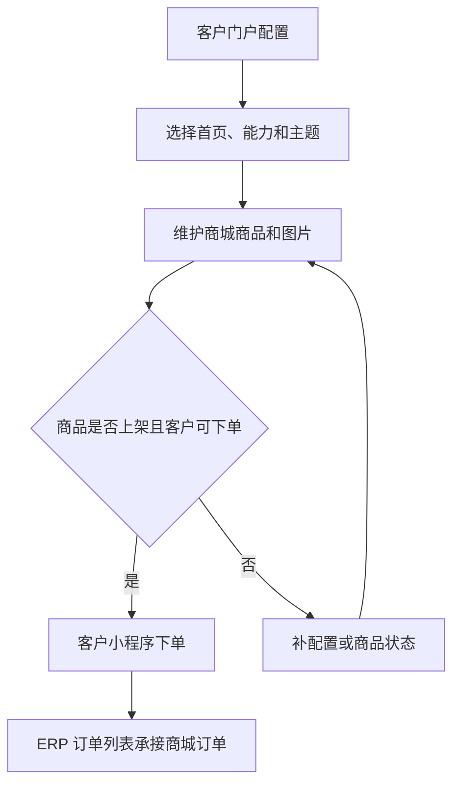

# 操作手册：客户门户与商城

## 适用范围
客户门户配置、客户门户/工作台能力、外部用户管理、小程序入口模式、小程序主题、商城能力、商城商品上架、图片上传、小程序商城下单和 ERP 订单承接。

## 入口
- 工厂总览 → 客户管理：客户档案、门户客户配置、客户门户能力模板、客户履约手册。
- 客户账户模式不展示客户管理配置项、生产计划/开始生产和工作台模式手册；它只处理当前客户履约、订单、库存、SKU、豆单、BOM 和费用。
- 商品：商品档案及商品价格相关入口。
- 小程序：客户登录后的启动页、首页、订单中心、费用中心和个人中心。

## 流程图

## 标准操作
1. PR-379-CHANNEL-PORTAL-WORKBENCH-SWITCH：先在客户档案确认客户类型，并按需打开“开通客户门户/工作台”。开关关闭时客户只作为 ERP 客户存在，不进入客户门户配置默认列表、履约客户候选或客户工作台入口；开关打开后只创建或启用门户配置，不在客户档案绑定客户门户能力模板。
2. PR-381-CUSTOMER-PORTAL-TEMPLATE-BOUNDARY：客户门户配置属于工厂内部设置。进入 客户管理 → 门户客户配置，默认只显示已开通门户/工作台的客户；需要给未开通客户配置时，先点“去客户档案开通”回到客户档案打开开关，再回到门户客户配置选择客户门户能力模板。
3. 如果客户需要外部用户登录，直接在客户门户配置行的“外部用户”区域创建账号、设置密码并启用登录。外部账号关联与 ERP 工作台授权分离：零售商城等非工作台模板或尚未选择模板时也可维护账号并登录客户小程序，但不会因此获得 ERP 工作台。ERP 内部顶部“客户账户”的当前客户下拉只要求客户已启用并打开“开通客户门户/工作台”，不要求先创建外部账号、密码或能力模板；没有外部账号/密码时客户只是不能登录小程序或客户外部工作台。创建、重置密码或启停登录后系统会自动刷新顶部客户列表，不需要整页刷新。一个客户只能保留一个启用关联，同一外部用户不能 active 关联第二个客户。
4. 按客户在门户配置页选择客户门户能力模板、主题和小程序首页；渠道客户常用“渠道代发/现货下单”模板，批发客户常用代加工履约或公共 SKU 小批量代发模板，零售/电商客户可使用“零售商城客户”模板但不默认开客户工作台。
5. 点击保存配置。
   - 如果模板启用了 `customerProcessingPortal` 视图，客户门户配置摘要会显示“打开客户档案”，点击后进入该客户的客户档案抽屉，用于核对或补齐客户资料。
   - 门户客户配置不再维护“豆单展示版本”开关和“代加工仓库”。客户要使用的仓库统一到 库存管理 → 仓库库存 绑定客户；绑定后，门户客户配置只展示该客户已有的客户仓库，不能在这里改仓库归属。
6. 进入商城管理，点击新增商品。
7. 在 ERP 产品中选择已有产品，填写标题、副标题、描述、规格、售价、模板、状态和排序。
8. 右侧商城预览会随表单实时变化，确认展示后保存商品。
9. 保存后上传商品图片；图片上传成功后生成 `/assets/mall_products/...` 图片 URL。
10. 将商品状态改为上架后保存，小程序商城才展示该商品。
11. 客户打开小程序后，登录页默认展示“手机号快捷登录”；客户授权微信手机号后，若该手机号匹配已启用登录且已绑定客户门户的 ERP 渠道客户账号，可直接登录。
12. 如果客户无法授权手机号，切到“密码登录”，使用外部用户的用户名/手机号和密码登录。账号必须先在客户门户配置页创建、设置密码、启用登录并绑定到当前客户。
13. 客户登录成功后会进入首页；小程序启动页会自动判断会话，未登录时进入登录页，已登录时进入首页，避免发布版打开后只显示空白页和左上角主页图标。
14. 客户登录后底部固定显示四个大入口。普通客户为“首页、订单中心、费用中心、个人中心”；启用 `processing` 的代加工客户第二项显示“发货中心”。首页不重复展示订单和费用入口。
15. 客户进入“个人中心”后可查看当前客户、切换绑定客户、点击“切换用户”回到登录页输入另一套 ERP 账号密码，或点击“退出登录”清除本机小程序会话。
16. 客户浏览商品、选择单位、加入购物车、增减数量，填写收件人、手机号、收货地址和备注后提交订单。熟豆商品按商城规格售卖；挂耳商品可按袋或盒展示，商城价按袋维护，客户选择盒时系统按每盒袋数自动换算盒价；商城不展示或套用供应价。
17. 提交成功后，小程序提示订单号，ERP 订单列表出现来源为 `mall` 的订单。

## 小程序 ERP 账号密码登录
- 小程序登录页默认使用微信手机号快速验证组件；验证通过后，后端通过 `/api/mini/login` 的 `phone_verify` 模式换取微信手机号并匹配 ERP 渠道客户账号。
- 小程序客户入口只面向 ERP 渠道客户账号，不面向内部员工账号；内部员工即使密码正确，也不能登录客户小程序。
- 外部用户账号使用客户门户配置页维护的同一用户名/手机号和密码；小程序后端通过 `/api/mini/login/password` 校验后，只签发客户小程序 mini token，不创建内部 ERP 后台会话。
- 小程序登录 token 使用数据库最大有效期；常规访问不会因固定 7 天或 30 天到期，但退出登录、账号禁用、客户停用、绑定撤销或模板失效仍会阻止继续访问。
- 登录页密码输入框必须以掩码显示；如果开发者工具或真机上看到明文密码，先确认小程序包已更新到包含 `password` 输入属性的版本。
- 账号必须满足：员工记录启用、账号类型为渠道客户、登录未禁用、密码正确、存在 active 客户门户账号关联、绑定客户未停用且客户档案“开通客户门户/工作台”仍开启。创建、重置密码和启停登录都在客户门户配置页完成；客户模板可不暴露 ERP 工作台，登录小程序不等于获得 ERP 工作台。
- 未绑定客户门户的渠道账号会提示账号未绑定客户；禁用登录账号会提示账号暂不可登录；账号或密码错误不会暴露具体是哪一项错误。
- 需要让客户换另一个账号时，不要让客户换微信身份；进入个人中心点击“切换用户”，回到登录页后输入另一套 ERP 渠道客户账号密码。

## 客户档案开关和客户门户能力模板
- PR-379-CHANNEL-PORTAL-WORKBENCH-SWITCH：客户类型只描述业务身份，不能直接决定门户权限。客户是否出现在客户门户配置和 ERP 内部“客户账户”下拉，由客户档案“开通客户门户/工作台”开关决定；客户外部登录、客户工作台功能和履约动作，再由门户客户配置中的客户门户能力模板与外部账号绑定决定。
- PR-381-CUSTOMER-PORTAL-TEMPLATE-BOUNDARY：客户档案不需要绑定客户门户能力模板，也不会自动推荐模板。保存客户档案只会创建或启用该客户的门户配置，并写入操作日志；客户门户能力模板在门户客户配置页选择和保存。未选择能力模板时，内部员工仍可在“客户账户”选择该客户查看空客户视角；客户小程序服务页返回空页面元数据，提交代发、代加工、结算等动作仍会被能力校验拒绝。门户客户配置保存客户门户能力模板、门户启停、显示名、默认寄件人等变更时，都会写入操作日志，便于按客户追溯。关闭开关不会删除历史门户配置、订单、外部账号或操作日志，只停用门户/工作台可访问状态；再次打开后可回到门户客户配置恢复或重新选择模板。
- 客户档案编辑抽屉中，客户类型和默认订单类型支持自定义新增：在下拉框旁点击“+”，输入新类型名称后保存，系统会把新选项加入当前表单并写操作日志。客户类型的自定义值只是业务分类，不直接授予门户能力。
- 渠道客户是客户类型之一，适合代发、现货下单、平台渠道或经销商场景。渠道客户下单的终端收件人写入订单收件字段，不新增客户档案；历史收件信息从该渠道客户历史订单聚合，可在客户工作台或履约运营台下拉搜索选择。

## 客户仓库绑定
- 客户仓库的归属在 库存管理 → 仓库库存 维护，不在门户客户配置维护。
- 选择一个具体仓库后，在页面“当前仓库”摘要行右侧点击“仓库设置”，右侧抽屉会显示当前仓库和“绑定客户”。选择客户并保存会更新仓库的绑定客户，写入操作日志；清空客户后保存可解除绑定。
- 仓库未绑定客户时作为公共仓库，工厂总览可见，客户账户可按自己的业务范围看到公共仓库。仓库绑定客户后，工厂总览仍可管理该仓库，客户账户中只有被绑定客户能看到，其他客户不可见。
- 仓库绑定客户后，客户管理 → 门户客户配置 展开该客户时会显示“客户仓库”清单，包含仓库名称、编码和仓库类型。门户配置只做展示，避免同一仓库归属在多个入口被重复修改。

## 小程序底部四个入口
- 启动页负责自动分流：未登录进入登录页，已登录进入首页；如果客户反馈发布版首屏空白，只看到左上角主页图标，先确认小程序包已更新到包含启动页的版本。
- 后台配置中的 `miniapp_entry_mode` 仍保留给客户门户能力模板和兼容逻辑使用；客户侧主导航统一先进入首页，再从底部入口进入订单/发货、费用或个人中心。
- 首页保留按能力开放的客户服务，例如商城下单、现货下单、一件代发、生产工单和库存；订单/发货中心和费用中心不再作为首页卡片重复出现。
- 订单中心专门进入订单页，加载客户订单、商品明细、豆单版本、收件信息、订单金额、运费、生产/收款/发货状态、物流信息，并提供销售单和出库单 PDF 查看。订单页继续复用订单查询条件，可以按关键字、日期和状态筛选。
- 费用中心只展示 ERP 已确认并推送的代加工账单及快照明细，不显示订单应收或跳转销售订单。
- 小程序订单和账单读取 ERP `orders` 同一底层；ERP 订单失效后，小程序订单和账单默认不展示该订单。失效不可恢复，如需继续处理，ERP 只能复制为新订单。
- 个人中心入口专门放账号操作：切换当前绑定客户、切换用户、退出登录；后续个人配置也放在这里，不再放在页面顶部。

## 客户 ERP 工作台账号隔离
- PR-580-CUSTOMER-PORTAL-EXTERNAL-USER-CAPABILITY-TEMPLATE：外部账号关联与 ERP 工作台授权分离。客户门户配置中的外部用户列表读取使用 `customers.read`，创建、重置密码和启停登录使用 `customers.write`；库存类客户履约接口仍按库存权限控制。
- 非工作台或空模板客户可以创建账号、改密码并通过客户小程序密码登录，但不得进入 ERP 工作台。只有显式 ERP 工作台绑定才要求模板暴露工作台；该动作对零售商城、其他非工作台或未知模板继续返回 `ERP workbench unavailable for capability template`。
- ERP 网页端的密码登录和已存在的 ERP 登录会话都会实时检查工作台资格。密码、账号状态、绑定、员工/客户状态、门户、角色或模板工作台能力发生安全变化时，旧 ERP 会话会永久失效，恢复原配置也必须重新登录；仅修改员工姓名、客户地址、门户显示/主题或模板名称说明不会强制退出。客户小程序密码登录仍按客户门户账号规则处理，不会被误拦截。真实短信通道未接入期间，短信兼容登录只接受既有 active 内部员工的预置有效验证码，渠道客户账号请使用密码登录。
- 创建外部用户、重置密码和启停登录会在同一事务写入“客户管理 / 客户门户配置”操作日志。日志显示客户、外部用户和业务动作，但不会保存密码明文或密码哈希；保存失败或权限拒绝不会留下成功日志。
- 客户小程序中由外部账号密码或手机号授权生成的会话也会实时检查账号、active 客户关联、客户和门户状态。停用账号、替换账号、停用客户或关闭门户后，旧 token 立即失效；之后重新启用也必须重新登录，旧 token 不会自动恢复。历史 inactive 外部账号只读保留用于追溯，不能再重置密码或切换登录状态。
- 旧公开 `/api/auth/password/set` 已停用；渠道客户账号只能在本页维护。系统没有真实短信发送通道时，ERP 登录页的短信发送 fail closed 且不回显验证码；管理员的员工密码接口只维护内部员工，不能绕过本页门户门禁和客户审计。
- 代加工模板账号才会显示和提交加工工单，并且服务端只允许绑定客户具备 `processing` 能力时提交加工工单。
- 公共 SKU 小批量模板账号在工作台显示“提交订单信息”（按钮“提交订单”），不显示“提交代发信息”；只有仅开通一件代发能力（`direct_ship` 且不含 `product_order`）的客户才显示“提交代发信息”。
- “提交订单信息/提交代发信息”统一使用单收件信息 + 多行商品：一个收件人可添加多行商品、规格和数量；每行会实时展示匹配的阶梯价和行小计，底部只按商品实价汇总订单合计，客户侧不提供运费输入。
- 商品行不再手动点“新增行”：选择商品后会自动补下一条空行，并始终只保留一条空行，避免连续选商品产生多个空白行。
- 客户侧工作台不提供商品优惠、订单运费输入；如果有人手工构造请求传入 `discount_type`、`discount_value` 或 `shipping_amount`，服务端也会忽略，客户只能按实价下单。
- 客户网页版工作台底部“履约客户订单”使用 ERP 订单列表同源数据；渠道客户账号只需要模板授予 `customer_processing.read` 即可读取自己绑定客户的 `scope=fulfillment` 订单，服务端会按当前绑定账号限制客户范围，不能跨客户查看。
- 履约客户订单、ERP 订单列表和小程序订单是同一张订单的不同展示位置；ERP 将订单失效后，履约客户订单默认隐藏该订单。失效不可恢复，只能切回 ERP 订单列表“已失效/全部”复制成新订单后再展示新订单。
- 同一外部用户只能绑定一个客户，操作人员不要把一个账号给多个客户共用。
- 禁用登录的外部用户不能继续作为有效绑定；历史 active 绑定如果对应账号已禁用，会从客户工作台上下文中失效，也不会再出现在客户履约运营台选择器中。
- 客户档案停用后，即使旧小程序绑定仍为 approved，也不能继续作为小程序当前客户；小程序会切到第一个可用客户或清空当前客户，不能切换进入停用客户。
- 零售商城模板不能保存 ERP 工作台字段；如果保存客户门户能力模板时误填 ERP 权限或 ERP 视图，系统会拒绝保存，防止零售商城客户获得批发履约工作台。
- 客户门户能力模板是实时引用：客户 A 绑定模板 a 后，管理员修改模板 a 的能力、主题、小程序入口或 ERP 页面映射，客户 A 会立即按新模板展示和校验；系统不会自动生成子模板。
- 需要给新客户 B 做差异配置时，先在“客户门户能力模板”手动点击“复制模板”，只输入新模板名称；系统会自动生成安全模板 key，复制出的模板紧贴母模板下方缩进显示。模板列表默认只展开一个详情，其他模板只显示名称和说明，展开任意模板会自动收起其他详情；再修改子模板并绑定客户 B。
- 不再使用的模板应标记为“模板失效”。失效模板仍在模板设置页可见，便于排查历史引用，但不会出现在客户门户配置的可选模板中；模板失效后仍允许保存模板本身，保存按钮不能置灰或禁用。
- 如果客户当前引用了失效模板，客户门户配置页会显示“模板已失效”，保存、应用或绑定 ERP 工作台时会返回 `capability template invalid`；小程序登录或刷新上下文时会提示“客户配置已更新，请联系管理员处理”；管理员必须重新选择一个启用中的模板后保存。
- 如果页面或接口提示 `customer capability processing unavailable`，说明当前绑定客户不是代加工模板或未启用代加工能力，先回到客户门户配置核对模板和能力。
- 如果页面或接口提示 `customer capability direct_ship unavailable`，说明当前绑定客户未启用代发能力，先核对客户模板和能力后再提交。
- 如果客户门户能力模板保存或显式 ERP 工作台绑定提示 `ERP workbench unavailable for capability template`，说明该模板不允许 ERP 工作台字段或工作台授权，或历史模板键无法识别；ERP 工作台字段会被拒绝，零售商城客户不绑定 ERP 工作台账号，客户履约内部 API 也不能绕过。这个错误不用于阻止创建外部账号、重置密码或客户小程序登录。
- 如果保存客户门户配置提示 `capability template invalid` 或 `invalid request`，检查接口或导入数据里的 `capability_template_key`；非空但无法识别的模板 key 会被拒绝，不会静默改成手工能力配置。
- 如果客户门户配置页显示“未知客户门户能力模板”，说明历史 `capability_template_key` 已不在系统模板列表内；系统会在客户列表和详情接口保留原始 key 供排查，必须重新选择系统模板，或选择“请选择模板”并停用门户后再保存。
- 如果历史遗留 active ERP 工作台绑定指向零售商城或其他不暴露 ERP 工作台的模板，客户工作台会按无有效绑定拒绝进入，接口返回 `customer ERP binding not found` 或 403；运营人员应清理旧绑定或改回暴露 ERP 工作台的正确模板。
- 如果在客户档案修改客户类型，系统不会再按类型自动改写客户门户能力模板或删除历史绑定。需要变更客户能力时，先确认“开通客户门户/工作台”开关，再到门户客户配置调整客户门户能力模板，并在操作日志中核对变更记录。

## 网页版代发批次不能为空
- 网页版代发 Excel 导入与历史批次继续兼容，订单行数必须大于 0，不能提交空代发批次。
- 小程序已停止受理“新建代发批次”和地址文件导入，只保留按收件人创建一次发货申请；一次申请可包含多个商品规格。
- 如果网页版提示“订单行数必须大于 0”，先确认导入文件中确有待发订单，再重新提交批次。

## 现货下单商品可见范围
- 公共 SKU 小批量客户打开小程序“现货下单”服务页时，只能看到公共商品和当前客户自己的专属商品。
- 如果当前客户有定制 SKU，并且该定制 SKU 的 `base_product_id` 指向某个公共基础款，小程序服务页商品选择器会用定制 SKU 替代基础款；例如岩师傅维护了“兰卡拼配”替代“曲奇拼配”后，客户只选择“兰卡拼配”，不再看到基础款“曲奇拼配”。
- 客户专属商品用于定制烘焙、贴牌或客户专属报价，不能显示其他客户专属商品，也不能通过手工构造商品 ID 下单。
- 如果提交现货/代发订单时商品已下架、停用或属于其他客户，接口会按无效请求拒绝；运营人员应在 ERP 产品资料中核对商品的客户归属和可见范围。

## 小程序服务表单选择器
- 客户在小程序“一件代发”“代加工”“现货下单”服务页提交订单或加工申请时，通过商品/库存选择器选择可用项，不需要手填系统 ID。
- 一件代发商品选择器只显示当前客户绑定成品仓的可发具体 SKU；现货下单保持当前客户可见价格表范围。生产工单不再提供投入物料选择器，目标 SKU 目录与员工录单共用分类、模糊搜索和规格逻辑。
- 如果选择器为空，先检查当前客户是否有可用托管库存、是否有可见商品、商品是否启用，以及客户门户能力模板是否正确。

## 小程序履约订单后端定价
- 客户小程序“一件代发”“代加工发货”“现货下单”提交履约订单时，不允许客户手填单价，也不信任请求体里的 `unit_price`、`shipping_amount` 或优惠字段。
- 熟豆、生豆、挂耳和现货订单的单价、价格单位和豆单版本都来自当前客户可用的最新已发布商品价格表快照；订单行保存快照中的最终价、价格单位、来源价格记录、库存单位和库存换算，不再回退到商品默认价、旧商品阶梯价或客户侧提交价格。
- 如果缺少已发布价格表快照、快照里没有价格单位到库存单位的换算，或当前客户/商品没有可用价格档，后端必须拒绝提交，不写入 ERP 订单。订单金额异常时先检查商品价格管理的最终价格记录、阶梯价格方案和已发布价格表快照，不要让客户通过小程序手动改价。

## 客户专属豆单 PDF 访问范围
- 客户专属豆单 PDF 只能由归属客户访问，不能下载其他客户专属豆单。
- 官方已发布豆单可作为公共兜底访问；客户没有专属豆单时，可以查看官方已发布豆单。
- 如果小程序下载豆单 PDF 提示未找到，先核对当前 token 绑定客户、豆单 owner_type/owner_key 和发布状态。

## 豆单版本展示与更新确认
- 客户门户配置不再提供“豆单展示版本”开关。客户侧豆单展示按已发布客户专属豆单和公共兜底规则读取；如果业务需要冻结报价，应通过价格发布、订单快照和后续版本管理处理，不在门户配置里临时切换。
- 小程序 `个人中心 → 我的商品 → 商品价格表` 默认展示当前客户最新可用商品价格表；同一版本会写入本地缓存，再次打开优先显示本地内容并自动更新新版缓存。
- 客户首次按新版豆单提交现货、代发或代加工发货订单前，会弹出豆单更新提示，展示更新说明以及新增、下架、调整摘要。客户确认后会写入已读记录，同一客户同一版本不会重复提示。
- 如果客户反馈没有看到新版提示，先检查客户是否已经确认过该版本，再检查 `customer_bean_list_acknowledgements`、豆单归属和当前客户绑定。

## 客户自有销售豆单 / 客户商品价格表
- 适用场景：客户希望把工厂供货商品价格表改成自己的品牌商品价格表，分享给自己的下游客户。历史上该能力也称“客户自有销售豆单”，但小程序展示统一改为“我的商品”和“商品价格表”。该价格表只用于分享，不参与客户向工厂下单、ERP 录单、结算、费用中心或履约计价。
- 前置条件：客户门户能力模板启用 `bean_list`；工厂已经发布当前客户可见的工厂供货商品价格表；来源价格记录或阶梯价格方案允许客户转售，且来源价格单位和库存换算可以生成客户转售快照。
- 客户进入小程序 `个人中心 → 我的商品`，页面会显示“商品分类”“商品价格表”“已发布商品价格表”和“我的价格表设置”。首页不放“我的商品”主入口。
- 在“我的价格表设置”中选择来源供货价格表和可转售的来源价格方案；版本号首版默认 `V1`，后续按当前客户自己的商品价格表版本递增，来源供货版本会单独保存用于追溯。
- 客户可勾选要展示的商品，填写品牌名、说明、版本说明、统一加价、倍率加价、背景图、Logo、卡片/表格样式，并通过预设色板选择背景色/文字色，通过 1/2/3 按钮选择每行卡片数。
- 单品只保留“上新”“推荐”等标签能力；覆盖档位和单品价已下线，旧 payload 中的 label/price 覆盖会被后端忽略，不回写工厂供货豆单、来源价格记录、商品档案或订单价格。
- 点击“保存草稿”只保存客户自己的草稿；点击“发布商品价格表”（历史文档中也可称“发布销售豆单”）后，系统写入 `customer_resale` 发布快照、操作日志，并刷新“已发布商品价格表”列表。
- 发布后点击“预览 PDF”或“预览长图”生成分享文件。PDF 和长图都按版本和样式缓存；同一版本再次打开复用缓存，样式或内容变更后发布新版本再重新生成。
- 如果发布失败提示单位不一致或缺少来源价格，先核对来源工厂供货豆单是否有对应档位价格，以及所选授权模板的展示单位是否与来源价格单位匹配。系统不会用 0 元价格静默发布。

## 商城商品公共目录范围
- 商城管理只能从公共商品中选择商品并上架，不能上架客户专属商品。
- 小程序商城是面向零售商城客户的公共目录；客户专属商品用于批发定制、贴牌或客户专属报价，不能进入商城公共目录。
- 如果历史商城商品关联了客户专属商品，小程序商城会隐藏该商品，客户手工提交该商城商品 ID 也会被拒绝；运营人员应改用公共商品重新上架。

## 商城商品图片上传格式
- 商城商品图片上传只接受图片文件，支持常见 PNG、JPEG、GIF 和 WebP 图片。
- 不能上传 HTML 或脚本文件、压缩包、文档或其他非图片内容，避免公开资源 URL 被用于展示不安全内容。
- 图片文件格式不支持时接口返回无效请求；运营人员应重新导出为受支持的图片格式后再上传。
- 商城商品图片上传超过 8MB 时必须拒绝，不能截断后保存为公开商品图片。
- 图片文件过大时接口返回无效请求；运营人员应压缩图片尺寸或重新导出后再上传。
- 商城商品图片上传必须先确认商品存在；缺失商品或图片更新失败时不能留下公开孤儿资产。
- 商品不存在时接口返回无效请求，运营人员应回到商城管理列表确认商品仍存在并刷新页面后再上传。

## 生产工单库存与目标产品范围
- 代加工客户只提交目标具体 SKU、规格和数量；系统按有效 SKU BOM 或父商品 BOM 自动确定投入物料。
- 可用量汇总当前客户库存/WIP和工厂库存/WIP，优先使用客户自有物料；其他客户库存、冻结批次和已有预留不参与。任一物料不足时整张申请拒绝且零写入。
- 目标产品必须是当前客户可见且可生产的启用商品，不能使用其他客户专属产品作为成品。
- 如果页面或接口提示 `input material unavailable` 或 `target product unavailable`，先核对当前客户托管库存、库存状态、可用克重和目标产品客户归属。

## 结果校验
- 客户 A 配置商城首页后，登录直接进入商城；客户 B 保持订单处理首页不受影响。
- PR-379-CHANNEL-PORTAL-WORKBENCH-SWITCH：客户门户配置列表默认只出现已打开“开通客户门户/工作台”的客户；零售、电商、批发、渠道客户都必须先在客户档案打开开关，再在门户客户配置中绑定有效客户门户能力模板。
- PR-311-CUSTOMER-PORTAL-ACCOUNT-PROFILE：客户门户配置页直接维护外部用户；创建后能在本页看到账号名称、手机号、登录状态和绑定状态，并会刷新 ERP 顶部“客户账户”当前客户下拉，满足条件的客户可直接被选到。同一账号不能重复 active 绑定给其他客户，禁用登录的外部用户不能继续作为有效工作台绑定。
- 客户门户配置的客户门户能力模板摘要中，如果模板暴露客户侧 ERP 页面，按钮显示“打开客户档案”；点击后进入“客户档案”并打开当前客户抽屉，用于查看或补齐客户资料。
- 小程序手机号快捷登录和密码登录都只能进入手机号对应的已绑定客户；密码错误、账号停用、未绑定客户时不能登录。
- 小程序登录 token 写入最大有效期，不按固定 7 天或 30 天自动过期；退出、账号禁用或绑定失效后仍不能继续访问。
- 零售商城客户模板不会开放 ERP 工作台绑定，只保留小程序商城、商城下单和我的订单闭环。
- 关闭“开通客户门户/工作台”后，旧 ERP 工作台绑定不删除但不可再访问；重新打开并在门户客户配置中选择暴露 ERP 工作台或下单能力的模板后，客户才能恢复进入工作台。
- 零售商城模板不能保存 ERP 工作台字段，误填 ERP 权限或视图时会被拒绝。
- 代加工客户账号能看到加工工单和代发入口；公共 SKU 小批量客户账号看到“提交订单信息”入口，不能提交加工工单；仅一件代发客户看到“提交代发信息”入口。
- 客户工作台提交订单信息时支持“一个收件信息多行商品”；每行显示阶梯价标签并实时更新小计，订单合计只随商品行变化。
- 选中商品会自动新增一条空行，且页面始终只保留一条空行；不再通过“新增行”按钮追加。
- 客户工作台不提供优惠类型和运费输入；如需做优惠或运费调整，必须转到 ERP 内部录单或改单处理。
- 代发批次不能为空；订单行数必须大于 0，不能提交空代发批次。
- 小程序一件代发、代加工和现货下单表单使用可读选择器，不能要求客户手填系统 ID。
- 小程序一件代发、代加工发货和现货下单订单价格以后端计算为准，客户侧不能手填或篡改单价。
- 小程序现货/履约下单遇到挂耳商品时，产品 payload 必须包含产品类型、可售单位、每袋克重、每盒袋数和价格梯度；客户选择袋或盒后，提交请求写入销售单位、每盒袋数和每袋熟豆克重快照。
- 商城挂耳商品只展示商城售价。没有配置商城价的挂耳商品不能向客户暴露供应价，可隐藏或禁用；有商城价时按袋报价，客户选择盒下单时按每盒袋数自动换算盒价，并写入袋/盒单位快照。
- 现货下单商品可见范围只包含公共商品和当前客户专属商品，不能显示其他客户专属商品。
- 客户定制 SKU 替代公共基础款时，现货、代发和代加工目标产品选择器只显示定制 SKU，不再显示被替代的基础款。
- 客户专属豆单 PDF 只能由归属客户访问，不能下载其他客户专属豆单；官方已发布豆单可作为公共兜底访问。
- 客户门户配置页不再切换固定豆单版本；小程序默认展示当前客户最新可用豆单或公共兜底豆单。
- 小程序新版豆单提示只在同一客户同一版本首次下单前出现一次。
- 商城商品公共目录范围只允许公共商品，商城管理不能上架客户专属商品，小程序商城不能显示客户专属商品。
- 商城商品图片上传只接受图片文件，不能上传 HTML 或脚本文件；图片文件格式不支持时接口返回无效请求。
- 商城商品图片上传超过 8MB 时必须拒绝，不能截断后保存为公开商品图片；图片文件过大时接口返回无效请求。
- 商城商品图片上传必须先确认商品存在，缺失商品或图片更新失败时不能留下公开孤儿资产；商品不存在时接口返回无效请求。
- 生产工单只能使用当前客户可见目标产品；自动物料汇总不得使用其他客户库存。
- 小程序服务页商品选择器只提示商品使用已发布价格表，不展示默认价；客户提交现货/代发/代加工发货时，后端按已发布价格表快照中的最终价和价格单位生成 ERP 订单，缺少快照或库存换算时拒绝提交。
- 代加工客户费用中心只展示当前客户已确认推送的代加工账单及明细，不能显示订单应收或其他客户工单、费用和金额。
- 小程序登录页只显示 ERP 账号密码登录，不再展示微信一键登录；启用登录且已绑定客户门户的外部用户可登录，内部员工账号和未绑定账号不能登录。
- 小程序启动页不会停留在空白页。代加工客户底栏为“首页、发货中心、费用中心、个人中心”；发货中心只看包裹和物流，费用中心只看已推送代加工账单。其他客户继续显示普通订单中心。
- 小程序订单明细和履约客户订单明细读取 ERP 同一 `order_items` 数据；商品行会显示保存订单时记录的豆单版本号，便于客户和运营核对价格来源。
- 同一小程序用户绑定多个客户时，切换当前客户后，“我的订单”只能显示切换后的客户订单，不能显示切换前客户的订单号、商品或金额。
- 停用客户不会出现在小程序当前客户 bindings 中，也不能通过旧绑定切换进入；原当前客户被停用后会切到第一个可用客户或清空。
- 未启用商城下单能力的客户无法访问商城数据。
- 商城管理上传图片后，小程序可正常展示。
- 小程序购物车数量和 ERP 订单明细一致；同一个挂耳商品按袋和按盒加入购物车时应分成两行，盒价按袋价乘以每盒袋数。
- 商城客户从底部“订单”进入订单记录，查看已提交商城订单记录。
- 挂耳商城订单进入 ERP 后，订单明细显示袋/盒单位和商城价来源；履约挂耳订单进入 ERP 后，订单明细显示供应价来源，不混用两套价格。
- 商城订单进入 ERP 订单列表后，可沿用现有生产、发货、销售单和财务流程。
- 订单失效后，履约客户订单、小程序订单和小程序账单默认都不展示该订单；ERP 支持单条和批量失效，订单列表表头“失效”总复选框只选择当前页正常订单；不能恢复已失效订单，只能复制成新订单后让三处展示新订单。

## 常见问题
- 客户打开发布版小程序后空白，只看到左上角主页图标：确认小程序包已更新到包含启动页和底部四入口的版本；新包会自动把未登录用户送到登录页，把已登录用户送到首页。
- 客户找不到订单记录入口：确认小程序已更新到底部四入口版本；订单统一从底部“订单”进入，不再依赖商城页或首页顶部按钮。
- 客户门户配置找不到客户：检查客户档案是否启用、是否打开“开通客户门户/工作台”；未开通客户不出现在默认列表，需要从客户档案开通。客户已出现但不能进入工作台时，再检查门户配置里是否保存了有效客户门户能力模板。
- 小程序手机号快捷登录失败：检查微信小程序是否配置 `WECHAT_MINI_APP_ID` 和 `WECHAT_MINI_APP_SECRET`，并确认授权手机号对应的渠道客户 ERP 账号已启用登录且已绑定客户。
- 小程序密码登录失败：检查手机号是否属于已启用登录的外部用户、密码是否正确、账号是否被停用、客户是否仍有 active 绑定。
- 客户门户配置页找不到外部用户区域：先确认当前行已经展开，并且客户档案已打开“开通客户门户/工作台”；外部用户维护入口就在已开通客户行内，不再跳转到客户履约运营台。
- 外部用户创建失败：先检查手机号是否被内部员工账号占用，或该手机号是否已经 active 绑定到其他客户；同一外部用户不能同时服务两个客户。
- 关闭客户门户/工作台后客户仍看到履约工作台：刷新客户上下文并检查客户档案 `portal_enabled`、`customer_portal_profiles.enabled` 和门户配置中的当前客户门户能力模板；开关关闭时即使历史绑定仍为 active，也不能继续进入工作台。
- 保存零售商城模板提示 ERP 工作台不可用：移除模板中的 ERP 权限和 ERP 视图，零售商城客户只走小程序商城与订单记录。
- 保存客户门户配置提示模板无效：重新选择系统提供的客户门户能力模板；如果要手工配置能力，清空模板 key 后再保存。小程序提示“客户配置已更新，请联系管理员处理”时，优先检查客户绑定的客户门户能力模板是否已失效或被删除。
- 配置页显示未知客户门户能力模板且保存按钮不可用：先记录页面展示的原始模板 key，再重新选择一个系统模板；如果这条门户配置需要停用，先切到“请选择模板”并取消门户启用。
- 客户工作台提交加工或代发被拒绝：按错误中的 `customer capability ... unavailable` 回到客户门户配置检查客户门户能力模板，确认当前渠道账号绑定的是正确客户。
- 代发批次提示订单行数无效：检查小程序代发批次的订单行数，必须大于 0；如果客户只是留言或预约，请不要提交代发批次。
- 小程序表单商品或物料选择器为空：检查当前客户是否有可见商品、可用托管原料和正确客户门户能力模板；不要让客户手填产品 ID 或物料 ID 绕过选择器。
- 现货下单看到了其他客户专属商品：立即停止给客户展示，核对产品资料的 `customer_id`、可见范围和当前小程序 token 绑定客户；服务页和提交订单都必须按当前客户过滤。
- 现货下单提交后提示无效请求：检查商品是否公共商品或当前客户专属商品，其他客户专属商品不能被当前客户下单。
- 客户下载到了其他客户专属豆单 PDF：立即停止给客户展示，核对 `bean_list_publications.owner_type/owner_key`、当前小程序 token 绑定客户和发布状态；客户专属豆单 PDF 只能由归属客户访问，官方已发布豆单可作为公共兜底访问。
- 客户豆单 PDF 提示未找到：检查该豆单是否已发布、是否归属当前客户；不能下载其他客户专属豆单。
- 客户小程序一直提示豆单更新：检查确认接口是否成功写入 `customer_bean_list_acknowledgements`，以及客户是否切换到了另一个未确认该版本的绑定客户。
- 履约客户看不到旧豆单：先确认该客户是否确实需要旧版报价。门户配置不再切换固定版本；如需追溯历史报价，查看订单快照或已发布价格版本。
- 商城管理看不到某个商品：检查该商品是否为客户专属商品；商城公共目录只能上架公共商品，客户专属商品应走客户门户现货下单或客户豆单。
- 小程序商城出现客户专属商品：立即下架对应商城商品，核对产品可见范围；商城页和商城下单接口都必须拒绝客户专属商品。
- 商城挂耳商品显示了供应价：立即下架该商城商品并检查商城价配置。商城只允许展示商城售价，未配置商城价时不能把挂耳供应价返回给小程序；配置后按袋报价，盒下单自动按每盒袋数换算。
- 小程序挂耳下单提示缺少价格或单位：检查挂耳产品是否已发布对应价格、商城商品是否配置商城价、以及小程序包是否已更新到支持袋/盒单位的版本。
- 商城商品图片上传失败：检查是否为 PNG、JPEG、GIF 或 WebP 图片；不能上传 HTML 或脚本文件，图片文件格式不支持时接口返回无效请求。
- 商城商品图片过大：商城商品图片上传超过 8MB 时必须拒绝，不能截断后保存为公开商品图片；压缩后重新上传，图片文件过大时接口返回无效请求。
- 商城商品图片提示无效请求：检查商城商品是否仍存在，商品不存在时接口返回无效请求；缺失商品或图片更新失败时不能留下公开孤儿资产，应刷新商城管理列表后重新选择商品上传。
- 生产工单提示物料不足：按试算逐项核对客户库存/WIP、工厂库存/WIP、冻结批次和已有预留；不能用其他客户库存补缺。
- 生产工单提示目标产品不可用：检查目标 SKU 是否启用、当前客户是否可见，以及是否存在有效 SKU/父商品 BOM。
- 公共 SKU 小批量熟豆订单单价异常偏高：检查客户是否使用可下单的能力模板，并确认已发布商品价格表快照包含对应价格档、价格单位和库存换算；缺少快照或换算时应拒绝提交，不得回退产品默认价。
- 生豆履约订单单价异常：检查是否已发布对应商品价格表快照，商品是否出现在价格表版本中，快照是否固化最终价、价格单位、来源价格记录和库存换算。
- 客户小程序订单单价异常偏低：检查是否有人构造请求传入 `unit_price`、`shipping_amount` 或优惠字段；后端必须忽略这些客户侧价格字段并按已发布商品价格表快照重算，若仍异常，核对商品价格管理最终价格记录、阶梯价格方案和已发布价格表快照。
- 结算服务页出现其他客户数据：立即停止给客户展示，核对当前小程序 token 绑定客户、客户门户能力和后台结算数据的 `customer_id`，费用明细和结算单必须按当前客户隔离。
- 代加工账单页为空：先确认 ERP 已对当前客户的已完工真实工单使用已发布费用模板“确认并推送”；未确认预览、普通销售订单或其他客户账单不会显示。
- 代加工账单金额不符：在 ERP 查看账单行快照的工单、计费依据、实际数量和单价；客户自有物料不应进入物料费，已确认账单不能直接重算。
- 账单页需要查看订单详情：点击订单号跳转订单页，订单页会按订单号筛选并展示收件人、商品明细、物流、销售单和出库单。
- 切换当前客户后“我的订单”仍显示切换前客户：立即停止给客户展示，核对 `/api/mini/current-customer` 是否成功、`/api/mini/me` 的 `current_customer_id` 是否已变更，并确认订单服务页按当前客户重新加载。
- 小程序订单或履约客户订单少了一单：先在 ERP 订单列表筛选“已失效/全部”，确认该订单是否已失效；已失效订单默认不展示且不可恢复，需要 ERP 复制成新订单后再让客户查看。
- 登录后总是进入 `13800138075` 或看不到切换入口：先确认客户是否仍使用旧小程序包；新包登录页只支持 ERP 账号密码，不再展示微信一键登录。再核对登录的 ERP 渠道客户账号是否绑定到了正确客户；需要换账号时进入个人中心点“切换用户”，回到登录页输入另一套用户名/手机号和密码。
- 停用客户仍能在小程序切换：立即检查客户档案 `active` 状态和 `customer_portal_user_bindings`；停用客户不能切换进入，旧 binding 应被小程序上下文过滤。
- 小程序看不到商城入口：检查商城下单能力是否启用。
- 商品不展示：检查商品状态是否为上架、图片 URL 是否可访问、客户是否具备商城能力。
- 商城订单没进 ERP：检查小程序提交返回的订单号，并在订单列表按来源或订单号搜索。
- 当前第一版不包含在线支付、优惠券、库存占用和会员营销。

## 小程序工厂商品表 / 我的商品（PR-434-MINIAPP-FACTORY-PRODUCT-TABLES-SPLIT）
- `工厂商品表` 位于小程序 `个人中心`，只读展示工厂给当前客户看的最新商品价格表；客户不能在这里改工厂价格表，也不会影响订单、结算或履约计价。
- `工厂商品表` 按商品类型和价格表快照分类收起展开，价格表右侧提供 `PDF` 和 `长图` 按钮；PDF 使用系统文档菜单，长图使用微信图片预览菜单。
- `我的商品` 位于小程序 `个人中心`，用于查看客户自己发布的商品价格表版本；版本按商品类型折叠，默认只显示最新版本摘要。
- `价格表设置` 从 `我的商品` 进入，不在首屏铺满表单。客户可以从 `工厂价格表` 复制，也可以从 `我的已发布价格表` 复制。
- 从客户旧版本复制时，分类、上新/推荐标签、标红词、品牌说明和样式会复制；价格基础仍追溯原工厂 `price_source_publication_id`，避免在旧客户价格上重复加价。
- 设置页支持新增、删除、改名分类，分类可收起；商品右侧 `商品配置` 可设置 `上新`、`推荐` 和标红词。不要再给客户打开覆盖档位或单品价功能。

## 代加工客户小程序闭环（PR-581）

- 首页把“代加工”改为“生产工单”。客户只选择目标商品的具体 SKU、规格和数量，不再手工选择投入物料；系统按当前有效 `SKU BOM > 父商品 BOM` 自动试算并展示客户库存、客户 WIP、工厂库存、工厂 WIP、已有预留、缺口和最大可生产数量。任一物料不足时整张申请不能提交。
- “一件代发”只保留“新建发货”。粘贴收货信息调用 ERP 与客户档案共用的 `POST /api/customer-recipient/parse`，解析后收件人、电话和地址仍可人工修改。商品目录只来自当前客户绑定成品仓的可用库存；系统按合格批次先进先出分配，跨仓自动拆成多个包裹，但客户只提交一次申请。
- 对启用 `processing` 的客户，底部“订单中心”显示为“发货中心”，只展示收件信息、发货商品、包裹、状态和物流，不展示销售单、出库单、销售价格或普通订单应收。其他客户继续使用原订单中心。
- “我的库存”读取中央库存和批次账，按客户绑定成品仓隔离。点击商品可看 SKU、规格、生产日期、仓库、入库时间、可用/预留数量和质量状态；无法追溯生产日期的旧批次显示“历史库存，暂无生产日期”。“提交生产工单”会预填商品和规格，数量仍由客户填写。
- “费用中心”只显示 ERP 已确认并推送的代加工账单；账单明细展示关联真实工单、费用项目、计费依据、计费数量、单价和金额，不再混入订单列表。
- 个人中心的“工厂商品表”“我的商品”同时要求 `product_order` 和 `bean_list`。代加工客户未开“现货下单”时入口隐藏；商品目录与分类、豆单详情和确认、PDF/PNG、转售价格表查看与编辑等客户直达接口也同时校验两项能力，缺任一项即拒绝。员工录单与员工商品接口不套用这组客户门禁。
- 发货提交、取消、生产申请、库存预留、费用模板发布和账单确认都写操作日志；预览、列表和地址解析是只读，不写成功业务日志。

## 发货筛选与库存多选入口（PR-582）

- 适用角色：已登录并具备代加工履约、库存和生产能力的客户账号。发货中心和库存接口始终使用当前登录客户，不接受页面传入其他客户范围。
- 发货中心以目的地和收件人为主标题，支持系统当前客户名称、收件客户/公司、收件人、电话、目的地模糊搜索，以及包裹有效发货时间的快捷或自定义范围筛选。真实发货时间优先，历史物流缺失该时间时兼容首条物流录入时间；页面同时提供分页、跳页和每页条数。
- 我的库存按商品名称搜索并支持多选；点击卡片进入独立详情，勾选框只改变选择状态。单项或多项都进入同一生产工单页面，商品规格自动带入、数量由客户填写。
- 独立库存详情使用小程序原生页面栈，因此顶部返回和右滑返回有效。若库存变化后当前汇总已不存在，页面显示空态并要求返回刷新，不展示过期数量。
- 常见异常：时间筛选看不到待发货申请时先清除时间条件；搜索为空时检查关键词是否属于收件客户/公司、收件人、电话或目的地；生产页提示商品当前不可生产时，由 ERP 管理员检查商品启用/客户可见范围和有效 BOM。
