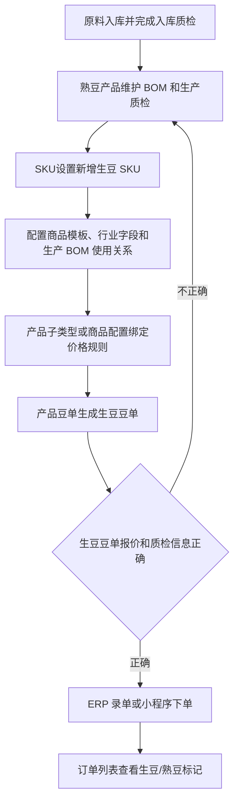

# 操作手册：生豆销售

## 适用范围
生豆产品建档、生豆豆单发布/导出、ERP 录单、小程序履约客户下单、小程序商城下单、入库质检，以及订单中生豆/熟豆识别。

## 入口
- 商品与配方：SKU设置、产品豆单、商城管理、生豆销售手册。
- 订单销售：录单、订单列表、订单详情。
- 物料管理：原料入库、原料批次、质检管理。
- 客户履约：履约运营台、客户小程序服务页。
- 小程序：商城、现货下单、一件代发或代加工发货中可见商品选择器。

## 流程图

## 标准操作
1. 原料到货后先在原料入库记录产季、产地、产家风味描述，并生成原料批次。
2. 对入库批次执行入库质检，记录工厂风味描述、水分、密度；入库质检用于仓库准入和批次追溯，不直接参与生豆豆单取价。
3. 熟豆产品按原流程维护生产 BOM，并在生产完成后录入生产质检；生豆豆单展示的质检信息按商品和生产配置读取可用的最新通过质检记录，历史生豆绑定熟豆数据仅作为兼容来源。
4. 进入 SKU设置，点击客户SKU列表右上角“新增SKU”，产品类别选择商品分类里的“生豆”；客户专属生豆不选择基础产品。
5. 商品档案列表不再维护生豆属性或绑定熟豆；旧 `green_bean_type`、`green_bean_bom_product_id` 字段只保留历史兼容。新生豆 SKU 的业务属性通过商品类型/子类型、商品档案配置抽屉里的行业字段和价格配置表达，不在列表里写死单品/拼配枚举。
6. 生豆 SKU 自身不维护独立生产 BOM；如需要说明成本或生产来源，在生产 BOM 中维护产出商品和组件关系，再从商品档案配置抽屉查看“被哪些 BOM 使用”。
7. 生豆 SKU 不填写默认价或销售价；客户 SKU 列表也不维护生豆或熟豆销售价。
8. 给生豆所属产品子类型或商品档案绑定商品配置；商品配置里选择阶梯价模板、报价单位和单位换算，产品价格表按商品配置、生产 BOM 成本快照和历史兼容数据生成 `green_bean_sale_tiers` 默认价。
9. SKU设置的客户 SKU 列表可按形态、名称、产品类型、产品子类型过滤，确认生豆和熟豆在同一列表内区分清楚。
10. 进入 产品豆单，切换到“生豆豆单”，检查报价档、成本参考、最新通过生产质检信息和 PDF 预览；需要客户定价时，在草稿中直接修改每个档位的生豆销售价。页面提示“梯度按 KG，单价按元/KG”时，按模板 KG 档位填写销售单价。
11. 发布或导出生豆豆单后，ERP 录单选择生豆产品；规格可选常用克数，也可选择“自定义克数”直接输入实际克数。录单会按该客户所选生豆豆单版本定价，缺少生豆豆单价格时必须先回产品豆单补价并生成、发布新版豆单。
12. 小程序履约客户在服务页选择当前客户可见的生豆产品并提交订单；后端按已发布生豆豆单价格计算单价。
13. 小程序商城商品仍在商城管理上架；选择生豆产品时，小程序卡片、购物车和订单承接保留生豆标记。

## 价格规则
- 生豆产品仍是普通产品的一种形态，共用 `products`、分类、梯度模板、豆单发布、录单和订单明细；商品档案列表不再展示硬编码的生豆属性枚举或绑定熟豆控件。
- 生豆 SKU 不维护直接销售价；梯度模板决定档位区间和单价单位，生豆销售价由客户在生豆豆单草稿/发布快照中按模板单位维护。KG 梯度例如 `1-59kg`、`60kg+`，单价也按元/KG。
- 生豆成本输入来自生产 BOM 成本快照和历史兼容来源；旧绑定熟豆 BOM 数据仍可用于历史生豆豆单回放，但新建/编辑商品档案不再通过列表维护这类绑定。
- 生豆豆单价格来自已发布 `green` 豆单内容，ERP 录单页面展示梯度、恢复自动价和保存订单时都按商品、规格和数量匹配对应价格档。发布快照中的 `price_unit=kg` / `price_per_kg` 是 KG 生豆订单单价来源，例如岩师傅“兰卡拼配生豆”`60kg+` 手工价 62 应显示并入单为 `62/kg`。
- 保存生豆价格只形成草稿；生成并发布新版豆单后，录单和客户下单才会使用新价格。客户豆单默认版本号会从当前客户已发布版本或复制的官方价格源版本递增一小步，例如 `V1` 到 `V1.01`。
- ERP 录单中，客户可见生豆 SKU 没有可用的已发布生豆豆单价格时，系统会拒绝保存并提示缺少生豆豆单价格；不能继承熟豆阶梯价，也不能保存 0 价。
- 生豆 SKU 与熟豆 SKU 同名时，录单商品选择器以“生豆/熟豆”标记区分；选中生豆 SKU 后展示的梯度必须来自生豆豆单快照，不来自同名熟豆 SKU。
- 熟豆价格发布不会覆盖生豆 SKU 的直接价格，因为生豆 SKU 没有直接价格字段；生豆报价随生豆豆单发布快照生效。
- 小程序商城商品的商城售价仍在商城管理维护；商城订单会保存 `product_kind=green_bean`，但不使用履约豆单价格档。

## 质检规则
- 入库质检：跟原料入库批次绑定，记录工厂风味描述、水分、密度，是入库准入和仓库追溯流程。
- 生豆豆单质检：不读入库质检；读取商品和生产配置可用的最新通过生产质检记录，历史绑定熟豆产品的质检记录保留兼容。
- 如果对应商品或历史兼容来源没有通过的生产质检，生豆豆单仍可展示产品和报价，但质检信息为空；发布前应先补齐生产质检。

## 小程序注意事项
- 履约客户和商城客户看到的生豆产品都来自 ERP 产品体系，不单独维护一套生豆商品逻辑。
- 履约客户只能看到公共商品和当前客户可见的客户专属商品；其他客户专属生豆不会泄露。
- 小程序提交履约订单时，客户侧不能传入单价覆盖；后端按已发布生豆豆单价格档计算生豆订单。
- 小程序商城需先在商城管理选择并上架生豆产品；若未上架，小程序商城不会展示。

## 结果校验
- SKU设置能新增生豆产品，商品档案列表不显示“生豆属性”或“绑定熟豆”控件，不要求选择单品/拼配或绑定熟豆，不显示默认价或生豆销售价输入。
- 客户 SKU 列表能按产品类别、名称、产品类型和产品子类型过滤；列表不提供销售价编辑列。
- 产品豆单能切换到生豆豆单，导出的 PDF 标题、报价档和最新通过生产质检信息正确。
- ERP 录单选择器、订单行和订单列表都能区分生豆/熟豆，且规格支持自定义克数。
- 客户生豆 SKU 没有已发布生豆豆单价格时，录单保存会失败并提示缺少生豆豆单价格；补齐并发布生豆豆单后，订单行仍是 `green_bean`，价格来源追溯到对应生豆豆单版本。
- 小程序履约客户能提交生豆产品订单，ERP 订单行保存 `product_kind=green_bean` 并按生豆豆单报价入单。
- 小程序商城能上架和提交生豆商品，购物车和订单承接保留产品形态。

## 常见问题
- 新增生豆失败提示需要绑定 BOM：确认是否误用了旧入口或旧 API；新版商品档案列表不应再出现生豆属性或绑定熟豆字段。历史数据需要补齐成本来源时，在生产 BOM 和商品配置里核对。
- 生豆产品价格表价格不对：检查生豆 SKU 所属产品子类型或商品配置是否绑定正确、阶梯价模板是否正确、生产 BOM 成本快照或历史兼容来源是否正确、草稿中的档位手工价是否按模板单位填写，以及是否重新生成并发布产品价格表。若发布后又看到成本参考价（如 51.75），优先核对最新发布快照里的 `green_bean_sale_tiers.price_unit` 和 `price_per_kg`。
- 录单页展示的生豆梯度不对：确认该客户已发布最新生豆豆单，并确认选择的是带“生豆”标记的 SKU；页面展示应读取已发布 `green_bean_sale_tiers`，不会读取熟豆 SKU 的 `product_price_tiers`。
- 生豆豆单没有质检信息：检查对应商品、生产 BOM 或历史兼容来源是否有最新一条通过的生产质检记录。
- 录单里找不到生豆产品：检查产品是否启用、是否属于当前客户可见范围、是否保存为生豆形态。
- 小程序履约客户看不到生豆：检查客户门户能力模板、产品可见范围和客户专属商品归属。
- 小程序商城看不到生豆：检查商城管理中是否选择对应生豆产品、商品是否上架、图片和排序是否保存。
