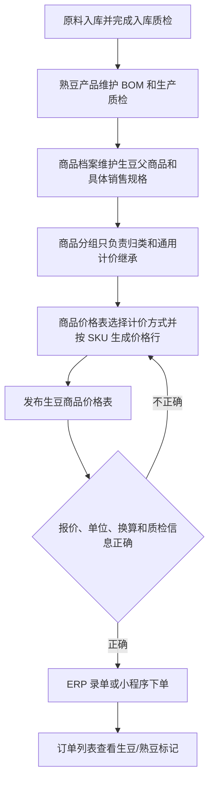

# 操作手册：生豆销售

## 适用范围
生豆产品建档、生豆商品价格表发布/导出、ERP 录单、小程序履约客户下单、小程序商城下单、入库质检，以及订单中生豆/熟豆识别。

## 入口
- 商品：商品档案、商品价格表、生豆销售手册。
- 订单销售：录单、订单列表、订单详情。
- 物料管理：原料入库、原料批次、质检管理。
- 客户履约：履约运营台、客户小程序服务页。
- 小程序：商城、现货下单、一件代发或代加工发货中可见商品选择器。

## 流程图

## 标准操作
1. 原料到货后先在原料入库记录产季、产地、产家风味描述，并生成原料批次。
2. 对入库批次执行入库质检，记录工厂风味描述、水分、密度；入库质检用于仓库准入和批次追溯，不直接参与生豆豆单取价。
3. 熟豆产品按原流程维护生产 BOM，并在生产完成后录入生产质检；生豆豆单展示的质检信息按商品和生产配置读取可用的最新通过质检记录，历史生豆绑定熟豆数据仅作为兼容来源。
4. 进入 `商品 → 商品档案` 维护生豆父商品及具体销售规格/SKU，确认商品启用、商品形态为生豆、销售单位和库存换算完整。商品档案列表不再维护生豆属性或绑定熟豆；客户对外料号或名称差异在商品档案的客户引用中维护，不复制一套客户价格主数据。
5. 在商品分组中把生豆商品归入业务需要的分类。分类只负责组织、筛选和通用计价继承，不需要也不再提供“生豆模板”挂载要求；不要为了生成生豆价格去寻找旧分类模板入口。
6. 如需按成本公式报价，在 `商品 → 商品价格管理` 维护价格计算模板；如需数量档位，在 `商品 → 商品价格表 → 管理阶梯模板` 维护阶梯模板及各档价格计算模板。
7. 进入 `商品 → 商品价格表`，选择公共或目标客户价格表归属和生豆商品类型，在“选择分类和产品”中勾选具体生豆规格。
8. 为价格表默认、任意层祖先分类或父商品设置 `按阶梯模板计算`、`按价格计算模板计算` 或 `固定价`。商品保持继承时，系统从当前分类向全部祖先逐级查找最近有效设置，再回退价格表默认。
9. 如果继承到固定价方式，商品计价只显示本层方式/模板选择；在每个已勾选具体规格行旁分别填写正数金额。分类和价格表默认只传递固定价方式，不提供一个可让所有规格共用的金额。
10. 查看平铺价格行，逐项确认商品、规格、计价来源、最终价、价格单位、库存单位和换算。缺少具体 SKU 固定价时，对应规格行应显示 `未填写固定价`；父类已有方式时不应再显示 `未设置计价方式`。
11. 预览正确后保存草稿、生成 PDF 或发布新版。只有正式发布后，ERP 录单和履约客户下单才会读取新价格；保存草稿或只看预览不会改变当前交易价。
12. ERP 录单选择生豆商品和具体规格，系统按该客户当前已发布商品价格表快照定价；缺少正数价格行、价格单位或库存换算时，回商品价格表修正并发布新版，不能保存 0 价。
13. 小程序履约客户按已发布商品价格表快照下单；小程序商城商品仍需在商城管理上架，商城卡片、购物车和订单继续保留生豆标记。

## 价格规则
- 生豆是通用商品的一种形态，共用商品档案、业务分组、价格计算模板、阶梯模板、商品价格表发布、录单和订单明细。新价格生成不依赖旧分类模板、硬编码生豆模板或绑定熟豆控件。
- 计价解析顺序为 `商品 > 当前分类 > 逐级祖先分类（由近到远） > 价格表`。计价方式、阶梯模板和价格计算模板取最近有效设置；任一级已有方式时不再提示 `未设置计价方式`。
- 固定价方式可以继承，金额不能继承。每个具体 SKU 只读取自己的 `fixed_unit_price`；227g、454g、1kg 等规格必须在各自已勾选规格行旁分别填写，缺少金额时标记 `未填写固定价`，不得用 0 元、兄弟规格金额或旧发布价补位。
- 当前可编辑配置中的旧平铺固定价只在旧键能精确解析为 `${sku_id}:fixed_price` 时一对一回填同一 SKU；已有 SKU 正数固定价优先。无法精确匹配、重复冲突或只能凭名称猜测的旧值不迁移，也不跨规格复制。
- 没有旧生豆模板不会隐藏商品、阻止平铺价格行或触发“未挂到带生豆模板的分类”。生成和发布只校验通用计价参数、具体 SKU、正数最终价、价格单位、库存单位、换算和快照完整性。
- KG 生豆可使用以 KG 为价格单位的具体 SKU 和阶梯，发布快照冻结 `price_unit`、最终价和库存换算。历史 `green_bean_sale_tiers` 中的 `price_per_kg` 继续只用于解释原 KG 快照；新单位来自商品/SKU 权威配置，不从商品名中的 `1Kg` 等文字猜测。
- 保存生豆价格表只形成草稿；生成并发布新版豆单后，录单和客户下单才会使用新价格。客户版本继续按当前归属发布和追溯。
- 生豆 SKU 与熟豆 SKU 同名时，录单商品选择器以商品形态和具体规格区分；选中生豆后只读取生豆所属的当前发布价格表行，不继承同名熟豆价格。
- 历史已发布 `green` 豆单、旧生豆阶梯、PDF、订单和财务快照保持冻结值。旧模板字段和旧生豆价档仅用于历史读取，不迁移、不重算、不回写。
- 小程序商城商品的商城售价仍在商城管理维护；商城订单会保存 `product_kind=green_bean`，但不使用履约价格表档位。

## 质检规则
- 入库质检：跟原料入库批次绑定，记录工厂风味描述、水分、密度，是入库准入和仓库追溯流程。
- 生豆豆单质检：不读入库质检；读取商品和生产配置可用的最新通过生产质检记录，历史绑定熟豆产品的质检记录保留兼容。
- 如果对应商品或历史兼容来源没有通过的生产质检，生豆豆单仍可展示产品和报价，但质检信息为空；发布前应先补齐生产质检。

## 小程序注意事项
- 履约客户和商城客户看到的生豆产品都来自 ERP 产品体系，不单独维护一套生豆商品逻辑。
- 履约客户只能看到公共商品和当前客户可见的客户专属商品；其他客户专属生豆不会泄露。
- 小程序提交履约订单时，客户侧不能传入单价覆盖；后端按当前客户已发布商品价格表中的生豆具体 SKU 价格行计算订单。
- 小程序商城需先在商城管理选择并上架生豆产品；若未上架，小程序商城不会展示。

## 结果校验
- 商品档案能维护生豆父商品和具体销售规格，商品分组不要求挂载“生豆模板”。
- 商品价格表能选择生豆的具体 SKU，并通过价格表默认、任意层祖先分类或商品计价生成正数平铺价格行。
- 继承固定价方式时每个已勾选规格行旁都有独立金额输入；父类已有计价方式时不再误报 `未设置计价方式`，缺少某规格金额时只标记该规格 `未填写固定价`。
- 生豆价格表预览和导出的 PDF 标题、报价档、规格、单位、换算和最新通过生产质检信息正确。
- ERP 录单选择器、订单行和订单列表都能区分生豆/熟豆，且规格支持自定义克数。
- 客户生豆 SKU 没有已发布正数价格时，录单保存会失败并提示缺少当前商品价格表价格；补齐并发布新版后，订单行仍是 `green_bean`，价格来源追溯到对应价格表版本。
- 小程序履约客户能提交生豆产品订单，ERP 订单行保存 `product_kind=green_bean` 并按已发布商品价格表快照入单。
- 小程序商城能上架和提交生豆商品，购物车和订单承接保留产品形态。

## 常见问题
- 看到“未挂到带生豆模板的分类”：当前流程已取消该限制。确认使用 `商品 → 商品价格表` 的通用生成入口，不要把生豆商品迁到人为增加的旧模板分类；当前分类没有旧生豆模板也应能生成。
- 父类已经设置计价方式仍提示“未设置计价方式”：在 `计价模式规则` 查看当前分类到全部祖先的路径。若已继承方式但缺固定金额或模板，按规格行 `未填写固定价`、`缺少阶梯模板` 或 `缺少价格计算模板` 处理，不要在商品行重复创建无必要覆盖。
- 选择固定价后价格仍为 0：分类和价格表默认只继承固定价方式。勾选具体规格后，在每个规格行旁分别填写正数金额；商品计价只选择或继承方式，未填规格会标记 `未填写固定价`。未完成值可以留在当前草稿，但正式发布会被阻止。
- 生豆产品价格表价格不对：检查实际生效的商品/祖先/价格表计价来源、具体 SKU 固定价或模板、价格单位、库存换算和已发布价格表快照，以及是否重新生成并发布新版。不要用商品名猜单位，也不要把兄弟规格价格互相复制。
- 生豆价格计算模板试算为 0 或提示 published BOM 没有组件：先到 `生产管理 → 生产 BOM` 检查当前发布版本和提示中的有组件草稿。系统只用已发布组件成本，不会读取草稿金额；直接销售生豆发布前还要核对商品形态为生豆、产出单位、组件比例、整体预期损耗和原料损耗。确认后由有权限人员发布新版本，再回价格试算；不要用名称、分类或旧成本汇总猜价。
- 录单页展示的生豆阶梯不对：确认该客户已发布最新商品价格表，并确认选择的是带“生豆”标记的具体 SKU；页面展示应读取当前已发布价格表快照，不会读取同名熟豆 SKU 的历史阶梯。
- 生豆豆单没有质检信息：检查对应商品、生产 BOM 或历史兼容来源是否有最新一条通过的生产质检记录。
- 录单里找不到生豆产品：检查商品是否启用、具体规格是否进入当前客户默认已发布价格表，以及是否属于当前客户可见范围；分类是否挂旧生豆模板不再是候选条件。
- 历史兼容：旧手册中的“分类挂生豆模板”或“按旧模板 KG 档位填写销售单价”只用于解释历史草稿和发布快照。新业务使用通用商品价格表；历史版本不会因本次规则调整自动重算。
- 历史文案索引：旧页面入口 `SKU设置` 和操作语句“按模板 KG 档位填写销售单价”只用于查找旧截图、旧草稿和旧验收证据，不是当前建档或定价入口。历史示例“兰卡拼配生豆”`60kg+` 手工价 62 继续按原发布快照解释为 `62/kg`，不会被本次规则重算。
- 小程序履约客户看不到生豆：检查客户门户能力模板、产品可见范围和客户专属商品归属。
- 小程序商城看不到生豆：检查商城管理中是否选择对应生豆产品、商品是否上架、图片和排序是否保存。

## 操作日志与历史边界
- 本次规则修正不新增操作日志类型。预览、继承解析和读取历史版本是只读；价格表草稿保存、发布、撤回、归档和人工调整继续沿用现有操作日志。
- 当前可编辑配置的精确旧固定价回填不是对已发布版本的数据迁移。历史价格表、旧生豆豆单、PDF、订单和财务快照保持原样；需要使用新规则时由有权限人员生成并发布新版本。
- 本手册更新不代表已部署 development 或 production，也不代表 Van 已完成业务验收。
