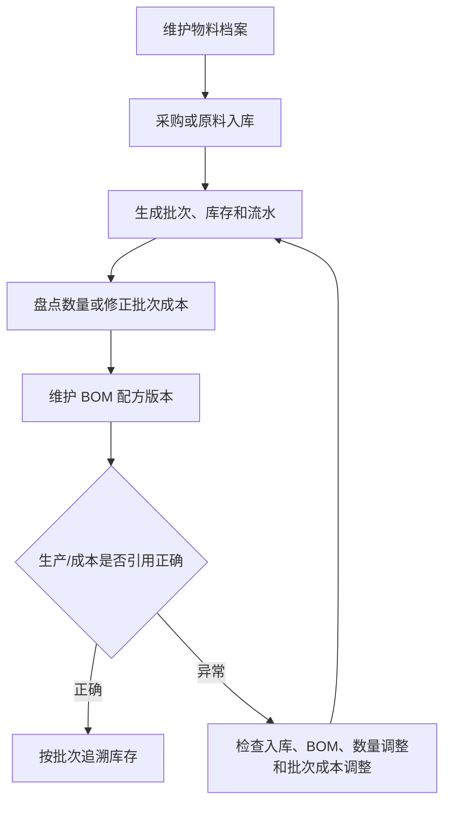

# 操作手册：物料、库存与 BOM

## 适用范围
物料档案、原料入库、原料批次、库存流水、库存批次、库存调整单、BOM 配方维护。

## 入口
- 物料管理：物料档案/库存、原料入库、原料批次、库存流水、库存批次、库存调整单、BOM 配方维护
- 商品与配方：工艺模板、行业字段模板，用于把 SKU/BOM 与制造路线和行业参数关联。

## 流程图

## 标准操作
1. 在物料档案中维护物料名称、类型、单位、默认采购价和咖啡豆信息；默认采购价只作为兜底参考，不用于直接改历史批次成本。
2. 原料到货后创建原料入库单，确认数量、单位、批次、单价、供应来源、产季、产地和产家风味描述。
3. 通过原料批次和库存批次检查批次号、剩余数量和入库来源。
4. 对原料入库批次执行入库质检，记录工厂风味描述、水分和密度；未通过或待处理批次不能当作可用合格批次直接流转。
5. 在 BOM 配方维护中设置商品所需物料、用量和启用版本。
6. 出现盘点差异或入库价格录错时，使用库存调整单，不直接改数据库，也不通过物料档案改历史库存成本。
7. 通过库存流水追踪每一次入库、出库、调整和生产消耗。
8. 物料、批次、库存流水、出库日志和分配批次等列表底部统一显示总页数、当前页、跳转页和每页条数；筛选变化后从第一页重新查询。

## 客户SKU列表
- 进入 SKU设置 后，先在页面最上方的“SKU归属”选择客户上下文；默认是公共SKU。
- PR-363-SKU-SETTINGS-WORKBENCH-LAYOUT：SKU设置页分成“商品资料”和“商品配置”两个工作区。日常拖拽分类、查看停车场和维护客户SKU列表时停留在“商品资料”；需要新增或修改阶梯价模板、商品配置模板时切到“商品配置”。
- “商品资料”工作区中，商品分类和客户SKU列表相邻展示；桌面宽度下左侧维护商品分类/停车场，右侧维护 SKU 列表，窄屏下自动上下排列。阶梯价模板和商品配置不再夹在两者中间。
- “商品配置”工作区中，默认维护商品配置模板；同级页签还包含“单位模板”和“阶梯价模板”。商品配置可绑定阶梯价模板、工序模板、价格表生成规则和单位模板。配置完成后回到“商品资料”，在产品子类型行直接用“商品配置”下拉框完成绑定。
- PR-364-SKU-SETTINGS-COMPACT-DRAWERS：商品分类区域变为固定高度滚动窗，可在搜索框输入产品类型、产品子类型或 SKU 名称快速定位；新增公共 SKU 或客户专属 SKU 时，点击客户SKU列表右上角“新增SKU”打开抽屉。
- PR-365-SKU-CATEGORY-INLINE-EDIT：产品类型和产品子类型在商品分类列表内直接维护。搜索框下方的加号新增产品类型，减号进入产品类型删除模式；点击名称直接改名。每个大类右侧上下箭头调整产品类型顺序，红色减号删除该大类。每个大类标题下方的加号新增产品子类型，减号进入子类型删除模式，子类型仍按原拖动方式排序。
- PR-367-SKU-CATEGORY-ACTION-POLISH：商品分类里的加号、减号和上下排序按钮是紧凑胶囊按钮。点击删除模式减号后，红色删除减号显示在产品类型或产品子类型行右侧；点击红色减号会直接删除分类，不再二次弹窗确认，分类下的 SKU 会回到未分类/停车场，后续可重新拖入或重新选择子类型。
- PR-368-SKU-CATEGORY-COLLAPSE-GLOBAL-UNIT：商品分类的大类和小类都可以折叠。点击加号新增产品类型或产品子类型后，页面会清空搜索、展开父级并定位到新加类目的位置，便于立刻改名或继续配置。产品子类型行不再显示“更换商品配置”按钮，因为同一行已有“商品配置”下拉框可直接选择模板。
- PR-370-UNIT-TEMPLATE-DRAWER-SKU-CATEGORY-LAYOUT：公共 SKU 的商品分类维护改为低频设置入口。进入 SKU设置 → 商品资料 后，点击 SKU 列表右上角“分类设置”打开“商品分类 · 公共SKU”抽屉，在抽屉里搜索、折叠、排序、新增或删除产品类型/产品子类型；产品类型标题和上下排序按钮在左侧，折叠/展开和删除按钮在右侧。单位模板左侧是模板列表，右侧是新增或编辑表单；在单位模板页点击“全局单位字典”可用右侧抽屉维护基础单位。
- “客户SKU列表”默认展示公共SKU，可在同一列表维护工艺参数、BOM 预期产出率、BOM 状态、BOM 入口、产品失效和最右侧备注；完整的预期损耗率在 BOM 配方维护中维护。
- 需要查看或初始化客户SKU时，在“SKU归属”里选择履约客户；选择列表来自履约客户候选，无专属 SKU 的履约客户也可以先开启公共 SKU/公共商品分类引用。
- 默认公共SKU时，点击“新增SKU”创建公共 SKU；选中履约客户后，同一个“新增SKU”按钮创建客户专属 SKU，表单使用顶部已选客户，不再重复选择客户。
- 客户专属 SKU 可按产品类别创建：定制烘焙度不选择基础产品，也不复制基础产品 BOM 或价格梯度；公共 SKU 改名才选择基础产品并可复制配置；生豆不选择基础产品，只维护生豆属性和绑定熟豆，绑定熟豆下拉只显示公共熟豆和当前客户真正自定义的熟豆；挂耳维护每袋克重和每盒袋数。非定制烘焙度的熟豆和挂耳基础产品下拉会按产品类别内部兼容出的历史形态筛选公共 SKU。
- PR-352-INSTANT-COFFEE-PRODUCT-KIND：新增公共 SKU 或客户专属 SKU 时，产品类别可选商品分类里的“速溶咖啡”。速溶咖啡无需填写烘焙度、BOM 预期产出率、生豆属性或绑定熟豆；录单会显示速溶咖啡形态，生产计划缺 BOM 时原料为速溶咖啡，并按实际规格补速溶包装盒。
- PR-354-PRODUCT-TYPE-SUBTYPE-COMPAT：SKU设置中的“产品类型”和“产品子类型”承接历史两层商品分类。现阶段 `product_kind` 仍作为兼容字段保留，系统会把熟豆、生豆、挂耳和速溶咖啡映射到默认产品类型；后续产品价格表、阶梯价和生产规则会逐步改由产品类型/产品子类型配置驱动。
- PR-362-PRODUCT-CONFIG-TEMPLATE：SKU设置 的“商品配置”是统一模板入口，配置里维护阶梯价模板、工序模板、价格表生成规则，并引用单位模板。公共配置和客户配置都是独立模板，可点“复制为客户配置”后再调整。产品子类型行直接选择商品配置，不再让用户填写 JSON，也不再在这里决定是否纳入产品价格表。
- PR-366-GLOBAL-UNIT-TEMPLATES：基础单位在 设置 → 全局设置 → 全局单位字典 维护，例如 kg、g、lb、盒、袋、箱；SKU设置 → 商品配置 → 单位模板 维护成品库存单位、报价单位、录单单位、单位换算和整数单位。商品配置模板只选择单位模板，不直接编辑单位换算；阶梯价模板也可以引用单位模板或选择全局基础单位作为展示单位。
- PR-369-UNIT-TEMPLATE-SAVE-CREATE-UPDATE：全局单位字典不再提供“新建单位”按钮，单位模板页不再提供“新建模板”按钮。要新增基础单位或单位换算模板时，直接在空白表单填写后保存；要修改已有记录时，先点击列表中的记录，修改后保存。保存后会刷新列表并回到空白编辑状态，继续填写下一套并保存就是新增。
- PR-371-SKU-UNIT-TEMPLATE-COMPACT-ACTIONS：SKU设置顶部区域已压缩，当前归属和统计信息在一行内查看。单位模板页未选模板时，右下角按钮为“新增”；点击左侧模板进入编辑后，右下角按钮为“保存”；点击左上角“新增单位模板”会清空表单回到新增状态。全局单位字典抽屉和 设置 → 全局设置 → 全局单位字典 也采用同样交互：点击“新增基础单位”清空表单，新增时按钮显示“新增”，编辑已有单位时显示“保存”。单位模板里的库存口径显示为“成品库存单位”。
- 例子：先在 设置 → 全局设置 → 全局单位字典 新增基础单位“盒”，再到 SKU设置 → 商品配置 → 单位模板 新建“盒装200g”单位模板，选择成品库存单位 kg、报价单位盒、录单单位盒，通过“新增换算”维护 `1 盒 = 0.2 kg`，开启整数单位并保存。然后在“商品配置模板”中新建“盒装速溶配置”，选择阶梯价模板、工序模板和“盒装200g”单位模板；再到“商品分类”里找到“速溶咖啡 / 冻干速溶”，用该行的商品配置下拉框选择模板。后续生成产品价格表、录单默认单位和生产折算会读取该单位模板；已发布价格表和历史订单不会被回改。
- PR-359-PRODUCT-KIND-MIGRATION-CLEANUP：启动迁移会自动补齐熟豆、生豆、挂耳、速溶咖啡四个默认产品类型和对应默认产品子类型。只有 `product_category_id` 为空的旧 SKU 会按 `product_kind` 回填分类；已经手工归类到客户产品类型/产品子类型的 SKU 不会被覆盖。
- PR-322：在“商品分类 · 客户SKU”中打开“是否使用公共商品分类”，系统会只读引用当前公共商品分类；在“客户SKU列表 · 客户 SKU”中打开“是否使用公共SKU”，系统会只读引用当前公共 SKU；在“梯度模板”中打开“是否使用公共梯度模板”，系统会只读引用公共梯度模板。关闭开关后，对应公共模板会从当前客户视图移除，但客户自有分类和已归类客户 SKU 不会被隐藏或删除；保存开关时，仍有活跃产品子类型的客户产品类型不会被当成空公共副本清理。
- 客户需要复用公共配置后再修改时，点击公共分类的“复制为客户分类”、公共 SKU 的“复制为客户SKU”、公共梯度模板的“复制为客户模板”、公共商品配置的“复制为客户配置”，或把客户 SKU/公共 SKU 拖到公共分类中；系统会先派生客户自己的分类、SKU、梯度模板或商品配置，再允许改名、排序、维护 BOM 和绑定模板，不会直接改公共数据。只开启公共商品分类但未开启公共 SKU 时，只显示公共分类结构，不显示公共 SKU。
- PR-380-CUSTOMER-CATEGORY-PUBLIC-SKU-REFERENCE：在客户 SKU 归属下点击公共分类的“复制为客户分类”时，系统会同时开启该客户的公共 SKU 和公共商品分类引用。复制后的分类是客户自己的可编辑分类；公共 SKU 只是只读引用进来，不会生成一份客户 SKU 主档副本。公共梯度模板引用开关不随这次操作改变，之前开启就继续开启，之前关闭就保持关闭。
- 点击“公共SKU”回到公共SKU列表；客户SKU行同样支持维护备注、BOM、调整工艺参数/BOM 预期产出率或失效。列表筛选支持形态、类型、搜索关键词、产品类型和产品子类型；类型包含标准、公共 SKU 改名、定制烘焙和定制拼配，搜索可匹配商品名称、类型标签和备注。
- 客户SKU列表支持在商品名称单元格直接修改 SKU 商品名并保存。选择客户上下文时，列表会把当前客户自定义商品排在前面，再按历史订单使用次数把常用商品排前，便于录单常用 SKU 优先维护。
- 商品分类跟随当前客户上下文切换：公共SKU维护公共分类；选择客户后维护客户自己的商品分类，拖入或排序不会影响公共SKU或其他客户。拖到公共分类时，系统会自动复制公共分类路径为客户分类后再放入商品。
- 删除客户自己的商品分类后，分类内商品会回到未分类；后续可以在同一客户归属下重新新增同名分类。若新增时报 `duplicate key value violates unique constraint "product_categories_customer_parent_name_uniq"`，说明数据库索引迁移未生效，需要先让运维重新启动并执行最新 schema 迁移。若产品子类型仍有效但产品类型因历史数据被误置为 inactive，最新 schema 启动时会自动恢复父分类或把子分类迁到同名 active 父分类。
- PR-316-FORM-DRAFT-CACHE：录单、BOM配方维护、SKU设置 中新增SKU抽屉、客户专属 SKU、商品配置、分类名称和筛选页码会在本次浏览器会话内临时保留；跳转到其他功能再回来时保留未提交表单，刷新浏览器后草稿清空。
- 豆单已拆到 产品价格表；在产品价格表中把“豆单范围”切到某个履约客户后，客户自己的 SKU 会进入豆单预览和版本发布上下文。

## SKU设置中的梯度模板
- 在 SKU设置 的“梯度模板”区维护商用批发梯度模板。
- 新建模板时先选择展示单位；常用单位保留元/磅、元/kg、元/227g、元/100g、元/250g，也可选择全局基础单位中的盒、袋、箱等自定义单位。
- 每个档位都要填写区间名、最小/最大数量和利润率；数量单位跟随模板展示单位，系统后台换算为克重区间用于匹配。
- 在商品分类树的产品子类型行选择模板，保存后该分类下产品的成本试算和商用豆单预览会自动按模板生成梯度价格；客户分类选择公共梯度模板时，系统会先复制为客户模板再绑定，后续客户模板可单独改档位和利润率。也可以在梯度模板列表直接点公共模板的“复制为客户模板”，先生成客户模板后再改名和调整档位。
- 公共SKU行支持“产品级利润率覆盖”；如果某个产品只需要不同利润率，直接在客户SKU列表 · 公共SKU填写该产品覆盖值即可，系统会覆盖产品子类型梯度模板利润率。
- 如果某个产品需要不同梯度档位、展示单位或区间规则，仍要把它放到单独产品子类型并绑定对应模板；产品行只覆盖利润率，不覆盖整套梯度模板。
- 模板或分类绑定变化只影响未发布预览，正式交易价格仍需在成本核算中发布后才生效。

## BOM配置
- 进入 BOM 配方维护后，顶部“SKU归属”默认公共SKU；商品 BOM 列表和商品选择只显示公共SKU。
- 需要维护客户SKU BOM 时，在“SKU归属”里选择客户；客户如果还没有专属 SKU，先在 SKU设置 中开启公共引用或新增专属 SKU。
- 客户 SKU BOM 商品列表按当前客户自定义商品优先，其次按订单使用次数排序；客户常用的自定义或常用公共引用商品会排在前面。
- PR-347-SKU-BOM-JUMP-FOCUS-FILTER：从客户SKU列表点击“维护 BOM”跳转时，BOM 配方维护会按该商品自动切到对应客户SKU，并把商品 BOM 列表过滤到该 SKU 相关 BOM；需要查看同一归属下其他 BOM 时，点击“显示全部 BOM”。切回公共SKU会清空不属于当前归属的商品选择。
- PR-375-PROCESS-BOM-WORKORDER-SKU-MODEL：BOM 配方维护以“预期损耗率”为主。选择商品后，在顶部填写预期损耗率百分比并保存，系统会换算并显示预期产出率；底层继续兼容 `yield_rate`，所以旧成本和生产计划仍按预期产出率计算。咖啡烘焙、服装裁剪、鲜果去皮等都按同一口径维护理论损耗。
- 配方明细支持两类组件：物料组件和成品组件。物料组件可继续按“比例 %”维护旧版配方，也可选择克/袋、个/袋、个/盒等消耗单位并填写用量。
- 成品组件用于挂耳等商品引用熟豆成品；选择“成品”后从熟豆商品里选择组件，消耗单位固定为克/袋，填写每袋需要的熟豆克重，第一版不单独编辑成品规格字段。
- PR-374-COMPOSABLE-PRODUCT-PRICING / PR-375：速溶咖啡等非烘焙产品的 BOM 可以按报价单位配置，BOM 烘焙度和出品率由 SKU 自己维护。例：速溶盒装直接进货条装原料，1 条 10g，1 盒 10 条；在物料档案建“速溶咖啡条装原料”，单位“条”，默认采购价填每条成本；在成品 SKU 的 BOM 中选择该物料，消耗单位选“个/盒”，用量填 10，SKU 出品率通常设为 100%。盒子、标签等包材也用“个/盒”维护。成本核算会把这些 `个/盒`、`个/袋`、`克/袋` 用料汇总为每盒 BOM 成本，工序模板成本也会计入产品价格和生产批次成本，供产品价格表按阶梯价模板生成 `元/盒`。
- BOM 版本会保存当前组件类型、组件商品、消耗单位和用量；启用历史版本时会恢复这些组件字段。
- BOM 明细页会展示关联工艺模板数量和状态；工艺模板本身在“商品与配方 / 工艺模板”维护，发布后开工会冻结到工单，后续修改模板不会改历史工单。
- BOM 配方维护的 SKU归属、当前商品、组件表单、袋材映射表单和版本备注同样使用会话内草稿；切到其他功能再回来会恢复，刷新浏览器后清空。

## 工艺模板和行业字段
- SKU 是销售、库存、生产对象；BOM 定义物料组成和理论投入产出；工艺模板定义这个 SKU 如何制造，不替代 BOM。
- 工艺模板绑定 SKU，可选绑定 BOM 版本、行业字段模板，并维护工艺路线。工序可以是烘焙、裁剪、缝制、去皮、包装等，不限于咖啡。
- 行业字段模板维护可配置字段，例如咖啡的烘焙度、服装的布料损耗率、鲜果的去皮损耗率。保存后可被工艺模板和工序参数 JSON 引用。
- 工艺模板保存、发布、停用和行业字段模板保存、停用都写操作日志；出现模板误改时，先查操作日志，再查看工单冻结快照判断历史生产是否受影响。

## 产品和 BOM 失效
- SKU设置页支持勾选一个或多个产品后点击“失效选中产品”，也可以在单行点击“失效”。
- 产品失效后不再出现在录单、报价、成本核算等新业务候选项中；历史订单、历史豆单和历史成本记录继续保留。
- 产品失效会同步把当前 BOM 标记为 BOM失效，并把该产品当前 active BOM 版本改为 disabled；系统不会删除 BOM 明细、版本记录或历史配方。
- BOM 配方维护页的“失效当前 BOM”只把当前 BOM 状态改为“已失效”，配方明细仍可查看。
- 如果需要恢复，重新保存预期损耗率、保存配方项或启用历史版本，BOM 会恢复为有效状态。

## 采购入库
- 先维护供应商名称、联系人、电话和地址；同名供应商会更新资料并保持启用。
- 创建采购单时选择供应商和物料，填写采购数量、单价和备注。
- 对待收货采购单执行收货入库后，系统调用原料入库能力生成原料批次、库存批次、原料仓库存和库存流水。
- 收货成功后，本次单价写入入库批次成本；后续成本核算优先按当前可用批次加权平均成本计算。物料档案默认采购价只是没有可用批次或补录未填成本时的兜底参考。

## 原料入库与入库质检
- 原料入库必须补齐产季、产地、产家风味描述；这些信息会随入库批次和库存批次追溯。
- 入库质检沿用生产质检流程中的质检记录能力，质检对象选择原料/生豆批次。
- 入库质检需记录工厂风味描述、水分和密度；这些字段用于仓库准入、追溯和后续批次判断。
- 入库质检不参与生豆销售豆单取数；生豆销售豆单的质检展示统一取生豆 SKU 绑定熟豆 BOM 对应产品的最新通过生产质检。

## 库存作业
- 原料入库、WIP 领退/转仓、成品转仓都在库存作业内处理，物料或成品选择框支持名称/编号模糊搜索。
- WIP 在制仓只表示已领到现场但未消耗的原料；生产完工时才扣 WIP。
- 盘点差异必须走库存调整单，不能直接改数据库。
- 库存调整单的“库存数量”用于把某个物料或成品库存调整到盘点目标数；原料数量补录可以填写补录成本/千克，未填写时使用物料默认采购价生成补录批次。提交后会生成库存调整单、库存流水和操作日志。
- 库存调整单的“批次成本”用于修正已入库原料批次的单位成本：先选物料，再选当前可用批次，填写目标成本/千克和原因后提交。系统只更新该批次成本并记录调整前成本、调整后成本和价值变化，库存数量不变；操作日志中可按“库存调整单”查到旧成本、新成本和批次号。
- 当前成本核算使用可用批次加权平均成本，公式是 `Σ(批次当前可用克重 × 批次单位成本) ÷ Σ(批次当前可用克重)`；待处理或不通过批次不参与可用库存成本。

## 结果校验
- 入库后物料库存、原料批次和库存流水同步增加。
- 原料批次能看到产季、产地和产家风味描述；入库质检能记录工厂风味描述、水分和密度。
- 入库单价能在原料批次和库存批次中看到，后续修正通过批次成本调整单留痕。
- BOM 启用版本后，生产和成本核算使用正确配方。
- 工艺模板发布后，新开工单能在生产工单页看到冻结的模板名和工序路线。
- 产品失效后新业务候选项不再出现该产品；BOM失效后配方明细仍在，状态显示为“已失效”。
- 库存调整后有调整单、流水和操作日志证据。
- 批次成本调整后库存数量不变，但批次成本、调整前后成本、价值变化和操作日志可追溯。
- 批次记录能追溯到入库、生产消耗或调整来源。
- 库存相关列表都能显示总页数、当前页、跳转页和每页条数，翻页后仍保持当前筛选条件。

## 常见问题
- 物料库存不对：先查库存流水，再查入库单、生产扣料和调整单。
- 咖啡豆信息缺失：在物料档案中进入咖啡豆信息设置，补充风味、产地、处理法等字段。
- 入库质检信息缺失：进入质检管理，按原料/生豆批次补录工厂风味描述、水分和密度；不要把入库质检误当作生豆豆单质检来源。
- BOM 成本不对：检查 BOM 版本是否启用、当前可用批次成本是否正确、是否有待处理/不通过批次被排除、成本参数是否正确。
- 入库价格录错：不要改物料档案采购价；到库存调整单选择“批次成本”，修正对应原料批次的目标成本/千克。
- 成本核算提示 BOM已失效：回到 BOM 配方维护，确认是否重新启用历史版本、保存配方或继续让该产品保持失效。
- 批次无法追溯：检查入库时是否生成批次号，生产完成时是否写入消耗日志。
