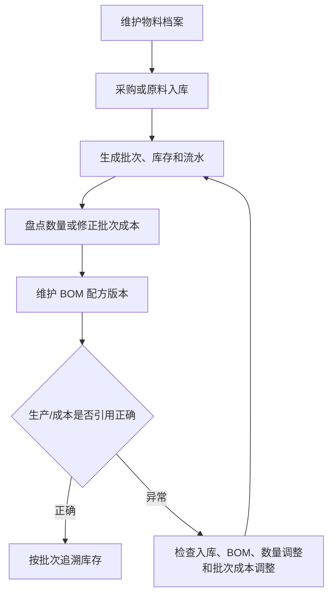

# 操作手册：物料、库存与 BOM

## 适用范围
物料档案、原料入库、原料批次、库存流水、库存批次、库存调整单、商品档案、客户商品名、商品配置模板、生产 BOM 配方库。

## 入口
- 库存管理：物料档案/库存、原料入库、原料批次、库存流水、库存批次、库存调整单。
- 商品与配方：商品档案、客户商品名、商品配置和分类模板、阶梯价模板、单位模板、商品价格表、行业字段模板。
- 生产管理：生产 BOM、工艺模板、生产计划、生产中、生产工单、工序卡、生产日志和生产成本。
- 生产管理：工艺路线/工艺模板和工序卡，用于把商品生产配置中的路线冻结到工单。

## 流程图

## 标准操作
1. 在物料档案中维护物料名称、类型、单位、默认采购价和咖啡豆信息；默认采购价只作为兜底参考，不用于直接改历史批次成本。
2. 原料到货后创建原料入库单，确认数量、单位、批次、单价、供应来源、产季、产地和产家风味描述。
3. 通过原料批次和库存批次检查批次号、剩余数量和入库来源。
4. 对原料入库批次执行入库质检，记录工厂风味描述、水分和密度；未通过或待处理批次不能当作可用合格批次直接流转。
5. 在 BOM 配方维护中设置商品所需物料、用量和启用版本。
6. 出现盘点差异或入库价格录错时，使用库存调整单，不直接改数据库，也不通过物料档案改历史库存成本。
7. 通过库存流水追踪每一次入库、出库、调整和生产消耗。
8. 物料、批次、库存流水、出库日志和分配批次等列表底部统一显示总页数、当前页、跳转页和每页条数；筛选变化后从第一页重新查询。

## 商品管理与商品档案
- PR-397-PRODUCT-CLASSIFICATION-INDUSTRY-FIELDS：商品与配方菜单保持独立入口：`商品档案`、`客户商品名`、`商品配置和分类模板`、`阶梯价模板`、`单位模板`、`商品价格表`、`行业字段模板`；`生产 BOM` 已移动到生产管理。旧手册中“商品管理”表示历史聚合入口；新操作时按这些独立入口进入。
- `商品档案` 是库存、成本、生产、成品批次和生产配置对象。列表第一业务列是商品名；商品名本身就是配置入口，默认不在表格内编辑，点击商品名打开“商品档案配置”抽屉。
- `商品档案配置` 抽屉同屏维护基础信息、商品配置模板、生产 BOM 版本、工艺路线、预期损耗率和行业字段模板，并提供“维护当前 BOM 明细”入口跳到生产 BOM 配方库。PR-409 后，生产 BOM 选择器只列出启用 BOM，支持按 BOM 编号或名称模糊搜索，选项同时显示 BOM 编号、名称和最新版本号；选择 BOM 后默认取最新已发布版本。商品档案本身不再选择分类模板；分类模板只作为列表页启用的分类视图。预期产出率不再作为用户维护字段；系统内部需要时按 `1 - 预期损耗率` 换算。
- PR-406-BOM-PRODUCT-ALIAS-LAYOUT：分类模板是商品档案列表和客户商品名列表的页面级分类视图，不是对象字段。商品档案页固定有“全部商品”“未分类商品”Tab；客户商品名页固定有“全部客户商品”“未分类客户商品”Tab。分类 Tab 行右侧有两个可搜索下拉：`增加分类` 只列出尚未启用的分类模板，选择后确认新增一个大类 Tab；`移动到分类` 用于移动已勾选对象，选择后确认执行，移动会直接覆盖旧归类。未勾选商品时移动下拉不可用或提示先勾选。
- 客户商品名页顶部提供客户选择、搜索、启用/停用/全部过滤、`新建客户商品` 和 `批量失效`，这些过滤对所有 Tab 生效。分类模板编辑时，保存/删除模板在右侧编辑区底部，分类项的阶梯价模板和单位模板并排；删除分类项后，该分类下对象回到该大类 Tab 的“未分类”。
- `商品配置模板` 由商品档案直接引用，不再由产品子类型/分类引用。历史分类上的模板字段只作为旧数据 fallback。分类用于归类和价格表类型展示，不承载模板规则、BOM 或客户展示名。
- `行业字段模板` 是商品生产配置字段的定义来源。PR-403 后行业字段模板页是左侧模板列表、右侧模板编辑；左侧可搜索模板名，也可按启用、停用、全部过滤。点击左侧模板名后在右侧编辑，新建模板也在右侧编辑区填写。用户不再维护“行业键”，字段定义只填写“字段键”、类型和类型右侧输入框。文本类型右侧输入框用于默认文本，可留空；下拉类型右侧输入框用空格分隔选项，不再让普通用户写 JSON。字段键同时作为显示名，单位和必填开关下线；旧数字、比例、日期、勾选等字段继续兼容读取和保存。商品档案和客户商品名列表会显示“行业字段”列；客户商品名可以填写客户侧覆盖值，用于客户报价展示，未填写时继承绑定商品档案字段值。
- `客户商品名` 只维护客户侧展示名、系统生成的客户商品编号、重命名、排序和客户侧行业字段覆盖值。单个新增和批量添加商品档案时不手工填写客户商品编号；系统自动生成并在列表展示。新建客户商品抽屉不展示“进入价格表”开关，列表仍展示该状态用于追溯和后续配置。贴牌、客户命名和客户侧分类变化优先走客户商品名，不复制 BOM，也不在客户商品层修改生产数据。PR-410 后，旧“品牌名”字段在新 UI 中表达为“重命名”：留空时使用客户商品名，填写后客户商品名列表和客户商品价格表优先显示重命名。
- `商品配置和分类模板` 只维护商品配置模板和商品分类模板。`阶梯价模板`、`单位模板` 是商品与配方下的独立菜单功能。商品配置模板可直接引用阶梯价模板和单位模板；商品分类模板和分类项也可引用阶梯价模板和单位模板，用于分类口径、价格表类型和不一致提示。实际价格/单位计算仍以商品档案引用的商品配置模板为准。
- 进入 `商品档案` 或 `客户商品名` 后，不再使用页面内 `SKU归属` 行切换范围；客户、订单等范围由顶部“当前视图”和页面自身客户选择器承接。
- PR-387-VIEW-CONTEXT：顶部“当前视图”会把客户或订单上下文带入商品管理。客户视图下默认进入“客户商品名”，用于维护客户对外展示；工厂总览下默认进入“商品档案”，用于维护真实 SKU、生产 BOM 和库存对象。
- PR-386-PRODUCT-MODEL-OVERHAUL / PR-410：用户侧把原 `SKU设置` 统一称为“商品管理”。“商品档案”是真实 SKU，用于库存、生产 BOM、成本、生产和成品批次；“客户商品名”是某客户名下的对外商品名称、编号和重命名，绑定一个商品档案。工厂自营也按一个客户-like 归属维护客户商品名，避免把销售主体拆成两套逻辑。
- PR-363-SKU-SETTINGS-WORKBENCH-LAYOUT / PR-394：商品与配方分成“商品档案”“客户商品名”“商品配置模板”等独立页面。日常维护商品档案时进入“商品档案”；需要维护分类结构时进入“商品配置模板 → 分类模板”；需要给商品或客户商品归类时，在对应列表页启用分类模板 Tab 后勾选对象并移动分类。旧拖拽分类树和旧“配置分类”抽屉不再作为新 UI 主入口。
- “商品档案”工作区不再把产品类型/产品子类型作为主列表结构。列表固定有“全部商品”，也可以启用多个分类模板形成多个商品 Tab；在某个模板 Tab 下，商品按分类项缩进展示，分类组可收起或展开。
- “商品配置和分类模板”入口只维护商品配置模板和商品分类模板。阶梯价模板、单位模板在商品与配方下是独立功能。商品配置模板可绑定阶梯价模板、工序模板、价格表生成规则和单位模板；分类模板用于维护分类项集合。配置完成后回到“商品档案”或“客户商品名”，通过“增加分类”把该模板启用为列表 Tab。
- PR-364-SKU-SETTINGS-COMPACT-DRAWERS：商品分类区域变为固定高度滚动窗，可在搜索框输入产品类型、产品子类型或商品名称快速定位；新增商品档案时，点击商品档案列表右上角“新增SKU”打开抽屉。
- PR-365-SKU-CATEGORY-INLINE-EDIT 历史兼容：旧产品类型和产品子类型曾在商品分类列表内直接维护，历史入口中点击名称直接改名，子类型仍按原拖动方式排序。PR-394 后新 UI 主流程不再把产品类型/产品子类型作为商品档案列表列或创建字段；旧字段仅用于历史数据、旧价格表和迁移 fallback。
- PR-367-SKU-CATEGORY-ACTION-POLISH：商品分类里的加号、减号和上下排序按钮是紧凑胶囊按钮。点击删除模式减号后，红色删除减号显示在产品类型或产品子类型行右侧；点击红色减号会直接删除分类，不再二次弹窗确认，分类下的 SKU 会回到未分类/停车场，后续可重新拖入或重新选择子类型。
- PR-368-SKU-CATEGORY-COLLAPSE-GLOBAL-UNIT / PR-392：商品分类的大类和小类都可以折叠。点击加号新增产品类型或产品子类型后，页面会清空搜索、展开父级并定位到新加类目的位置，便于立刻改名或继续归类。产品子类型行不再绑定商品配置模板；模板由商品档案配置抽屉选择。
- PR-370-UNIT-TEMPLATE-DRAWER-SKU-CATEGORY-LAYOUT / PR-382-SKU-UNIFIED-CREATE-COPY 历史兼容：旧商品分类树、旧“新增SKU”和旧“SKU复制”是历史口径；旧 SKU复制 批量结果曾展示“新增 X 款、覆盖 Y 款、跳过 Z 款”。旧分类树里的产品类型标题和上下排序按钮在左侧，折叠/展开和删除动作在右侧；单位模板左侧是模板列表，右侧是新增或编辑表单。新 UI 中创建商品档案只保留顶部“创建新商品档案”按钮；“复制为商品档案”会复制来源商品档案的基础信息、商品配置模板、商品生产配置、生产 BOM 绑定、工艺路线、预期损耗率和价格阶梯，并由系统生成新商品编号、自动给名称追加“复制/复制 2”。历史 SKU 复制入口已下线。
- “商品档案”列表默认展示工厂自营/公共商品档案，并展示稳定商品编号；有 `product_code` 时显示该编号，没有显式编号时显示 `SKU-000xxx` 兼容编号。列表不再提供“生产配置 / 更换生产 BOM / 维护 BOM / BOM”等重复按钮；点击商品名进入配置抽屉。生产 BOM、工艺路线、预期损耗率、商品配置模板和行业字段都在抽屉内维护；需要编辑配方明细时点击“维护当前 BOM 明细”进入生产 BOM 配方库。列表中还可维护产品级利润率覆盖、产品失效和备注。
- 需要为某个客户准备销售展示时，优先在“客户商品名”中绑定已有商品档案，只改客户对外名称、重命名和排序；客户商品编号由系统生成，客户侧分类在客户商品名页启用的分类模板 Tab 中归类。客户如果只需要不同报价档位或报价单位，可在客户商品名上覆盖阶梯价模板和单位模板，不需要复制商品档案或 BOM。客户想批量使用商品档案时，点击过滤行右侧“新建客户商品”打开抽屉，再切到“批量添加商品档案”模式，在商品列表顶部按名称或编号搜索、多选后创建；已存在同客户同商品档案的客户商品名会跳过。只有配方、包装、库存对象、生产方式或成本口径变化时才创建新商品档案。
- 新增商品档案表单只填写名称、备注等基础信息，不再选择分类模板、产品类型或产品子类型；也不把“贴牌”“受托加工”写成底层 SKU 类型。新增成功后系统会自动打开该商品的“商品档案配置”抽屉，便于立刻选择商品配置模板、生产 BOM、工艺路线和行业字段；后续也可在列表点击商品名再次进入配置。新增后如需归类，在商品档案列表启用对应分类模板 Tab 并移动到分类。
- PR-352-INSTANT-COFFEE-PRODUCT-KIND：新增公共 SKU 或客户专属 SKU 时，产品类别可选商品分类里的“速溶咖啡”。速溶咖啡新增表单无需填写烘焙度、损耗率、生豆属性或绑定熟豆；需要损耗率和产品信息字段时，后续点击商品名打开商品档案配置抽屉维护。录单会显示速溶咖啡形态，生产计划缺 BOM 时原料为速溶咖啡，并按实际规格补速溶包装盒。
- PR-354-PRODUCT-TYPE-SUBTYPE-COMPAT：商品管理中的“产品类型”和“产品子类型”承接历史两层商品分类。现阶段 `product_kind` 仍作为兼容字段保留，系统会把熟豆、生豆、挂耳和速溶咖啡映射到默认产品类型；后续产品价格表、阶梯价和生产规则会逐步改由产品类型/产品子类型配置驱动。
- PR-392：商品配置模板由商品档案选择引用，产品子类型/分类不再显示商品配置模板下拉。商品配置模板仍维护阶梯价模板、工序模板、价格表生成规则，并引用单位模板；公共配置和客户配置都是独立模板，可点“复制为客户配置”后再调整。是否进入产品价格表由客户商品名和产品价格表页面决定。
- PR-366-GLOBAL-UNIT-TEMPLATES：基础单位在 设置 → 全局设置 → 全局单位字典 维护，例如 kg、g、lb、盒、袋、箱；商品管理 → 商品配置 → 单位模板 维护成品库存单位、报价单位、录单单位、单位换算和整数单位。商品配置模板只选择单位模板，不直接编辑单位换算；阶梯价模板也可以引用单位模板或选择全局基础单位作为展示单位。
- PR-369-UNIT-TEMPLATE-SAVE-CREATE-UPDATE：全局单位字典不再提供“新建单位”按钮，单位模板页不再提供“新建模板”按钮。要新增基础单位或单位换算模板时，直接在空白表单填写后保存；要修改已有记录时，先点击列表中的记录，修改后保存。保存后会刷新列表并回到空白编辑状态，继续填写下一套并保存就是新增。
- PR-371-SKU-UNIT-TEMPLATE-COMPACT-ACTIONS：商品管理顶部区域已压缩，当前归属和统计信息在一行内查看。单位模板页未选模板时，右下角按钮为“新增”；点击左侧模板进入编辑后，右下角按钮为“保存”；点击左上角“新增单位模板”会清空表单回到新增状态。全局单位字典抽屉和 设置 → 全局设置 → 全局单位字典 也采用同样交互：点击“新增基础单位”清空表单，新增时按钮显示“新增”，编辑已有单位时显示“保存”。单位模板里的库存口径显示为“成品库存单位”。
- 例子：先在 设置 → 全局设置 → 全局单位字典 新增基础单位“盒”，再到 商品配置模板 → 单位模板 新建“盒装200g”单位模板，选择成品库存单位 kg、报价单位盒、录单单位盒，通过“新增换算”维护 `1 盒 = 0.2 kg`，开启整数单位并保存。然后在“商品配置模板”中新建“盒装速溶配置”，选择阶梯价模板、工序模板和“盒装200g”单位模板；再到“商品档案”点击“冻干速溶 200g 盒装”的商品名，在配置抽屉中选择该商品配置模板。后续生成产品价格表、录单默认单位和生产折算会读取该单位模板；已发布价格表和历史订单不会被回改。
- PR-359-PRODUCT-KIND-MIGRATION-CLEANUP：启动迁移会自动补齐熟豆、生豆、挂耳、速溶咖啡四个默认产品类型和对应默认产品子类型。只有 `product_category_id` 为空的旧 SKU 会按 `product_kind` 回填分类；已经手工归类到客户产品类型/产品子类型的 SKU 不会被覆盖。
- 客户需要复用工厂或其他客户的商品时，优先创建“客户商品名”并绑定已有商品档案。贴牌只改客户展示名、编号、重命名或分类时，不复制生产 BOM；客户专属包装、客户改配方、受托加工/客户来料等改变生产定义的场景，才创建新商品档案并维护自己的生产 BOM。
- PR-396 / PR-405：历史“SKU复制”入口已下线；新模型不再向用户解释“继承/锁定/派生 BOM”。如果只是客户展示差异，应创建客户商品名并绑定已有商品档案；如果确实需要新的库存、包装、配方或成本口径，则使用“复制为商品档案”或“创建新商品档案”，再在生产 BOM 配方库中选择、复制或新建 BOM 后绑定一个已发布版本。商品状态只表达“启用/停用”；生产 BOM 可以直接失效，商品档案读取到失效 BOM 时会提示用户处理。
- PR-321/PR-322：客户自有分类和已归类客户商品不会被隐藏或删除；产品子类型仍有效但父级误失效时，schema 修复会自动恢复父分类或迁移到同名 active 父分类。通过 商品管理 停用商品档案时，对应 active BOM 版本同步置为 disabled，历史 BOM 明细继续保留。
- 点击“公共SKU”回到公共SKU列表；客户SKU行同样可通过商品名进入商品档案配置抽屉维护备注、生产 BOM、生产配置或失效。列表筛选以商品名称、商品编号、历史兼容类型标签和备注为主；搜索可匹配商品名称、商品编号、历史兼容类型标签和备注。产品类型/产品子类型只作为历史兼容字段保留。
- 商品名称不再在列表单元格内直接编辑；需要改商品档案名称时点击商品名打开配置抽屉，在基础信息中修改并保存。
- 商品分类主流程改为分类模板 Tab。分类模板是全局结构，不归属客户；商品档案页和客户商品名页分别选择启用哪些模板。新增、改名、删除、排序分类项在“商品配置模板 → 分类模板”完成；商品档案/客户商品名加入或移出分类在对应列表的当前模板 Tab 工具区完成。
- 删除分类项后，该模板 Tab 下原属于该分类的对象回到“未分类”；移除某个页面对分类模板的使用，不删除商品、客户商品名或分类模板。旧 `product_categories` 分类树和客户公共分类开关只作为历史兼容，价格表、录单、成本和生产计划优先读取新分类模板归属。
- 客户上下文历史兼容：删除客户自己的商品分类后，旧分类树里的商品会回到未分类；重新新增同名分类时不得触发 `product_categories_customer_parent_name_uniq`。PR-394 后新 UI 主流程改用页面级分类模板 Tab，但旧分类树、客户自己的商品分类和 schema 修复仍保留兼容历史数据；历史 schema 修复会自动恢复父分类或把子分类迁到同名 active 父分类。
- PR-316-FORM-DRAFT-CACHE：录单、BOM配方维护、商品管理中新增商品档案抽屉、商品配置、分类名称和筛选页码会在本次浏览器会话内临时保留；跳转到其他功能再回来时保留未提交表单，刷新浏览器后草稿清空。
- 价格表已拆到 产品价格表；在产品价格表中把“价格表归属”切到某个履约客户后，该客户启用并纳入价格表的客户商品名会进入预览和版本发布上下文。

### 客户商品名工作区
- 入口：商品与配方 → 客户商品名。
- 先选择客户；工厂自己的自营品牌也选择内置“工厂自营”客户，不再另开一套销售主体。
- 点击过滤行右侧 `新建客户商品` 打开抽屉。在“单个新增”模式选择绑定商品档案并填写客户商品名、重命名、排序、启用状态和备注；客户商品编号由系统生成，不手工填写，抽屉内不展示“进入价格表”开关。重命名留空时使用客户商品名，填写后列表名称和客户价格表展示优先使用重命名。PR-409 后，客户商品名还可以选择客户侧阶梯价模板和单位模板，用于客户专属报价档位、规格或报价单位；不选择时继续继承绑定商品档案的商品配置模板和单位规则。客户商品名只负责客户侧展示、报价覆盖和销售归属，不承载库存、生产 BOM、成本或成品批次。
- 点击“保存客户商品名”后，系统写入客户商品名记录并写操作日志；后续可在同一表格中停用，不能在客户商品名层编辑生产数据或 BOM。
- 如果客户要批量使用已有商品档案，在同一个 `新建客户商品` 抽屉中切到“批量添加商品档案”模式，在商品列表顶部按商品名称或编号搜索，多选后一次创建客户商品名。默认客户商品名=商品档案名称，客户商品编号由系统自动生成，重命名为空；批量新增不选择产品类型、产品子类型、分类模板或“进入价格表”开关。同客户同商品档案已存在时自动跳过，并在结果里显示创建和跳过数量。实际创建的客户商品名都会写操作日志。
- 如果客户商品名绑定的商品档案已经停用，列表中的绑定商品档案会标红并提示“绑定商品已失效”。这表示该客户商品名仍可追溯，但新报价、下单或履约前需要改绑有效商品档案或停用该客户商品名。
- 客户商品名的分类配置只影响该客户商品名，不会回写商品档案归类，也不会影响其他客户。需要调整客户价格表分组时，在客户商品名页启用相同或不同的分类模板 Tab，然后在当前 Tab 中勾选客户商品并移动到分类。
- 若只是贴牌、客户命名或客户编号不同，维护客户商品名即可，不复制商品档案和生产 BOM。
- 若客户专属包装、配方、库存对象、生产方式或成本口径不同，先创建新的商品档案，再维护该商品档案的生产 BOM，最后给客户商品名绑定这个新商品档案。
- 客户商品名工作区没有 BOM 编辑入口；生产 BOM 仍在 BOM 配方维护中按商品档案维护，避免客户展示资料和制造定义混在一起。

### 历史客户 SKU 兼容
- PR-406 后，客户商品名页面不再展示“旧客户 SKU 收敛检查”。历史旧客户 SKU、历史订单、历史价格表、历史 BOM 和历史工单仍保留兼容，不自动迁移、不删除、不回改。
- 新增业务按两个入口判断：贴牌、客户命名、客户编号、客户侧分类或客户专属价格变化时，优先创建客户商品名；配方、包装、生产方式、库存对象或成本口径变化时，才创建新商品档案并维护生产 BOM。

## 商品管理中的梯度模板
- 在 商品管理 的“阶梯价模板”区维护报价阶梯模板。
- 新建模板时先选择展示单位；常用单位保留元/磅、元/kg、元/227g、元/100g、元/250g，也可选择全局基础单位中的盒、袋、箱等自定义单位。
- 每个档位都要填写区间名、最小/最大数量和利润率；数量单位跟随模板展示单位，系统后台换算为克重区间用于匹配。
- 在商品配置模板中选择阶梯价模板，保存后引用该配置的商品档案会按模板生成价格表阶梯；客户商品配置模板的阶梯价下拉可以选择公共模板和当前客户自己的模板。也可以在阶梯价模板列表直接点公共模板的“复制为客户模板”，先生成客户模板后再改名和调整档位；复制后该客户模板列表会隐藏被派生过的公共原模板，只保留客户副本用于编辑。
- 公共SKU行支持“产品级利润率覆盖”；如果某个产品只需要不同利润率，直接在客户SKU列表 · 公共SKU填写该产品覆盖值即可，系统会覆盖产品子类型梯度模板利润率。
- 如果某个产品需要不同梯度档位、展示单位或区间规则，仍要把它放到单独产品子类型并绑定对应模板；产品行只覆盖利润率，不覆盖整套梯度模板。
- 模板或分类绑定变化只影响未发布预览，正式交易价格仍需在成本核算中发布后才生效。

## BOM配置
- 入口改为“生产 BOM（配方库）”，位于“生产管理”。生产 BOM 是独立配方档案，可按 BOM 分组维护，可复制成新 BOM，也可被多个商品档案复用。
- PR-406 独立 BOM 口径：页面主列表为“生产 BOM列表”，只展示生产 BOM 配方档案本身，不再混入商品档案行，也不再提供商品列或商品过滤。分类 Tab 行左侧展示“全部分组 / 未分类 / 自定义分组”，右侧放 `新建生产 BOM`；过滤行只保留状态、BOM 名称/编号搜索和 `批量失效`。BOM 列表可单独上下滚动，右侧配方明细与列表主体对齐。
- 点击生产 BOM 名称会加载右侧配方明细；BOM 不允许出现因为“未绑定商品”而不能选中、不能复制、不能失效或不能维护配方的情况。BOM 是否被商品引用只在右侧详情的“引用商品”区展示，引用商品失效时以失效状态显示，但不改变 BOM 作为独立配方档案的维护入口。
- 操作列只保留 `复制` 和红色 `失效` 等列表级动作；点击 BOM 名称进入右侧编辑详情。复制来源 BOM 即使已失效也可以复制，新 BOM 默认启用并自动创建 `V001 草稿`，页面会打开该 BOM 并选中草稿版本，便于直接维护配方比例和物料。
- 失效 BOM 不会删除版本或配方明细。勾选 BOM 后可用“批量失效”统一失效；单行 `失效` 和批量失效都直接执行，不再弹确认框，也不因启用商品档案仍引用该 BOM 而阻断。被失效 BOM 引用的商品会在商品侧提示 BOM 已失效，用户再决定是否更换 BOM、复制 BOM 或停用商品。
- 客户商品名不产生 BOM。客户只是贴牌改名、客户编号、重命名或客户侧分类不同，直接在“客户商品名”绑定已有商品档案，不复制商品档案和生产 BOM。
- 商品档案绑定一个默认生产 BOM 版本。商品档案列表的生产 BOM 列显示 `BOM-001 配方名称 / V003`；如果绑定的不是该 BOM 最新已发布版本，会提示“当前引用 V002，最新 V003”，这只是版本提示，不再叫继承、锁定或派生。
- BOM 版本在右侧 BOM 编辑详情的 `BOM版本` 区维护。配方明细、合计比例和“保存组件”都在 `BOM版本` 区域下方，明确属于当前选中的版本。已发布版本只读，页面提示“已发布版本只读，复制为新版草稿后编辑”；需要调整配方比例或物料用量时，先在已发布版本行复制为新版草稿，编辑草稿后发布，再把商品档案绑定到该已发布版本。列表行不再单独提供 BOM版本抽屉，页面底部也不再单独摆放 BOM 版本 panel。
- PR-402 / PR-406 / PR-407：BOM 分组不再有默认分组。生产 BOM 列表固定有“全部分组”和“未分类”Tab，新增分组后会多一个自定义大组 Tab。一个 BOM 只能属于一个大组 Tab；全部分组显示所有 BOM，未分类显示 `group_id=0` 的 BOM。管理分组入口用于新增、改名、删除和排序大组；勾选 BOM 后在列表工具区选择目标大组并移动，移动会直接覆盖旧大组并清空旧组内分类；删除大组时，该组 BOM 回到未分类，不删除 BOM、不改变商品绑定。
- PR-407：只有自定义大组 Tab 下维护“组内分类”。进入某个自定义大组后，列表按组内分类分组展示，固定有虚拟小类“未分类”；可以新增、改名、删除组内分类。勾选 BOM 后选择目标小分类并点击“移动到小分类”，会直接覆盖旧小分类。删除小分类时，该分类下 BOM 回到当前大组内的“未分类”。“全部分组”和顶层“未分类”只用于查看，不维护组内分类。
- 如果看到 `Codex测试豆` 这类旧 BOM 行不能勾选，通常是旧数据有 `product_bom` 或 `product_bom_items` 明细，但还没有新生产 BOM 档案和商品绑定。PR-403 后打开生产 BOM 列表或详情时会自动把这类旧 BOM 幂等修复成生产 BOM 和 V001 已发布版本；修复后该 BOM 就可以按新模型勾选并移动分组。
- PR-389 / PR-390：BOM 不再维护预期损耗率、预期产出率或特殊属性。咖啡烘焙度、服装布料克重、鲜果成熟度等产品信息字段都在 商品档案 → 生产配置 中维护；旧 BOM 版本特殊属性和旧商品档案字段不删除，只用于历史数据 fallback。历史 PR-389 的 BOM 版本特殊属性只作为旧数据说明和兼容读取口径。
- 同配方多商品：多个商品档案可以绑定同一个生产 BOM 版本。客户商品名很多、配方很少时，优先复用 BOM，避免维护大量重复配方。
- 包装、配方、损耗或生产口径不同：复制现有 BOM 成新 BOM，保留来源快照，调整并发布后绑定到新的商品档案。
- PR-392 / PR-406：从商品档案配置抽屉点击“维护当前 BOM 明细”时，系统在 Vue/Vite 内部跳转到生产 BOM，并带上当前商品引用的 `production_bom_id`，不刷新左侧菜单，也不会丢失菜单展开定位。生产 BOM 页面本身不再按商品过滤。
- PR-390：预期损耗率在 商品档案 → 生产配置 维护，不在 BOM 配方明细中维护。咖啡烘焙、服装裁剪、鲜果去皮等都按同一口径维护理论损耗；成本和生产计划内部需要产出因子时按 `1 - 预期损耗率` 换算。
- 配方明细支持两类组件：物料组件和成品组件。物料组件可继续按“比例 %”维护旧版配方，也可选择克/袋、个/袋、个/盒等消耗单位并填写用量。比例合计按当前选中的 BOM 版本计算；切换版本时，配方明细随版本切换。
- 成品组件用于挂耳等商品引用熟豆成品；选择“成品”后从熟豆商品里选择组件，消耗单位固定为克/袋，填写每袋需要的熟豆克重，第一版不单独编辑成品规格字段。
- 从商品档案配置抽屉点击“维护当前 BOM 明细”时，系统通过 Vue/Vite 内部导航带上 `production_bom_id` 直接打开被引用的生产 BOM，不再带商品筛选，也不会刷新左侧菜单。左上角返回条用于回到商品档案配置；页面刷新后返回条消失。
- BOM 详情的“引用商品”区显示引用该 BOM 版本的商品档案商品名、商品编号和版本号。点击引用商品会跳到对应商品档案配置，商品档案左上角显示 `返回BOM编辑：{BOM 名称}`；该返回条只在本次前端跳转内有效，刷新页面后消失。
- 规格袋材映射在右侧 BOM 编辑详情的 `全局规格袋材映射` 区维护，表示该设置不是单个 BOM 专属，而是所有 BOM 共用；列表行不再单独提供规格袋材映射抽屉，页面底部也不再单独摆放规格袋材映射 panel。
- PR-374-COMPOSABLE-PRODUCT-PRICING：速溶咖啡等非烘焙产品的 BOM 可以按报价单位配置，预期损耗率和产品信息字段由商品生产配置维护。例：速溶盒装直接进货条装原料，1 条 10g，1 盒 10 条；在物料档案建“速溶咖啡条装原料”，单位“条”，默认采购价填每条成本；在 BOM 中选择该物料，消耗单位选“个/盒”，用量填 10。盒子、标签等包材也用“个/盒”维护。再到 商品档案 → 生产配置，把预期损耗率设为 0%，按需新增“条装规格”等产品信息字段并勾选价格表展示。
- BOM 版本会保存当前组件类型、组件商品、消耗单位和用量；启用历史版本时会恢复这些组件字段。
- 对只有 `V001 已发布`、物料数为 0、未被商品引用且备注仍是初始版本的新建空 BOM，系统会安全修复为 `V001 草稿`，解决“刚建 BOM 但比例无法编辑”的问题；已有物料、已被商品引用或历史使用过的已发布版本不会被回改。
- BOM 明细页会展示关联工艺模板数量和状态；工艺模板本身在“生产管理 / 工艺模板”维护，发布后开工会冻结到工单，后续修改模板不会改历史工单。
- BOM 配方维护的当前商品筛选、组件表单、袋材映射表单和版本备注使用会话内草稿；切到其他功能再回来会恢复，刷新浏览器后清空。

## 工艺模板和行业字段
- PR-390：工艺路线只定义“怎么跑这条生产步骤”，例如烘焙、裁剪、缝制、去皮、包装的顺序、工位、设备、工时、是否记录损耗和质检项。烘焙度、布料克重、鲜果成熟度、预期损耗率等商品专属生产设定放在商品档案的商品生产配置，不放在路线里。
- SKU 是销售、库存、生产对象；BOM 定义物料组成和理论投入产出；工艺模板定义这个 SKU 如何制造，不替代 BOM。
- 工艺模板绑定 SKU，可选绑定 BOM 版本、行业字段模板，并维护工艺路线。工序可以是烘焙、裁剪、缝制、去皮、包装等，不限于咖啡。
- 行业字段模板维护可配置字段，例如咖啡的烘焙度、服装的布料损耗率、鲜果的去皮损耗率。保存后主要在商品档案配置抽屉中选择使用，字段以普通表单展示和保存；旧工艺模板字段保留兼容历史数据。
- 工艺模板保存、发布、停用和行业字段模板保存、停用都写操作日志；出现模板误改时，先查操作日志，再查看工单冻结快照判断历史生产是否受影响。

## 商品模型场景口径
- PR-390：BOM 只做配方库。客户商品名很多时不产生 BOM；商品档案根据需要绑定一个生产 BOM 版本和一个工艺路线。同配方多商品可以复用同一个 BOM 版本；包装、配方、损耗或成本口径不同才复制 BOM 或创建新的 BOM 版本并绑定到对应商品档案。
- 工厂自营：把工厂自己的零售或批发品牌看作一个内置客户，为它维护客户商品名、价格表和订单；商品档案和生产 BOM 仍是执行对象。
- 贴牌：客户只改对外商品名、客户商品编号、重命名或客户侧分类时，新建客户商品名并绑定已有商品档案，不复制生产 BOM。
- 客户专属价格：优先通过客户商品名纳入该客户价格表，并在商品价格表中发布客户价格快照；除非成本或生产对象不同，不新建商品档案。客户商品名填写重命名后，客户价格表优先展示重命名。
- 客户专属包装：包装材料、单位换算、库存对象或生产方式变化时，应创建新商品档案并维护单独生产 BOM。
- 客户改配方：配方或理论损耗不同，创建新商品档案，复制或新建生产 BOM，发布后绑定该商品档案；后续成本、生产计划和工单用绑定的生产 BOM 版本。
- 非最新版提示：一次性订单、合同约定配方或客户指定历史配方时，可让商品档案继续绑定旧的已发布版本；系统只提示“当前引用 Vxxx，最新 Vyyy”，不自动升级。工单开工后冻结当时版本快照。
- 一次性订单：如果只是一单展示名或价格差异，用客户商品名和价格快照处理；如果需要一次性配方/包装/生产方式，创建新商品档案并在备注中标记一次性用途，历史数据保留。
- 受托加工 / 客户来料：客户来料、货权、加工费和生产定义不同，应创建独立商品档案、生产 BOM 和后续工艺路线，避免把客户来料混入工厂自营库存对象。
- 服装布料损耗：商品档案可以是衣服 SKU，生产 BOM 记录布料和辅料，商品档案配置记录预期损耗率和布料参数；裁剪、缝制等工序卡记录实际布料投入、产出和损耗。
- 鲜果加工损耗：商品档案可以是果切、果泥或冻干成品，生产 BOM 记录鲜果和包材，商品档案配置记录预期去皮/挑选损耗和成熟度等参数；去皮、挑选、包装等工序卡记录实际损耗和异常原因。

## 产品和 BOM 失效
- 商品管理页支持勾选一个或多个产品后点击“失效选中产品”，也可以在单行点击“失效”。
- 产品失效后不再出现在录单、报价、成本核算等新业务候选项中；历史订单、历史豆单和历史成本记录继续保留。
- 产品失效会同步把当前 BOM 标记为 BOM失效，并把该产品当前 active BOM 版本改为 disabled；系统不会删除 BOM 明细、版本记录或历史配方。
- 生产 BOM 页不再提供独立的“失效当前 BOM”按钮。需要失效 BOM 时，在生产 BOM 列表勾选一个或多个 BOM 后点击“批量失效”，或在单行操作中点击红色“失效”；配方明细仍可查看。
- 如果需要恢复，重新保存预期损耗率、保存配方项或启用历史版本，BOM 会恢复为有效状态。

## 采购入库
- 先维护供应商名称、联系人、电话和地址；同名供应商会更新资料并保持启用。
- 创建采购单时选择供应商和物料，填写采购数量、单价和备注。
- 对待收货采购单执行收货入库后，系统调用原料入库能力生成原料批次、库存批次、原料仓库存和库存流水。
- 收货成功后，本次单价写入入库批次成本；后续成本核算优先按当前可用批次加权平均成本计算。物料档案默认采购价只是没有可用批次或补录未填成本时的兜底参考。

## 原料入库与入库质检
- 原料入库必须补齐产季、产地、产家风味描述；这些信息会随入库批次和库存批次追溯。
- 入库质检沿用生产质检流程中的质检记录能力，质检对象选择原料/生豆批次。
- 入库质检需记录工厂风味描述、水分和密度；这些字段用于仓库准入、追溯和后续批次判断。
- 入库质检不参与生豆销售豆单取数；生豆销售豆单的质检展示统一取生豆 SKU 绑定熟豆 BOM 对应产品的最新通过生产质检。

## 库存作业
- 原料入库、WIP 领退/转仓、成品转仓都在库存作业内处理，物料或成品选择框支持名称/编号模糊搜索。
- WIP 在制仓只表示已领到现场但未消耗的原料；生产完工时才扣 WIP。
- 盘点差异必须走库存调整单，不能直接改数据库。
- 库存调整单的“库存数量”用于把某个物料或成品库存调整到盘点目标数；原料数量补录可以填写补录成本/千克，未填写时使用物料默认采购价生成补录批次。提交后会生成库存调整单、库存流水和操作日志。
- 库存调整单的“批次成本”用于修正已入库原料批次的单位成本：先选物料，再选当前可用批次，填写目标成本/千克和原因后提交。系统只更新该批次成本并记录调整前成本、调整后成本和价值变化，库存数量不变；操作日志中可按“库存调整单”查到旧成本、新成本和批次号。
- 当前成本核算使用可用批次加权平均成本，公式是 `Σ(批次当前可用克重 × 批次单位成本) ÷ Σ(批次当前可用克重)`；待处理或不通过批次不参与可用库存成本。

## 仓库绑定客户
- 进入 库存管理 → 仓库库存，左侧选择一个具体仓库。
- 在“当前仓库”摘要行右侧点击“仓库设置”，右侧抽屉里选择客户并点击保存；保存后该仓库会记录绑定客户，列表显示“绑定客户：客户名”。
- 需要解除绑定时，把绑定客户清空后保存。仓库绑定或解绑属于用户触发的库存配置变更，必须能在“操作日志”中按仓库查到旧客户和新客户。
- 门户客户配置不再维护“代加工仓库”。仓库绑定客户后，客户管理 → 门户客户配置 展开对应客户时只展示该客户已绑定的客户仓库；仓库归属统一回到仓库库存页修改。绑定客户的仓库只对工厂总览和该客户账户可见，其他客户账户不会看到；未绑定客户的仓库按公共仓库处理。

## 结果校验
- 入库后物料库存、原料批次和库存流水同步增加。
- 原料批次能看到产季、产地和产家风味描述；入库质检能记录工厂风味描述、水分和密度。
- 入库单价能在原料批次和库存批次中看到，后续修正通过批次成本调整单留痕。
- BOM 启用版本后，生产和成本核算使用正确配方。
- 工艺模板发布后，新开工单能在生产工单页看到冻结的模板名和工序路线。
- 产品失效后新业务候选项不再出现该产品；BOM失效后配方明细仍在，状态显示为“已失效”。
- 库存调整后有调整单、流水和操作日志证据。
- 仓库绑定客户后，仓库库存列表显示绑定客户，门户客户配置详情显示该客户仓库；解绑后门户配置不再显示该仓库。
- 批次成本调整后库存数量不变，但批次成本、调整前后成本、价值变化和操作日志可追溯。
- 批次记录能追溯到入库、生产消耗或调整来源。
- 库存相关列表都能显示总页数、当前页、跳转页和每页条数，翻页后仍保持当前筛选条件。

## 常见问题
- 物料库存不对：先查库存流水，再查入库单、生产扣料和调整单。
- 咖啡豆信息缺失：在物料档案中进入咖啡豆信息设置，补充风味、产地、处理法等字段。
- 入库质检信息缺失：进入质检管理，按原料/生豆批次补录工厂风味描述、水分和密度；不要把入库质检误当作生豆豆单质检来源。
- BOM 成本不对：检查 BOM 版本是否启用、当前可用批次成本是否正确、是否有待处理/不通过批次被排除、成本参数是否正确。
- 入库价格录错：不要改物料档案采购价；到库存调整单选择“批次成本”，修正对应原料批次的目标成本/千克。
- 成本核算提示 BOM已失效：回到 BOM 配方维护，确认是否重新启用历史版本、保存配方或继续让该产品保持失效。
- 批次无法追溯：检查入库时是否生成批次号，生产完成时是否写入消耗日志。
- 门户客户配置看不到客户仓库：先到仓库库存确认仓库是否已绑定该客户，仓库是否启用；门户客户配置只展示绑定结果，不负责修改仓库归属。
