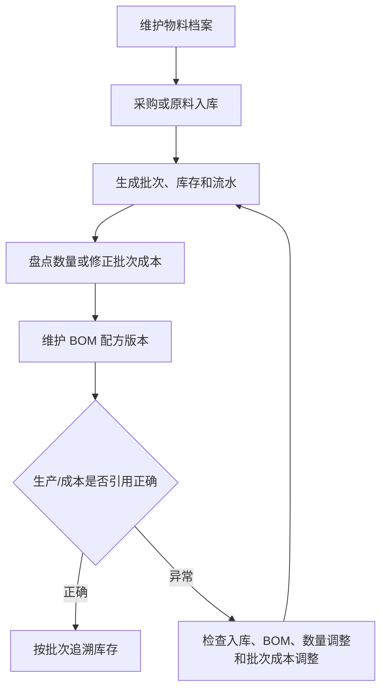

# 操作手册：物料、库存与 BOM

## 适用范围
物料档案、原料入库、原料批次、库存流水、库存批次、库存调整单、商品档案、客户商品名、商品配置模板、生产 BOM 配方库。

## 入口
- 库存管理：物料档案/库存、原料入库、原料批次、库存流水、库存批次、库存调整单。
- 商品与配方：商品档案、客户商品名、商品配置模板、生产 BOM、产品价格表、行业字段模板。
- 生产管理：工艺路线/工艺模板和工序卡，用于把商品生产配置中的路线冻结到工单。

## 流程图

## 标准操作
1. 在物料档案中维护物料名称、类型、单位、默认采购价和咖啡豆信息；默认采购价只作为兜底参考，不用于直接改历史批次成本。
2. 原料到货后创建原料入库单，确认数量、单位、批次、单价、供应来源、产季、产地和产家风味描述。
3. 通过原料批次和库存批次检查批次号、剩余数量和入库来源。
4. 对原料入库批次执行入库质检，记录工厂风味描述、水分和密度；未通过或待处理批次不能当作可用合格批次直接流转。
5. 在 BOM 配方维护中设置商品所需物料、用量和启用版本。
6. 出现盘点差异或入库价格录错时，使用库存调整单，不直接改数据库，也不通过物料档案改历史库存成本。
7. 通过库存流水追踪每一次入库、出库、调整和生产消耗。
8. 物料、批次、库存流水、出库日志和分配批次等列表底部统一显示总页数、当前页、跳转页和每页条数；筛选变化后从第一页重新查询。

## 商品管理与商品档案
- PR-390-PRODUCT-PRODUCTION-CONFIG-OVERHAUL：商品与配方菜单已拆成三个独立商品入口：`商品档案`、`客户商品名`、`商品配置模板`。旧手册中“商品管理”表示历史入口；新操作时按这三个入口分别进入。
- `商品档案` 是库存、成本、生产、成品批次和生产配置对象。右侧详情同级维护基础信息、商品生产配置、商品分类、价格/单位摘要和状态备注。
- `商品生产配置` 归属商品档案。进入 商品与配方 → 商品档案，在商品行点击“生产配置”，右侧抽屉中选择生产 BOM、BOM 已发布版本、工艺路线，维护预期损耗率和要展示到产品价格表的产品信息字段。预期产出率不再作为用户维护字段；系统内部需要时按 `1 - 预期损耗率` 换算。
- `商品分类管理` 放在商品档案页面，不再放在商品配置模板页面。分类用于归类和价格表类型展示，不承载 BOM 或客户展示名。
- `客户商品名` 只维护客户侧展示名、客户商品编号、品牌、展示分类、排序和是否进入价格表。贴牌、客户命名和客户编号变化优先走客户商品名，不复制 BOM。
- `商品配置模板` 只维护模板规则、单位模板和阶梯价模板；不再维护商品分类或特殊属性字段。
- 进入 商品管理 后，先在页面最上方的归属上下文中选择要维护的范围；默认是工厂自营/公共商品档案视角。
- PR-387-VIEW-CONTEXT：顶部“当前视图”会把客户或订单上下文带入商品管理。客户视图下默认进入“客户商品名”，用于维护客户对外展示；工厂总览下默认进入“商品档案”，用于维护真实 SKU、生产 BOM 和库存对象。
- PR-386-PRODUCT-MODEL-OVERHAUL：用户侧把原 `SKU设置` 统一称为“商品管理”。“商品档案”是真实 SKU，用于库存、生产 BOM、成本、生产和成品批次；“客户商品名”是某客户名下的对外商品名称、编号、品牌和展示分类，绑定一个商品档案。工厂自营也按一个客户-like 归属维护客户商品名，避免把销售主体拆成两套逻辑。
- PR-363-SKU-SETTINGS-WORKBENCH-LAYOUT / PR-386：商品管理页分成“商品档案”和“商品配置”两个工作区。日常拖拽分类、查看停车场和维护商品档案时停留在“商品档案”；需要新增或修改阶梯价模板、商品配置模板时切到“商品配置”。后续客户侧展示名在“客户商品名”工作区维护，不直接改生产 BOM。
- “商品档案”工作区中，商品分类和商品档案列表相邻展示；桌面宽度下左侧维护商品分类/停车场，右侧维护商品档案列表，窄屏下自动上下排列。阶梯价模板和商品配置不再夹在两者中间。
- “商品配置”工作区中，默认维护商品配置模板；同级页签还包含“单位模板”和“阶梯价模板”。商品配置可绑定阶梯价模板、工序模板、价格表生成规则和单位模板。配置完成后回到“商品资料”，在产品子类型行直接用“商品配置”下拉框完成绑定。
- PR-364-SKU-SETTINGS-COMPACT-DRAWERS：商品分类区域变为固定高度滚动窗，可在搜索框输入产品类型、产品子类型或商品名称快速定位；新增商品档案时，点击商品档案列表右上角“新增SKU”打开抽屉。
- PR-365-SKU-CATEGORY-INLINE-EDIT：产品类型和产品子类型在商品分类列表内直接维护。搜索框下方的加号新增产品类型，减号进入产品类型删除模式；点击名称直接改名。每个大类右侧上下箭头调整产品类型顺序，红色减号删除该大类。每个大类标题下方的加号新增产品子类型，减号进入子类型删除模式，子类型仍按原拖动方式排序。
- PR-367-SKU-CATEGORY-ACTION-POLISH：商品分类里的加号、减号和上下排序按钮是紧凑胶囊按钮。点击删除模式减号后，红色删除减号显示在产品类型或产品子类型行右侧；点击红色减号会直接删除分类，不再二次弹窗确认，分类下的 SKU 会回到未分类/停车场，后续可重新拖入或重新选择子类型。
- PR-368-SKU-CATEGORY-COLLAPSE-GLOBAL-UNIT：商品分类的大类和小类都可以折叠。点击加号新增产品类型或产品子类型后，页面会清空搜索、展开父级并定位到新加类目的位置，便于立刻改名或继续配置。产品子类型行不再显示“更换商品配置”按钮，因为同一行已有“商品配置”下拉框可直接选择模板。
- PR-370-UNIT-TEMPLATE-DRAWER-SKU-CATEGORY-LAYOUT / PR-382：商品分类维护是低频配置，入口位于 商品管理 → 商品配置 → 商品分类管理。进入后可在分类管理页搜索、折叠、排序、新增或删除当前归属自己拥有的产品类型/产品子类型；即使客户开启了公共商品分类，分类管理也不展示公共分类引用，避免误以为客户分类还未失效。产品类型标题和上下排序按钮在左侧，折叠/展开和删除动作在右侧；产品类型收起后会以单独一行边框展示，产品子类型缩进显示，便于区分父子层级。商品档案列表右上角不再放旧“分类设置”，只保留日常“新增SKU”和历史兼容“SKU复制”。单位模板左侧是模板列表，右侧是新增或编辑表单；在单位模板页点击“全局单位字典”可用右侧抽屉维护基础单位。
- “商品档案”列表默认展示工厂自营/公共商品档案。点击行内“生产配置”维护生产 BOM 版本、工艺路线、预期损耗率和产品信息字段；点击“更换生产 BOM”仅快速改 BOM 绑定；点击“维护 BOM”进入生产 BOM 配方库。列表中还可维护产品级利润率覆盖、产品失效和备注。
- 需要为某个客户准备销售展示时，优先在“客户商品名”中绑定已有商品档案，只改客户对外名称、客户商品编号、品牌和展示分类；只有配方、包装、库存对象、生产方式或成本口径变化时才创建新商品档案。
- 新增商品档案表单只填写名称、备注、产品类型和产品子类型；不再把“贴牌”“受托加工”写成底层 SKU 类型。未选择产品子类型时进入停车场，后续可拖入正确子类型。
- PR-352-INSTANT-COFFEE-PRODUCT-KIND：新增公共 SKU 或客户专属 SKU 时，产品类别可选商品分类里的“速溶咖啡”。速溶咖啡新增表单无需填写烘焙度、损耗率、生豆属性或绑定熟豆；需要损耗率和产品信息字段时，后续在商品行“生产配置”里维护。录单会显示速溶咖啡形态，生产计划缺 BOM 时原料为速溶咖啡，并按实际规格补速溶包装盒。
- PR-354-PRODUCT-TYPE-SUBTYPE-COMPAT：商品管理中的“产品类型”和“产品子类型”承接历史两层商品分类。现阶段 `product_kind` 仍作为兼容字段保留，系统会把熟豆、生豆、挂耳和速溶咖啡映射到默认产品类型；后续产品价格表、阶梯价和生产规则会逐步改由产品类型/产品子类型配置驱动。
- PR-362-PRODUCT-CONFIG-TEMPLATE：商品管理 的“商品配置”是统一模板入口，配置里维护阶梯价模板、工序模板、价格表生成规则，并引用单位模板。公共配置和客户配置都是独立模板，可点“复制为客户配置”后再调整；客户已经复制过某个公共配置后，该客户的商品配置模板列表会隐藏被派生的公共原模板，只显示客户自己的副本，避免误选或误改公共配置。产品子类型行直接选择商品配置，不再让用户填写 JSON，也不再在这里决定是否纳入产品价格表。
- PR-366-GLOBAL-UNIT-TEMPLATES：基础单位在 设置 → 全局设置 → 全局单位字典 维护，例如 kg、g、lb、盒、袋、箱；商品管理 → 商品配置 → 单位模板 维护成品库存单位、报价单位、录单单位、单位换算和整数单位。商品配置模板只选择单位模板，不直接编辑单位换算；阶梯价模板也可以引用单位模板或选择全局基础单位作为展示单位。
- PR-369-UNIT-TEMPLATE-SAVE-CREATE-UPDATE：全局单位字典不再提供“新建单位”按钮，单位模板页不再提供“新建模板”按钮。要新增基础单位或单位换算模板时，直接在空白表单填写后保存；要修改已有记录时，先点击列表中的记录，修改后保存。保存后会刷新列表并回到空白编辑状态，继续填写下一套并保存就是新增。
- PR-371-SKU-UNIT-TEMPLATE-COMPACT-ACTIONS：商品管理顶部区域已压缩，当前归属和统计信息在一行内查看。单位模板页未选模板时，右下角按钮为“新增”；点击左侧模板进入编辑后，右下角按钮为“保存”；点击左上角“新增单位模板”会清空表单回到新增状态。全局单位字典抽屉和 设置 → 全局设置 → 全局单位字典 也采用同样交互：点击“新增基础单位”清空表单，新增时按钮显示“新增”，编辑已有单位时显示“保存”。单位模板里的库存口径显示为“成品库存单位”。
- 例子：先在 设置 → 全局设置 → 全局单位字典 新增基础单位“盒”，再到 商品管理 → 商品配置 → 单位模板 新建“盒装200g”单位模板，选择成品库存单位 kg、报价单位盒、录单单位盒，通过“新增换算”维护 `1 盒 = 0.2 kg`，开启整数单位并保存。然后在“商品配置模板”中新建“盒装速溶配置”，选择阶梯价模板、工序模板和“盒装200g”单位模板；再到“商品分类”里找到“速溶咖啡 / 冻干速溶”，用该行的商品配置下拉框选择模板。后续生成产品价格表、录单默认单位和生产折算会读取该单位模板；已发布价格表和历史订单不会被回改。
- PR-359-PRODUCT-KIND-MIGRATION-CLEANUP：启动迁移会自动补齐熟豆、生豆、挂耳、速溶咖啡四个默认产品类型和对应默认产品子类型。只有 `product_category_id` 为空的旧 SKU 会按 `product_kind` 回填分类；已经手工归类到客户产品类型/产品子类型的 SKU 不会被覆盖。
- 客户需要复用工厂或其他客户的商品时，优先创建“客户商品名”并绑定已有商品档案。贴牌只改客户展示名、编号、品牌或分类时，不复制生产 BOM；客户专属包装、客户改配方、受托加工/客户来料等改变生产定义的场景，才创建新商品档案并维护自己的生产 BOM。
- PR-382-SKU-UNIFIED-CREATE-COPY / PR-388-PRODUCTION-BOM-LIBRARY：历史“SKU复制”仍保留兼容，批量复制结果继续展示“新增 X 款、覆盖 Y 款、跳过 Z 款”；但新模型不再向用户解释“继承/锁定/派生 BOM”。复制后如果只是客户展示差异，应转为客户商品名并绑定已有商品档案；如果确实需要新的库存、包装、配方或成本口径，则创建新商品档案，并在生产 BOM 配方库中选择、复制或新建 BOM 后绑定一个已发布版本。停用商品显示为已停用且不可选。
- PR-321/PR-322：客户自有分类和已归类客户商品不会被隐藏或删除；产品子类型仍有效但父级误失效时，schema 修复会自动恢复父分类或迁移到同名 active 父分类。通过 商品管理 停用商品档案时，对应 active BOM 版本同步置为 disabled，历史 BOM 明细继续保留。
- 点击“公共SKU”回到公共SKU列表；客户SKU行同样支持维护备注、生产配置、生产 BOM 或失效。列表筛选支持搜索关键词、产品类型和产品子类型；搜索可匹配商品名称、商品编号、历史兼容类型标签和备注。
- 客户SKU列表支持在商品名称单元格直接修改 SKU 商品名并保存。选择客户上下文时，列表会把当前客户自定义商品排在前面，再按历史订单使用次数把常用商品排前，便于录单常用 SKU 优先维护。
- 商品分类跟随当前客户上下文切换：公共SKU维护公共分类；选择客户后维护客户自己的商品分类，新增、删除、拖入或排序不会影响公共SKU或其他客户。客户要把公共分类结构带过来时，先用“SKU复制”选择来源和 SKU，系统随复制自动补齐分类结构；不要在商品分类管理里单独复制公共分类。
- 删除客户自己的商品分类后，分类内商品会回到未分类；后续可以在同一客户归属下重新新增同名分类。若新增时报 `duplicate key value violates unique constraint "product_categories_customer_parent_name_uniq"`，说明数据库索引迁移未生效，需要先让运维重新启动并执行最新 schema 迁移。若产品子类型仍有效但产品类型因历史数据被误置为 inactive，最新 schema 启动时会自动恢复父分类或把子分类迁到同名 active 父分类。
- PR-316-FORM-DRAFT-CACHE：录单、BOM配方维护、商品管理中新增商品档案抽屉、商品配置、分类名称和筛选页码会在本次浏览器会话内临时保留；跳转到其他功能再回来时保留未提交表单，刷新浏览器后草稿清空。
- 价格表已拆到 产品价格表；在产品价格表中把“价格表归属”切到某个履约客户后，该客户启用并纳入价格表的客户商品名会进入预览和版本发布上下文。

### 客户商品名工作区
- 入口：商品与配方 → 客户商品名。
- 先选择客户；工厂自己的自营品牌也选择内置“工厂自营”客户，不再另开一套销售主体。
- 在“绑定商品档案”选择真实 SKU。客户商品名只负责客户侧展示和销售归属，不承载库存、生产 BOM、成本或成品批次。
- 填写客户商品名、客户商品编号、品牌名、展示分类、排序和“进入价格表”。品牌名可留空，系统不会自动填工厂品牌。
- 点击“保存客户商品名”后，系统写入客户商品名记录并写操作日志；后续可在同一表格中编辑、停用或跳转到绑定商品档案的生产 BOM。
- 若只是贴牌、客户命名或客户编号不同，维护客户商品名即可，不复制商品档案和生产 BOM。
- 若客户专属包装、配方、库存对象、生产方式或成本口径不同，先创建新的商品档案，再维护该商品档案的生产 BOM，最后给客户商品名绑定这个新商品档案。
- 客户商品名工作区没有 BOM 编辑入口；生产 BOM 仍在 BOM 配方维护中按商品档案维护，避免客户展示资料和制造定义混在一起。

### 旧客户 SKU 收敛检查
- PR-386 Phase 5：商品管理会把新增动作拆成“创建客户商品名”和“创建新商品档案”。贴牌、客户命名、客户编号、客户展示分类或客户专属价格变化时，优先创建客户商品名；配方、包装、生产方式、库存对象或成本口径变化时，才创建新商品档案并维护生产 BOM。
- 在 商品管理 → 客户商品名 中选择客户后，可查看“旧客户 SKU 收敛检查”。该检查只读，不自动迁移、不删除旧 SKU、不回改历史订单、历史价格表、历史 BOM 或历史工单。
- 系统只会把疑似贴牌-only 的旧客户 SKU 标为建议收敛：它需要能追溯到来源商品档案，未单独维护生产 BOM，且没有必须保留独立商品档案的生产记录或库存记录。
- 点击候选行的“创建客户商品名”只会把表单预填为客户商品名，并绑定来源商品档案；保存后会写客户商品名操作日志。原旧客户 SKU 仍保留，可继续用于历史追溯。
- 如果候选商品存在单独生产 BOM、生产记录、库存记录，或人工判断属于客户专属包装、客户改配方、受托加工/客户来料等场景，应保留为商品档案，不做收敛。

## 商品管理中的梯度模板
- 在 商品管理 的“阶梯价模板”区维护报价阶梯模板。
- 新建模板时先选择展示单位；常用单位保留元/磅、元/kg、元/227g、元/100g、元/250g，也可选择全局基础单位中的盒、袋、箱等自定义单位。
- 每个档位都要填写区间名、最小/最大数量和利润率；数量单位跟随模板展示单位，系统后台换算为克重区间用于匹配。
- 在商品配置模板中选择阶梯价模板，保存后绑定该配置的产品子类型会按模板生成价格表阶梯；客户商品配置模板的阶梯价下拉可以选择公共模板和当前客户自己的模板。也可以在阶梯价模板列表直接点公共模板的“复制为客户模板”，先生成客户模板后再改名和调整档位；复制后该客户模板列表会隐藏被派生过的公共原模板，只保留客户副本用于编辑。
- 公共SKU行支持“产品级利润率覆盖”；如果某个产品只需要不同利润率，直接在客户SKU列表 · 公共SKU填写该产品覆盖值即可，系统会覆盖产品子类型梯度模板利润率。
- 如果某个产品需要不同梯度档位、展示单位或区间规则，仍要把它放到单独产品子类型并绑定对应模板；产品行只覆盖利润率，不覆盖整套梯度模板。
- 模板或分类绑定变化只影响未发布预览，正式交易价格仍需在成本核算中发布后才生效。

## BOM配置
- 入口改为“生产 BOM（配方库）”。生产 BOM 是独立配方档案，可按 BOM 分组维护，可复制成新 BOM，也可被多个商品档案复用。
- 客户商品名不产生 BOM。客户只是贴牌改名、客户编号、品牌或展示分类不同，直接在“客户商品名”绑定已有商品档案，不复制商品档案和生产 BOM。
- 商品档案绑定一个默认生产 BOM 版本。商品档案列表的生产 BOM 列显示 `BOM-001 配方名称 / V003`；如果绑定的不是该 BOM 最新已发布版本，会提示“当前引用 V002，最新 V003”，这只是版本提示，不再叫继承、锁定或派生。
- BOM 版本在配方明细中维护。已发布版本只读；需要调整配方或物料用量时，复制 BOM 或创建新版本草稿，编辑后发布，再把商品档案绑定到该已发布版本。
- PR-390：BOM 分组可在“生产 BOM（配方库）”页面左侧列表直接维护。默认分组固定存在；新增分组后可点击分组名改名，非默认分组支持删除和上下排序。删除分组只把该组 BOM 移回默认分组，不删除 BOM、不改变商品绑定。
- PR-390：BOM 不再维护预期损耗率、预期产出率或特殊属性。咖啡烘焙度、服装布料克重、鲜果成熟度等产品信息字段都在 商品档案 → 生产配置 中维护；旧 BOM 版本特殊属性和旧商品档案字段不删除，只用于历史数据 fallback。
- 同配方多商品：多个商品档案可以绑定同一个生产 BOM 版本。客户商品名很多、配方很少时，优先复用 BOM，避免维护大量重复配方。
- 包装、配方、损耗或生产口径不同：复制现有 BOM 成新 BOM，保留来源快照，调整并发布后绑定到新的商品档案。
- PR-347-SKU-BOM-JUMP-FOCUS-FILTER：从客户SKU列表点击“维护 BOM”跳转时，BOM 配方维护会按该商品自动切到对应客户SKU，并把商品 BOM 列表过滤到该 SKU 相关 BOM；需要查看同一归属下其他 BOM 时，点击“显示全部 BOM”。切回公共SKU会清空不属于当前归属的商品选择。
- PR-390：预期损耗率在 商品档案 → 生产配置 维护，不在 BOM 配方明细中维护。咖啡烘焙、服装裁剪、鲜果去皮等都按同一口径维护理论损耗；成本和生产计划内部需要产出因子时按 `1 - 预期损耗率` 换算。
- 配方明细支持两类组件：物料组件和成品组件。物料组件可继续按“比例 %”维护旧版配方，也可选择克/袋、个/袋、个/盒等消耗单位并填写用量。
- 成品组件用于挂耳等商品引用熟豆成品；选择“成品”后从熟豆商品里选择组件，消耗单位固定为克/袋，填写每袋需要的熟豆克重，第一版不单独编辑成品规格字段。
- 速溶咖啡等非烘焙产品的 BOM 可以按报价单位配置，预期损耗率和产品信息字段由商品生产配置维护。例：速溶盒装直接进货条装原料，1 条 10g，1 盒 10 条；在物料档案建“速溶咖啡条装原料”，单位“条”，默认采购价填每条成本；在 BOM 中选择该物料，消耗单位选“个/盒”，用量填 10。盒子、标签等包材也用“个/盒”维护。再到 商品档案 → 生产配置，把预期损耗率设为 0%，按需新增“条装规格”等产品信息字段并勾选价格表展示。
- BOM 版本会保存当前组件类型、组件商品、消耗单位和用量；启用历史版本时会恢复这些组件字段。
- BOM 明细页会展示关联工艺模板数量和状态；工艺模板本身在“生产管理 / 工艺模板”维护，发布后开工会冻结到工单，后续修改模板不会改历史工单。
- BOM 配方维护的 SKU归属、当前商品、组件表单、袋材映射表单和版本备注同样使用会话内草稿；切到其他功能再回来会恢复，刷新浏览器后清空。

## 工艺模板和行业字段
- PR-390：工艺路线只定义“怎么跑这条生产步骤”，例如烘焙、裁剪、缝制、去皮、包装的顺序、工位、设备、工时、是否记录损耗和质检项。烘焙度、布料克重、鲜果成熟度、预期损耗率等商品专属生产设定放在商品档案的商品生产配置，不放在路线里。
- SKU 是销售、库存、生产对象；BOM 定义物料组成和理论投入产出；工艺模板定义这个 SKU 如何制造，不替代 BOM。
- 工艺模板绑定 SKU，可选绑定 BOM 版本、行业字段模板，并维护工艺路线。工序可以是烘焙、裁剪、缝制、去皮、包装等，不限于咖啡。
- 行业字段模板维护可配置字段，例如咖啡的烘焙度、服装的布料损耗率、鲜果的去皮损耗率。保存后可被工艺模板和工序参数 JSON 引用。
- 工艺模板保存、发布、停用和行业字段模板保存、停用都写操作日志；出现模板误改时，先查操作日志，再查看工单冻结快照判断历史生产是否受影响。

## 商品模型场景口径
- PR-390：BOM 只做配方库。客户商品名很多时不产生 BOM；商品档案根据需要绑定一个生产 BOM 版本和一个工艺路线。同配方多商品可以复用同一个 BOM 版本；包装、配方、损耗或成本口径不同才复制 BOM 或创建新的 BOM 版本并绑定到对应商品档案。
- 工厂自营：把工厂自己的零售或批发品牌看作一个内置客户，为它维护客户商品名、价格表和订单；商品档案和生产 BOM 仍是执行对象。
- 贴牌：客户只改对外商品名、客户商品编号、品牌或展示分类时，新建客户商品名并绑定已有商品档案，不复制生产 BOM。
- 客户专属价格：优先通过客户商品名纳入该客户价格表，并在产品价格表中发布客户价格快照；除非成本或生产对象不同，不新建商品档案。
- 客户专属包装：包装材料、单位换算、库存对象或生产方式变化时，应创建新商品档案并维护单独生产 BOM。
- 客户改配方：配方或理论损耗不同，创建新商品档案，复制或新建生产 BOM，发布后绑定该商品档案；后续成本、生产计划和工单用绑定的生产 BOM 版本。
- 非最新版提示：一次性订单、合同约定配方或客户指定历史配方时，可让商品档案继续绑定旧的已发布版本；系统只提示“当前引用 Vxxx，最新 Vyyy”，不自动升级。工单开工后冻结当时版本快照。
- 一次性订单：如果只是一单展示名或价格差异，用客户商品名和价格快照处理；如果需要一次性配方/包装/生产方式，创建新商品档案并在备注中标记一次性用途，历史数据保留。
- 受托加工 / 客户来料：客户来料、货权、加工费和生产定义不同，应创建独立商品档案、生产 BOM 和后续工艺路线，避免把客户来料混入工厂自营库存对象。
- 服装布料损耗：商品档案可以是衣服 SKU，生产 BOM 记录布料、辅料和预期损耗率；裁剪、缝制等工序卡记录实际布料投入、产出和损耗。
- 鲜果加工损耗：商品档案可以是果切、果泥或冻干成品，生产 BOM 记录鲜果和包材及预期去皮/挑选损耗；去皮、挑选、包装等工序卡记录实际损耗和异常原因。

## 产品和 BOM 失效
- 商品管理页支持勾选一个或多个产品后点击“失效选中产品”，也可以在单行点击“失效”。
- 产品失效后不再出现在录单、报价、成本核算等新业务候选项中；历史订单、历史豆单和历史成本记录继续保留。
- 产品失效会同步把当前 BOM 标记为 BOM失效，并把该产品当前 active BOM 版本改为 disabled；系统不会删除 BOM 明细、版本记录或历史配方。
- BOM 配方维护页的“失效当前 BOM”只把当前 BOM 状态改为“已失效”，配方明细仍可查看。
- 如果需要恢复，重新保存预期损耗率、保存配方项或启用历史版本，BOM 会恢复为有效状态。

## 采购入库
- 先维护供应商名称、联系人、电话和地址；同名供应商会更新资料并保持启用。
- 创建采购单时选择供应商和物料，填写采购数量、单价和备注。
- 对待收货采购单执行收货入库后，系统调用原料入库能力生成原料批次、库存批次、原料仓库存和库存流水。
- 收货成功后，本次单价写入入库批次成本；后续成本核算优先按当前可用批次加权平均成本计算。物料档案默认采购价只是没有可用批次或补录未填成本时的兜底参考。

## 原料入库与入库质检
- 原料入库必须补齐产季、产地、产家风味描述；这些信息会随入库批次和库存批次追溯。
- 入库质检沿用生产质检流程中的质检记录能力，质检对象选择原料/生豆批次。
- 入库质检需记录工厂风味描述、水分和密度；这些字段用于仓库准入、追溯和后续批次判断。
- 入库质检不参与生豆销售豆单取数；生豆销售豆单的质检展示统一取生豆 SKU 绑定熟豆 BOM 对应产品的最新通过生产质检。

## 库存作业
- 原料入库、WIP 领退/转仓、成品转仓都在库存作业内处理，物料或成品选择框支持名称/编号模糊搜索。
- WIP 在制仓只表示已领到现场但未消耗的原料；生产完工时才扣 WIP。
- 盘点差异必须走库存调整单，不能直接改数据库。
- 库存调整单的“库存数量”用于把某个物料或成品库存调整到盘点目标数；原料数量补录可以填写补录成本/千克，未填写时使用物料默认采购价生成补录批次。提交后会生成库存调整单、库存流水和操作日志。
- 库存调整单的“批次成本”用于修正已入库原料批次的单位成本：先选物料，再选当前可用批次，填写目标成本/千克和原因后提交。系统只更新该批次成本并记录调整前成本、调整后成本和价值变化，库存数量不变；操作日志中可按“库存调整单”查到旧成本、新成本和批次号。
- 当前成本核算使用可用批次加权平均成本，公式是 `Σ(批次当前可用克重 × 批次单位成本) ÷ Σ(批次当前可用克重)`；待处理或不通过批次不参与可用库存成本。

## 仓库绑定客户
- 进入 库存管理 → 仓库库存，左侧选择一个具体仓库。
- 在“当前仓库”摘要行右侧点击“仓库设置”，右侧抽屉里选择客户并点击保存；保存后该仓库会记录绑定客户，列表显示“绑定客户：客户名”。
- 需要解除绑定时，把绑定客户清空后保存。仓库绑定或解绑属于用户触发的库存配置变更，必须能在“操作日志”中按仓库查到旧客户和新客户。
- 门户客户配置不再维护“代加工仓库”。仓库绑定客户后，客户管理 → 门户客户配置 展开对应客户时只展示该客户已绑定的客户仓库；仓库归属统一回到仓库库存页修改。绑定客户的仓库只对工厂总览和该客户账户可见，其他客户账户不会看到；未绑定客户的仓库按公共仓库处理。

## 结果校验
- 入库后物料库存、原料批次和库存流水同步增加。
- 原料批次能看到产季、产地和产家风味描述；入库质检能记录工厂风味描述、水分和密度。
- 入库单价能在原料批次和库存批次中看到，后续修正通过批次成本调整单留痕。
- BOM 启用版本后，生产和成本核算使用正确配方。
- 工艺模板发布后，新开工单能在生产工单页看到冻结的模板名和工序路线。
- 产品失效后新业务候选项不再出现该产品；BOM失效后配方明细仍在，状态显示为“已失效”。
- 库存调整后有调整单、流水和操作日志证据。
- 仓库绑定客户后，仓库库存列表显示绑定客户，门户客户配置详情显示该客户仓库；解绑后门户配置不再显示该仓库。
- 批次成本调整后库存数量不变，但批次成本、调整前后成本、价值变化和操作日志可追溯。
- 批次记录能追溯到入库、生产消耗或调整来源。
- 库存相关列表都能显示总页数、当前页、跳转页和每页条数，翻页后仍保持当前筛选条件。

## 常见问题
- 物料库存不对：先查库存流水，再查入库单、生产扣料和调整单。
- 咖啡豆信息缺失：在物料档案中进入咖啡豆信息设置，补充风味、产地、处理法等字段。
- 入库质检信息缺失：进入质检管理，按原料/生豆批次补录工厂风味描述、水分和密度；不要把入库质检误当作生豆豆单质检来源。
- BOM 成本不对：检查 BOM 版本是否启用、当前可用批次成本是否正确、是否有待处理/不通过批次被排除、成本参数是否正确。
- 入库价格录错：不要改物料档案采购价；到库存调整单选择“批次成本”，修正对应原料批次的目标成本/千克。
- 成本核算提示 BOM已失效：回到 BOM 配方维护，确认是否重新启用历史版本、保存配方或继续让该产品保持失效。
- 批次无法追溯：检查入库时是否生成批次号，生产完成时是否写入消耗日志。
- 门户客户配置看不到客户仓库：先到仓库库存确认仓库是否已绑定该客户，仓库是否启用；门户客户配置只展示绑定结果，不负责修改仓库归属。
