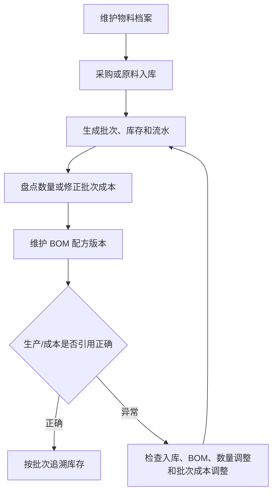
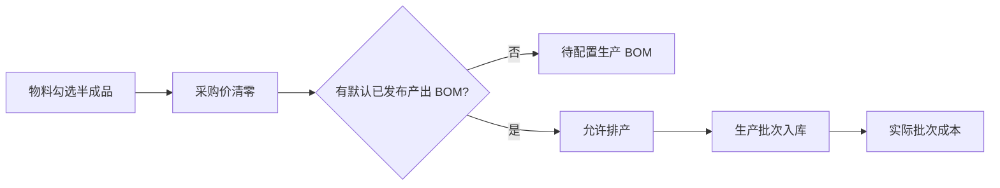

# 操作手册：物料、库存与 BOM

## 适用范围
物料档案、原料入库、原料批次、库存流水、库存批次、库存调整单、商品档案、客户商品、商品价格管理、商品价格表、生产 BOM 制造主档、独立分组模板页面。

> PR-600 当前口径：新建商品和已完成 cutover 的商品不再维护销售规格模板或派生子 SKU；规格由默认已发布商品 BOM 提供，新业务身份为“父商品 + BOM 规格”。本手册后文提到销售规格模板、子 SKU 和规格换算的步骤，只适用于尚未迁移的 legacy 商品与历史单据回显。

## PR-508 端到端链路验收口径
- PR-509-E2E-RAW-MATERIAL-ORDER-PRODUCTION-FLOW：从原料开始验收时，先在物料档案确认库存单位，再通过原料入库生成原料批次、仓库库存和库存流水；后续商品 BOM 规格配方必须能引用这些原料作为生产组件。尚未迁移的商品继续兼容旧 SKU / 销售规格模板，不能只停留在静态资料。
- 原料入库、库存调整、商品档案、销售规格模板和生产 BOM 等用户触发写入都要能在操作日志或对应业务日志中追溯；如果端到端验收发现某一步没有日志或库存流水，按 PR-508 阻断处理。

## PR-453 / PR-455 / PR-458 分组模板新口径
- 历史验收标记继续保留：PR-363-SKU-SETTINGS-WORKBENCH-LAYOUT、PR-366-GLOBAL-UNIT-TEMPLATES、PR-371-SKU-UNIT-TEMPLATE-COMPACT-ACTIONS、PR-438-PRODUCT-TEMPLATE-DELETE-PRICE-LIST-UI、PR-442、PR-453-GROUP-TEMPLATE-SYSTEM-SETTINGS、PR-455-GROUP-TEMPLATE-DELETE、PR-458-GROUP-TEMPLATE-BUSINESS-LISTING、PR-506-PRICE-LIST-SPEC-DEFAULT-ROW-ERRORS、PR-513-MATERIAL-CLASSIFICATION-TEMPLATE。历史文案“基础单位在 设置 → 系统设置”和 `设置 / 分组模板` 已由 PR-530 迁移到业务设置；商品分类的大类和小类都可以折叠，物料归类仍使用 `material_catalog`。
- 销售规格模板继续通过 `新增销售规格模板` 进入新增态；已删除模板和基础单位删除后不再展示。分组模板仍支持 `删除模板`，删除不会回改历史业务快照。
- 分组后的业务列表会按模板完整大类 / 小类树和 `未分类` 自动整理；入口移动不改变这一数据与展示合同。
- PR-453 / PR-455 / PR-458 / PR-528 / PR-530：商品档案、生产 BOM 和仓库库存统一使用 `设置 / 业务设置 / 分组模板` Tab。该组件只维护模板名、大类和小类，不展示系统设置、对象列表或对象移动入口；历史 `groupTemplates` 和 `groupManagement` 地址继续兼容。
- PR-529-GROUP-TEMPLATE-CATEGORY-DELETE：大类、小类同样不再使用启用/停用。点击分类旁 `删除` 时，小类会直接删除；删除大类会同时删除其全部小类。确认框会提示影响范围；删除后，商品、生产 BOM、仓库、物料等原来引用这些分类的对象自动归入未分类（当前模板的 `未分类`），对象本身及库存、BOM、价格表快照、订单和工单不受影响。删除动作可在操作日志中按 `delete_business_group_item` 查询。
- PR-596 后四个业务列表取消内层“左侧分类树 + 右侧业务表”分栏，模板、分类和列表按层级直接内联。即使未选择任何分组模板也保留共享工作区：只显示 `全部分类` 平铺区，`移动到分类` 禁用，底部的 `前往分组模板` 和 `设置分组模板` 仍可使用。选择模板后才增加模板、大类、小类/后代分类和未分类；每个含业务对象的分类重复该页表头并使用自己的分页。
- 商品档案归类使用 `product_catalog`。PR-584 允许在商品档案页面多选要使用的分组模板；页面按“模板 → 大类 → 小类/后代分类 → 商品表”内联展示，空分类和统一 `未分类` 都保留。勾选商品后点击 `移动到分类`，再直接点击大类、小类/后代分类或未分类标题即完成移动，不再先选目标模板，也不二次确认；移动会覆盖旧归类并写操作日志。点击商品名称继续打开现有 `商品档案配置` 抽屉。
- 物料档案归类使用 `material_catalog`。物料档案多选本功能使用的分组模板后，列表内合并展示全部已选模板；页面继续保留名称/编码/批次号搜索和启用状态过滤。点击物料名称打开物料详情抽屉。勾选物料后点击 `移动到分类`，再直接点击目标大类、小类/后代分类或未分类标题；清空模板选择后只显示 `全部分类` 平铺区且移动禁用，底部设置入口保留。取消选择不删除物料、模板、分类或既有归类。
- 生产 BOM 归类使用 `production_bom`。生产 BOM 页面不再维护自己的大组、组内分类或小分类，也不再显示 `使用分组`；列表内合并展示已选模板，并继续保留状态与 BOM 名称/编号搜索。点击 BOM 名称打开包含主档、版本和配方的完整设置抽屉。勾选 BOM 后点击 `移动到分类`，再直接点击目标大类、小类/后代分类或未分类标题。清空模板选择后只显示 `全部分类` 平铺区且移动禁用，底部设置入口保留。旧 `production_bom_groups` / `production_bom_group_categories` 只用于历史只读兼容。
- PR-595 取代 PR-458 的仓库 code 归类口径，PR-596 把仓内分类改为内联列表并让分页只服务当前分类：仓库库存仍用 `warehouse_inventory`，当前归类对象是选中仓库内的物品/规格，使用 `object_key=warehouse_inventory_item` 和精确 `object_ref=<warehouse code>:<item_type>:<item_id>:<spec_g>`。warehouse code 只用于区分仓库命名空间，实际 identity 是物品/规格；同一 identity 的多个批次共享一次归类。外层仓库列表保持不变；选中具体仓库且非客户库存上下文时，右侧仓内物品按模板/分类内联，可勾选物品/规格后移动到大类、小类/后代分类或未分类。页面先按当前 `q/warehouse/item_type`、`page=1&limit=500` 请求 stock API，若 `total` 超出已取回行数则继续补齐后续页，拉齐全部过滤结果后再做分类和每分类独立分页；具体仓库不显示全局服务端分页，也不发送 `group_id/group_item_id`。全部仓库和客户库存上下文仍按原 `q/warehouse/item_type/customer_id/page/limit` 服务端分页平铺且不可勾选移动，既有 WIP/追溯和设置抽屉不变；分类不改变库存数量、批次、成本或追溯。PR-442/PR-458 的 warehouse-code `group_id/group_item_id` 查询只保留历史兼容，不作为当前 UI。
- 商品价格表不再单独选择分组模板，而是按商品档案当前已选的分组模板生成商品类型和选品分类；商品档案选了几种模板，价格表就出现几种对应类型。价格表生成时的分类覆盖只固化到该价格表版本快照，不回写商品档案、BOM 或仓库分类。

## PR-584-PRODUCT-MULTI-GROUP-TEMPLATES 商品行业字段与功能自选分组模板
- 适用角色：维护商品档案的商品/生产人员，以及维护分组模板的管理员。先在 `设置 → 业务设置 → 分组模板` 建好“商品-咖啡豆”“商品-挂耳”等模板及分类树；这里不选择功能。再进入商品档案，在商品档案页面多选要使用的分组模板。
- 商品档案配置可同时选择多份启用中的行业字段模板。页面按选择顺序合并字段，接口内部使用有序 `industry_field_template_ids`；旧单模板商品继续兼容为列表中的第一份模板。重复字段键只显示一次，重复字段键以前序模板定义为准，已有合法值继续保留。
- 取消一份行业字段模板后，只清理不再由其余已选模板定义的当前商品字段；取消全部模板后，商品档案不显示也不保存行业字段。保存模板引用、字段和值是一次完整操作，失败时不会只保存其中一部分；成功后可在操作日志按商品档案配置查询完整模板列表。
- 商品档案自己的“使用分组模板”区域支持多选并保留选择顺序。例如同时选择“商品-咖啡豆”和“商品-挂耳”时，两份模板的大类、小类都会出现；未选择的模板不会进入商品档案分类。每个商品只显示一次，未归到任一当前已选模板的商品统一进入一个 `未分类`。
- PR-596 后，未引用任何分组模板时只显示 `全部分类` 平铺区，`移动到分类` 禁用；仍可从列表底部进入模板设置。选择保存和取消选择都由商品档案发起并写操作日志；分组模板页面保存模板名称或分类结构不会改变商品档案已经选择的模板。
- PR-596-INLINE-CATEGORY-LISTS：移动商品时先勾选商品并点击 `移动到分类`，列表内容和分页置灰，分类标题提示可选目标；直接点击目标大类、小类/后代分类或 `未分类` 后立即移动。`全部分类` 和模板标题只用于组织列表，不能作为目标。移动继续表示商品当前唯一归类，不会让同一商品在多份模板下重复出现；移动和清除归类仍通过正式接口写入操作日志。成功后清空勾选并退出，失败时保留勾选和移动模式供重试。
- 收起大类会隐藏全部后代分类标题和商品行；系统同时保留小类自身的折叠状态、各分类分页和已勾选商品。重新展开大类后恢复原状态，不需要重新选择商品或翻页。
- 在商品档案取消某个模板选择，只会隐藏该模板在商品档案中的分类展示和归类入口，不删除模板、分类、商品、既有对象归类或历史快照。以后重新选择同一模板时，仍可恢复查看原有当前归类；若需要真正删除分类，仍按分组模板删除流程处理并先确认影响范围。
- 商品价格表继承商品档案的选择，不另设模板多选。例如商品档案选择咖啡豆、挂耳，价格表的商品类型就只显示这两种；取消其中一份后，新建或重新编辑价格表时对应类型退出。历史 `price_list` 引用不参与类型生成，已发布价格表快照不会回改。
- 结果校验：刷新商品档案后，行业字段顺序与所选模板顺序一致；分组区只出现已选模板，模板、分类与业务表内联且每个含商品的分类有独立表头和分页；无选择时只保留 `全部分类` 平铺区和底部模板入口且移动禁用；大类收起时看不到任何后代小类标题或商品行。再进入商品价格表，确认商品类型与商品档案已选模板一一对应。异常时先检查模板是否启用、商品档案选择是否保存成功，再到操作日志核对模板选择和商品配置保存记录。

## 入口
- 库存管理：物料档案/库存、原料入库、原料批次、库存流水、库存批次、库存调整单。
- 商品：商品档案、客户商品、商品价格管理、商品价格表。
- 生产管理：生产 BOM、工艺路线/工艺模板、生产计划、生产工单、工序卡、生产日志和生产成本。`生产中` 仅作为兼容状态页保留。
- 设置：业务设置、行业设置、系统设置。业务设置包含分组模板和全局单位字典；行业设置维护行业字段模板；系统设置维护系统基础开关和通知设置。

## 流程图

## PR-604 物料取得方式

物料档案使用“取得方式”区分外购与自制。外购物料维护采购价/批次成本且不能作为物料产出 BOM；自制物料采购价固定为 0，只能通过默认已发布制造 BOM 取得标准成本。切换来源会记录操作日志，仍有关联制造 BOM 时不得切回外购。

## 标准操作
1. 在物料档案中维护物料名称、分类、库存单位、默认采购价、行业字段和库存警戒线；默认采购价只作为兜底参考，不用于直接改历史批次成本。采购价单位就是库存单位；重量物料主档统一使用 `kg`，采购价和批次单位成本按 `元/kg` 录入和展示。
2. 原料到货后创建原料入库单，确认数量、库存单位、批次、单价、供应来源、产季、产地和产家风味描述。
3. 通过原料批次和库存批次检查批次号、剩余数量和入库来源。
4. 对原料入库批次执行入库质检，记录工厂风味描述、水分和密度；未通过或待处理批次不能当作可用合格批次直接流转。
5. 在 BOM 配方维护中设置商品所需物料、用量和启用版本。
   - PR-511-BOM-MATERIAL-LOSS-BOM-LEVEL / PR-592-BOM-LOSS-GROSS-INPUT / PR-593-BOM-LOSS-PACKAGING-UNITS：BOM 版本设置中只维护一个 `原料损耗比`；“损耗原料”按 `净配方数量 ÷ (1 - 原料损耗率)` 准备、占用和消耗，例如产出基准 `1kg`、原料比例 `40%`、损耗 `20%` 时需要 `0.50kg`。非损耗物料（含包材）按物料档案的个、件、袋、盒等库存单位和 BOM 固定用量执行，不乘除损耗；同一 BOM 可同时维护两类物料。
6. 出现盘点差异或入库价格录错时，使用库存调整单，不直接改数据库，也不通过物料档案改历史库存成本。
7. 通过库存流水追踪每一次入库、出库、调整和生产消耗。
8. 物料、批次、库存流水、出库日志和分配批次等列表底部统一显示总页数、当前页、跳转页和每页条数；筛选变化后从第一页重新查询。

## 物料档案
- PR-513 / PR-528 / PR-530 / PR-584：物料档案分类使用 `设置 → 业务设置 → 分组模板`。物料列表同时展示全部已选模板，以模板 → 大类 → 小类为层级并保留统一 `未分类`；归类继续写入通用 `business_group_assignments`，物料页不直接维护分类结构。
- PR-414-MATERIALS-CLASSIFICATION-INDUSTRY-SETTINGS：物料档案主流程不再使用旧“生豆/包材/其他”类型下拉作为业务分类。旧 `material_classification_*` 分类只作为历史迁移来源，新业务归类以 PR-513 的分组模板为准。
- 物料支持 `新建物料`、点击物料进入详情编辑、保存基础信息、采购价、单位、行业字段和库存警戒线，以及勾选物料后 `批量失效`。这些操作都会写操作日志。旧“基础字段锁定，变更需复制为新物料”的口径下线。
- PR-416-MATERIALS-LIST-LAYOUT-BATCH-DEPRECATE / PR-513-MATERIAL-CLASSIFICATION-TEMPLATE / PR-584-PRODUCT-MULTI-GROUP-TEMPLATES：物料列表不再单独展示 `物料类型` 列，分类状态通过全部已选分组模板的大类、小类和统一 `未分类` 分组体现。搜索、状态过滤、查询、新建物料和批量失效位于 `物料列表` 上方；表头最左侧复选框用于当前列表或当前分组全选/取消全选。列表内容较宽时可横向滚动查看，不再把物料名称、单位、库存和状态挤在一起。
- PR-598：`半成品标识` 可选择全部、半成品或非半成品，只过滤当前已加载的物料列表并重置本页分页。它不会恢复旧物料类型列，也不会改变制造能力；是否可制造仍只看默认已发布产出 BOM，并在 `产出该物料的 BOM` 旁直接显示。
- 物料档案里的单位来自 `设置 → 业务设置 → 全局单位字典` 中启用的单位，在新业务中统一解释为库存单位。字典中属于 `重量` 的单位只有 `kg` 可用于物料主档，`g/lb/oz` 以及自定义 `t/吨` 等重量单位只用于 BOM 或历史用量换算；个、件、袋、盒等计件/包装单位仍可按字典启用状态选择。物料档案只展示一个 `库存数量（库存单位）`；库存补录只输入一个目标库存数量，单位跟随该物料库存单位。库存调整单选择物料时同样只输入一个目标数量和原因，后台兼容旧 `g/件数` 库存字段。
- PR-520-INVENTORY-UNIT-LOCK：物料档案库存单位只在新建时选择，保存后详情页只读展示。除 PR-599 的一次性系统兼容迁移外，单位选错时不要直接改已有档案；应新建正确物料并走正式库存迁移。后端拒绝普通编辑请求改变单位，避免历史库存和 BOM 用料含义被改写。
- PR-599-MATERIAL-INVENTORY-PRICE-UNIT-UNIFICATION：物料详情只保留一个库存单位，采购价单位、批次单位成本和 BOM 成本试算都使用该单位；数据库中的 `cost_unit` 是旧接口兼容字段，不是第二个可配置单位，始终与库存单位相同。
- 重量物料主档只能选择 `kg`，页面不再提供 `g/lb/oz` 等重量库存单位。BOM 配方仍可输入 `g`，系统按全局单位换算后扣减 kg 库存；例如 `227g` 等于 `0.227kg`。个、件、袋、盒等计件物料继续使用各自库存单位，并按元/个、元/件、元/袋或元/盒计价。
- 历史重量物料中 `g/kg`、`lb/kg`、`oz/kg` 等记录升级为 `kg/kg`。规范克库存和警戒线不变，所以原 `22700g` 展示为 `22.7kg`；采购价数值、批次成本、BOM 与工单等历史快照不改写。仍在执行的历史工单或预约即使冻结为 `g/lb/oz`，也会按规范克换算继续领料、消耗和完工，冻结单位文字保持不变。新建、编辑、批量失效等用户写操作继续在操作日志中追溯。
- 物料档案不再维护直接销售价。若需要把某个物料直接销售，先创建一个商品档案作为销售/库存对象，再在生产 BOM 中声明该商品为产出并引用对应物料，之后通过商品价格表配置报价和发布交易价格。
- 咖啡生豆属性不再作为物料页硬编码表单。进入 `设置 → 行业设置 → 行业字段模板` 维护“咖啡生豆”等字段模板，再在物料详情中选择行业字段模板并填写字段值。旧咖啡生豆属性字段保留为历史兼容，升级后会以行业字段值方式继续解释。

## 仓库设置
- 仓库库存页选择任意仓库后都可以点击“仓库设置”。仓库设置抽屉保留仓库类型、启停和客户绑定等资料维护，但页面列表分组不再按普通仓库/客户仓库固定分段。客户库存上下文仍保留既有安全过滤，不新增客户专用仓库视图。

## 商品管理与商品档案
- PR-439-PRODUCT-PRICE-MASTER-REMODEL / PR-504-PARENT-PRODUCT-CHILD-SKU-UOM / PR-505-SALES-SPEC-TEMPLATE-DERIVED-SKU：商品档案是父 SKU 入口，维护商品资料、销售规格模板、分组、客户引用和行业字段；库存单位来自所引用的销售规格模板，具体销售/库存规格由模板自动派生的子 SKU 表达，例如 `227g袋装`、`100g袋装`、`散装kg`。商品档案配置抽屉只读展示 BOM 使用摘要和价格摘要。价格摘要来自商品价格表快照，没有已发布快照时显示 `暂无价格表价格`。商品档案普通表单不再维护商品配置模板、报价单位、录单单位、阶梯价模板、计价方式、固定价、成本加成或利润率覆盖；这些旧字段仅用于历史数据兼容或迁移报告。
- PR-520-INVENTORY-UNIT-LOCK：销售规格模板的库存单位也只在新建模板时选择，保存后不可修改；要改变库存单位需新建销售规格模板并让商品档案引用新模板，旧模板保留给历史 SKU、价格表、BOM、订单和库存流水追溯。
- PR-439 历史验收口径曾写“商品档案只维护商品资料、库存单位、规格、整数限制和行业字段”；PR-502 在这个口径上把“库存单位/默认销售单位”收敛为单位模板引用和高级覆盖，不恢复旧价格/配置模板入口。
- PR-603 起，商品档案配置抽屉不再选择销售规格模板，也不再展示销售规格模板明细、逐规格 SKU 编号或“设为默认规格”按钮；抽屉常驻展示 `BOM 规格（只读）` 面板，直接引用默认制造 BOM 规格组的规格（名称、规格编码、条码、生产单位、默认规格标记）。未绑定默认制造 BOM 时提示“该商品尚未绑定默认制造 BOM；请到 生产配置 -> 生产 BOM 创建规格组并设为默认 BOM”。商品列表工具栏的批量“设置销售规格模板（旧商品）”与“维护销售规格模板（旧商品）”入口已移除；旧商品销售规格模板（迁移期）仍可经菜单 `单位模板` 维护。商品配置模板表单不再引用销售规格模板。要增加 `227g袋装`、`100g袋装` 等规格，统一到默认制造 BOM 的规格组维护。抽屉的“被哪些 BOM 使用”只读展示产出该商品或把该商品作为组件消耗的生产 BOM，并显示 `BOM状态`：`默认状态` 表示该 BOM 是产出商品当前默认 BOM；`启用状态` 表示 BOM 可继续作为生产/成本来源；`失效状态` 表示 BOM 已失效，仅用于历史追溯。销售规格模板与规格组修改均只影响后续新建或编辑的 BOM、工单和库存流转，不自动回改已发布 BOM 版本、历史工单、历史库存流水或历史价格表快照。
- PR-550 后，销售规格模板保存会先完整读取并关闭父商品和子 SKU 查询结果集，再在同一事务中同步派生规格。新增规格如仍提示 `conn busy`，不要反复新增或复制模板，先刷新页面确认当前规格是否已保存，再联系开发排查；成功保存仍按原规则记录操作日志并同步有效派生 SKU。
- PR-439-PRODUCT-PRICE-MASTER-REMODEL：客户商品只维护客户侧展示关系，包括客户、绑定商品档案、客户商品、客户商品编号、重命名、排序、启停、备注、是否进入价格表和客户行业字段覆盖。客户商品不维护报价单位、录单单位、商品配置模板、阶梯价模板或价格覆盖；价格摘要同样来自商品价格表快照。
- PR-536-PRODUCT-INDUSTRY-TEMPLATE-ONLY / PR-585-BOM-SINGLE-MATERIAL-LOSS：当前“复制为商品档案”只复制商品主档基础资料、单位模板引用、单位覆盖和库存相关主数据；不复制商品生产配置、工艺路线、商品配置模板、价格阶梯、生产 BOM、行业字段模板、行业字段值、商品价格管理记录、价格表快照或客户引用关系。复制后如需行业字段，先在新商品配置中选择模板并填写；重新配置工艺路线；到生产 BOM 创建或复制 BOM、把新商品设为产出并仅在 BOM 版本中设置需要的原料损耗；再到商品价格管理和商品价格表配置并发布价格。
- PR-453 / PR-502 / PR-505 / PR-506 / PR-528 / PR-530：`商品` 菜单保留商品档案、商品价格管理和商品价格表；分组模板入口统一在 `设置 → 业务设置 → 分组模板`，生产 BOM 位于生产管理，行业字段模板位于设置的行业设置。
- `商品档案` 是库存、销售、成本、成品批次和价格对象。列表第一业务列是商品名；商品名本身就是配置入口，默认不在表格内编辑，点击商品名打开“商品档案配置”抽屉。列表只把父商品作为商品行；销售规格模板派生的子 SKU 收在父商品名下的 `X 个规格 SKU` 展开区，逐条显示规格名和 SKU 编号，不再把每个规格平铺成独立商品。商品数量、分页、全选和批量操作按父商品计算；搜索子 SKU 名称、规格或编号仍会返回对应父商品。
- 商品档案先按当前搜索和状态筛选生成完整商品分组，再在每个分类内部独立分页，默认每类每页 10 款。分类标题数量是该分类筛选后的完整父商品数；任一分类翻页或修改每页条数不会改变其他分类的页码。只有父商品参与分页，销售规格模板派生的子 SKU 仍收在父商品的规格明细里。分类收起再展开保留当前页；搜索、状态、当前视图或分组模板变化后，各分类回到第 1 页。表头全选只选择当前实际显示的父商品行。
- `商品档案配置` 抽屉同屏维护基础信息、销售规格模板、销售规格模板明细、工艺路线和行业字段模板，并只读显示“库存单位：来自销售规格模板”、BOM 使用摘要和价格摘要。BOM 摘要分别展示“产出该子 SKU 的 BOM”和“把该子 SKU 作为组件的 BOM”；同一 BOM 只展示一次，失效商品或失效 BOM 不展示。PR-430 后组件反查只读取每个生产 BOM 的当前有效版本，有草稿时看草稿，否则看最新发布版本，旧版本曾经用过该商品不会继续显示为当前使用关系。商品档案不再维护或更换生产 BOM；要修改制造结构或原料损耗，回到生产 BOM 中维护产出子 SKU、版本、组件清单和唯一的 `原料损耗比`。
- 商品行业字段只有在商品档案配置中选择行业字段模板后才出现。PR-584 后可选择多份模板，字段定义来自已选模板的有序并集；未选择模板时不显示也不保存行业字段。旧单模板口径“取消行业字段模板会清空商品行业字段”在多模板下表示取消全部模板；取消单份模板只清理不再被其余模板定义的字段。
- 复制为商品档案不复制行业字段模板或行业字段值。需要行业字段时，在新商品档案配置中选择模板后重新填写；不要把来源商品的行业字段、生产配置或生产定义视为已随复制带入。
- PR-439 后，商品分类按 ERPNext Item Group 口径作为独立分类树主数据。商品档案直接保存 `product_category_id`，客户商品如需客户展示分类则直接保存 `customer_product_category_id`；分类只做组织、筛选和报表分组，不参与价格、单位、BOM 或录单取价。旧分类模板 Tab 仅用于历史数据兼容和迁移排查。
- 客户商品页顶部提供客户选择、搜索、启用/停用/全部过滤、`新建客户商品` 和 `批量失效`。分类调整在 `商品分类管理` 维护分类树后，在客户商品抽屉或列表中选择客户展示分类；删除分类后，该分类下对象回到未分类，不影响商品档案、价格表快照或历史订单。
- 旧 `商品配置模板` 只作为历史兼容和迁移报告来源。新业务中价格、价格单位、录单单位、固定价、成本加成、BOM 成本生成和阶梯规则进入 `商品价格管理`、价格生成工具、阶梯价格方案和已发布商品价格表快照；分类用于归类和价格表筛选，不承载模板规则、BOM 或客户展示名。
- `行业字段模板` 是商品生产配置和物料行业字段的定义来源，入口为 `设置 → 行业设置`。行业字段模板页是左侧模板列表、右侧模板编辑；左侧可搜索模板名，也可按启用、停用、全部过滤。点击左侧模板名后在右侧编辑，新建模板也在右侧编辑区填写。用户不再维护“行业键”，字段定义只填写“字段键”、类型和类型右侧输入框。文本类型右侧输入框用于默认文本，可留空；下拉类型右侧输入框用空格分隔选项，不再让普通用户写 JSON。字段键同时作为显示名，单位和必填开关下线；旧数字、比例、日期、勾选等字段继续兼容读取和保存。商品档案、客户商品和物料档案会显示行业字段；客户商品可以填写客户侧覆盖值，用于客户报价展示，未填写时继承绑定商品档案字段值。
- 在行业字段模板中删除或改名字段并保存模板后，系统会立即清除引用商品当前配置中已不属于模板的字段。该清理只影响当前 `product_production_config_fields`，不改历史订单、工单或价格表快照。
- `客户商品` 只维护客户侧展示名、系统生成的客户商品编号、重命名、排序和客户侧行业字段覆盖值。单个新增和批量添加商品档案时不手工填写客户商品编号；系统自动生成并在列表展示。新建客户商品抽屉不展示“进入价格表”开关，列表仍展示该状态用于追溯和后续配置。贴牌、客户命名和客户侧分类变化优先走客户商品，不复制 BOM，也不在客户商品层修改生产数据。PR-410 后，旧“品牌名”字段在新 UI 中表达为“重命名”：留空时使用客户商品，填写后客户商品列表和客户产品价格表优先显示重命名。
- 旧 `商品配置和分类模板`、`阶梯价模板`、`单位模板` 不再作为普通新业务配置链路。实际价格和录单单位计算顺序为：已发布商品价格表快照 > 历史已发布价格表/历史订单兼容读取；不得从商品档案、客户商品或旧模板兜底取价。
- 进入 `商品档案` 或 `客户商品` 后，不再使用页面内 `SKU归属` 行切换范围；客户、订单等范围由顶部“当前视图”和页面自身客户选择器承接。
- PR-387-VIEW-CONTEXT：顶部“当前视图”会把客户或订单上下文带入商品管理。客户视图下默认进入“客户商品”，用于维护客户对外展示；工厂总览下默认进入“商品档案”，用于维护真实库存/销售对象，并通过反查了解生产 BOM 关系。
- PR-386-PRODUCT-MODEL-OVERHAUL / PR-410：用户侧把原 `SKU设置` 统一称为“商品管理”。“商品档案”是真实 SKU，用于库存、成本、销售、生产产出和成品/半成品批次；“客户商品”是某客户名下的对外商品名称、编号和重命名，绑定一个商品档案。工厂自营也按一个客户-like 归属维护客户商品，避免把销售主体拆成两套逻辑。
- PR-363 / PR-394 / PR-439 / PR-530：商品模块当前主入口为商品档案、商品价格管理和商品价格表；客户差异在商品档案的客户引用中维护，分类模板在业务设置中维护。
- “商品档案”工作区不再把产品类型/产品子类型作为主列表结构。列表固定有“全部商品”，可按直接商品分类筛选或分组展示；分类节点来自商品分类管理，分类组可收起或展开。
- “商品分类管理”入口维护商品分类树和客户商品展示分类树。分类节点只维护名称、父级、排序、启停和备注；商品档案或客户商品直接选择分类。价格、单位、BOM、录单规则不在分类节点上配置。
- PR-364-SKU-SETTINGS-COMPACT-DRAWERS：商品分类区域变为固定高度滚动窗，可在搜索框输入产品类型、产品子类型或商品名称快速定位；新增商品档案时，点击商品档案列表右上角“新增SKU”打开抽屉。
- PR-365-SKU-CATEGORY-INLINE-EDIT 历史兼容：旧产品类型和产品子类型曾在商品分类列表内直接维护，历史入口中点击名称直接改名，子类型仍按原拖动方式排序。PR-394 后新 UI 主流程不再把产品类型/产品子类型作为商品档案列表列或创建字段；旧字段仅用于历史数据、旧价格表和迁移 fallback。
- PR-367-SKU-CATEGORY-ACTION-POLISH：商品分类里的加号、减号和上下排序按钮是紧凑胶囊按钮。点击删除模式减号后，红色删除减号显示在产品类型或产品子类型行右侧；点击红色减号会直接删除分类，不再二次弹窗确认，分类下的 SKU 会回到未分类/停车场，后续可重新拖入或重新选择子类型。
- PR-368-SKU-CATEGORY-COLLAPSE-GLOBAL-UNIT / PR-392 / PR-439：商品分类的大类和小类都可以折叠。点击新增分类后，页面会清空搜索、展开父级并定位到新分类的位置，便于立刻改名或继续归类。分类节点不绑定商品配置模板、单位模板或阶梯价模板。
- PR-370-UNIT-TEMPLATE-DRAWER-SKU-CATEGORY-LAYOUT / PR-382-SKU-UNIFIED-CREATE-COPY 历史兼容：旧商品分类树、旧“新增SKU”和旧“SKU复制”是历史口径；旧 SKU复制 批量结果曾展示“新增 X 款、覆盖 Y 款、跳过 Z 款”。新 UI 中创建商品档案只保留顶部“创建新商品档案”按钮，历史 SKU 复制入口已下线；当前“复制为商品档案”的复制边界和复制后补配步骤以本节 PR-536 条目为准。
- “商品档案”列表默认展示工厂自营/公共商品档案，并展示稳定商品编号；有 `product_code` 时显示该编号，没有显式编号时显示 `SKU-000xxx` 兼容编号。列表不再提供“生产配置 / 更换生产 BOM / 维护 BOM / BOM”等重复按钮，也不单独展示 `BOM 使用` 列；点击商品名进入配置抽屉。抽屉维护基础资料、商品分类、销售规格模板、工艺路线和行业字段，并只读展示来自销售规格模板的库存单位、BOM 使用摘要和价格摘要。列表不再维护整体损耗、产品级利润率覆盖或商品内价格阶梯。
- 需要为某个客户准备销售展示时，优先在“客户商品”中绑定已有商品档案，只改客户对外名称、重命名、排序、客户展示分类和行业字段覆盖。客户商品编号由系统生成。客户如果只需要不同报价档位、报价单位、固定单价或成本加成，不复制商品档案或 BOM，而是在“商品价格管理”维护该客户商品的最终价格记录和阶梯价格方案，再通过该客户商品价格表发布快照。只有配方、包装、库存对象、生产方式或成本口径变化时才创建新商品档案。
- 新增商品档案表单填写父 SKU 名称、销售规格模板、备注等基础信息；同类商品优先选择已有销售规格模板，模板会展示库存单位和将自动派生的销售规格明细。具体子 SKU 由模板规格自动派生，不在商品档案里手工新增；不要把 `袋/227g` 写成销售单位，也不要为每个克重复制一套模板。不再选择分类模板、产品类型、产品子类型、商品配置模板或阶梯价模板；也不把“贴牌”“受托加工”写成底层 SKU 类型。新增成功后系统会自动打开该商品的“商品档案配置”抽屉，便于立刻确认派生子 SKU、工艺路线和行业字段；如某个子 SKU 需要生产，再到生产 BOM 新建或复制 BOM 并把它设为产出子 SKU。
- PR-352-INSTANT-COFFEE-PRODUCT-KIND / PR-428-PRODUCT-ARCHIVE-NO-GREEN-BEAN-BINDING / PR-429-PRODUCT-ARCHIVE-LIST-NOTICE-CLEANUP：新增公共 SKU 或客户专属 SKU 时，分类可选择商品分类里的“速溶咖啡”或“生豆”。新增表单和商品档案列表无需填写烘焙度、损耗率、生豆属性、绑定熟豆、挂耳每袋克重或每盒袋数；这些规格和展示信息应由行业字段、库存单位、商品价格记录、价格表快照或生产 BOM 承载，不能在商品档案列表写死业务枚举。录单会显示速溶咖啡或生豆形态，速溶咖啡生产计划缺 BOM 时原料为速溶咖啡，生豆按商品分类和生产配置识别默认原料。
- PR-354-PRODUCT-TYPE-SUBTYPE-COMPAT：商品管理中的“产品类型”和“产品子类型”承接历史两层商品分类。现阶段 `product_kind` 仍作为兼容字段保留，系统会把熟豆、生豆、挂耳和速溶咖啡映射到默认产品类型；后续产品价格表、阶梯价和生产规则会逐步改由产品类型/产品子类型配置驱动。
- PR-392 / PR-411 / PR-439：商品配置模板、单位模板和阶梯价模板不再作为商品档案或客户商品普通编辑字段。是否进入产品价格表由客户商品和产品价格表页面决定；价格、价格单位、录单单位和阶梯档位由商品价格管理与已发布价格表快照决定。
- PR-366 / PR-438 / PR-439 / PR-500 / PR-504 / PR-505 / PR-530：基础单位在 `设置 → 业务设置 → 全局单位字典` 维护，例如 kg、g、lb、盒、袋、箱。销售规格模板维护库存单位、规格名称、销售单位、净含量、默认规格和启用状态；父 SKU 引用模板后按规格派生子 SKU，商品价格表按子 SKU 发布并固化单位快照。
- PR-541：父商品还会保存自己的权威默认规格。打开商品档案配置抽屉，在规格列表点击“设为默认规格”；当前默认项显示“默认规格”标识。只能选择同一父商品下启用且仍属于当前规格模板的子 SKU；无子 SKU 的历史商品以自身作为默认规格。设定和模板同步导致的自动切换都可在操作日志追溯。
- PR-369-UNIT-TEMPLATE-SAVE-CREATE-UPDATE / PR-505-SALES-SPEC-TEMPLATE-DERIVED-SKU：全局单位字典不再提供“新建单位”按钮；销售规格模板页直接在空白表单填写后保存。要修改已有销售规格模板，先点击左侧模板记录，修改后保存；保存后刷新列表并回到空白编辑状态，继续填写下一套并保存就是新增。
- PR-371 / PR-436 / PR-438 / PR-505 / PR-530：销售规格模板和 `设置 → 业务设置 → 全局单位字典` 都使用左侧选择、右侧新增/保存的维护方式；删除基础单位不回改历史业务快照。
- 例子：先在 `设置 → 业务设置 → 全局单位字典` 确认基础单位“kg”“g”“袋”存在，再在 商品档案 → 销售规格模板 新建“咖啡豆袋装规格”，库存单位选择 `kg`，添加 `227g袋装 / 袋 / 227 g` 和 `100g袋装 / 袋 / 100 g`。到 商品档案 新建父 SKU“埃塞俄比亚 水洗”，引用该销售规格模板；保存后系统自动派生两个子 SKU。需要生产时，生产 BOM 选择具体子 SKU；需要报价时，在商品价格管理维护价格计算模板，再到商品价格表发布。
- PR-359-PRODUCT-KIND-MIGRATION-CLEANUP：启动迁移会自动补齐熟豆、生豆、挂耳、速溶咖啡四个默认产品类型和对应默认产品子类型。只有 `product_category_id` 为空的旧 SKU 会按 `product_kind` 回填分类；已经手工归类到客户产品类型/产品子类型的 SKU 不会被覆盖。
- 客户需要复用工厂或其他客户的商品时，优先创建“客户商品”并绑定已有商品档案。贴牌只改客户展示名、编号、重命名或分类时，不复制生产 BOM；客户专属包装、客户改配方、受托加工/客户来料等改变生产定义的场景，才创建新商品档案，并维护产出该商品的生产 BOM。
- PR-396 / PR-405：历史“SKU复制”入口已下线；新模型不再向用户解释“继承/锁定/派生 BOM”。如果只是客户展示差异，应创建客户商品并绑定已有商品档案；如果确实需要新的库存、包装、配方或成本口径，则使用“复制为商品档案”或“创建新商品档案”，再在生产 BOM 中选择、复制或新建 BOM 并把该商品设为产出。商品状态只表达“启用/停用”；生产 BOM 可以直接失效，商品档案只做反查提示。
- PR-321/PR-322：客户自有分类和已归类客户商品不会被隐藏或删除；产品子类型仍有效但父级误失效时，schema 修复会自动恢复父分类或迁移到同名 active 父分类。通过 商品管理 停用商品档案时，对应 active BOM 版本同步置为 disabled，历史 BOM 明细继续保留。
- 点击“公共SKU”回到公共SKU列表；客户SKU行同样可通过商品名进入商品档案配置抽屉维护备注、分类、销售规格模板、工艺路线、行业字段或失效，并查看 BOM 使用关系和价格摘要。列表筛选以商品名称、商品编号、分类、历史兼容类型标签和备注为主；搜索可匹配商品名称、商品编号、分类、历史兼容类型标签和备注。产品类型/产品子类型只作为历史兼容字段保留。
- 商品名称不再在列表单元格内直接编辑；需要改商品档案名称时点击商品名打开配置抽屉，在基础信息中修改并保存。
- 商品分类主流程改为独立 `商品分类管理` 页面。商品分类是全局树，客户商品展示分类可单独维护；商品档案和客户商品直接保存分类字段。新增、改名、删除、排序、移动和停用分类在商品分类管理完成；商品档案/客户商品在自身抽屉或批量操作中选择分类。
- 删除或停用分类后，该分类下对象回到未分类或保留只读历史提示；移除分类不删除商品、客户商品或历史价格表。旧 `product_categories` 分类树、分类模板和客户公共分类开关只作为历史兼容，价格表、录单、成本和生产计划优先读取商品/客户商品直接分类与已发布价格表快照。
- 客户上下文历史兼容：删除客户自己的商品分类后，旧分类树里的商品会回到未分类；重新新增同名分类时不得触发 `product_categories_customer_parent_name_uniq`。PR-439 后新 UI 主流程改用商品分类管理和客户商品直接分类字段，但旧分类树、客户自己的商品分类和 schema 修复仍保留兼容历史数据；历史 schema 修复会自动恢复父分类或把子分类迁到同名 active 父分类。
- PR-316-FORM-DRAFT-CACHE：录单、BOM配方维护、商品管理中新增商品档案抽屉、商品配置、分类名称和各分类筛选页码会在本次浏览器会话内临时保留；跳转到其他功能再回来时保留未提交表单，刷新浏览器后草稿清空。
- 价格表已拆到 产品价格表；在产品价格表中把“价格表归属”切到某个履约客户后，该客户启用并纳入价格表的客户商品会进入预览和版本发布上下文。

### 客户商品工作区
- 入口：商品 → 商品档案中的客户引用。
- 先选择客户；工厂自己的自营品牌也选择内置“工厂自营”客户，不再另开一套销售主体。
- 点击过滤行右侧 `新建客户商品` 打开抽屉。在“单个新增”模式选择绑定商品档案并填写客户商品、重命名、排序、启用状态、是否进入价格表、客户展示分类和备注；客户商品编号由系统生成，不手工填写。重命名留空时使用客户商品，填写后列表名称和客户价格表展示优先使用重命名。客户需要专属报价档位、规格、固定单价或成本加成时，到 商品价格管理 维护该客户商品的最终价格记录和阶梯价格方案，再通过客户商品价格表发布快照。客户商品只负责客户侧展示、是否进入价格表和销售归属，不承载库存、生产 BOM、成本或成品批次。
- 点击“保存客户商品”后，系统写入客户商品记录并写操作日志；后续可在同一表格中停用，不能在客户商品层编辑生产数据或 BOM。
- 如果客户要批量使用已有商品档案，在同一个 `新建客户商品` 抽屉中切到“批量添加商品档案”模式，在商品列表顶部按商品名称或编号搜索，多选后一次创建客户商品。默认客户商品=商品档案名称，客户商品编号由系统自动生成，重命名为空；批量新增不选择产品类型、产品子类型、旧分类模板或旧价格模板。同客户同商品档案已存在时自动跳过，并在结果里显示创建和跳过数量。实际创建的客户商品都会写操作日志。
- 如果客户商品绑定的商品档案已经停用，列表中的绑定商品档案会标红并提示“绑定商品已失效”。这表示该客户商品仍可追溯，但新报价、下单或履约前需要改绑有效商品档案或停用该客户商品。
- 客户商品的分类配置只影响该客户商品，不会回写商品档案归类，也不会影响其他客户。需要调整客户价格表分组时，在客户商品抽屉或批量操作中选择客户商品展示分类。
- 若只是贴牌、客户命名或客户编号不同，维护客户商品即可，不复制商品档案和生产 BOM。
- 若客户专属包装、配方、库存对象、生产方式或成本口径不同，先创建新的商品档案，再维护产出该商品档案的生产 BOM，最后给客户商品绑定这个新商品档案。
- 客户商品工作区没有 BOM 编辑入口；生产 BOM 在生产管理中维护产出商品、版本和组件，避免客户展示资料和制造定义混在一起。

### 历史客户 SKU 兼容
- PR-406 后，客户商品页面不再展示“旧客户 SKU 收敛检查”。历史旧客户 SKU、历史订单、历史价格表、历史 BOM 和历史工单仍保留兼容，不自动迁移、不删除、不回改。
- 新增业务按两个入口判断：贴牌、客户命名、客户编号、客户侧分类或客户专属价格变化时，优先创建客户商品；配方、包装、生产方式、库存对象或成本口径变化时，才创建新商品档案并维护产出该商品的生产 BOM。

## 商品价格管理中的阶梯价格方案
- 在 商品 → 商品价格管理 维护最终价格记录和阶梯价格方案。
- 一条价格记录包含关联商品或客户商品、最终单价、价格单位、币种、有效期、价格分组、库存单位、库存换算、状态和备注。价格分组只用于页面筛选和管理，不参与业务取价。
- 阶梯价格方案的每个档位引用一条最终价格记录；引用后该价格记录的最终单价、价格单位和币种就是该档位最终价，不再二次套利润率、固定价或成本加成。
- 商品价格表发布时选择价格记录或阶梯价格方案，生成草稿并发布版本。发布快照固化最终价、价格单位、来源价格记录、库存单位、库存换算和版本号；正式交易价格、录单单位、渠道客户下单和小程序履约订单都读取已发布快照。
- 修改价格记录或阶梯价格方案只影响后续草稿和新版价格表；已发布价格表、历史订单和历史结算不会被自动回改。

### 历史兼容索引
- 以下旧词只用于历史 PR 回归、迁移排查和旧快照解释，不是 PR-439 后普通用户的新业务入口：客户SKU列表、梯度模板、商品配置模板由商品档案或客户商品选择引用、复制为客户配置、成品库存单位、产品类型标题和上下排序按钮在左侧。PR-502 后“单位模板左侧是模板列表，右侧是新增或编辑表单”仍是当前商品 UOM 模板维护方式。
- PR-419 历史说明中“产出该商品的有效生产 BOM”现在在商品档案中以只读 BOM 使用摘要展示；商品档案仍不编辑 BOM。

## BOM配置
- PR-417-MULTILEVEL-MANUFACTURING-BOM / PR-500-UNIT-MODEL-CONSOLIDATION / PR-505-SALES-SPEC-TEMPLATE-DERIVED-SKU / PR-559-PRODUCTION-CONFIG-WIP-ISSUE-UX：入口为“生产管理 / 生产配置 / 生产 BOM”。生产 BOM 是生产端主档案，必须声明产出商品、产出数量、产出商品库存单位、组件清单、版本状态和可选工艺信息；产出单位由产出商品的有效库存单位自动带出并只读显示来源。旧生产 BOM 直达地址继续兼容并自动进入该 Tab。PR-505 后子 SKU 的有效库存单位来自销售规格模板，商品档案不再主动绑定或编辑 BOM。
- PR-406 独立 BOM 口径继续保留：页面主列表为“生产 BOM列表”，只展示生产 BOM 档案本身，不混入商品档案行。`BOM名称` 列只显示业务名称，自动隐藏 BOM 编号、历史名称末尾的“生产 BOM”兼容后缀和版本号；编号与版本仍保留在后台，可通过搜索框检索并在右侧制造详情查看。点击 BOM 名称加载右侧制造详情。
- 新建 BOM 时先选择产出商品，例如 `条装速溶咖啡 / 1条`、`10条盒装速溶咖啡 / 1盒`、`挂耳单袋 / 1袋`、`发动机总成 / 1台`。产出商品可以是成品，也可以是需要入库、被上层 BOM 消耗的半成品商品。
- 新建或编辑 BOM 时不能手工改产出单位；如果产出商品缺少显式模板库存单位，页面显示当前兜底单位并提示先到销售规格模板设置库存单位。历史 BOM 版本的产出单位和当前模板库存单位不一致时，详情会提示历史版本不会自动回改。
- BOM 版本在右侧 `BOM版本` 区维护。配方明细、合计比例和“保存组件”都在当前选中版本下方。已发布版本只读；需要调整产出基准、组件、用量或备注时，先复制为新版草稿，编辑草稿后发布。历史工单继续读取创建时冻结的旧版本快照。
- 组件清单支持 `material` 物料组件和 `product` 商品组件。物料组件可按比例、固定数量、重量、长度、面积或按袋/盒单位维护；商品组件用于半成品/成品装配，例如盒装速溶消耗 `条装速溶咖啡 10条`，挂耳盒装消耗 `挂耳单袋 10袋`，发动机总成消耗 `曲轴总成 1套`。
- 多层 BOM 不在一张表里无限缩进维护，而是组件商品本身也可以有自己的生产 BOM。查看、工单预览和工单创建时按策略展开：只看第一层、全部展开、按库存缺口展开。半成品组件没有 BOM 时仍可作为普通库存件消耗；有 BOM 时可继续展开或生成下层生产需求。
- 发布 BOM 时系统检查：产出商品必填、组件不能为空、商品组件不能使用比例%、固定用量单位必须与组件库存单位一致、不能出现循环引用。示例：A 产出商品又直接或间接消耗 A 时发布失败。
- BOM 详情显示当前 BOM 产出商品会被哪些上层 BOM 使用；商品档案详情只读显示“被哪些 BOM 使用”，同时列出产出该商品的有效 BOM 和把该商品作为组件消耗的上层有效 BOM。组件反查只读取每个生产 BOM 的当前有效版本，不把旧发布版本的历史组件当成当前关系。不在商品档案里编辑 BOM。
- 生产 BOM 列表不再有单独“编辑”按钮；点击 BOM 名称直接打开该 BOM 的设置抽屉。行内动作只保留复制、失效、移动等列表级操作。
- 操作列只保留 `复制`、`失效` 等列表级动作；复制来源 BOM 即使已失效也可以复制，新 BOM 默认启用并自动创建 `V001 草稿`。失效 BOM 不删除版本或配方明细；单行失效和批量失效都写操作日志。
- PR-458 / PR-528 / PR-530：生产 BOM 页面先选择分组模板，列表按模板完整大类 / 小类树和未分类整理；在 `设置 / 业务设置 / 分组模板` 维护分类结构，BOM 归类继续保存到 `business_group_assignments`。
- PR-588：生产 BOM 的分组维护、移动和模板设置压缩在紧凑工具栏；列表只展开一个顶层模板或 `未分类`，切换分组会自动收起上一组。分页只计算当前展开组的 BOM 行，分类标题与收起组不占分页条数；无模板时继续平铺分页。筛选、展开和翻页不会修改归类，只有明确执行 `移动到分类` 才沿用原接口写入归类和操作日志。
- PR-389 / PR-390 / PR-585：咖啡烘焙度、服装布料克重、鲜果成熟度等商品专属字段仍在商品档案配置和行业字段模板中维护；旧 BOM 版本特殊属性和旧商品档案字段不删除，只用于历史数据 fallback。新工单和成本计算只读取 BOM 版本的组件组成、产出基准及唯一的 `原料损耗比`。
- PR-585-BOM-SINGLE-MATERIAL-LOSS：整体产出率和整体预期损耗已退出当前业务；BOM 的 `原料损耗比` 是唯一配置损耗。旧 `yield_rate`、商品 `expected_loss_rate` 可为历史兼容保留，但不会参与新成本、新计划或新工单计算；已发布历史 BOM、工单、库存流水、订单和价格快照不会被批量回算。
- 示例：盒装速溶可以拆成两个 BOM：BOM A 产出 `条装速溶咖啡 / 1条`，组件为速溶粉和条包装膜；BOM B 产出 `10条盒装速溶咖啡 / 1盒`，组件为条装速溶咖啡 10条、彩盒 1个、标签 1张。按库存缺口展开时，系统先用现有条装库存，不足部分再形成 BOM A 的下层生产需求。
- PR-374-COMPOSABLE-PRODUCT-PRICING 兼容口径：速溶咖啡条装原料、条包装膜、彩盒和标签仍通过 BOM 组件进入每盒成本；新配方固定用量的消耗单位跟随组件库存单位，旧 `unit_per_box`、`unit_per_bag` 或 `g_per_bag` 等历史单位继续兼容显示。PR-417 后该例子拆成“条装速溶咖啡”和“10条盒装速溶咖啡”两个产出 BOM，不再让商品档案绑定 BOM。
- 示例：挂耳盒装可以拆成 BOM A 产出 `挂耳单袋 / 1袋`，组件为熟豆/咖啡粉、滤袋和外袋；BOM B 产出 `10袋盒装挂耳 / 1盒`，组件为挂耳单袋和盒子。熟豆/挂耳单袋都按商品组件处理，有库存先消耗，不足再生产。
- 示例：发动机总成 BOM 消耗曲轴总成、活塞连杆组、气缸体和燃油系统；曲轴总成、活塞连杆组分别有自己的 BOM。查看或工单预览时展开这些子装配，实际生产仍保持上层工单和下层工单独立。
- 如果看到 `Codex测试豆` 这类旧 BOM 行不能勾选，通常是旧数据有 `product_bom` 或 `product_bom_items` 明细，但还没有新生产 BOM 档案。系统会在读路径幂等修复为生产 BOM 和 `V001` 版本；旧商品绑定关系仅作为迁移来源，不作为新主关系。
- BOM 明细不再展示全局规格袋材映射区域。袋材、彩盒、标签等包装材料应作为组件行维护；历史全局映射接口仅保留给既有计算和旧数据兼容读取。
- BOM 版本会保存当前组件类型、物料/组件商品、消耗单位、用量和产出基准；启用历史版本时会恢复这些组件字段。
- BOM 明细页会展示关联工艺模板数量和状态；工艺模板本身在“生产管理 / 工艺模板”维护，发布后开工会冻结到工单，后续修改模板不会改历史工单。
- BOM 页面组件表单和版本备注使用会话内草稿；切到其他功能再回来会恢复，刷新浏览器后清空。

## 工艺模板和行业字段
- PR-390 / PR-585：工艺路线只定义“怎么跑这条生产步骤”，例如烘焙、裁剪、缝制、去皮、包装的顺序、工位、设备、工时、是否记录实际损耗和质检项。烘焙度、布料克重、鲜果成熟度等商品专属生产设定放在商品档案的商品生产配置；计划原料损耗只放在 BOM 版本，不放在路线或商品配置里。
- SKU 是销售、库存、生产对象；BOM 定义物料组成和理论投入产出；工艺模板定义这个 SKU 如何制造，不替代 BOM。
- 工艺模板绑定 SKU，可选绑定 BOM 版本、行业字段模板，并维护工艺路线。工序可以是烘焙、裁剪、缝制、去皮、包装等，不限于咖啡。
- 行业字段模板维护可配置字段，例如咖啡的烘焙度、服装的布料损耗率、鲜果的去皮损耗率，入口为 `设置 → 行业设置`。保存后可在商品档案配置抽屉或物料档案详情中选择使用，字段以普通表单展示和保存；旧工艺模板字段保留兼容历史数据。
- PR-483-MANUFACTURING-PHASE3-INDUSTRY-CALCULATORS：历史版本曾在 `设置 → 行业设置` 提供计算预览。
- PR-527-REMOVE-INDUSTRY-CALCULATION-PREVIEW：行业字段模板页已移除独立计算预览。当前页面只维护模板名称、状态、说明和字段定义；新增字段、保存模板和停用模板流程不变。
- 工艺模板保存、发布、停用和行业字段模板保存、停用都写操作日志；出现模板误改时，先查操作日志，再查看工单冻结快照判断历史生产是否受影响。

## 商品模型场景口径
- 多层制造口径：商品档案只表达库存/销售对象；生产 BOM 表达“生产出来哪个商品”。客户商品很多时不产生 BOM；包装、配方、损耗或成本口径不同才创建新商品档案，并在 BOM 中把这个商品声明为产出。
- 工厂自营：把工厂自己的零售或批发品牌看作一个内置客户，为它维护客户商品、价格表和订单；商品档案和生产 BOM 仍是执行对象。
- 贴牌：客户只改对外商品名、客户商品编号、重命名或客户侧分类时，新建客户商品并绑定已有商品档案，不复制生产 BOM。
- 客户专属价格：优先通过客户商品纳入该客户价格表，并在产品价格表中发布客户价格快照；除非成本或生产对象不同，不新建商品档案。客户商品填写重命名后，客户价格表优先展示重命名。
- 客户专属包装：包装材料、单位换算、库存对象或生产方式变化时，应创建新商品档案，并维护产出该商品的生产 BOM。
- 客户改配方：配方或理论损耗不同，创建新商品档案，复制或新建生产 BOM，在 BOM 中声明产出该商品；后续成本、生产计划和工单选择该 BOM 版本。
- 非最新版提示：一次性订单、合同约定配方或客户指定历史配方时，工单可继续选择旧的已发布 BOM 版本；系统不自动升级已冻结工单。商品档案只显示 BOM 使用关系。
- 一次性订单：如果只是一单展示名或价格差异，用客户商品和价格快照处理；如果需要一次性配方/包装/生产方式，创建新商品档案并在备注中标记一次性用途，历史数据保留。
- 受托加工 / 客户来料：客户来料、货权、加工费和生产定义不同，应创建独立商品档案、产出 BOM 和后续工艺路线，避免把客户来料混入工厂自营库存对象。
- 服装布料损耗：商品档案可以是衣服 SKU，生产 BOM 产出衣服并消耗布料、辅料或半成品裁片；BOM 版本记录唯一的计划原料损耗，商品档案配置记录布料参数；裁剪、缝制等工序卡记录实际布料投入、产出和损耗。
- 鲜果加工损耗：商品档案可以是果切、果泥或冻干成品，生产 BOM 产出对应商品并消耗鲜果、包材或半成品；商品档案配置记录预期去皮/挑选损耗和成熟度等参数；去皮、挑选、包装等工序卡记录实际损耗和异常原因。

## 产品和 BOM 失效
- 商品管理页支持勾选一个或多个产品后点击“失效选中产品”，也可以在单行点击“失效”。
- 产品失效后不再出现在录单、报价、成本核算等新业务候选项中；历史订单、历史豆单和历史成本记录继续保留。
- 产品失效后不会删除可生产该商品的 BOM 或历史版本；需要停止生产结构时，在生产 BOM 列表单独失效对应 BOM。PR-436 后，生产 BOM 新建/编辑时的产出商品选择器和商品组件新候选只显示启用商品，失效商品不再进入新选择；历史 BOM 已引用的失效商品仍按历史记录查看。
- 生产 BOM 页不再提供独立的“失效当前 BOM”按钮。需要失效 BOM 时，在生产 BOM 列表勾选一个或多个 BOM 后点击“批量失效”，或在单行操作中点击红色“失效”；配方明细仍可查看。
- 生产 BOM 页面点击内联分类列表底部 `前往分组模板` 打开独立分组模板页面维护大类和小类。回到生产 BOM 后通过 `设置分组模板` 选择模板，列表内出现模板、大类/小类/后代分类、`未分类` 和对应 BOM 表；每个含 BOM 的分类重复表头并独立分页。勾选 BOM 并点击 `移动到分类` 后，直接点击大类、小类/后代分类或未分类标题立即移动，不再显示目标下拉或二次确认。目标为具体分类项时写入 `business_group_assignments`，目标为 `未分类` 时移除该 BOM 的 `production_bom` 归类。未选择模板时只显示 `全部分类` 平铺区且移动禁用；点击 BOM 名称打开包含主档、版本和配方的完整设置抽屉，新建、编辑或复制 BOM 只维护既有 BOM 合同，不写旧 `production_boms.group_id/group_category_id`。
- 如果需要恢复 BOM，复制历史 BOM 为新 BOM 或重新启用/发布草稿版本；历史配方和工单快照不回改。

## 商品档案设置默认规格
- 在 `商品 → 商品档案` 展开父商品的销售规格明细，点击目标规格的 `设为默认规格`。同一父商品只能有一个默认规格，页面会显示 `默认规格` 标记；保存通过正式 API 完成，可在操作日志查询“设置商品默认规格”。
- 只能选择当前父商品下启用且仍属于销售规格模板的具体 SKU。停用规格、`模板已移除` 规格或其他商品的 SKU 会被拒绝；无派生子 SKU 的历史商品以自身作为默认规格。
- 修改销售规格模板时，商品已经选择且仍有效的默认规格会保留。默认规格被移除时，系统回退到模板默认或第一个有效规格并记录变更；历史价格表、订单、BOM 和库存流水不会因此回写。
- 商品价格表选择分类或商品时自动使用这里的默认规格；需要同一商品同时报价多个规格时，再到商品价格表展开“销售规格”额外勾选。

## 采购入库
- 先维护供应商名称、联系人、电话和地址；同名供应商会更新资料并保持启用。
- 创建采购单时选择供应商和任意外购物料，按物料库存单位填写预计数量、预计单价和预计入库仓。重量物料使用 kg，袋、件、盒等离散物料使用各自主档单位；采购单本身不会改变库存或正式成本。
- 点击待收货采购单的“确认收货”，核对实际数量、最终单价和目标仓库。包材默认包材仓，其他外购物料默认原料仓，也可改选其他启用的非成品仓。
- 确认后，库存单据、物料批次、库存批次、仓位、流水、采购收货记录、采购单状态和物料“最近采购入库价”在同一事务过账；任何一步失败都不会留下部分库存或部分改价。
- 收货成功后，最终单价同时成为新批次单位成本和物料最近采购入库价；后续成本核算优先按当前可用批次加权平均成本计算。

## 原料入库与入库质检
- PR-500-UNIT-MODEL-CONSOLIDATION：库存和生产统一按 `库存单位 / 销售单位 / 单位转换` 理解。物料单位不作为新业务概念；物料档案里的单位就是库存单位。
- 普通“原料入库”新建入口已停用，旧路径会跳转到采购入库。历史已提交或取消单据只读保留；历史草稿不能继续编辑、提交或取消，应在采购入库重建采购单。外部直接调用普通原料入库或创建 `material_receipt` 库存单据会被拒绝。
- 历史重量采购和入库仍按原有 `qty_g` 语义读取为 kg/原料仓，不重写历史采购价、批次、流水或订单。新采购收货内部继续复用统一 Stock Entry 过账，但不能从库存作业绕过采购确认界面。
- 原料入库必须补齐产季、产地、产家风味描述；这些信息会随入库批次和库存批次追溯。
- 入库质检沿用生产质检流程中的质检记录能力，质检对象选择原料/生豆批次。
- 入库质检需记录工厂风味描述、水分和密度；这些字段用于仓库准入、追溯和后续批次判断。
- 入库质检不参与生豆销售豆单取数；生豆销售豆单的质检展示读取商品和生产配置可用的最新通过生产质检，历史绑定熟豆产品的质检记录仅作为兼容来源。

## 库存作业
- 生产领退、发出、普通/成品转仓都通过库存作业的统一库存单据处理；采购收货只走采购入库。选择现有物料和来源仓后，页面显示该仓当前账面、可用和冻结库存，切换物料/仓库或恢复草稿时重新读取。
- 库存调整单按“仓库 + 物料”填写目标库存数量，并自动用该仓当前账面数量初始化。后端只调整所选仓：增加时建立该仓调整批次，减少时按该仓 FIFO 扣减批次位置；最后按全部仓位重新汇总物料总库存，其他仓数量不会被单仓目标覆盖。
- PR-497-WORKORDER-INVENTORY-CONTROL：生产相关 Stock Entry 统一按 `单据目的` 操作。`生产领料`=material_transfer_for_manufacture，默认原料仓 -> WIP；`生产退料`=material_return_from_manufacture，默认 WIP -> 原料仓；`生产消耗`=material_consumption_for_manufacture，默认从 WIP 扣减；`完工入库`=manufacture，默认入成品仓；`库存调整`=stock_adjustment。公开 API 优先使用 `/api/stock-documents` 和 `purpose` 字段，旧 `/api/stock-entries` 与 `entry_type` 保留兼容。
- PR-559：从工单执行枢纽点击生产领料时，系统按冻结物料需求和当前 WIP 缺口一次带出全部短缺物料，显示真实工单号；每行只录一个数量并自动显示物料库存单位，不填写单位成本。提交前会重新校验当前缺口和原料仓库存。
- WIP 在制仓只表示已领到现场但未消耗的原料；生产完工时才扣 WIP。
- 盘点差异必须走库存调整单，不能直接改数据库。
- 库存调整单的“库存数量”用于把某个物料或成品库存调整到盘点目标数；原料数量补录可以填写补录成本/千克，未填写时使用物料默认采购价生成补录批次。提交后会生成库存调整单、库存流水和操作日志。
- 库存调整单的“批次成本”用于修正已入库物料批次的单位成本：先选物料，再选当前可用批次，按物料库存单位填写目标成本和原因。重量批次按剩余重量、袋/件/盒等离散批次按剩余件数计算价值变化；库存数量不变。操作日志记录旧成本、新成本、批次号、所在仓库和价值变化。
- 当前成本核算使用可用批次加权平均成本，公式是 `Σ(批次当前可用克重 × 批次单位成本) ÷ Σ(批次当前可用克重)`；待处理或不通过批次不参与可用库存成本。

## 仓库绑定客户
- 进入 库存管理 → 仓库库存，左侧选择一个具体仓库。
- 在“当前仓库”摘要行右侧点击“仓库设置”，右侧抽屉里选择客户并点击保存；保存后该仓库会记录绑定客户，列表显示“绑定客户：客户名”。
- 需要解除绑定时，把绑定客户清空后保存。仓库绑定或解绑属于用户触发的库存配置变更，必须能在“操作日志”中按仓库查到旧客户和新客户。
- 门户客户配置不再维护“代加工仓库”。仓库绑定客户后，客户管理 → 门户客户配置 展开对应客户时只展示该客户已绑定的客户仓库；仓库归属统一回到仓库库存页修改。绑定客户的仓库只对工厂总览和该客户账户可见，其他客户账户不会看到；未绑定客户的仓库按公共仓库处理。

## 结果校验
- 入库后物料库存、原料批次和库存流水同步增加。
- 原料批次能看到产季、产地和产家风味描述；入库质检能记录工厂风味描述、水分和密度。
- 入库单价能在原料批次和库存批次中看到，后续修正通过批次成本调整单留痕。
- BOM 发布版本后，生产和成本核算可选择该版本，并按产出商品和组件清单计算。
- 工艺模板发布后，新开工单能在生产工单页看到冻结的模板名和工序路线。
- 产品失效后新业务候选项不再出现该产品；BOM失效后配方明细仍在，状态显示为“已失效”。
- 库存调整后有调整单、流水和操作日志证据。
- 仓库绑定客户后，仓库库存列表显示绑定客户，门户客户配置详情显示该客户仓库；解绑后门户配置不再显示该仓库。
- 批次成本调整后库存数量不变，但批次成本、调整前后成本、价值变化和操作日志可追溯。
- `批次成本` 调整当前只支持有克重余额的重量物料；件、袋、盒等离散物料使用原料入库或库存数量补录处理，不在该入口按重量价值公式调整。
- 批次记录能追溯到入库、生产消耗或调整来源。
- 库存相关列表都能显示总页数、当前页、跳转页和每页条数，翻页后仍保持当前筛选条件。
- 重量物料主档统一显示 kg 库存和 `元/kg` 采购/批次成本；BOM 可保留 g 用量并自动换算，物料采购价 `54` 不得显示成 `54元/g`。

## 常见问题
- 物料库存不对：先查库存流水，再查入库单、生产扣料和调整单。
- 咖啡豆信息缺失：先到 `设置 → 行业设置 → 行业字段模板` 确认“咖啡生豆”等模板包含风味、产地、处理法等字段，再回到物料档案详情选择该模板并填写字段值。
- 入库质检信息缺失：进入质检管理，按原料/生豆批次补录工厂风味描述、水分和密度；不要把入库质检误当作生豆豆单质检来源。
- BOM 成本不对：检查 BOM 产出商品、版本状态、组件用量、当前可用批次成本、是否有待处理/不通过批次被排除，以及成本参数是否正确。
- 入库价格录错：不要改物料档案采购价；到库存调整单选择“批次成本”，修正对应原料批次的目标成本/千克。
- 成本核算提示 BOM已失效：回到 BOM 配方维护，确认是否重新启用历史版本、保存配方或继续让该产品保持失效。
- 为什么没有“采购价与成本单价单位”：采购价单位就是库存单位，不再单独维护。重量物料主档固定 kg；计件物料按个、件、袋、盒等库存单位计价。
- 原来库存是 g、采购价是元/kg：升级后系统把物料主档改为 kg，并按同一规范克余额换算展示，不会把 `54元/kg` 解释成 `54元/g`。若页面仍显示旧单位，暂停录入并联系管理员核对迁移，不要直接改库。
- 批次无法追溯：检查入库时是否生成批次号，生产完成时是否写入消耗日志。
- 门户客户配置看不到客户仓库：先到仓库库存确认仓库是否已绑定该客户，仓库是否启用；门户客户配置只展示绑定结果，不负责修改仓库归属。

## PR-598：半成品标识与物料 BOM 关联

1. 在 `库存 → 物料档案` 打开物料详情，按业务需要维护 `是否半成品`。它只用于标识、筛选和展示，不授予或撤销制造能力。
2. 在详情的 `产出该物料的 BOM` 旁直接查看制造状态：只有该物料已有默认且已发布的产出 BOM 时才显示 `可制造`；仅有关联草稿、失效 BOM，或只在其他 BOM 中作为投入，都不能用于排产。勾选“是否半成品”不会自动产生 BOM，取消也不会撤销已有制造能力。
3. 在 `使用该物料的 BOM` 查看把它作为投入的配方。点击 BOM 名称进入生产 BOM，完成后使用页面左上角返回入口回到当前物料。
4. 如果要建立制造链，先保存物料，再到生产 BOM 新建普通 BOM，把产出类型选为“物料”、选择该物料、维护组件并发布，最后设为该物料的默认 BOM。

结果校验：`是否半成品` 仅用于业务标识；`产出该物料的 BOM` 旁的制造状态只由默认且已发布的产出 BOM 决定，两者不能互相替代。

## PR-600：半成品只能由生产获得

- 勾选 `是否半成品` 后，物料成为制造专供物料：主档采购价自动清零，采购价为 0，页面不再显示采购价输入；采购单、采购收货和普通物料入库不会提供该物料，直接调用接口也会被拒绝。
- 半成品可以先建档。尚无默认已发布产出 BOM 时显示 `待配置生产 BOM`，不能排产或取得标准成本；到 `生产配置 -> 生产 BOM` 建立物料产出 BOM并发布、设为默认后才具备制造能力。
- 半成品标准成本递归读取默认已发布 BOM，实际成本读取生产完工批次；不回退使用主档采购价。库存调整仍可用于盘点纠错，并保留操作日志。
- 需要外购的物品不要勾选半成品。外购贸易品建为普通可采购物料，再由商品规格 BOM 消耗该物料产出可销售商品。

