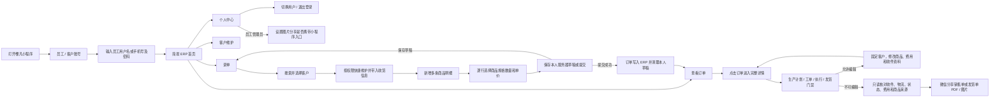

# 小程序员工简易 ERP 操作手册（PR-566 / PR-569 / PR-572 / PR-573 / PR-575）

关联需求：`PR-572-MINIAPP-ORDER-DETAIL-DOCUMENT-SHARE`、`PR-573-MINIAPP-ORDER-CATALOG-EDIT`、`PR-575-MINIAPP-SHARE-IMAGE-ENTRANCE-SETTING`。

## 适用角色

- 销售员工：需配置 `sales` 角色以及查看、录入订单和维护客户权限；只能修改本人负责的客户。
- 管理员：需配置 `admin` 角色；可维护全部客户资料和客户负责人。
- 客户账号、生产/仓库/财务等未授权员工不能进入本工作台。

## 业务流程

## 前置条件

1. 在 ERP“公司设置 → 员工”中创建并启用员工，填写不重复的手机号。
2. 为员工设置登录密码，账号未被禁用。
3. 在“用户权限”中分配销售或管理员角色。
4. 客户、商品、订单类型、收款状态和发货状态等基础资料已维护；销售员工需有 `customers.read/customers.write`，客户负责人使用启用中的内部员工。
5. 要在小程序录入的商品和具体规格已经进入该客户当前默认的已发布价格表；只在商品档案启用、但尚未发布到当前价格表的商品不会成为小程序录单候选。

## 登录

1. 打开小程序，选择“员工 / 客户账号”。
2. 输入员工姓名或手机号以及密码。
3. 点击“登录”。
4. 成功后首页显示“员工姓名 · 简易 ERP”，并显示“录单”“查看订单”和“客户维护”等本人有权使用的入口。
5. 登录令牌在当前环境内安全保存且每次进入首页都会由服务端重新校验；令牌仍有效时再次打开或更新小程序会直接进入员工首页，不会重复要求输入密码。

## 个人中心与切换账号

1. 员工首页固定显示“个人中心”，进入后显示当前员工，并提供“切换用户”和“退出登录”。
2. 点击任一账号退出按钮都会清除当前 production 或 development 环境的本机令牌，并返回登录页；不会退出另一环境，也不会修改 ERP 员工账号。
3. 重新进入员工工作台时选择“员工 / 客户账号”，使用员工用户名或手机号及 ERP 密码登录。默认“手机号快捷登录”按客户身份登录，不能用来切换到员工身份。
4. 员工个人中心不显示客户专用的客户切换、工厂商品表、我的商品和客户底部导航，避免误入客户接口。
5. 只有员工管理员且具备系统设置权限时，个人中心显示“分享图片时携带小程序入口”。普通销售、客户账号和缺少设置权限的账号不显示该区域；前端隐藏不是权限边界，服务端仍会拒绝伪造保存请求。
6. 开启后，所有员工之后通过订单详情直接分享的销售单、发货单图片会携带小程序入口；关闭后不携带。该值保存在服务器，是全局开关，不是当前手机的本地设置；配置尚未保存时默认保持原行为（携带入口）。
7. 切换开关会立即保存。保存成功后页面提示“分享设置已保存”；保存失败会恢复上次服务端值。普通网络或读取失败时开关保持禁用，可点击“重试”，不会清空仍有效的员工登录或把未知值误保存为关闭；如果认证已经失效，系统会清除失效会话并返回登录页。
8. 每次 PNG 分享前都会重新读取全局值，所以其他管理员修改后无需所有员工重新登录。修改设置会进入操作日志；只读取设置和分享已有图片不会写业务日志。

## 客户维护

1. PR-569-MINIAPP-CUSTOMER-DRAFTS-MULTI-ITEM：销售和管理员可以从员工工作台新增客户，也可以在录单选中客户后直接打开客户维护，不需要退出当前订单。
2. 销售新增客户时，负责人由系统固定为当前登录员工；销售不能把负责人改成自己以外的员工，也不能通过输入客户 ID 修改他人负责客户。
3. 销售只能保存本人负责客户。选中其他员工负责客户时仍可按既有录单权限使用该客户，但资料为只读；管理员可修改全部客户字段并调整负责人。
4. 维护客户名称、公司、联系人、电话、地址、客户类型、默认来源和默认订单类型等资料，并补齐页面标注的必填项后保存。合法保存会写操作日志；权限不足返回 403，不会修改客户或伪造日志。
5. 从录单页保存客户后仍停留在当前订单，并立即更新客户名称和默认来源、默认订单类型。本单收货资料未手动改过时会同步客户最新资料；已经手动改过时，页面会询问“同步”或“保留本单”。提交订单前再次核对本单收货快照，客户档案后续变化不会回改已保存订单。

## 录单

1. 点击“录单”。
2. 页面打开时订单日期默认为上海时区当天；如需补录或预录，点击日期修改。
3. 点击“客户”，输入客户名称、拼音全拼或首字母搜索；列表最多显示 20 条，可继续输入关键词缩小范围。
4. 选择客户后，系统一次性带入本单的收货人、联系电话、收货单位和收货地址。带入顺序以客户联系人/电话/收货地址/公司名称为先，缺失时再使用客户名称或公司资料；这些内容可按本次订单修改，不会回写客户档案。
5. 如需补齐客户资料，点击当前客户的“维护客户”。销售只有在本人是客户负责人时可保存，管理员可维护全部客户；保存后返回本张订单。
6. 页面默认已有“商品 1”，点击该行“选择商品”。商品选择层只显示该客户当前默认已发布价格表中的公共商品和客户专属商品，可输入商品名称、客户别名、拼音、商品或 SKU 编码、规格文字搜索，也可以在“全部、熟豆、挂耳、生豆、速溶咖啡”之间筛选。搜索和分类可同时使用。
7. 商品列表中每个商品只显示一条，同时显示当前价格表内可售规格的数量和摘要。商品名称不包含规格，例如“乌拉嘎”只显示一次；“红岩”等商品即使档案启用，只要没有进入该客户当前默认已发布价格表，就不会显示。
8. 选择商品后，在该行独立“规格”下拉中选择已有具体 SKU，例如 `18g、100g、227g、454g、500g、1Kg`；填写该行数量和销售单价。每行商品、规格、数量和单价互相独立。
9. 在最后一条商品明细下方点击“新增商品”录入其他明细，不需要返回商品区顶部；页面只保留这一个新增入口。可编辑或删除任意行。页面底部“商品估算合计”按全部有效行计算；当前页面不单独展示每行小计，提交前逐行核对商品、规格、数量、销售单位和单价。
10. 切换客户后，系统会重新加载新客户当前默认已发布价格表，并逐行检查商品、规格和价格表版本。加载完成前不能继续使用上一客户的商品选择结果；不可用于新客户的商品必须重新选择，不能把上一客户专属商品、历史价格表商品或无价规格直接提交。
11. 按需修改收货信息、填写备注。尚未确认时点击“保存草稿”；确认全部内容后点击“提交订单”。
12. 提交成功后页面显示 ERP 生成的订单号。全部有效商品行写入同一张后台订单，订单责任人取客户档案当前负责人，不取本次录单员工；服务端同时清理当前员工草稿。

## 保存和恢复订单草稿

1. 每名登录员工只有一份服务器录单草稿。销售与管理员都只能保存、读取和清理自己的草稿，管理员不会看到其他员工草稿。
2. 点击“保存草稿”会覆盖本人上一份草稿，保存订单日期、客户、收货信息、备注、全部商品明细和明细顺序；收款、发货等状态由系统默认处理，不在当前录单页选择。
3. 离开录单页、重新进入或重新登录后，系统恢复本人草稿；逐行核对客户、商品、规格、数量和单价后再继续编辑或提交。
4. 保存草稿不会生成订单号，也不会进入生产、库存、发货或财务。需要放弃时点击“清除草稿”；正式提交成功后服务端自动清理，不需要再次手工删除。
5. 草稿恢复时仍会按当前客户、商品启用状态和权限重新校验；过期或不再可用的资料需修正后才能提交，系统不能用旧草稿绕过当前业务校验。

## 查看订单

1. 点击“查看订单”。
2. 可按订单号或客户关键字查询。
3. 列表显示订单日期、客户、金额、收款、发货和生产状态。
4. 点击订单卡片进入完整详情，不再只看列表概要。详情展示订单号、单据日期、订单日期、客户与收件资料、物流、收款/发货/生产/开票状态、商品与各项费用、订单备注、责任人和创建人；符合生产前门禁时，页面顶部还会显示“编辑订单”。
5. 每条商品明细可核对商品名、规格、数量、销售单位、单价、行总价、条目备注、价格表版本、报价来源和生产来源；这些内容与网页订单详情使用同一订单数据，不在小程序中另存副本。
6. 详情顶部的首个业务卡片提供“销售单 PDF”“销售单图片”“发货单 PDF”“发货单图片”，无需滑到详情底部。这里的发货单对应 ERP 的出库单；未发货订单不能生成正式发货单。
7. 点击分享时，系统优先复用该订单最新正式版本；没有正式版本时才按当前订单快照生成，并把生成动作写入操作日志。查看、下载或再次分享已有版本不会新增版本，也不会重复写生成日志。
8. PDF 下载到微信临时目录后调用微信文件分享；图片下载后打开微信图片分享菜单，并按管理员个人中心的全局设置明确决定图片消息是否携带小程序入口。设置读取异常时会提示并安全回落为“不携带入口”。当前微信版本不支持直接分享时，PDF 改为“打开文档并通过右上角发送”，图片改为预览后长按或使用右上角菜单发送；该预览回退菜单没有可传的入口参数，实际结果由微信客户端控制。
9. 销售只能看到并下载本人负责的订单；管理员可查看全部订单。范围由后端固定校验，不能通过修改订单 ID 越权读取详情或文件；客户账号不能使用员工详情与分享接口。

## 编辑生产前订单

1. 从“查看订单”进入详情。只有正常、未发货，并且尚未进入生产计划、未生成生产工单、未开始任何生产执行的订单显示可用“编辑订单”入口；已进入任一后续环节时详情继续可查，但不能编辑。
2. 点击详情顶部“编辑订单”进入录单式编辑页。原订单客户固定显示为只读，不能切换客户，也不能在编辑态打开客户档案修改；确需更换客户时应按业务流程失效旧单并新建订单。
3. 编辑页按原客户重新读取当前默认已发布价格表。可以增删商品行并修改具体规格、数量、成交价，同时维护运费、优惠、收件人、联系电话、收货单位、地址和订单备注。成交价人工变化会作为本次订单价格覆盖留痕。
4. 历史订单行若使用的规格已不在当前价格表，会按原冻结内容回显并标记为历史规格，但不能再次从候选中选择；保存前删除该行或替换为当前价格表中的可售规格。
5. 点击“保存修改”后，服务端会再次检查员工订单范围、写权限和订单实时状态。页面打开后如果另一端已经进入生产计划、生成工单、开始执行或发货，保存返回冲突，订单头、商品、费用和收件资料都不会部分写入；刷新详情后按最新状态处理。
6. 保存成功回到订单详情，并以更新后的商品、费用、收件和备注作为当前内容。修改前的销售单/发货单版本只保留历史追溯，不再作为当前版本；下次导出会基于修改后的订单快照生成新正式版本。
7. 合法编辑写入操作日志，可按员工和订单号追溯修改前后摘要；权限不足、目录无效或状态冲突等被拒绝请求不会写成成功编辑记录。

## 结果校验

- 新订单可在 ERP 后台“订单 → 查看订单”中按订单号查到。
- 一张多商品订单在后台只显示一个订单号，商品明细数量、顺序、规格、数量、单价和小程序提交一致。
- 订单责任人应为客户档案负责人；录单员工和客户负责人不同时，不能把订单责任人误写为录单员工。
- 销售账号看不到其他销售负责的订单。
- 销售只能保存本人负责客户；管理员改派负责人后，销售修改范围立即随负责人变化。
- 保存草稿后后台正式订单列表不增加；正式提交成功后再次进入录单不再恢复已提交草稿。
- 订单列表点击任一订单后，可看到网页详情中的收件、物流、状态、费用、完整商品明细、报价来源和生产来源等只读信息。
- 已生成的销售单和已发货订单的发货单可分别按 PDF、图片下载并调起微信分享；分享的是登录后临时下载的真实文件，不暴露公共下载链接。
- 首次生成正式单据会新增对应版本并写操作日志；重复打开或分享最新版不会继续增加版本或生成日志。
- 允许编辑的生产前订单保存后，详情中的商品、成交价、运费、优惠、收件信息和备注应与编辑提交一致；旧单据版本不再显示为当前版本。

## 常见异常

- “账号或密码不正确”：检查员工姓名/手机号、密码及员工启用状态。
- 打开小程序直接进入员工首页：当前环境的员工登录令牌仍有效，这是正常的会话恢复；需要换账号或重新登录时进入首页“个人中心”，点击“切换用户”或“退出登录”。
- “当前员工无此权限”：为员工分配销售或管理员角色，并确认具有查看、录入订单权限。
- “只能修改本人负责的客户”：当前客户负责人不是本销售；继续只读录单，或由管理员修改客户/调整负责人。不要通过修改请求参数绕过。
- “请选择客户”：先选择客户，系统才会筛选客户专属商品并带入收货信息。
- “请选择商品和规格”：先确认具体 SKU/销售规格已经进入该客户当前默认已发布价格表，再重新进入录单页；只启用商品档案或只存在历史价格表仍不会成为候选，规格不能在小程序中临时手填。
- “请填写正确数量”：数量必须大于零。
- “草稿保存失败”：检查网络和登录状态后重试；失败时不要假定草稿已经覆盖，重新进入录单确认服务端草稿内容。
- 草稿恢复后某行商品不可用：客户、客户商品或 SKU 已变化；重新选择当前客户可用商品和规格后再保存或提交。
- “录单数据加载失败”：页面会保留当天日期并显示“重试”，排除网络问题后点击重试；不要把空白客户或商品列表当作资料为空。
- “登录已失效，请重新登录”：点击“重新登录”，使用员工账号重新进入；未授权请求不会返回客户、商品或价格资料。
- “当前员工无此权限”：当前登录仍有效，不需要退出；联系管理员补齐录单权限后点击“重试”。权限不足响应同样不会返回客户、商品或价格资料。
- 客户或商品搜索不到：先清空搜索词和商品分类，再确认客户已启用，并确认商品/规格已经进入该客户当前默认已发布价格表；公共商品也必须有适用于该客户的当前默认发布，不能只凭商品档案启用状态显示。
- 同一商品出现多个规格：这是正常的具体 SKU 列表；商品选择层只选一次商品，再在独立规格下拉中选择本单规格。
- 切换客户后商品被清空：原商品属于上一客户且不对新客户开放，请重新选择公共商品或新客户专属商品。
- 提交后网络中断：先在“查看订单”按客户或时间确认是否已生成，避免重复提交。
- “订单详情加载失败”或订单不存在：先确认订单仍有效且属于当前员工负责范围；管理员可查看全部订单，销售不能查看他人负责订单。
- “销售单尚未生成”：保持登录并重试分享；系统会在有生成权限时创建正式版本。若仍失败，在 ERP 网页订单列表检查订单资料和操作日志。
- “订单未发货，不能生成发货单”：先在 ERP 完成发货状态、物流和出库信息，再回到小程序分享发货单。
- “订单已进入生产或发货流程，不能编辑”：页面打开后订单可能已由另一端进入生产计划、生成工单、开始执行或发货；刷新详情核对最新状态，不要重复提交。系统不会保留本次被拒绝的部分修改。
- PDF 无法直接调起分享：微信基础库或客户端版本不支持直接文件分享时，页面会打开 PDF；点击右上角菜单发送给客户。
- 图片无法直接调起分享：页面会打开图片预览；长按图片或使用右上角菜单发送给客户。
- 个人中心看不到分享图片开关：该开关只对员工管理员开放；确认当前为员工身份、角色含管理员并具有系统设置权限。普通销售仍会按管理员保存的全局值分享。
- 分享设置加载失败：点击个人中心设置区的“重试”；订单图片分享时若临时读取失败，系统会提示并按不携带入口处理。不要把低版本微信的图片预览菜单结果当作直接分享接口的验收结果。
- 客户已经收到的旧图片仍有小程序入口：开关只影响修改后新生成的微信图片消息，不能追溯修改客户聊天中的历史消息；图片文件本身不会重生成。
- 文件下载失败：检查登录状态、网络，以及微信公众平台是否已把当前环境域名同时加入 `request` 和 `downloadFile` 合法域名。

## 小程序版本更新与导入

- 服务器发布与微信小程序包发布是两条独立链路。ERP development/production 部署成功，不代表微信中的小程序已经更新。
- `DEV-568-FIXED-ARTIFACTS`：开发联调固定导入 `/Users/yiiiple-work/KFerp-miniapp-mp-weixin-dev`；正式上传固定导入 `/Users/yiiiple-work/KFerp-miniapp-mp-weixin`。不要导入 PR 临时 worktree、旧 `miniapp/dist` 或另一环境目录。
- `DEV-568-CLIENT-ENVIRONMENT-GUARD`：开发包所有页面显示“开发环境 · 测试数据”。如果看到“开发包禁止正式使用”，说明 development 包被放进了微信正式版，客户端已经阻断请求；应立即撤回并上传 production 固定目录中的包。
- `DEV-568-STORAGE-BOUNDARY`：开发版和正式版分别保存登录令牌与豆单缓存。升级到本版本后旧的无环境登录令牌不会迁移，首次进入时需要重新登录一次，这是正常的安全隔离。
- 上传或预览前打开固定目录的 `RELEASE_INFO`：开发包应为 `environment=development`、`api_base=https://dev.qacoohee.com/app`；正式包应为 `environment=production`、`api_base=https://erp.qacoohee.com/app`。同时核对 commit 与目标分支提交一致。
- 小程序默认开启域名校验。两个域名都必须同时配置为微信公众平台的 `request` 和 `downloadFile` 合法域名；不把关闭校验作为日常联调或发布方式。
- 本节对应 `PR-568-MINIAPP-ENVIRONMENT-SEPARATION`，部署完成后仍需在微信开发者工具人工预览/上传，正式版还需在微信公众平台审核发布。

## 数据影响

- 录单直接生成正式 ERP 销售订单，会进入后续生产、库存、发货和财务流程。
- 本功能不创建独立的小程序订单副本。
- 服务器草稿是当前员工未提交订单的暂存记录，不是正式销售订单，不生成订单号或下游单据；正式提交成功后由服务端清理。
- 客户新增、客户修改、负责人变化、草稿保存和草稿清理等业务写操作进入操作日志。
- 生产前订单合法编辑进入操作日志；编辑失败或并发状态冲突不写成功编辑记录。
- 首次生成销售单 PDF/图片或发货单 PDF/图片会创建正式文档版本；销售单 PDF 与图片沿用既有独立版本，发货单 PDF 与图片由同一次快照共同生成。历史只有 PDF 的发货单不会被后台静默补图，需要重新生成新版后才可分享图片。
- 订单详情读取、文件下载和再次分享属于只读操作，不新增操作日志；服务端会在读取订单详情和文件之前重新校验员工权限与订单归属。
- 管理员修改“分享图片时携带小程序入口”会在同一事务内保存全局配置和操作日志，可按“小程序设置”、操作者或配置名称查到旧值与新值；保存失败时两者都不提交。
- 订单编辑成功后，保存前生成的销售单/发货单版本只保留历史审计用途，不再作为当前订单内容；重新导出使用修改后的订单快照。

## 构建与微信发布

1. 开发和生产发布统一从仓库根目录运行 `deploy_orderapp.sh`。Mac 只传输已提交源码；npm、Go、Vue/UniApp 和 Docker 的重型测试与构建均在服务器加锁后串行执行。
2. development 脚本把开发包同步到 `/Users/yiiiple-work/KFerp-miniapp-mp-weixin-dev`，production 脚本把正式包同步到 `/Users/yiiiple-work/KFerp-miniapp-mp-weixin`。
3. 导入后清理缓存并编译，按 `RELEASE_INFO` 核对环境、接口地址和提交；开发版还应看到持续环境标识。
4. 服务器部署成功不会自动更新微信版本。开发包可人工预览或上传开发/体验版本；production 包才可提交审核和发布，并记录小程序新旧版本号和回滚点。
