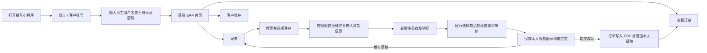

# 小程序员工简易 ERP 操作手册（PR-566 / PR-569-MINIAPP-CUSTOMER-DRAFTS-MULTI-ITEM）

## 适用角色

- 销售员工：需配置 `sales` 角色以及查看、录入订单和维护客户权限；只能修改本人负责的客户。
- 管理员：需配置 `admin` 角色；可维护全部客户资料和客户负责人。
- 客户账号、生产/仓库/财务等未授权员工不能进入本工作台。

## 业务流程

## 前置条件

1. 在 ERP“公司设置 → 员工”中创建并启用员工，填写不重复的手机号。
2. 为员工设置登录密码，账号未被禁用。
3. 在“用户权限”中分配销售或管理员角色。
4. 客户、商品、订单类型、收款状态和发货状态等基础资料已维护；销售员工需有 `customers.read/customers.write`，客户负责人使用启用中的内部员工。

## 登录

1. 打开小程序，选择“员工 / 客户账号”。
2. 输入员工姓名或手机号以及密码。
3. 点击“登录”。
4. 成功后首页显示“员工姓名 · 简易 ERP”，并显示“录单”“查看订单”和“客户维护”等本人有权使用的入口。

## 客户维护

1. PR-569-MINIAPP-CUSTOMER-DRAFTS-MULTI-ITEM：销售和管理员可以从员工工作台新增客户，也可以在录单选中客户后直接打开客户维护，不需要退出当前订单。
2. 销售新增客户时，负责人由系统固定为当前登录员工；销售不能把负责人改成自己以外的员工，也不能通过输入客户 ID 修改他人负责客户。
3. 销售只能保存本人负责客户。选中其他员工负责客户时仍可按既有录单权限使用该客户，但资料为只读；管理员可修改全部客户字段并调整负责人。
4. 维护客户名称、公司、联系人、电话、地址、客户类型、默认来源和默认订单类型等资料，并补齐页面标注的必填项后保存。合法保存会写操作日志；权限不足返回 403，不会修改客户或伪造日志。
5. 从录单页保存客户后仍停留在当前订单，并立即更新客户名称和默认来源、默认订单类型。本单收货资料未手动改过时会同步客户最新资料；已经手动改过时，页面会询问“同步”或“保留本单”。提交订单前再次核对本单收货快照，客户档案后续变化不会回改已保存订单。

## 录单

1. 点击“录单”。
2. 页面打开时订单日期默认为上海时区当天；如需补录或预录，点击日期修改。
3. 点击“客户”，输入客户名称、拼音全拼或首字母搜索；列表最多显示 20 条，可继续输入关键词缩小范围。
4. 选择客户后，系统一次性带入本单的收货人、联系电话、收货单位和收货地址。带入顺序以客户联系人/电话/收货地址/公司名称为先，缺失时再使用客户名称或公司资料；这些内容可按本次订单修改，不会回写客户档案。
5. 如需补齐客户资料，点击当前客户的“维护客户”。销售只有在本人是客户负责人时可保存，管理员可维护全部客户；保存后返回本张订单。
6. 页面默认已有“商品 1”，点击该行“选择商品”。商品选择层只显示公共商品和该客户商品，可输入商品名称、客户别名、拼音、商品或 SKU 编码、规格文字搜索，也可以在“全部、熟豆、挂耳、生豆、速溶咖啡”之间筛选。搜索和分类可同时使用。
7. 商品列表中每个商品只显示一条，同时显示商品分类、可选规格数量和规格摘要。商品名称不包含规格，例如“乌拉嘎”只显示一次。
8. 选择商品后，在该行独立“规格”下拉中选择已有具体 SKU，例如 `18g、100g、227g、454g、500g、1Kg`；填写该行数量和销售单价。每行商品、规格、数量和单价互相独立。
9. 点击“新增商品”录入其他明细；可编辑或删除任意行。页面底部“商品估算合计”按全部有效行计算；当前页面不单独展示每行小计，提交前逐行核对商品、规格、数量、销售单位和单价。
10. 切换客户后，系统会逐行重新检查公共商品和客户商品范围。不可用于新客户的商品必须重新选择，不能把上一客户专属商品直接提交。
11. 按需修改收货信息、填写备注。尚未确认时点击“保存草稿”；确认全部内容后点击“提交订单”。
12. 提交成功后页面显示 ERP 生成的订单号。全部有效商品行写入同一张后台订单，订单责任人取客户档案当前负责人，不取本次录单员工；服务端同时清理当前员工草稿。

## 保存和恢复订单草稿

1. 每名登录员工只有一份服务器录单草稿。销售与管理员都只能保存、读取和清理自己的草稿，管理员不会看到其他员工草稿。
2. 点击“保存草稿”会覆盖本人上一份草稿，保存订单日期、客户、收货信息、备注、全部商品明细和明细顺序；收款、发货等状态由系统默认处理，不在当前录单页选择。
3. 离开录单页、重新进入或重新登录后，系统恢复本人草稿；逐行核对客户、商品、规格、数量和单价后再继续编辑或提交。
4. 保存草稿不会生成订单号，也不会进入生产、库存、发货或财务。需要放弃时点击“清除草稿”；正式提交成功后服务端自动清理，不需要再次手工删除。
5. 草稿恢复时仍会按当前客户、商品启用状态和权限重新校验；过期或不再可用的资料需修正后才能提交，系统不能用旧草稿绕过当前业务校验。

## 查看订单

1. 点击“查看订单”。
2. 可按订单号或客户关键字查询。
3. 列表显示订单日期、客户、金额、收款、发货和生产状态。
4. 销售只能看到本人负责的订单；管理员可看到全部订单。范围由后端固定校验，不能在小程序中切换越权。

## 结果校验

- 新订单可在 ERP 后台“订单 → 查看订单”中按订单号查到。
- 一张多商品订单在后台只显示一个订单号，商品明细数量、顺序、规格、数量、单价和小程序提交一致。
- 订单责任人应为客户档案负责人；录单员工和客户负责人不同时，不能把订单责任人误写为录单员工。
- 销售账号看不到其他销售负责的订单。
- 销售只能保存本人负责客户；管理员改派负责人后，销售修改范围立即随负责人变化。
- 保存草稿后后台正式订单列表不增加；正式提交成功后再次进入录单不再恢复已提交草稿。

## 常见异常

- “账号或密码不正确”：检查员工姓名/手机号、密码及员工启用状态。
- “当前员工无此权限”：为员工分配销售或管理员角色，并确认具有查看、录入订单权限。
- “只能修改本人负责的客户”：当前客户负责人不是本销售；继续只读录单，或由管理员修改客户/调整负责人。不要通过修改请求参数绕过。
- “请选择客户”：先选择客户，系统才会筛选客户专属商品并带入收货信息。
- “请选择商品和规格”：先维护并启用商品的具体 SKU/销售规格，再重新进入录单页；规格不能在小程序中临时手填。
- “请填写正确数量”：数量必须大于零。
- “草稿保存失败”：检查网络和登录状态后重试；失败时不要假定草稿已经覆盖，重新进入录单确认服务端草稿内容。
- 草稿恢复后某行商品不可用：客户、客户商品或 SKU 已变化；重新选择当前客户可用商品和规格后再保存或提交。
- “录单数据加载失败”：页面会保留当天日期并显示“重试”，排除网络问题后点击重试；不要把空白客户或商品列表当作资料为空。
- “登录已失效，请重新登录”：点击“重新登录”，使用员工账号重新进入；未授权请求不会返回客户、商品或价格资料。
- “当前员工无此权限”：当前登录仍有效，不需要退出；联系管理员补齐录单权限后点击“重试”。权限不足响应同样不会返回客户、商品或价格资料。
- 客户或商品搜索不到：先清空搜索词和商品分类，再确认客户/商品已启用；客户商品必须先选择其所属客户，公共商品对所有客户可见。
- 同一商品出现多个规格：这是正常的具体 SKU 列表；商品选择层只选一次商品，再在独立规格下拉中选择本单规格。
- 切换客户后商品被清空：原商品属于上一客户且不对新客户开放，请重新选择公共商品或新客户专属商品。
- 提交后网络中断：先在“查看订单”按客户或时间确认是否已生成，避免重复提交。

## 小程序版本更新与导入

- 服务器发布与微信小程序包发布是两条独立链路。ERP development/production 部署成功，不代表微信中的小程序已经更新。
- 微信开发者工具固定导入 `/Users/yiiiple-work/KFerp-miniapp-mp-weixin`，不要再导入 PR 临时 worktree 或旧 `miniapp/dist` 目录。
- 正式服务器构建完成后，发布流程会把 production `mp-weixin` 产物同步到固定目录。开发者工具应清理缓存并重新编译，再做预览、上传、审核和正式发布。
- 上传前核对固定目录中的接口地址为 `https://erp.qacoohee.com/app`，并记录上一正式版本、本次上传版本和对应服务器提交，便于服务器与微信版本分别回滚。

## 数据影响

- 录单直接生成正式 ERP 销售订单，会进入后续生产、库存、发货和财务流程。
- 本功能不创建独立的小程序订单副本。
- 服务器草稿是当前员工未提交订单的暂存记录，不是正式销售订单，不生成订单号或下游单据；正式提交成功后由服务端清理。
- 客户新增、客户修改、负责人变化、草稿保存和草稿清理等业务写操作进入操作日志。

## 构建与微信发布

1. 开发和生产发布统一从仓库根目录运行 `deploy_orderapp.sh`。Mac 只传输已提交源码；npm、Go、Vue/UniApp 和 Docker 的重型测试与构建均在服务器加锁后串行执行。
2. 生产脚本会把正式 `mp-weixin` 产物同步到 `/Users/yiiiple-work/KFerp-miniapp-mp-weixin`。微信开发者工具必须导入这个固定目录，不再使用临时 worktree 或历史 `miniapp/dist/build/mp-weixin`。
3. 导入后清理缓存并编译，确认请求地址为 `https://erp.qacoohee.com/app`。
4. 服务器部署成功不会自动更新微信版本。必须在微信开发者工具上传，然后到微信公众平台提交审核并发布；记录本次服务器提交、小程序新旧版本号和回滚点。
