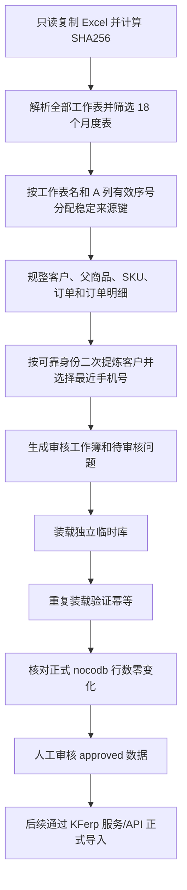

# 咖啡销售历史数据清洗与临时库操作手册

## 适用范围
- 适用角色：数据整理人员、数据库管理员、KFerp 实施人员。
- 数据源：服务器 `/data/orderlist.xlsx`。
- 当前范围：2025-01 至 2026-06 月度表。
- 本流程只生成审核候选并写入独立数据库 `kferp_orderlist_staging`，不得直接写正式客户、商品或订单。

## 流程图

## 来源键规则
- 业务键为 `source_sheet_name + ':' + source_sequence_effective`。
- A 列第一次出现的序号保留原值；同表后续重复值按物理顺序追加 `1-9`。
- 增量运行必须传入上次的 `source-key-mapping.json`，同一内容指纹沿用原后缀，物理行移动不改变来源键。
- 物理行号只用于回到 Excel 定位。空序号、非整数、后缀冲突或超过可分配范围的行只进入审核，不生成订单候选。

## 标准步骤
1. 记录正式生产客户、商品、订单和订单明细行数，作为零写入基线。
2. 只读复制源文件，记录文件大小、修改时间和 SHA256；不得直接修改 `/data/orderlist.xlsx`。
3. 运行 `cmd/orderlist-staging`，指定处理月份、ERP 只读参考快照和受保护输出目录。
4. 首次运行生成 `source-key-mapping.json`；增量运行使用 `-previous-mapping` 复用既有序号后缀。
5. 打开审核工作簿，先进入 `客户导入审核`：确认客户名称、客户类型、主电话、默认来源、默认订单类型和负责人；再处理其他 Sheet 的序号、商品规格、金额和日期问题。
6. 在生产 PostgreSQL 实例创建独立角色和数据库 `kferp_orderlist_staging`，依次执行 `schema.sql` 和 `load.sql`。
7. 再次执行同一 `load.sql`，确认订单、明细和修订数量没有意外增长。
8. 再次读取正式生产四张业务表行数，必须与步骤 1 完全一致。
9. 生成临时库备份并把源文件副本、哈希清单、中间文件和审核工作簿保存在本批次受保护目录。

## 审核口径
- `auto_ready`：规则可确定，但仍未正式导入。
- `needs_review`：必须人工确认。
- `approved`：人工确认后，才可进入后续正式导入流程。
- `excluded`：明确排除，不进入正式导入。
- 客户名称看起来像地址、配送说明或含手机号时必须审核；不得把地址自动建成客户名称。
- `客户导入审核` 是正式客户导入前的临时 Sheet。蓝色区域对应 KFerp 客户 API 字段，黄色字段需要人工确认；审核动作本身不写正式客户表。
- 客户身份优先按生产 ERP 唯一手机号、开发 ERP 唯一手机号、可靠规范名称识别。短姓名、泛称、地址、自提和送货说明不用于自动跨号码合并。
- 同一客户有多个历史号码时，主电话取最近订单记录中的唯一有效号码；`历史号码`、`历史名称` 和来源订单键不得删除。最近记录有多个号码时必须人工选择。
- 新客户的 `customer_type` 不自动推测；历史来源名称与生产 ERP 选项精确匹配时才带入默认来源，唯一有效负责人可以安全带入，其他下拉值必须人工确认。
- 商品包装单位或净含量不明确时保持原文，不推测袋、盒、箱或重量。

## 结果校验
- 18 个纳入工作表、原始行、有效订单、订单明细和问题数量与运行报告一致。
- `curated.orders.source_order_key` 唯一。
- 相同源文件重复装载后候选数量不增长，`raw.order_revisions` 不增长。
- 正式 `nocodb` 客户、商品、订单和订单明细行数不变。
- 更新后的审核工作簿公式错误为 0，12 个工作表可打开并可筛选；`客户导入审核` 包含完整客户字段、历史号码和审核列。

## 常见问题
- **追加新订单后行号变化**：使用上次映射重跑，来源键按内容指纹复用，不依赖行号。
- **重复序号和真实序号冲突**：记录进入 `duplicate_suffix_collision`，人工决定新的有效序号后再导入。
- **手机号相同但名称不同**：只生成一个客户候选，全部名称留在客户别名表，由审核人员确认规范名。
- **同一客户更换过手机号**：可靠名称或 ERP 匹配确认同一客户后，只把最近的唯一有效号码放入主电话；旧号码仍在 `历史号码` 中保留。
- **无手机号但名称相同**：默认不合并，避免把自提、送货或泛称误认为同一客户；由审核人员决定是否合并。
- **商品描述无法拆分**：保留原始商品行并标记 `product_line_needs_review`，禁止猜测规格。
- **需要正式导入**：本临时库不能直接复制到正式表，必须另开需求，通过 KFerp 服务/API 写入并留下操作日志。
