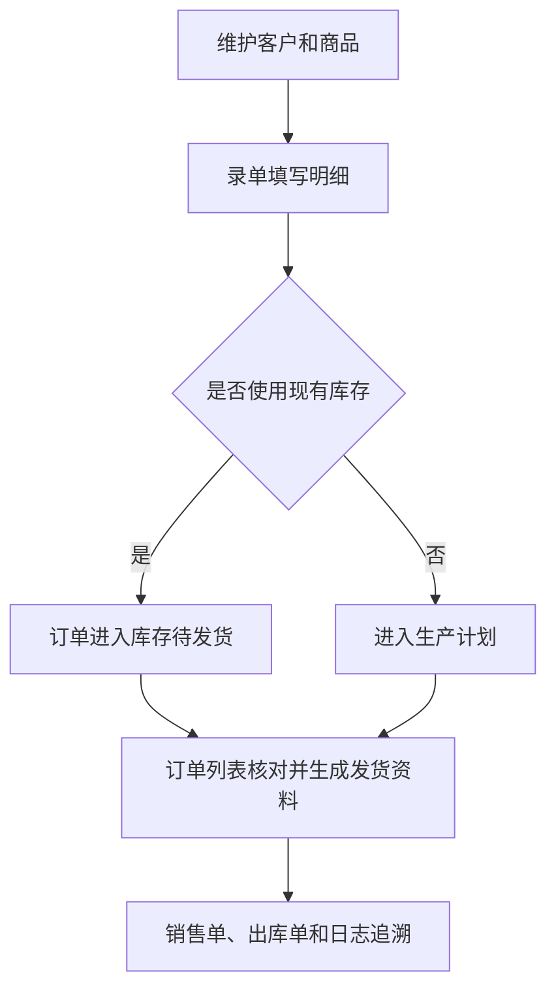

# 操作手册：订单与销售资料

## 适用范围
录单、订单列表、客户档案、销售单和出库单等销售前后台操作。

## PR-508 端到端链路验收口径
- PR-509-E2E-RAW-MATERIAL-ORDER-PRODUCTION-FLOW：下单验收必须使用可生产商品 / SKU 和已发布价格表快照。录单保存后，订单明细要保留具体销售规格、价格表版本和可进入生产计划的商品对象；库存不足时应能进入生产计划，而不是因父商品、历史模板或价格单位无法解析而丢失。
- 订单保存、修改和影响生产需求的用户操作都要能追溯到操作日志或订单业务日志；PR-508 浏览器验收要从订单回看生产来源和报价来源。

## 入口
- 订单：录单、订单列表
- 档案：客户档案
- 设置：物流设置

## 流程图

## 标准操作
1. 先维护客户档案，确认客户名称、联系方式、客户类型、默认来源、默认订单类型、客户负责人、结算信息和业务配置可用；客户档案列表点击客户名称打开右侧抽屉，不再通过单独“编辑”列进入。
2. 维护商品档案，确认商品资料、商品分组、销售规格模板、客户引用、价格表快照和 BOM/成本追溯资料准确；库存单位来自销售规格模板。
3. 进入录单页面，选择客户、商品、规格或单位、数量、单据日期、订单日期、发货和付款信息；来源、客户类型和订单类型只从客户资料读取并只读展示。熟豆和速溶咖啡商品仍按重量规格录单，挂耳商品选择“袋”或“盒”单位后按发布的挂耳价格梯度报价。当收款状态选择“已付款/已收款/已支付”时必须同步选择收款方式；当收款状态需要收款凭证时，还要分别填写货款金额、运费金额并上传凭证。当发货状态选择“已发货”时必须选择物流公司和物流产品。如单个商品有贴标、磨粉、特殊包装等说明，在该商品明细行填写“条目备注”；如该行需要优惠，可选择减免数额、单价优惠、折扣或免费。
4. 如使用零售自定义克数，确认规格、克数和折算价格符合当前规则。
5. 订单负责人不在录单时手工指定；系统会按客户档案中必填的客户负责人自动写入订单负责人快照，负责人只能是员工维护里的启用内部员工。
6. 保存订单后进入订单列表确认记录存在，核对金额、状态、负责人、备注和发货信息。
7. 在订单列表搜索框可输入订单号、客户名、负责人名称或快递单号，快速定位某个售前售后负责人负责的订单。
8. 需要对外销售资料时，在订单列表打开销售单或出库单抽屉，先核对 `报价来源` 和 `生产来源`，再预览并生成 PDF 或图片版本；同一客户多张订单需要合并收款或合并出库资料时，在订单列表用统一选择框勾选后生成组合销售单或组合出库单。

## 录单要点
- PR-439-PRODUCT-PRICE-MASTER-REMODEL / PR-500-UNIT-MODEL-CONSOLIDATION / PR-504-PARENT-PRODUCT-CHILD-SKU-UOM / PR-505-SALES-SPEC-TEMPLATE-DERIVED-SKU：录单单位、价格和子 SKU 只读取已发布商品价格表快照，不再从客户商品或旧模板兜底决定报价单位/录单单位。商品价格表发布时把当时的 `sku_id/sku_snapshot`、子 SKU 销售单位和销售规格模板库存单位固化到快照；价格表快照是什么子 SKU 和单位，订单行就是什么子 SKU 和单位。商品有效库存单位只用于库存、生产、BOM 产出和成本口径，不直接决定订单行销售单位。
- PR-440-PRODUCT-GROUP-PRICE-REMODEL：新业务不再有独立客户商品主数据；客户料号和客户显示名来自商品档案的 `客户引用` 子表。`客户引用` 只影响搜索、展示、打印和客户侧识别，不参与取价、单位、BOM 或分组。
- PR-440-PRODUCT-GROUP-PRICE-REMODEL：商品价格表是 Price List / Item Price 平铺价格行，订单保存时冻结价格表版本、最终价、价格单位、库存换算、分组快照、阶梯价模板来源和 Pricing Rule 版本。订单成交价不因后续 BOM、工单、原料批次或 Pricing Rule 修改自动变化。
- PR-342-ORDER-BACKFILL-DATES：录单页的“订单补录”区域有两个日期。`单据日期` 用于 ERP 制单、订单编号和内部出入库/销售单据口径；`订单日期` 用于客户真实下单或业务发生日期。普通录单也可以改两个日期；如果只是补录一张历史订单，把订单日期改成真实日期即可，单据日期可按今天或实际制单日保存。
- 新订单默认 `单据日期` 和 `订单日期` 都是当天；旧接口没有传单据日期时，系统自动用订单日期作为单据日期。订单号按单据日期生成，例如单据日期是 2026-05-23 时订单号前缀为 `SO-20260523-`。
- PR-348-ORDER-BACKFILL-CONTINUOUS-MODE：连续补录多张订单时，打开“订单补录”里的“连续补录”开关。点“保存并继续补录”后，页面会保留客户、单据日期、订单日期、收款方式、发货/物流设置、运费、取整和三类豆单版本，清空商品明细、快递单号、收款金额、收款凭证、订单备注、优惠和外协费用，继续录下一张；点“保存并查看订单”则按普通保存进入订单结果页。
- 如果只补录一张历史订单，不需要打开连续补录；直接修改 `订单日期`，必要时调整 `单据日期`，然后点“保存订单”。
- 客户输入框支持客户名、拼音和首字母搜索，选择后订单信息中只读展示客户类型、来源和订单类型；这三个字段只在客户资料维护，录单/编辑订单不再手工修改。
- 商品明细标题区点击“选择价格表”打开价格表选择抽屉，可按熟豆、生豆、挂耳分别选择已发布价格表版本。标题区会把当前使用的三个价格表按行展示，方便核对完整版本号和发布时间。客户有某类型专属价格表时可选不同已发布版本，默认最新；客户没有专属价格表时该类型使用公共价格表，也可以选择公共历史发布版本，默认最新公共价格表。
- PR-379-CHANNEL-PORTAL-WORKBENCH-SWITCH：录单价格表/豆单选择优先按商品自定义产品类型分组。选择商品后系统按该商品的 `product_type_category_id/product_type_name` 自动匹配同分类客户专属最新价格表；没有客户专属版本时回退公共同分类最新版本。旧 `commercial/green/drip` 只作为兼容 fallback，不能作为新增产品类型的硬编码枚举。
- PR-351-ORDER-ENTRY-PUBLIC-BEANLIST-NO-CUSTOMER：刚打开新建录单页、尚未选择客户时，商品明细标题区会先显示公共已发布价格表版本；如公共熟豆价格表已发布多个版本，可直接点“选择价格表”切换公共版本。选择客户后，系统会按客户专属价格表优先、无专属则公共价格表的规则重新同步。
- PR-350-BEAN-LIST-PUBLISH-MANUAL-WITHDRAW：录单只能选择状态为已发布的豆单；产品豆单中已手动撤回的版本不会出现在“选择豆单”抽屉，也不能作为新订单保存的豆单版本。发布新版豆单不会自动撤回旧版，所以仍处于已发布状态的旧版可以作为历史发布版本继续选择。
- PR-353-ORDER-ENTRY-HISTORICAL-BEANLIST-PRODUCT-TIERS：切换到仍处于已发布状态的历史熟豆/生豆豆单后，商品下拉会按该历史版本的发布快照展示商品和梯度；如果历史版本里有熟豆商品，不能因为最新版本覆盖而只显示生豆或其他类型商品。
- PR-352-INSTANT-COFFEE-PRODUCT-KIND：SKU设置中维护为“速溶咖啡”的商品，录单商品下拉会显示“速溶咖啡”标识；选择后按普通重量规格和商用价格梯度录单，不需要选择挂耳袋/盒单位，也不会要求生豆绑定。
- PR-362-PRODUCT-CONFIG-TEMPLATE：如果客户产品子类型绑定了客户自己的“商品配置”，录单仍只读取已发布产品价格表快照；商品配置影响的是生成和发布快照前的草稿内容。保存订单后，商品行记录实际命中的发布 ID、版本号、单价和单位快照，后续修改商品配置不会静默改历史订单价格。
- PR-505 后，录单商品接口会带出产品类型、产品子 SKU、销售规格模板库存单位、子 SKU 销售单位和价格表快照。前端选择商品时会把已发布价格表快照中的子 SKU 和价格单位带到数量栏；例如 `227g袋装` 是子 SKU，销售单位是 `袋`，`227g` 来自销售规格模板明细和 BOM，不写成 `袋/227g` 销售单位。系统用价格表快照保存订单销售单位和库存口径，用于小计、库存、生产需求和销售单单位展示。
- PR-345-ORDER-CUSTOMER-PROFILE-BEANLIST-DRAWER：客户资料中的客户类型、来源和订单类型为必填项。新增客户、编辑客户或保存订单时缺少任一项都会失败；先在客户资料补齐后再录单。订单保存时后端以客户资料为准写入来源和订单类型，不能用前端隐藏字段绕过。
- PR-324-FENNA-ORDER-ENTRY-CUSTOMER-BEAN-LIST-SCOPE：客户已有自己的熟豆/商用豆单时，录单商品下拉只展示该客户商用豆单发布快照中包含且带价格档的商品；公共商用商品和未发布到客户豆单的客户 SKU 不再可选。熟豆自动价读取发布快照中的 `commercial_wholesale_tiers`，例如芬纳咖啡两个定制产品应直接带出豆单磅价。
- PR-331-ORDER-ENTRY-PUBLIC-SKU-SCOPE：商品下拉还会读取 SKU 设置中的 `use_public_sku`。客户关闭“是否使用公共SKU”时，录单和修改订单不显示公共 SKU、其他客户 SKU 或其他客户豆单中的生豆 SKU；如果芬纳咖啡看到了岩师傅的 `孟连水洗A`、`红酒日晒-2026`，先检查芬纳是否误开启公共 SKU，关闭后重新进入录单。
- PR-340-ORDER-ENTRY-PRODUCT-DROPDOWN-LAYER：多条商品明细同时存在时，商品下拉会浮在规格输入、后续商品行和价格梯度按钮上方；如果商品下拉被后续商品行遮挡，先刷新页面确认前端版本，再重新打开该商品输入框。
- 保存订单会记录本单使用的价格表发布 ID 和版本号；商品行显示 `报价来源：价格表 {版本}`，用于后续追溯当时的报价和展示口径。订单详情和销售单页面还会只读展示 `报价来源`、`生产来源` 两块：报价来源来自价格表快照，生产来源来自工单/BOM/工序卡快照；生产来源变化只影响成本、毛利和追溯，不自动改已成交价格。
- 商品明细直接在商品输入框搜索商品，选择规格、数量后自动匹配梯度价；批发自动价按总重量折算磅数匹配豆单梯度，规格没有专属梯度时会使用该商品已有豆单梯度折算出单价和小计。选择一个商品后，系统会在明细列表底部自动补一个空明细行；已有空明细时不会因修改商品反复新增空行，仍可在列表下方点击“新增明细”手工加行。
- PR-325-ORDER-ENTRY-MATCHED-TIER-HIGHLIGHT：自动价命中后，价格提示按钮按行内 `tier_id` 实际命中的豆单梯度高亮；即使当前规格是 1000g 或 2.5kg、单价单位显示元/kg，只要价格来自 454g 磅价梯度折算，页面仍高亮对应的 454g 档位。
- 生豆商品录单时会保留 `green_bean` 形态；生豆订单价格和页面展示的梯度价只能来自所选生豆豆单版本的已发布价格档。缺少生豆豆单价格时保存会失败，不能用绑定熟豆阶梯价、同名熟豆 SKU 梯度或商品直连梯度兜底。
- 挂耳商品不使用熟豆重量规格控件；选择“袋”时规格显示为 `10g/袋`，选择“盒”时规格显示为 `10袋/盒`（以产品设置为准）。盒单会优先按发布的袋价梯度换算，没有可用袋价时才匹配盒价梯度。
- 挂耳订单明细会保存产品类型、销售单位、每盒袋数、每袋熟豆克重、匹配数量、价格来源和库存换算快照；后续编辑订单、订单列表、销售单和生产计划都以该快照为准，不受之后商品档案单位换算、价格模板或 BOM 修改静默影响。
- 批发单价单位优先跟随命中的豆单阶梯展示单位：KG 阶梯显示元/kg，磅价阶梯显示元/磅；只有阶梯没有明确展示单位时才按当前规格推断。1000g × 30 袋如果匹配到 48 元/磅档，页面显示 106 元/kg，小计 3180。
- 曲奇拼配等按 KG 设梯度的产品，梯度区间按该行总 kg 匹配，不按包装件数匹配；例如 2.5kg × 10 袋按 25kg 落档。
- 商品的 KG 梯度在价格提示中显示为 `kg` 区间；生豆豆单的销售单价跟随发布快照中的模板单位显示，KG 生豆模板显示为元/KG，例如 `1-59kg 51.75/kg`、`60kg+ 62/kg`。
- PR-339-ORDER-ENTRY-KG-TIER-UNIT-VERSION-WARNING：如果 KG 阶梯商品改为 80g、100g 等小包装，录单/编辑页仍显示元/kg，并按该行总 kg 计算小计；小计下方显示 `梯度 82/kg` 这类实际单价，不再显示梯度 ID。数量低于最低梯度时会红字提示“低于最低梯度”，系统按最低档价格试算但允许保存。
- 临时改价时按当前单价单位直接编辑单价，需要恢复自动价时点击单价旁的恢复按钮。
- 每条商品明细支持行级优惠：减免数额直接扣整行固定金额，单价优惠按当前单价单位逐单位扣减（零售按件数、挂耳按袋/盒数量、454g 等批发按总磅数、1000g/2.5kg 等按总 kg），折扣按输入比例计算（90=9折），免费会把该行应收小计置为 0。保存后行级优惠会汇总到订单优惠字段，订单列表和履约客户订单范围都能看到优惠金额和应收金额。
- 每条商品明细都有“条目备注”，用于记录只属于该商品的说明；保存后编辑订单会回显，并会带入销售单和出库单对应商品行。订单级“备注”仍用于整单说明，不要混用。
- 录单页面的订单合计会把物流费用一起计入，并在合计下方以小字展示货款金额和物流金额，便于保存前核对收款拆分。
- 录单和编辑订单的商品行会显示当前选中价格表版本；能从价格表选到商品时不应显示“未记录”。切换熟豆、生豆或挂耳价格表版本后，已有商品行会按当前选择的价格表发布 ID 重新取价并刷新版本号。如果该行使用的价格表不是当前客户、当前商品类型的最新发布版本，价格表版本会标红并显示感叹号，鼠标悬停或手机点击感叹号可看到“非最新价格表”提示。新订单保存后会记录价格表发布 ID 和价格表版本号，历史订单详情中只在旧数据确实缺失时才可能显示未记录。
- 收款方式是订单财务口径字段。订单状态为已付款、已收款或已支付时，录单/编辑保存会强制要求选择收款方式；状态改回未付款时系统不要求收款方式，并按未付款处理。
- 收款凭证是实收核对字段。订单状态为已收款时，接口会强制要求货款金额大于 0、运费金额已填写且已上传收款凭证；录单页对已付款、已收款和已支付状态都会显示货款金额、运费金额和凭证上传区，便于提前留档。
- 收款凭证上传后会默认收起，显示凭证摘要和更换入口；点击凭证摘要可打开大图预览，图片凭证直接看图，其他文件用预览框查看。
- 发货物流是发货核对字段。订单状态为已发货时，录单/编辑保存会强制要求选择物流公司和物流产品；物流公司和产品在 `设置 → 业务设置 → 物流设置` 维护，系统默认初始化顺丰、顺丰小件和顺丰大件。
- PR-346-ORDER-SALES-NOTES-VOUCHER-SKU-SORT：销售单结算区会把快递费备注、订单明细备注和销售单备注作为三类独立备注行展示；某类备注为空时不占行，三类同时有值时各起一行。销售单预览、PDF 和图片保持同一备注口径。
- PR-334-ORDER-ENTRY-GLOBAL-ERROR-TOAST：录单或编辑订单保存失败时，错误提示会在当前视口内全局弹出；即使页面停在底部点击“保存订单”，也能看到缺少收款凭证、物流信息、收款方式或商品明细等错误，处理后可点击提示右侧关闭。
- PR-335-ORDER-ENTRY-MOBILE-LAYOUT：手机上录单或编辑订单时，发货物流、收款凭证和商品明细会改为单列排布；收款凭证上传控件会显示“选择文件”和文件名，避免原生文件框裁切。遇到保存错误时，全局错误提示会贴合手机安全区完整展示。
- PR-336-MOBILE-NOTICE-STACK：手机上如果顶部有新订单通知，录单保存错误会自动下移到通知堆叠区下方；红色错误和绿色/信息通知分开显示，不会互相盖住。
- PR-337-ORDER-ENTRY-CUSTOMER-EDIT-VALIDATION：录单选择客户后，可在“新增客户”右侧点击“编辑客户”打开客户资料抽屉，维护客户名、公司信息、联系信息、客户类型、默认来源、默认订单类型和负责人并保存。保存订单时如果客户、收款方式、物流、收款凭证或商品明细缺失，系统会弹窗提示并滚动定位到对应字段标红；把该字段改正确后标红自动取消。
- PR-343-ORDER-NOTICE-DEDUP-PAYMENT-HINT：录单或编辑订单需要填写收款凭证时，货款金额栏会弹出“实时价格提示 货款 金额”作为货款提示，运费金额栏会弹出“实时价格提示 运费 金额”作为运费提示；点击提示会把当前商品合计或物流费用填入对应金额，之后仍可按实际收款修改。
- PR-344-ORDER-ENTRY-CUSTOMER-COMMON-PRODUCT-SORT：选择客户后，如果该客户有历史订单，商品下拉会优先展示常用商品。常用商品按该客户历史有效订单次数、明细次数和最近下单时间排序；没有历史订单时仍按原商品顺序展示。
- PR-341-ORDER-ENTRY-STALE-BEANLIST-AUTOLINE：商品行使用旧版价格表时会标红感叹号提示“非最新价格表”；商品明细按钮放在列表下方，选择商品后自动补一个空明细且全列表最多保留一个空明细。
- PR-342-ORDER-ENTRY-PUBLIC-BEANLIST-VERSION-SELECT：客户没有专属豆单时，对应熟豆、生豆或挂耳豆单下拉仍可选择公共豆单最新和历史发布版本；改选公共历史版本后，商品候选、梯度按钮、单价、小计和保存的豆单版本都按该公共版本快照计算。
- PR-349-ORDER-ENTRY-BEANLIST-SUMMARY-WARNING：商品明细标题区按行显示当前熟豆、生豆、挂耳豆单，避免长版本信息被省略；选择历史豆单后，行级价格和右侧豆单版本会同步到该版本，并用红色感叹号提示非最新版本。
- 客户负责人是订单归属口径字段，必须先在客户档案维护。录单页只展示当前客户负责人；客户资料没有负责人时订单保存会失败，需要回到客户档案补齐。
- 常用规格包括 36g、80g、100g、227g、454g、500g、1000g、2.5kg。
- 保存前如果成品库存批次或历史成品库存余额足够，系统会列出建议批次或 `LEGACY-FP-商品ID-规格`；选择使用后订单进入库存待发货，选择不使用则按库存不足进入生产计划。
- 录单页面只保存订单，通常不处理快递；如编辑历史订单需要补录快递单号，可在快递单号框输入一个或多个单号，多个单号用换行、逗号或分号分隔。
- 从侧边栏进入“录单”固定为新建订单；编辑历史订单应从订单列表打开订单详情抽屉或明确带订单 `edit_id` 的编辑入口进入，避免把新单误保存到旧订单上。
- PR-316-FORM-DRAFT-CACHE：录单、BOM配方维护、SKU设置 中录单新建表单使用会话内内存草稿；跳转到其他功能再回来时保留未提交表单，刷新浏览器后草稿清空。保存订单成功后，新建录单草稿会清空；编辑历史订单或复制订单不复用新建录单草稿。
- 订单生产完成、无需生产或库存待发货后，到订单列表勾选订单生成顺丰发货 Excel。
- 录单页可抽屉式新增客户，粘贴收件信息后点击“地址解析”可自动识别姓名、联系电话和地址；必须选择负责人后才能保存，保存后自动选中新客户。
- 客户档案抽屉也支持“地址解析”；解析后自动回填联系人、联系电话和地址，客户名默认取联系人，后续可继续手工修改。负责人下拉只包含启用的内部员工，不包含外部客户账号。
- 客户档案页可点击客户名称打开详情抽屉；抽屉内维护客户字段、统计和附件，底部不再嵌套二级客户列表。

## 客户档案附件
- 客户档案附件用于维护标签正面、标签背面和客户 Logo 等图片，支持 PNG/JPEG/WebP。
- 客户档案资产图片上传超过 8MB 时必须拒绝；运营人员应压缩到 8MB 内后再上传。
- 客户档案资产元数据保存失败时必须清理刚写入的文件，不会留下公开孤儿客户资产。
- 如果上传失败，先确认文件是图片格式，再检查图片大小和浏览器接口提示。

## 客户档案列表筛选与排序
- 客户档案列表支持按 `客户类型`（零售/电商/批发/渠道）、`状态`（启用/停用）筛选。
- 客户档案列表显示负责人；新增或修改负责人会写入操作日志，可在“操作日志”按客户更新记录追溯。
- 列表还支持 `客户名` 与 `更新时间` 两列排序，点击表头三角图标可在升序/降序间切换。
- 切换筛选或排序后，系统会保留在当前 URL 查询参数中，刷新后恢复到同一查询条件。
- 客户档案列表底部显示总条数、总页数和当前页，支持跳转到指定页，并可切换每页显示条数。

## 订单列表与发货
- 使用订单号、客户、负责人、快递单号、日期、收款、发货和生产状态筛选订单。
- 已发货订单必须能追溯物流公司和物流产品；如果页面提示缺少物流配置，先到 `设置 → 业务设置 → 物流设置` 补齐启用状态的公司和产品。
- 订单列表底部显示总条数、总页数和当前页，支持输入页码跳转，并可切换每页显示条数；切换筛选、范围或每页条数后从第一页重新查询。
- 页面顶部可切换“全部订单 / 我的订单 / 履约客户订单”；“我的订单”按当前登录员工负责人过滤，“履约客户订单”用于查看已绑定启用登录的 ERP 履约账号、且能力模板暴露 ERP 工作台的批发客户通过客户门户提交的代发/代加工发货订单，或内部 ERP 录单时选择该履约客户后保存的订单。历史 active 绑定如果指向零售商城或其他不暴露 ERP 工作台的模板，或绑定账号已停用登录，该客户订单不会进入“履约客户订单”范围。
- ERP 顶部出现新订单通知时，点击通知会进入订单列表并自动切换到对应范围，高亮该订单；处理后可关闭通知，关闭后该通知记为已读。
- 如果外部链接或通知参数中的订单范围异常，系统会提示 `invalid scope` 并拒绝查询，不会自动放宽成全部订单；从页面顶部重新选择“全部订单 / 我的订单 / 履约客户订单”即可恢复。
- 订单行颜色用于快速判断优先状态：新订单高亮为绿色；未付款为红色；未发货为蓝色；已发货但未生产完成为黄色。订单状态区会在收款状态后显示收款方式，例如“已付款 / 银行转账”。
- 订单列表“金额”列按履约运营台订单费用的同一结构显示商品金额、运费、优惠和应收，应收会突出显示；如果订单记录了快递费说明或委外总费用，也会在同一列显示。
- 点击订单号打开订单抽屉后，顶部可直接看到收件人、电话、公司、地址和来源；费用明细会展示商品金额、运费、优惠、应收、快递费说明、委外合计和委外分项。
- 订单抽屉中的订单明细商品行会展示豆单版本，便于核对该订单使用的是哪一版熟豆、生豆或挂耳豆单价格。
- 订单失效使用软失效，不删除订单行。点击订单列表或抽屉中的“失效”后，该订单会从默认 ERP 订单列表、履约客户订单和小程序订单/账单中隐藏；失效后不可恢复。
- 订单列表支持批量失效：点击表头“失效”总复选框可全选当前页正常订单，再点一次取消当前页全选；也可以逐行勾选正常订单，再点击“批量失效”。已失效订单不能再次勾选批量失效。
- 需要查看或重建已失效订单时，把失效筛选切到“已失效”或“全部”，点击“复制”生成新订单；原已失效订单只保留历史追溯。
- 已失效订单不能勾选发货处理；复制成新订单后，才会按新订单进入默认列表、履约客户订单范围和小程序订单/账单。
- “只看可发货”包含生产完成、无需生产和库存待发货订单，但不包含已经发货的订单。
- 生成顺丰发货 Excel 时，收件人来自客户档案，寄件人优先使用订单抽屉内单独选择的寄件人，否则使用本次默认寄件人。
- 快递录单 Excel 生成失败时必须清理刚写入的文件；不会留下公开孤儿快递录单文件，排除错误后重新生成快递录单 Excel。
- 库存待发货订单生成 Excel 时不扣库存；回填快递单号并标记已发货时，才扣减已预留的 `FP-...` 批次或 `LEGACY-FP-...` 库存余额，并写库存流水。
- 新录订单如果包含可生产商品但还没有正式进入生产计划，订单列表会显示 `生产：待计划`；进入生产计划页后同一订单会出现在默认待计划需求中。
- 一个订单可以维护多个快递单号；订单抽屉“快递单号（可多个）”支持用换行、逗号或分号分隔，系统会追加去重，不会用新单号覆盖旧单号。
- 顺丰后台寄件列表可上传回传，系统从备注中的订单号匹配订单并回填运单号；同一订单多行或同一单元格多个单号都会归到该订单。
- 物流单号 Excel 上传超过 20MB 时必须拒绝；不能解析超大物流回传 Excel，接口返回 `file too large`，压缩或拆分文件后再上传。

## 销售单
- 订单列表每行“销售单”在当前页面打开销售单抽屉，不丢失筛选和分页。
- 生成前先刷新销售单预览，确认公司信息、客户公司信息、商品明细、条目备注、结算合计、说明、收款方式、收款码、公章位置和销售单备注。
- 销售单会同时显示“单据日期”和“订单日期”。客户看单据时用订单日期理解真实下单时间；内部对账或追溯编号时用单据日期。
- 销售单商品表中“备注”列来自录单商品明细的“条目备注”；为空时不影响生成，且始终放在商品行最后一列。商品行“规格”会带销售单位，例如 `1000g/件`；“单价”为原价，“总价”为优惠后的行总价。
- PR-326：商品名称很长时会在商品列内自动换行，行高按最长内容撑开；如果仍看到列内容重叠，先刷新预览再重新生成 PDF 或图片。
- PR-329：销售单结算区倒数第二行显示“订单备注”，最后一行同排显示商品合计、优惠合计、运费和应收，避免左侧大面积空白。
- PR-330：有商品优惠时，销售单商品行显示“优惠折扣”，例如 `￥-28元`；每个商品行展示优惠后的“总价”；无优惠订单不显示“优惠折扣”列，也不显示“优惠合计”。
- 销售单页面的“销售单备注”只用于对外销售单结算区倒数第二行，例如对账、赠品、特殊交付说明；它不替代订单列表/订单抽屉里的内部订单备注，保存备注后刷新预览即可看到变化。
- 销售单预览显示 PDF 页面，并标注“PREVIEW 预览版”；如果预览区域横向滚动，左右滚动查看完整页面，确认后再重新生成 PDF 或图片。
- 销售单/出库单预览显示“PREVIEW 预览版”，预览不会新增版本；确认生成 PDF 才新增正式历史版本。
- 销售单和出库单预览页可直接拖动公章位置，并可用公章大小滑轨调整当前公章尺寸；圆章不被压成椭圆，调整后会保存到后续重新生成的 PDF 或图片。
- 公章设置只维护公章资产：上传公章、选择当前公章、去除背景；销售单、出库单和合同盖章共用这一套公章资产。
- 上传公章时系统会自动裁掉图片白边；旧公章可在设置页点击“去除背景”重新生成透明且裁边的 PNG。
- 销售单公章上传或去除背景失败时必须清理刚写入的公章资产；不会留下公开孤儿公章文件，排除错误后重新上传公章。
- 销售单收款码上传只接受图片文件，不能上传 HTML 或脚本文件作为收款码；收款码图片超过 8MB 时必须拒绝。
- PR-328-SALES-ORDER-PAYMENT-CODE-SOFT-DISABLE：销售单设置中点击收款码“停用”只会让该码停止用于新销售单，不会删除历史记录、素材记录或已上传图片；停用行仍在设置页显示，可点击“启用”恢复；停用期间新生成的销售单预览、PDF 和图片不再展示该码。
- 销售单收款码默认放在第 1 页右侧并放大显示；如果仍和商品表、说明或公章挤在一起，在销售单预览中拖动“文字位置和大小 / 收款码位置和大小”边框调整位置，拖右下角圆点调整大小，保存后重新生成 PDF 或图片。
- “文字位置和大小”控制收款方式、个性化说明和公账收款的文本框；个性化说明优先显示在公账收款前面，文本太长时可在预览中加宽或下移文本框，避免把收款码挤到下一页。
- 收款码图片文件格式不支持或图片过大时接口返回无效请求；重新导出为 PNG/JPEG/GIF/WebP 并压缩到 8MB 内后再上传。
- 销售单收款码上传必须先填写标签；标签为空时不能写入收款码资产，补齐标签后再上传。
- 调整公章大小后会自动保存；已经生成的历史版本不会变化，需要重新生成 PDF 或图片后下载最新版。
- 点击确认生成 PDF 或确认生成图片后才创建新版本；预览不新增版本。
- 销售单 PDF/图片生成失败时必须清理刚写入的文件；不会留下公开孤儿销售单文件，排除错误后重新生成销售单 PDF 或图片。
- PDF 和图片版本独立保留历史，最新版可单独下载。
- 分享到微信时直接分享 PDF 或 PNG 文件；浏览器不支持文件分享时，按提示下载最新版后手动发送。
- PR-350-COMBINED-ORDER-DOCUMENTS：同一客户多张订单需要给客户发一张销售单收款时，在订单列表左侧统一选择框勾选这些订单，点击“组合销售单”。组合销售单会在顶部展示单据日期和关联订单，下面按订单日期分组展示商品明细、小计和汇总应收。选择不同客户或少于两张订单时不能生成；预览不会新增版本，点击“确认生成 PDF”后才生成组合销售单正式版本并写入操作日志。
- PR-354-COMBINED-DOCUMENT-REUSE-SINGLE-UI：点击“组合销售单”后仍进入销售单抽屉，不再进入另一套简化组合界面。操作员可以继续使用同一套销售单设置、客户信息、销售单备注、预览、PDF版本和图片版本栏目；刷新预览、确认生成 PDF、确认生成图片和版本列表的内容都会切换为所选订单的组合销售单。
- PR-355-COMBINED-SALES-DOCUMENT-LAYOUT-PAGINATION：组合销售单发给客户时按普通销售单标题展示，头部看客户、客户公司、联系电话、单据日期、关联订单和地址，不显示组合单号或订单数；订单分组标题只显示订单日期，不显示订单号。销售单 PDF 内容很长时，说明和收款码会自动放到续页并显示页码；图片版本是一张长图，适合微信发送，不按 A4 分页。
- PR-356-SALES-ORDER-PAYMENT-OVERLAY-MULTIPAGE：如果预览 PDF 因说明和收款码自动生成第 2 页，仍可以在第 2 页看到“文字位置和大小”“收款码位置和大小”拖拽框；拖边框移动位置，拖右下角圆点调整大小，保存后刷新预览仍可继续调整。
- PR-357-SALES-ORDER-PAYMENT-OVERLAY-CROSS-PAGE：如果把文字框或收款码框缩小后想放回上一页，直接把拖拽框向上拖过当前页页顶，框会切到上一页底部并可继续拖动；也可以从上一页向下拖过页底切回下一页。松手后系统保存当前位置，刷新预览后继续按实际页显示。
- PR-358-COMBINED-SALES-GROUP-ORDER-DATE：组合销售单内容区每个订单分组第一行写“订单日期 2026-xx-xx”，不写订单号；订单号在顶部“关联订单”里查看。PDF 和图片版本按同一规则展示。

## 合同盖章
- 入口：订单销售 → 合同盖章。
- 上传合同前先确认公章设置里已有公章；合同盖章页会读取共享公章资产，可在页面中选择要使用的公章。
- PDF 合同上传后可直接预览和盖章；DOCX 合同上传后先转换为 PDF，转换成功后再预览和盖章。
- 合同标题和备注可保存；删除合同会从列表隐藏，但历史审计和文件保留。
- 在 PDF 页面中点击“本页加盖”可给当前页添加公章；点击“全部页加盖”可给每一页放置一个公章。
- 合同盖章页可用“公章大小”滑轨统一缩放待盖章印章；预览和保存盖章 PDF 都按公章原图比例显示，圆章不被压成椭圆。
- 多页拖动公章位置时，每页公章互不影响；拖动到目标位置后点击“保存盖章PDF”。
- 保存盖章后的 PDF 会生成一个新版本；合同列表显示最新盖章版本，可下载最新版或历史版本。
- DOCX 转换失败时，先确认服务器已安装 LibreOffice/soffice；排除问题后重新上传合同。

## 出库单
- 已发货订单可打开出库单抽屉，维护出库日期、出库仓、发货方式、快递单号和备注；多个快递单号同样用换行、逗号或分号分隔。
- 出库单会显示“单据日期”“订单日期”和“出库日期”三组时间：单据日期对应 ERP 单据，订单日期对应客户真实业务日期，出库日期对应仓库发货动作。
- 出库单生成前先预览，预览显示 PDF 页面并标注“PREVIEW 预览版”；确认商品、规格、数量、出库仓和条目备注后创建 PDF 版本，未发货订单不能生成正式出库单。
- 出库单 PDF 生成失败时必须清理刚写入的文件；不会留下公开孤儿出库单文件，排除错误后重新生成出库单 PDF。
- 库存管理的出库日志可集中查看、打开和下载已生成的出库单。
- PR-350-COMBINED-ORDER-DOCUMENTS：同一客户多张已发货订单需要合并给仓库或客户查看出库资料时，在订单列表左侧统一选择框勾选这些订单，点击“组合出库单”。组合出库单会按订单分组展示单据日期、订单日期、出库日期、收件人、快递单号、出库仓和商品明细；任一订单未发货时不能生成组合出库单。
- PR-354-COMBINED-DOCUMENT-REUSE-SINGLE-UI：点击“组合出库单”后仍进入出库单抽屉，不再进入另一套简化组合界面。操作员可以继续使用同一套刷新预览、下载最新版、公章设置、出库维护、预览和历史版本栏目；只有预览、生成和版本列表的内容切换为所选订单的组合出库单。组合出库单的出库维护读取各订单已有出库信息，若要修改请打开对应单个订单维护。

## 发票文件
- 订单列表可在订单抽屉中申请发票，开票后上传 PDF 或 PNG/JPEG/GIF/WebP 图片发票。
- 发票文件上传必须先确认订单存在；订单不存在时返回 order not found，不会写入发票资产文件。
- 发票文件保存失败时必须清理刚写入的发票资产文件；不会留下公开孤儿发票文件，排除错误后重新上传发票。
- 如果上传发票失败，先确认订单是否仍存在，再检查文件是否为 PDF 或支持的图片格式；排除保存错误后重新上传发票。

## 结果校验
- 新订单能在订单列表查到。
- 订单列表和订单抽屉能同时看到单据日期和订单日期；销售单显示单据日期、订单日期，出库单显示单据日期、订单日期和出库日期。
- 挂耳袋单和盒单保存后，订单详情能看到袋/盒单位、换算规格和价格来源；订单总金额与录单页小计一致。
- 客户门户履约订单和 ERP 录单时选择已开通门户/工作台且模板暴露工作台或下单能力的履约客户保存的订单，都能在“履约客户订单”范围查到，点击顶部通知进入时对应订单为绿色高亮；未开通、零售商城、不暴露 ERP 工作台模板或绑定账号已停用登录的历史绑定订单不进入该范围。
- 手动修改地址栏订单范围为非 `all`、`mine` 或 `fulfillment` 时，接口返回 `invalid scope`，不会展示全部订单。
- 客户、商品、规格、数量、金额、客户负责人快照、订单备注和条目备注等关键字段与录入/客户档案一致。
- PR-345-ORDER-CUSTOMER-PROFILE-BEANLIST-DRAWER：订单信息中的客户类型、来源和订单类型与客户资料一致；商品明细“选择豆单”抽屉中选定的熟豆、生豆、挂耳豆单版本被用于本次订单，客户无专属豆单时显示公共豆单。商品明细标题区能按行看清三类豆单的完整版本；选择旧版本后商品行右侧有红色感叹号提示非最新版本。
- PR-351-ORDER-ENTRY-PUBLIC-BEANLIST-NO-CUSTOMER：未选客户的新建录单页不应显示三类豆单“暂无”；至少当前已发布的公共豆单版本应出现在标题区和“选择豆单”抽屉里。
- PR-358-PRODUCT-PRICE-LIST-ORDER-PRODUCTION：录单价格表版本数据会同时带旧 `list_type` 和新的产品类型字段。价格表版本选择按商品自定义产品类型分组；后续新增速溶咖啡等产品类型时，前端按 `product_type_category_id/product_type_name` 选择对应产品价格表发布快照，旧熟豆/生豆/挂耳类型只作为兼容 fallback。
- PR-379-CHANNEL-PORTAL-WORKBENCH-SWITCH / PR-381-CUSTOMER-PORTAL-TEMPLATE-BOUNDARY：新增或编辑渠道客户时，可在客户档案抽屉打开“开通客户门户/工作台”；能力模板不在客户档案绑定，需要到门户客户配置中选择“渠道代发/现货下单”等模板。关闭开关不删除历史订单、外部账号或操作日志，只停用客户工作台访问。
- 录单商品数据同样返回产品类型/产品子类型和单位规则字段。验收速溶咖啡盒装时，选择商品后数量栏应显示配置的录单单位，默认规格可按单位换算得到克重；目前订单数量仍沿用整数件数模型，允许小数数量的完整库存/订单模型留到后续单独改造。
- 客户专属规则只通过已发布产品价格表进入录单。验收时先在产品价格表客户范围发布新版，再回到录单选择该客户；如果价格仍是旧规则，检查该产品类型价格表是否已发布、商品是否在发布快照内、当前订单是否选中了对应版本。
- PR-359-PRODUCT-KIND-MIGRATION-CLEANUP：录单继续按已发布产品价格表快照取价；历史订单保存的发布版本、单价和价格来源不随 SKU 产品类型、客户规则模板或阶梯价模板后续修改而变化。迁移只补旧 SKU 的产品类型/产品子类型，不改历史订单明细。
- ERP 订单列表金额列能看到商品金额、运费、优惠、应收，以及有值时的快递费说明和委外合计。
- ERP 订单抽屉能看到收件人、电话、地址、公司和来源，不再只显示订单状态和编辑表单。
- 订单失效后，默认订单列表看不到该订单；切换到“已失效”能看到该订单，但页面只允许复制为新订单，不允许恢复原订单。
- 按负责人名称搜索时，订单列表只返回匹配该负责人名称快照的订单。
- 按任意一个快递单号搜索时，能定位到对应订单；多单号订单在列表显示首个单号和数量，详情和出库单保留完整单号。
- 客户档案资产图片上传超过 8MB 时必须拒绝；PNG/JPEG/WebP 图片压缩到 8MB 内后再上传。
- 客户档案列表不显示独立“编辑”操作列；点击客户名称能打开详情抽屉并保存客户字段。
- 客户档案列表和订单列表都能显示总页数、当前页、跳转页和每页条数，翻页后仍保持当前筛选条件。
- 客户档案资产元数据保存失败时必须清理刚写入的文件；上传后重新打开客户档案确认附件列表，不会留下公开孤儿客户资产。
- 发票文件上传必须先确认订单存在；订单不存在时返回 order not found，不会写入发票资产文件。
- 发票文件保存失败时不会留下公开孤儿发票文件；排除保存错误后重新上传发票。
- 物流单号 Excel 上传超过 20MB 时必须拒绝，不能解析超大物流回传 Excel；接口返回 `file too large`。
- 快递录单 Excel 生成失败时不会留下公开孤儿快递录单文件；排除保存错误后重新生成快递录单 Excel。
- 订单相关变更能在操作日志中追溯。
- 已付款、已收款或已支付订单必须有收款方式；保存后订单列表、订单编辑回显和财务管理来源明细都能看到该收款方式。
- 已收款订单必须有货款金额、运费金额和收款凭证；上传后凭证默认收起并可大图预览；已发货订单必须有物流公司和物流产品。缺少时录单/编辑保存会失败，按页面提示补齐后重试。
- 录单填写物流费用后，订单合计包含物流费用，并显示货款金额和物流金额提示。
- 生豆订单必须按生豆豆单版本取价；订单明细仍显示生豆形态，金额和价格来源追溯到保存时匹配的生豆豆单发布版本。
- KG 阶梯商品即使选择小规格包装，也按阶梯单位显示和落库；例如 80g × 1 命中 82/kg 最低档时，小计为 6.56，订单行记录 82 元/kg 和对应豆单版本。
- 销售单、出库单和分享资源都能下载最新版和历史版本。
- 同一客户多张订单可以生成组合销售单；同一客户多张已发货订单可以生成组合出库单。组合销售单顶部展示一个单据日期和关联订单，组合出库单保留各订单的单据日期和订单日期，生成后能下载 PDF，并在操作日志中追溯。
- PR-354-COMBINED-DOCUMENT-REUSE-SINGLE-UI：组合销售单和组合出库单复用单张销售单/出库单弹窗；验收时应看到设置、备注、预览和版本栏目保持一致，组合销售单图片版本也可生成和下载，只是单据内容变为组合订单。
- PR-355-COMBINED-SALES-DOCUMENT-LAYOUT-PAGINATION：验收组合销售单时，重点看顶部客户信息是否清晰、是否只出现一个单据日期、关联订单是否完整、分组标题是否只保留订单日期且不显示订单号；长 PDF 应有续页页码，图片应为长图。
- PR-356-SALES-ORDER-PAYMENT-OVERLAY-MULTIPAGE：验收销售单收款版式时，要在会产生续页的销售单预览中确认文字框和收款码框仍出现在续页可见区域，并能拖动、拉伸、保存和刷新后继续显示。
- PR-357-SALES-ORDER-PAYMENT-OVERLAY-CROSS-PAGE：验收销售单收款版式跨页拖动时，先把续页上的文字框或收款码框缩小，再拖过页顶确认能切回上一页；保存刷新后位置不能被强制拉回续页。再从上一页拖过页底，确认能切回下一页。
- PR-358-COMBINED-SALES-GROUP-ORDER-DATE：验收组合销售单分组标题时，看每个订单分组第一行是否为“订单日期 + 日期”，确认订单号只在顶部关联订单出现，PDF 和图片版本一致。
- 销售单长商品名在商品列内换行；规格显示为“规格/销售单位”；有优惠时商品行显示优惠折扣，无优惠时不显示优惠列和优惠合计；快递费备注、订单明细备注和销售单备注有值时分别成行显示；最后一行同排显示商品合计、运费和应收。
- 销售单/出库单预览显示“PREVIEW 预览版”，预览不会新增版本；确认生成 PDF 才新增正式历史版本。
- 销售单 PDF/图片生成失败时不会留下公开孤儿销售单文件；排除错误后重新生成销售单 PDF 或图片。
- 出库单 PDF 生成失败时不会留下公开孤儿出库单文件；排除错误后重新生成出库单 PDF。
- 新上传带白边的公章后，销售单预览、PDF 和图片中的公章本体不会明显偏小。
- 销售单公章上传或去除背景失败时不会留下公开孤儿公章文件；排除设置保存错误后重新上传公章。
- 销售单收款码上传只接受图片文件，不能上传 HTML 或脚本文件作为收款码；收款码图片超过 8MB 时必须拒绝，图片过大或格式不支持时接口返回无效请求。
- 销售单收款码上传必须先填写标签；标签为空时不能写入收款码资产，补齐标签后再上传。
- 销售单收款码停用只停止用于新销售单，不删除数据库记录、素材记录或上传图片；停用后新预览和新下载文件不再展示该码，设置页仍保留该行并可点击“启用”恢复。

## 常见问题
- 客户或商品不可选：先检查档案是否已创建、是否被停用或名称是否录错。
- 负责人搜不到订单：先确认客户档案已维护负责人，并检查订单保存时的负责人名称快照是否与搜索词一致。修改客户负责人只影响后续保存的订单，不会自动重写历史订单快照。
- 销售单生成失败：销售单 PDF/图片生成失败时必须清理刚写入的文件，不会留下公开孤儿销售单文件；排除错误后重新生成销售单 PDF 或图片。
- 出库单生成失败：出库单 PDF 生成失败时必须清理刚写入的文件，不会留下公开孤儿出库单文件；排除错误后重新生成出库单 PDF。
- 组合单据不能生成：先确认至少勾选两张同一客户订单。组合出库单还要确认这些订单都已发货；未发货订单先完成发货状态、物流和出库信息后再组合。
- PR-352-ORDER-LIST-UNIFIED-SELECTION：订单列表批量操作只使用一个复选框选择订单，不按失效、发货、单据分别放复选框。表头复选框是三态：空状态点一次全选当前页正常订单，再点一次取消全选；手动只选部分条目时表头显示横杆。失效和组合单据区域不提供“清空”按钮，取消选择就点表头或行复选框。
- 快递录单 Excel 生成失败：快递录单 Excel 生成失败时必须清理刚写入的文件，不会留下公开孤儿快递录单文件；排除保存错误后重新生成快递录单 Excel。
- 公章仍然很小：重新上传原图或点击“去除背景”，确认系统已裁掉图片白边；调整大小后重新生成 PDF 或图片，旧版本不会回写变化。
- 公章上传失败：销售单公章上传或去除背景失败时必须清理刚写入的公章资产；确认设置保存错误已排除后重新上传公章。
- 收款码上传失败：确认上传的是 PNG/JPEG/GIF/WebP 图片；不能上传 HTML 或脚本文件作为收款码，收款码图片超过 8MB 时必须拒绝，图片过大或格式不支持时接口返回无效请求。
- 收款码提示标签必填：销售单收款码上传必须先填写标签；标签为空时不能写入收款码资产，补齐标签后再上传。
- 收款码停用后不在新销售单展示：这是正常停用状态，停用不会删除原始收款码记录和图片；如果要继续使用，在销售单设置页找到该停用行并点击“启用”。
- 客户档案图片上传失败：确认上传的是 PNG/JPEG/WebP 图片；客户档案资产图片上传超过 8MB 时必须拒绝，压缩到 8MB 内后再上传。
- 客户档案附件保存失败：重新打开客户档案确认附件列表；客户档案资产元数据保存失败时必须清理刚写入的文件，不会留下公开孤儿客户资产。
- 发票文件上传失败：确认订单是否存在；订单不存在时返回 order not found，不会写入发票资产文件；发票文件保存失败时不会留下公开孤儿发票文件，排除保存错误后重新上传发票。
- 物流回传 Excel 上传失败：物流单号 Excel 上传超过 20MB 时必须拒绝；不能解析超大物流回传 Excel，接口返回 `file too large` 时先压缩或拆分文件。
- 价格不符合预期：检查所选豆单版本、商品价格、成本发布记录、规格是否有专属梯度、总重量折算磅数或 KG 数是否落在预期梯度内，以及当前命中阶梯的单位是元/磅还是元/kg。曲奇拼配这类 KG 梯度产品要按总 KG 核对；即使选择 80g 小包装，只要命中 KG 阶梯也按元/kg 显示和计算。低于最低梯度时页面会红字提示并按最低档试算；例如 1000g × 25 袋应按 25kg 落入 24-49kg 梯度，81.91 元/kg 展示为 82 元/kg，小计 2050。生豆 SKU 还要检查所选生豆豆单是否已发布该商品和数量档位价格；如果商品同名，确认选择的是带“生豆”标记的 SKU，页面梯度应来自生豆豆单快照。客户关闭公共 SKU 后仍看到其他客户或公共生豆时，检查 `/api/order/form` 返回的 `use_public_sku` 是否为 false，并确认商品不是该客户豆单显式发布的条目。选择历史熟豆豆单后商品下拉没有熟豆时，检查该历史豆单是否仍为已发布状态，且订单表单接口的商品阶梯中是否包含该历史 publication_id。新增产品类型价格异常时，再检查该商品的产品类型分类和“选择豆单”抽屉分组，确认是否命中了同分类客户专属或公共价格表版本。
- 保存失败：优先看页面提示，再查 API 响应和操作日志。
- 保存提示“请选择收款方式”或 `payment_method required`：当前订单收款状态属于已付款/已收款/已支付，先选择微信支付、支付宝、银行转账、现金等实际收款方式后再保存。
- 保存提示客户资料缺少客户类型、来源或订单类型：进入客户档案或录单页“编辑客户”，补齐客户类型、来源和订单类型后再保存订单。录单页不会再提供这些字段的临时覆盖。
- 保存提示 `payment_voucher_asset_id required`：当前订单收款状态需要凭证，先上传收款截图或 PDF，再确认货款金额和运费金额已填写。
- 保存提示 `logistics_company_id required` 或 `logistics_product_id required`：当前订单发货状态是已发货，先选择物流公司和物流产品；如果下拉为空，进入“物流设置”新增或启用物流产品。
- 挂耳录单没有自动价：先确认该挂耳产品已经在成本核价中发布挂耳价格，且当前袋数或盒数命中了发布价梯度；未发布价格时不能靠手工构造请求绕过。
- 挂耳订单进入生产计划但熟豆不足：先检查挂耳 BOM 是否配置了熟豆成品组件，以及对应熟豆成品库存是否足够；熟豆不足时系统会显示上游烘焙需求。
- 履约客户或小程序看不到某个订单：先在 ERP 订单列表把失效筛选切到“全部”或“已失效”，确认订单是否已失效；已失效订单默认不会进入履约客户订单、小程序订单和小程序账单，且不可恢复，只能复制成新订单。
- 订单影响生产或库存时，要同时检查生产计划、库存流水或批次记录是否生成。
