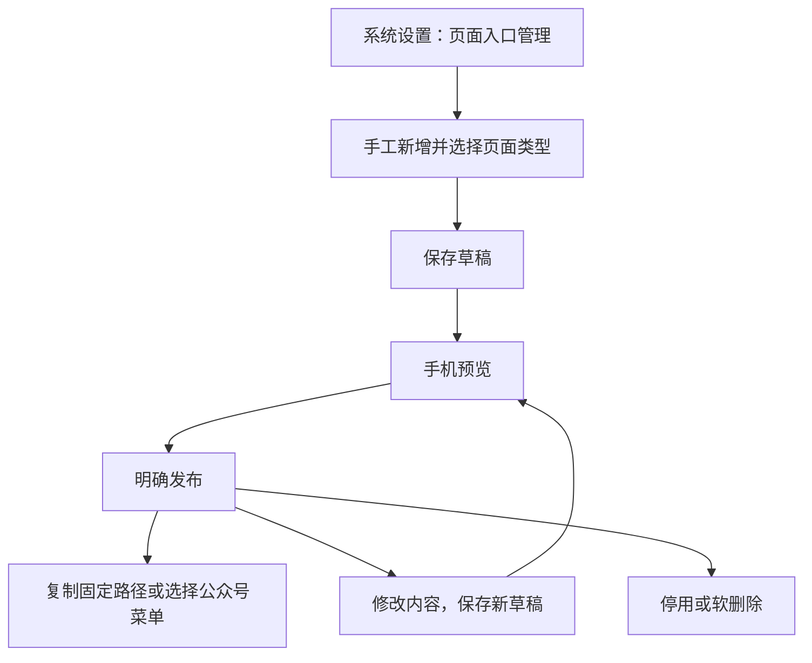

# 页面入口管理

适用：PR-687。位置：**系统设置 → 页面入口管理**。需要系统设置维护权限。此功能独立于公众号消息开关，公众号尚未接入也能配置页面。

## 新建与发布

1. 点击“新增页面”，填写名称、类型和可见范围。初始列表为空，系统不会因新增商品类型、复制价格表或发布版本自动增加入口。需要四张表就分别手工添加四个入口；允许多个入口使用同一目标。
2. 价格表：先从已有价格表目录选具体表，再选指定发布版本；版本由管理员手动切换，不跟随最新发布。价格表行内“新建页面入口”会预填当前表及版本。
3. 现有功能页：从首页、豆单中心、客户中心、全部订单、商品下单、一件代发、商城和个人中心中选一个。仅支持小程序打开，仍执行原功能权限。需认证的功能不能配置为公开。
4. 自定义图文页：依次插入标题、文字段落。先保存草稿再插入图片，支持 PNG、JPEG、GIF、WebP，每张不超过 8 MB。可填写图片说明、上下移动或删除内容块。不支持 HTML、脚本或任意外部图片地址。
5. 新入口默认“草稿、需认证”。保存草稿后点击“手机预览”，核对图片、段落顺序或价格梯度，再点击“发布”。保存草稿不会公开；编辑已发布页面保留原发布内容，直到再次发布。
6. 列表可按名称搜索、按类型和状态筛选；复制小程序路径或网页链接。名称、表、版本及内容变更均不改变入口标识。

每个入口固定使用 `pages/page-entry/page-entry?entry=标识`。价格表和图文页另有当前环境的 `https://当前域名/app/p/标识`；开发环境与生产环境的链接和内容独立。功能页没有网页业务流程，请使用小程序路径。

操作说明会返回原 Tab 和已保存编辑项。未保存时先保存草稿再打开说明，避免丢失修改。多人编辑时若提示“页面已被修改”，请刷新并重新编辑。

## 可见范围与客户登录

- 公开页面无需登录；公开价格表只能引用公共价格表。
- 需认证页面只向有效客户账号开放。客户专属表还检查客户归属及豆单、商品下单权限；不能通过入口降低权限。
- 小程序未登录时先认证，再返回原入口。每次重新进入都会清空之前的内容、重新检查当前发布状态和权限。
- 微信内网页在授权配置齐全时优先使用微信身份。已有有效公众号绑定可识别客户；已开启 UnionID 识别时只采用微信服务器返回的 UnionID。
- 不能识别、授权失败或配置未齐时，使用已有客户账号和密码登录。密码登录不会建立公众号绑定。游客或未通过客户认证的账号不能查看需认证内容。
- 多客户账号先选择当前客户。网页选择与小程序公众号“最近订单查询客户”互相独立。网页退出登录、账号停用、绑定失效或解绑后，后续请求不再读取受限内容。
- 图片随页面权限提供。草稿图片仅管理员预览；发布中未引用的图片、停用/删除页面的图片不会对客户开放。

## 停用、删除和历史入口

停用立即阻止两端的新访问和图片读取；重新发布可恢复。已打开页面在重新进入或刷新时重新校验。价格表撤回、删除或无可用内容时提示不可用，不自动换表或换版本。

删除前会列出已知保存菜单引用；没有记录不代表没有外部分享链接。确认删除后软删除保留数据与操作记录，旧标识不复用。

“历史入口”保留之前自动生成的入口，原路径、目标、状态和权限不自动改变。可以查看或停用，不出现在新的菜单选择器。已有公众号菜单保持原路径，只有管理员主动编辑后才切换。

## 公众号菜单使用

在“公众号管理 → 公众号菜单”选择“页面入口”，选择已发布且启用的手工入口。价格表、图文页可选“小程序”或“网页”；功能页只支持小程序。最近一次/三次订单继续使用消息回复动作。

菜单草稿和页面草稿分别保存。发布页面不会发布公众号菜单，发布菜单也不会发布页面草稿。更改目标前请先预览页面，再预览菜单完整差异。

## 微信网页授权配置

由运维在服务端设置，管理页只显示状态，不显示密钥：

| 配置 | 含义 |
| --- | --- |
| WECHAT_WEB_OAUTH_ENABLED | 独立网页授权开关，1 开启，默认 0 |
| WECHAT_WEB_PUBLIC_ORIGIN | 当前环境的 HTTPS 来源，例如 https://dev.qacoohee.com，不含路径和末尾斜线 |
| WECHAT_OFFICIAL_APP_ID / APP_SECRET | 服务号凭证，仅服务端保存 |
| WECHAT_OFFICIAL_UNIONID_ENABLED | 同一开放平台核对后设置 1，否则仅使用已有有效绑定 |

回调地址固定为“来源 + /app/api/page-auth/callback”。在微信公众平台核对网页授权接口权限与网页授权域名，必须与实际回调域名一致；消息回调配置不等于网页授权配置。[微信官方说明](https://pay.wechatpay.cn/doc/v3/partner/4012525474)

网页会话使用 HttpOnly、Secure、SameSite Cookie；授权状态五分钟有效且仅使用一次，并绑定发起浏览器。登录连续失败会临时限制尝试。会话最长七天，仍受原账号会话有效期和实时权限限制。不要通过共享浏览器保存客户密码。

## 常见问题与交付边界

- 页面不可用：检查是否已发布并启用、是否删除、选定价格表是否撤回或内容为空。
- 无访问权限：检查当前客户、客户归属、账号认证、客户绑定和相关能力，不修改为公开来绕过专属表权限。
- 图片无法加载：检查大小与格式，保存草稿后重新预览；客户只能读取发布内容引用的图片。
- 微信授权失败：可先用客户密码登录；由运维核对回调域名、AppID、权限与开关。重复授权回调会被拒绝，需返回原页面重新发起。
- 历史入口太多：只在历史记录中查看和逐一停用，不影响新手工列表数量。

本次只部署开发环境，不启用真实公众号、不发布菜单、不提交或发布小程序。真实授权和手机实测需要配置就绪后完成，产品验收由 Van 执行。

## 豆单中心配置（PR-688）

官方公共价格表可选择“登记用户可见”，勾选“展示在豆单中心”并设置排序，保存草稿、预览后发布。目录和价格目标使用同一已发布配置，新增表或新版不自动增加卡片。客户专属表禁止登记范围和公共目录展示。网页对此范围仅提示去小程序查看。详见 OP_MANUAL_BEAN_LIST_CENTER.md；页面启停、删除、版本撤回及图片权限继续统一检查。
