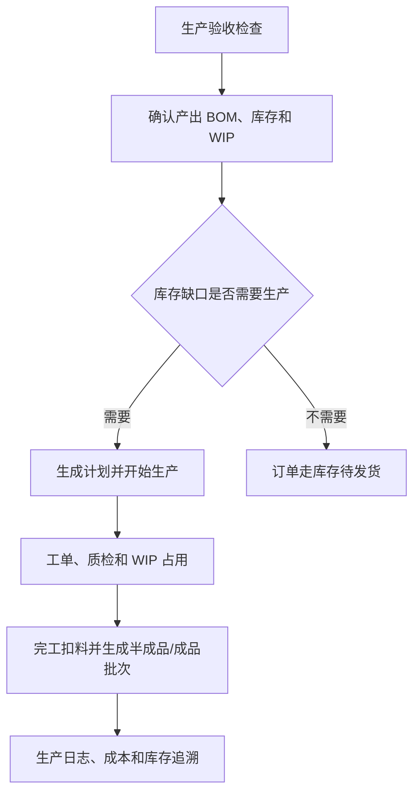

# 操作手册：生产流程

## 适用范围
生产验收、生产计划、开始生产、生产中、生产工单、工序卡、生产质检、生产成本、生产日志、WIP 占用、成品/半成品入库与批次追溯。

## 入口
- 生产管理：生产手册、生产验收、生产计划/开始生产、生产中、生产工单、工序卡、生产质检、生产日志、生产成本。
- 生产管理：生产 BOM、工艺路线/工艺模板，用于维护制造主档、产出商品、组件清单、多层展开和制造步骤。
- 商品与配方：商品档案、客户商品、商品配置模板和价格表。商品档案是库存/销售对象，只读查看产出该商品或把该商品作为组件消耗的生产 BOM，不再作为 BOM 绑定入口。
- 库存管理：仓库库存、库存作业、出库日志，用于 WIP、批次追溯和发货复盘。

## 流程图

## 标准操作
1. 开工前进入生产验收，确认仓库、原料批次、WIP、生产工单、WIP 占用、生产日志、质检和成品追溯检查项。
2. 生产前维护商品档案、物料、生产 BOM、工艺模板和设备产能。生产 BOM 必须声明“产出商品 + 产出数量 + 组件清单”，组件可以是物料，也可以是另一个有库存的半成品/成品商品。商品档案不编辑 BOM，只作为库存/销售对象被 BOM 产出或消耗。
   - PR-419：BOM 详情中的“被哪些 BOM 使用”只表示当前产出商品被上层 BOM 当组件消耗；生产 BOM 列表点击 BOM 名称直接打开设置抽屉，不再使用单独“编辑”按钮。
   - PR-420：编辑或新建生产 BOM 时，产出商品和商品组件下拉主标签显示 `SKU编号 商品名`，例如 `SKU-000518 初晓`，用于区分同名商品并支持按 SKU 编号搜索；商品档案 `SKU-000518 初晓` 的“被哪些 BOM 使用”会显示产出该商品的 `BOM-000884 初晓拼配`。
   - 生产 BOM 的列表分组来自通用 `分组管理`，不是生产 BOM 自己维护的大组/小类；“目标分组”可选已经存在的业务分组项，保存移动时系统会把该分组补充为 `production_bom` 用途并记录操作日志。
   - 商品档案配置抽屉中的“被哪些 BOM 使用”会展示 `BOM状态`：`默认状态`、`启用状态` 或 `失效状态`。默认状态优先表示该 BOM 是产出商品当前默认 BOM；失效状态只用于历史追溯。
3. PR-387-VIEW-CONTEXT：顶部“当前视图”为客户或订单时，生产计划和工单只使用客户/订单过滤和追溯标签；生产排产、开工、工序卡、质检和成本仍是工厂执行入口，不变成客户专属生产页面。
4. 原料到货后，在库存作业中做原料入库，生成原料批次和原料仓库存。
5. 准备生产时，在库存作业中把原料领到 WIP 在制仓；未用完的 WIP 原料可退回原料仓。
6. 录单保存时，如果成品批次或历史成品库存余额足够，选择使用库存后订单进入库存待发货；选择不使用则进入生产计划。
7. 录单页需要新客户时，使用新增客户抽屉，粘贴收件信息后识别姓名、电话和地址，保存后继续录当前订单。
8. 生产计划只选择库存不足且已解析到商品档案的商品生成计划，库存充足区只提示，不进入生产工单；历史未绑定商品档案的订单明细需要先在订单或商品侧补绑定后再进入生产。挂耳、盒装速溶、发动机总成这类多层结构先按最终产出商品库存判断缺口，再按选择的 BOM 展开组件需求。
9. 工单创建不再从商品档案找默认 BOM，而是选择要执行的生产 BOM、生产数量、仓库和多层展开策略。展开策略包括：只看第一层、全部展开、按库存缺口展开。默认按库存缺口展开：已有半成品库存先作为库存件消耗，不足部分再形成下层生产需求。
10. 开始生产前确认计划投料、BOM 组件需求、预期损耗率、WIP 可用量和建议领到 WIP 数量；如需调整排产，可在生产建议中直接修改推荐机器、每锅数量和锅数，系统会实时重算最终投料数和预计产出。系统内部按 `目标产出 / (1 - 预期损耗率)` 计算投料，不再把预期产出率作为用户维护字段。
   - PR-388/多层制造：生产计划和工单按选中的生产 BOM 版本读取组件组成。BOM 发布新版不会回改已开工工单；工单继续使用创建时冻结的 BOM 版本、展开树、组件需求、工艺模板和库存占用快照。
   - PR-390：生产计划和工单显示工艺参数/产品信息时优先读取商品生产配置字段。咖啡的 `roast_level`、服装的布料参数、鲜果加工的成熟度/去皮参数等都属于商品生产配置字段；旧 BOM 版本特殊属性和旧商品档案字段只作为 fallback。
11. 未选择库存不足项目，或已选项目没有填写大于 0 的投料数时，不会开始生产，也不会生成生产中记录、生产工单或 WIP 占用。
12. 点击开始生产后，系统生成生产中记录和生产工单，冻结当时的客户商品快照、商品档案快照、生产 BOM 版本、组件需求、多层展开树、半成品库存占用、下层生产需求、原料快照和工艺路线/工艺模板快照，并建立 WIP 软占用。重复点击或用旧生产计划再次提交时，系统会返回 `production already started`，不会重复生成生产中记录、生产工单或 WIP 占用。
13. 在生产工单中查看商品规格、订单信息、生产建议、预期损耗率、冻结生产配置、冻结工艺路线、工序执行汇总、组件/原料摘要、多层展开树、WIP 占用、WIP 已占/已耗/剩余占用，需要时打印工单。上层工单和下层工单保持独立，不把所有层级混成一张不可追踪的大工单。
14. 在工序卡中查看每个工序的顺序、计划投入、实际投入、实际产出、实际损耗、实际损耗率、是否记录损耗和异常原因；如完工后需要补录或修正工序实际数据，点击“保存实际”，系统会写入操作日志并回写工单工序汇总。
15. WIP 占用异常时，进入仓库库存的 WIP占用抽屉，按工单调整占用克重或释放废弃工单占用；WIP 占用抽屉的 WIP 总量和可用量只统计 active、仍有剩余且非待处理/拒收冻结批次；按生产中记录释放时，即使历史占用缺少工单行也必须释放匹配占用；调整和释放必须写操作日志。
16. 取消生产时，系统会同步取消生产工单和工序卡，并把未消耗的 WIP 占用释放回可用量。
17. 生产质检可记录工单质检、原料质检和产品质检；当前类型按钮分别显示选择工单、选择原料批次、选择产品批次。
18. 质检结果为待处理或不通过时，关联原料批次、WIP 批次或成品批次显示质检状态和冻结状态，冻结批次不能继续领料、生产扣料或成品出库/转仓。
19. 完成生产时填写实际产出和本次消耗投料；一次做不完则使用部分完工，剩余工单继续保留。
20. 完成生产遇到 WIP 批次质检待处理或不通过时，系统会拒绝本次完工并保持工单继续生产；处理方式是先完成质检复核、解除批次冻结或补领合格 WIP 批次后再提交完工。
21. 完成生产时成品总克重不能大于本次消耗投料；如果出现该提示，先核对实际产出、投料和是否漏填补投料，系统不会写完成日志、成品库存、FP 批次或扣料日志。
22. 合并多规格生产单必须一次填写全部规格的实际产出，不能使用部分完工；如果确实需要分批完成，先按单规格分别生成生产计划，避免同一生产工单的库存、成本和订单状态拆散。
23. 完工后系统扣减本次 WIP 原料或半成品库存，生成 FP 成品批次或半成品库存批次，写入生产日志、生产成本、库存流水、成品/半成品库存，并把整单实际投入、实际产出和实际损耗同步到默认工序卡。
24. 发货或复盘时，在仓库库存输入 `FP-...` 查看成品到工单、生产日志、原料消耗的追溯链；输入 `MB-...` 或 `LEGACY-MAT-...` 查看原料批次和当前仓库位置。

## 工艺模板和行业字段
- PR-389 历史兼容：旧数据可能仍从 BOM 版本特殊属性读取 `roast_level` 等工艺参数；PR-390 后新 UI 维护入口迁到商品档案的商品生产配置，工单创建时优先冻结商品生产配置字段。
- 工艺路线只定义步骤怎么跑，例如烘焙、裁剪、缝制、去皮、包装；每个工序可配置工位、默认设备、默认工时、是否记录损耗和质检项。
- 商品专属参数不放在工艺路线里。烘焙度、布料克重、鲜果成熟度、预期损耗率等放在商品档案的商品生产配置中，开工时随工单冻结。
- 行业字段模板用于沉淀不同业务的参数字段；商品生产配置字段是普通用户维护这些参数和值的入口，不要求用户手写 JSON。PR-403 后行业字段模板改为左侧模板列表、右侧模板编辑；左侧支持搜索模板名和启用/停用/全部过滤，点击模板名后在右侧编辑，新建模板也在右侧编辑。用户不再维护行业键，字段键同时作为显示名；新增字段只支持文本和下拉，文本字段可填默认文本，下拉字段用空格分隔选项。商品档案配置只能保存所选行业字段模板中已有的字段，不能临时新增或删除字段定义；字段定义调整必须回到行业字段模板。
- 工艺模板保存、发布、停用，行业字段模板保存、停用，以及工序卡实际损耗更新，都会写操作日志，可在操作日志按 `process_template`、`industry_field_template` 或 `job_card` 追溯。

## 客户商品到生产执行
- 录单、客户门户和履约侧选择的是客户商品；生产计划收到订单后必须解析到绑定的商品档案，再选择能产出该商品的生产 BOM、商品配置、单位模板和工艺模板。
- 录单和履约保存订单行时，会同时冻结客户商品快照和商品档案快照。生产计划和工单不按客户展示名找 BOM，而是使用订单行上的商品档案 ID、商品档案编号/名称快照和所选生产 BOM 快照执行。
- PR-394：商品档案页和客户商品页的分类模板 Tab 只影响列表分组、价格表展示和人工查找，不改变生产对象。商品在某个分类模板下重新归类后，已经生成的订单、生产计划、工单和成品批次不会回改；新生产计划仍按订单行冻结的客户商品和商品档案选择产出 BOM。
- 工厂自营订单也按同样链路执行：工厂自营客户商品用于销售展示，商品档案用于库存和生产。
- 客户只是贴牌改名时，多个客户商品可以绑定同一商品档案，生产计划选择同一个产出 BOM，不生成重复 BOM。
- 客户专属包装、客户改配方、受托加工或客户来料时，必须创建独立商品档案，并在生产 BOM 中声明该商品为产出，避免库存、成本和追溯混在一起。
- 一次性订单如果只改展示名或价格，用客户商品和价格快照解决；如果生产定义变化，则建一次性用途商品档案并让工单冻结产出该商品的生产 BOM。

## 结果校验
- 生产验收页面没有关键红灯，或每个红灯都有明确补救入口。
- 生产计划中的订单只按库存缺口进入工单，库存待发货订单可在订单列表直接发货。
- 挂耳订单在生产计划中显示为挂耳生产需求，并展示需求袋数、熟豆商品组件需求、熟豆组件缺口和上游烘焙需求；不会把挂耳订单直接当熟豆重量订单处理。
- 盒装速溶工单选择“10条盒装速溶”BOM 后，可按策略只准备条装速溶库存件，或继续展开到条装速溶 BOM 中的速溶粉和条包装膜。
- PR-358-PRODUCT-PRICE-LIST-ORDER-PRODUCTION：生产计划行会携带产品类型、产品子类型和工序模板 ID。速溶咖啡这类无 BOM 产品可通过产品类型/产品子类型识别默认原料“速溶咖啡”，不再只依赖商品名称或旧 `product_kind`。
- PR-392：订单进入生产计划时，工序模板/单位/价格规则解析优先使用商品档案引用的商品配置模板，旧产品子类型模板只作为 legacy fallback。示例：示例大客户复制“盒装速溶配置”后，让对应商品档案在“商品档案配置”抽屉中引用该客户配置，生产计划即可使用配置中的“速溶包装流程”。
- PR-359-PRODUCT-KIND-MIGRATION-CLEANUP：旧 SKU 迁移后，生产优先读取产品子类型和客户规则解析出的工序模板；缺少新配置时才使用历史 `product_kind` 兼容逻辑。历史订单进入生产时不改原订单价格和价格快照。
- 挂耳 BOM 中的 `product` 组件只扣熟豆成品库存或形成熟豆缺口，不从原料批次直接扣；滤袋、外盒等 `material` 组件仍按物料库存扣减。旧 `finished_product` 组件类型只作为历史兼容读取。
- 开始生产失败时，生产中记录、生产工单和 WIP 占用数量都不会增加。
- 开始生产若遇到 WIP 多物料不足，错误提示会一次列出全部不足物料及各自需求/可用/占用数量。
- 生产计划旧页面或重复点击开始生产时，不会重复生成生产中记录、生产工单或 WIP 占用；接口会返回 `production already started`。
- 历史未绑定商品 SKU 的订单明细不会让生产计划报错，也不会生成无 SKU 工单。
- 多品项订单只完成部分生产品项时，订单不会提前进入生产完成或可发货范围。
- 生产工单、工序卡、生产日志、生产成本、库存流水和 FP 成品批次能互相对上。
- 工单展示冻结的预期损耗和实际损耗汇总；已发布工艺模板开工后，生产工单展示模板名称和工序汇总；工序卡按模板路线生成，并能维护实际投入、产出、损耗和异常原因。
- WIP 占用调整或释放后，可用量变化正确，调整后可用量没有包含冻结、拒收、已停用或已耗尽批次，并能在操作日志追溯。
- WIP 占用释放后，接口响应的释放数量必须和数据库占用状态一致，不能出现提示已释放但占用仍为 reserved。
- 取消生产后，对应生产工单和工序卡为已取消，未消耗 WIP 占用为已释放。
- 待处理或不通过质检会冻结对应批次，冻结批次不能继续被业务误用。
- 冻结 WIP 批次导致完成生产失败时，不会新增生产日志、成品库存、FP 批次或原料消耗日志，原生产中记录保持 running。
- 合并多规格生产单部分完工失败时，不会更新规格产出、生产日志、成品库存、FP 批次或原料消耗日志，原生产中记录保持 running。
- `LEGACY-MAT-...` 页面说明这是系统升级按旧物料库存生成的期初批次。

## 常见问题
- 无法开始生产：检查是否已选择库存不足项目、每个已选项目投料数是否大于 0、BOM 是否存在、物料库存是否足够、WIP 是否有可用原料、设备产能是否完整。
- 开始生产提示 WIP 不足：错误会汇总展示全部不足物料；按提示在库存作业补领对应原料到 WIP 后再重试。
- 开始生产提示 `production already started`：说明订单或代加工需求已经开工，刷新生产计划和生产中页面，继续处理已有生产中记录，不要重复点击或用旧页面再次提交。
- 库存明明够但仍进生产计划：检查录单时是否选择“不使用”库存批次。
- 生产计划缺少某条历史订单：检查订单明细是否绑定商品 SKU；未绑定 SKU 的历史明细会被跳过，补绑定后再进入生产计划。
- 挂耳生产提示熟豆不足：先检查挂耳 BOM 是否配置熟豆商品组件、组件克重是否按每袋设置，以及对应熟豆商品是否有可用成品库存；不足时按上游烘焙需求先排熟豆生产。
- 挂耳生产提示包材不足：检查 BOM 中滤袋、外盒等物料组件是否配置为 `material`，并在库存作业补足对应物料。
- 批次扣减不符合预期：检查 WIP 占用、实际消耗投料、部分完工记录和 FIFO 规则。
- WIP 占用调整后可用量低于预期：检查是否有待处理、冻结、拒收、已停用或已耗尽的 WIP 批次；已停用或已耗尽的 WIP 批次不会计入可用量，先完成质检复核、恢复有效库存或更换合格批次。
- WIP 占用释放后仍显示已占：按生产中记录重新查询占用状态；如果页面提示释放成功但仍为 reserved，先暂停继续开工并让管理员检查历史占用和操作日志。
- 多品项订单完工后仍显示生产中：检查订单是否还有其他已绑定 SKU 明细存在剩余生产缺口；补齐剩余品项生产或确认有可用成品库存后再发货。
- 生产成本异常：检查 BOM、预期损耗率、投料数量、物料采购价、成本参数和实际产出。
- 工艺模板没有进入工单：检查模板是否绑定正确 SKU、状态是否已发布；模板修改只影响新工单，不会回写历史工单。
- 完成生产提示 WIP 不足或批次被质检冻结：在生产中页面打开库存作业抽屉，补做 WIP 领退/转仓；若提示 quality block，先到生产质检复核对应原料批次，确认合格或更换合格 WIP 批次后再完工。
- 合并多规格生产提示不支持部分完工：补齐同一生产单全部规格的实际产出后一次完工；需要分批时，回到生产计划按单规格分别开工。
- 需要修改已完成生产记录时，先确认是否影响库存、成本和审计记录。
