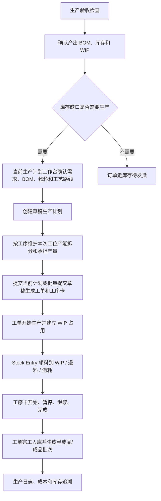

# 操作手册：生产流程

## 适用范围
生产验收、生产计划、开始生产、生产中、生产工单、工序卡、生产质检、生产成本、生产日志、WIP 占用、成品/半成品入库与批次追溯。

PR-473-GENERIC-MANUFACTURING-ABSTRACTION + PR-487-PRODUCTION-PLAN-CAPACITY-SPLITS + PR-488-PRODUCTION-PLAN-SPLIT-QTY-AUTOBATCH + PR-490-JOB-CARD-BATCH-CARDS + PR-491-PRODUCTION-DEMAND-STATUS-JOBCARD-CONTEXT：生产主流程统一使用 `商品 / BOM / 工艺路线 / 工序 / 工位 / 生产计划 / 工单 / 工序卡`。咖啡、包装盒、童装等行业差异通过 BOM、工艺路线、工序、工位、工位产能和商品生产配置表达；设备产能、单批标准、承担产量和自动批次数进入草稿生产计划的工序产能拆分，不写进工艺路线；待生产需求维护 `待计划 / 生产中 / 生产完成` 状态，已进入生产计划的需求不可重复生成计划；工序卡主表记录商品、BOM/配方、时间、成本、损耗和异常，不把咖啡投料/出豆字段作为通用主流程列。

## 入口
- 生产管理：生产手册、生产验收、生产计划/开始生产、生产中、生产工单、工序卡、生产质检、生产日志、生产成本。
- 生产管理：生产 BOM、工艺路线、工序、工位/设备，用于维护制造主档、产出商品、组件清单、多层展开和制造步骤。
- 商品与配方：商品档案、客户商品、商品配置模板和价格表。商品档案是库存/销售对象，只读查看产出该商品或把该商品作为组件消耗的生产 BOM，不再作为 BOM 绑定入口。
- 库存管理：仓库库存、库存作业、出库日志，用于 WIP、批次追溯和发货复盘。

## 流程图

## 标准操作
1. 开工前进入生产验收，确认仓库、原料批次、WIP、生产工单、WIP 占用、生产日志、质检和成品追溯检查项。
2. 生产前维护商品档案、物料、生产 BOM、工艺路线、工序和工位/设备。生产 BOM 必须声明“产出商品 + 产出数量 + 组件清单”，组件可以是物料，也可以是另一个有库存的半成品/成品商品。商品档案不编辑 BOM，只作为库存/销售对象被 BOM 产出或消耗；商品档案只可在该商品已有的产出 BOM 中设置一个默认 BOM 主表，不选择默认版本。
   - PR-419：BOM 详情中的“被哪些 BOM 使用”只表示当前产出商品被上层 BOM 当组件消耗；生产 BOM 列表点击 BOM 名称直接打开设置抽屉，不再使用单独“编辑”按钮。
   - PR-420：编辑或新建生产 BOM 时，产出商品和商品组件下拉主标签显示 `SKU编号 商品名`，例如 `SKU-000518 初晓`，用于区分同名商品并支持按 SKU 编号搜索；商品档案 `SKU-000518 初晓` 的“被哪些 BOM 使用”会显示产出该商品的 `BOM-000884 初晓拼配`。
   - 生产 BOM 的列表分类来自 `系统设置 / 分组模板`，不是生产 BOM 自己维护的大组/小类。先在系统设置维护分组模板的大类和小类，再回到生产 BOM 页面选择 `分组模板`；选择后 BOM 列表按模板完整大类 / 小类树和 `未分类` 自动整理，空分类也显示，不再提供分类过滤 Tab。目标分类可选 `未分类`、大类或小类；表格不再单独展示分组列。
   - 商品档案配置抽屉中的“被哪些 BOM 使用”会展示 `BOM状态`：`默认状态`、`启用状态` 或 `失效状态`。默认状态优先表示该 BOM 是产出商品当前默认 BOM；失效状态只用于历史追溯。
   - PR-485：BOM 版本选择工艺路线。发布某个 BOM 草稿版本后，该 BOM 原 published 版本自动归档为历史快照；生产计划和工单永远使用该默认 BOM 的最新 published 版本，不允许在前端覆盖 BOM 版本。
3. PR-387-VIEW-CONTEXT：顶部“当前视图”为客户或订单时，生产计划和工单只使用客户/订单过滤和追溯标签；生产排产、开工、工序卡、质检和成本仍是工厂执行入口，不变成客户专属生产页面。
4. 原料到货后，在库存作业中做原料入库，生成原料批次和原料仓库存。
5. 准备生产时，在库存作业中把原料领到 WIP 在制仓；未用完的 WIP 原料可退回原料仓。
6. 录单保存时，如果成品批次或历史成品库存余额足够，选择使用库存后订单进入库存待发货；选择不使用则进入生产计划。
7. 录单页需要新客户时，使用新增客户抽屉，粘贴收件信息后识别姓名、电话和地址，保存后继续录当前订单。
8. PR-472-MANUFACTURING-PRODUCTION-PLAN-WORKORDER-LIFECYCLE：生产计划只选择库存不足且已解析到商品档案的商品生成正式 `生产计划`，库存充足区只提示，不进入生产工单；历史未绑定商品档案的订单明细需要先在订单或商品侧补绑定后再进入生产。挂耳、盒装速溶、发动机总成这类多层结构先按最终产出商品库存判断缺口，再按选择的 BOM 展开组件需求。
9. PR-473-GENERIC-MANUFACTURING-ABSTRACTION + PR-475-PRODUCTION-PLAN-ERPNEXT-WORKBENCH + PR-485-BOM-VERSION-ROUTE-DEFAULT + PR-489-PRODUCTION-PLAN-PREVIEW-LAYOUT + PR-491-PRODUCTION-DEMAND-STATUS-JOBCARD-CONTEXT：新建生产计划时，在生产计划页主工作台操作。顶部只处理日期、客户和需求状态筛选；左侧待生产需求展示库存不足商品、状态和关联生产计划并勾选；右侧当前生产计划会自动生成计划预览，集中展示商品、订单、规格、需求、库存、缺口、BOM 摘要、计划投料、物料需求汇总和工艺路线摘要。待生产需求状态可选 `全部 / 待计划 / 生产中 / 生产完成`；只有 `待计划` 需求可勾选，已进入生产计划的需求显示 `生产中` 并置灰。待生产需求和当前生产计划都可以用 `收起待生产需求`、`收起当前生产计划` 缩窄，让另一侧获得更多横向空间；待生产需求、计划预览、物料汇总、库存充足和生产计划单据等宽表可以按住表格空白区域左右拖动查看超出屏幕的列，滚到内层顶部或底部后页面继续整体滚动。前端创建计划只提交日期、客户、所选商品和来源类型，不提交设备、单批投入、批次数、`input_by_key`、BOM 版本或工艺路线覆盖。后端按 `商品 -> 默认生产 BOM -> 该 BOM 最新 published 版本 -> BOM 版本绑定工艺路线` 解析；没有默认 BOM 且只有一个 active 产出 BOM 时可自动使用，多个 active 产出 BOM 时要求先到商品档案设默认。默认 BOM 已不再产出该商品时直接报错；最新可用 BOM 版本未配置工艺路线时直接报错，不 fallback 到旧版本、商品配置路线或旧工艺模板。创建成功后形成正式 `draft` 生产计划；创建动作不自动提交、不自动生成工单、不创建生产中记录、生产日志或 WIP 占用。计划行冻结商品快照、客户/订单来源、缺口数量、最新 BOM 版本、BOM 版本路线和组件需求快照。
10. PR-475-PRODUCTION-PLAN-ERPNEXT-WORKBENCH + PR-487-PRODUCTION-PLAN-CAPACITY-SPLITS + PR-488-PRODUCTION-PLAN-SPLIT-QTY-AUTOBATCH + PR-489-PRODUCTION-PLAN-PREVIEW-LAYOUT + PR-490-JOB-CARD-BATCH-CARDS：创建草稿前，当前计划预览区会提示 `创建草稿生产计划后可填写工序产能拆分`，先点 `创建生产计划` 生成草稿后再维护拆分。创建草稿成功后，右侧当前生产计划立即显示计划号、中文状态和计划行，并显示可编辑的 `工序产能拆分`。草稿计划可按计划行和工艺路线工序添加拆分行，选择工位产能并填写本次承担产量；例如同一烘焙工序可拆成 `布勒 18kg` 承担 90kg 和 `智烘 4kg` 承担 8kg。系统按工位产能带出的标准批量自动显示批次数，按标准分钟/批和小时费率预览计划数量、计划分钟和计划工序成本；每条拆分记录下方还会按批次数显示 `第1批`、`第2批` 等批次卡片，最后一批不足标准批量时会标记 `不足标准批量`。点击 `提交当前计划生成工单` 前会保存当前拆分；已提交工单、生产中、已完成和已取消计划不可重复提交或修改拆分。
11. PR-472-MANUFACTURING-PRODUCTION-PLAN-WORKORDER-LIFECYCLE + PR-474-PRODUCTION-PLAN-BULK-SUBMIT-FILTER：生产计划单据列表降级为历史和批量管理区，支持状态和时间过滤：状态可选全部、草稿、已提交工单、生产中、已完成、已取消；时间类型可选创建时间、提交时间、完成时间，并可填写开始日期和结束日期。列表默认显示最近 50 条，按创建时间倒序。需要批量处理历史草稿时，在生产计划单据列表勾选草稿计划后，点击顶部 `提交生成工单`。只有 `草稿` 计划可勾选；已提交工单、生产中、已完成和已取消计划不可勾选。计划提交生成生产工单和工序卡，提交后生产计划进入 `已提交工单`，系统按计划行生成 `released` 生产工单，并按工单冻结的工艺路线生成 `pending` 工序卡。工单冻结当时的客户商品快照、商品档案快照、生产 BOM 版本、组件需求、多层展开树、生产配置字段和工艺路线快照。
   - PR-478-PRODUCTION-PLAN-DOCUMENT-DETAIL：生产计划单据列表保持紧凑。点击计划号或详情打开生产计划单据详情抽屉，可查看单据头、计划行、BOM 版本、工艺路线摘要、物料需求汇总、工艺参数/商品生产配置快照和生成结果。草稿计划显示尚未生成工单；已提交计划显示关联工单、工单状态和工序卡数量，并可从抽屉进入工单或工序卡页面。
12. 在生产工单页筛选 `released`，确认计划投料、BOM 组件需求、预期损耗率、WIP 可用量和建议领到 WIP 数量后，点击 `开始生产`。系统内部按 `目标产出 / (1 - 预期损耗率)` 计算投料，不再把预期产出率作为用户维护字段。
   - PR-388/多层制造：生产计划和工单按创建计划时解析出的最新生产 BOM 版本读取组件组成。BOM 发布新版不会回改已开工工单；工单继续使用创建时冻结的 BOM 版本、展开树、组件需求、工艺路线和库存占用快照。
   - PR-390：生产计划和工单显示工艺参数/产品信息时优先读取商品生产配置字段。咖啡的 `roast_level`、服装的布料参数、鲜果加工的成熟度/去皮参数等都属于商品生产配置字段；旧 BOM 版本特殊属性和旧商品档案字段只作为 fallback。
13. 未选择库存不足项目时，不会开始生产，也不会生成生产中记录、生产工单或 WIP 占用。已选项目没有手工填写投料数时，系统按生产计划的默认投料数启动；设备、单批标准、承担产量和自动批次数只在草稿生产计划的工序产能拆分中维护，不在工艺路线中维护。只有 `released` 工单允许开始生产；`draft/running/completed/cancelled` 工单不能再次开始。
14. 点击开始生产后，系统生成生产中记录、running item 和 WIP 软占用，把工单置为 `running`，并把相关工序卡切到可执行状态。重复点击或用旧生产计划再次提交时，系统会返回错误，不会重复生成生产中记录、running item、生产工单或 WIP 占用。旧 `POST /api/produce/start` 入口保留兼容，内部走临时计划 -> 工单 -> 开始生产。
15. 在生产工单中查看商品规格、订单信息、计划数量、BOM/工艺路线、工艺参数、预期损耗率、冻结生产配置、工序执行汇总、冻结工位产能、计划分钟、计划工序成本、组件/原料摘要、多层展开树、WIP 占用、WIP 已占/已耗/剩余占用，需要时打印工单。历史 `roast_level` 等字段只作为工艺参数兼容展示，不作为咖啡烘焙主列。上层工单和下层工单保持独立，不把所有层级混成一张不可追踪的大工单。
16. PR-490-JOB-CARD-BATCH-CARDS / PR-491-PRODUCTION-DEMAND-STATUS-JOBCARD-CONTEXT：在工序卡中查看每个工序的商品、BOM/配方、顺序、工位产能、计划批次数、计划分钟、计划工序成本、实际分钟、实际工序成本、实际损耗、实际损耗率、是否记录损耗、损耗原因和异常原因；点击工单号链接会打开右侧 `工单详情` 抽屉，查看商品、规格、订单号、计划数量、BOM/配方和配方物料快照。如完工后需要补录或修正工序实际数据，点击“保存实际”，系统会写入操作日志并回写工单工序汇总。`计划投入 / 实际投入 / 实际产出` 旧字段暂时保留在后端兼容层，但不再作为工序卡主表输入列。
17. PR-479-MANUFACTURING-PHASE2-EXECUTION-COST-CLOSED-LOOP：二期开始后，现场执行按 `工单开始生产 -> 领料到 WIP -> 工序卡执行 -> 完工入库 -> 成本追溯` 跑。进入库存作业的 `Stock Entry单据`，创建 `领料到WIP` 单据，把原料仓物料领到 WIP 在制仓；未用完物料用 `WIP退料` 单据退回原料仓；实际消耗用 `工单消耗` 或完工动作记录。
18. 工序卡执行时，操作员在工序卡页按状态点击 `开始`、`暂停`、`继续`、`完成`，并维护实际分钟、实际损耗、损耗原因和异常原因。只有 `pending/ready` 可以开始，只有 `running` 可以暂停，只有 `paused` 可以继续，只有 `running/paused` 可以完成；非法动作会被拒绝，不会改状态。具体物料投入/产出以后通过库存单据或更通用的工序实际项表达。
19. 生产工单页展示已领料、已消耗、可退料、工序进度和成本汇总。主管确认必要工序完成、WIP 消耗和质检状态后，在工单行点击完工入库；系统生成成品/半成品批次、生产日志、成本记录和 `finished_receipt` Stock Entry。
20. 完工入库失败时，先检查工序卡是否全部完成、WIP 是否足够、批次是否被质检冻结、该工单是否已经完成。失败不会新增成品批次、库存流水、生产日志或成本记录。
21. WIP 占用异常时，进入仓库库存的 WIP占用抽屉，按工单调整占用克重或释放废弃工单占用；WIP 占用抽屉的 WIP 总量和可用量只统计 active、仍有剩余且非待处理/拒收冻结批次；按生产中记录释放时，即使历史占用缺少工单行也必须释放匹配占用；调整和释放必须写操作日志。
22. 取消生产时，系统会同步取消生产工单和工序卡，并把未消耗的 WIP 占用释放回可用量。
23. 生产质检可记录工单质检、原料质检和产品质检；当前类型按钮分别显示选择工单、选择原料批次、选择产品批次。
24. 质检结果为待处理或不通过时，关联原料批次、WIP 批次或成品批次显示质检状态和冻结状态，冻结批次不能继续领料、生产扣料或成品出库/转仓。
25. 完成生产时填写实际产出和本次消耗投料；一次做不完则使用部分完工，剩余工单继续保留。
26. 完成生产遇到 WIP 批次质检待处理或不通过时，系统会拒绝本次完工并保持工单继续生产；处理方式是先完成质检复核、解除批次冻结或补领合格 WIP 批次后再提交完工。
27. 完成生产时成品总克重不能大于本次消耗投料；如果出现该提示，先核对实际产出、投料和是否漏填补投料，系统不会写完成日志、成品库存、FP 批次或扣料日志。
28. 合并多规格生产单必须一次填写全部规格的实际产出，不能使用部分完工；如果确实需要分批完成，先按单规格分别生成生产计划，避免同一生产工单的库存、成本和订单状态拆散。
29. 完工后系统扣减本次 WIP 原料或半成品库存，生成 FP 成品批次或半成品库存批次，写入生产日志、生产成本、库存流水、成品/半成品库存；完工和库存单据负责实际投入/产出追溯，工序卡只保留兼容字段并在主表展示时间、成本、损耗和异常。
30. 发货或复盘时，在仓库库存输入 `FP-...` 查看成品到工单、生产日志、原料消耗的追溯链；输入 `MB-...` 或 `LEGACY-MAT-...` 查看原料批次和当前仓库位置。

## 制造三期生产协调
- PR-480-MANUFACTURING-PHASE3-SCHEDULE-CAPACITY：生产排程工作台保存排程前，先确认工单、工序卡、工位/设备和计划开始/结束时间。保存工单或工序卡排程会记录计划时间、班次、负责人、优先级、备注和工位/设备；保存产能日历会记录日期、班次、可用分钟和停机分钟。排程和产能保存都能在操作日志追溯。
- PR-481-MANUFACTURING-PHASE3-SCHEDULING-WORKBENCH：进入 `生产管理 → 生产排程`。列表视图用于快速找工单，日历视图用于按日期查看，甘特视图用于观察时间跨度，工位负载用于查看工位/设备产能。三期只提示冲突，不自动改排程；排程只排已生成工单或工序卡，不选择 BOM、不选择路线、不做 fallback。
- PR-482-MANUFACTURING-PHASE3-MRP-SUGGESTIONS：排程工作台右侧的 `MRP 建议` 会按当前日期、状态和工作中心读取物料需求，展示采购建议和调拨建议。调拨建议表示可从原料仓领到 WIP 的数量；采购建议表示 WIP 可用量和原料仓库存都覆盖不了的净缺口。建议只辅助计划，真实领料仍到库存作业创建 Stock Entry。
- PR-483-MANUFACTURING-PHASE3-INDUSTRY-CALCULATORS：行业设置页提供计算预览。选择咖啡烘焙、包装盒或童装，输入需求产出、损耗率、原料单价和工时后，系统返回计划投入、预计损耗和预计成本。该预览用于配置和核对行业参数，不会直接创建生产计划或工单。
- PR-484-MANUFACTURING-PHASE3-TRACEABILITY-ANALYTICS：生产成本页增加生产追溯分析。可按工单 ID 或生产批次查看追溯链路、成本差异和异常损耗。追溯链路串联工单、工序卡、Stock Entry、物料/成品批次和成本记录；异常损耗来自工序卡实际损耗和原因。

## 工艺路线和行业字段
- PR-389 历史兼容：旧数据可能仍从 BOM 版本特殊属性读取 `roast_level` 等工艺参数；PR-390 后新 UI 维护入口迁到商品档案的商品生产配置，工单创建时优先冻结商品生产配置字段。
- PR-487-PRODUCTION-PLAN-CAPACITY-SPLITS：PR-486 旧口径更正为：工艺路线只定义工序顺序，不保存工位、工位产能、标准批量、标准分钟/批、小时费率、计划批次数、计划分钟或计划工序成本。工序主数据不维护工时；工位/设备不维护加工时间，只保留默认小时费率作为兜底。
- 进入 `生产管理 -> 工艺路线` 维护路线；路线只定义步骤怎么跑，例如烘焙、裁剪、缝制、去皮、包装，不选择 SKU、BOM、BOM 版本、工位或工位产能。进入 `生产管理 -> 工序` 维护工序主数据，进入 `生产管理 -> 工位/设备` 维护工位、设备、默认小时费率和工位产能。BOM 版本草稿选择一条工艺路线，发布后成为生产计划/工单使用的路线快照来源。
- 在 `工位/设备` 页面为某个工位维护 `工位产能`，例如 `布勒 18kg`、`布勒 15kg`、`智烘 3kg`；每个产能填写标准批量、单位、标准分钟/批、小时费率、状态和备注。工位产能是可复用的单批标准主数据，不直接决定某张工单做几批。
- 创建生产计划前，计划预览区只显示工序产能拆分提示；创建生产计划后，在草稿计划的 `工序产能拆分` 中选择本次生产使用的工位产能并填写承担产量。系统根据承担产量和工位产能标准批量自动计算批次数；计划数量、计划分钟和计划工序成本由拆分行计算；提交生产计划时冻结到工单和工序卡，后续修改工位产能主数据不会回改历史工单。
- PR-490-JOB-CARD-BATCH-CARDS：拆分计算规则为：计划数量等于用户填写的 `承担产量`；计划批次数等于 `ceil(承担产量 / 标准批量)`；计划分钟等于 `计划批次数 * 标准分钟/批`；计划工序成本等于 `计划分钟 / 60 * 小时费率`。例如计划拆分为 `布勒 18kg` 承担 90kg、15 分钟/批、300 元/小时，自动得到 5 批、75 分钟、375 元工序成本；再加 `智烘 4kg` 承担 8kg 则自动得到 2 批和对应分钟、成本。若承担 20kg 但标准批量是 18kg，计划数量仍是 20kg，批次数为 2 批，页面显示 18kg 和 2kg 两个批次卡片，并标记最后一批不足标准批量。
- 商品专属参数不放在工艺路线里。烘焙度、布料克重、鲜果成熟度、预期损耗率等放在商品档案的商品生产配置中，开工时随工单冻结。
- 行业字段模板用于沉淀不同业务的参数字段；商品生产配置字段是普通用户维护这些参数和值的入口，不要求用户手写 JSON。PR-403 后行业字段模板改为左侧模板列表、右侧模板编辑；左侧支持搜索模板名和启用/停用/全部过滤，点击模板名后在右侧编辑，新建模板也在右侧编辑。用户不再维护行业键，字段键同时作为显示名；新增字段只支持文本和下拉，文本字段可填默认文本，下拉字段用空格分隔选项。商品档案配置只能保存所选行业字段模板中已有的字段，不能临时新增或删除字段定义；字段定义调整必须回到行业字段模板。
- 工艺路线保存、发布、停用，工序/工位主数据保存或停用，工位产能保存或停用，行业字段模板保存、停用，以及工序卡实际工时/实际损耗更新，都会写操作日志，可在操作日志按 `process_route`、`manufacturing_operation`、`manufacturing_workstation`、`manufacturing_workstation_capacity`、`industry_field_template` 或 `job_card` 追溯。

## 客户商品到生产执行
- 录单、客户门户和履约侧选择的是客户商品；生产计划收到订单后必须解析到绑定的商品档案，再选择能产出该商品的生产 BOM、BOM 最新可用版本、BOM 版本工艺路线、商品配置和单位模板。
- 录单和履约保存订单行时，会同时冻结客户商品快照和商品档案快照。生产计划和工单不按客户展示名找 BOM，而是使用订单行上的商品档案 ID、商品档案编号/名称快照和所选生产 BOM 快照执行。
- PR-394：商品档案页和客户商品页的分类模板 Tab 只影响列表分组、价格表展示和人工查找，不改变生产对象。商品在某个分类模板下重新归类后，已经生成的订单、生产计划、工单和成品批次不会回改；新生产计划仍按订单行冻结的客户商品和商品档案选择产出 BOM。
- 工厂自营订单也按同样链路执行：工厂自营客户商品用于销售展示，商品档案用于库存和生产。
- 客户只是贴牌改名时，多个客户商品可以绑定同一商品档案，生产计划选择同一个产出 BOM，不生成重复 BOM。
- 客户专属包装、客户改配方、受托加工或客户来料时，必须创建独立商品档案，并在生产 BOM 中声明该商品为产出，避免库存、成本和追溯混在一起。
- 一次性订单如果只改展示名或价格，用客户商品和价格快照解决；如果生产定义变化，则建一次性用途商品档案并让工单冻结产出该商品的生产 BOM。

## 结果校验
- 生产验收页面没有关键红灯，或每个红灯都有明确补救入口。
- 生产计划中的订单只按库存缺口进入工单，库存待发货订单可在订单列表直接发货。
- 挂耳订单在生产计划中显示为挂耳生产需求，并展示需求袋数、熟豆商品组件需求、熟豆组件缺口和上游烘焙需求；不会把挂耳订单直接当熟豆重量订单处理。
- 盒装速溶工单选择“10条盒装速溶”BOM 后，可按策略只准备条装速溶库存件，或继续展开到条装速溶 BOM 中的速溶粉和条包装膜。
- PR-358-PRODUCT-PRICE-LIST-ORDER-PRODUCTION：生产计划行会携带产品类型、产品子类型和工序模板 ID。速溶咖啡这类无 BOM 产品可通过产品类型/产品子类型识别默认原料“速溶咖啡”，不再只依赖商品名称或旧 `product_kind`。
- PR-392：订单进入生产计划时，工序模板/单位/价格规则解析优先使用商品档案引用的商品配置模板，旧产品子类型模板只作为 legacy fallback。示例：示例大客户复制“盒装速溶配置”后，让对应商品档案在“商品档案配置”抽屉中引用该客户配置，生产计划即可使用配置中的“速溶包装流程”。
- PR-359-PRODUCT-KIND-MIGRATION-CLEANUP：旧 SKU 迁移后，生产优先读取产品子类型和客户规则解析出的工序模板；缺少新配置时才使用历史 `product_kind` 兼容逻辑。历史订单进入生产时不改原订单价格和价格快照。
- 挂耳 BOM 中的 `product` 组件只扣熟豆成品库存或形成熟豆缺口，不从原料批次直接扣；滤袋、外盒等 `material` 组件仍按物料库存扣减。旧 `finished_product` 组件类型只作为历史兼容读取。
- 开始生产失败时，生产中记录、生产工单和 WIP 占用数量都不会增加。
- 开始生产若遇到 WIP 多物料不足，错误提示会一次列出全部不足物料及各自需求/可用/占用数量。
- 生产计划旧页面或重复点击开始生产时，不会重复生成生产中记录、生产工单或 WIP 占用；接口会返回 `production already started`。
- 历史未绑定商品 SKU 的订单明细不会让生产计划报错，也不会生成无 SKU 工单。
- 多品项订单只完成部分生产品项时，订单不会提前进入生产完成或可发货范围。
- 生产工单、工序卡、生产日志、生产成本、库存流水和 FP 成品批次能互相对上。
- 工单展示冻结的预期损耗和实际损耗汇总；已发布 BOM 版本绑定工艺路线后，生产工单展示冻结路线和工序汇总；工序卡按冻结路线生成，并能维护实际分钟、损耗、损耗原因和异常原因。
- WIP 占用调整或释放后，可用量变化正确，调整后可用量没有包含冻结、拒收、已停用或已耗尽批次，并能在操作日志追溯。
- WIP 占用释放后，接口响应的释放数量必须和数据库占用状态一致，不能出现提示已释放但占用仍为 reserved。
- 取消生产后，对应生产工单和工序卡为已取消，未消耗 WIP 占用为已释放。
- 待处理或不通过质检会冻结对应批次，冻结批次不能继续被业务误用。
- 冻结 WIP 批次导致完成生产失败时，不会新增生产日志、成品库存、FP 批次或原料消耗日志，原生产中记录保持 running。
- 合并多规格生产单部分完工失败时，不会更新规格产出、生产日志、成品库存、FP 批次或原料消耗日志，原生产中记录保持 running。
- `LEGACY-MAT-...` 页面说明这是系统升级按旧物料库存生成的期初批次。

## 常见问题
- 无法开始生产：检查是否已选择库存不足项目、商品档案是否已设置默认 BOM（或只有一个 active 产出 BOM）、默认 BOM 是否仍产出该商品、最新 published BOM 版本是否配置工艺路线、物料库存是否足够、WIP 是否有可用原料、设备产能是否完整；已选项目没有手工填写投料数时，系统会使用生产计划默认投料数。
- 开始生产提示 WIP 不足：错误会汇总展示全部不足物料；按提示在库存作业补领对应原料到 WIP 后再重试。
- 开始生产提示 `production already started`：说明订单或代加工需求已经开工，刷新生产计划和生产中页面，继续处理已有生产中记录，不要重复点击或用旧页面再次提交。
- 库存明明够但仍进生产计划：检查录单时是否选择“不使用”库存批次。
- 生产计划缺少某条历史订单：检查订单明细是否绑定商品 SKU；未绑定 SKU 的历史明细会被跳过，补绑定后再进入生产计划。
- 挂耳生产提示熟豆不足：先检查挂耳 BOM 是否配置熟豆商品组件、组件克重是否按每袋设置，以及对应熟豆商品是否有可用成品库存；不足时按上游烘焙需求先排熟豆生产。
- 挂耳生产提示包材不足：检查 BOM 中滤袋、外盒等物料组件是否配置为 `material`，并在库存作业补足对应物料。
- 批次扣减不符合预期：检查 WIP 占用、实际消耗投料、部分完工记录和 FIFO 规则。
- WIP 占用调整后可用量低于预期：检查是否有待处理、冻结、拒收、已停用或已耗尽的 WIP 批次；已停用或已耗尽的 WIP 批次不会计入可用量，先完成质检复核、恢复有效库存或更换合格批次。
- WIP 占用释放后仍显示已占：按生产中记录重新查询占用状态；如果页面提示释放成功但仍为 reserved，先暂停继续开工并让管理员检查历史占用和操作日志。
- 多品项订单完工后仍显示生产中：检查订单是否还有其他已绑定 SKU 明细存在剩余生产缺口；补齐剩余品项生产或确认有可用成品库存后再发货。
- 生产成本异常：检查 BOM、预期损耗率、投料数量、物料采购价、成本参数和实际产出。
- 工艺路线没有进入工单：检查生产 BOM 的最新 published 版本是否选择了已发布工艺路线；路线修改只影响后续 BOM 版本和新生产计划，不会回写历史工单。
- 完成生产提示 WIP 不足或批次被质检冻结：在生产中页面打开库存作业抽屉，补做 WIP 领退/转仓；若提示 quality block，先到生产质检复核对应原料批次，确认合格或更换合格 WIP 批次后再完工。
- 合并多规格生产提示不支持部分完工：补齐同一生产单全部规格的实际产出后一次完工；需要分批时，回到生产计划按单规格分别开工。
- 需要修改已完成生产记录时，先确认是否影响库存、成本和审计记录。
