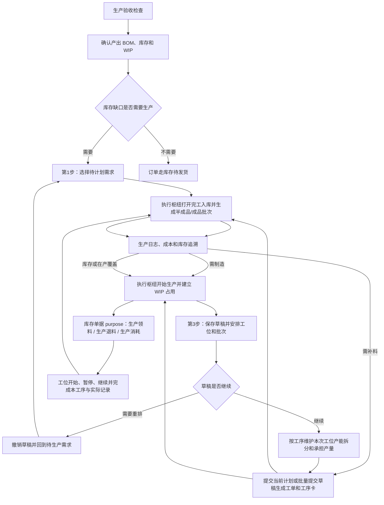

# 操作手册：生产流程

## 按任务执行与完工入库（PR-654）

入口：生产管理 → 生产流程。计划员从“生产工单”查看调度状态并分配任务；现场人员从“工位视图”领取或执行任务；质检员从“生产质检”处理检查；仓库从“完工入库”核对并过账。页面顶部的“操作说明”打开本手册。

1. **生产工单**默认显示未结束工单。列表只保留产品/规格与工单号、目标数量、当前状态、工序进度、当前待办和快捷操作。进入“查看工单”后，按工序及“第 N 批/共 N 批”查看执行人、工位、阻塞和进度；配方、成本及订单追溯按需展开。
2. **分配执行人**只影响当前工序批次任务，不改变整单调度负责人。可在工单详情单项分配，也可在工位视图批量分配；有权限的员工可领取任务。仓库、质检和调度只在阻塞时显示为待协同岗位。
3. **开始本任务**前核对执行人、工位、本批所需 WIP、前序可交接产出和质检。首次成功会自动建立工单运行记录，不需要先开始整张工单。某一批齐套即可执行，其他缺料批次继续等待；同一份 WIP 不会被两个批次重复使用。
4. **领料、补料、退料和耗料**均从工位任务打开库存单据并带入工单、任务及物料。领料过账才转入 WIP，耗料过账才扣料。首道工序使用冻结 BOM 的直接组件；后续工序承接前序实际产出，不重复占用原料。
5. **报工**只填写实际投入、实际产出、耗时和必要异常，不选择入库仓。不同单位分别记录，不直接相加损耗。完成后可在工单详情的“工序记录”展开核对人员、投入产出、耗时、损耗及异常；旧“工序卡”链接仍可进入同一记录视图。
6. **生产质检**从任务进入时自动带入工单、工序和批次。没有检查记录显示“未检查”，检查结果必须主动选择。质检冻结、复检和放行仍按原规则执行。
7. **完工入库**汇总末道报工结果，分别显示待入库、部分入库和已入库。页面带入冻结目标仓和当前未入库实际产出；半成品可选“本次部分入库”或“最后一次入库”，商品沿用完工入库。增量入库不会重复扣料或重复计成本。

常见待办：待分配时先选执行人；待领料时查看每项物料的需求、WIP 可用和缺口后打开领料；等待前序时核对上一工序已报工产出；待质检时进入对应批次检查。只有真实生产异常显示“异常”。旧工单无法可靠恢复任务用料时会要求人工确认，历史已执行工单继续保留原库存和成本口径。

所有分配、领取、开工、报工和质检操作均可在操作日志按工单或任务查询；领退补料、耗料和入库的库存影响参见[库存作业手册](OP_MANUAL_STOCK.md)。

## 自动领料建议（PR-653）

新建计划后，在“备料情况”查看需求、WIP 已有、待领数量和真实缺口。系统只使用同货主、可用且质检允许的库存，先分配 WIP，再按仓库排序和编号补齐；一个物料可以从多个仓领入，仓内按先进先出建议批次。点击物料展开来源、货主和批次；“调整来源与数量”只保存草稿中的手工意图，其余需求自动补齐，刷新会保留仍有效的调整。

例如需求 21kg，WIP 有 6kg，A 仓有 10kg，B 仓有 5kg：显示“WIP 已有 6kg，待领 15kg，供给已落实”。自制组件可由已落实的上游工单供给；原材料仍不足时，显示具体缺料并保留草稿。

| 操作 | 库存与工单变化 |
| --- | --- |
| 预览、保存草稿、刷新供应 | 生成建议，不占用或转移库存 |
| 提交生成工单 | 重新核对并预留供给，不转仓；失败保留草稿并指出缺料 |
| 去领料 | 按工单打开库存单据，带入冻结来源与待领数量 |
| 仓管提交领料单 | 本次数量的库存和预留一起转入 WIP，可以分次领齐 |
| 开工 | 全部组件在 WIP 足额预留且满足质检、工序要求后允许执行 |

来源调整仅限草稿。已提交工单沿用冻结来源，通过已有领退料单据处理，不能自由更换仓库、货主或批次。领料不改变货权。包装可在所需上游产出分批入库并齐套后开工，不必等整张上游工单完成。

旧草稿点击“刷新供应”后升级；已提交的历史工单继续使用原规则。领料单详见[库存作业手册](OP_MANUAL_STOCK.md)。

## 履约订单确认与整单进度（PR-647）

履约订单“待确认”或“已拒绝”时不进入待生产清单，也不能创建计划、工单、库存占用或发货记录。负责人或管理员确认接单后再安排执行。已存在未开工计划或库存占用时，先取消/解除后才能修改订单；开始生产及后续履约的订单不允许修改。

单个工单完成不等于整单完成。系统核对全部关联工单和每项规格的累计产量；袋、kg 等按 BOM 库存单位计量，共同生产的产量按关联订单需求分配，不能重复计入每一张订单。分批发货按全单规格的累计出库数量显示部分发货或全部发货。

## 订单生产与半成品备货（PR-648）

入口：生产流程 → 生产计划；页面右上“操作说明”可打开本手册。计划员安排计划，仓库办理批次入库，现场人员记录工序实际投入和产出。

PR-650-PRODUCTION-PLAN-DETAIL-WORKSPACE：点击生产计划单据号或“详情”后进入完整详情工作区。顶部先确认计划号、状态、任务数和关联订单；“本次生产安排”按上游到下游展示每一条独立任务，订单、客户、销售规格、冻结 BOM 和目标仓库不会因同名商品而合并丢失；“用料与来源”集中选择各组件的来源仓库与货主；右侧“提交前核对”汇总数量、来源、供应和工序拆分阻断项。修改目标仓库、组件来源或工序拆分后，先点击底部“保存草稿”，系统一次保存并重新核对；全部通过后才可“提交生成工单”。已提交、生产中、已完成和已取消单据只读，底部可进入实际生成的工单。旧草稿需要按当前库存重新计算时使用“刷新供应”，页面会明确提示该动作会重建上游任务和拆分；历史已提交计划继续使用原冻结快照。

1. 待计划需求按商品档案归组，展开查看规格、需求件数、库存覆盖、待生产件数及订单号，再展开订单查看客户和对应数量。袋、盒、条分别统计，重量单独展示；已确定的订单数量按原销售单位显示；只有无法可靠确认数量或库存换算时才显示“件数待确认”，BOM 异常不会隐藏已知数量。相同名称的不同商品不会合并。
2. 勾选商品或规格可选择其全部可选需求，部分选中显示半选。分页按商品进行，翻页保留选择；刷新后会重新核对状态。库存充足、已计划和配置异常的需求不可重复计划。预览失败可重试，预览不会创建草稿或占用供应。
3. 订单预览按“可用现货 → 已下达/生产中的未分配预计产出 → 新增生产”计算。共享熟豆的上游任务按物料、冻结 BOM、货主、工艺和目标仓兼容性合并，包装任务保留规格及订单快照。BOM 可继续向更多层级展开。
4. 独立备货使用“半成品备货”：选择自制物料、填写目标产出量、选择目标仓。单位来自物料档案，必须配置默认已发布 BOM。预览后创建备货草稿，核对组件来源仓，安排工序产能拆分，再提交。备货没有销售订单关联，不推进无关订单状态。
5. “关联在途供应”显示供应工单、产出仓、分配量和已兑现数量。草稿只保存分配建议；提交重新校验现货和在途余量。同一预计产出不会被多个计划重复占用。余量变化时保留草稿，点击“刷新库存和在途供应”，核对重新生成的上游拆分后再提交。已提交工单不会随刷新或 BOM 改版而回改。
6. 半成品工单开工并记录工序实际产出后，从执行枢纽“半成品分批入库”进入库存作业，选择“本次部分入库”，填写本次产出及本次实际投入。每次生成独立批次、库存单据和增量成本；部分入库后工单保持未完成。再次打开入库会建议尚未入库的目标余量，可按实际数量修改。
7. 全部工序完成后选择“最后一次入库”，结清累计投入、产出和费用并释放未消耗预留。多产留作自由库存；少产不会虚构库存，关联供应显示“上游少产/待补产”，下游执行枢纽显示尚缺数量，由计划员安排补产或调整后续计划。
8. 每批产出优先兑现已分配下游供应。包装工单的全部组件批次及预留足额、且满足原有质检和工序要求时即可开工，无需等待整张烘焙工单最终结束。待检冻结/不合格批次不计入可用供应。
9. 取消下游会释放现货和未履行在途分配。上游仍有未履行的下游关联时不能直接取消；先取消相关下游工单后再处理上游。已入库批次不随工单取消倒退成未入库。

结果核对：计划详情查看冻结 BOM、来源仓、工序拆分和关联供应；工单查看批次、库存单据、实际成本和订单追溯。创建、来源仓修改、刷新供应、提交、分批入库和取消均可在操作日志追查。

常见异常：没有可选自制物料时检查物料是否停用、是否半成品及默认 BOM 是否发布；“其他货主”表示配方引用或仓库归属不兼容；“在途余量已变化”表示供应已被占用、已入库或被取消；“工序实际产出不足”应先记录本次工序结果；实际投料超过冻结预留时，仅能使用同仓同货主的额外可用批次，库存不足则先补料。

## 生产计划：创建草稿前与编辑草稿（PR-652，接续 PR-649）

创建草稿前只有两步：`选需求 → 核对缺口`。两页均标明“尚未创建草稿”，不会保存单据或生成工单。

1. **选需求**：展开“商品 → 规格 → 订单”，选择本次需求。右侧“本次选择”按商品规格汇总并支持移除；袋、盒和 kg 分别统计。搜索与筛选在表格上方，异常行显示具体原因。点击“下一步：核对缺口”。
2. **核对缺口**：查看商品缺口和生产用料，右侧“创建前核对”区分配置阻断、需制造、待补料、库存或在产覆盖。物料待补不一律阻止创建，仍沿用原有创建校验。可“返回选需求”；确认后点击“创建草稿并编辑”。创建后可设置用料来源、工位和批次，提交后才会生成工单。
3. **进入草稿详情**：草稿创建后直接进入统一详情，与点击已有计划号的页面一致。标题显示生产计划号和草稿状态，持续提示“正在编辑草稿”；创建成功另外提示一次。工位和批次在“本次生产安排”中编辑。
4. **保存与提交**：底部区分“有未保存修改”“草稿已保存，有待处理项”“已具备提交条件”。先保存修改，按右侧阻断定位处理数量、来源和工序安排；核对通过后才可“提交生成工单”。提交结果、工单数量和“查看生产工单”留在同一详情。点击后只显示本计划生成的工单，刷新仍保留计划范围；可通过来源返回入口回到计划详情。
5. **刷新与返回**：链接记录生产计划号，刷新或重新打开只读取同一单据，不会新建草稿。“更多”中的“刷新库存与在产供应”重新计算供给；失败保留输入。返回生产计划定位计划记录，不会撤销草稿。
6. **更换需求**：草稿创建后不能返回修改原订单需求。需要更换时，在“更多 → 撤销草稿”确认计划号；成功后回到选需求，需求重新可选，再创建会得到新计划号。旧计划保留“已取消”记录。
7. **异常恢复**：创建前刷新会重新校验选择，失效需求明确提示。创建成功但详情加载失败时，保留计划号并点“重新加载详情”。保存失败保留输入，版本冲突先重新读取核对；离开或刷新未保存的草稿会提示。重复点击创建不会生成多张草稿。

计划记录位于页面下方，可从标题右侧“计划记录”直接定位。冻结 BOM、来源仓、订单分配和工单追溯仍在详情查看。旧“安排生产”第三步和重复按钮组已移除。

## 适用范围
生产配置、生产验收、生产计划、开始生产、生产中、生产工单、工序卡、生产质检、生产日志、WIP 占用、成品/半成品入库与批次追溯，以及工单上下文中的成本追溯。

PR-473-GENERIC-MANUFACTURING-ABSTRACTION + PR-487-PRODUCTION-PLAN-CAPACITY-SPLITS + PR-488-PRODUCTION-PLAN-SPLIT-QTY-AUTOBATCH + PR-490-JOB-CARD-BATCH-CARDS + PR-491-PRODUCTION-DEMAND-STATUS-JOBCARD-CONTEXT + PR-493-PLAN-WORKORDER-SPLIT-EDIT + PR-495-PRODUCTION-WORKSTATION-OVERVIEW + PR-496-PRODUCTION-FLOW-PHASE1-OPTIMIZATION + PR-497-WORKORDER-INVENTORY-CONTROL + PR-499-PRODUCTION-EXECUTION-HUB-PHASE2 + PR-500-UNIT-MODEL-CONSOLIDATION + PR-501-PRODUCT-UOM-SALES-CONVERSION + PR-502-PRODUCT-UNIT-TEMPLATE-REFERENCE + PR-503-PRODUCT-UNIT-TEMPLATE-MULTI-SALES-UOM + PR-504-PARENT-PRODUCT-CHILD-SKU-UOM + PR-505-SALES-SPEC-TEMPLATE-DERIVED-SKU + PR-514-WORKSTATION-COST-COMPONENTS + PR-518-MULTI-CAPACITY-OPERATION-COST：生产主流程统一使用 `父商品 / 子 SKU / BOM / 工艺路线 / 工序 / 工位 / 生产计划 / 工单 / 工序卡 / 库存单据`，并继续满足 PR-473 的通用制造对象链。父 SKU 负责商品族信息并引用销售规格模板，销售规格模板维护库存单位并自动派生具体子 SKU；咖啡、包装盒、童装等行业差异通过子 SKU、BOM、工艺路线、工序、工位、工位产能和商品生产配置表达；库存单位覆盖原料、WIP、半成品和成品库存，销售规格来自子 SKU 并由价格表/订单快照固化，报价单位和录单单位只作为历史兼容字段；工位维护机器/人工/其他小时成本和适用工序，工位产能维护单批标准和标准分钟，工艺路线为每道工序选择 `标准成本产能档` 用于 BOM/价格标准成本，生产计划和工单仍在执行阶段选择真实工位产能；草稿计划和未开工工单在工序产能拆分中选择本次真实工位产能并折算计划工序成本，已开始执行的工单不允许覆盖拆分；待生产需求维护 `待计划 / 生产中 / 生产完成` 状态，已进入生产计划的需求不可重复生成计划；工单负责开始生产、领料到 WIP、消耗/退料、取消、完工入库、库存单据和库存流水聚合；工序卡主表记录子 SKU、BOM/配方、时间、成本、损耗和异常，不把咖啡投料/出豆字段作为通用主流程列。生产负责人从 `生产视图` 看今日整体进度、卡点和下一步处理人；现场操作员从 `工位视图` 看当前任务、下一任务和不能做原因；生产计划、工单和库存作业用步骤条、完成面板和 WIP 上下文减少跨页判断；工单执行枢纽把同一工单的 readiness、WIP、质检、库存单据、完工入库、成本和追溯时间线集中展示。

PR-600 起，上述子 SKU 权威只保留给尚未逐商品切换的 legacy 商品和历史冻结业务。已 cutover 商品改用 `父商品 / BOM 规格 / BOM 规格变体快照 / BOM / 工艺路线 / 工单 / 库存单据`：稳定业务身份是父商品 + BOM 规格，版本变体只作配方和执行快照，不再创建或接受旧子 SKU 新业务。

PR-509-E2E-RAW-MATERIAL-ORDER-PRODUCTION-FLOW：端到端验收时，生产流程必须承接订单库存不足需求，而不是单独手工造工单。主链路为 `原料 -> 商品 / SKU -> 下单 -> 生产计划 -> 生产工单 -> 工序卡 -> WIP / Stock Entry -> 完工入库 -> 库存与订单追溯`；任何一步不能继续时，记录阻断并按 RED/GREEN 修复。

PR-552-STOCK-ENTRY-CONVERGENCE：生产工单的生产领料、补料、退回未用原料、记录生产消耗和完工入库统一打开库存作业中的 Stock Entry 抽屉。系统按工单实际领入、已消耗、已退回和当前 WIP 批次计算缺口或可退数量；仓管复核后提交，单据、批次位置、库存余额、库存流水、工单统计和操作日志在同一事务中更新。生产工单不再调用独立 WIP 或成品转仓写入页。

PR-553-PRODUCTION-PLAN-PARENT-BOM-UNIT-CONVERSION（legacy 兼容）：尚未 cutover 的商品仍使用订单冻结的子 SKU 销售规格换算，不从规格名称猜重量。PR-600 已切换商品不再做商品规格换算，订单数量就是 BOM 规格库存数量；计划和工单冻结父商品、BOM 规格及本次规格变体/BOM 版本。

PR-555-PRODUCTION-PLAN-DRAFT-CANCEL：生产计划草稿如果需要重排，可在提交工单前使用“撤销草稿”。系统保留原计划号和冻结快照，将关联需求重新放回“待计划”；已提交工单或已经进入生产的计划不能用此动作。

PR-556-PRODUCTION-PLAN-DRAFT-SPLIT-UX / PR-585-BOM-SINGLE-MATERIAL-LOSS：生产计划的 BOM 摘要不再显示整体产出率。只有实际解析到的 BOM 版本启用了“原料损耗比”时，摘要才显示 `BOM原料损耗`；具体 SKU 继承父商品 BOM 时读取同一父 BOM 版本。PR-649 起，草稿创建后直接进入统一详情，由计划员主动打开生产安排并核对后提交。

生产计划解析 BOM 时仍遵循 `具体 SKU BOM 优先 -> 具体 SKU 完全未配置时继承父商品 BOM -> 当前默认已发布版本 -> BOM 版本绑定工艺路线`。订单数量使用冻结换算，规格名称只用于显示；主工作台不再单列“计划投料”，理论投入和损耗计算保留在冻结快照与计划详情中。

PR-558-PRODUCTION-PLAN-PREVIEW-PARENT-BOM-NO-LOSS：当前生产计划预览只计算本次选中的 `待计划` 订单，不把同一规格已进入旧生产计划的订单重复加入物料需求。父商品已发布 BOM 缺少工艺路线时，预览仍展示该 BOM 的配方、原料损耗和组件预计消耗，并提示“BOM 配置待完善”；正式生成草稿前必须补齐工艺路线。未配置 BOM 原料损耗时，预计消耗等于订单冻结成品需求。

PR-559-PRODUCTION-CONFIG-WIP-ISSUE-UX：生产 BOM 并入 `生产配置` 第 4 个 Tab。工单开工前由统一 WIP 覆盖计算检查冻结物料需求；released 工单即使尚未创建占用记录，也会在执行枢纽逐物料显示需求、可用和缺口。点击“生产领料”会打开一个多物料库存单据，显示真实工单号、单一数量输入和库存单位。PR-561 后预览带出全部冻结物料，缺口作为建议量，零建议行可按需填写标准批量。

PR-560-PRODUCTION-ISSUE-COMPACT-DIAGNOSTICS：生产领料的多物料明细按统一列头紧凑显示，恢复草稿时重新读取当前 WIP 覆盖。原料仓库存不足或质检冻结时，页面用中文列出受影响物料及需要、可用、缺少和库存单位。

PR-561-WIP-BULK-MATERIAL-ISSUE / PR-599：工单当前 WIP 缺口只作为建议领用量，不限制原料仓到 WIP 的实际批量。重量物料主档库存单位统一为 kg，仓管可以把建议 1.974kg 改为 60kg；底层规范克余额不变。BOM 及历史工单冻结的 `g/lb/oz` 用量不改写，执行时按规范克维度与 kg 主档等价校验；例如冻结 `600g` 只领用/消耗 `0.6kg`，不能向上取整成 `1kg`。最近一次已提交的批量会作为下次默认值，已有批量草稿也会保留原数量。超出本工单当前需求的部分保留为可用 WIP，实际生产消耗仍通过生产消耗单据另行记录并受工单剩余冻结需求限制。真实原料仓合格库存仍是硬上限。

PR-562-PRODUCTION-EXECUTION-JOB-CARD-CONSOLIDATION：工单级动作统一进入 `工单执行枢纽`，工序级动作统一进入 `工位视图`。生产工单列表只查询、查看、编辑未执行拆分和打印；工序卡只读展示冻结工序要求、状态、实际数据和状态时间。开始、暂停、继续、完成本工序及实际数据录入均在工位完成，完工入库仍从执行枢纽进入统一 Stock Entry。

## 入口
- 生产管理：生产视图、工位视图、生产配置、生产流程、生产排程、生产日志、生产手册。`生产流程` 用五个 Tab 集中生产计划、生产工单、工序卡、生产质检、生产验收；生产手册固定在生产管理菜单最底部。顶部生产切换条使用生产流程统一入口，并保留 `生产中` 兼容状态页和统一完成面板。
- 生产管理：`生产配置` 用四个 Tab 维护工艺路线、工序、工位/设备、生产 BOM；默认打开工艺路线，生产 BOM 用于维护产出商品、组件清单和多层展开。旧生产 BOM 书签会自动进入生产配置的生产 BOM Tab。生产成本不再作为常规菜单或顶部切换入口，但工单执行枢纽和追溯上下文仍可打开既有成本明细。
- 生产管理相关页面顶部有 sticky 模块内切换条：生产视图、工位视图、生产计划、生产中、工单、工序卡、质检、日志、成本。生产视图、工位视图和生产中会显示待处理/阻塞/执行中 badge；生产负责人优先进入生产视图，现场工位优先进入工位视图。工单列表用于查询和查看，工序卡用于只读复盘；工单号和“执行枢纽”进入工单级动作，“进入工位”定位工序级现场任务。
- 商品：商品档案、商品价格管理和商品价格表。商品档案是父商品入口。已切换商品的具体销售/库存规格由默认已发布 BOM 的规格组提供，新业务统一使用“父商品 + BOM 规格”；商品档案只读展示并跳转 BOM。尚未切换的 legacy 商品继续通过历史子 SKU 参与生产、库存、BOM 和价格，直到逐商品迁移完成。
- 库存管理：仓库库存、库存作业、出库日志，用于 WIP、批次追溯和发货复盘。

## 流程图

## PR-604 BOM 草稿工作区

BOM 规格、路线和组件均先在当前页面草稿中编辑。组件按钮仅“添加到当前配方”，删除也只改本地草稿并立即从列表消失；页面底部统一点击“保存 BOM 草稿”后才写入。物料产出保存只提交物料 `items`，允许用空列表清空旧配方；商品产出保存只提交规格 `variants`。草稿未保存时不能发布，关闭或切换会提示放弃改动。商品产出切换为物料会立即清空规格组，物料切换为商品必须选择已发布规格模板后保存。

## PR-606 已发布 BOM 替代草稿与损耗编辑

- 保存、发布的成功或失败结果常驻显示在 BOM 抽屉顶部。保存失败时不要关闭抽屉：本地改动仍保留，且系统会阻止发布旧数据；处理提示的问题并重新点击“保存 BOM 草稿”，成功后再发布。
- 修改名称、产出对象、产出数量、状态、路线、规格、组件或损耗都会显示“未保存改动”。物料产出 BOM 开启原料损耗后，修改损耗比例会立即重算所有已有比例组件；例如 19.5% 损耗下，50%/15%/20%/15% 分别显示损耗后 62.11%/18.63%/24.84%/18.63%。保存后后端以版本损耗率统一覆盖全部物料比例行。
- 已经发布过的 BOM 不能原位改成另一个产出商品或物料。保存此类修改时，系统会自动创建一个新的替代 BOM/V001 草稿并打开它，提示“原已发布 BOM 与历史版本保持不变”。核对新草稿的产出对象、1kg 产出基准、路线、损耗和全部组件后再发布；不要删除或改写源 BOM 历史。
- 空配方替代草稿只能用于等待补配方，不能发布、不能设为默认 BOM，也不会让物料显示可制造。补齐真实组件、单位、路线和损耗并通过发布校验后，再设置为物料默认 BOM。
- PR-606 生产批量切换必须由发布人员按“锁定清单预览 → 完整数据库备份 → 单事务应用 → 只读验收”执行。成员、来源版本、配方指纹或未完生产引用变化会终止整批；不得绕过门禁手工逐行修改生产数据。

## PR-629 规格主体组件

- 新建商品生产 BOM 选择“规格模板”后，`规格主体组件`可以选择物料，或选择一个商品及其已发布 BOM 规格。旧接口提交的 `main_input_material_id` 仍按物料兼容处理。
- 选择商品作为规格主体时，系统会冻结商品 ID、已发布 BOM 规格 ID 和规格库存单位，并把它写入当前生产 BOM 版本；该商品规格会沿用普通商品组件的生产、库存和追溯链路。
- 发布及设为默认 BOM 时，商品主体按所选商品与已发布规格校验，不要求另选主体物料；模板来源可以是已发布或历史已发布版本。商品停用、规格未发布或主体来源缺失时仍会阻止操作。
- 商品主体只能用于固定用量模板。模板主体使用“比例 %”或启用原料损耗时，必须改选物料；这是因为比例和损耗是原料配方语义，不能套用到已经按 BOM 规格定单位的商品组件。商品自身也不能作为自己的主体组件。
- 生产 BOM 模板本身仍只保存未解析的主体占位符；具体选择在创建或重新套用模板时完成。模板、BOM 版本和组件保存失败时不会留下半套的主体来源记录。

## PR-607 半成品生产阶段与商品分装阶段

- 半成品生产阶段：先选择物料产出 BOM，把生豆等原料加工为 kg 库存的“名称-半成品”。半成品只有绑定默认已发布 BOM 时才可制造；待补配方草稿不允许发布，也不能作为正式制造来源。
- 商品分装阶段：再选择同名商品产出 BOM。每个规格以对应半成品物料为唯一主料，并配套包装物料；统一使用“标准咖啡熟豆规格80g-2.5kg”发布模板的 18g、36g、80g、100g、227g、454g 和 2.5kg 规格。商品 BOM 归入“烘焙豆-商品”的单品或拼配分类，商品档案原分类不随 BOM 移动。
- 日常维护时不要把两级配方合并：烘焙损耗、生豆比例和工艺路线维护在半成品 BOM；分装克重和袋材维护在商品 BOM。生产计划选择商品默认 BOM 后，会按商品分装主料继续解析对应半成品的默认制造 BOM。
- `墨昙、果皮茶、晨曦·娜依、巴布亚新几内亚、萨琪姆水洗`当前只保留“待补半成品配方”的商品 BOM 草稿。在半成品真实配方补齐并发布前，不得给这些商品设置默认 BOM，也不得宣称可制造。
- 批量迁移仅由发布人员按“锁定预览 → 完整备份 → 单事务应用 → 服务重启复查 → 重复应用幂等验证”执行。模板、包装物料、31 个商品映射、默认绑定或未完生产依赖发生变化时必须停止整批操作。

## 标准操作
1. 开工前进入生产验收，确认仓库、原料批次、WIP、生产工单、WIP 占用、生产日志、质检和成品追溯检查项。
   - PR-495-PRODUCTION-WORKSTATION-OVERVIEW / PR-496-PRODUCTION-FLOW-PHASE1-OPTIMIZATION / PR-499-PRODUCTION-EXECUTION-HUB-PHASE2 / PR-562-PRODUCTION-EXECUTION-JOB-CARD-CONSOLIDATION：日常调度先进入 `生产视图`。页面按今日任务汇总待处理、执行中、已完成、异常、工位负载、阻塞原因、任务就绪状态和下一步处理人；需要处理时可直接打开执行枢纽、库存作业或质检。工单开工必须在执行枢纽点击“开始生产”：只有 `can_start=true` 时可点击，阻断时按页面原因先补 WIP 或资料；命令处理中全部工单动作会禁用，成功后枢纽原地刷新，失败用中文提示并保持抽屉打开。现场执行进入 `工位视图`，按工位查看 `现在做`、`下一件` 和 `不能做原因`；每张任务卡展示工单、商品、规格、工序要求、优先级、状态和负责人，并严格按服务端动作执行开始、暂停、继续、完成本工序、报异常和呼叫补料。工序卡页面只用于查看和复盘，不执行状态操作。
2. 生产前维护商品档案和物料，并在 `生产管理 / 生产配置` 的工艺路线、工序、工位/设备、生产 BOM 四个 Tab 维护制造主数据。生产 BOM 必须声明“产出商品 + 产出数量 + 组件清单”，组件可以是物料，也可以是另一个有库存的半成品/成品商品。商品档案不编辑 BOM，只作为库存/销售对象被 BOM 产出或消耗；商品档案只可在该商品已有的产出 BOM 中设置一个默认 BOM 主表，不选择默认版本。
   - PR-419：BOM 详情中的“被哪些 BOM 使用”只表示当前产出商品被上层 BOM 当组件消耗；生产 BOM 列表点击 BOM 名称直接打开设置抽屉，不再使用单独“编辑”按钮。
   - PR-585：BOM 名称只填写业务名，例如 `ALO TOH#1`。列表和详情不会把 `BOM-000659` 编号、`生产 BOM` 后缀或 `/ V001` 版本拼进名称；编号和版本仍在各自字段中查看并可用于搜索。新建、修改和复制时即使粘贴了带编号或版本的完整标签，系统也会清洗为业务名。
   - PR-420：编辑或新建生产 BOM 时，产出商品和商品组件下拉主标签显示 `SKU编号 商品名`，例如 `SKU-000518 初晓`，用于区分同名商品并支持按 SKU 编号搜索；商品档案 `SKU-000518 初晓` 的“被哪些 BOM 使用”会显示产出该商品的 `BOM-000884 初晓拼配`。
   - PR-578：新建生产 BOM 的“产出商品”可以选择所有启用商品，包括生豆父商品和具体 Kg 等销售/库存 SKU；搜索“生豆”应显示现有生豆商品。失效商品仍不显示，BOM 内“商品组件”的原有候选范围不因本次调整扩大。选择生豆只建立可编辑 BOM 草稿，仍需维护组件并正式发布后才能用于价格试算。
   - PR-500 / PR-504 / PR-505 / PR-553（仅 legacy 商品兼容）：尚未 cutover 的商品仍可用具体子 SKU 产出、父商品 BOM 继承和销售规格换算；历史计划、工单、WIP、完工入库和库存流水继续冻结原子 SKU 与换算快照。PR-600 cutover 后不再用该口径创建新业务：商品 BOM 必须维护至少一个规格，每个规格固定产出 `1 × 自身库存单位`，订单、价格、成品库存和生产统一使用父商品 + BOM 规格，组件固定用量仍跟随各组件库存单位。
   - PR-592 / PR-600：BOM 版本或商品规格配方只维护一个 `原料损耗比`，表示损耗占总投料比例。页面不再区分“有损耗/无损耗”两个区域，而是在一个组件列表中锁定单一模式。开启损耗后全部组件必须是物料 `比例 %`；关闭损耗后第一条组件决定全比例或全固定模式，二者不得混用。全固定模式允许按各组件库存单位录入，例如 `0.227kg 熟豆 + 1个袋子`。比例公式仍为 `实际原料需求 = 计划投料基准 × 配方比例 ÷ (1 - 原料损耗率)`。
   - PR-585-BOM-SINGLE-MATERIAL-LOSS：`整体产出率` 和 `整体预期损耗` 已从当前 BOM/商品配置与计算中删除。数据库中保留的旧 `yield_rate`、商品 `expected_loss_rate` 只用于历史兼容，不参与新成本、新计划或新工单计算，也不能通过旧客户端恢复第二层损耗。历史已发布 BOM、工单、库存流水、价格表和订单快照不回算；调整当前配方时仍复制为新草稿再发布。
   - legacy 子 SKU 没有显式模板库存单位时，生产 BOM 继续显示兼容兜底单位并提示维护旧销售规格模板。已切换商品的规格单位只在 BOM 规格模板/规格组中维护；规格已发布或已有库存、价格、订单引用后不能改单位，需新增规格。历史 BOM、工单和库存流水不批量回改。
   - 生产 BOM 的列表分类来自 `设置 / 业务设置 / 分组模板` Tab，不是生产 BOM 自己维护的大组/小类。先维护分组模板的大类和小类，再回到生产 BOM 页面选择 `分组模板`；选择后 BOM 列表按模板完整大类 / 小类树和 `未分类` 自动整理，空分类也显示，不再提供分类过滤 Tab。
   - 商品档案配置抽屉中的“被哪些 BOM 使用”会展示 `BOM状态`：`默认状态`、`启用状态` 或 `失效状态`。默认状态优先表示该 BOM 是产出商品当前默认 BOM；失效状态只用于历史追溯。
   - PR-485：BOM 版本选择工艺路线。发布某个 BOM 草稿版本后，该 BOM 原 published 版本自动归档为历史快照；生产计划和工单永远使用该默认 BOM 的最新 published 版本，不允许在前端覆盖 BOM 版本。
   - PR-577：published 生产 BOM 必须有真实组件。旧兼容数据若留下空的 published V001，价格试算会阻断并指出同 BOM 中有组件但尚未发布的草稿；先检查草稿产出商品、组件、单位、商品形态和两类损耗，再正式发布。系统不会自动读取或发布草稿，也不会把空旧壳重新绑定为当前发布版本。
   - PR-578：如果商品完全没有可用于试算的已发布 production BOM，价格计算模板会明确提示到本页面新增或发布 BOM，而不是返回 0 元和笼统缺成本警告。新建后仍需在草稿版本维护真实组件并发布；仅保存空草稿不会成为可试算成本来源。
3. PR-387-VIEW-CONTEXT：顶部“当前视图”为客户或订单时，生产计划和工单只使用客户/订单过滤和追溯标签；生产排产、开工、工序卡、质检和成本仍是工厂执行入口，不变成客户专属生产页面。
4. 原料到货后，在库存作业中做原料入库，生成原料批次和原料仓库存。
5. 准备生产时，在库存作业中把原料领到 WIP 在制仓；未用完的 WIP 原料可退回原料仓。
6. 录单保存时，如果成品批次或历史成品库存余额足够，选择使用库存后订单进入库存待发货；选择不使用则进入生产计划。
7. 录单页需要新客户时，使用新增客户抽屉，粘贴收件信息后识别姓名、电话和地址，保存后继续录当前订单。
8. PR-472-MANUFACTURING-PRODUCTION-PLAN-WORKORDER-LIFECYCLE：生产计划只选择库存不足且已解析到商品档案的商品生成正式 `生产计划`，库存充足区只提示，不进入生产工单；历史未绑定商品档案的订单明细需要先在订单或商品侧补绑定后再进入生产。挂耳、盒装速溶、发动机总成这类多层结构先按最终产出商品库存判断缺口，再按选择的 BOM 展开组件需求。
9. 历史版本说明：PR-649 之前，生产计划使用左右工作台和五步步骤条；下面保留旧版本的追溯规则。当前操作请按本手册顶部“生产计划：创建草稿前与编辑草稿”执行。PR-473-GENERIC-MANUFACTURING-ABSTRACTION + PR-475-PRODUCTION-PLAN-ERPNEXT-WORKBENCH + PR-485-BOM-VERSION-ROUTE-DEFAULT + PR-489-PRODUCTION-PLAN-PREVIEW-LAYOUT + PR-491-PRODUCTION-DEMAND-STATUS-JOBCARD-CONTEXT + PR-492-PRODUCTION-DEMAND-ADDON-ORDER-SPLIT + PR-496-PRODUCTION-FLOW-PHASE1-OPTIMIZATION + PR-553-PRODUCTION-PLAN-PARENT-BOM-UNIT-CONVERSION + PR-556-PRODUCTION-PLAN-DRAFT-SPLIT-UX + PR-558-PRODUCTION-PLAN-PREVIEW-PARENT-BOM-NO-LOSS：旧版页面顶部显示 `选需求 -> 生成草稿 -> 拆分产能 -> 提交工单 -> 开始生产`；旧版右侧预览曾展示 BOM 摘要、物料需求汇总和工艺路线摘要。BOM 损耗、订单冻结换算、同规格加单隔离、默认 BOM、已发布版本、工艺路线和计划快照规则继续有效；当前主工作台只显示用户需要处理的商品缺口和生产用料，技术快照移到计划详情。
10. PR-475-PRODUCTION-PLAN-ERPNEXT-WORKBENCH + PR-487-PRODUCTION-PLAN-CAPACITY-SPLITS + PR-488-PRODUCTION-PLAN-SPLIT-QTY-AUTOBATCH + PR-489-PRODUCTION-PLAN-PREVIEW-LAYOUT + PR-490-JOB-CARD-BATCH-CARDS + PR-493-PLAN-WORKORDER-SPLIT-EDIT + PR-496-PRODUCTION-FLOW-PHASE1-OPTIMIZATION + PR-514-WORKSTATION-COST-COMPONENTS + PR-555-PRODUCTION-PLAN-DRAFT-CANCEL + PR-556-PRODUCTION-PLAN-DRAFT-SPLIT-UX：进入草稿详情后，计划员在“本次生产安排”打开工位和批次工作区，按计划行和工艺路线工序选择工位产能、批量和承担产量；最后一批不足标准批量时会明确标记。保存拆分不会自动提交工单；点击 `提交并生成工单` 后才创建工单和工序卡。草稿创建后不能修改原订单需求；需要更换时先撤销草稿，让需求回到待计划，再重新创建。已提交、生产中、已完成和已取消计划不能改需求、拆分或重复提交。
11. PR-472-MANUFACTURING-PRODUCTION-PLAN-WORKORDER-LIFECYCLE + PR-474-PRODUCTION-PLAN-BULK-SUBMIT-FILTER：生产计划单据列表降级为历史和批量管理区，支持状态和时间过滤：状态可选全部、草稿、已提交工单、生产中、已完成、已取消；时间类型可选创建时间、提交时间、完成时间，并可填写开始日期和结束日期。列表默认显示最近 50 条，按创建时间倒序。需要批量处理历史草稿时，在生产计划单据列表勾选草稿计划后，点击顶部 `提交生成工单`。只有 `草稿` 计划可勾选；已提交工单、生产中、已完成和已取消计划不可勾选。计划提交生成生产工单和工序卡，提交后生产计划进入 `已提交工单`，系统按计划行生成 `released` 生产工单，并按工单冻结的工艺路线生成 `pending` 工序卡。工单冻结当时的客户商品快照、商品档案快照、生产 BOM 版本、组件需求、多层展开树、生产配置字段和工艺路线快照。
   - PR-478-PRODUCTION-PLAN-DOCUMENT-DETAIL：生产计划单据列表保持紧凑。点击计划号或详情打开生产计划单据详情工作区，可查看单据头、计划行、BOM 版本、工艺路线摘要、物料需求汇总、工艺参数/商品生产配置快照和生成结果。草稿计划显示尚未生成工单；已提交计划显示关联工单、工单状态和工序卡数量，并可从详情进入工单或工序卡页面。
12. PR-592-BOM-LOSS-GROSS-INPUT + PR-562-PRODUCTION-EXECUTION-JOB-CARD-CONSOLIDATION：在生产工单页筛选 `released`，点击工单号或“执行枢纽”，确认计划投料、BOM组件需求、BOM原料损耗、WIP可用量和建议领到 WIP 数量后，在执行枢纽点击 `开始生产`。BOM 原料损耗是唯一配置损耗；新计划按 `净配方需求 ÷ (1 - BOM原料损耗率)` 反推理论总投料，未配置时投料等于净配方需求。旧 `yield_rate`、商品 `expected_loss_rate` 和设备整批不得再次放大物料需求。
   - PR-388/多层制造：生产计划和工单按创建计划时解析出的最新生产 BOM 版本读取组件组成。BOM 发布新版不会回改已开工工单；工单继续使用创建时冻结的 BOM 版本、展开树、组件需求、工艺路线和库存占用快照。
   - PR-511-BOM-MATERIAL-LOSS-BOM-LEVEL + PR-557-PRODUCTION-PLAN-BOM-LOSS-DEMAND：BOM版本级 `原料损耗比` 是新生产计划的唯一标准损耗来源。计划投入已经包含该损耗后，比例组件只按计划投入和配方比例分摊，不再重复除以 `1 - 原料损耗比`。历史商品配置 `expected_loss_rate` 只作兼容快照，不参与新计划计算。
   - 例如14件454g成品需求为6356g，BOM原料损耗18%时理论投料为 `6356 ÷ 0.82 ≈ 7751.22g`，为保证用料覆盖按整克向上取整为7752g；智烘按4kg标准批量安排8kg只属于拆分产能，不会把物料需求改成8000g或10000g。
   - PR-558：BOM原料损耗为0时，14件454g的理论投料和组件预计消耗合计就是6356g，不再被旧80%产出率或历史商品损耗放大。右侧物料汇总只计算本次勾选的待计划订单；同一规格已进入旧生产计划的订单不会重复加入。
   - PR-558：父商品已发布 BOM 有组件但缺工艺路线时，可以先在预览中核对 BOM 配方、损耗和预计消耗；页面同时显示 `BOM 配置待完善`。点击生成草稿仍会被拒绝，应先到生产 BOM 的当前已发布版本补齐并发布有效工艺路线，再返回刷新和生成草稿。
   - 生产计划只使用 `published` BOM版本。BOM编辑页中的V004若仍为草稿，计划继续使用当前已发布V003；发布V004后需撤销旧草稿并重新生成，系统不会静默改写既有计划快照。
   - PR-390：生产计划和工单显示工艺参数/产品信息时优先读取商品生产配置字段。咖啡的 `roast_level`、服装的布料参数、鲜果加工的成熟度/去皮参数等都属于商品生产配置字段；旧 BOM 版本特殊属性和旧商品档案字段只作为 fallback。
13. 未选择库存不足项目时，不会开始生产，也不会生成生产中记录、生产工单或 WIP 占用。已选项目没有手工填写投料数时，系统按生产计划的默认投料数启动；设备、单批标准、承担产量和自动批次数只在草稿生产计划的工序产能拆分中维护，不在工艺路线中维护。只有 `released` 工单允许开始生产；`draft/running/completed/cancelled` 工单不能再次开始。
14. 在执行枢纽点击开始生产后，系统生成生产中记录、running item 和 WIP 软占用，把工单置为 `running`，并把相关工序卡切到可执行状态。重复点击、非法状态或并发命令会被服务端拒绝，不会重复生成生产中记录、running item、生产工单或 WIP 占用。旧 `POST /api/produce/start` 入口和历史开始接口保留兼容。
15. 生产工单列表只用于查看商品规格、订单信息、计划数量、BOM/工艺路线、工艺参数、冻结配置、工序汇总、WIP 与成本，并可打印工单。列表不再显示“开始生产”或“完工入库”。PR-493：工单状态为 `released` 且所有工序卡仍是 `pending` 时仍可“编辑拆分”；开工后入口不可用。工单号和“执行枢纽”打开同一抽屉，先看 readiness、逐物料 WIP 需求/可用/缺口和质检状态；红色“WIP库存不足”时进入生产领料。多物料领料的缺口是首次建议值，可按实际批量修改，真实原料仓合格库存仍为硬上限。
16. PR-490 / PR-491 / PR-499 / PR-562：工序卡只读展示商品、BOM/配方、顺序、冻结工序要求、工位及产能、状态、计划/实际分钟与成本、实际损耗和原因、异常原因、开始/暂停/继续/完成时间及操作人。历史缺少工序要求时显示“按冻结工艺路线执行”。点击“执行枢纽”查看所属工单；点击“进入工位”会携带工单和工序卡定位对应现场任务。工序卡没有状态按钮、编辑框或“保存实际”，历史实际更新接口仅用于兼容。
17. PR-479-MANUFACTURING-PHASE2-EXECUTION-COST-CLOSED-LOOP / PR-497-WORKORDER-INVENTORY-CONTROL / PR-562-PRODUCTION-EXECUTION-JOB-CARD-CONSOLIDATION：现场主链路为 `执行枢纽开始生产 -> 生产领料 -> 工位执行 -> 执行枢纽完工入库 -> 成本追溯`。库存作业的 Stock Entry 继续承载生产领料、退料、消耗和 `purpose=manufacture` 完工入库。
18. 工位视图严格使用服务端 `available_actions`：状态动作中，`pending/ready` 显示“开始”，`running` 显示“暂停”和“完成本工序”，`paused` 显示“继续”和“完成本工序”，`completed/cancelled` 不显示状态动作。运行中任务仍可按服务端能力显示“报异常”“呼叫补料”等业务动作。动作处理中该任务全部按钮禁用；成功后重新读取服务端状态和时间，失败显示中文原因且不伪改状态。“完成本工序”一次填写并提交实际分钟、实际投入、实际产出或成品件数、余料、损耗原因、异常/备注和适用入库仓，不再先保存实际再完成。实际投入、实际产出和余料旁显示工单冻结的库存单位；例如每件为 `0.454Kg` 时，填写 `14件` 会按 `6.356Kg` 保存实际产出。实际产出和成品件数二选一，不得同时填写。
19. `GET /api/produce/work-orders/:id` 返回工单、物料占用、工序卡、库存单据、库存流水、生产日志、成本汇总和 `execution_hub`；`execution_hub.readiness` 判断能否开始/完成，`trace_timeline` 支持追溯。主管确认必要工序、WIP 消耗和质检状态后，从执行枢纽打开“完工入库”统一 Stock Entry；工单列表不提供平行完工入口。
20. 完工入库失败时，先检查工序卡是否全部完成、WIP 是否足够、批次是否被质检冻结、该工单是否已经完成。失败不会新增成品批次、库存流水、生产日志或成本记录。
21. WIP 占用异常时，进入仓库库存的 WIP占用抽屉，按工单调整占用克重或释放废弃工单占用；WIP 占用抽屉的 WIP 总量和可用量只统计 active、仍有剩余且非待处理/拒收冻结批次；按生产中记录释放时，即使历史占用缺少工单行也必须释放匹配占用；调整和释放必须写操作日志。
22. 取消生产时，调用 `POST /api/produce/work-orders/:id/cancel`。取消生产时，系统会同步取消生产工单和工序卡；如果工单已开始生产，复用 running item 取消链路释放未消耗的 WIP 占用。
   - `撤销生产计划草稿` 与 `取消生产工单` 是两件事：草稿还没有工单、WIP 或库存变更，使用生产计划上的“撤销草稿”；工单已生成后不能把计划退回草稿，必须按工单取消和库存修正流程处理。
23. 生产质检可记录工单质检、原料质检和产品质检；当前类型按钮分别显示选择工单、选择原料批次、选择产品批次。
24. 质检结果为待处理或不通过时，关联原料批次、WIP 批次或成品批次显示质检状态和冻结状态，冻结批次不能继续领料、生产扣料或成品出库/转仓。
25. PR-496-PRODUCTION-FLOW-PHASE1-OPTIMIZATION：生产中页面只保留扫描字段和一个主动作。点击 `完成/部分完成` 后进入统一完成面板，按面板填写投料、成品件数、余料、入库仓和异常/备注；一次做不完则勾选部分完成，剩余工单继续保留。
26. 完成生产遇到 WIP 批次质检待处理或不通过，或 WIP 不足时，系统会拒绝本次完工并保持工单继续生产；页面在行内或完成面板内展示原因、影响对象和动作入口。处理方式是从生产中、生产视图或工单执行枢纽打开库存作业，系统会带入 WIP tab、工单、工序卡、running item、物料和缺口数量上下文；若是质检冻结，先从枢纽或生产中打开生产质检复核对应批次，确认合格或更换合格 WIP 批次后再提交完工。
27. 完成生产时成品总克重不能大于本次消耗投料；如果出现该提示，先核对实际产出、投料和是否漏填补投料，系统不会写完成日志、成品库存、FP 批次或扣料日志。
28. 合并多规格生产单必须一次填写全部规格的实际产出，不能使用部分完工；如果确实需要分批完成，先按单规格分别生成生产计划，避免同一生产工单的库存、成本和订单状态拆散。
29. 完工后系统扣减本次 WIP 原料或半成品库存，生成 FP 成品批次或半成品库存批次，写入生产日志、生产成本、库存流水、成品/半成品库存；完工和库存单据负责库存投入/产出追溯，工位完成操作记录实际投入、实际产出和余料，工序卡只读展示时间、成本、损耗和异常。
30. 发货或复盘时，在仓库库存输入 `FP-...` 查看成品到工单、生产日志、原料消耗的追溯链；输入 `MB-...` 或 `LEGACY-MAT-...` 查看原料批次和当前仓库位置。

## 制造三期生产协调
- PR-480-MANUFACTURING-PHASE3-SCHEDULE-CAPACITY：生产排程工作台保存排程前，先确认工单、工序卡、工位/设备和计划开始/结束时间。保存工单或工序卡排程会记录计划时间、班次、负责人、优先级、备注和工位/设备；保存产能日历会记录日期、班次、可用分钟和停机分钟。排程和产能保存都能在操作日志追溯。
- PR-481-MANUFACTURING-PHASE3-SCHEDULING-WORKBENCH：进入 `生产管理 → 生产排程`。列表视图用于快速找工单，日历视图用于按日期查看，甘特视图用于观察时间跨度，工位负载用于查看工位/设备产能。三期只提示冲突，不自动改排程；排程只排已生成工单或工序卡，不选择 BOM、不选择路线、不做 fallback。
- PR-482-MANUFACTURING-PHASE3-MRP-SUGGESTIONS：排程工作台右侧的 `MRP 建议` 会按当前日期、状态和工作中心读取物料需求，展示采购建议和调拨建议。调拨建议表示可从原料仓领到 WIP 的数量；采购建议表示 WIP 可用量和原料仓库存都覆盖不了的净缺口。建议只辅助计划，真实领料仍到库存作业创建 Stock Entry。
- PR-483 历史兼容 / PR-527 / PR-585：行业设置页的独立计算预览已移除；旧 `/api/industry-calculators/preview` 固定返回 `410 Gone`，不再接受业务预设或客户端损耗率。原料损耗只在有商品和版本上下文的生产 BOM 中维护。
- PR-484-MANUFACTURING-PHASE3-TRACEABILITY-ANALYTICS：生产成本页增加生产追溯分析。可按工单 ID 或生产批次查看追溯链路、成本差异和异常损耗。追溯链路串联工单、工序卡、Stock Entry、物料/成品批次和成本记录；异常损耗来自工序卡实际损耗和原因。

## 工艺路线和行业字段
- PR-389 历史兼容：旧数据可能仍从 BOM 版本特殊属性读取 `roast_level` 等工艺参数；PR-390 后新 UI 维护入口迁到商品档案的商品生产配置，工单创建时优先冻结商品生产配置字段。
- PR-487-PRODUCTION-PLAN-CAPACITY-SPLITS / PR-512-PRICING-RULE-TRIAL-SOURCE-COST / PR-514-WORKSTATION-COST-COMPONENTS / PR-518-MULTI-CAPACITY-OPERATION-COST：最新口径为：工序列表只维护工序名称和状态；工位/设备维护机器、人工和其他小时成本以及适用工序；工位产能只维护标准批量、单位、标准分钟和状态，并作为候选成本能力；工艺路线维护工序顺序、是否记录损耗、质检项，并为每道工序选择 `标准成本产能档`，该字段只用于 BOM/价格标准成本，不代表生产计划实际排产。
- 进入 `生产管理 -> 生产配置 -> 工序` 维护工序名称和状态。工序列表不再作为标准工序成本录入口；工序单位成本由工位小时成本、工位产能档和工艺路线里的 `标准成本产能档` 共同确定。
- 进入 `生产管理 -> 生产配置 -> 工位/设备` 先维护工位和成本组成：`机器成本/小时`、`人工成本/小时`、`其他成本/小时`，系统显示 `小时成本合计`；同时在工位上维护 `适用工序`，例如烘焙机勾选烘焙工序，包装台勾选包装工序。再为工位维护 `工位产能`，例如 `布勒 18kg`、`布勒 15kg`、`智烘 3kg`；每个产能只填写标准批量、单位、标准分钟/批、状态和备注，不填写小时费率，也不单独勾选适用工序。产能档会展示候选单位成本：`小时成本合计 × 标准分钟 / 60 / 标准批量`。PR-494-CAPACITY-OPERATION-AUTO-SPLIT：生产计划自动拆分按工位适用工序筛选该工位下的启用产能；未配置适用工序的旧工位仍可手工选择，但不会参与自动拆分。
- 进入 `生产管理 -> 生产配置 -> 工艺路线` 维护路线；路线定义步骤怎么跑，例如烘焙、裁剪、缝制、去皮、包装。每道路线工序选择工序、维护工序名称快照、是否记录损耗、质检项和 `标准成本产能档`。候选产能档只来自启用工位、工位适用当前工序、启用产能档；同一工序有多个候选时必须人工选择，系统不按排序或最便宜自动猜。BOM 版本草稿选择一条工艺路线；发布 BOM 版本时冻结所选标准成本产能档的工序成本快照，价格试算和商品价格表读取这个快照。实际使用哪台设备、哪条产能和多少成本，仍在生产计划草稿或未开工工单的 `工序产能拆分` 中决定。
- 发布工艺路线或生产 BOM 时，如果标准成本产能档已失效，错误会直接指出 `工艺路线 -> 第几道工序 -> 产能档 -> 工位`，并说明是产能档停用/不存在、工位停用/不存在、工位不适用当前工序或尚未选择产能档。按提示回到该工艺路线，为对应工序重新选择有效产能档，保存并重新发布路线后再发布 BOM。系统不会自动替换产能档，避免在未确认费率和标准批量时改变标准成本。
- 进入生产计划页时默认只看 `待计划` 需求；需要复盘已提交或已完成需求时，把需求状态切到 `全部` 或对应状态。切到全部后左侧标题显示为 `生产需求`，避免把生产中或已完成的需求误认为还能重复排产。创建生产计划前，当前计划工作台只显示计划预览；生成草稿后可从草稿详情点击 `编辑拆分`，进入完整的产能拆分工作区。
- PR-651：产能拆分顶部显示本次计划实际包含的工序，名称与顺序来自冻结工艺路线。例如路线是“滚筒烘焙 → 手工装袋”，页面就显示这两个名称；其他产品路线会显示其自己的工序，页面不会固定成某两类生产阶段。点击工序 Tab 后，中间按计划任务逐项显示商品/物料、冻结规格、计划数量和来源订单；同商品的多张订单仍分别显示数量，不能只看合计。
- 任务数量使用当前工序的实际产能口径：重量产能显示 kg/g，包装等计件产能显示冻结销售单位，如袋/件/盒。每项任务分别显示 `计划数量 / 已安排 / 还需安排`；右侧 `拆分核对` 逐项显示已覆盖、不足或超排，某项超排不能抵消另一项不足。可以为一项任务添加多个工位，或点击 `自动拆分` 使用该工序适用的启用产能；没有适用产能时页面直接说明原因。
- `保存草稿` 允许先保存尚未覆盖完整的拆分，便于稍后继续；所有任务覆盖后才可 `确认安排`，存在超排时必须先勾选已核对超排数量。两者都只保存产能安排，生产计划仍保持草稿，不生成工单；返回计划详情后仍需点击 `提交生成工单` 才进入执行。未保存直接返回时页面会提示。
- 系统根据承担产量和工位产能标准批量自动计算批次数、计划分钟和计划工序成本。提交生产计划时，这些安排冻结到工单和工序卡，后续修改工位或工位产能主数据不会回改历史工单。保存拆分会写入生产计划操作日志。
- 草稿不再需要时点击 `撤销草稿`，核对计划号后确认。页面会切回 `待计划` 并刷新需求；原订单商品可以重新勾选生成新草稿。撤销失败时不要重复创建计划，应先根据提示确认该计划是否已经提交或生成工单，再刷新计划单据状态。
- PR-490-JOB-CARD-BATCH-CARDS + PR-493-PLAN-WORKORDER-SPLIT-EDIT + PR-514-WORKSTATION-COST-COMPONENTS：拆分计算规则为：计划数量等于用户填写的 `承担产量`；计划批次数等于 `ceil(承担产量 / 标准批量)`；计划分钟等于 `计划批次数 * 标准分钟/批`；计划工序成本等于 `计划分钟 / 60 * 工位小时成本`。例如计划拆分为 `布勒 18kg` 承担 90kg、15 分钟/批、工位小时成本 300 元/小时，自动得到 5 批、75 分钟、375 元工序成本；再加 `智烘 4kg` 承担 8kg 则自动得到 2 批和对应分钟、成本。若承担 20kg 但标准批量是 18kg，计划数量仍是 20kg，批次数为 2 批，页面显示 18kg 和 2kg 两个批次卡片，并标记最后一批不足标准批量。工序主数据名称修改后，只影响后续新建生产计划/工单的工艺路线快照；历史已生成单据继续保持冻结。
- 商品专属参数不放在工艺路线里。烘焙度、布料克重、鲜果成熟度等放在商品档案的商品生产配置中，开工时随工单冻结；计划原料损耗只在生产 BOM 版本中维护。
- 行业字段模板用于沉淀不同业务的参数字段；商品生产配置字段是普通用户维护这些参数和值的入口，不要求用户手写 JSON。PR-403 后行业字段模板改为左侧模板列表、右侧模板编辑；左侧支持搜索模板名和启用/停用/全部过滤，点击模板名后在右侧编辑，新建模板也在右侧编辑。用户不再维护行业键，字段键同时作为显示名；新增字段只支持文本和下拉，文本字段可填默认文本，下拉字段用空格分隔选项。商品档案配置只能保存所选行业字段模板中已有的字段，不能临时新增或删除字段定义；字段定义调整必须回到行业字段模板。
- 工艺路线保存、发布、停用，工序/工位主数据保存或停用，工位产能保存或停用，行业字段模板保存、停用，以及工单开工和工位触发的工序卡开始/暂停/继续/完成，都会写操作日志，可在操作日志按 `process_route`、`manufacturing_operation`、`manufacturing_workstation`、`manufacturing_workstation_capacity`、`industry_field_template`、`work_order` 或 `job_card` 追溯。

## 客户商品到生产执行
- 录单、客户门户和履约侧选择客户商品或客户侧商品引用。cutover 商品必须解析到父商品 + 当前默认已发布 BOM 规格，订单数量按该规格库存单位 1:1 进入计划，并冻结本次规格变体、BOM 版本、路线和配方；规格名称只用于显示。legacy 商品继续解析到具体子 SKU 并读取订单冻结的销售规格换算，PR-505 的模板派生口径只适用于这条兼容分支。
- 如目达摩 454g 的权威换算示例是 `1件 = 0.454Kg`。订单 4 件时计划数量为 `4件 × 0.454Kg/件 = 1.816Kg`；父商品 BOM 基准产出 1Kg 时，配方和工艺路线按 1.816 倍展开。BOM 未配置原料损耗时，计划原料就是净配方数量，不得被任何旧产出率放大。
- 停用商品不会进入新的待生产需求。启用商品若缺少当前销售规格到库存单位的权威换算，仍会显示为不可勾选的“资料待完善”行，并在状态栏直接说明需要补充的销售单位和库存单位；该行不会阻止其他有效需求加载和排产。
- 遇到“资料待完善”时，先看状态栏的具体原因，无需展开订单号。缺少 BOM 物料明细时，在 `生产管理 -> 生产配置 -> 生产 BOM` 核对对应商品和版本的投入物料及用量；默认 BOM 停用、产出不匹配或默认配置冲突时，在同一入口修正配置；订单锁定版本不可用时，核对原订单与版本，不直接套用新版本。已发布版本的配方调整应按版本流程处理，不能覆盖既有工单快照。若提示销售单位无法换算，再进入 `商品 -> 商品档案` 核对销售规格模板、库存单位及每件库存数量，处理后返回生产计划刷新。不要按商品名称猜重量，也不要把 `1件` 人工等同为 `1盒`。
- 录单和履约保存订单行时，会同时冻结客户商品快照和商品档案快照。生产计划和工单不按客户展示名找 BOM，而是使用订单行上的商品档案 ID、商品档案编号/名称快照和所选生产 BOM 快照执行。
- PR-394：商品档案页和客户商品页的分类模板 Tab 只影响列表分组、价格表展示和人工查找，不改变生产对象。商品在某个分类模板下重新归类后，已经生成的订单、生产计划、工单和成品批次不会回改；新生产计划仍按订单行冻结的客户商品和商品档案选择产出 BOM。
- 工厂自营订单也按同样链路执行：工厂自营客户商品用于销售展示，商品档案用于库存和生产。
- 客户只是贴牌改名时，多个客户商品可以绑定同一商品档案，生产计划选择同一个产出 BOM，不生成重复 BOM。
- 客户专属包装、客户改配方、受托加工或客户来料时，必须创建独立商品档案，并在生产 BOM 中声明该商品为产出，避免库存、成本和追溯混在一起。
- 一次性订单如果只改展示名或价格，用客户商品和价格快照解决；如果生产定义变化，则建一次性用途商品档案并让工单冻结产出该商品的生产 BOM。

## 结果校验
- 生产验收页面没有关键红灯，或每个红灯都有明确补救入口。
- 生产计划中的订单只按库存缺口进入工单，库存待发货订单可在订单列表直接发货。
- 挂耳订单在生产计划中显示为挂耳生产需求，并展示需求袋数、熟豆商品组件需求、熟豆组件缺口和上游烘焙需求；不会把挂耳订单直接当熟豆重量订单处理。
- 盒装速溶工单选择“10条盒装速溶”BOM 后，可按策略只准备条装速溶库存件，或继续展开到条装速溶 BOM 中的速溶粉和条包装膜。
- PR-358-PRODUCT-PRICE-LIST-ORDER-PRODUCTION：生产计划行会携带产品类型、产品子类型和工序模板 ID。速溶咖啡这类无 BOM 产品可通过产品类型/产品子类型识别默认原料“速溶咖啡”，不再只依赖商品名称或旧 `product_kind`。
- PR-392：订单进入生产计划时，工序模板/单位/价格规则解析优先使用商品档案引用的商品配置模板，旧产品子类型模板只作为 legacy fallback。示例：示例大客户复制“盒装速溶配置”后，让对应商品档案在“商品档案配置”抽屉中引用该客户配置，生产计划即可使用配置中的“速溶包装流程”。
- PR-359-PRODUCT-KIND-MIGRATION-CLEANUP：旧 SKU 迁移后，生产优先读取产品子类型和客户规则解析出的工序模板；缺少新配置时才使用历史 `product_kind` 兼容逻辑。历史订单进入生产时不改原订单价格和价格快照。
- 挂耳 BOM 中的 `product` 组件只扣熟豆成品库存或形成熟豆缺口，不从原料批次直接扣；滤袋、外盒等 `material` 组件仍按物料库存扣减。旧 `finished_product` 组件类型只作为历史兼容读取。
- 执行枢纽开始生产失败时保持抽屉打开并显示中文原因，生产中记录、生产工单和 WIP 占用数量都不会增加。
- 开始生产若遇到 WIP 多物料不足，错误提示会一次列出全部不足物料及各自需求/可用/占用数量。
- 生产计划旧页面或重复点击开始生产时，不会重复生成生产中记录、生产工单或 WIP 占用；接口会返回 `production already started`。
- 历史未绑定商品 SKU 的订单明细不会让生产计划报错，也不会生成无 SKU 工单。
- 多品项订单只完成部分生产品项时，订单不会提前进入生产完成或可发货范围。
- 生产工单、工序卡、生产日志、生产成本、库存流水和 FP 成品批次能互相对上。
- 生产日志列表会显示生产批次、`FP-...` 成品批次、消耗的 `MB-...` 物料批次和物料摘要。复盘或发货前可以先从生产日志确认本次完工批次，再到仓库库存输入 `FP-...` 查看完整追溯链。
- 工单展示冻结的 BOM 原料损耗和实际损耗汇总；已发布 BOM 版本绑定工艺路线后，生产工单展示冻结路线和工序汇总；工序卡按冻结路线生成并只读展示工序要求、实际分钟与成本、损耗和异常。实际投入、实际产出和余料由工位完成操作写入并在工位执行记录中核对，不作为工序卡列表展示字段。
- 新建或编辑 BOM 时只设置 `原料损耗比`，不再设置整体产出率或整体预期损耗。旧版本即使保存过这两个兼容字段，当前价格试算和新生产需求也只按 BOM 原料损耗计算一次。
- WIP 占用调整或释放后，可用量变化正确，调整后可用量没有包含冻结、拒收、已停用或已耗尽批次，并能在操作日志追溯。
- WIP 占用释放后，接口响应的释放数量必须和数据库占用状态一致，不能出现提示已释放但占用仍为 reserved。
- 取消生产后，对应生产工单和工序卡为已取消，未消耗 WIP 占用为已释放。
- 待处理或不通过质检会冻结对应批次，冻结批次不能继续被业务误用。
- 冻结 WIP 批次导致完成生产失败时，不会新增生产日志、成品库存、FP 批次或原料消耗日志，原生产中记录保持 running。
- 合并多规格生产单部分完工失败时，不会更新规格产出、生产日志、成品库存、FP 批次或原料消耗日志，原生产中记录保持 running。
- `LEGACY-MAT-...` 页面说明这是系统升级按旧物料库存生成的期初批次。

## 常见问题
- 无法开始生产：从工单号进入执行枢纽，查看“开始生产”按钮的阻断原因。检查商品档案是否已设置默认 BOM（或只有一个 active 产出 BOM）、默认 BOM 是否仍产出该商品、最新 published BOM 版本是否配置工艺路线、物料库存是否足够、WIP 是否有可用原料、设备产能是否完整；工单列表本身不提供直接开工。
- 生产计划显示“资料待完善”：状态栏会直接列出原因，可能是 BOM 缺少物料明细、默认配置冲突、版本不可用，或销售规格到库存单位换算缺失。按该原因处理后刷新；该行不能勾选或生成计划，但不会阻止其他有效需求排产。BOM 异常时仍保留已知的订单数量及可靠库存覆盖；换算缺失时不会把不确定的库存覆盖显示为 0。停用商品的历史订单不会进入新的生产需求。
- 生产计划预览显示“BOM 配置待完善 / 未配置工艺路线”：系统已经按具体 SKU 或父商品当前已发布 BOM 展示配方、损耗和组件预计消耗，但该 BOM 还不能生成正式草稿。进入 `生产管理 -> 生产 BOM`，为当前已发布 BOM 创建带有效工艺路线的新版本并发布，再回到生产计划刷新；不要改用旧 BOM，也不要把预览提示当作可绕过的校验。
- 执行枢纽提示 WIP 不足：按钮会置灰并汇总展示全部不足物料；按提示在库存作业补领对应原料到 WIP，刷新枢纽后再重试。
- 开始生产提示 `production already started`：说明订单或代加工需求已经开工，刷新生产计划和生产中页面，继续处理已有生产中记录，不要重复点击或用旧页面再次提交。
- 库存明明够但仍进生产计划：检查录单时是否选择“不使用”库存批次。
- 生产计划缺少某条历史订单：检查订单明细是否绑定商品 SKU；未绑定 SKU 的历史明细会被跳过，补绑定后再进入生产计划。
- 挂耳生产提示熟豆不足：先检查挂耳 BOM 是否配置熟豆商品组件、组件克重是否按每袋设置，以及对应熟豆商品是否有可用成品库存；不足时按上游烘焙需求先排熟豆生产。
- 挂耳生产提示包材不足：检查 BOM 中滤袋、外盒等物料组件是否配置为 `material`，并在库存作业补足对应物料。
- 批次扣减不符合预期：检查 WIP 占用、实际消耗投料、部分完工记录和 FIFO 规则。
- 生产日志或成品追溯看不到原料批次：先确认该完工是否有生产运行库存流水；系统会用同一 `production_run` 的物料扣减流水补齐旧消耗日志缺失的物料批次号。如果仍为空，说明历史记录缺少可用库存流水，需要人工核对当时的生产单据。
- WIP 占用调整后可用量低于预期：检查是否有待处理、冻结、拒收、已停用或已耗尽的 WIP 批次；已停用或已耗尽的 WIP 批次不会计入可用量，先完成质检复核、恢复有效库存或更换合格批次。
- WIP 占用释放后仍显示已占：按生产中记录重新查询占用状态；如果页面提示释放成功但仍为 reserved，先暂停继续开工并让管理员检查历史占用和操作日志。
- 多品项订单完工后仍显示生产中：检查订单是否还有其他已绑定 SKU 明细存在剩余生产缺口；补齐剩余品项生产或确认有可用成品库存后再发货。
- 生产成本异常：检查 BOM 唯一的原料损耗、投料数量、物料 kg 库存与同单位采购价、标准工序成本快照及实际产出。BOM 可以按 g 录入并换算到 kg；20% 原料损耗应只按 `净用量 ÷ 0.8` 反算总投料一次，旧整体产出率或商品预期损耗不得参与当前结果。
- 价格试算提示“已发布生产 BOM Vxxx 没有组件”：在生产 BOM 打开对应主表，确认提示中的草稿版本确实包含正确原料。直接销售的生豆还要确认商品形态为生豆、产出单位和直接销售损耗口径正确；确认后再发布该草稿。不要直接修改历史 published 版本，也不要用临时最终价掩盖空 BOM。
- 工艺路线没有进入工单：检查生产 BOM 的最新 published 版本是否选择了已发布工艺路线；路线修改只影响后续 BOM 版本和新生产计划，不会回写历史工单。
- 完成生产提示 WIP 不足或批次被质检冻结：先看生产中行内或完成面板里的原因、影响对象和动作按钮。点击 `处理库存作业` 会打开统一 Stock Entry 并带入工单与缺口，可执行生产领料或补料；若提示 quality block，先到生产质检复核对应原料批次，确认合格或更换合格 WIP 批次后再完工。
- 合并多规格生产提示不支持部分完工：补齐同一生产单全部规格的实际产出后一次完工；需要分批时，回到生产计划按单规格分别开工。
- 需要修改已完成生产记录时，先确认是否影响库存、成本和审计记录。

### 标准制造成本与生产执行边界
- 标准制造成本用于商品价格试算和价格表发布，来源是默认 BOM、标准工艺参数和工位小时费率快照，单位折算到商品/SKU 的库存单位。
- 工位成本由机器小时成本、人工小时成本和其他小时成本组成，合计小时费率用于标准工序成本折算；工位产能和实际批次数仍在生产计划/工单阶段选择。
- 生产计划/工单选择真实工位和产能不回改历史价格。实际执行可以冻结当次工位、产能、批次和实际工时，用于后续实际成本追溯。
- 如果标准成本和实际生产成本差异较大，先检查 BOM、工艺路线标准工时、标准产出、工位小时成本和实际生产记录，不要直接修改历史价格表快照。

### PR-563 工位产能按工时/按计件成本
- 入口：`生产管理 → 生产配置 → 工位/设备 → 工位产能`。适用角色为生产配置维护人员；保存产能需要生产配置写权限，查看计划、工单和工序卡成本需要生产读取权限。
- 新建或编辑工位产能时先选择成本方式：
  - `按工时`：继续维护标准批量、批量单位和标准分钟/批；成本继承工位的机器、人工和其他小时成本。计划成本按 `小时成本 × 标准分钟/60 × 批次数`。
  - `按计件`：标准产能单位固定为 `件`，再填写每一个销售规格件的计件费率。这里的“一件”跟随具体 SKU：227g SKU 的一件是一袋227g，10条/盒 SKU 的一件是一盒10条，不需要再选择袋或盒。计划成本按 `计划销售规格件数 × 计件费率`，不再乘标准分钟或批次数。
- 工艺路线仍为每道工序选择标准成本产能档。发布生产 BOM 后，成本方式、费率、单位和折算关系进入工序成本快照；之后修改产能不会回改已发布 BOM。生产计划拆分选择本次真实产能后，工单和工序卡冻结本次成本参数。
- 工位完成按计件工序时必须填写实际产出数量；实际计件成本按 `实际产出数量 × 冻结计件费率`。不要用计划数量代替实际产出，也不要同时按工时和计件重复计费。
- “初晓拼配 227g”100件核对：具体 SKU 换算为 `1销售规格件=0.227kg`，因此100件即100袋、总成品22.7kg；包装产能选择按计件、0.5元/销售规格件，计划100件和实际产出100件时包装成本均为50元。烘焙、色选继续按各自工时产能计算，工单和成本追溯应分别显示三项成本和合计。
- 结果校验：工位产能刷新后成本方式和费率不丢失；操作日志能查到产能成本方式/费率修改；工单、工序卡和成本追溯中的工序成本明细之和等于总工序成本。
- 常见异常：
  - 提示计件单位不支持：计件产能单位必须是 `件`。袋、盒等包装层级由具体 SKU 决定，不在工位产能中重复定义；kg、g或lb也不能作为计件单位。
  - 包装成本不是50元：检查是否选择了具体227g SKU、冻结换算是否为0.227kg/销售规格件、计划/实际数量是否为100件，以及计件费率是否为0.5元/销售规格件。
  - 修改费率后旧工单不变：这是快照规则；新费率只影响新发布BOM和之后创建的生产计划/工单，历史记录不回算。

## 客户生产工单申请（PR-581）

- 客户小程序不维护投入物料。每行只选具体目标 SKU、销售规格和数量，可在一张申请中增加多个目标商品；相同 SKU 和规格会自动合并数量。
- 试算和提交都复用生产计划的 BOM 解析、单位换算和损耗口径。具体 SKU 有有效 BOM 时优先使用；没有时才继承父商品有效 BOM，并在预览中显示冻结版本和继承来源。
- 可用物料按 BOM 指定的物料档案及其归属汇总，只在该归属允许的库存/WIP 中取数；排除其他货主、冻结批次和已有预留。提交时再次锁定复核，不足则整单不写入。
- 生产申请进入 ERP“待排产”，不是直接创建执行中的工单。排产分组必须包含客户、目标仓和申请明细；真实工单、工序卡和完工入库沿用标准流程，完工仓固定为申请冻结的客户成品仓。
- 客户看到的状态由真实生产计划、工单和工序卡派生，包括待排产、已排产、已下达、生产中、暂停、部分完成、已完成和取消；不要只改申请头状态代替真实执行。
   - 生产 BOM 的列表分类来自 `设置 / 业务设置 / 分组模板`，不是生产 BOM 自己维护的大组/小类。先维护分组模板的大类和小类，再回到生产 BOM 页面点击内联分类工作区底部的 `设置分组模板`，在抽屉中勾选要使用的分组模板并 `保存模板选择`；`前往分组模板` 入口也保留在列表底部。
   - PR-588 的单展开手风琴和 PR-595 的内层“左侧分类树 + 右侧列表”均为历史 UI，现行由 PR-596-INLINE-CATEGORY-LISTS 覆盖。生产 BOM 页面把模板、大类、小类/后代分类、`未分类` 和 BOM 表按层级内联；每个展开且含 BOM 的分类重复完整表头并有自己的分页，一个分类翻页不影响其他分类。父分类直接归属的 BOM 不会因存在子分类而丢失。
   - 状态和 `按 BOM 名称或编号搜索` 继续按原语义过滤后再分组；点击 BOM 名称打开包含主档、版本和配方的完整设置抽屉，不再使用永久右侧详情栏。未选择模板时只显示 `全部分类` 平铺区、`移动到分类` 禁用，底部两个模板入口保留。
   - 勾选 BOM 后点击 `移动到分类`，筛选、业务行、分类内分页和行操作置灰；直接点击大类、小类/后代分类或 `未分类` 标题后立即移动，不显示目标下拉且不二次确认。`全部分类` 和模板标题不可作为目标。成功后清空勾选并退出，失败时保留勾选和移动模式供重试，取消恢复正常浏览。归类仍使用 `production_bom/production_bom` 和既有 assignment API/操作日志，PR-596 不改变身份或写入合同。
   - PR-626 分组列表交互：输入 BOM 名称或编号时实时筛选。系统按完整分类子树展开首条命中所在的模板、父类和小类，收起无命中的分支，并把首条 BOM 行滚动到屏幕内；父类没有直接 BOM 但后代命中时仍展开父类。无结果不移动焦点，清空搜索恢复搜索前折叠和滚动位置。
   - 顶部 `全部展开` / `全部收缩` 一次处理所有模板、各级分类和未分类；无模板时处理全部分类平铺区。只改变显示，不改搜索、分页、勾选或 BOM 数据；加载、移动模式、空列表时禁用，不要求编辑权限。搜索中允许手动调整，清空搜索仍恢复搜索前状态；移动成功或取消仍恢复进入移动前状态。
   - PR-626 分页与移动：每个分类 10 条及以下直接展示且不显示分页，11 条起才显示该分类自己的分页。进入 `移动到分类` 后，模板、大类、小类/后代分类和未分类标题全部可见，BOM 行与分页全部收起；大类、小类和未分类可直接点击，全部分类与模板不可选。成功或取消恢复原位置，失败保留勾选和移动模式。BOM 身份、assignment API、操作日志、状态筛选及详情抽屉均不变。

## PR-598：从物料到 BOM 到生产

1. 进入 `生产 → 生产配置 → 生产 BOM`，新增或复制 BOM，先选择 `产出对象类型`（商品 / 物料），再选择具体产出对象。任意有效物料都可被生产，不要求先勾选“是否半成品”。
   - 产出物料和组件物料下拉框只显示当前有效物料，已经作废的物料不能再用于新建或编辑 BOM。
   - 如果页面打开期间物料被其他人作废，保存时会提示“产出物料不存在或已失效”，且不会创建 BOM 或版本。关闭旧页面或刷新物料选项后，重新选择有效物料再保存；无需根据 `no rows in result set` 等数据库术语排查。
2. 维护组件、损耗、工序与版本后发布。只有同一产出对象的已发布版本能设为默认 BOM；循环依赖、无效组件或单位不兼容会阻止发布。
3. 在生产计划选择销售商品和数量。系统按默认 BOM 递归展开，逐层显示对象类型、总需求、库存覆盖、净缺口、计划动作和上游依赖；库存先覆盖，只有净缺口继续向上生成供应。
4. 提交后按依赖生成物料或商品工单。工单与生产执行抽屉均显示 `产出对象`；若存在未完成的上游依赖，页面显示原因和上游工单编号，下游不能开工。
5. 上游物料工单完成并入目标仓库后，下游工单才能继续；所有层级使用冻结的 BOM 与计划快照，后续改 BOM 不回改当前工单。
6. 打开草稿计划详情，在每条计划行的 `目标仓库` 中选择正式仓库并保存；商品默认成品仓，物料默认 WIP 在制仓。提交后该值只读冻结，关联工单沿用同一目标仓库。
7. 已提交计划只有在全部关联工单仍为未开工或已取消、且不存在运行项时才显示 `取消计划`；确认后系统一并取消未开工工单并释放预留。任一工单已经开工时不显示该动作。
8. 单张 `未开工` 工单可在工单列表或执行枢纽点击 `取消工单`，确认后页面自动刷新。生产计划详情的关联工单按 `商品 / 物料` 显示类型化产出对象，不再只显示商品名称。

## BOM 物料归属与组件来源（PR-639）

1. BOM 的每个物料组件引用一个明确归属的物料档案。工厂通用 BOM 只能使用本公司物料；客户 BOM 可以使用本公司物料和该客户物料，不能引用其他客户物料。发布时服务端再次校验。
2. 生成生产计划草稿后，“组件来源仓”只列出与 BOM 物料归属一致的仓库、货主、合格批次和可用量。同一工单的生豆、包材和其他物料可以来自不同仓库，但不能为同一个物料改选其他货主。
3. 提交计划会重新校验可用量，并把具体物料 ID、归属、BOM 版本、来源仓、库存快照和批次冻结到工单预留。任何一行未选择或不足时整张计划保持草稿。
4. 工单领料单从冻结批次生成，不能修改为其他物料、仓库、货主或批次。同名、同规格或复制来源相同不构成替代；不足时明确调整并发布 BOM 新版本，再用于后续计划。
5. 完工入库必须使用计划行冻结的目标仓。客户成品仓写入客户货主，工厂成品仓写入工厂货主；共享 WIP 的批次继续保留各自货主。
6. 重复提交不重复建立预留。取消未开工工单或生产计划会释放对应预留；已发生库存单据时按原单据冲销，保持仓库、货主和批次一致。

结果校验：同一物料需求只合并和覆盖一次；没有净缺口的节点不额外建供应工单；上游完成后下游阻断解除。

## PR-600：BOM 规格模板、规格组与统一配方模式

1. 在 `生产配置 -> 生产 BOM` 打开 `BOM 规格模板`。模板按版本维护名称、库存单位、默认规格、规格用量、包材、其他组件和工艺路线；发布前必须保证至少一个规格且恰好一个默认规格。规格键由系统内部按 `spec-1/spec-2` 序号自动生成，界面不再展示或要求填写（PR-601）。
2. 新建商品产出 BOM 时选择一个已发布 BOM 规格模板版本和一个规格主体物料。系统复制为 BOM 专属规格组；模板后续修改不会改变已复制 BOM。物料产出 BOM 继续使用单配方。
3. 商品 BOM 的每个规格固定产出 `1 × 规格库存单位`，独立维护完整配方。规格组整组保存、整组发布；任一规格失败时整组不写入。
4. 每个配方只允许一种模式：历史比例模式全部为物料 `比例 %`；固定模式按每个组件自己的库存单位录入，固定模式可录入 `0.227kg 熟豆 + 1个袋子`。PR-601 起新配方不再提供 `损耗比例` 输入，新组件只支持固定用量；历史已发布的比例配方和损耗数据保持只读兼容，成本试算与生产需求继续按 `净配方比例 ÷ (1 - 原料损耗率)` 计算。PR-603 例外：物料产出 BOM（单配方）恢复 `原料损耗比` 开关与 `损耗比例 %` 输入，开启损耗后组件全部为物料 `比例 %`；商品产出 BOM（规格组）保持纯固定用量。
5. PR-603：BOM 产出从商品改为物料（仅未发布 BOM 允许）时，切换会提示“规格组将随保存一起删除”；保存后草稿版本的规格组（规格与配方明细）被删除，规格身份保留审计，随后按平铺配方维护并可发布。已发布 BOM 的产出身份依旧不可修改。
5. 规格卡片中每个规格需填写 `规格用量`（即该规格产出 1 件时主体物料的用量，例如 227g 袋装填 227，单位跟随规格主体物料的库存单位）。
6. 物料下拉选项显示 `物料编码 + 物料名称`（无编码时仅名称），不会出现 `SKU-` 前缀；`SKU-` 编码仅用于商品选项。
7. 已切换商品的订单需求直接按规格单位进入计划，不再把销售规格转换为库存数量；BOM 组件内部的 g/kg 重量换算继续生效。历史子 SKU 与已冻结工单继续按旧合同执行。

## PR-608 商品 BOM 规格权威升级

商品的生产、库存和成本身份必须指向默认已发布商品产出 BOM 的具体规格变体。升级命令按 `preview → prepare → 补齐并发布规格 → preview → 备份 → apply` 执行；prepare 生成的规格草稿不会猜测配方，所有启用商品准备完成前不得 apply。规格、版本或默认 BOM 变化时，重新在 BOM 页面确认并发布后再进行价格和生产业务。

apply 为单事务迁移，完成后旧规格子商品只保留在迁移档案中用于历史追溯。发生新 BOM 规格业务写入后禁止逐行 rollback，只能按备份恢复；生产环境不使用开发升级命令。

## PR-616 挂耳咖啡四阶段生产配置

挂耳咖啡使用统一 BOM 的多级产出能力，不新增挂耳专用 BOM 类型。推荐按以下相邻阶段配置并分别发布默认 BOM：

1. 烘焙：生豆物料作为组件，产出熟豆半成品物料。
2. 研磨：熟豆半成品作为组件，产出咖啡粉半成品物料。
3. 挂耳包装：咖啡粉、挂耳滤袋和内膜作为组件，产出单袋挂耳包半成品物料。
4. 盒装包装：挂耳包和盒材作为组件，产出盒装挂耳商品的具体 BOM 规格。

每层先确认产出对象、库存单位、工艺路线、配方和版本，再发布并设为该产出对象的默认 BOM。创建盒装商品生产计划时，系统按默认 BOM 递归展开；若任一中间物料没有默认已发布 BOM，会显示供应缺口而不能形成完整上游制造工单。价格试算也使用同一条默认 BOM 链，因此叶子生豆和包材必须有有效成本，不能用零成本假装完成。
# 商品 BOM 的单一产出与多规格产出（PR-619）

新建商品 BOM 时先选择“产出结构”：

- “单一产出”适合盒装挂耳等商品本身就是库存身份的场景。填写产出数量并确认商品库存单位，然后直接维护配方。例如产出 `1盒`，组件为 `10袋袋装挂耳 + 1套包装材料`。系统不会创建隐藏规格。
- “多规格产出”用于同一商品由一个 BOM 同时维护多个制造规格的场景。必须选择已发布 BOM 规格模板和规格主体物料，再逐规格维护库存单位、路线与完整配方。

草稿可以切换结构；如果当前已有不兼容的平铺配方或规格组，页面会先确认并整组清除。已经发布的 BOM 不原地换结构，保存时会创建替代 BOM 草稿，原发布版本继续服务历史业务。

单一产出商品作为下游 BOM 组件时，只选商品并按其库存单位填写固定用量；多规格商品仍必须选明确的已发布 BOM 规格。设为默认 BOM 时，系统同步确定商品身份。多规格切单一产出若仍有旧规格库存、预留、未完成订单、计划、工单或履约会被阻止，需先处理这些业务。

多级计划继续按每个节点的默认已发布 BOM 递归。例如盒装挂耳会先展开到袋装挂耳，再展开袋装挂耳的下游工序。缺少默认 BOM、单位不兼容、自引用或循环时计划不会部分提交。

# 商品 BOM 统一规格组（PR-622，取代 PR-608/PR-619 迁移期口径）

- 商品产出 BOM 不再选择“单一产出/多规格产出”，始终使用规格组；物料产出 BOM 仍是物料档案单位下的单配方。
- 新建商品 BOM 自动出现一个空白默认规格。填写规格名称、可选条码，从全局单位字典选择库存单位，再维护完整配方；可以不选规格模板并手工增加多个规格。规格模板只是复制蓝图，不是必填项。
- 手工维护的规格组不要求规格模板来源，也不要求“规格主体组件”字段；只要每个规格的单位、配方、路线和成本校验完整即可发布。若选择了规格模板，则模板来源和规格主体组件必须成对保留并继续接受有效性校验；主体可以是物料，也可以是商品及其已发布 BOM 规格。
- 每个商品规格产出 1 个自身库存单位。商品作为另一个 BOM 的组件时必须先选择该商品当前默认已发布 BOM 中的明确规格，再按该规格库存单位填写用量；不允许直接商品组件。
- 商品 BOM 缺少规格、规格单位、配方或恰好一个默认规格时不能发布。直接向接口提交 `specification_mode=single` 会返回 `409 / product_output_requires_bom_spec`。
- 已发布 BOM、历史版本、工单和单据快照继续保留；新业务只读取当前默认已发布 BOM 规格。商品没有可用规格时显示“未配置 BOM 规格”，先补齐并发布 BOM，不要给商品档案补单位或子 SKU。
- 若尚未完成历史清理的旧商品 BOM 仍显示为“单一产出”，在草稿中选择已发布规格模板和规格主体物料后点击“重新套用模板”，系统会自动创建并打开规格组替代 BOM 草稿；原 BOM、已发布版本和历史单据保持不变。没有已发布历史的单一产出草稿可直接原位转换。不要手工修改旧版本或绕过该替代流程。
- 一次性清理命令默认在发现未映射订单、库存、价格或生产依赖时整批停止。只有环境负责人明确确认这些记录均为可作废测试数据、且已经生成并校验完整数据库备份时，才允许增加 `--discard-unmapped-test-data`；命令会在同一事务中作废订单、撤回价格表、归零库存、取消生产记录、清除履约测试行并记录操作日志。该授权不得从开发环境自动延伸到生产环境。

## PR-644 复制草稿与重新套用规格模板

适用角色：有生产 BOM 编辑权限的人员。入口为“生产 BOM”列表，打开 BOM 编辑详情的版本与规格区域。

1. 在已发布版本上点击“复制为新版草稿”。提交期间按钮禁用；成功后直接选中新草稿并显示其规格，无需退出编辑再进入。来源模板、规格主体组件及配方随版本复制。
2. 在草稿选择一个已发布规格模板版本和规格主体组件，点击“重新套用模板”。操作会用模板的整组规格、配方、默认规格替换当前草稿；请先确认无需保留草稿中额外添加的规格。
3. 同一来源模板、同一模板规格且库存单位相同，继续沿用原规格和条码。换成其他模板，或者库存单位改变，会创建新规格；例如 9 个袋装规格换为 2 个 kg 规格，当前草稿显示 2 个新规格，已发布版本仍保留原 9 个规格。重复套用同一模板与单位会复用已生成的规格。
4. 若同时更改了产出商品，有已发布历史的 BOM 会自动创建并打开替代 BOM 草稿，目标商品、所选模板及主体组件一起提交；原 BOM 及版本仍然保留。尚无已发布历史的草稿沿用原位保存流程。
5. 完成后在当前操作区域核对提示，再检查产出商品、规格数量、库存单位、默认规格、主体组件和用量，确认后另行发布。创建草稿和重新套用均不自动发布，也不回算历史工单或订单。

如果所选模板已归档或不可用，页面保留错误说明、刷新可选版本并清空失效选择；请明确选择一个已发布版本后重试，系统不会自动换用新版。若复制或重套失败，查看当前区域的错误提示；校验或返回结果读取失败会回滚本次写入。复制、整组替换、新旧规格及模板来源可在操作日志追溯。此前已存在的重复草稿需由有权限的人员核对后处理。

## PR-645 生产 BOM 移动分类

有生产 BOM 编辑权限的人员，在列表勾选要整理的 BOM，点击“移动到分类”，再点击目标大类、小类或“未分类”。进入移动模式后，分类会折叠以便选择目标；勾选对象仍保留，例如将“深烘”中的“红岩”移到“中深烘”。批量勾选仍只选择当前分类、当前页可见行。

成功后显示移动数量并退出移动模式。取消会恢复原分类展开状态及勾选；请求失败时保留勾选，可重试。分类整理只改变 BOM 分类并写操作日志，不修改 BOM 版本、规格或配方。
