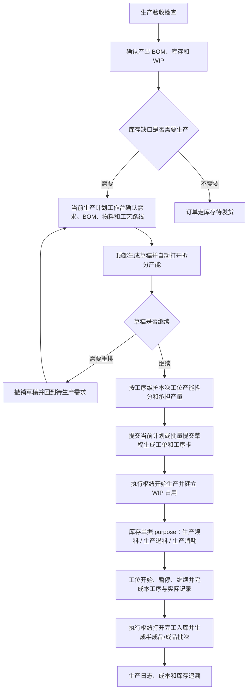

# 操作手册：生产流程

## 适用范围
生产配置、生产验收、生产计划、开始生产、生产中、生产工单、工序卡、生产质检、生产日志、WIP 占用、成品/半成品入库与批次追溯，以及工单上下文中的成本追溯。

PR-473-GENERIC-MANUFACTURING-ABSTRACTION + PR-487-PRODUCTION-PLAN-CAPACITY-SPLITS + PR-488-PRODUCTION-PLAN-SPLIT-QTY-AUTOBATCH + PR-490-JOB-CARD-BATCH-CARDS + PR-491-PRODUCTION-DEMAND-STATUS-JOBCARD-CONTEXT + PR-493-PLAN-WORKORDER-SPLIT-EDIT + PR-495-PRODUCTION-WORKSTATION-OVERVIEW + PR-496-PRODUCTION-FLOW-PHASE1-OPTIMIZATION + PR-497-WORKORDER-INVENTORY-CONTROL + PR-499-PRODUCTION-EXECUTION-HUB-PHASE2 + PR-500-UNIT-MODEL-CONSOLIDATION + PR-501-PRODUCT-UOM-SALES-CONVERSION + PR-502-PRODUCT-UNIT-TEMPLATE-REFERENCE + PR-503-PRODUCT-UNIT-TEMPLATE-MULTI-SALES-UOM + PR-504-PARENT-PRODUCT-CHILD-SKU-UOM + PR-505-SALES-SPEC-TEMPLATE-DERIVED-SKU + PR-514-WORKSTATION-COST-COMPONENTS + PR-518-MULTI-CAPACITY-OPERATION-COST：生产主流程统一使用 `父商品 / 子 SKU / BOM / 工艺路线 / 工序 / 工位 / 生产计划 / 工单 / 工序卡 / 库存单据`，并继续满足 PR-473 的通用制造对象链。父 SKU 负责商品族信息并引用销售规格模板，销售规格模板维护库存单位并自动派生具体子 SKU；咖啡、包装盒、童装等行业差异通过子 SKU、BOM、工艺路线、工序、工位、工位产能和商品生产配置表达；库存单位覆盖原料、WIP、半成品和成品库存，销售规格来自子 SKU 并由价格表/订单快照固化，报价单位和录单单位只作为历史兼容字段；工位维护机器/人工/其他小时成本和适用工序，工位产能维护单批标准和标准分钟，工艺路线为每道工序选择 `标准成本产能档` 用于 BOM/价格标准成本，生产计划和工单仍在执行阶段选择真实工位产能；草稿计划和未开工工单在工序产能拆分中选择本次真实工位产能并折算计划工序成本，已开始执行的工单不允许覆盖拆分；待生产需求维护 `待计划 / 生产中 / 生产完成` 状态，已进入生产计划的需求不可重复生成计划；工单负责开始生产、领料到 WIP、消耗/退料、取消、完工入库、库存单据和库存流水聚合；工序卡主表记录子 SKU、BOM/配方、时间、成本、损耗和异常，不把咖啡投料/出豆字段作为通用主流程列。生产负责人从 `生产视图` 看今日整体进度、卡点和下一步处理人；现场操作员从 `工位视图` 看当前任务、下一任务和不能做原因；生产计划、工单和库存作业用步骤条、完成面板和 WIP 上下文减少跨页判断；工单执行枢纽把同一工单的 readiness、WIP、质检、库存单据、完工入库、成本和追溯时间线集中展示。

PR-509-E2E-RAW-MATERIAL-ORDER-PRODUCTION-FLOW：端到端验收时，生产流程必须承接订单库存不足需求，而不是单独手工造工单。主链路为 `原料 -> 商品 / SKU -> 下单 -> 生产计划 -> 生产工单 -> 工序卡 -> WIP / Stock Entry -> 完工入库 -> 库存与订单追溯`；任何一步不能继续时，记录阻断并按 RED/GREEN 修复。

PR-552-STOCK-ENTRY-CONVERGENCE：生产工单的生产领料、补料、退回未用原料、记录生产消耗和完工入库统一打开库存作业中的 Stock Entry 抽屉。系统按工单实际领入、已消耗、已退回和当前 WIP 批次计算缺口或可退数量；仓管复核后提交，单据、批次位置、库存余额、库存流水、工单统计和操作日志在同一事务中更新。生产工单不再调用独立 WIP 或成品转仓写入页。

PR-553-PRODUCTION-PLAN-PARENT-BOM-UNIT-CONVERSION：生产计划使用订单冻结的销售规格换算，不从规格名称猜重量。具体 SKU BOM 优先；具体 SKU 完全没有 BOM 时，才继承父商品 BOM。计划和工单仍产出具体 SKU，并冻结本次使用的规格换算、BOM 来源和 BOM 版本。

PR-555-PRODUCTION-PLAN-DRAFT-CANCEL：生产计划草稿如果需要重排，可在提交工单前使用“撤销草稿”。系统保留原计划号和冻结快照，将关联需求重新放回“待计划”；已提交工单或已经进入生产的计划不能用此动作。

PR-556-PRODUCTION-PLAN-DRAFT-SPLIT-UX：生产计划的 BOM 摘要不再显示“预期产出率”。只有实际解析到的 BOM 版本启用了“原料损耗比”时，摘要才显示“预期损耗”；具体 SKU 继承父商品 BOM 时读取同一父 BOM 版本。生成草稿只使用顶部步骤条/下一步的“生成草稿”，成功后自动打开拆分产能抽屉。

PR-558-PRODUCTION-PLAN-PREVIEW-PARENT-BOM-NO-LOSS：当前生产计划预览只计算本次选中的 `待计划` 订单，不把同一规格已进入旧生产计划的订单重复加入物料需求。父商品已发布 BOM 缺少工艺路线时，预览仍展示该 BOM 的配方、原料损耗和组件预计消耗，并提示“BOM 配置待完善”；正式生成草稿前必须补齐工艺路线。未配置 BOM 原料损耗时，预计消耗等于订单冻结成品需求。

PR-559-PRODUCTION-CONFIG-WIP-ISSUE-UX：生产 BOM 并入 `生产配置` 第 4 个 Tab。工单开工前由统一 WIP 覆盖计算检查冻结物料需求；released 工单即使尚未创建占用记录，也会在执行枢纽逐物料显示需求、可用和缺口。点击“生产领料”会打开一个多物料库存单据，显示真实工单号、单一数量输入和库存单位。PR-561 后预览带出全部冻结物料，缺口作为建议量，零建议行可按需填写标准批量。

PR-560-PRODUCTION-ISSUE-COMPACT-DIAGNOSTICS：生产领料的多物料明细按统一列头紧凑显示，恢复草稿时重新读取当前 WIP 覆盖。原料仓库存不足或质检冻结时，页面用中文列出受影响物料及需要、可用、缺少和库存单位。

PR-561-WIP-BULK-MATERIAL-ISSUE：工单当前 WIP 缺口只作为建议领用量，不限制原料仓到 WIP 的实际批量。库存单位为 g 时，仓管可以把建议 1974g 改为 60000g（60Kg）；最近一次已提交的批量会作为下次默认值，已有批量草稿也会保留原数量。超出本工单当前需求的部分保留为可用 WIP，实际生产消耗仍通过生产消耗单据另行记录并受工单剩余冻结需求限制。真实原料仓合格库存仍是硬上限。

PR-562-PRODUCTION-EXECUTION-JOB-CARD-CONSOLIDATION：工单级动作统一进入 `工单执行枢纽`，工序级动作统一进入 `工位视图`。生产工单列表只查询、查看、编辑未执行拆分和打印；工序卡只读展示冻结工序要求、状态、实际数据和状态时间。开始、暂停、继续、完成本工序及实际数据录入均在工位完成，完工入库仍从执行枢纽进入统一 Stock Entry。

## 入口
- 生产管理：生产视图、工位视图、生产配置、生产流程、生产排程、生产日志、生产手册。`生产流程` 用五个 Tab 集中生产计划、生产工单、工序卡、生产质检、生产验收；生产手册固定在生产管理菜单最底部。顶部生产切换条使用生产流程统一入口，并保留 `生产中` 兼容状态页和统一完成面板。
- 生产管理：`生产配置` 用四个 Tab 维护工艺路线、工序、工位/设备、生产 BOM；默认打开工艺路线，生产 BOM 用于维护产出商品、组件清单和多层展开。旧生产 BOM 书签会自动进入生产配置的生产 BOM Tab。生产成本不再作为常规菜单或顶部切换入口，但工单执行枢纽和追溯上下文仍可打开既有成本明细。
- 生产管理相关页面顶部有 sticky 模块内切换条：生产视图、工位视图、生产计划、生产中、工单、工序卡、质检、日志、成本。生产视图、工位视图和生产中会显示待处理/阻塞/执行中 badge；生产负责人优先进入生产视图，现场工位优先进入工位视图。工单列表用于查询和查看，工序卡用于只读复盘；工单号和“执行枢纽”进入工单级动作，“进入工位”定位工序级现场任务。
- 商品：商品档案、商品价格管理和商品价格表。商品档案是父商品入口；具体销售/库存规格通过子 SKU 参与生产、库存、BOM 和价格。商品档案只读查看产出该子 SKU 或把该子 SKU 作为组件消耗的生产 BOM，不再作为 BOM 绑定入口。
- 库存管理：仓库库存、库存作业、出库日志，用于 WIP、批次追溯和发货复盘。

## 流程图

## 标准操作
1. 开工前进入生产验收，确认仓库、原料批次、WIP、生产工单、WIP 占用、生产日志、质检和成品追溯检查项。
   - PR-495-PRODUCTION-WORKSTATION-OVERVIEW / PR-496-PRODUCTION-FLOW-PHASE1-OPTIMIZATION / PR-499-PRODUCTION-EXECUTION-HUB-PHASE2 / PR-562-PRODUCTION-EXECUTION-JOB-CARD-CONSOLIDATION：日常调度先进入 `生产视图`。页面按今日任务汇总待处理、执行中、已完成、异常、工位负载、阻塞原因、任务就绪状态和下一步处理人；需要处理时可直接打开执行枢纽、库存作业或质检。工单开工必须在执行枢纽点击“开始生产”：只有 `can_start=true` 时可点击，阻断时按页面原因先补 WIP 或资料；命令处理中全部工单动作会禁用，成功后枢纽原地刷新，失败用中文提示并保持抽屉打开。现场执行进入 `工位视图`，按工位查看 `现在做`、`下一件` 和 `不能做原因`；每张任务卡展示工单、商品、规格、工序要求、优先级、状态和负责人，并严格按服务端动作执行开始、暂停、继续、完成本工序、报异常和呼叫补料。工序卡页面只用于查看和复盘，不执行状态操作。
2. 生产前维护商品档案和物料，并在 `生产管理 / 生产配置` 的工艺路线、工序、工位/设备、生产 BOM 四个 Tab 维护制造主数据。生产 BOM 必须声明“产出商品 + 产出数量 + 组件清单”，组件可以是物料，也可以是另一个有库存的半成品/成品商品。商品档案不编辑 BOM，只作为库存/销售对象被 BOM 产出或消耗；商品档案只可在该商品已有的产出 BOM 中设置一个默认 BOM 主表，不选择默认版本。
   - PR-419：BOM 详情中的“被哪些 BOM 使用”只表示当前产出商品被上层 BOM 当组件消耗；生产 BOM 列表点击 BOM 名称直接打开设置抽屉，不再使用单独“编辑”按钮。
   - PR-420：编辑或新建生产 BOM 时，产出商品和商品组件下拉主标签显示 `SKU编号 商品名`，例如 `SKU-000518 初晓`，用于区分同名商品并支持按 SKU 编号搜索；商品档案 `SKU-000518 初晓` 的“被哪些 BOM 使用”会显示产出该商品的 `BOM-000884 初晓拼配`。
   - PR-578：新建生产 BOM 的“产出商品”可以选择所有启用商品，包括生豆父商品和具体 Kg 等销售/库存 SKU；搜索“生豆”应显示现有生豆商品。失效商品仍不显示，BOM 内“商品组件”的原有候选范围不因本次调整扩大。选择生豆只建立可编辑 BOM 草稿，仍需维护组件并正式发布后才能用于价格试算。
   - PR-500-UNIT-MODEL-CONSOLIDATION / PR-504-PARENT-PRODUCT-CHILD-SKU-UOM / PR-505-SALES-SPEC-TEMPLATE-DERIVED-SKU / PR-553-PRODUCTION-PLAN-PARENT-BOM-UNIT-CONVERSION：新建 BOM 时仍可选择具体子 SKU 作为产出；若多个销售规格只是同一父商品配方按库存单位缩放，也可以只在父商品维护通用 BOM，由没有自身 BOM 的子 SKU 在生成生产计划时继承。产出单位自动取 BOM 来源商品的有效库存单位；计划、工单、WIP、完工入库和库存流水仍冻结并产出订单上的具体子 SKU。`袋/227g` 不作为销售单位，`227g袋装` 是子 SKU 规格。新建或编辑生产 BOM 时不手工填写产出单位；前端保存时即使携带旧 `output_unit` 字段，后端也会重新读取产出商品有效库存单位写入草稿版本。组件表单会显示组件库存单位，消耗单位从全局单位字典选择。
   - PR-511-BOM-MATERIAL-LOSS-BOM-LEVEL：BOM 版本设置区可以打开 `原料损耗比` 并填写 `损耗比例 %`。开启后组件消耗单位只能使用比例 %；如需固定数量物料或商品组件，需要先关闭原料损耗比。公式为 `实际原料需求 = 计划投料基准 / (1 - 原料损耗比) × 配方比例`；例如生产基准 `1kg`、A 原料比例 `40%`、原料损耗 `20%`，A 原料需求为 `1 / 0.8 × 0.4 = 0.5kg`。`合计比例` 只统计配方净比例，不含原料损耗。
   - PR-538-MATERIAL-COST-UNIT-LOSS：新建生产 BOM 的整体预期损耗默认是 0（`yield_rate=1`），不会在未填写时暗含 20% 损耗。原料损耗与整体预期损耗独立：只需要原料损耗时保持整体预期损耗为 0；业务明确同时配置时仍按两项连续放大，价格试算会警告。历史已发布版本不自动改写，调整时复制为新草稿再发布。
   - 如果产出子 SKU 没有显式模板库存单位，生产 BOM 显示当前兼容兜底单位并提示先到销售规格模板设置库存单位。已发布 BOM 版本、历史工单和库存流水不批量回改；当历史版本产出单位与销售规格模板当前库存单位不一致时，BOM 详情会提示差异，避免误认为历史版本已经改动。
   - 生产 BOM 的列表分类来自 `设置 / 业务设置 / 分组模板` Tab，不是生产 BOM 自己维护的大组/小类。先维护分组模板的大类和小类，再回到生产 BOM 页面选择 `分组模板`；选择后 BOM 列表按模板完整大类 / 小类树和 `未分类` 自动整理，空分类也显示，不再提供分类过滤 Tab。
   - 商品档案配置抽屉中的“被哪些 BOM 使用”会展示 `BOM状态`：`默认状态`、`启用状态` 或 `失效状态`。默认状态优先表示该 BOM 是产出商品当前默认 BOM；失效状态只用于历史追溯。
   - PR-485：BOM 版本选择工艺路线。发布某个 BOM 草稿版本后，该 BOM 原 published 版本自动归档为历史快照；生产计划和工单永远使用该默认 BOM 的最新 published 版本，不允许在前端覆盖 BOM 版本。
   - PR-577：published 生产 BOM 必须有真实组件。旧兼容数据若留下空的 published V001，价格试算会阻断并指出同 BOM 中有组件但尚未发布的草稿；先检查草稿产出商品、组件、单位、商品形态和两类损耗，再正式发布。系统不会自动读取或发布草稿，也不会把空旧壳重新绑定为当前发布版本。
   - PR-578：如果商品完全没有可用于试算的已发布 production BOM，价格计算模板会明确提示到本页面新增或发布 BOM，而不是返回 0 元和笼统缺成本警告。新建后仍需在草稿版本维护真实组件并发布；仅保存空草稿不会成为可试算成本来源。
3. PR-387-VIEW-CONTEXT：顶部“当前视图”为客户或订单时，生产计划和工单只使用客户/订单过滤和追溯标签；生产排产、开工、工序卡、质检和成本仍是工厂执行入口，不变成客户专属生产页面。
4. 原料到货后，在库存作业中做原料入库，生成原料批次和原料仓库存。
5. 准备生产时，在库存作业中把原料领到 WIP 在制仓；未用完的 WIP 原料可退回原料仓。
6. 录单保存时，如果成品批次或历史成品库存余额足够，选择使用库存后订单进入库存待发货；选择不使用则进入生产计划。
7. 录单页需要新客户时，使用新增客户抽屉，粘贴收件信息后识别姓名、电话和地址，保存后继续录当前订单。
8. PR-472-MANUFACTURING-PRODUCTION-PLAN-WORKORDER-LIFECYCLE：生产计划只选择库存不足且已解析到商品档案的商品生成正式 `生产计划`，库存充足区只提示，不进入生产工单；历史未绑定商品档案的订单明细需要先在订单或商品侧补绑定后再进入生产。挂耳、盒装速溶、发动机总成这类多层结构先按最终产出商品库存判断缺口，再按选择的 BOM 展开组件需求。
9. PR-473-GENERIC-MANUFACTURING-ABSTRACTION + PR-475-PRODUCTION-PLAN-ERPNEXT-WORKBENCH + PR-485-BOM-VERSION-ROUTE-DEFAULT + PR-489-PRODUCTION-PLAN-PREVIEW-LAYOUT + PR-491-PRODUCTION-DEMAND-STATUS-JOBCARD-CONTEXT + PR-492-PRODUCTION-DEMAND-ADDON-ORDER-SPLIT + PR-496-PRODUCTION-FLOW-PHASE1-OPTIMIZATION + PR-553-PRODUCTION-PLAN-PARENT-BOM-UNIT-CONVERSION + PR-556-PRODUCTION-PLAN-DRAFT-SPLIT-UX + PR-558-PRODUCTION-PLAN-PREVIEW-PARENT-BOM-NO-LOSS：新建生产计划时，进入 `生产管理 / 生产流程 / 生产计划` 主工作台操作。页面顶部显示 `选需求 -> 生成草稿 -> 拆分产能 -> 提交工单 -> 开始生产` 步骤条，并有 sticky 下一步按钮提示当前应执行的动作。顶部筛选只处理日期、客户和需求状态；左侧待生产需求展示库存不足商品、状态和关联生产计划并勾选；右侧当前生产计划会自动生成计划预览，集中展示商品、订单、规格、需求、库存、缺口、BOM 摘要、物料需求汇总和工艺路线摘要，不再单列“计划投料”。BOM 摘要只在解析到的 BOM 版本启用“原料损耗比”时显示 `预期损耗 XX.XX%`；未启用时只显示 `默认 BOM`，不再显示或从 `bom_yield_rate` 推导预期产出率；若 BOM 或工艺路线无法完整解析则显示 `BOM 配置待完善`，悬停可看具体原因，不会把解析异常误显示为无损耗。待生产需求状态可选 `全部 / 待计划 / 生产中 / 生产完成`；只有 `待计划` 需求可勾选，已进入生产计划的需求显示 `生产中` 并置灰。同一商品同规格发生加单时，系统按订单号拆分状态：老订单已进入生产计划则继续显示生产中，新订单未进入生产计划则单独作为待计划行，可勾选，并只按新订单数量计算加单缺口；右侧预览及物料汇总也只计算这次新订单，不会重新纳入同 SKU 老订单。待生产需求和当前生产计划都可以用 `收起待生产需求`、`收起当前生产计划` 缩窄，让另一侧获得更多横向空间；待生产需求、计划预览、物料汇总、库存充足和生产计划单据等宽表可以按住表格空白区域左右拖动查看超出屏幕的列，滚到内层顶部或底部后页面继续整体滚动。前端创建计划只提交日期、客户、所选商品和来源类型，不提交设备、单批投入、批次数、`input_by_key`、BOM 版本或工艺路线覆盖。后端先读取订单冻结换算，再按 `具体 SKU BOM 优先 -> 具体 SKU 完全未配置时父商品 BOM 回退 -> 当前 published 版本 -> BOM 版本绑定工艺路线` 解析。任一层多个 active BOM 时必须先设置默认；具体 SKU 已有失效、未发布或不完整 BOM 时直接报错，不隐藏配置问题。预览阶段若最新已发布 BOM 的物料完整但缺工艺路线，仍显示真实 BOM 组件与损耗并提示补路线；正式生成草稿仍直接报错，不 fallback 到旧版本、商品配置路线或旧工艺模板。创建成功后形成正式 `draft` 生产计划；创建动作不自动提交、不自动生成工单、不创建生产中记录、生产日志或 WIP 占用。计划行冻结具体 SKU、父商品、规格件数、每件库存数量、计划库存数量、BOM 来源商品、BOM 版本、路线和组件需求快照。
10. PR-475-PRODUCTION-PLAN-ERPNEXT-WORKBENCH + PR-487-PRODUCTION-PLAN-CAPACITY-SPLITS + PR-488-PRODUCTION-PLAN-SPLIT-QTY-AUTOBATCH + PR-489-PRODUCTION-PLAN-PREVIEW-LAYOUT + PR-490-JOB-CARD-BATCH-CARDS + PR-493-PLAN-WORKORDER-SPLIT-EDIT + PR-496-PRODUCTION-FLOW-PHASE1-OPTIMIZATION + PR-514-WORKSTATION-COST-COMPONENTS + PR-555-PRODUCTION-PLAN-DRAFT-CANCEL + PR-556-PRODUCTION-PLAN-DRAFT-SPLIT-UX：当前计划工作台只展示计划预览、物料汇总和提交/撤销动作，不再内嵌工序产能拆分表，也不再显示重复的 `创建生产计划`。在顶部步骤条或 sticky 下一步点击 `生成草稿` 后，系统创建草稿并立即打开同一草稿的 `拆分产能` 抽屉；关闭后仍可点击步骤条第 3 步，或在生产计划单据列表/详情点击 `编辑拆分` 重新打开。抽屉可以预填自动拆分建议，但未保存前步骤仍停留在 `拆分产能`，不会提前跳到 `提交工单`。草稿计划可按计划行和工艺路线工序添加拆分行，选择工位产能并填写本次承担产量；例如同一烘焙工序可拆成 `布勒 18kg` 承担 90kg 和 `智烘 4kg` 承担 8kg。系统按工位产能带出的标准批量自动显示批次数，按标准分钟/批和该产能所属工位的小时成本预览计划数量、计划分钟和计划工序成本；每条拆分记录下方还会按批次数显示 `第1批`、`第2批` 等批次卡片，最后一批不足标准批量时会标记 `不足标准批量`。自动打开不会自动保存拆分或提交工单；点击 `提交当前计划生成工单` 前会保存当前草稿拆分。如果需求、日期或排产范围需要重选，可在当前计划、生产计划单据草稿行或详情抽屉点击 `撤销草稿`，确认后原需求回到 `待计划`，旧草稿保留为 `已取消`。提交成功后页面显示下一步面板，可打开工单、打开工序卡、分配工位或领料到 WIP。已提交工单、生产中、已完成和已取消计划不可重复提交、撤销草稿或修改计划拆分。
11. PR-472-MANUFACTURING-PRODUCTION-PLAN-WORKORDER-LIFECYCLE + PR-474-PRODUCTION-PLAN-BULK-SUBMIT-FILTER：生产计划单据列表降级为历史和批量管理区，支持状态和时间过滤：状态可选全部、草稿、已提交工单、生产中、已完成、已取消；时间类型可选创建时间、提交时间、完成时间，并可填写开始日期和结束日期。列表默认显示最近 50 条，按创建时间倒序。需要批量处理历史草稿时，在生产计划单据列表勾选草稿计划后，点击顶部 `提交生成工单`。只有 `草稿` 计划可勾选；已提交工单、生产中、已完成和已取消计划不可勾选。计划提交生成生产工单和工序卡，提交后生产计划进入 `已提交工单`，系统按计划行生成 `released` 生产工单，并按工单冻结的工艺路线生成 `pending` 工序卡。工单冻结当时的客户商品快照、商品档案快照、生产 BOM 版本、组件需求、多层展开树、生产配置字段和工艺路线快照。
   - PR-478-PRODUCTION-PLAN-DOCUMENT-DETAIL：生产计划单据列表保持紧凑。点击计划号或详情打开生产计划单据详情抽屉，可查看单据头、计划行、BOM 版本、工艺路线摘要、物料需求汇总、工艺参数/商品生产配置快照和生成结果。草稿计划显示尚未生成工单；已提交计划显示关联工单、工单状态和工序卡数量，并可从抽屉进入工单或工序卡页面。
12. PR-557-PRODUCTION-PLAN-BOM-LOSS-DEMAND + PR-562-PRODUCTION-EXECUTION-JOB-CARD-CONSOLIDATION：在生产工单页筛选 `released`，点击工单号或“执行枢纽”，确认计划投料、BOM组件需求、BOM原料损耗、WIP可用量和建议领到 WIP 数量后，在执行枢纽点击 `开始生产`。新计划按 `目标产出 ÷ (1 - BOM原料损耗率)` 计算理论投料；未配置BOM原料损耗时投料等于目标产出。旧 `yield_rate`、商品 `expected_loss_rate` 和设备整批不得再次放大物料需求。
   - PR-388/多层制造：生产计划和工单按创建计划时解析出的最新生产 BOM 版本读取组件组成。BOM 发布新版不会回改已开工工单；工单继续使用创建时冻结的 BOM 版本、展开树、组件需求、工艺路线和库存占用快照。
   - PR-511-BOM-MATERIAL-LOSS-BOM-LEVEL + PR-557-PRODUCTION-PLAN-BOM-LOSS-DEMAND：BOM版本级 `原料损耗比` 是新生产计划的唯一标准损耗来源。计划投入已经包含该损耗后，比例组件只按计划投入和配方比例分摊，不再重复除以 `1 - 原料损耗比`。历史商品配置 `expected_loss_rate` 只作兼容快照，不参与新计划计算。
   - 例如14件454g成品需求为6356g，BOM原料损耗18%时理论投料为 `6356 ÷ 0.82 = 7751.22g`，整克四舍五入为7751g；智烘按4kg标准批量安排8kg只属于拆分产能，不会把物料需求改成8000g或10000g。
   - PR-558：BOM原料损耗为0时，14件454g的理论投料和组件预计消耗合计就是6356g，不再被旧80%产出率或历史商品损耗放大。右侧物料汇总只计算本次勾选的待计划订单；同一规格已进入旧生产计划的订单不会重复加入。
   - PR-558：父商品已发布 BOM 有组件但缺工艺路线时，可以先在预览中核对 BOM 配方、损耗和预计消耗；页面同时显示 `BOM 配置待完善`。点击生成草稿仍会被拒绝，应先到生产 BOM 的当前已发布版本补齐并发布有效工艺路线，再返回刷新和生成草稿。
   - 生产计划只使用 `published` BOM版本。BOM编辑页中的V004若仍为草稿，计划继续使用当前已发布V003；发布V004后需撤销旧草稿并重新生成，系统不会静默改写既有计划快照。
   - PR-390：生产计划和工单显示工艺参数/产品信息时优先读取商品生产配置字段。咖啡的 `roast_level`、服装的布料参数、鲜果加工的成熟度/去皮参数等都属于商品生产配置字段；旧 BOM 版本特殊属性和旧商品档案字段只作为 fallback。
13. 未选择库存不足项目时，不会开始生产，也不会生成生产中记录、生产工单或 WIP 占用。已选项目没有手工填写投料数时，系统按生产计划的默认投料数启动；设备、单批标准、承担产量和自动批次数只在草稿生产计划的工序产能拆分中维护，不在工艺路线中维护。只有 `released` 工单允许开始生产；`draft/running/completed/cancelled` 工单不能再次开始。
14. 在执行枢纽点击开始生产后，系统生成生产中记录、running item 和 WIP 软占用，把工单置为 `running`，并把相关工序卡切到可执行状态。重复点击、非法状态或并发命令会被服务端拒绝，不会重复生成生产中记录、running item、生产工单或 WIP 占用。旧 `POST /api/produce/start` 入口和历史开始接口保留兼容。
15. 生产工单列表只用于查看商品规格、订单信息、计划数量、BOM/工艺路线、工艺参数、冻结配置、工序汇总、WIP 与成本，并可打印工单。列表不再显示“开始生产”或“完工入库”。PR-493：工单状态为 `released` 且所有工序卡仍是 `pending` 时仍可“编辑拆分”；开工后入口不可用。工单号和“执行枢纽”打开同一抽屉，先看 readiness、逐物料 WIP 需求/可用/缺口和质检状态；红色“WIP库存不足”时进入生产领料。多物料领料的缺口是首次建议值，可按实际批量修改，真实原料仓合格库存仍为硬上限。
16. PR-490 / PR-491 / PR-499 / PR-562：工序卡只读展示商品、BOM/配方、顺序、冻结工序要求、工位及产能、状态、计划/实际分钟与成本、实际损耗和原因、异常原因、开始/暂停/继续/完成时间及操作人。历史缺少工序要求时显示“按冻结工艺路线执行”。点击“执行枢纽”查看所属工单；点击“进入工位”会携带工单和工序卡定位对应现场任务。工序卡没有状态按钮、编辑框或“保存实际”，历史实际更新接口仅用于兼容。
17. PR-479-MANUFACTURING-PHASE2-EXECUTION-COST-CLOSED-LOOP / PR-497-WORKORDER-INVENTORY-CONTROL / PR-562-PRODUCTION-EXECUTION-JOB-CARD-CONSOLIDATION：现场主链路为 `执行枢纽开始生产 -> 生产领料 -> 工位执行 -> 执行枢纽完工入库 -> 成本追溯`。库存作业的 Stock Entry 继续承载生产领料、退料、消耗和 `purpose=manufacture` 完工入库。
18. 工位视图严格使用服务端 `available_actions`：状态动作中，`pending/ready` 显示“开始”，`running` 显示“暂停”和“完成本工序”，`paused` 显示“继续”和“完成本工序”，`completed/cancelled` 不显示状态动作。运行中任务仍可按服务端能力显示“报异常”“呼叫补料”等业务动作。动作处理中该任务全部按钮禁用；成功后重新读取服务端状态和时间，失败显示中文原因且不伪改状态。“完成本工序”一次填写并提交实际分钟、实际投入、实际产出或成品件数、余料、损耗原因、异常/备注和适用入库仓，不再先保存实际再完成。实际投入、实际产出和余料旁显示工单冻结的库存单位；例如每件为 `0.454Kg` 时，填写 `14件` 会按 `6.356Kg` 保存实际产出。实际产出和成品件数二选一，不得同时填写。
19. `GET /api/produce/work-orders/:id` 返回工单、物料占用、工序卡、库存单据、库存流水、生产日志、成本汇总和 `execution_hub`；`execution_hub.readiness` 判断能否开始/完成，`trace_timeline` 支持追溯。主管确认必要工序、WIP 消耗和质检状态后，从执行枢纽打开“完工入库”统一 Stock Entry；工单列表不提供平行完工入口。
20. 完工入库失败时，先检查工序卡是否全部完成、WIP 是否足够、批次是否被质检冻结、该工单是否已经完成。失败不会新增成品批次、库存流水、生产日志或成本记录。
21. WIP 占用异常时，进入仓库库存的 WIP占用抽屉，按工单调整占用克重或释放废弃工单占用；WIP 占用抽屉的 WIP 总量和可用量只统计 active、仍有剩余且非待处理/拒收冻结批次；按生产中记录释放时，即使历史占用缺少工单行也必须释放匹配占用；调整和释放必须写操作日志。
22. 取消生产时，调用 `POST /api/produce/work-orders/:id/cancel`。取消生产时，系统会同步取消生产工单和工序卡；如果工单已开始生产，复用 running item 取消链路释放未消耗的 WIP 占用。
   - `撤销生产计划草稿` 与 `取消生产工单` 是两件事：草稿还没有工单、WIP 或库存变更，使用生产计划上的“撤销草稿”；工单已生成后不能把计划退回草稿，必须按工单取消和库存修正流程处理。
23. 生产质检可记录工单质检、原料质检和产品质检；当前类型按钮分别显示选择工单、选择原料批次、选择产品批次。
24. 质检结果为待处理或不通过时，关联原料批次、WIP 批次或成品批次显示质检状态和冻结状态，冻结批次不能继续领料、生产扣料或成品出库/转仓。
25. PR-496-PRODUCTION-FLOW-PHASE1-OPTIMIZATION：生产中页面只保留扫描字段和一个主动作。点击 `完成/部分完成` 后进入统一完成面板，按面板填写投料、成品件数、余料、入库仓和异常/备注；一次做不完则勾选部分完成，剩余工单继续保留。
26. 完成生产遇到 WIP 批次质检待处理或不通过，或 WIP 不足时，系统会拒绝本次完工并保持工单继续生产；页面在行内或完成面板内展示原因、影响对象和动作入口。处理方式是从生产中、生产视图或工单执行枢纽打开库存作业，系统会带入 WIP tab、工单、工序卡、running item、物料和缺口数量上下文；若是质检冻结，先从枢纽或生产中打开生产质检复核对应批次，确认合格或更换合格 WIP 批次后再提交完工。
27. 完成生产时成品总克重不能大于本次消耗投料；如果出现该提示，先核对实际产出、投料和是否漏填补投料，系统不会写完成日志、成品库存、FP 批次或扣料日志。
28. 合并多规格生产单必须一次填写全部规格的实际产出，不能使用部分完工；如果确实需要分批完成，先按单规格分别生成生产计划，避免同一生产工单的库存、成本和订单状态拆散。
29. 完工后系统扣减本次 WIP 原料或半成品库存，生成 FP 成品批次或半成品库存批次，写入生产日志、生产成本、库存流水、成品/半成品库存；完工和库存单据负责库存投入/产出追溯，工位完成操作记录实际投入、实际产出和余料，工序卡只读展示时间、成本、损耗和异常。
30. 发货或复盘时，在仓库库存输入 `FP-...` 查看成品到工单、生产日志、原料消耗的追溯链；输入 `MB-...` 或 `LEGACY-MAT-...` 查看原料批次和当前仓库位置。

## 制造三期生产协调
- PR-480-MANUFACTURING-PHASE3-SCHEDULE-CAPACITY：生产排程工作台保存排程前，先确认工单、工序卡、工位/设备和计划开始/结束时间。保存工单或工序卡排程会记录计划时间、班次、负责人、优先级、备注和工位/设备；保存产能日历会记录日期、班次、可用分钟和停机分钟。排程和产能保存都能在操作日志追溯。
- PR-481-MANUFACTURING-PHASE3-SCHEDULING-WORKBENCH：进入 `生产管理 → 生产排程`。列表视图用于快速找工单，日历视图用于按日期查看，甘特视图用于观察时间跨度，工位负载用于查看工位/设备产能。三期只提示冲突，不自动改排程；排程只排已生成工单或工序卡，不选择 BOM、不选择路线、不做 fallback。
- PR-482-MANUFACTURING-PHASE3-MRP-SUGGESTIONS：排程工作台右侧的 `MRP 建议` 会按当前日期、状态和工作中心读取物料需求，展示采购建议和调拨建议。调拨建议表示可从原料仓领到 WIP 的数量；采购建议表示 WIP 可用量和原料仓库存都覆盖不了的净缺口。建议只辅助计划，真实领料仍到库存作业创建 Stock Entry。
- PR-483-MANUFACTURING-PHASE3-INDUSTRY-CALCULATORS：行业设置页提供计算预览。选择咖啡烘焙、包装盒或童装，输入需求产出、损耗率、原料单价和工时后，系统返回计划投入、预计损耗和预计成本。该预览用于配置和核对行业参数，不会直接创建生产计划或工单。
- PR-484-MANUFACTURING-PHASE3-TRACEABILITY-ANALYTICS：生产成本页增加生产追溯分析。可按工单 ID 或生产批次查看追溯链路、成本差异和异常损耗。追溯链路串联工单、工序卡、Stock Entry、物料/成品批次和成本记录；异常损耗来自工序卡实际损耗和原因。

## 工艺路线和行业字段
- PR-389 历史兼容：旧数据可能仍从 BOM 版本特殊属性读取 `roast_level` 等工艺参数；PR-390 后新 UI 维护入口迁到商品档案的商品生产配置，工单创建时优先冻结商品生产配置字段。
- PR-487-PRODUCTION-PLAN-CAPACITY-SPLITS / PR-512-PRICING-RULE-TRIAL-SOURCE-COST / PR-514-WORKSTATION-COST-COMPONENTS / PR-518-MULTI-CAPACITY-OPERATION-COST：最新口径为：工序列表只维护工序名称和状态；工位/设备维护机器、人工和其他小时成本以及适用工序；工位产能只维护标准批量、单位、标准分钟和状态，并作为候选成本能力；工艺路线维护工序顺序、是否记录损耗、质检项，并为每道工序选择 `标准成本产能档`，该字段只用于 BOM/价格标准成本，不代表生产计划实际排产。
- 进入 `生产管理 -> 生产配置 -> 工序` 维护工序名称和状态。工序列表不再作为标准工序成本录入口；工序单位成本由工位小时成本、工位产能档和工艺路线里的 `标准成本产能档` 共同确定。
- 进入 `生产管理 -> 生产配置 -> 工位/设备` 先维护工位和成本组成：`机器成本/小时`、`人工成本/小时`、`其他成本/小时`，系统显示 `小时成本合计`；同时在工位上维护 `适用工序`，例如烘焙机勾选烘焙工序，包装台勾选包装工序。再为工位维护 `工位产能`，例如 `布勒 18kg`、`布勒 15kg`、`智烘 3kg`；每个产能只填写标准批量、单位、标准分钟/批、状态和备注，不填写小时费率，也不单独勾选适用工序。产能档会展示候选单位成本：`小时成本合计 × 标准分钟 / 60 / 标准批量`。PR-494-CAPACITY-OPERATION-AUTO-SPLIT：生产计划自动拆分按工位适用工序筛选该工位下的启用产能；未配置适用工序的旧工位仍可手工选择，但不会参与自动拆分。
- 进入 `生产管理 -> 生产配置 -> 工艺路线` 维护路线；路线定义步骤怎么跑，例如烘焙、裁剪、缝制、去皮、包装。每道路线工序选择工序、维护工序名称快照、是否记录损耗、质检项和 `标准成本产能档`。候选产能档只来自启用工位、工位适用当前工序、启用产能档；同一工序有多个候选时必须人工选择，系统不按排序或最便宜自动猜。BOM 版本草稿选择一条工艺路线；发布 BOM 版本时冻结所选标准成本产能档的工序成本快照，价格试算和商品价格表读取这个快照。实际使用哪台设备、哪条产能和多少成本，仍在生产计划草稿或未开工工单的 `工序产能拆分` 中决定。
- 进入生产计划页时默认只看 `待计划` 需求；需要复盘已提交或已完成需求时，把需求状态切到 `全部` 或对应状态。切到全部后左侧标题显示为 `生产需求`，避免把生产中或已完成的需求误认为还能重复排产。创建生产计划前，当前计划工作台只显示计划预览；在顶部点击 `生成草稿` 后系统自动打开拆分抽屉，也可稍后从步骤条第 3 步或草稿单据的 `编辑拆分` 重新打开，在抽屉中选择本次生产使用的工位产能并填写承担产量。抽屉顶部会先显示 `产能安排总览` 和 `用料需求差距`：`实际需求` 来自计划行 planned_g，`已安排` 来自当前拆分行承担产量，差距用绿色、红色和橙色区分刚好覆盖、不足和超排；用料差距按后端 BOM 用料聚合实时折算，不替代提交工单时的后端覆盖校验。也可以点击当前工序的 `自动拆分`，系统只使用该工序适用的 active 工位产能，按最大产能优先分配剩余产量；例如烘焙 23kg 可自动拆成 `布勒 10kg` 承担 20kg 和 `智烘 3kg` 承担 3kg。每条拆分行可点击 `分配剩余产量`，自动填入该产能能承担的最大整批剩余量，不足一批时作为不足标准批量显示。包装类 `件/袋/盒/个` 产能按 `planned_g/spec_g` 换算数量。若当前工序没有可用适用产能，页面会直接说明原因，不会静默清空拆分行。系统根据承担产量和工位产能标准批量自动计算批次数；计划数量、计划分钟和计划工序成本由拆分行计算；提交生产计划时冻结到工单和工序卡，后续修改工位或工位产能主数据不会回改历史工单。
- 草稿不再需要时点击 `撤销草稿`，核对计划号后确认。页面会切回 `待计划` 并刷新需求；原订单商品可以重新勾选生成新草稿。撤销失败时不要重复创建计划，应先根据提示确认该计划是否已经提交或生成工单，再刷新计划单据状态。
- PR-490-JOB-CARD-BATCH-CARDS + PR-493-PLAN-WORKORDER-SPLIT-EDIT + PR-514-WORKSTATION-COST-COMPONENTS：拆分计算规则为：计划数量等于用户填写的 `承担产量`；计划批次数等于 `ceil(承担产量 / 标准批量)`；计划分钟等于 `计划批次数 * 标准分钟/批`；计划工序成本等于 `计划分钟 / 60 * 工位小时成本`。例如计划拆分为 `布勒 18kg` 承担 90kg、15 分钟/批、工位小时成本 300 元/小时，自动得到 5 批、75 分钟、375 元工序成本；再加 `智烘 4kg` 承担 8kg 则自动得到 2 批和对应分钟、成本。若承担 20kg 但标准批量是 18kg，计划数量仍是 20kg，批次数为 2 批，页面显示 18kg 和 2kg 两个批次卡片，并标记最后一批不足标准批量。工序主数据名称修改后，只影响后续新建生产计划/工单的工艺路线快照；历史已生成单据继续保持冻结。
- 商品专属参数不放在工艺路线里。烘焙度、布料克重、鲜果成熟度、预期损耗率等放在商品档案的商品生产配置中，开工时随工单冻结。
- 行业字段模板用于沉淀不同业务的参数字段；商品生产配置字段是普通用户维护这些参数和值的入口，不要求用户手写 JSON。PR-403 后行业字段模板改为左侧模板列表、右侧模板编辑；左侧支持搜索模板名和启用/停用/全部过滤，点击模板名后在右侧编辑，新建模板也在右侧编辑。用户不再维护行业键，字段键同时作为显示名；新增字段只支持文本和下拉，文本字段可填默认文本，下拉字段用空格分隔选项。商品档案配置只能保存所选行业字段模板中已有的字段，不能临时新增或删除字段定义；字段定义调整必须回到行业字段模板。
- 工艺路线保存、发布、停用，工序/工位主数据保存或停用，工位产能保存或停用，行业字段模板保存、停用，以及工单开工和工位触发的工序卡开始/暂停/继续/完成，都会写操作日志，可在操作日志按 `process_route`、`manufacturing_operation`、`manufacturing_workstation`、`manufacturing_workstation_capacity`、`industry_field_template`、`work_order` 或 `job_card` 追溯。

## 客户商品到生产执行
- 录单、客户门户和履约侧选择的是客户商品或客户侧商品引用；生产计划收到订单后必须解析到绑定的具体子 SKU，并读取订单冻结的销售规格到库存单位换算。规格名称只用于显示，不用于推导重量。系统先找能产出具体 SKU 的有效 BOM；具体 SKU 完全没有 BOM 时继承父商品 BOM；再冻结同一 BOM 最新可用版本、版本工艺路线、商品生产配置和具体 SKU 库存数量。PR-505 后销售规格来自销售规格模板派生出的子 SKU，库存单位来自销售规格模板。
- 如目达摩 454g 的权威换算示例是 `1件 = 0.454Kg`。订单 4 件时计划数量为 `4件 × 0.454Kg/件 = 1.816Kg`；父商品 BOM 基准产出 1Kg 时，配方和工艺路线按 1.816 倍展开。没有整体预期损耗和物料损耗时，计划原料不得再被 80% 收率放大。
- 停用商品不会进入新的待生产需求。启用商品若缺少当前销售规格到库存单位的权威换算，仍会显示为不可勾选的“资料待完善”行，并在商品下方说明需要补充的销售单位和库存单位；该行不会阻止其他有效需求加载和排产。
- 遇到“资料待完善”时，进入 `商品 -> 商品档案`，定位提示中的具体商品和规格，核对销售规格模板、库存单位及每件库存数量后保存，再返回生产计划刷新。不要按商品名称猜重量，也不要把 `1件` 人工等同为 `1盒`。
- 录单和履约保存订单行时，会同时冻结客户商品快照和商品档案快照。生产计划和工单不按客户展示名找 BOM，而是使用订单行上的商品档案 ID、商品档案编号/名称快照和所选生产 BOM 快照执行。
- PR-394：商品档案页和客户商品页的分类模板 Tab 只影响列表分组、价格表展示和人工查找，不改变生产对象。商品在某个分类模板下重新归类后，已经生成的订单、生产计划、工单和成品批次不会回改；新生产计划仍按订单行冻结的客户商品和商品档案选择产出 BOM。
- 工厂自营订单也按同样链路执行：工厂自营客户商品用于销售展示，商品档案用于库存和生产。
- 客户只是贴牌改名时，多个客户商品可以绑定同一商品档案，生产计划选择同一个产出 BOM，不生成重复 BOM。
- 客户专属包装、客户改配方、受托加工或客户来料时，必须创建独立商品档案，并在生产 BOM 中声明该商品为产出，避免库存、成本和追溯混在一起。
- 一次性订单如果只改展示名或价格，用客户商品和价格快照解决；如果生产定义变化，则建一次性用途商品档案并让工单冻结产出该商品的生产 BOM。

## 结果校验
- 生产验收页面没有关键红灯，或每个红灯都有明确补救入口。
- 生产计划中的订单只按库存缺口进入工单，库存待发货订单可在订单列表直接发货。
- 挂耳订单在生产计划中显示为挂耳生产需求，并展示需求袋数、熟豆商品组件需求、熟豆组件缺口和上游烘焙需求；不会把挂耳订单直接当熟豆重量订单处理。
- 盒装速溶工单选择“10条盒装速溶”BOM 后，可按策略只准备条装速溶库存件，或继续展开到条装速溶 BOM 中的速溶粉和条包装膜。
- PR-358-PRODUCT-PRICE-LIST-ORDER-PRODUCTION：生产计划行会携带产品类型、产品子类型和工序模板 ID。速溶咖啡这类无 BOM 产品可通过产品类型/产品子类型识别默认原料“速溶咖啡”，不再只依赖商品名称或旧 `product_kind`。
- PR-392：订单进入生产计划时，工序模板/单位/价格规则解析优先使用商品档案引用的商品配置模板，旧产品子类型模板只作为 legacy fallback。示例：示例大客户复制“盒装速溶配置”后，让对应商品档案在“商品档案配置”抽屉中引用该客户配置，生产计划即可使用配置中的“速溶包装流程”。
- PR-359-PRODUCT-KIND-MIGRATION-CLEANUP：旧 SKU 迁移后，生产优先读取产品子类型和客户规则解析出的工序模板；缺少新配置时才使用历史 `product_kind` 兼容逻辑。历史订单进入生产时不改原订单价格和价格快照。
- 挂耳 BOM 中的 `product` 组件只扣熟豆成品库存或形成熟豆缺口，不从原料批次直接扣；滤袋、外盒等 `material` 组件仍按物料库存扣减。旧 `finished_product` 组件类型只作为历史兼容读取。
- 执行枢纽开始生产失败时保持抽屉打开并显示中文原因，生产中记录、生产工单和 WIP 占用数量都不会增加。
- 开始生产若遇到 WIP 多物料不足，错误提示会一次列出全部不足物料及各自需求/可用/占用数量。
- 生产计划旧页面或重复点击开始生产时，不会重复生成生产中记录、生产工单或 WIP 占用；接口会返回 `production already started`。
- 历史未绑定商品 SKU 的订单明细不会让生产计划报错，也不会生成无 SKU 工单。
- 多品项订单只完成部分生产品项时，订单不会提前进入生产完成或可发货范围。
- 生产工单、工序卡、生产日志、生产成本、库存流水和 FP 成品批次能互相对上。
- 生产日志列表会显示生产批次、`FP-...` 成品批次、消耗的 `MB-...` 物料批次和物料摘要。复盘或发货前可以先从生产日志确认本次完工批次，再到仓库库存输入 `FP-...` 查看完整追溯链。
- 工单展示冻结的预期损耗和实际损耗汇总；已发布 BOM 版本绑定工艺路线后，生产工单展示冻结路线和工序汇总；工序卡按冻结路线生成并只读展示工序要求、实际分钟与成本、损耗和异常。实际投入、实际产出和余料由工位完成操作写入并在工位执行记录中核对，不作为工序卡列表展示字段。
- 新建 BOM 未设置整体预期损耗时，发布版本的整体预期损耗为 0；只设置原料损耗不会被隐藏的整体产出率再次放大。两类损耗同时配置时，价格试算能明确提示连续放大。
- WIP 占用调整或释放后，可用量变化正确，调整后可用量没有包含冻结、拒收、已停用或已耗尽批次，并能在操作日志追溯。
- WIP 占用释放后，接口响应的释放数量必须和数据库占用状态一致，不能出现提示已释放但占用仍为 reserved。
- 取消生产后，对应生产工单和工序卡为已取消，未消耗 WIP 占用为已释放。
- 待处理或不通过质检会冻结对应批次，冻结批次不能继续被业务误用。
- 冻结 WIP 批次导致完成生产失败时，不会新增生产日志、成品库存、FP 批次或原料消耗日志，原生产中记录保持 running。
- 合并多规格生产单部分完工失败时，不会更新规格产出、生产日志、成品库存、FP 批次或原料消耗日志，原生产中记录保持 running。
- `LEGACY-MAT-...` 页面说明这是系统升级按旧物料库存生成的期初批次。

## 常见问题
- 无法开始生产：从工单号进入执行枢纽，查看“开始生产”按钮的阻断原因。检查商品档案是否已设置默认 BOM（或只有一个 active 产出 BOM）、默认 BOM 是否仍产出该商品、最新 published BOM 版本是否配置工艺路线、物料库存是否足够、WIP 是否有可用原料、设备产能是否完整；工单列表本身不提供直接开工。
- 生产计划显示“资料待完善”：该商品已启用，但订单冻结快照和当前具体 SKU 都没有可用的销售规格到库存单位换算。按行内提示补齐商品档案换算后刷新；阻塞行不能勾选或生成计划，但不会阻止其他有效需求继续排产。停用商品的历史订单不会进入新的生产需求。
- 生产计划预览显示“BOM 配置待完善 / 未配置工艺路线”：系统已经按具体 SKU 或父商品当前已发布 BOM 展示配方、损耗和组件预计消耗，但该 BOM 还不能生成正式草稿。进入 `生产管理 -> 生产 BOM`，为当前已发布 BOM 创建带有效工艺路线的新版本并发布，再回到生产计划刷新；不要改用旧 BOM，也不要把预览提示当作可绕过的校验。
- 执行枢纽提示 WIP 不足：按钮会置灰并汇总展示全部不足物料；按提示在库存作业补领对应原料到 WIP，刷新枢纽后再重试。
- 开始生产提示 `production already started`：说明订单或代加工需求已经开工，刷新生产计划和生产中页面，继续处理已有生产中记录，不要重复点击或用旧页面再次提交。
- 库存明明够但仍进生产计划：检查录单时是否选择“不使用”库存批次。
- 生产计划缺少某条历史订单：检查订单明细是否绑定商品 SKU；未绑定 SKU 的历史明细会被跳过，补绑定后再进入生产计划。
- 挂耳生产提示熟豆不足：先检查挂耳 BOM 是否配置熟豆商品组件、组件克重是否按每袋设置，以及对应熟豆商品是否有可用成品库存；不足时按上游烘焙需求先排熟豆生产。
- 挂耳生产提示包材不足：检查 BOM 中滤袋、外盒等物料组件是否配置为 `material`，并在库存作业补足对应物料。
- 批次扣减不符合预期：检查 WIP 占用、实际消耗投料、部分完工记录和 FIFO 规则。
- 生产日志或成品追溯看不到原料批次：先确认该完工是否有生产运行库存流水；系统会用同一 `production_run` 的物料扣减流水补齐旧消耗日志缺失的物料批次号。如果仍为空，说明历史记录缺少可用库存流水，需要人工核对当时的生产单据。
- WIP 占用调整后可用量低于预期：检查是否有待处理、冻结、拒收、已停用或已耗尽的 WIP 批次；已停用或已耗尽的 WIP 批次不会计入可用量，先完成质检复核、恢复有效库存或更换合格批次。
- WIP 占用释放后仍显示已占：按生产中记录重新查询占用状态；如果页面提示释放成功但仍为 reserved，先暂停继续开工并让管理员检查历史占用和操作日志。
- 多品项订单完工后仍显示生产中：检查订单是否还有其他已绑定 SKU 明细存在剩余生产缺口；补齐剩余品项生产或确认有可用成品库存后再发货。
- 生产成本异常：检查 BOM 的整体预期损耗、原料损耗、投料数量、物料采购价和成本计价单位、标准工序成本快照及实际产出。重量物料库存单位可以是 `g`，但成本单价应按 `元/kg`；如果 20% 损耗被放大两次，检查是否同时配置了整体预期损耗和原料损耗。
- 价格试算提示“已发布生产 BOM Vxxx 没有组件”：在生产 BOM 打开对应主表，确认提示中的草稿版本确实包含正确原料。直接销售的生豆还要确认商品形态为生豆、产出单位和直接销售损耗口径正确；确认后再发布该草稿。不要直接修改历史 published 版本，也不要用临时最终价掩盖空 BOM。
- 工艺路线没有进入工单：检查生产 BOM 的最新 published 版本是否选择了已发布工艺路线；路线修改只影响后续 BOM 版本和新生产计划，不会回写历史工单。
- 完成生产提示 WIP 不足或批次被质检冻结：先看生产中行内或完成面板里的原因、影响对象和动作按钮。点击 `处理库存作业` 会打开统一 Stock Entry 并带入工单与缺口，可执行生产领料或补料；若提示 quality block，先到生产质检复核对应原料批次，确认合格或更换合格 WIP 批次后再完工。
- 合并多规格生产提示不支持部分完工：补齐同一生产单全部规格的实际产出后一次完工；需要分批时，回到生产计划按单规格分别开工。
- 需要修改已完成生产记录时，先确认是否影响库存、成本和审计记录。

### 标准制造成本与生产执行边界
- 标准制造成本用于商品价格试算和价格表发布，来源是默认 BOM、标准工艺参数和工位小时费率快照，单位折算到商品/SKU 的库存单位。
- 工位成本由机器小时成本、人工小时成本和其他小时成本组成，合计小时费率用于标准工序成本折算；工位产能和实际批次数仍在生产计划/工单阶段选择。
- 生产计划/工单选择真实工位和产能不回改历史价格。实际执行可以冻结当次工位、产能、批次和实际工时，用于后续实际成本追溯。
- 如果标准成本和实际生产成本差异较大，先检查 BOM、工艺路线标准工时、标准产出、工位小时成本和实际生产记录，不要直接修改历史价格表快照。

### PR-563 工位产能按工时/按计件成本
- 入口：`生产管理 → 生产配置 → 工位/设备 → 工位产能`。适用角色为生产配置维护人员；保存产能需要生产配置写权限，查看计划、工单和工序卡成本需要生产读取权限。
- 新建或编辑工位产能时先选择成本方式：
  - `按工时`：继续维护标准批量、批量单位和标准分钟/批；成本继承工位的机器、人工和其他小时成本。计划成本按 `小时成本 × 标准分钟/60 × 批次数`。
  - `按计件`：标准产能单位固定为 `件`，再填写每一个销售规格件的计件费率。这里的“一件”跟随具体 SKU：227g SKU 的一件是一袋227g，10条/盒 SKU 的一件是一盒10条，不需要再选择袋或盒。计划成本按 `计划销售规格件数 × 计件费率`，不再乘标准分钟或批次数。
- 工艺路线仍为每道工序选择标准成本产能档。发布生产 BOM 后，成本方式、费率、单位和折算关系进入工序成本快照；之后修改产能不会回改已发布 BOM。生产计划拆分选择本次真实产能后，工单和工序卡冻结本次成本参数。
- 工位完成按计件工序时必须填写实际产出数量；实际计件成本按 `实际产出数量 × 冻结计件费率`。不要用计划数量代替实际产出，也不要同时按工时和计件重复计费。
- “初晓拼配 227g”100件核对：具体 SKU 换算为 `1销售规格件=0.227kg`，因此100件即100袋、总成品22.7kg；包装产能选择按计件、0.5元/销售规格件，计划100件和实际产出100件时包装成本均为50元。烘焙、色选继续按各自工时产能计算，工单和成本追溯应分别显示三项成本和合计。
- 结果校验：工位产能刷新后成本方式和费率不丢失；操作日志能查到产能成本方式/费率修改；工单、工序卡和成本追溯中的工序成本明细之和等于总工序成本。
- 常见异常：
  - 提示计件单位不支持：计件产能单位必须是 `件`。袋、盒等包装层级由具体 SKU 决定，不在工位产能中重复定义；kg、g或lb也不能作为计件单位。
  - 包装成本不是50元：检查是否选择了具体227g SKU、冻结换算是否为0.227kg/销售规格件、计划/实际数量是否为100件，以及计件费率是否为0.5元/销售规格件。
  - 修改费率后旧工单不变：这是快照规则；新费率只影响新发布BOM和之后创建的生产计划/工单，历史记录不回算。
