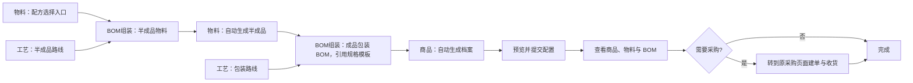

# 商品创建器手册

## 从已有半成品或商品继续创建

1. 使用新版已发布模板，在自制物料或商品卡片顶部选择“选择已有”。例如已有烘焙半成品时，在烘焙半成品卡片选择其物料。
2. 搜索并选择真实档案。名称、编码、归属、单位、分类沿用原档案；制造配置在预览核对。尚未选定档案时，上游也先停用，缺值提示集中在选择字段。
3. 生豆、烘焙 BOM 和专用工艺卡片显示“本步骤本次不执行”，呈灰色。磨粉和挂耳等下游继续填写；仍供其他有效流程共用的原料或工艺不会停用。判断依据是连接关系。
4. 已有商品作为下游投入时，在下游“来源配方对象”或“规格主体候选”选择它的具体已发布规格，例如“10g袋装”。更换商品后，原规格无效会提示重新选择，不按名称自动匹配。
5. 查看预览中的“本次新建／引用已有／上游已停用”再提交。只生成有效的新档案、BOM、规格和默认绑定；结果合并同一档案，操作日志记录引用和停用关系。

停用步骤的填写内容保留在运行草稿，改回“本次新建”会恢复内容和校验。仅用于停用步骤及已引用产出名称的变量不用填写，下游自动命名仍使用的变量照常填写。复用已有对象不修改原名称、分类、配方、库存或默认绑定。

已有自制物料必须具备 ERP 有效的默认已发布制造 BOM；缺失时按所选物料提示，在原业务页面补齐后重新预览。预览后归属、单位、规格或制造来源变化，提交会要求重新预览。表单停用状态不能绕过失效档案、跨归属、单位和图结构检查。

新建及编辑草稿使用 V8；旧模板升级时说明新的“选择已有”语义。升级保留原配置、节点和命名片段，发布前不影响既有版本；V1–V7 已发布版本及已有运行继续原规则。

## 投入、产出与结果核对（2026-10-02）

- **投入配方物料**是本次生产消耗的原料，行内新建默认外购；**BOM 产出物料**是本次生成的半成品。请在预览核对两者的最终名称和取得方式。
- 新版模板的自制物料节点必须连接一个生成 BOM，保证新建路径完整；V8 运行时选择已有物料会停用该 BOM 和专用上游。旧版本沿用各自规则。缺少制造来源会定位到物料行；可以保存草稿，补齐后重新预览。引用已有物料时按档案真实取得方式检查。
- 结果分为“本次新建”和“引用已有（未新建）”，按物料、商品、BOM、规格的正式编号分别展示。已有烘焙豆等复用档案只出现在“引用已有”中。同一档案被多个节点引用时合并成一张卡片，列出来源节点及关联 BOM；同名不同编号仍分别展示。
- 档案更正后，结果卡片显示当前名称，并保留“创建时名称”。原运行提交快照不被改写；更正可在操作日志按运行和物料追溯。
- 商品价格表采用默认已发布 BOM 的默认规格。外购物料尚无采购成本时，显示“暂无采购成本，暂按 0 计算”，不阻断价格试算；包材、工艺和损耗照常计入。缺 BOM、失效物料及单位错误仍需处理。

商品创建器用一张流程图配置可复用的商品与生产模板。模板设计者连接物料、商品、工艺和 BOM 组装动作；每个 BOM 可连接一条工艺路线，商品 BOM 仍从规格模板生成规格和包装。使用者通过系统生成的表单填写名称、配方、分类及工艺调整，预览后一次提交商品、物料、BOM、规格和默认绑定。采购和收货继续通过原采购业务页面办理。

新版模板按 BOM 生产关系组织，不限定咖啡或制造层级。物料档案保持一个物料一个规格；商品的全部规格由 BOM 使用已发布的规格模板生成。

## 流程图

## 入口和权限

- 在「商品 → 商品创建器」打开模板管理；商品档案页也可使用商品创建器快捷入口。
- 有模板维护权限的人员可新建、复制、编辑、发布或停用模板。运行时继续按商品、物料、BOM、采购和库存权限校验。
- 模板发布生成固定版本。已开始的运行固定使用启动时的模板版本；后续编辑不会改变历史运行和已提交档案。
- 新建和编辑模板使用 V8。历史 V1–V7 已发布版本及运行继续原规则。升级提示说明复用产出会停用专用上游，以及投入节点不使用预设行或命名；只有保存草稿后才保存本次变化，发布前不改变已发布版本和历史运行。旧采购节点需明确处理后才能发布。

## 设计模板

1. 在模板管理页点「新建模板」，填写模板名称；也可以复制已有模板后另存为新名称。
2. 从左侧模块库拖入模块或点击添加。模块库只有两组：
   - **数据类型**：物料、商品、工艺。
   - **动作**：BOM组装。新版不提供采购节点；采购及收货继续使用原业务页面。
3. 按生产关系连线：两类 BOM 的配方来源都连到左侧带来源名称的配方输入口；每连一个来源都会增加一个独立输入口和一个“＋配方输入”口。物料和商品 BOM 均有单独的“工艺路线”输入口，一个 BOM 最多连接一条工艺；同一工艺节点可供多个 BOM 共用。商品 BOM 的配方来源是运行时可选的规格主体候选，包材仍随规格模板应用。BOM 产出连到对应物料或商品节点。物料先在节点顶部选择取得方式：外购没有输入口；自制显示必填的“BOM产出”输入口。
4. 外购物料节点是配方选择入口；先通过原物料和采购页面安排好常用物料，使用模板时选择已有档案。BOM 连出的物料/商品节点是产出对象，可配置为自动新建或选择已有对象。中间半成品节点既接收上游 BOM 产出，也可把同一对象供给下游 BOM，不会再次建档。一个 BOM 只能负责生成一个产出对象。
5. BOM 产出物料时，在 BOM组装配置产出数量、单位、模板预设工艺、损耗和物料配方。BOM 产出商品时，必须在该 BOM 上选择一个已发布的规格模板版本；规格、包装配方、主体用量和损耗均只读沿用该版本。可将工艺节点连到商品 BOM，届时整组规格使用连线工艺；不连线时保留规格模板中每个规格自己的工艺。商品节点只配置新建/引用、商品名称和归属等档案资料。
6. 规格模板固定在商品产出 BOM 上，而不是商品节点。模板可包含多个规格、包材、工艺及损耗；模板发布新版本不会改变创建器已选的版本。物料产出 BOM 保持原来的物料配方配置。
7. 投入节点不预设物料行、名称、库存单位或归属。使用时可以选择任意数量的已有外购物料，引用其真实档案资料；临时需要新建外购物料时，在运行表格中填写名称、单位等信息。暂估采购单价可留空或填 0，不创建采购或库存记录；实际收货后暂估价会在同一事务内清除。
8. 物料或商品产出节点的“命名默认值”初始只有「＋ 文本」「＋ 变量」。每点一次新增一个片段，从上到下依次拼接：点「＋ 文本」输入内容；点「＋ 变量」输入变量名搜索，找不到时可直接新建。完整名称随输入立即更新，例如变量“商品名”后加文本“-生豆”可生成“悲伤樱桃-生豆”。点片段右侧 × 删除片段。变量在本模板共用，改名不改变引用；被引用时不能删除。展开「试填变量，查看名称效果」可临时填写示例值，示例值不保存到模板或运行；缺少值显示“【变量名待填写】”。
9. 旧草稿升级为 V7 时不交换已有命名片段顺序。产出节点没有取得方式的历史配置，按原界面显示的“自制”补齐；明确设置为“外购”的冲突仍需人工处理。商品规格和旧采购行为的冲突检查继续保留。
10. BOM 配方默认值按来源分别显示：来源名称独占一行，默认用量和消耗单位并排。配方行可按商品规格分别填写；未指定规格的组件适用于全部规格。连线和重复行使用稳定标识，调整顺序不会改变来源。
11. 外购物料无 BOM 输入口；自制物料必须且只能连接一个生成 BOM。修改取得方式不会自动删除原连线；如切成外购但仍保留 BOM 连线，需删除连线或改回自制后才能发布。下游引用不会把自制节点改成外购。
12. 使用「表单预览」检查模板将生成的填写项；点「保存草稿」保存未发布设计。图结构、数据类型和必需输入检查通过后点「发布模板」。节点位置只影响排版；撤销/重做会同时恢复连线、变量和命名片段。可使用缩放、小地图和自动整理辅助设计；自动整理会给相邻列的卡片留出空隙，方便拖动连接点。

## 使用模板创建商品

1. 在已发布模板卡片点「使用模板」。系统固定本次运行所使用的模板版本，并按模块生成填写表单。
2. 在表单顶部填写“本次变量”。每个被引用的变量只需填写一次，生成的物料/商品名称会直接写入名称输入框。可展开“调整本次命名组合”改变固定文字和变量的顺序；也可直接改名。需要恢复模板组合时点「恢复模板命名」。这些调整只影响当前运行。已有对象仍显示其真实资料。
3. 物料产出 BOM 按连接关系选择配方来源并填写用量和消耗单位。商品产出 BOM 则从已连接的物料或商品规格候选中选择一个规格主体；候选必须来自该 BOM 的实际输入连线。商品主体必须选择具体的已发布商品规格。未选中的候选不会加入配方。
4. 商品 BOM 卡片会展示固定的规格模板版本及只读明细：整组规格、单位、主体用量、包材、工艺、损耗和默认规格。模板规格及包材不在运行表单中增删或覆盖。一个物料记录只有一个库存规格；模板中包含比例配方或原料损耗时，主体必须是物料。
5. BOM 工艺优先使用“使用连线工艺”，商品 BOM 未连接时使用“使用规格模板工艺”，物料 BOM 未连接时使用“使用模板预设工艺”；仍可在运行表单为当前 BOM 选择“本次改选”。覆盖只影响当前 BOM，商品 BOM 的覆盖整组应用于新规格，不改变规格模板。提交结果会显示每个 BOM 的工艺来源、实际路线及商品每个规格最后采用的路线。
6. 新建投入物料、产出物料、商品及 BOM 时，可点「选择分类」打开当前业务启用的分类抽屉。大类（如“烘焙咖啡豆”“咖啡生豆”）和其下级分类都可直接选择，按缩进显示层级，点击父层箭头收缩/展开，也可点“全部展开”“全部收缩”。搜索名称或完整路径时自动展示命中的分类及其父层；点击分类名称选择，所选分类与本次对象一起提交。未选择时使用系统“未分类”。引用已有对象沿用真实档案分类。
7. 点「保存草稿」可离开页面后继续填写。点「业务预览」查看新增与引用的对象、BOM 配方、规格模板版本、主体来源、包材、工艺、损耗、发布及默认绑定结果。预览只做校验，不创建正式档案、BOM 或单据。
8. 预览通过后点「提交创建」。服务端重新校验权限、分类、数据引用、固定的规格模板版本、主体身份、单位和并发修订；本次商品、物料、BOM、规格、分类、发布与新对象默认绑定在同一数据库事务中完成。提交失败时整体回滚，填写内容保留，可修改后重新预览和提交。
9. 新建产出对象提交后自动使用本次已发布 BOM 作为默认 BOM。选择已有对象时，新 BOM 会发布，但系统不会覆盖该对象原有默认绑定；确需切换时，走原有 BOM 默认绑定流程。
10. 外购物料如未填写暂估采购价，成本试算按 0 计算并提示“暂无采购成本，暂按 0 计算”；填写暂估价后会明确显示“暂估采购价”。实际批次成本及有效采购价优先于暂估值。提交创建器不生成采购单或库存，采购、收货继续通过原采购页面办理；实际收货完成后暂估价自动清除，收货价为 0 也会替代暂估值。

## 结果核对

- 运行结果分别显示新建/引用的商品和物料、已发布 BOM、规格及默认绑定状态，并提供对应业务页面入口。
- V6 及更新版本创建器结果不包含采购或收货单据；需要采购时转到原采购页面。档案分类会在创建成功后生效；自制半成品同样保存到所选分类。直接归入大类的商品在大类标题下展示；失败时对象和分类一起回滚。
- 新对象显示生产配置就绪；后续备料或销售状态仍按系统现有规则检查，不因“创建完成”而自动创建库存或价格。
- 模板、运行草稿和预览不会写入正式业务资料；正式写入会记录操作者、模板版本、运行和步骤关联，可在操作日志追溯。

## 常见问题

- **界面显示自制，但发布提示必须为自制**：旧草稿可能未保存取得方式字段。修复后空值按历史界面的自制处理；重新打开模板编辑可升级并显式保存。若仍报错，核对顶部取得方式及对应 BOM 连线，不能靠填写名称改变物料属性。

- **产出对象未连接 BOM**：在 BOM组装输出端连到一个物料或商品节点；产出类型需要和目标节点一致。
- **BOM 缺少配方或工艺**：至少连接一个物料/商品规格作为配方来源；工艺可连接有效路线，也可在 BOM 中选择默认路线。
- **一个 BOM 需要更换工艺**：一个 BOM 只能连接一条路线。同一工艺节点可以连到多个 BOM；尝试添加第二条路线时，提示会指出 BOM 和现有工艺名称，例如“半成品烘焙 BOM 已连接‘半成品烘焙路线’，一个 BOM 只能连接一个工艺。请先删除原连线再更换。”先删除原工艺连线，再连接新的工艺。取消拖拽到空白处不会报错。
- **商品 BOM 的工艺要覆盖模板**：把工艺节点连接到商品 BOM，再在运行表单选择“使用连线工艺”或“本次改选”。本次改选应用到该商品 BOM 的全部规格，不修改被引用的规格模板，也不影响其他 BOM。
- **商品 BOM 无法发布**：确认规格模板配置在产出商品的 BOM 节点上且选择了已发布版本。规格主体必须从已连接候选中选择；商品候选还需指定有效的已发布规格。商品节点本身不配置规格或包装。
- **商品无法连到 BOM 配方**：商品节点右侧的「商品对象」是档案引用，不能作为配方行；请连接标注为「商品规格」的输出口，再在运行表单选择具体规格（例如 10g 袋装）。物料则连接「物料对象」输出口。
- **旧模板升级后提示冲突**：这是为了避免静默丢掉旧的手工配方、规格、工艺或采购步骤。逐一核对原配置，根据新版规格模板调整商品 BOM，并明确移除旧采购节点后再发布。
- **BOM 配方没有目标物料**：检查该 BOM 是否连入对应物料或商品规格来源；连线后会显示对应输入口，再在配方表搜索名称、编码或规格。没有合适结果时使用当前表格的新建行。一个来源需要用于多条配方时，在表格里增加行，不要重复连线。
- **变量名未生成或仍为空**：检查所有被名称引用的变量是否已填写，或在名称输入框自行补充。预览会将缺少变量定位到对应节点；保存草稿不会要求变量完整。
- **命名示例与正式名称不同**：设计器中的示例值只用于即时预览，不会写入模板或运行；运行时使用变量默认值或本次填写值，名称手工修改后仍可恢复自动生成。
- **单位或商品规格失效**：刷新有效单位和发布规格后重新选择。提交时服务端会再次校验，旧或跨归属引用会被拒绝。
- **分类选择不可用或提交失败**：分类抽屉只显示当前业务已启用的分类。分类被停用或权限变化时，提交会整体失败；刷新后重新选分类即可。未选分类时使用“未分类”。
- **暂估采购价没有生效**：暂估价只在新建外购物料且没有实际成本时参与试算。采购或批次成本优先；实际收货后暂估值会清除，实际收货价为 0 也会作为有效成本。
- **引用已有对象后默认 BOM 未切换**：这是保护规则。商品创建器不会改变已有对象的共享默认绑定，请在原 BOM 使用流程中确认并调整。
- **工艺标准成本配置失效**：预览会定位到使用该路线的 BOM，说明失效工序、产能档或工位。在原工艺页面修正，或为本次 BOM 改选有效路线后重新预览。
- **提交失败或页面响应中断**：打开模板卡片的创建记录恢复运行。相同幂等请求会返回原结果；修改业务内容后应重新预览。已完成的收货等交易步骤不会被自动撤销。
