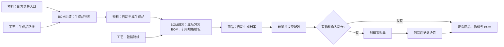

# 商品创建器手册

商品创建器用一张流程图配置可复用的商品与生产模板。模板设计者连接物料、商品、工艺和 BOM 组装动作；每个 BOM 可连接一条工艺路线，商品 BOM 仍从规格模板生成规格和包装。使用者通过系统生成的表单填写名称、配方及工艺调整，预览后一次提交商品、物料、BOM、规格和默认绑定。

新版模板按 BOM 生产关系组织，不限定咖啡或制造层级。物料档案保持一个物料一个规格；商品的全部规格由 BOM 使用已发布的规格模板生成。

## 流程图

## 入口和权限

- 在「商品 → 商品创建器」打开模板管理；商品档案页也可使用商品创建器快捷入口。
- 有模板维护权限的人员可新建、复制、编辑、发布或停用模板。运行时继续按商品、物料、BOM、采购和库存权限校验。
- 模板发布生成固定版本。已开始的运行固定使用启动时的模板版本；后续编辑不会改变历史运行和已提交档案。
- 新建模板使用 V5 模块。历史 V1–V4 模板版本及运行继续按原规则执行；编辑旧模板时生成 V5 草稿，发布前不改已发布版本和运行记录。

## 设计模板

1. 在模板管理页点「新建模板」，填写模板名称；也可以复制已有模板后另存为新名称。
2. 从左侧模块库拖入模块或点击添加。模块库只有两组：
   - **数据类型**：物料、商品、工艺。
   - **动作**：BOM组装、物料购入。
3. 按生产关系连线：两类 BOM 的配方来源都连到左侧带来源名称的配方输入口；每连一个来源都会增加一个独立输入口和一个“＋配方输入”口。物料和商品 BOM 均有单独的“工艺路线”输入口，一个 BOM 最多连接一条工艺；同一工艺节点可供多个 BOM 共用。商品 BOM 的配方来源是运行时可选的规格主体候选，包材仍随规格模板应用。BOM 产出连到对应物料或商品节点。从 BOM 接入会把节点设为产出对象；没有 BOM 上游的物料节点可作为来源。
4. 没有 BOM 上游的物料节点是配方选择入口，不代表模板必须提前建好物料。BOM 连出的物料/商品节点是产出对象，可配置为自动新建或选择已有对象。中间半成品节点既接收上游 BOM 产出，也可把同一对象供给下游 BOM，不会再次建档。一个 BOM 只能负责生成一个产出对象。
5. BOM 产出物料时，在 BOM组装配置产出数量、单位、默认工艺、损耗和物料配方。BOM 产出商品时，必须在该 BOM 上选择一个已发布的规格模板版本；规格、包装配方、主体用量和损耗均只读沿用该版本。可将工艺节点连到商品 BOM，届时整组规格使用连线工艺；不连线时保留规格模板中每个规格自己的工艺。商品节点只配置新建/引用、商品名称和归属等档案资料。
6. 规格模板固定在商品产出 BOM 上，而不是商品节点。模板可包含多个规格、包材、工艺及损耗；模板发布新版本不会改变创建器已选的版本。物料产出 BOM 保持原来的物料配方配置。
7. V5 模板默认值在运行时可调整。商品和物料分类字段不在模板中配置；新建对象按系统规则进入“未分类”。物料仍可配置外购/自制、归属、库存单位等资料。
8. 物料或商品产出节点的“命名默认值”可组合固定文字和变量。编辑器会即时展示拼接后的生成名称。例如固定文字“半成品-烘焙豆_”加变量“商品名”，变量默认值为“春季新品”时，预览立即显示“半成品-烘焙豆_春季新品”；也可填写仅用于预览的示例值。示例值不会保存进模板或运行。缺少默认值和示例值时，预览会显示“【变量名待填写】”。变量选择器支持模糊搜索，也可在选择时新建；新变量会立即供本模板其他节点选择。也可从画布工具栏打开“变量”，统一维护名称和默认值。变量在同一模板内共用，运行时每个变量只填写一次；变量改名不会影响节点引用。删除被节点引用的变量前，需先解除对应节点引用。
9. V2–V4 商品 BOM 草稿升级为 V5 时，系统保留旧手工规格、配方和独立工艺信息，并显示待核对提示。为每个商品产出 BOM 选择规格模板并核对冲突后，才能发布；系统不会按规格名称猜测模板或自动丢弃旧设置。
10. BOM 配方默认值按来源分别显示：来源名称独占一行，默认用量和消耗单位并排。配方行可按商品规格分别填写；未指定规格的组件适用于全部规格。连线和重复行使用稳定标识，调整顺序不会改变来源。
11. 需要采购时添加“物料购入”动作并连接对应物料。没有采购需求时可不添加。新版模板不提供执行条件和价格配置。
12. 使用「表单预览」检查模板将生成的填写项；点「保存草稿」保存未发布设计。图结构、数据类型和必需输入检查通过后点「发布模板」。节点位置只影响排版；撤销/重做会同时恢复连线、变量和命名片段。可使用缩放、小地图和自动整理辅助设计；自动整理会给相邻列的卡片留出空隙，方便拖动连接点。

## 使用模板创建商品

1. 在已发布模板卡片点「使用模板」。系统固定本次运行所使用的模板版本，并按模块生成填写表单。
2. 在表单顶部填写“本次变量”。每个被引用的变量只需填写一次，生成的物料/商品名称会直接写入名称输入框。名称可单独修改；需要重新跟随变量时点「恢复变量默认值」。已有对象仍显示其真实资料。
3. 物料产出 BOM 按连接关系选择配方来源并填写用量和消耗单位。商品产出 BOM 则从已连接的物料或商品规格候选中选择一个规格主体；候选必须来自该 BOM 的实际输入连线。商品主体必须选择具体的已发布商品规格。未选中的候选不会加入配方。
4. 商品 BOM 卡片会展示固定的规格模板版本及只读明细：整组规格、单位、主体用量、包材、工艺、损耗和默认规格。模板规格及包材不在运行表单中增删或覆盖。一个物料记录只有一个库存规格；模板中包含比例配方或原料损耗时，主体必须是物料。
5. BOM 工艺默认跟随已连接的工艺节点；在运行表单中选择“本次采用”后只覆盖当前 BOM。商品 BOM 的覆盖会整组应用于规格模板生成的新规格，不改变原规格模板；选择“跟随默认”时，商品 BOM 沿用规格模板中各规格自己的工艺，物料 BOM 沿用连线工艺或模板默认工艺。提交结果会显示每个 BOM 的工艺来源、实际路线，以及商品每个规格最后采用的路线。新建物料按系统规则进入“未分类”。
6. 点「保存草稿」可离开页面后继续填写。点「业务预览」查看新增与引用的对象、BOM 配方、规格模板版本、主体来源、包材、工艺、损耗、发布及默认绑定结果。预览只做校验，不创建正式档案、BOM 或单据。
7. 预览通过后点「提交创建」。服务端重新校验权限、数据引用、固定的规格模板版本、主体身份、单位和并发修订；本次商品、物料、BOM、规格、发布与新对象默认绑定在同一数据库事务中完成。提交失败时整体回滚，填写内容保留，可修改后重新预览和提交。
8. 新建产出对象提交后自动使用本次已发布 BOM 作为默认 BOM。选择已有对象时，新 BOM 会发布，但系统不会覆盖该对象原有默认绑定；确需切换时，走原有 BOM 默认绑定流程。
9. 模板包含物料购入动作时，配置提交后可创建采购单。采购单不会入库或改变实际成本；到货后需要在对应运行中明确确认实收数量和单价，确认收货才会生成库存批次。采购和收货是独立可恢复步骤，不会重复提交已完成的步骤。

## 结果核对

- 运行结果分别显示新建/引用的商品和物料、已发布 BOM、规格及默认绑定状态，并提供对应业务页面入口。
- 采购节点展示采购单；确认收货后展示收货记录和库存批次。等待到货不影响已经完成的商品及 BOM 配置。
- 新对象显示生产配置就绪；后续备料或销售状态仍按系统现有规则检查，不因“创建完成”而自动创建库存或价格。
- 模板、运行草稿和预览不会写入正式业务资料；正式写入会记录操作者、模板版本、运行和步骤关联，可在操作日志追溯。

## 常见问题

- **产出对象未连接 BOM**：在 BOM组装输出端连到一个物料或商品节点；产出类型需要和目标节点一致。
- **BOM 缺少配方或工艺**：至少连接一个物料/商品规格作为配方来源；工艺可连接有效路线，也可在 BOM 中选择默认路线。
- **一个 BOM 需要更换工艺**：一个 BOM 只能连接一条路线。同一工艺节点可以连到多个 BOM；尝试添加第二条路线时，提示会指出 BOM 和现有工艺名称，例如“半成品烘焙 BOM 已连接‘半成品烘焙路线’，一个 BOM 只能连接一个工艺。请先删除原连线再更换。”先删除原工艺连线，再连接新的工艺。取消拖拽到空白处不会报错。
- **商品 BOM 的工艺要覆盖模板**：把工艺节点连接到商品 BOM，再在运行表单选择“跟随默认”或“本次采用”。本次改选应用到该商品 BOM 的全部规格，不修改被引用的规格模板，也不影响其他 BOM。
- **商品 BOM 无法发布**：确认规格模板配置在产出商品的 BOM 节点上且选择了已发布版本。规格主体必须从已连接候选中选择；商品候选还需指定有效的已发布规格。商品节点本身不配置规格或包装。
- **旧模板升级后提示冲突**：这是为了避免静默丢掉旧的手工配方、规格或工艺。逐一核对原配置，根据新版规格模板调整商品 BOM，并清除待核对提示后再发布。
- **BOM 配方没有目标物料**：检查该 BOM 是否连入对应物料或商品规格来源；连线后会显示对应输入口，再在配方表搜索名称、编码或规格。没有合适结果时使用当前表格的新建行。一个来源需要用于多条配方时，在表格里增加行，不要重复连线。
- **变量名未生成或仍为空**：检查所有被名称引用的变量是否已填写，或在名称输入框自行补充。预览会将缺少变量定位到对应节点；保存草稿不会要求变量完整。
- **命名示例与正式名称不同**：设计器中的示例值只用于即时预览，不会写入模板或运行；运行时使用变量默认值或本次填写值，名称手工修改后仍可恢复自动生成。
- **单位或商品规格失效**：刷新有效单位和发布规格后重新选择。提交时服务端会再次校验，旧或跨归属引用会被拒绝。
- **引用已有对象后默认 BOM 未切换**：这是保护规则。商品创建器不会改变已有对象的共享默认绑定，请在原 BOM 使用流程中确认并调整。
- **提交失败或页面响应中断**：打开模板卡片的创建记录恢复运行。相同幂等请求会返回原结果；修改业务内容后应重新预览。已完成的收货等交易步骤不会被自动撤销。
