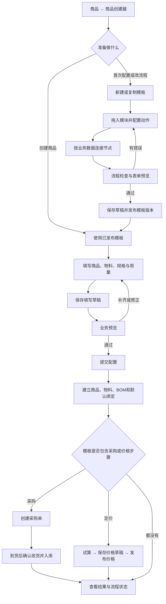

# 商品创建器手册

商品创建器把商品、物料、BOM、采购和价格配置组合成可复用的流程模板。管理员先设计并发布模板，业务人员再按自动生成的表单填写一次业务数据。

## 流程图

## 入口和权限

- 入口在「商品 → 商品创建器」。商品档案页也有「按流程创建商品」快捷入口。
- 模板维护需要系统设置写入权限；运行时还会逐项检查商品、物料、BOM、采购、库存及成本核价权限和对象归属。
- 模板可以发布新版本或停用。已开始的运行固定使用启动时的模板版本；更新模板不会改写已有运行和历史对象。

## 设计和发布模板

1. 在模板管理页选择「新建模板」，或者复制一个接近的模板再修改。填写模板名称和说明。
2. 从左侧业务模块库拖入节点，也可以点模块添加。当前模块包括商品档案、物料档案、BOM 与规格、工艺配置、发布与默认绑定、物料购入和价格配置。
3. 从输出端拖到输入端建立数据连接。端口名称说明传递的对象，例如商品、主料/包材、产出对象、已发布规格、采购收货成本。连接会成为业务引用；节点位置只影响画布排版。
4. 选择「数据来源」连线来引用上游对象；选择「等待完成」连线来要求上游业务步骤先完成。前者传递引用，后者只控制执行顺序。
5. 在右侧配置节点名称和动作。BOM 节点设置规格名称、单位和默认规格。复杂条件位于「高级设置 · 执行条件」；只有选择条件后，才需要指定判断来源、字段和值。
6. 可以复制或删除节点，删除后检查画布中是否还需要它的输出。使用撤销/重做修正误操作，用自动整理整理画布。缩放和小地图只影响查看方式。
7. 点「表单预览」检查使用者需要填写的字段；回到流程设计，修复底部显示的问题。点「保存草稿」保留未发布更改；流程检查通过后点「发布模板」。

引用已有的商品、物料、路线、BOM 或价格表时，系统会校验对象归属和有效状态。已发布对象默认按引用处理。需要改配方时，应在创建器中选择“复制为新 BOM”，这样新 BOM 独立于来源档案；创建器不会替用户改写被共享的历史 BOM 或默认绑定。

## 使用模板创建业务

1. 在已发布模板卡片点「使用模板」。右侧流程图展示本次运行的固定版本和进度，左侧表单按依赖顺序列出节点。
2. 商品档案选择新建或引用已有，并选商品类型、归属和行业字段。客户归属商品必须选择客户。
3. 物料模块支持增加多行。每行可新建或引用物料；新建时填写物料类别、外购/自制方式、库存单位和归属。多行使用稳定行标识，调序不改变 BOM 用量引用。
4. BOM 模块选择产出对象，添加规格及组件用量、单位、损耗和适用规格。组件下拉选项来自画布连接的业务节点；不要把成品库存批次、物料档案和商品规格互相替代。
5. 工艺节点选择已有有效路线。发布节点发布本次新建的 BOM，并按模板设定绑定为本次产出对象的默认 BOM。已经引用的共享 BOM 不会因本次创建而被修改。
6. 填完后点「保存草稿」，需要时可离开页面。之后在模板卡片的创建记录中选择草稿继续填写。点「业务预览」检查新增、引用及待处理步骤；预览只校验，不创建正式档案或单据。
7. 预览通过后点「提交创建」。服务端会再次检查数据和权限，并在单一事务中提交本次商品、物料、BOM、规格、发布及默认绑定。配置失败会整体回滚，表单内容保留；重新打开草稿、修改后再预览和提交。
8. 有采购节点时，配置提交后先点「创建采购单」。采购单本身不更新库存和实际成本。到货后填写实收数量及实际单价，再点「确认收货并入库」；只有这一步生成入库批次并沿用现有采购入库规则。
9. 有价格节点时，点「试算价格」检查每个已发布商品规格的售价，再点「保存价格草稿」，核对后点「发布价格」。创建器会复制选定的已发布价格表作为新版本，保留其他产品行并替换本次商品的规格行；原共享价格表不被覆盖。使用本次采购成本定价时，必须先确认收货，再重新试算。
10. 配置提交后离开页面，可以从模板卡片的创建记录中重新打开“配置已提交”或“后续处理中”的运行，继续未完成采购或价格步骤。重复提交或在响应中断后重试使用幂等记录，不会再次建立同一批档案或重复入库。

## 结果核对

- 运行结果会列出新建或复用的商品、物料、BOM 和规格对象，可从对象编号进入对应业务页面核对。
- 流程图状态显示已完成、当前处理和等待前置步骤。采购单、收货单/入库批次及价格版本分别显示在对应节点。
- 模板、运行和业务写入会记录操作者、模板版本、运行编号、节点和业务对象关联，可在操作日志和模板创建记录中追溯。
- 发布模板、填写草稿和业务预览不会产生商品、物料、BOM、库存或价格发布记录。价格草稿未发布前不代表销售就绪。

## 常见问题

- **连线类型不匹配**：检查连接端口的业务含义，商品规格应从已发布 BOM 规格端口传出，物料组件应连接物料或兼容的规格输出。
- **循环或节点缺少输入**：按流程检查提示回到设计器修复环路、必需输入或被删除的依赖，再保存草稿并重新发布。
- **条件跳过后下游缺数据**：下游节点的必需来源不能依赖一个可能跳过且无替代来源的节点。调整条件或增加合法来源后，再运行预览。
- **引用对象不存在或归属不一致**：刷新页面重新选择对象；不能跨客户或超出当前账号权限使用对象。
- **价格试算失败**：检查商品 BOM 是否已发布、规格是否仍有效、目标价格表是否同一归属范围内的已发布商品价格表，以及固定售价或定价规则是否有效。
- **采购订单已建但还没有收货**：返回该运行并等待实际到货。不要把预计采购量当成实际入库；确认收货失败时先查看采购单状态，再重试。
- **模板升级后历史运行不一致**：这是预期行为；运行固定使用原模板版本。需要新流程时，从管理页发布新模板版本，再启动新的运行。

商品创建器不支持复杂循环、任意脚本、审批流和定时执行。模板应使用有向、无环的业务步骤；采购和价格步骤在配置提交后分开确认。
