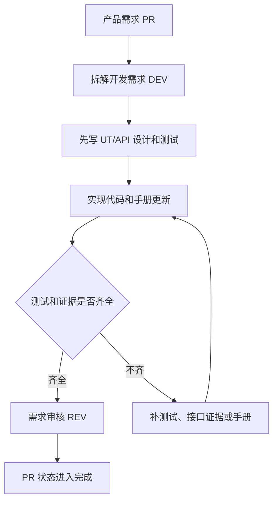

# 操作手册：需求管理

## 适用范围
需求从提出、拆解、开发、测试到验收的全过程。对应左侧菜单“需求管理”下的 5 张表。

## 入口
- ERP 左侧菜单：需求管理
- 表：产品需求表、开发需求表、单元测试表、API 测试表、需求审核表

## 流程图

## 标准操作
1. 在产品需求表新增 PR，写清业务目标、范围、验收口径和验收人。
2. 在开发需求表拆 DEV，颗粒度必须能独立实现、测试和验收。
3. 在单元测试表新增 UT，记录对应 DEV 的单测设计、预期和证据口径。
4. 在 API 测试表新增 API，优先使用 handler、curl 或脚本验证，不依赖 UI 点击。
5. 开发过程中同步更新对应操作手册。大功能没有手册时，先新建独立手册。
6. UT/API 通过后，把命令、关键日志、测试文件或提交记录写入证据。
7. 完成后在需求审核表新增 REV，由验收人按 REQUIREMENTS / ACCEPTANCE_TESTS 逐条确认。
8. 需求管理 5 张表底部统一显示总页数、当前页、跳转页和每页条数；筛选或切换表后从第一页重新查看。

## 结果校验
- PR、DEV、UT、API、REV 均能在 UI 中查到。
- UT/API 证据不是空白文字，能定位到命令、测试文件或接口响应。
- 涉及用户操作变化的需求，REV 证据包含操作手册路径。
- PR、DEV、UT、API、REV 表都能显示总页数、当前页、跳转页和每页条数。
- REV 通过后，关联 PR 才能进入 done。

## 常见问题
- 只有聊天记录没有入表：不算进入流程。
- 只有 UI 截图没有 API 证据：补 handler/API/curl 级验证。
- 做了新功能但手册未更新：DEV/REV 不应标完成。
- 大功能手册缺失：按 `orderapp-remote/docs/OP_MANUAL_<FEATURE>.md` 新建；不要在根目录新增第二份手册。
