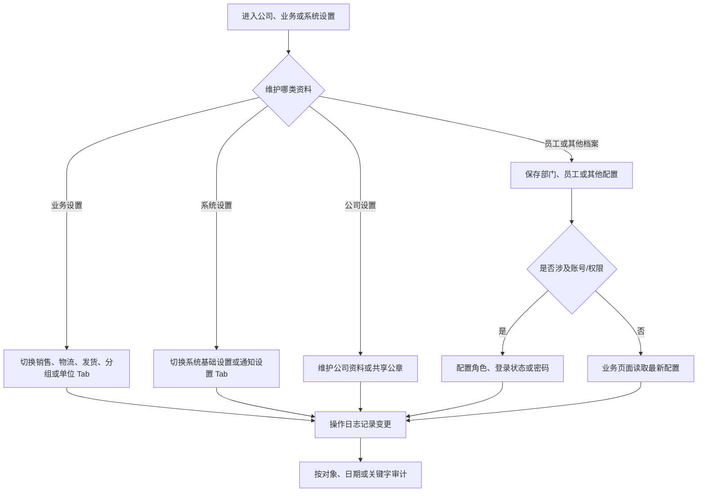

# 操作手册：设置与审计

## 适用范围
公司设置（公司资料、公章设置）、业务设置（销售单、物流、发货人、分组模板、全局单位字典）、系统设置（系统基础设置、通知设置）、部门维护、员工维护、操作日志。

## 入口
- 设置：公司设置、业务设置
- 系统：系统设置、部门维护、员工维护
- 档案：部门维护、员工维护
- 日志：操作日志

## 流程图

## 标准操作
1. 进入 `设置 / 业务设置`，按需切换五个 Tab：`销售单设置`、`物流设置`、`发货人设置`、`分组模板`、`全局单位字典`。切换 Tab 不会清空已保存配置。
2. 进入 `设置 / 公司设置`，在同一页面维护公司资料和共享公章资产；公章可上传、选择和去除浅色背景，销售单、出库单和合同盖章共用该资产。`销售单设置` 只维护销售单说明、收款方式和收款码。
3. `分组模板` 只维护模板名称、编码、排序、备注及大类/小类；商品、物料、BOM、仓库仍在各自业务页面选择模板和移动归类。`全局单位字典` 维护 kg、盒、箱等基础单位，供 SKU 单位模板和阶梯价模板引用；删除单位不回改历史单位模板、价格表、订单、BOM、工单和成本快照。
4. 进入 `系统 / 系统设置`，在 `系统基础设置` Tab 维护账号模式开关，在 `通知设置` Tab 维护业务事件的接收人和通知通道。“客户账户模式隐藏履约运营台”默认开启，只隐藏客户账户模式里的内部履约运营台入口，不删除页面或 API。
5. `设备产能配置` 不再出现在主菜单；既有设备产能数据和历史直达地址仍保留。本次入口整理不删除设备、工位、产能档或生产成本快照。
6. `代加工模板设置` 不再作为主菜单入口；历史直达地址和既有模板数据仍保留，避免旧流程或收藏链接失效。
7. 部门和员工维护用于权限、操作归属和审计追踪，新增员工后确认所属部门。
8. 操作日志用于查看用户触发的新增、修改、删除、提交、导入、发布、作废、调整、转仓、上传和状态变更记录，必要时按日期、类型或关键字过滤。
9. 操作日志列表底部显示总条数、总页数和当前页，支持跳转到指定页，并可切换每页显示条数；过滤条件变化后从第一页重新查询。
10. 员工小程序的管理员可在“个人中心”维护“分享图片时携带小程序入口”。这是全局系统设置，对所有员工之后直接分享的销售单、发货单图片生效；普通销售和客户账号看不到也不能修改。配置不存在时默认保持携带入口，管理员可按业务需要关闭。

## 员工权限与账号
- 员工维护页只面向内部用户；在“系统 / 员工维护”中维护员工资料、登录启停、密码和内部角色，菜单和 API 会按角色权限控制。
- 系统菜单不再提供独立“用户权限”入口；历史 `view=userPermissions` 链接会进入员工维护。
- 员工维护列表会过滤外部用户，不提供账号类型切换，也不出现渠道客户或客户业务角色。
- 外部用户如果需要登录客户侧系统，直接在客户门户配置的目标客户行创建账号、设置密码、启停登录。
- 客户能力在客户门户配置中选择模板；客户门户配置页同时维护外部用户，不再跳转到客户履约运营台管理账号。
- 在账号列切换可登录/已停用；停用后员工不能再登录，已有 Bearer 会话也不能继续访问。
- 未设置密码时按钮显示设置密码，已有密码时显示重置密码；密码至少 6 位，保存后账号自动恢复为可登录。
- `/login` 当前使用用户名或手机号加密码登录。真实短信发送通道尚未接入时，短信发送接口关闭并返回“服务不可用”，不会在页面或接口回显验证码，也不会按陌生手机号自动创建员工；员工初始密码、重置密码和登录启停由具备权限的管理员在“系统 / 员工维护”完成。
- 手机号是系统登录账号的唯一标识，内部员工和客户外部账号不能使用同一个手机号；新增或修改员工时如提示手机号已被占用，应先检查其他员工，再到客户门户配置检查客户外部账号。
- 系统顶部退出会注销当前会话、清除本机 token，并回到登录页。
- 账号启停、密码设置/重置和角色变更都会进入操作日志。
- 库存调整、批次成本修正、转仓、发布豆单、上传销售/合同资料等用户业务写操作也必须进入操作日志；如果业务数据已变化但操作日志查不到，应暂停继续批量操作并让管理员排查。
- 小程序图片分享入口设置保存后，操作日志按“系统设置”显示，菜单为“系统 / 小程序设置”，字段为“分享图片携带小程序入口”，并记录小程序员工、旧值和新值。配置更新与审计同事务提交；拒绝或保存失败不产生成功变更记录。

## 结果校验
- `设置 / 公司设置` 显示公司资料和公章设置，`设置 / 业务设置` 显示五个业务 Tab，`系统 / 系统设置` 显示系统基础和通知两个 Tab；主菜单不再重复显示这些子设置，也不显示代加工模板设置。
- 设置或模板保存后刷新页面仍能看到最新值。
- 系统基础设置保存后刷新仍保持开关状态；开启隐藏时客户账户模式不显示“履约运营台”，关闭时按原权限显示；业务设置的全局单位字典保存后可在 SKU 设置的单位模板中选择，删除后不再进入新候选。
- 相关业务页面使用的是最新配置。
- 关键变更能在操作日志中查到操作人、对象、时间和变更内容。
- 管理员从小程序个人中心开启或关闭图片分享入口后，刷新仍保持全局值；操作日志可按“小程序设置”或员工名检索对应旧值和新值。只读取设置或再次分享已有图片不新增业务日志。
- 按“库存调整单”筛选时，能看到库存数量调整和批次成本调整，旧值/新值显示调整前后数量或成本。
- 操作日志列表能显示总页数、当前页、跳转页和每页条数，翻页后仍保持日期、对象和关键字过滤。
- 员工、部门、模板不会出现重复或不可识别名称。
- admin 角色账号应拥有全权限菜单；非管理员只能看到自己角色允许的菜单。
- 外部用户登录后只进入绑定客户的客户工作台，不能通过员工维护获得内部员工菜单。

## 常见问题
- 配置保存后业务页面没变化：检查是否需要刷新、是否存在更高优先级配置。
- 分组模板 Tab 显示系统设置内容：确认从 `设置 / 业务设置 / 分组模板` 进入；旧 `view=groupTemplates` 地址仍直接打开兼容页面。历史 `设置 / 分组模板` 与 `设置 / 系统设置` 地址可用于排查旧链接。
- 客户账户模式仍看到履约运营台：进入 `系统 / 系统设置 / 系统基础设置`，确认“客户账户模式隐藏履约运营台”已开启，并刷新客户账户模式页面。
- 找不到原销售单、物流、发货人或全局单位入口：进入 `设置 / 业务设置` 后切换对应 Tab。
- 找不到通知配置：进入 `系统 / 系统设置 / 通知设置`。
- 找不到设备产能配置：主菜单入口已删除；生产工位和标准成本继续从生产管理相关页面维护，历史 `view=machines` 地址仅作为兼容入口保留。
- 全局单位字典删除后历史单据还显示该单位：这是预期行为；删除后不再展示，删除不等于失效，系统只保留历史业务快照，不回改历史记录。
- 找不到履约运营台：先确认是否处在客户账户模式且隐藏开关已开启；内部管理员正常模式仍可按权限进入客户履约下的履约运营台。
- 操作日志看不懂：优先用对象名称、订单号、商品名或客户名过滤。
- 员工无法归属操作：检查员工档案和登录上下文是否匹配。
- 修改员工手机号提示“该手机号已被其他员工或客户外部账号使用”：该号码已绑定其他登录账号；检查员工维护列表，或进入客户门户配置查找对应客户外部账号后再处理。
- 客户外部账号不在员工维护页：这是预期行为；进入客户门户配置，在目标客户行的“外部用户”区域维护。
- 小程序管理员保存开关后日志里查不到：按“小程序设置”、管理员姓名或“分享图片携带小程序入口”搜索；如果配置已变化但仍无日志，应暂停继续修改并排查事务/审计故障。
