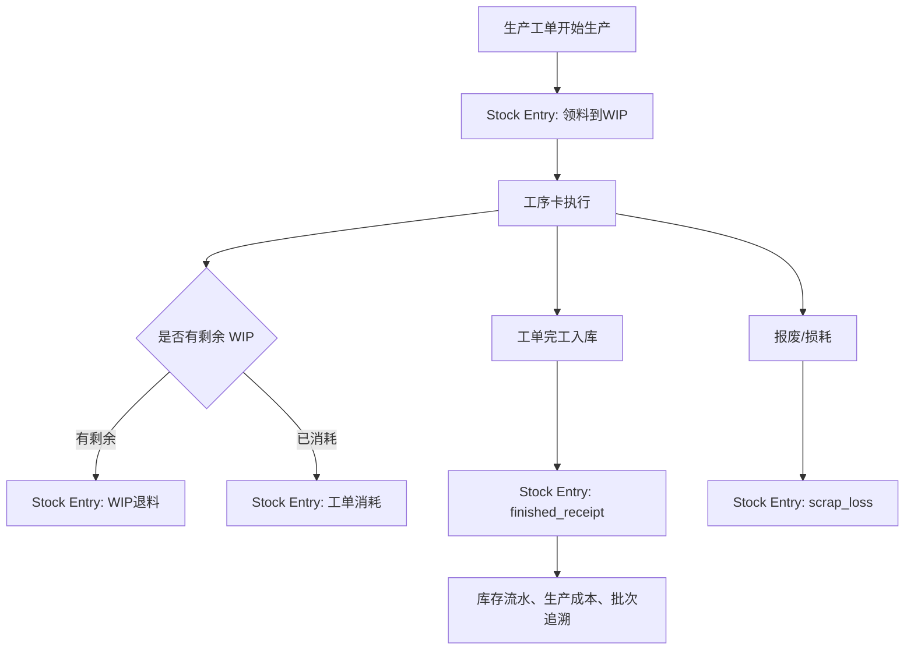

# 操作手册：库存作业与 Stock Entry

## 适用范围
库存作业、Stock Entry单据、WIP 领退、工单消耗、完工入库、报废/损耗和库存操作日志。

PR-479-MANUFACTURING-PHASE2-EXECUTION-COST-CLOSED-LOOP：二期开始，生产执行相关库存变更必须先形成 Stock Entry 业务单据，再关联库存流水、工单、工序卡、生产日志和操作日志。旧 WIP 领退入口保留兼容，新主入口是库存作业中的 `Stock Entry单据`。

## 入口
- 库存管理 / 库存作业 / `Stock Entry单据`
- 生产管理 / 生产工单：查看工单已领料、已消耗、可退料、工序进度和成本汇总
- 生产管理 / 工序卡：执行开始、暂停、继续、完成和保存实际
- 操作日志：按库存单据、工单、工序卡或关键字追溯用户触发写入

## 流程图

## 标准操作
1. 在生产工单开始生产后，进入库存作业 / `Stock Entry单据`。
2. PR-482-MANUFACTURING-PHASE3-MRP-SUGGESTIONS：排程工作台的 MRP 建议只展示采购建议和调拨建议，不会自动改变库存。看到调拨建议后，仍需回到库存作业创建 `领料到WIP` Stock Entry；看到采购建议后，按采购流程补货。
3. 选择 `领料到WIP`，填写工单 ID、工序卡 ID、物料 ID、物料名称、出库仓 `原料仓`、入库仓 `WIP在制仓`、数量和备注，提交后系统生成 Stock Entry 单据并写操作日志。
   - PR-503-PRODUCT-UNIT-TEMPLATE-MULTI-SALES-UOM / PR-505-SALES-SPEC-TEMPLATE-DERIVED-SKU：库存作业、WIP、完工入库和库存流水都按物料或商品的库存单位录入和展示。商品销售单位只在订单/价格表快照中冻结，不进入库存单据；子 SKU 的有效库存单位继承父 SKU，例如父 SKU 库存单位为 `kg` 时，该父 SKU 下自动派生的销售规格子 SKU 在库存和 BOM 侧都按 `kg` 展示。
4. 工序执行过程中，实际使用的 WIP 可通过 `工单消耗` 单据记录；剩余物料通过 `WIP退料` 单据退回原料仓。
5. 发生报废或生产损耗时，选择 `报废/损耗`，填写关联工单、工序卡、物料或商品、数量、原因和备注，便于后续成本拆解。
6. 工单完工时由生产工单页生成 `完工入库` / `finished_receipt` Stock Entry；通常不在库存作业手工重复创建完工入库单据。
7. 查询区可按单据类型、状态、工单 ID 查看历史 Stock Entry；列表展示单号、类型、工单/工序、数量、成本、状态、操作人、时间和备注。

## 结果校验
- 每个 `领料到WIP`、`WIP退料`、`工单消耗`、`完工入库`、`报废/损耗` 都能查到 Stock Entry 单号。
- 单据能关联到工单、工序卡或生产中记录，并能在操作日志查到对应操作人和时间。
- 生产工单页的已领料、已消耗、可退料和成本汇总与 Stock Entry、WIP 占用和生产成本页口径一致。
- 完工入库后，成品/半成品批次能追溯到工单、工序卡、物料批次和 Stock Entry。

## 常见问题
- 提交 Stock Entry 失败：检查单据类型、工单 ID、物料/商品 ID、数量和仓库方向。数量必须大于 0，领退方向必须符合单据类型。
- WIP退料后仍显示可退料：刷新生产工单和库存作业，确认是否还有其他 WIP 占用或工单消耗未记录。
- 完工入库失败：回到生产工单页检查必要工序是否完成、WIP 是否足够、质检是否冻结、工单是否已经完成。
- 成本拆解不对：检查 Stock Entry 单据数量和单位成本、工序卡实际数据、生产成本页中的物料成本和工序成本。
