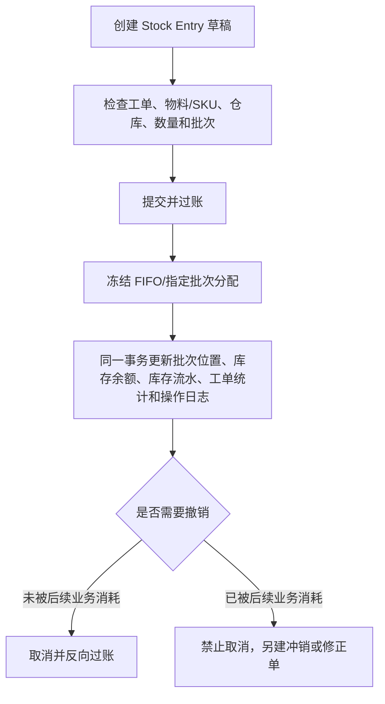

# 操作手册：库存作业与 Stock Entry

## 适用范围

库存单据、原料入库、物料发出、普通转仓、生产领料、补料、退回未用原料、生产消耗、完工入库、盘点调整、库存流水和操作日志。

PR-479-MANUFACTURING-PHASE2-EXECUTION-COST-CLOSED-LOOP：生产执行相关库存变更先形成 Stock Entry，再关联库存流水、工单、工序卡、生产日志和操作日志。历史版本把入口称为 `Stock Entry单据`，并把退回未用原料称为 `WIP退料`；PR-552 后统一显示为 `库存单据` 和 `退回未用原料`。

PR-509-E2E-RAW-MATERIAL-ORDER-PRODUCTION-FLOW：库存作业承接订单需求和生产工单，上游可追溯到原料入库，下游可追溯到完工后的成品或半成品批次。

PR-552-STOCK-ENTRY-CONVERGENCE：库存写入统一为 Stock Entry。库存作业只保留 `库存单据` 和 `盘点调整`；原 `WIP领退/转仓`、`原料入库`、`成品转仓` 独立写入入口不再使用。历史 MT、FT、原料入库和旧 Stock Entry 只读展示，不重新过账。

PR-559-PRODUCTION-CONFIG-WIP-ISSUE-UX：工单生产领料按冻结物料快照和当前 WIP 覆盖生成，一个单据自动带出全部短缺物料。抽屉显示真实工单号，不要求用户填写工序卡或“生产中”ID；每行只填写一个领用数量，库存单位由系统显示，生产领料不填写单位成本。

PR-482-MANUFACTURING-PHASE3-MRP-SUGGESTIONS：MRP 采购建议和调拨建议仍只做计划提示，不自动改变库存；确认建议后使用本手册的统一库存单据完成实际入库或转移。

## 入口

- 库存管理 / 库存作业 / `库存单据`
- 库存管理 / 库存作业 / `盘点调整`
- 库存管理 / 仓库库存：查看仓库余额；查看 WIP 时筛选 `WIP在制仓`
- 生产管理 / 生产工单 / 执行枢纽：生产领料、补料、退回未用原料、记录生产消耗、完工入库
- 操作日志：按库存单据、工单、工序卡或关键字追溯用户触发写入

## 统一流程

## 库存单据

1. 点击 `新建库存单据`，先选择单据目的：
   - `原料入库`：`material_receipt`
   - `物料发出/报废`：`material_issue`
   - `库存转仓`：`material_transfer`
   - `生产领料`：`material_transfer_for_manufacture`
   - `退回未用原料`：`material_transfer_for_manufacture + is_return=true`
   - `生产消耗`：`material_consumption_for_manufacture`
   - `完工入库`：`manufacture`
2. 选择物料或具体商品/SKU，核对库存单位、来源仓、目标仓和数量。生产用途必须关联生产工单；完工入库必须选择工单产出的具体商品规格。
3. 原料入库可同时填写供应商、产季、产地、产家风味描述、单位成本和批次备注。提交后生成一个 `SE-*`、原料批次及真实库存流水，不再另建平行原料入库流水。
4. 原料未指定批次时，系统按 FIFO 分配并在提交后冻结实际批次；指定批次时只使用该批次。冻结、拒收、停用或余额不足的批次不能提交。
5. 点击 `保存草稿` 只保存单据，不改变库存；点击 `提交并过账` 才改变库存。重复提交同一单据不会重复过账。
6. 已提交单据可以点击 `取消`。系统按原冻结批次反向过账；如果目标库存已经被后续消耗，系统拒绝取消，并提示另建冲销或修正单。
7. 列表中的“历史单据”仅供只读核对，不能从统一页面取消或改写。历史库存不自动重算、不自动补单。

## 生产工单快捷动作

1. 进入生产工单或工单执行枢纽，选择需要的动作：
   - `生产领料`：按当前物料缺口从原料仓转到 WIP 仓。
   - `补料`：按仍未领足的缺口生成预填内容。
   - `退回未用原料`：只显示该工单实际领入且尚未消耗/退回的批次余额，方向为 WIP 仓到原料仓。
   - `记录生产消耗`：只消耗该工单当前 WIP 可用量。
   - `完工入库`：带入工单产出商品/SKU、规格、计划产出和成品仓。
2. 快捷动作打开同一库存单据抽屉，并显示 `工单号：WO-...`。生产领料会一次带入全部当前短缺物料；物料、原料仓、WIP 仓和库存单位只读，每行只填写一个“领用数量”。可删除本次暂不处理的行，允许分批领料。
3. 首次领料默认当前剩余缺口；同一工单同一物料再次领料时，默认值不超过最近一次已提交领料量和当前剩余缺口。已有草稿时直接恢复草稿；已取消单据不作为数量记忆来源。
4. 保存草稿不改变库存。提交时系统重新检查物料属于该工单冻结需求、数量没有超过当前缺口、库存单位一致且原料仓库存充足；多物料任一行失败时整单不入账。
5. 工艺损耗记录在工序卡实际数据、完工单据和工单实际成本中，不使用盘点调整伪造损耗。

## 报废、副产品和盘点

- 实际丢弃原料或商品使用 `物料发出/报废`，填写报废原因；这会真实减少库存。
- 可回收副产品使用普通库存单据进入指定副产品仓或报废仓，不直接抹除库存。
- `盘点调整`只用于实物盘点差异、数量修正和批次成本修正，不作为仓库移动、领料、退料、生产消耗或工艺损耗入口。

## 结果校验

- 每次新库存写入只有一个 `SE-*`，不新增 `MT-*` 或独立成品转仓记录。
- 提交后，单据明细的冻结批次、仓库库存余额和库存流水 `before/change/after` 一致。
- 生产工单的已领料、已消耗、已退料和可退料与该工单 Stock Entry 及冻结批次一致。
- 原料入库、提交、取消、生产领退料、生产消耗和完工入库均可在操作日志查到操作者和时间。
- 完工入库后，具体成品/SKU 批次可以追溯到工单、物料批次和 Stock Entry。

## 常见问题

- 提交失败：检查单据目的、工单、物料或商品/SKU、数量、仓库方向和批次状态。数量必须大于 0，来源仓和目标仓不能相同。
- 退料提示跨工单或可退量不足：只能退回同一工单实际领入且尚未消耗/退回的批次，不能借用其他工单的 WIP。
- 提示库存被质检冻结：先完成质检复核或更换合格批次，系统不会跳过冻结状态。
- 取消提示已被后续消耗：不要修改历史流水；使用新的冲销/修正单并在备注中写明原 `SE-*`。
- WIP 数量不一致：到仓库库存筛选 WIP 仓，再按工单查询库存单据及其冻结批次；不要回到旧 WIP 写入页面补数据。
- 执行枢纽显示“WIP资料待完善”：该历史工单既没有冻结物料快照，也没有可兼容的物料占用。不要手工猜物料或单位，先由管理员核对工单来源数据。
- 领料数量超过剩余缺口：刷新工单预览，按当前剩余缺口调整；其他人刚提交的领料会改变可领上限。
- 完工入库失败：检查必要工序、生产消耗、质检、工单状态和产出 SKU 是否一致。
