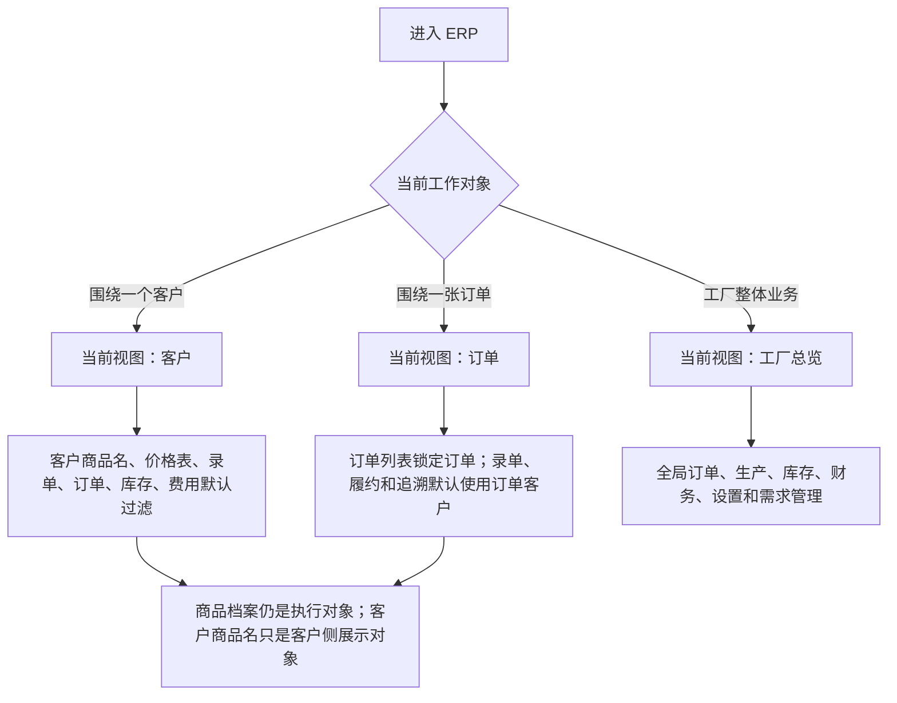

# 操作手册：视图上下文

## 适用范围
视图上下文用于在 ERP 顶部选择“当前视图”，例如工厂总览、客户：Karen、订单：SO-xxx / Karen。它只负责菜单呈现、页面默认过滤、URL 保留和跨页面参数传递；权限、客户隔离、商品、生产 BOM、价格和订单写入仍由后端接口校验。

## 入口
- 内部员工 ERP 顶部栏：当前视图。
- 可选视图：工厂总览、客户、订单。
- 客户视图：搜索并选择一个客户。
- 订单视图：搜索并选择一个订单，系统自动带出订单客户。
- 常用视图：可保存当前视图，后续从顶部下拉快速恢复；也可停用保存视图或恢复默认视图。
- 渠道客户账号登录：固定为绑定客户视图，不展示切换器，不能切到其他客户或订单。
- 旧链接兼容：历史 `workspace=customer&customer_id=...` 仍可打开，系统会转换为客户视图。

## 流程图

## 标准操作
1. 处理工厂整体运营时，保持“当前视图：工厂总览”。左侧菜单按订单销售、生产管理、库存管理、商品与配方、财务管理、设置、系统、需求管理展开。
2. 围绕某一个客户连续处理业务时，在“当前视图”选择“客户”，再搜索客户。页面会把该客户作为默认过滤带入商品管理、产品价格表、BOM、录单、订单列表、仓库库存、费用管理和客户履约。
3. 围绕某一张订单处理履约、补录、复制、追溯或生产关联时，在“当前视图”选择“订单”，再搜索订单号。订单视图会自动带入订单客户，订单列表只展示该订单，录单和履约页面默认使用订单客户上下文。
4. 需要经常处理同一客户或订单时，点击“保存当前视图”，填写名称，例如“Karen 履约视图”。保存、修改和停用保存视图都会写操作日志。
5. 点击“恢复默认视图”会回到工厂总览，不清除用户权限，也不修改业务数据。
6. 外部渠道客户账号登录后，系统固定为账号绑定客户，只能看到自己的工作台和费用相关入口；手动改 URL 指向其他客户或订单会被后端拒绝。
7. 商品管理在客户视图下默认进入“客户商品名”：客户商品名绑定商品档案，只维护客户对外名称、编号、品牌和展示分类，不直接编辑 BOM。
8. 产品价格表在客户视图下锁定“价格表归属”为当前客户；候选只来自该客户启用且纳入价格表的客户商品名。品牌名为空时不会自动填工厂品牌。
9. BOM 配方维护在客户视图下只作为商品筛选和跳转辅助；生产 BOM 仍属于商品档案，不属于客户商品名。
10. 录单在客户视图下默认选中当前客户；订单视图下默认使用该订单客户。保存订单时仍由后端校验客户商品名、商品档案、价格表和跨客户范围。
11. 生产计划和工单仍是工厂执行入口；客户或订单视图只提供过滤标签和追溯辅助，不把生产管理变成客户专属生产页面。

## 商品模型边界
- 商品档案：真实 SKU，用于库存、生产 BOM、成本、生产、成品批次和工单。
- 客户商品名：某客户名下对外展示的名称、编号、品牌和分类，绑定一个商品档案。
- 生产 BOM：商品档案的制造定义，维护物料组成和预期损耗/产出率。
- 产品价格表：按价格表归属客户读取客户商品名，发布时冻结客户商品名和商品档案双快照。
- 工厂自营：可作为一个客户维护客户商品名、价格表和订单，但执行侧仍使用商品档案和生产 BOM。

## 结果校验
- 顶部显示“当前视图”，而不是两个固定工作台按钮。
- 客户视图 URL 包含 `view_context=customer&customer_id=...`，旧 `workspace=customer&customer_id=...` 链接仍能恢复客户视图。
- 订单视图 URL 包含 `view_context=order&order_id=...`，并且页面参数带入订单客户。
- 客户视图进入商品管理时默认显示客户商品名；不能在客户商品名里直接编辑生产 BOM。
- 客户视图进入产品价格表时，价格表归属锁定为当前客户，预览卡片、生成抽屉、PDF/发布候选只包含当前客户客户商品名。
- 订单视图进入订单列表时只展示该订单；进入录单或履约链路时默认使用订单客户。
- 工厂总览仍能进入生产计划、生产中、工单、工序卡、生产质检和生产成本。
- 保存当前视图、修改保存视图、停用保存视图能在操作日志中查到 `view_context_preset` 记录。
- 外部渠道客户账号无法通过 URL 切到其他客户或其他客户订单；接口返回 403。
- 从客户视图恢复到工厂总览后，SKU设置 的内部归属也会回到公共SKU，SKU归属显示公共SKU。
- PR-338-CUSTOMER-SELECTOR-CLEAR-DROPDOWN-SPACING：客户选择控件已有客户值时，“清除选择”和“展开”有独立点击区域，不互相重叠。

## 常见问题
- 看不到某个入口：先检查账号权限。视图上下文只重排和过滤页面，不放大权限。
- 客户视图没有客户可选：确认客户已启用，并且账号有读取客户或履约客户的权限。
- 订单视图搜不到订单：确认订单未作废，并且当前账号有订单读取权限；外部客户账号只能看到绑定客户订单。
- 客户价格表内容不对：先确认当前视图客户，再检查该客户是否维护客户商品名并勾选“进入价格表”。
- BOM 看起来不是客户自己的：这是正常边界。BOM 属于商品档案；如果只是贴牌，多个客户商品名可以绑定同一个商品档案和生产 BOM。
- 需要生产排产、开工或质检：切回工厂总览，再进入生产管理。
