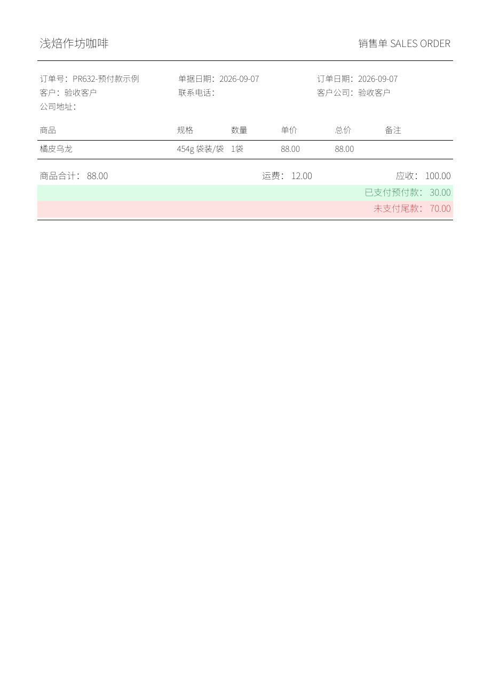

# PR-632 订单预付款与小程序列表复制

日期：2026-09-07；基线：origin/develop `7ad77274`；分支：`codex/order-prepayment-20260907`。

## 业务规则与实现

- 预付款为实际已付金额；必须大于零且小于订单最终应收金额。状态为“预付款（付款未完成）”。收齐后选择已付款，原预付款金额继续保留。
- 订单、客户结算汇总及小程序以同一金额口径显示；应收 100、预付 30 的已付/未付为 30/70，结清后为 100/0。
- 小程序员工订单列表的“复制订单”为卡片详情导航的独立按钮。复用已存在且受权限控制的订单复制流程，保留商品、BOM 规格、单价、数量、运费等，清空付款状态、收款方式和预付款。
- 普通销售单和组合销售单 PDF/PNG 显示绿色已付、红色尾款。付款更新取消当前文档标记，下次生成新版本；历史文件不删除，不批量重写历史订单。
- 新增订单字段默认 0；新增状态按名称幂等添加，原状态编号保持不变。旧小程序请求未传预付款时，编辑继续保留服务端付款信息。

## 验证证据

| 验证 | 结果 |
|---|---|
| RED：预付款领域规则、文档字段尚未实现 | 失败符合预期；`/tmp/pr632-red.log` |
| RED：网页提交预付款和小程序列表复制尚未实现 | 失败符合预期；`/tmp/pr632-front-red.log`、`/tmp/pr632-mini-red.log` |
| 真实 PostgreSQL + 订单 HTTP API | 通过；独立本地 PostgreSQL 16 的随机测试 schema；`TestPrepaymentOrderAPIStoresPartialPaymentAndBalances` 实际保存 30/100、校验付款状态、30/70 汇总及操作日志，拒绝零额/等额/超额/精度错误 |
| 结清与文档失效 | `TestPrepaymentSettlementValidationAndDocumentInvalidation` 通过：预付款不能切换未付款、不能降低应收到已付以下；重复失效不损失历史、不影响其他订单 |
| 小程序 API | 新请求传入实际预付款及收款方式；旧请求编辑保留服务端收款数据；显式结清状态不被旧隐藏字段逻辑覆盖 |
| 小程序复制 | 保留商品、BOM 规格、单价、数量、运费；日期更新，付款状态/方式/预付款重置；列表独立按钮不打开详情 |
| PDF / PNG | 实际渲染通过并人工检查图像：绿色预付款 30、红色尾款 70，金额一致，无重叠、截字；原文件 `/tmp/pr632-artifacts/prepayment.pdf`、`prepayment.png` |

## 自动检查汇总

- 全部 Go 包通过；Vue 1079/1079 通过且 Vite 构建成功。
- 小程序 229/229 通过，TypeScript 检查与 development 微信包构建成功。
- 真实 PostgreSQL 预付款 API/仓储及销售单快照/生成测试通过。
- 统一 changed 检查通过。既有 Vite 大文件提示不影响构建。

## 发布与验收边界

本次开发默认目标为 development；通过统一检查后合入 develop、部署开发环境并导出开发小程序包。生产发布与微信正式版上传状态单独记录。未改动现有业务订单进行浏览器录单验收，独立数据库验收数据自动清理。产品验收待 Van。
