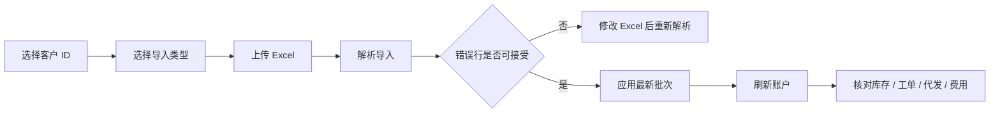

# 客户履约账户用户手册

适用范围：代加工客户、客户自有 SKU、客户托管生豆/包材/成品库存、一件代发订单、运费/代发费/月结费用管理。

## 1. 常用入口

| 菜单 | 用途 |
| --- | --- |
| 客户管理 -> 客户履约账户 | 选择客户，导入代加工工单、代发清单和结算单，查看客户库存、工单、代发订单、费用和月结 |
| 客户门户配置 | 维护客户小程序能力、代加工仓库、默认寄件人等客户履约基础配置 |
| 商品与配方 -> 产品设置 | 维护公共产品和客户专属 SKU；客户专属 SKU 不进入其他客户或公共产品选择范围 |
| 库存管理 -> 仓库库存 | 查看客户代加工仓、客户成品库存和库存流水 |
| 订单销售 -> 订单列表 | 查看由代发导入形成的客户订单和后续发货状态 |

## 2. 先准备客户资料

在第一次导入某个代加工客户前，先确认这些资料：

| 资料 | 说明 |
| --- | --- |
| 客户档案 | 客户必须已经在客户档案中存在，后续导入都绑定这个客户 ID |
| 客户能力 | 客户门户配置中启用代加工、托管库存、代发、结算等能力 |
| 客户仓库 | 代加工客户应有独立代加工仓，避免客户成品和棵凡自营库存混在一起 |
| 默认寄件人 | 代发订单需要寄件人时，优先使用客户配置里的默认寄件人 |
| 客户 SKU | 客户自己的产品作为客户专属 SKU 管理，不放进公共产品列表 |
| 包材和生豆 | 客户自购和向棵凡购买的包材、生豆都按客户托管资源记录，费用口径独立 |

客户 A 要使用客户 B 的产品时，不要直接共用客户 B 的 SKU。应复制成客户 A 自己的 SKU，再维护 BOM、库存和价格。

## 3. 页面结构

入口：`客户管理 -> 客户履约账户`

页面分三块：

| 区域 | 用途 |
| --- | --- |
| 顶部客户区 | 输入客户 ID，点击“载入账户”查看该客户数据 |
| 导入区 | 选择导入类型，上传 Excel，先“解析导入”，确认无明显错误后再“应用最新批次” |
| 数据区 | 查看导入批次、托管库存、加工工单、代发订单、费用明细和结算批次 |

## 4. 三类 Excel 怎么选

| 导入类型 | 适用文件 | 导入后影响 |
| --- | --- | --- |
| 代加工工单 | 客户共享的代加工工单、物料库存、完成情况表 | 维护托管生豆、包材、客户 SKU、加工工单、包装任务、成品库存和相关费用 |
| 代发清单 | 客户每天发送的代发订单表 | 创建客户代发订单、收件人快照、商品明细、代发服务费和后续发货依据 |
| 结算单 | 每月结算代加工费、运费、代发费、仓储费等的表 | 导入或生成费用明细和结算批次，便于月结对账 |

一个 Excel 只按一种类型导入。不要把代发清单按代加工工单导入。

## 5. 标准导入流程

操作步骤：

1. 输入客户 ID。
2. 点击“载入账户”。
3. 在导入类型中选择：代加工工单、代发清单或结算单。
4. 选择客户给的 Excel 文件。
5. 点击“解析导入”。
6. 查看有效行、错误行、工单数、代发订单数和费用明细数。
7. 如有错误行，先看错误提示。字段缺失、数量格式异常或表头不匹配时，先修 Excel 再重新解析。
8. 确认解析结果后，点击“应用最新批次”。
9. 点击“刷新”，查看导入后的业务数据。

“解析导入”只保存导入批次和行级结果，不改变客户库存、订单或费用。“应用最新批次”才会写入业务数据。

## 6. 代加工工单导入后怎么核对

导入并应用后，重点看这些区域：

| 区域 | 核对内容 |
| --- | --- |
| 托管库存 | 生豆、包材、客户成品是否按客户独立记录；数量是否和共享表余额方向一致 |
| 加工工单 | 工单号、工单日期、产品名、计划数量、完成状态是否正确 |
| 费用明细 | 烘焙费、磨粉费、包装费、新品测试费、仓储费、包材费是否进入客户费用 |
| 结算批次 | 如果本次文件包含月结信息，核对结算期间和金额 |

同一个客户的同一个文件重复导入时，系统会按文件内容做幂等控制，避免同一批数据重复应用。文件内容改过后，会形成新的导入批次。

## 7. 代发清单导入后怎么核对

导入并应用后，重点看这些区域：

| 区域 | 核对内容 |
| --- | --- |
| 代发订单 | 外部订单号、收件人、电话、地址、商品、数量是否正确 |
| 费用明细 | 代发服务费、运费是否按客户规则或导入金额记录 |
| 订单列表 | 后续发货时，订单应能进入正常发货流程，并保留客户归属 |

代发下游收件人只作为订单收件人快照保存，不会新增为客户档案。

## 8. 结算单和月结

入口仍是 `客户管理 -> 客户履约账户`。

生成月结：

1. 输入客户 ID 并载入账户。
2. 填写结算开始日期和结算结束日期。
3. 点击“生成月结”。
4. 在结算批次中核对结算编号、期间、金额和状态。

建议每月结算前先做这些检查：

| 检查项 | 说明 |
| --- | --- |
| 工单是否都应用 | 当月加工工单先完成导入和应用 |
| 代发是否都应用 | 当月代发清单先完成导入和应用 |
| 运费是否完整 | 快递月结金额或导入金额要能追到订单 |
| 仓储费和测试费 | 单独收费项目要在费用明细中出现 |
| 包材口径 | 客户自购包材和向棵凡购买包材要分清 |

月结金额用于和客户对账。正式开票、收款和财务记账仍按财务流程复核。

## 9. 常见问题

| 问题 | 处理方式 |
| --- | --- |
| 页面没有客户数据 | 确认客户 ID 是否正确，客户档案是否存在，是否已点击“载入账户” |
| 解析后有错误行 | 先看错误行提示，检查表头、日期、数量、金额、产品名和空行 |
| 上传错类型 | 不要应用该批次，改选正确类型后重新上传解析 |
| 点击应用后数据没变 | 先刷新账户；再确认最新批次状态是否已应用、有效行是否大于 0 |
| 同一文件重复导入 | 系统会识别同一客户、同一类型、同一文件内容，避免重复应用 |
| 客户产品找不到 | 先确认该产品是否作为当前客户专属 SKU 维护，不能直接使用其他客户 SKU |
| 费用金额不对 | 先核对导入表金额，再核对费用明细中的费用类型和结算期间 |

## 10. 验收检查

- 客户 ID 能载入客户履约账户。
- 三类 Excel 都能先解析，解析结果能显示有效行和错误行。
- 解析失败不会改变客户库存、订单或费用。
- 应用代加工工单后，能看到托管生豆、包材、客户成品、加工工单和相关费用。
- 应用代发清单后，能看到代发订单、收件人快照、商品明细和代发服务费。
- 应用结算单或生成月结后，能看到结算批次和费用汇总。
- 客户专属 SKU 不进入公共产品列表，也不会被其他客户误选。
- 重复应用同一批次不会重复增加库存、订单或费用。
