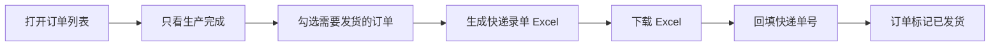

# 订单列表用户手册

## 快递处理流程

## 操作要点

| 区域 | 操作 |
| --- | --- |
| 筛选 | 使用订单号、客户、日期、收款、发货、生产状态缩小列表范围。 |
| 只看生产完成 | 点击后切到生产完成订单，便于集中处理发货。 |
| 勾选发货 | 只有生产完成的订单可勾选；未完成订单需要先走完生产流程。 |
| 默认寄件人 | 默认使用发货人设置中的默认寄件人；如本次发货整体从门店或其他地址寄出，可先在顶部下拉框选择寄件人。 |
| 单独寄件人 | 勾选订单后，该行会出现寄件人下拉框；选择“跟随默认”则使用顶部默认寄件人，也可以只给某几单单独指定寄件人。 |
| 快递 Excel | 勾选一个或多个订单后生成录单 Excel；收件人来自客户档案，寄件人按每行订单的单独选择优先，否则使用本次默认寄件人。 |
| 发货批次 | 生成 Excel 后系统会创建发货批次号，页面显示批次号和本批订单的快递单号输入框。 |
| 回填单号 | 在发货批次下输入快递单号并提交，系统会把对应订单更新为“已发货”，并写入订单快递单号。 |
| 回传 Excel | 顺丰后台导出的“寄件列表”可直接上传；系统读取运单号，并从备注中的订单号匹配订单回填单号。 |
| 模板字段 | 包裹件数固定为 1，托寄物默认茶叶，重量为 0.1kg，备注为订单号、商品名、规格和数量。 |
| 销售单 | 每行“销售单”进入该订单销售单页面，可生成正式销售单 PDF 或 PNG 图片，并分别保留历史版本。 |
| 出库单 | 订单状态为已发货后，点击“出库单”维护出库日期、出库仓、发货方式、快递单号和备注，预览确认后生成 PDF。 |

## 验收检查

- 录单保存后不会自动生成快递 Excel。
- 订单列表能筛选生产完成订单。
- 生产完成订单可勾选并生成快递录单 Excel。
- Excel 每个订单占一行，备注包含订单号、商品名、规格和数量，不包含单价和小计。
- 发货人设置可以维护多个寄件人，并有一个默认寄件人。
- 同批勾选订单中，未单独选择的订单使用默认寄件人，已单独选择的订单在 Excel 对应行使用该寄件人。
- 生成快递 Excel 后能看到发货批次号；回填快递单号后订单列表展示单号，发货状态变为已发货。
- 上传顺丰寄件列表回传 Excel 后，备注中带订单号的行会自动回填运单号。
- 订单列表每行可进入销售单页面，销售单 PDF 和图片重复生成都会保留旧版本。
- 已发货订单可打开出库单抽屉，出库单预览不会新增版本，确认生成后可下载最新版或历史版本 PDF。
