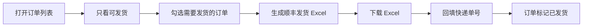

# 订单列表用户手册

## 顺丰发货流程

## 操作要点

| 区域 | 操作 |
| --- | --- |
| 筛选 | 使用订单号、客户、日期、收款、发货、生产状态缩小列表范围。 |
| 只看可发货 | 点击后切到生产完成、无需生产和库存待发货订单，便于集中处理发货。 |
| 勾选发货 | 只有生产完成、无需生产或库存待发货的订单可勾选；未完成订单需要先走完生产流程或确认使用库存批次。 |
| 默认寄件人 | 默认使用发货人设置中的默认寄件人；如本次发货整体从门店或其他地址寄出，可先在顶部下拉框选择寄件人。 |
| 订单抽屉 | 点击订单号打开订单抽屉，可查看快递信息、收款状态、发货状态、生产状态和发票状态。 |
| 订单编辑 | 在订单抽屉内直接修改订单信息和商品明细并保存；列表和抽屉不再提供单独“编辑”跳转。 |
| 单独寄件人 | 打开订单抽屉后，在“快递信息”中直接选择寄件人；默认跟随顶部“本次寄件人”，改为具体寄件人后该订单生成 Excel 时优先使用该寄件人。 |
| 顺丰发货 Excel | 勾选一个或多个订单后生成顺丰发货 Excel；收件人来自客户档案，寄件人按每行订单的单独选择优先，否则使用本次默认寄件人。 |
| 列表展示 | 列表把寄件人和快递单号合并为“快递信息”，把收款、发货、生产、发票合并为“订单状态”。 |
| 发货批次 | 生成 Excel 后系统会创建发货批次号，页面展示下载入口；不再在订单列表顶部展示批次单号输入框。 |
| 回填单号 | 点击订单号，在订单抽屉内输入快递单号并回填；系统会把该订单更新为“已发货”，并写入订单快递单号。 |
| 库存扣减 | “库存待发货”订单生成顺丰发货 Excel 时不扣库存；回填快递单号变成“已发货”时，系统扣减已预留的 `FP-...` 批次或 `LEGACY-FP-...` 库存余额并写库存流水，重复回填不会重复扣。 |
| 回传 Excel | 顺丰后台导出的“寄件列表”可直接上传；系统读取运单号，并从备注中的订单号匹配订单回填单号。 |
| 模板字段 | 包裹件数固定为 1，托寄物默认茶叶，重量为 0.1kg，备注为订单号、商品名、规格和数量。 |
| 销售单 | 每行“销售单”进入该订单销售单页面，可生成正式销售单 PDF 或 PNG 图片，并分别保留历史版本。 |
| 出库单 | 订单状态为已发货后，点击“出库单”维护出库日期、出库仓、发货方式、快递单号和备注，预览确认后生成 PDF。 |
| 出库日志 | 进入库存管理 -> 出库日志，可集中查看已生成的出库单，直接打开出库单抽屉或下载 PDF。 |

## 验收检查

- 录单保存后不会自动生成快递 Excel。
- 订单列表能筛选生产完成、无需生产和库存待发货订单。
- 生产完成、无需生产或库存待发货订单可勾选并生成顺丰发货 Excel。
- Excel 每个订单占一行，备注包含订单号、商品名、规格和数量，不包含单价和小计。
- 发货人设置可以维护多个寄件人，并有一个默认寄件人。
- 同批勾选订单中，未在订单抽屉单独选择寄件人的订单使用默认寄件人，已单独选择的订单在 Excel 对应行使用该寄件人。
- 生成快递 Excel 后能看到下载入口；在订单抽屉回填快递单号后，订单列表展示单号，发货状态变为已发货。
- 库存待发货订单回填快递单号后，对应成品库存减少且库存流水出现 `sales_order_shipment` 出库记录；再次回填同一订单不会再次扣库存。
- 上传顺丰寄件列表回传 Excel 后，备注中带订单号的行会自动回填运单号。
- 订单列表每行可进入销售单页面，销售单 PDF 和图片重复生成都会保留旧版本。
- 已发货订单可打开出库单抽屉，出库单预览不会新增版本，确认生成后可下载最新版或历史版本 PDF。
- 库存管理的出库日志能列出已生成出库单，并支持查看和下载出库单。
